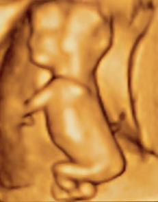

# PROPEDÊUTICA DO PRÉ-NATAL

Para começar nosso estudo, você precisa entender que a propedêutica pré-natal não é apenas uma lista de exames. É o momento em que transformamos uma mulher saudável em uma gestante monitorada, garantindo que qualquer desvio da normalidade seja detectado precocemente. Nas provas de residência, o examinador quer saber se você sabe identificar esses desvios e, principalmente, se você conhece os marcos cronológicos de cada intervenção.

*Figura 1 - Ultrassonografia 3D de feto com cerca de 7,6 cm. A USG é exame fundamental na propedêutica pré-natal para datação gestacional, avaliação morfológica e rastreio de aneuploidias. Fonte: Biagio Azzarelli, CC BY-SA 2.0 | Wikimedia Commons*

## Diagnóstico de Gravidez: Sinais e Sintomas

O diagnóstico de gravidez é dividido classicamente em três grupos de sinais. As bancas adoram trocar os conceitos de "probabilidade" por "certeza". Memorize o seguinte: a certeza só vem quando você ouve ou sente o feto, ou quando visualiza o esqueleto no exame de imagem.

### Sinais de Presunção

Estes são sinais sistêmicos ou mamários que a paciente relata ou que você observa, mas que podem ocorrer em outras condições.

- **Amenorreia:** É o sinal mais clássico, mas lembre-se que estresse ou anovulação também causam.

- **Náuseas e vômitos:** Comuns no primeiro trimestre devido ao pico de hCG.

- **Polaciúria:** No início, ocorre por compressão vesical pelo útero que ainda é pélvico.

- **Sinal de Hunter:** Aqui temos uma pérola clínica. É o aparecimento da aréola secundária, com limites imprecisos, além da hiperpigmentação da aréola primária.

- **Rede de Haller:** Visualização da rede venosa mamária por transparência.

### Sinais de Probabilidade

Estes sinais referem-se a alterações no útero, vagina e vulva.

- **Sinal de Hegar:** É o amolecimento do istmo uterino. Ao toque bimanual, parece que o corpo do útero está separado do colo.

- **Sinal de Chadwick (ou Kluge):** Coloração violácea da mucosa vaginal e do colo uterino devido à congestão venosa.

- **Sinal de Puzos:** É o rechaço fetal intrauterino percebido ao toque vaginal a partir de 14 semanas.

- **Sinal de Nobile-Budin:** Preenchimento dos fundos de saco vaginais pelo útero gravídico.

### Sinais de Certeza

Aqui não há dúvida. Se estiver presente, a paciente está grávida.

- **Sinal de Puzzos (Rechaço fetal):** Atenção, alguns autores o colocam como probabilidade, mas a percepção de partes fetais ou movimentos fetais pelo examinador (não pela mãe!) é certeza.

- **Ausculta de BCF:** Com Doppler a partir de 10 a 12 semanas; com Pinard a partir de 18 a 20 semanas.

- **Percepção de movimentos fetais:** Pelo médico, geralmente após 18 a 20 semanas.

| Categoria | Exemplos Principais | O que a banca pergunta |
| --- | --- | --- |
| **Presunção** | Atraso menstrual, náuseas, Sinal de Hunter | "Paciente refere..." ou sinais mamários. |
| **Probabilidade** | Sinal de Hegar, Chadwick, Nobile-Budin | Alterações anatômicas do trato genital. |
| **Certeza** | Ausculta de BCF, percepção de movimentos pelo médico | "Ao exame físico, o médico notou..." |

## Data da Última Menstruação (DUM) e Idade Gestacional

Saber calcular a Idade Gestacional (IG) e a Data Provável do Parto (DPP) é o "arroz com feijão" da obstetrícia. Se você errar isso, errará todo o seguimento.

### Regra de Naegele

Para calcular a DPP, somamos 7 dias ao primeiro dia da DUM e subtraímos 3 meses (ou somamos 9 meses, se o mês for janeiro, fevereiro ou março).

- **Exemplo:** DUM 10/05/2023.

- 10 + 7 = 17.

- Maio (05) - 3 = Fevereiro (02).

- DPP = 17/02/2024.

**Cuidado:** Se a soma dos dias ultrapassar o número de dias do mês, você deve passar o excedente para o mês seguinte. Se a DUM for 28/03, a DPP será 04/01 do ano seguinte (28+7 = 35; março tem 31 dias, sobram 4 para abril; abril - 3 meses = janeiro).

### A Ultrassonografia (USG) como fiel da balança

Quando a DUM é incerta ou há discrepância entre o exame físico e a data informada, a USG de primeiro trimestre é o parâmetro mais fidedigno.

- **Até 12 semanas:** O Comprimento Cabeça-Nádega (CCN) é o parâmetro mais preciso, com margem de erro de apenas 5 dias.

- **Após 12 semanas:** Usamos o Diâmetro Biparietal (DBP) e o comprimento do fêmur, mas a precisão cai conforme a gestação avança.

Como o Dr. Will sempre reforça em nossas discussões no MedEvo, se houver uma diferença maior que 7 dias entre a DUM e a USG de primeiro trimestre, a conduta correta é datar a gestação pela USG. Não insista na DUM se a imagem diz o contrário.

## Classificação de Paridade: O Código G/P/A

As bancas adoram colocar casos clínicos onde você precisa classificar a paciente. O sistema mais usado no Brasil é o G P A (Gesta, Para, Aborto).

- **Gesta (G):** Número total de gestações, incluindo a atual, abortos e partos.

- **Para (P):** Número de partos realizados com mais de 20 semanas (ou feto > 500g). Não importa se nasceu vivo ou morto.

- **Aborto (A):** Perdas gestacionais ocorridas antes de 20 semanas (ou feto < 500g).

**Pérola de Prova:** Gemelaridade conta como UMA gestação e UM parto para fins de G e P, mas o número de recém-nascidos é registrado separadamente. Se uma mulher teve um parto de gêmeos e está grávida agora, ela é G2 P1.

## Exame Físico Obstétrico: A Arte de Palpar

O exame físico não serve apenas para preencher prontuário. Ele é a nossa principal ferramenta para suspeitar de Restrição de Crescimento Intrauterino (RCIU) ou Macrossomia.

### Altura do Fundo Uterino (AFU)

A medida deve ser feita da borda superior da sínfise púbica até o fundo do útero.

- **12 semanas:** O útero deixa de ser um órgão pélvico e torna-se abdominal, sendo palpável logo acima da sínfise púbica.

- **20 semanas:** O fundo uterino atinge a cicatriz umbilical. Esta é uma questão onipresente em provas.

- **Entre 20 e 32 semanas:** Espera-se que a AFU em centímetros seja aproximadamente igual à IG em semanas.

**O que fazer com discrepâncias?**
Se você encontra uma gestante de 18 semanas com AFU de 25 cm, a principal suspeita é erro de data (DUM errada). Outras causas incluem gestação gemelar, polidrâmnio ou miomatose uterina. Por outro lado, se a IG é de 29 semanas e a AFU é de 22 cm (discrepância > 3 cm), você deve obrigatoriamente suspeitar de RCIU ou oligoâmnio e solicitar uma USG para avaliação.

### Manobras de Leopold

Servem para determinar a estática fetal. São quatro tempos:

- **1º Tempo (Situação):** Palpa-se o fundo uterino para identificar se o feto está em situação longitudinal ou transversa.

- **2º Tempo (Posição):** Palpa-se o dorso fetal. Isso ajuda a localizar onde o BCF será melhor ouvido (no lado do dorso).

- **3º Tempo (Apresentação/Insinuação):** Com o polegar e o indicador, palpa-se a parte fetal que está na entrada da pelve (geralmente a cabeça). Avalia-se a mobilidade (se está "alto e móvel" ou "insinuado").

- **4º Tempo (Insinuação/Desprendimento):** O examinador fica de costas para a face da paciente e palpa a escava pélvica para confirmar o grau de insinuação.

## Avaliação Nutricional e Ganho de Peso

O ganho de peso não é igual para todas. Ele depende do IMC pré-gestacional. Errar a orientação nutricional pode levar ao diabetes gestacional ou à RCIU.

| IMC Pré-gestacional (kg/m²) | Classificação | Ganho Total Recomendado (kg) | Ganho no 2º e 3º Tri (kg/semana) |
| --- | --- | --- | --- |
| < 18,5 | Baixo Peso | 12,5 a 18,0 | 0,5 |
| 18,5 - 24,9 | Peso Adequado | 11,5 a 16,0 | 0,4 |
| 25,0 - 29,9 | Sobrepeso | 7,0 a 11,5 | 0,3 |
| ≥ 30,0 | Obesidade | 5,0 a 9,0 | 0,2 |

**Nota importante:** A obesidade (IMC > 30) é um fator de risco para pré-eclâmpsia e diabetes, mas, segundo protocolos do Ministério da Saúde, a obesidade isolada pode ser acompanhada na Atenção Básica, desde que não haja outras comorbidades associadas. No entanto, se o IMC for > 35 ou 40, o rigor no encaminhamento para o alto risco aumenta.

## Rotina de Exames Laboratoriais: O Calendário de Ouro

O Ministério da Saúde e a FEBRASGO estabelecem uma rotina mínima. Para a prova, você deve saber o que pedir em cada trimestre.

### Primeiro Trimestre (ou na primeira consulta)

- **Tipagem Sanguínea e Fator Rh:** Se Rh negativo, solicitar Coombs Indireto.

- **Hemograma:** Rastreio de anemia (Hb < 11 g/dL é anemia na gestação).

- **Glicemia de Jejum:** Se ≥ 92 mg/dL e < 126 mg/dL, diagnostica-se Diabetes Gestacional (DMG) já no primeiro trimestre.

- **VDRL:** Rastreio de sífilis.

- **Anti-HIV:** Rastreio de HIV.

- **HBsAg:** Rastreio de Hepatite B (não peça Anti-HBs para rastreio inicial).

- **Toxoplasmose (IgG e IgM):** Se IgG(-) e IgM(-), a paciente é suscetível e deve repetir o exame trimestralmente.

- **Urina tipo 1 e Urocultura:** Rastreio de bacteriúria assintomática (deve ser tratada sempre na gestante).

- **Citologia Oncótica:** Segue as mesmas regras de mulheres não grávidas, mas se houver HSIL/NIC III, a conduta é colposcopia e postergar tratamento para o puerpério.

### Segundo Trimestre (24 a 28 semanas)

- **TOTG 75g:** O exame mais importante deste período. Realizado entre 24 e 28 semanas para todas as gestantes que não tiveram diagnóstico de DM no primeiro trimestre.

- **Repetir VDRL e HIV:** Em algumas diretrizes.

- **Coombs Indireto:** Se a mãe for Rh negativo e o pai Rh positivo (ou desconhecido).

### Terceiro Trimestre (a partir de 28 semanas)

- **Repetir:** Hemograma, Glicemia de jejum, VDRL, HIV, HBsAg, Toxoplasmose (se suscetível), Urina e Urocultura.

- **Cultura para GBS (Streptococcus do Grupo B):** Coleta de swab vaginal e retal entre 35 e 37 semanas.

| Exame | Valor de Referência / Conduta | Observação de Prova |
| --- | --- | --- |
| **Glicemia Jejum** | < 92 mg/dL (Normal) | ≥ 92 e < 126 = DMG |
| **Hb (Hemoglobina)** | ≥ 11 g/dL (Normal) | < 11 = Anemia leve/moderada |
| **VDRL** | Deve ser não reagente | Se reagente, tratar com Penicilina Benzatina |
| **Urocultura** | > 100.000 UFC/mL | Tratar mesmo se assintomática |

## Suplementação e Vacinação

### Ácido Fólico e Ferro

- **Ácido Fólico (0,4 mg/dia):** Deve começar idealmente 3 meses antes da concepção e manter até 12 a 16 semanas. Previne defeitos do tubo neural. Se a paciente tiver antecedente de filho com defeito do tubo neural ou usar anticonvulsivantes, a dose sobe para 4 mg/dia.

- **Ferro (40 a 60 mg de ferro elementar/dia):** Iniciado geralmente (40mg/dia) a desde o início da gestação para todas as gestantes até 3 meses pós parto. Se Hb < 11, a dose é de tratamento (120 a 200 mg de ferro elementar).

### Vacinação na Gestação

Este é um tema quente. A gestante NÃO pode tomar vacinas de vírus vivo atenuado (como Rubéola, Sarampo, Caxumba, Febre Amarela - esta última avalia-se risco/benefício).

- **Influenza:** Uma dose em qualquer época da gestação.

- **Hepatite B:** Três doses, se não vacinada previamente.

- **dT (Dupla Adulto):** Completar o esquema de 3 doses.

- **dTpa (Tríplice Acelular):** Uma dose em CADA gestação, a partir da 20ª semana (idealmente entre 27 e 36 semanas). O objetivo é a transferência transplacentária de anticorpos contra a coqueluche para proteger o RN nos primeiros meses de vida.

## Situações Especiais e Manejo Clínico

### Sífilis na Gestação

Se o VDRL for positivo, o tratamento de escolha é a Penicilina Benzatina. Por que não usamos outros antibióticos? Porque a penicilina é a única que atravessa a barreira placentária de forma eficaz para tratar o feto.
**Pérola Clínica:** Se a gestante for alérgica à penicilina, a conduta obrigatória é a dessensibilização em ambiente hospitalar e posterior tratamento com penicilina. Não aceite eritromicina ou ceftriaxone como "tratamento adequado" para fins de prevenção de sífilis congênita.

### Toxoplasmose

Se a paciente apresenta IgG(-) e IgM(+), ou se houve soroconversão (IgG que era negativo vira positivo), estamos diante de uma infecção aguda.

- **Conduta inicial:** Iniciar Espiramicina imediatamente (ela não trata o feto, mas diminui a transmissão placentária em 50%).

- **Próximo passo:** Realizar amniocentese (após 18 semanas) para PCR do líquido amniótico. Se o feto estiver infectado, troca-se a Espiramicina pelo esquema tríplice (Sulfadiazina + Pirimetamina + Ácido Folínico).

### Diabetes Gestacional (DMG)

O diagnóstico mudou nos últimos anos. Se a glicemia de jejum no 1º trimestre for ≥ 92, já é DMG. Se for < 92, fazemos o TOTG 75g entre 24-28 semanas.

- **Critérios TOTG 75g:**

- Jejum: ≥ 92 mg/dL

- 1 hora: ≥ 180 mg/dL

- 2 horas: ≥ 153 mg/dL
Basta UM valor alterado para o diagnóstico.

## Frequência das Consultas e Referenciamento

O pré-natal de qualidade exige um número mínimo de 6 consultas (MS). A cronologia clássica que cai em prova é:

- Até 28 semanas: Mensal.

- Entre 28 e 36 semanas: Quinzenal.

- De 36 semanas até o parto: Semanal.

**Quando encaminhar para o Alto Risco?**
Não confunda fatores de risco social com risco clínico. Uma mãe solteira ou adolescente, por si só, não é "alto risco" clínico, mas sim "risco habitual com vulnerabilidade". O alto risco é reservado para patologias como:

- Cardiopatias graves.

- Diabetes pré-gestacional ou DMG com necessidade de insulina.

- Hipertensão arterial crônica ou Pré-eclâmpsia.

- Doenças autoimunes (Lúpus, SAF).

- Histórico de óbito fetal de causa indeterminada.

- Gemelaridade (em alguns serviços).

Lembre-se: uma cesariana prévia isolada NÃO é critério para pré-natal de alto risco. Ela pode e deve ser acompanhada na Unidade Básica de Saúde.

## Alterações Fisiológicas: O que é normal?

Muitos alunos erram questões por não conhecerem as adaptações do corpo materno.

- **Cardiovascular:** O débito cardíaco aumenta, a resistência vascular periférica diminui (por isso a PA cai no segundo trimestre) e o útero pode comprimir a veia cava inferior em decúbito dorsal, causando hipotensão. Por isso, orientamos decúbito lateral esquerdo.

- **Renal:** Aumenta o fluxo plasmático renal e a taxa de filtração glomerular. Consequência: a creatinina e a ureia plasmáticas diminuem. Uma creatinina de 0,9 mg/dL, que é normal em um adulto, pode ser sinal de disfunção renal em uma gestante.

- **Hematológico:** Ocorre um aumento do volume plasmático maior que o aumento da massa de hemácias, gerando a "anemia fisiológica da gestação" (hemodiluição).

## Prevenção de Trauma e Segurança

Um tema que tem aparecido com frequência é a segurança veicular. A gestante deve usar o cinto de segurança de três pontos. A fita subabdominal deve passar abaixo do ventre (sobre as coxas/pelve) e a fita diagonal deve passar entre as mamas, nunca sobre o útero. Em caso de acidente automobilístico, mesmo que leve, a gestante deve ser avaliada para descartar Descolamento Prematuro de Placenta (DPP) oculto.

## Pontos-Chave para Prova 🩺

- **Sinal de Hegar:** Amolecimento do istmo uterino (probabilidade).

- **Sinal de Hunter:** Aréola secundária (presunção).

- **Fundo uterino na cicatriz umbilical:** Corresponde a 20 semanas de IG.

- **Útero abdominal:** Palpável acima da sínfise púbica a partir de 12 semanas.

- **Diagnóstico de DMG no 1º Tri:** Glicemia de jejum entre 92 e 125 mg/dL.

- **TOTG 75g (24-28 sem):** Valores de corte são 92 / 180 / 153. Apenas um alterado confirma o diagnóstico.

- **Vacina dTpa:** Obrigatória em toda gestação, a partir da 20ª semana (foco na proteção do RN contra coqueluche).

- **Suplementação de Ácido Fólico:** 0,4 mg/dia para baixo risco; 4 mg/dia para alto risco (filho anterior com DTN ou uso de anticonvulsivantes).

- **Sífilis e Alergia à Penicilina:** A única conduta aceitável é a dessensibilização.

- **GBS (Streptococcus):** Rastreio com swab vaginal/anal entre 35 e 37 semanas.

- **Anemia na gestação:** Definida como Hb < 11 g/dL.

- **Ganho de peso:** Depende do IMC pré-gestacional. IMC normal (18,5-24,9) deve ganhar entre 11,5 e 16 kg.

- **Manobras de Leopold:** 1ª (situação), 2ª (posição/dorso), 3ª (apresentação/mobilidade), 4ª (insinuação).

- **Regra de Naegele:** +7 dias ao dia, -3 meses ao mês da DUM.

- **Coombs Indireto:** Realizado em gestantes Rh negativo. Se negativo, repetir mensalmente a partir da 24ª semana.

- **Movimentação Fetal:** Percebida pelo médico é sinal de certeza; pela mãe é sinal de presunção.

- **Bacteriúria Assintomática:** Deve ser sempre tratada para evitar pielonefrite e prematuridade.

- **Urgência Obstétrica:** Sangramento vaginal, dor abdominal intensa, perda de líquido amniótico ou ausência de movimentos fetais.

 Cópia offline para consulta pessoal.
 Fonte original:
 [https://www.medevo.com.br/material-apoio/ler/5c4ec2fb-7328-4655-8d6b-e3698ca62899](https://www.medevo.com.br/material-apoio/ler/5c4ec2fb-7328-4655-8d6b-e3698ca62899)
