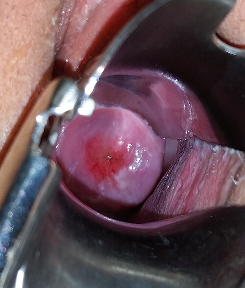
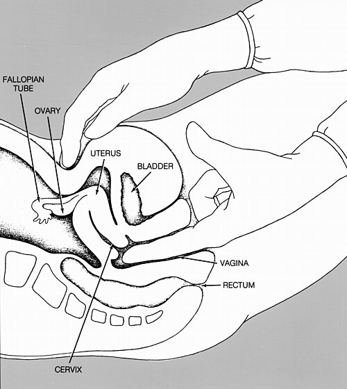

# PROPEDÊUTICA E EXAME GINECOLÓGICO

O exame ginecológico exige técnica, privacidade, consentimento e interpretação clínica dos achados. Para provas de residência, não basta memorizar a sequência do exame: é essencial reconhecer o normal para identificar o patológico e saber quando cada manobra muda a conduta.

## Anamnese Ginecológica: Onde Tudo Começa

A anamnese em ginecologia segue o roteiro clássico, mas com detalhes que definem condutas. O primeiro ponto é a Queixa e Duração. Se a paciente chega com sangramento genital urgente, sua prioridade muda. Antes de qualquer exame complementar, a regra de ouro é: Estabilização dos sinais vitais, Anamnese direcionada e Exame físico (palpação, especular e toque). Muitos alunos erram ao marcar "Ultrassonografia" como primeira conduta em sangramento agudo, mas o exame físico vem antes.

### História Menstrual e Hormonal

As características do fluxo menstrual devem ser descritas com precisão. Um ciclo normal dura entre 24 e 38 dias, com duração de fluxo de 3 a 8 dias. Quando a paciente relata alteração, deve-se perguntar sobre o muco cervical. O muco claro e filante, conhecido como Spinnbarkeit, é marcador de período ovulatório e alta fertilidade; em questões, esse achado costuma situar o caso na fase periovulatória do ciclo.

### História Sexual e Reprodutiva

Aqui entram conceitos que as bancas adoram. O vaginismo, por exemplo, é caracterizado por uma dor intensa na penetração devido ao espasmo involuntário da musculatura pélvica. O tratamento é conservador, envolvendo psicoterapia e exercícios de dessensibilização progressiva com dilatadores e manobras de Kegel. Cuidado: a alternativa que sugere "cirurgia para ampliar o introito" no vaginismo está errada. O problema é funcional e muscular, não anatômico.

## Exame Físico Geral e das Mamas

O exame das mamas deve ser rotina em todas as idades. Não caia na pegadinha de que ele só começa após os 40 anos ou apenas se houver queixa. Ele faz parte da propedêutica completa.

### Avaliação do Fluxo Papilar

A expressão papilar pode revelar diferentes tipos de descarga. O fluxo papilar funcional é não espontâneo, multiductal, bilateral e multicolorido (verde, amarelo, marrom). Geralmente é benigno e associado a alterações funcionais benignas da mama. O fluxo suspeito costuma ser unilateral, uniductal, espontâneo e serossanguinolento ou em "água de rocha".

### Diagnóstico Diferencial Mamário

Se a paciente apresenta um nódulo mamário, descreva localização, tamanho, limites, consistência, mobilidade, dor, relação com o ciclo, alterações de pele, linfonodos e fluxo papilar. A idade orienta o raciocínio: em jovens predominam fibroadenoma e cistos; em mulheres mais velhas, câncer de mama precisa ser excluído com prioridade.

## Exame Abdominal e Inguinal

O abdome e a região inguinal fazem parte da propedêutica ginecológica porque dor pélvica pode ter origem ginecológica, urinária, gastrointestinal ou de parede abdominal. Avalie defesa, descompressão brusca, massas, dor em fossas ilíacas, dor suprapúbica, cicatrizes, hérnias e linfonodos inguinais.

O Sinal de Rovsing (dor na fossa ilíaca direita ao comprimir a esquerda) sugere apendicite e deve entrar no diferencial de dor pélvica direita. Hérnia femoral merece atenção especial em mulheres por maior risco de encarceramento. O Ponto de Palmer é um ponto de acesso laparoscópico na margem costal esquerda/linha hemiclavicular, útil quando há suspeita de aderências umbilicais, mas não é parte obrigatória do exame físico ambulatorial.

## Exame Genital Externo: Inspeção e Palpação

Na inspeção da vulva, pesquisam-se malformações e lesões. A coalescência de pequenos lábios é comum na ginecologia pediátrica e geralmente decorre de hipoestrogenismo local.

### O Hímen Imperfurado

Este é um achado clássico em provas. O hímen imperfurado é uma malformação congênita que impede a drenagem do fluxo menstrual. A paciente típica é uma adolescente com amenorreia primária e dor pélvica cíclica. Ao exame, observa-se membrana himenal abaulada e azulada pelo sangue retido (hematocolpo). O tratamento é sempre cirúrgico (himenotomia).

## Exame Especular: O Olhar Direto

O exame especular deve ser realizado sem lubrificantes gordurosos se o objetivo for a coleta de citologia, pois eles podem interferir na análise das células.

### Achados no Colo Uterino

Durante a visualização do cérvix, podem ser encontrados cistos de Naboth. Eles são achados normais, resultantes da reepidermização da zona de transformação, quando o epitélio escamoso cobre as aberturas das glândulas produtoras de muco. Outro achado comum é o epitélio metaplásico, que representa a transformação fisiológica do epitélio colunar em escamoso. Ponto de prova: "metaplasia" no laudo de citologia ou colposcopia, quando descrita como metaplasia escamosa fisiológica, é achado esperado da zona de transformação e não indica câncer.

### Sinais de Gravidez no Exame Especular

A gestação promove uma congestão vascular pélvica intensa. Isso gera o Sinal de Jacquemier (ou Chadwick), que é a coloração azul-arroxeada da vulva, vagina e colo uterino. É um sinal de presunção de gravidez. Não confunda com o Sinal de Kluge, que foca na coloração violácea especificamente da vagina.

*Figura 2 - Colo uterino de nulípara visualizado ao exame especular, apresentando ectrópio assintomático. O orifício externo puntiforme é característico de nulíparas. Fonte: GynaeImages, CC BY-SA 4.0 | Wikimedia Commons*

## Toque Vaginal e Bimanual

*Figura 1 - Ilustração em corte sagital do toque vaginal associado à manobra bimanual, usada para avaliar colo, útero e anexos. Fonte: National Cancer Institute/NIH, Domínio Público | Wikimedia Commons.*

O toque vaginal é a ferramenta para avaliar o conteúdo pélvico. Lembre-se: pela via vaginal, apenas o colo uterino (cérvix) é palpável diretamente. O corpo do útero e os anexos exigem a manobra bimanual.

### Posição e Consistência Uterina

Um útero antevertido é aquele em que o corpo está inclinado para frente em relação ao colo, formando um ângulo com a vagina. Na gravidez inicial, o útero pode apresentar o Sinal de Piskacek: uma assimetria uterina com abaulamento e amolecimento no local onde o ovo se implantou. Se a prova descreve um útero com "amolecimento do istmo", ela se refere ao Sinal de Hegar.

### Palpação de Anexos

Em condições normais, os ovários podem não ser palpáveis, especialmente em pacientes obesas ou na pós-menopausa. Se houver dor à mobilização do colo ou palpação de massa anexial, pense em Doença Inflamatória Pélvica (DIP) ou Gravidez Ectópica. Na gravidez ectópica tubária íntegra, se houver desejo reprodutivo, a conduta preferencial é a salpingostomia laparoscópica (conservadora).

## Toque Retal em Ginecologia

Muitos alunos negligenciam o toque retal, mas ele é valioso. Ele é essencial na avaliação da endometriose profunda, permitindo palpar nódulos nos ligamentos uterossacrais e no septo retovaginal. Também é utilizado para avaliar a integridade do períneo e em casos de tumores pélvicos para verificar o comprometimento de paramétrios.

## Anatomia do Assoalho Pélvico e Períneo

O conhecimento do assoalho pélvico é cobrado tanto na propedêutica quanto na obstetrícia (episiotomia). O músculo elevador do ânus (composto pelos músculos puborretal, pubococcígeo e iliococcígeo) é o principal sustentador das vísceras pélvicas.

### Episiotomia: pontos essenciais

A episiotomia não deve ser rotineira, mas seletiva. A técnica mais comum é a mediolateral. A preferência pela técnica mediolateral se explica pelo menor risco de extensão para o esfíncter anal em comparação com a incisão mediana. A mediolateral reduz o risco de lesão do esfíncter anal (grau III e IV), embora cause mais dor no pós-operatório.

Na episiotomia mediolateral, as estruturas seccionadas são:

- Mucosa vaginal.

- Pele.

- Músculo bulbo-esponjoso (ou bulbocavernoso).

- Músculo transverso superficial do períneo.

O centro tendíneo do períneo é o ponto de convergência desses músculos e sua integridade é vital para a continência e suporte.

| Estrutura | Função/Importância |
| --- | --- |
| M. Elevador do Ânus | Principal suporte do assoalho pélvico. |
| M. Bulbo-esponjoso | Seccionado na episiotomia mediolateral. |
| Centro Tendíneo | Ponto de ancoragem central do períneo. |
| Fáscia Endopélvica | Suporte visceral (ligamentos cardinais e uterossacrais). |

## Incontinência Urinária na Propedêutica Ginecológica

A incontinência urinária deve aparecer na anamnese e no exame ginecológico porque muitas questões associam o tema a prolapso genital, avaliação do assoalho pélvico e perdas urinárias aos esforços. A investigação começa perguntando quando ocorre a perda, se há urgência, noctúria, disúria, sensação de esvaziamento incompleto, uso de diuréticos, partos vaginais prévios, cirurgias pélvicas e impacto na qualidade de vida.

Os três padrões mais cobrados são:

- **Incontinência urinária de esforço:** perda ao tossir, rir, espirrar, correr ou levantar peso. Relaciona-se à hipermobilidade uretral e/ou deficiência esfincteriana. No exame, pode ser reproduzida com tosse ou manobra de Valsalva com bexiga confortavelmente cheia.

- **Incontinência de urgência:** perda precedida por urgência miccional, frequentemente associada a aumento da frequência urinária e noctúria. Sugere bexiga hiperativa após excluir infecção urinária e outras causas irritativas.

- **Incontinência mista:** combinação de esforço e urgência; a conduta costuma priorizar o componente mais sintomático.

No exame genital, avaliam-se trofismo vulvovaginal, presença de prolapso de parede anterior, apical ou posterior, contração voluntária do assoalho pélvico e perda urinária provocada. O POP-Q pode ser usado para graduar prolapsos, mas em prova muitas vezes basta reconhecer cistocele, retocele e prolapso uterino.

A avaliação inicial geralmente inclui exame de urina/urocultura quando houver sintomas urinários, medida de resíduo pós-miccional se houver suspeita de retenção e diário miccional em casos selecionados. Estudo urodinâmico não é obrigatório para todo caso simples; ganha importância em casos complexos, falha terapêutica, cirurgia prévia, sintomas neurológicos, suspeita de esvaziamento incompleto ou dúvida diagnóstica.

Tratamento em linhas gerais:

- medidas comportamentais, perda ponderal quando indicada e redução de irritantes vesicais;

- fisioterapia do assoalho pélvico como base para incontinência de esforço e mista;

- treinamento vesical e fármacos para bexiga hiperativa/urgência quando necessário;

- cirurgia anti-incontinência, como sling, em casos selecionados de esforço com impacto importante e após avaliação adequada.

## Propedêutica Complementar: Citologia e Colposcopia

O rastreamento do câncer de colo uterino no Brasil, segundo o Ministério da Saúde, deve ser feito com a citologia cervical (Papanicolau) a cada 3 anos, após dois exames anuais normais, na faixa dos 25 aos 64 anos.

### Interpretando a Citologia

Achados como "epitélio escamoso metaplásico" e "bacilos de Doderlein" (flora normal) não requerem intervenção. A presença de células metaplásicas indica que a zona de transformação (área de maior risco para o HPV) foi amostrada, o que valida a qualidade do exame.

### Colposcopia e Teste de Schiller

Se a citologia vier alterada, partimos para a colposcopia.

- Ácido acético: Identifica áreas com alta síntese proteica (acetobrancas).

- Teste de Schiller (Lugol): O iodo cora o glicogênio das células normais (Schiller negativo/Iodo positivo). Áreas que não coram são chamadas de "iodo-negativas" ou "Schiller positivas", indicando células pobres em glicogênio (possível lesão ou atrofia).

## Situações Especiais e Cirurgia

Na propedêutica pré-operatória de cirurgias ginecológicas eletivas, a segurança é prioridade.

### Manejo de Medicações

Cuidado com a Metformina: ela deve ser suspensa 24 a 48 horas antes da cirurgia devido ao risco de acidose lática perioperatória. Antiagregantes como Clopidogrel e Dipiridamol também devem ser suspensos (geralmente 5 a 7 dias antes).

### Profilaxia de Tromboembolismo Venoso (TEV)

A cirurgia ginecológica, especialmente a oncológica ou de grande porte, é de alto risco para TEV. A profilaxia padrão inclui deambulação precoce, meias elásticas e heparina (HNF ou HBPM). O AAS não é considerado profilaxia primária padrão para TEV em cirurgia.

### Cicatrização e Feridas

A cicatrização ocorre em três fases: Inflamação, Proliferação (onde o TGF-ß é a citocina chave para o colágeno) e Maturação.

- Queloides: São cicatrizes que ultrapassam os limites da ferida original, comuns em áreas de tensão como o esterno e ombros.

- Fechamento por segunda intenção: Quando a ferida é deixada aberta para granular "de baixo para cima".

## Diagnóstico Diferencial de Dor Pélvica Aguda

Em mulher em idade reprodutiva, a primeira pergunta prática é: **pode estar grávida?** Faça beta-hCG quando houver possibilidade. Instabilidade hemodinâmica, abdome peritonítico ou suspeita de gestação ectópica rota mudam a prioridade para estabilização e avaliação cirúrgica imediata.

| Hipótese | Pistas no exame/anamnese | Conduta inicial em prova |
| --- | --- | --- |
| Gravidez ectópica | Atraso menstrual, sangramento, dor unilateral, beta-hCG positivo, dor à mobilização do colo ou massa anexial | Estabilizar; USG transvaginal e beta-hCG seriado se estável; cirurgia se instável/ruptura |
| Torção anexial | Dor pélvica súbita, náuseas/vômitos, massa/cisto ovariano; Doppler normal não exclui | Avaliação ginecológica urgente e laparoscopia se suspeita forte |
| DIP/abscesso tubo-ovariano | Dor pélvica, corrimento, febre, dor à mobilização do colo, dor uterina ou anexial | Tratamento empírico se critérios clínicos mínimos e risco de IST |
| Cisto ovariano roto/hemorrágico | Dor súbita, muitas vezes após relação/exercício; paciente geralmente estável | Analgesia, USG e observação se estável; cirurgia se instabilidade/hemoperitônio importante |
| Apendicite, litíase urinária, pielonefrite, diverticulite ou hérnia encarcerada | Dor migratória, sintomas urinários, febre, sinais gastrointestinais ou abaulamento doloroso | Direcionar exame abdominal/urinário e imagem conforme hipótese |

## Ética e Autonomia

A autonomia da gestante é um tema quente. A cesariana a pedido, por exemplo, é eticamente permitida a partir da 39ª semana de gestação, desde que haja uma decisão compartilhada e registrada em prontuário, respeitando a autonomia tanto da paciente quanto do médico (que pode exercer objeção de consciência, desde que encaminhe a paciente).

## Pontos-Chave para Prova

- Hímen Imperfurado: Causa hematocolpo e amenorreia primária; tratamento é cirúrgico.

- Ponto de Palmer: Margem costal esquerda, linha hemiclavicular; acesso seguro na laparoscopia.

- Sinal de Jacquemier: Coloração azulada da vulva/vagina/colo (presunção de gravidez).

- Sinal de Piskacek: Assimetria uterina na gestação inicial.

- Episiotomia Mediolateral: Secciona pele, mucosa, bulbo-esponjoso e transverso superficial do períneo.

- Vaginismo: Espasmo muscular; tratamento é comportamental/fisioterápico, NUNCA cirúrgico.

- Citologia: Rastreamento dos 25 aos 64 anos; metaplasia escamosa é achado normal.

- Metformina: Suspender antes de cirurgias pelo risco de acidose lática.

- Torção anexial: dor pélvica súbita e intensa, frequentemente com náuseas/vômitos; Doppler normal não exclui e a conduta é avaliação cirúrgica urgente se suspeita forte.

- Fluxo Papilar Benigno: Multiductal, bilateral, provocado, multicolorido.

- Papanicolau: Periodicidade de 3 anos após 2 exames anuais negativos.

- Toque Vaginal: Apenas o colo é palpável diretamente; corpo e anexos exigem manobra bimanual.

- Gravidez ectópica: sempre excluir com beta-hCG em dor pélvica aguda de paciente em idade reprodutiva.

- DIP: dor à mobilização do colo, dor uterina ou anexial em paciente com risco de IST justifica baixo limiar para tratamento empírico.

- Dor pélvica aguda: pense primeiro em ectópica, torção anexial, DIP/abscesso tubo-ovariano, cisto roto/hemorrágico e apendicite.

- 🩺 Lembre-se: Na dúvida em sangramento agudo, estabilize primeiro e examine depois!

 Cópia offline para consulta pessoal.
 Fonte original:
 [https://www.medevo.com.br/material-apoio/ler/bab3b277-1065-43e6-8824-6e993427ff27](https://www.medevo.com.br/material-apoio/ler/bab3b277-1065-43e6-8824-6e993427ff27)
