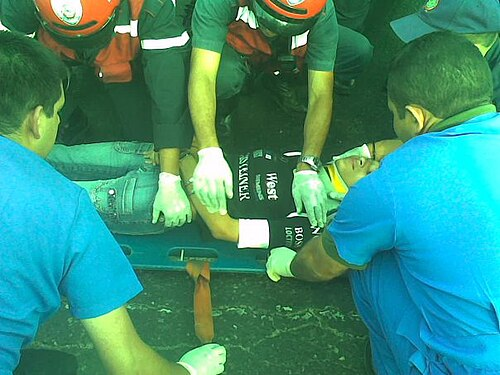
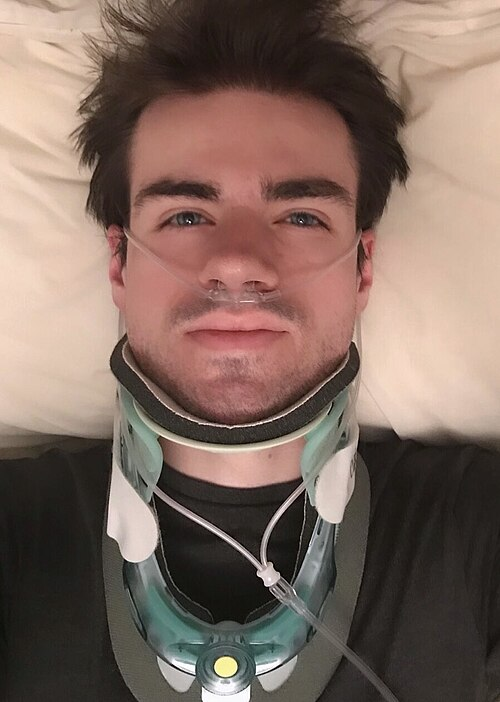
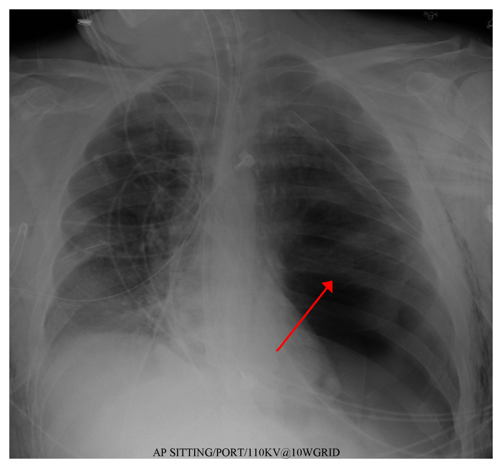
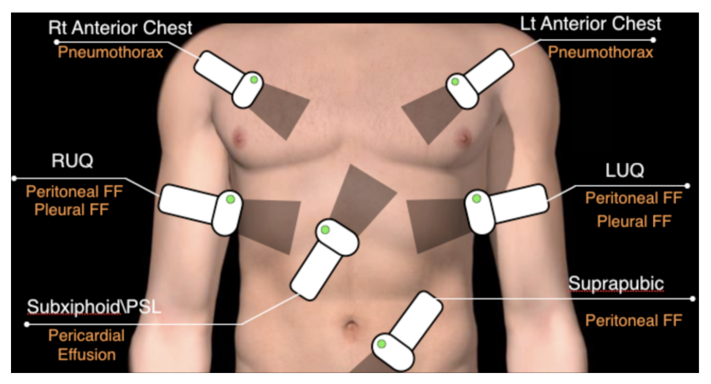

# PROTOCOLOS DE ATENDIMENTO AO TRAUMA (ATLS)

O atendimento ao paciente politraumatizado não é um exercício de adivinhação, mas sim de priorização. O Advanced Trauma Life Support (ATLS), atualizado em sua 11ª edição (2025), estabelece uma linguagem universal para que qualquer médico, em qualquer lugar do mundo, saiba exatamente o que fazer nos primeiros minutos após uma lesão grave. O conceito fundamental que você precisa carregar para a prova e para o plantão é: trate primeiro o que mata mais rápido.

Muitos alunos erram questões por quererem diagnosticar a lesão específica (exemplo: uma fratura de fêmur) antes de garantir que o paciente está respirando. No trauma, seguimos a sequência lógica do **XABCDE** (ATLS 11ª ed., 2025): primeiro controle de hemorragia exsanguinante (X), depois via aérea com proteção cervical (A), respiração (B), circulação (C), déficit neurológico (D) e exposição (E). Se o paciente tem uma obstrução de via aérea, não importa se ele tem um pneumotórax ou uma hemorragia abdominal, ele morrerá pela via aérea antes.

## X: Controle de Hemorragias Exsanguinantes

A 11ª edição do ATLS enfatiza que a hemorragia exsanguinante é a principal ameaça imediata à vida no atendimento ao politraumatizado. Essa priorização justifica a inclusão do **"X"** no início da sequência da avaliação primária (**XABCDE**).

Nem toda hemorragia externa se enquadra como exsanguinante. A hemorragia exsanguinante é um tipo de hemorragia externa que coloca a vida do paciente em risco iminente e pode levar rapidamente à instabilidade hemodinâmica grave ou à morte se não for controlada de forma imediata.

**Condutas recomendadas pelo ATLS 11:**

- **Exposição completa** da área lesionada para avaliação adequada.

- **Compressão direta** do ferimento (primeira medida sempre).

- **Packing** (tamponamento com compressas no interior do ferimento) em feridas profundas que não cessam com compressão.

- **Torniquete** nas seguintes situações:

- Sangramento não controlado rapidamente com compressão direta.

- Sangramento arterial em jato.

- Amputação total ou subtotal de membro.

> **Pegadinha de prova:** torniquete só em **extremidades**. Em junções (axila, virilha, pescoço) o controle é por compressão direta + packing + agentes hemostáticos. Anote o horário da aplicação do torniquete; tempo prolongado aumenta risco de lesão isquêmica.

## A: Via Aérea com Controle da Coluna Cervical

A primeira prioridade é garantir que o oxigênio chegue aos pulmões. Mas cuidado, no trauma, nunca manipulamos a via aérea sem proteger a medula espinhal. A regra de ouro é: presuma lesão da coluna cervical em todo paciente com trauma multissistêmico, especialmente naqueles com alteração de consciência ou trauma acima da clavícula.

ATLS 11: O termo preferido agora é Restrição do Movimento da Coluna (RMC) (Spinal Motion Restriction). Isso reconhece que a "imobilização" total é impossível e pode ser prejudicial (causando úlceras de pressão ou dor). A prancha rígida deve ser usada apenas para transporte/resgate e removida o mais rápido possível.

### Manutenção da Via Aérea

Se o paciente fala com voz normal, a via aérea está pérvia. Se ele está inconsciente ou com estridor, precisamos agir. As manobras manuais iniciais são o Chin Lift (elevação do mento) e o Jaw Thrust (tração da mandíbula). Em provas, a pegadinha clássica é oferecer o "Head Tilt" (inclinação da cabeça), que é proscrito no trauma por mobilizar a coluna cervical. O Jaw Thrust é a manobra mais segura para a coluna.

### Via Aérea Definitiva

Você precisa saber quando parar de tentar manobras simples e partir para a intubação orotraqueal (IOT). As indicações formais incluem:

- Apneia.

- Proteção da via aérea contra aspiração (sangue ou vômito).

- Comprometimento iminente da via aérea (inalação de fumaça, fraturas faciais graves).

- Trauma cranioencefálico (TCE) com Escala de Coma de Glasgow (GCS) menor ou igual a 8.

- Incapacidade de manter oxigenação adequada com máscara.

Um erro comum em provas é esquecer que o paciente com GCS de 9 a 12 que apresenta hipoxemia ou choque grave também pode necessitar de IOT imediata para proteção cerebral. Como dizemos no MedEvo, "Glasgow menor ou igual a 8, tubo nele".

### Via Aérea Cirúrgica

Se você tentou a IOT e não conseguiu (edema de glote, hemorragia maciça, distorção anatômica), você está diante de uma situação de "não consigo intubar, não consigo ventilar". A conduta é a cricotireoidostomia cirúrgica.

Atenção: a cricotireoidostomia por agulha é uma medida temporária (máximo 30 a 45 minutos devido ao acúmulo de CO2), enquanto a cirúrgica é a preferencial no adulto. Em crianças menores de 12 anos, a cricotireoidostomia cirúrgica é evitada pelo risco de lesão da cartilagem cricoide, preferindo-se a traqueostomia ou a crico por agulha.

Videolaringoscopia: O ATLS 11 recomenda explicitamente o uso de videolaringoscopia (se disponível) para intubação, especialmente em situações de via aérea difícil prevista.
Terminologia de Drogas: O termo "Sequência Rápida de Intubação" (RSI) foi substituído por Intubação Assistida por Drogas (DAI - Drug-Assisted Intubation). O conceito é similar, mas o novo termo é mais abrangente.

## B: Respiração e Ventilação

Ter uma via aérea pérvia não garante que o paciente esteja ventilando. No "B", buscamos excluir as **lesões torácicas que matam o paciente em minutos**: Pneumotórax Hipertensivo, Pneumotórax Aberto, Hemotórax Maciço, Tamponamento Cardíaco e Tórax Instável (flail chest).

### Pneumotórax Hipertensivo

Este é um diagnóstico CLÍNICO. Se a questão mostrar um paciente com hipotensão, taquicardia, ausência de murmúrio vesicular unilateral, hipertimpanismo e turgência jugular, não peça radiografia. O tratamento é a descompressão imediata.

O ATLS 10ª edição mudou o local da descompressão por agulha: agora é no 5º espaço intercostal, entre a linha axilar anterior e média (mesmo local do dreno). Em crianças, ainda se aceita o 2º espaço intercostal na linha hemiclavicular. Após a descompressão, o tratamento definitivo é sempre a drenagem torácica em selo d'água.

Atualização ATLS 11: O protocolo reforça o 5º EIC, mas acrescenta uma especificidade importante: o uso de um cateter de 8 cm (não mais os curtos de 5 cm) para garantir que a agulha atravesse a parede torácica em pacientes adultos, que podem ter musculatura ou tecido adiposo espessos nessa região.

### Pneumotórax Aberto

Ocorre quando há uma ferida na parede torácica que é maior que 2/3 do diâmetro da traqueia. O ar prefere entrar pelo buraco da ferida do que pela traqueia. O tratamento imediato é o **curativo de três pontas**, que funciona como uma válvula: permite que o ar saia, mas não entre. O tratamento definitivo é a drenagem em local diferente da ferida e o fechamento cirúrgico da lesão.

### Hemotórax Maciço

O hemotórax maciço é definido pelo acúmulo agudo de sangue na cavidade pleural com repercussão hemodinâmica. Para a prova, fixe os critérios clássicos do ATLS:

- **Drenagem inicial ≥ 1.500 mL** de sangue ao colocar o dreno torácico **OU**

- **Sangramento persistente ≥ 200 mL/h por 2 a 4 horas** **OU**

- **Necessidade contínua de transfusão** para manter estabilidade hemodinâmica.

**Quadro clínico:** choque + ausência ou redução do murmúrio vesicular + **macicez à percussão** (diferente do pneumotórax hipertensivo, que é hipertimpânico) + jugulares geralmente **colabadas** (pela hipovolemia).

**Conduta:**

- Acesso venoso calibroso e reposição volêmica precoce com hemoderivados (não cristaloide em excesso).

- **Drenagem torácica** com dreno calibroso (28–32 Fr) no 5º EIC entre linha axilar anterior e média.

- **Toracotomia de urgência** se preencher os critérios acima — não esperar piora clínica.

- Considerar **autotransfusão** com sistema coletor adequado em centros que dispõem.

> **Diferencial-chave em prova:** ausência de murmúrio vesicular + **hipertimpanismo** + jugulares **túrgidas** = pneumotórax hipertensivo (tratar com agulha primeiro). Ausência de murmúrio + **macicez** + jugulares **colabadas** = hemotórax maciço (tratar com dreno + reposição + cirurgia).

### Tórax Instável (Flail Chest)

Fratura de **três ou mais costelas em dois ou mais pontos**, gerando segmento com movimento paradoxal (afunda na inspiração, expande na expiração). A morbidade não vem do "afundamento" em si, mas da **contusão pulmonar subjacente**. Conduta: analgesia adequada (bloqueio epidural ou intercostal), oxigenoterapia, avaliar ventilação mecânica se hipoxemia/fadiga e fixação cirúrgica em casos selecionados.

### Tamponamento Cardíaco

Tríade de Beck: hipotensão + abafamento de bulhas + turgência jugular. Diagnóstico no FAST (janela subxifóide). Conduta de salvamento: **pericardiocentese** (alívio temporário) e/ou **toracotomia/janela pericárdica** (definitiva). Em trauma penetrante torácico com PCR e sinais de vida recentes, está indicada **toracotomia de reanimação na sala de emergência**.

## C: Circulação com Controle de Hemorragia

A principal causa de choque no trauma é a hipovolemia por sangramento. No "C", avaliamos o estado hemodinâmico através do nível de consciência, cor da pele e pulsos. A pressão arterial é um indicador tardio, ela só cai significativamente quando o paciente já perdeu cerca de 30% do volume sanguíneo (Choque Classe III).

### Classificação do Choque Hemorrágico

Esta tabela é o coração das provas de trauma. Você precisa memorizá-la.

| Parâmetro | Classe I | Classe II | Classe III | Classe IV |
| --- | --- | --- | --- | --- |
| Perda volêmica (%) | < 15% | 15 - 30% | 30 - 40% | > 40% |
| Frequência Cardíaca | Normal | Elevada (>100) | Elevada (>120) | Elevada (>140) |
| Pressão Arterial | Normal | Normal | Reduzida | Muito Reduzida |
| Pressão de Pulso | Normal | Reduzida | Reduzida | Reduzida |
| Frequência Resp. | Normal | Normal | Elevada | Taquipneia grave |
| Débito Urinário | Normal | Leve queda | Reduzido | Anúria |
| Estado Mental | Ansioso | Agitado | Confuso | Letárgico |
| Conduta Inicial | Cristaloide | Cristaloide | Cristaloide + Sangue | Protocolo Transfusão Maciça |

Por que a pressão de pulso (diferença entre sistólica e diastólica) cai na Classe II? Porque a liberação de catecolaminas aumenta a resistência vascular periférica, elevando a pressão diastólica, enquanto a sistólica ainda se mantém. Isso é uma dica valiosa para identificar choque precoce.
Nova Tabela Choque ATLS 11:

| Parâmetro | LEVE | MODERADA | GRAVE |
| --- | --- | --- | --- |
| Frequência cardíaca | Inalterada | Aumentada (> 100) | Muito aumentada (> 120) |
| Pressão arterial sistólica | Inalterada | Inalterada ou diminuída | Muito diminuída (< 90) |
| Pressão de pulso | Inalterada | Diminuída | Diminuída |
| Frequência respiratória | Inalterada | Aumentada | Aumentada |
| Nível de consciência | Inalterado | Diminuído | Muito diminuído |
| Hemoderivados | Improvável | Provável | PTM (protocolo de transfusão maciça) |
| Resposta à ressuscitação | Rápida e sustentada | Transitória | Mínima ou nenhuma |
| Necessidade de cirurgia | Improvável | Provável | Extremamente provável |
| Base déficit (mEq/L) | 0 a -2 | -6 a -10 | -10 ou menos |

### Ressuscitação Volêmica

O ATLS 10ª edição tornou-se mais conservador com cristaloides. Iniciamos com 1 litro de Ringer Lactato aquecido (em adultos) ou 20 ml/kg em crianças. O excesso de cristaloide causa hemodiluição e piora a coagulopatia.

Se o paciente não responde ao primeiro litro (resposta transitória ou ausência de resposta), devemos partir para a transfusão de hemocomponentes. A tendência moderna é a Ressuscitação de Controle de Danos (DCR), utilizando a proporção 1:1:1 (Plasma : Plaquetas : Hemácias) e o uso precoce de Ácido Tranexâmico (TXA) nas primeiras 3 horas (conforme o estudo CRASH-2), para evitar a fibrinólise.

### Trauma Pélvico

Um paciente com fratura de bacia "em livro aberto" pode sangrar todo o seu volume para dentro do retroperitônio. Se houver suspeita (instabilidade da pelve ao exame físico), a conduta imediata é o fechamento da pelve com um lençol ou cinta pélvica na altura dos trocanteres maiores. Não fique "testando" a estabilidade da pelve várias vezes, pois isso desloca coágulos e piora o sangramento.

## D: Déficit Neurológico

Aqui avaliamos a Escala de Coma de Glasgow, a reatividade pupilar e os sinais de lateralização. O objetivo principal é identificar a necessidade de intervenção neurocirúrgica urgente e prevenir a lesão secundária (mantendo oxigenação e perfusão).

Lembre-se da Tríade de Cushing, que indica hipertensão intracraniana grave:

- Hipertensão arterial.

- Bradicardia.

- Irregularidade respiratória.

Se encontrar isso associado a uma pupila midriática não reagente (anisocoria), o paciente está herniando o uncus. A conduta imediata envolve medidas de salvamento como hiperventilação leve temporária e uso de agentes osmóticos, enquanto se providencia a TC de crânio e a avaliação do neurocirurgião.

## E: Exposição e Controle do Ambiente

O paciente deve ser despido completamente para que nenhuma lesão passe despercebida (como um ferimento por arma de fogo no dorso ou períneo). No entanto, o trauma odeia o frio. A hipotermia piora a coagulopatia e aumenta a mortalidade. Portanto, após a inspeção, cubra o paciente com mantas térmicas e use fluidos aquecidos (37-40°C).

A Tríade Letal do Trauma, que o Dr. Will sempre reforça, é composta por:

- Acidose Metabólica.

- Hipotermia.

- Coagulopatia.
Se você não interromper esse ciclo, o paciente morrerá mesmo que você suture todas as artérias.

## Exames Complementares no Trauma (Adjuntos)

Não levamos um paciente instável para a tomografia. A TC é o "túnel da morte" para quem está chocado. Os exames de imagem permitidos na sala de trauma para pacientes instáveis são:

- Radiografia de Tórax AP.

- Radiografia de Bacia AP.

- FAST (Focused Assessment with Sonography for Trauma).

### FAST e LPD

O FAST busca líquido livre (sangue) em quatro janelas: pericárdica, peri-hepática (espaço de Morrison), periesplênica e pélvica (fundo de saco).

- FAST positivo + Instabilidade hemodinâmica = Laparotomia imediata.

- FAST negativo + Instabilidade hemodinâmica = Procurar sangramento em outros lugares (pelve, tórax, ossos longos).

O Lavado Peritoneal Diagnóstico (LPD) caiu em desuso com a popularização do FAST, mas ainda é cobrado. É considerado positivo se:

- Aspiração inicial de > 10 ml de sangue ou conteúdo gastrointestinal.

-

> 100.000 hemácias/mm³.

-

> 500 leucócitos/mm³.

- Presença de fibras alimentares ou bile.

## Particularidades e Armadilhas

### Trauma na Gestante

A prioridade é a mãe. Se a mãe não estiver bem, o feto não estará. Um detalhe anatômico crucial: a partir do segundo trimestre, o útero gravídico comprime a veia cava inferior quando a paciente está em decúbito dorsal, reduzindo o retorno venoso e causando hipotensão. A conduta é deslocar o útero manualmente para a esquerda ou inclinar a prancha em 15 a 30 graus.

### Trauma Pediátrico

Crianças têm uma reserva fisiológica imensa. Elas mantêm a pressão arterial normal mesmo com perdas volêmicas graves, mas quando "descompensam", param subitamente. A taquicardia costuma ser o primeiro sinal de choque. O acesso venoso preferencial é o periférico; se falhar em duas tentativas ou 90 segundos, partimos para o acesso intraósseo (geralmente na tíbia proximal).

### Trauma de Laringe

Se o paciente apresenta rouquidão, enfisema subcutâneo no pescoço e estridor, suspeite de fratura de laringe. A IOT pode ser perigosa aqui, podendo completar uma ruptura traqueal. A via aérea de escolha, se houver obstrução, é a traqueostomia de urgência (em ambiente cirúrgico, se possível).

## Pontos-Chave para Prova

- **Glasgow < 9:** Indicação absoluta de via aérea definitiva (IOT).

- **Pneumotórax Hipertensivo:** Diagnóstico clínico. Conduta: Descompressão por agulha (5º EIC, cateter de 8 cm em adultos) seguida de dreno de tórax.

- **Hemotórax Maciço:** Drenagem inicial ≥ 1.500 mL OU ≥ 200 mL/h por 2–4 h = **toracotomia**. Macicez + jugulares colabadas (diferencia do pneumotórax hipertensivo).

- **Toracotomia de Reanimação:** Indicada principalmente em trauma **penetrante torácico** com PCR presenciada e sinais de vida; benefício muito limitado em trauma contuso.

- **Tamponamento Cardíaco:** Tríade de Beck (Hipotensão + Abafamento de bulhas + Turgência jugular). Conduta: Pericardiocentese (alívio) ou Toracotomia (definitivo).

- **Choque Classe III:** Primeira fase onde a Pressão Arterial Sistólica cai. Necessita de sangue.

- **Ácido Tranexâmico:** Deve ser feito nas primeiras 3 horas do trauma (dose: 1g em 10 min + 1g em 8h).

- **FAST Positivo em Paciente Estável:** Segue para Tomografia para graduar a lesão.

- **FAST Positivo em Paciente Instável:** Segue para Laparotomia.

- **Contraindicação de Sonda Vesical:** Sangue no meato uretral, equimose perineal ou próstata cefalizada (sugerem lesão de uretra). Fazer uretrocistografia retrógrada antes.

- **Tríade Letal:** Hipotermia, Acidose e Coagulopatia.

- **Cricotireoidostomia Cirúrgica:** Contraindicada em crianças < 12 anos.

- **Torniquete:** Recomendado em hemorragias arteriais exanguinantes de extremidades onde a pressão direta falhou.

- **Hipotensão Permissiva:** Manter PAS em torno de 80-90 mmHg em pacientes sangrando para evitar o desprendimento de coágulos (exceto em pacientes com TCE).

- **Radiografias de Rastreamento:** Tórax AP e Bacia AP são as essenciais na sala de trauma.

- **Soco Precordial:** Apenas em PCR presenciada em ambiente monitorizado enquanto o desfibrilador não chega.

- **Amiodarona na PCR:** Indicada na FV/TV sem pulso após o 3º choque.

- **Epinefrina na PCR:** Em ritmos não chocáveis (AESP/Assistolia), administrar o mais rápido possível. 🩺

## Tabelas Comparativas de Diagnóstico Diferencial

### Choque Obstrutivo no Trauma

| Achado | Pneumotórax Hipertensivo | Tamponamento Cardíaco |
| --- | --- | --- |
| Murmúrio Vesicular | Abolido unilateralmente | Presente e simétrico |
| Percussão | Hipertimpânico | Claro pulmonar |
| Jugulares | Turgentes | Turgentes |
| Desvio da Traqueia | Presente (lado oposto) | Ausente |
| Bulhas Cardíacas | Normais | Abafadas |
| Tratamento | Toracocentese / Drenagem | Pericardiocentese / Janela |

### Resposta à Infusão de Fluidos

| Resposta | Sinais Vitais | Perda Sanguínea | Necessidade de Sangue |
| --- | --- | --- | --- |
| Rápida | Normalizam | Mínima (10-20%) | Baixa (tipagem e prova) |
| Transitória | Melhora inicial / Nova queda | Moderada (20-40%) | Alta (tipo-específico) |
| Ausente | Permanecem instáveis | Grave (>40%) | Imediata (Protocolo Maciço) |

Este guia consolidado cobre os pilares do ATLS que as bancas de residência mais exploram. Lembre-se: no trauma, a disciplina em seguir o ABCDE salva vidas e garante a sua aprovação. Ao revisar questões, sempre se pergunte: "Em qual letra do ABCDE este paciente está?". A resposta para a conduta estará sempre ali.

 Cópia offline para consulta pessoal.
 Fonte original:
 [https://www.medevo.com.br/material-apoio/ler/12588f63-ba8e-4419-9fc4-2181f3856518](https://www.medevo.com.br/material-apoio/ler/12588f63-ba8e-4419-9fc4-2181f3856518)
