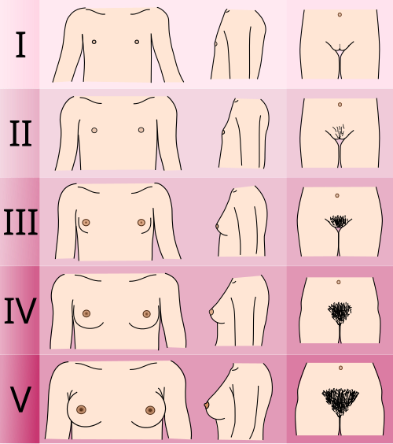
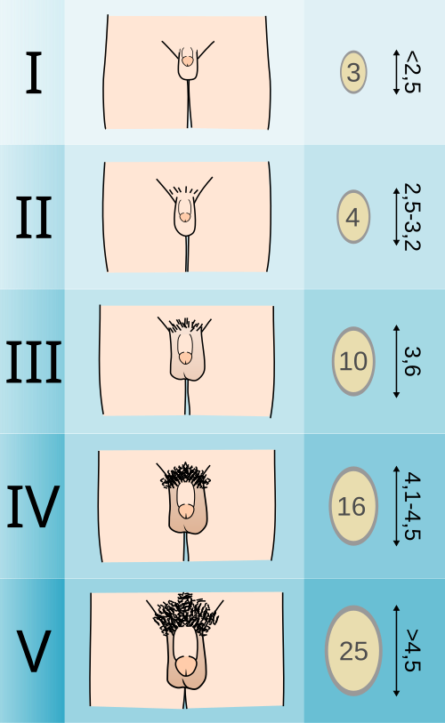

# PUBERDADE E DESENVOLVIMENTO PUBERAL

Para entender a puberdade, você precisa primeiro separar dois conceitos que as bancas adoram misturar: adolescência e puberdade. A adolescência é um processo psicossocial e cultural, enquanto a puberdade é o conjunto de transformações biológicas e físicas.

Segundo a Organização Mundial da Saúde (OMS), a adolescência compreende o período dos 10 aos 19 anos e 11 meses. Já o Estatuto da Criança e do Adolescente (ECA), que é lei no Brasil e cai muito em provas de Medicina Preventiva e Pediatria, define o adolescente como a pessoa entre 12 e 18 anos de idade. Guarde essa diferença: se a questão citar "critério legal" ou "ECA", a resposta é 12 a 18 anos. Se citar "critério biológico" ou "OMS", é 10 a 20 anos.

*Figura 1 - Escala de Tanner feminina mostrando os 5 estágios do desenvolvimento mamário e de pelos pubianos. A telarca (M2) marca o início da puberdade feminina. Fonte: Michał Komorniczak, CC BY-SA 3.0 | Wikimedia Commons*

## Fisiologia: O Despertar do Eixo

Por que a puberdade começa? Não é um evento súbito, mas sim a reativação de um eixo que já funcionou lá na vida fetal e no período neonatal (a chamada minipuberdade). Durante a infância, esse eixo Hipotálamo-Hipófise-Gônada (HHG) fica "adormecido" por uma forte inibição central.

O início da puberdade ocorre quando o hipotálamo passa a liberar o GnRH (Hormônio Liberador de Gonadotrofinas) de forma pulsátil. Esses pulsos, inicialmente noturnos, estimulam a hipófise anterior a secretar LH (Hormônio Luteinizante) e FSH (Hormônio Folículo-Estimulante).

Aqui entra um conceito que o Dr. Will sempre reforça nas discussões do MedEvo: a diferença entre gonarca e adrenarca.

- **Gonarca:** É a ativação do eixo HHG, levando à produção de esteroides sexuais pelas gônadas (estrógeno e testosterona). É o que gera o broto mamário e o aumento testicular.

- **Adrenarca:** É o aumento da produção de andrógenos pela glândula adrenal (DHEA e DHEAS). Isso geralmente ocorre por volta dos 6 a 8 anos e é responsável pelo odor axilar, acne e, em parte, pelos pubianos.

**Cuidado:** A adrenarca pode ocorrer independentemente da gonarca. Um erro clássico de prova é achar que o aparecimento de pelos pubianos (pubarca) confirma o início da puberdade. Em meninas, o marco inicial é a telarca; em meninos, o aumento do volume testicular.

## O Estadiamento de Tanner: A Bíblia da Puberdade

Você não pode ir para uma prova de residência sem dominar os Estágios de Tanner. As bancas não pedem apenas para você nomear, elas descrevem o exame físico e pedem o estágio.

### Desenvolvimento Mamário (M) e Genital Masculino (G)

| Estágio | Descrição Feminina (Mamas - M) | Descrição Masculina (Genitais - G) |
| --- | --- | --- |
| **1** | Pré-puberal: apenas elevação da papila. | Pré-puberal: testículos < 4 ml; pênis infantil. |
| **2** | **Telarca:** broto mamário; aumento do diâmetro da aréola. | **Início:** testículos ≥ 4 ml; pele escrotal avermelhada e fina. |
| **3** | Maior aumento de mama e aréola, sem separação de contornos. | Aumento do comprimento do pênis e maior crescimento testicular. |
| **4** | Projeção da aréola e da papila para formar uma segunda saliência. | Aumento do diâmetro do pênis; glande se desenvolve; escroto pigmentado. |
| **5** | Estágio adulto: aréola recua ao contorno da mama; apenas papila projetada. | Genitália adulta em tamanho e forma. |

### Pelos Pubianos (P) - Ambos os Sexos

- **P1:** Pré-puberal (ausência de pelos).

- **P2:** Pelos longos, finos, lisos ou levemente encaracolados, principalmente na base do pênis ou grandes lábios.

- **P3:** Pelos mais escuros, grossos e encaracolados, espalhando-se sobre a sínfise púbica (linha média).

- **P4:** Pelos do tipo adulto, mas que não atingem a face interna das coxas.

- **P5:** Pelos do tipo adulto, distribuídos em forma de triângulo invertido (mulheres) ou losango (homens), atingindo a face interna das coxas.

**Dica de Prova:** Tanner M3 é a fase de "maior velocidade de crescimento" para as meninas. Já no Tanner G4 é que ocorre o pico do estirão masculino. Se a questão descreve uma menina com a aréola formando um "duplo contorno", ela está em M4. Se descreve um menino com testículos aumentados, mas pênis ainda pequeno, ele está em G2.

## Puberdade Feminina: A Sequência que Cai na Prova

A sequência dos eventos nas meninas é muito previsível e as bancas amam cobrar a ordem cronológica.

- **Telarca (M2):** É o primeiro sinal, ocorrendo geralmente entre 8 e 13 anos. Pode ser unilateral no início, o que gera muita ansiedade nos pais. Tranquilize: é normal.

- **Pico do Estirão:** Ocorre logo após a telarca (M2-M3). A menina cresce antes da menarca.

- **Pubarca (P2):** Ocorre geralmente logo após a telarca, mas pode ser simultâneo.

- **Menarca:** Ocorre em média 2 a 3 anos após a telarca, geralmente no estágio M4.

- **Desaceleração do crescimento:** Após a menarca, a menina cresce apenas cerca de 5 a 7 cm.

**Por que a menarca ocorre no final?** Porque o estrogênio, em níveis elevados, promove o fechamento das epífises ósseas. Por isso, se uma menina tem menarca muito cedo, sua estatura final pode ser comprometida.

**Exemplo Clínico:** Imagine uma paciente de 11 anos, Tanner M2P2, que a mãe está preocupada porque ela "ainda não menstruou". Você deve explicar que ela está no início da puberdade e que a menarca ainda deve demorar cerca de 2 anos. Este é o momento do estirão, então é a fase em que ela mais vai ganhar altura.

## Puberdade Masculina: O Testículo é a Chave

Diferente das meninas, o estirão nos meninos é tardio.

- **Aumento Testicular (G2):** Primeiro sinal puberal (volume ≥ 4 ml ou maior eixo > 2,5 cm). Ocorre entre 9 e 14 anos.

- **Crescimento Peniano:** Ocorre em G3.

- **Pico do Estirão:** Ocorre tardiamente, em G4. Por isso os meninos parecem "baixinhos" perto das meninas da mesma idade na escola.

- **Espermatogênese e Semenarca:** A primeira ejaculação (semenarca) e a presença de espermatozoides viáveis ocorrem geralmente em G3-G4, não no início da puberdade.

**Ginecomastia Puberal:** Cerca de 40 a 65% dos meninos apresentam aumento do tecido mamário (geralmente em G2-G3). Por que acontece? Por um desequilíbrio transitório entre estrogênio e testosterona. A conduta é **observar**, pois regride espontaneamente em 85% a 90% dos casos em até 2 anos.

## O Estirão de Crescimento

O crescimento na adolescência responde por cerca de 20% da estatura final do adulto.

- **Meninas:** Começam o estirão cedo (M2). O pico de velocidade de crescimento (PVC) é de cerca de 8-9 cm/ano e ocorre em M3.

- **Meninos:** Começam o estirão tarde (G3). O PVC é maior, cerca de 9-10 cm/ano, e ocorre em G4.

Essa diferença de tempo (meninos crescem por mais tempo antes do estirão) e a maior intensidade do PVC masculino explicam por que, em média, homens são 13 cm mais altos que mulheres.

**Fatores Determinantes da Estatura:** A genética é o principal (alvo genético), mas nutrição, saúde emocional e sono (liberação de GH) são fundamentais. Lembre-se: 50-75% da massa óssea adulta é adquirida na adolescência. Se houver privação nutricional aqui, o prejuízo é para a vida toda.

## Situações Fisiológicas que Parecem Doença

Muitas questões de prova trazem recém-nascidos com alterações genitais. Isso é a "Crise Genital Neonatal".

- **Ingurgitamento mamário neonatal:** Pode ocorrer em ambos os sexos por passagem de hormônios maternos pela placenta. Pode até haver saída de secreção láctea ("leite de bruxa").

- **Leucorreia fisiológica e Pseudomenstruação:** Meninas recém-nascidas podem ter secreção vaginal esbranquiçada ou até um pequeno sangramento por privação hormonal súbita após o parto.

- **Conduta:** Tranquilizar os pais. É fisiológico e desaparece em poucas semanas. Nunca esprema as mamas do RN, pois pode causar mastite.

*Figura 2 - Escala de Tanner masculina mostrando os 5 estágios do desenvolvimento genital e de pelos pubianos, com volume testicular. O aumento testicular (G2, ≥4mL) marca o início da puberdade masculina. Fonte: Michał Komorniczak, CC BY-SA 3.0 | Wikimedia Commons*

## Puberdade Precoce e Atrasada: Quando se Preocupar?

Este é um tema quente. Você precisa memorizar os marcos temporais.

### Puberdade Precoce

Definida como o aparecimento de caracteres sexuais secundários antes dos **8 anos em meninas** e antes dos **9 anos em meninos**.

- **Central (Verdadeira/GnRH-dependente):** O eixo HHG foi ativado precocemente. Segue a sequência normal (telarca -> estirão -> menarca). É muito mais comum em meninas e geralmente é idiopática. Em meninos, a puberdade precoce central frequentemente está associada a lesões no SNC (tumores, hamartomas).

- **Periférica (Pseudopuberdade/GnRH-independente):** A produção de hormônios vem de outro lugar (adrenal, gônadas, tumores, cistos ovarianos). A sequência de eventos costuma ser anômala (ex: sangramento vaginal antes da telarca).

**Dica de Ouro:** Se a questão mostrar uma criança com caracteres sexuais precoces e **idade óssea avançada**, pense em puberdade precoce. Se a idade óssea estiver normal, pode ser apenas uma variante da normalidade (telarca precoce isolada ou adrenarca precoce isolada).

### Puberdade Atrasada

- **Meninas:** Ausência de telarca aos 13 anos OU ausência de menarca aos 15-16 anos (ou 3-5 anos após a telarca).

- **Meninos:** Ausência de aumento testicular (G2) aos 14 anos.

A causa mais comum é o **Atraso Constitucional do Crescimento e da Puberdade (ACCP)**. É aquele paciente que tem a idade óssea atrasada em relação à idade cronológica, mas compatível com o estágio puberal. Ele vai entrar na puberdade, só que mais tarde. Geralmente há história familiar semelhante.

## A Consulta do Adolescente: Ética e Sigilo

Aqui é onde muitos alunos erram por não conhecerem o Código de Ética Médica e o ECA. O atendimento ao adolescente exige uma técnica específica.

- **Acolhimento:** Receba o adolescente e os pais.

- **Momento a sós:** É **obrigatório** oferecer um momento a sós com o adolescente. Isso deve ser explicado aos pais desde o início como parte da rotina, para não gerar desconfiança.

- **Sigilo Médico:** O adolescente tem direito ao sigilo, desde que tenha capacidade de discernimento (geralmente considerada a partir dos 12 anos). O médico **não pode** contar aos pais o que foi discutido (vida sexual, uso de drogas, etc.) a menos que haja risco de vida para o paciente ou para terceiros, ou em casos de notificação compulsória (abuso sexual).

**Exemplo de Prova:** Adolescente de 15 anos solicita anticoncepcional e pede para não contar à mãe. Conduta: Prescrever, orientar e manter o sigilo. Ela tem direito à privacidade e à saúde sexual.

**Tríade da Mulher Atleta:** Fique atento a adolescentes que praticam esportes de alta intensidade. A combinação de **Baixa Disponibilidade Energética (com ou sem transtorno alimentar) + Amenorreia + Osteoporose** é clássica. Ocorre por supressão hipotalâmica devido ao estresse físico e baixa gordura corporal.

## Aspectos Psicossociais: A "Síndrome da Adolescência Normal"

A adolescência não é uma doença, mas tem características próprias que podem ser confundidas com patologias. Knobel descreveu a "Síndrome da Adolescência Normal":

- Busca da identidade e de si mesmo.

- Tendência grupal (o grupo de amigos é a nova família).

- Necessidade de intelectualizar e fantasiar.

- Crises religiosas.

- Deslocalização temporal (vivem o agora).

- Evolução sexual (da autoerotismo à heterossexualidade/homossexualidade).

- Atitude social reivindicatória e flutuações de humor.

Na **Adolescência Média (14-16 anos)**, o foco é a autonomia. É a fase de maior experimentação e comportamento de risco (álcool, drogas, sexo sem proteção), pois o córtex pré-frontal (julgamento) ainda não está totalmente maturado, enquanto o sistema límbico (recompensa/emoção) está a mil por hora.

## Tabelas Comparativas para Revisão Rápida

### Tabela 1: Marcos da Puberdade Feminina vs. Masculina

| Característica | Feminino | Masculino |
| --- | --- | --- |
| **Primeiro Sinal** | Telarca (M2) | Aumento Testicular (G2 ≥ 4ml) |
| **Idade de Início** | 8 a 13 anos | 9 a 14 anos |
| **Pico do Estirão** | Precoce (M2-M3) | Tardio (G3-G4) |
| **Ganho de Estatura** | 8-9 cm/ano | 9-10 cm/ano |
| **Evento Marcante Final** | Menarca (M4) | Mudança de voz / Barba (G4-G5) |

### Tabela 2: Diagnóstico Diferencial de Puberdade Precoce

| Tipo | Origem | Gonadotrofinas (LH/FSH) | Testículo/Ovário |
| --- | --- | --- | --- |
| **Central** | Hipotálamo/Hipófise | Elevadas (padrão puberal) | Aumento simétrico |
| **Periférica** | Adrenal ou Gônada | Suprimidas | Aumento assimétrico ou pré-puberal |

### Tabela 3: Limites de Idade para Puberdade (Brasil)

| Condição | Meninas | Meninos |
| --- | --- | --- |
| **Puberdade Precoce** | < 8 anos | < 9 anos |
| **Puberdade Atrasada** | > 13 anos (sem telarca) | > 14 anos (sem G2) |
| **Menarca Atrasada** | > 15-16 anos | N/A |

## Pontos-Chave para Prova

- **O primeiro sinal puberal masculino** é o aumento do volume testicular (≥ 4 ml). O crescimento do pênis vem depois (G3).

- **O primeiro sinal puberal feminino** é a telarca (M2). A pubarca pode vir antes em alguns casos (adrenarca), mas o marco da gonarca é o broto mamário.

- **A menarca ocorre após o pico do estirão.** Se a menina já menstruou, ela já passou pela fase de maior crescimento.

- **Ginecomastia puberal** é comum, fisiológica e a conduta é expectante.

- **Sigilo médico:** É um direito do adolescente com capacidade de discernimento. Só é quebrado em caso de risco de morte, risco a terceiros ou violência (abuso).

- **ECA:** Define adolescente como 12 a 18 anos. OMS define como 10 a 19 anos.

- **Iniciação sexual precoce (OMS):** Considerada antes dos 15 anos.

- **Crise genital neonatal:** Ingurgitamento mamário e pequena secreção vaginal no RN são normais. Apenas observe.

- **Tanner M3:** É o estágio do pico de crescimento nas meninas.

- **Tanner G4:** É o estágio do pico de crescimento nos meninos.

- **Massa óssea:** A adolescência é a janela de oportunidade para prevenir osteoporose no futuro.

- **Puberdade atrasada:** A causa mais comum é o Atraso Constitucional do Crescimento e da Puberdade (ACCP).

- **Tríade da Mulher Atleta:** Amenorreia em atleta deve sempre acender o alerta para distúrbio alimentar e risco de fratura por estresse (osteopenia).

- **Capacidade de discernimento:** Não há uma idade fixa em lei, mas o Código de Ética Médica e as diretrizes da SBP orientam que, a partir dos 12 anos, o sigilo deve ser a regra.

- **O que NÃO fazer:** Nunca rompa o sigilo apenas porque os pais "exigem" saber se o filho é virgem ou usa drogas, a menos que haja risco real e imediato. Isso destrói o vínculo médico-paciente.

- **Pegadinha de prova:** A alternativa dirá que a menarca ocorre em M2. Errado! Ocorre geralmente em M4, cerca de 2 anos após a telarca.

- **Diferença fundamental:** Na puberdade precoce central, o desenvolvimento segue a ordem cronológica normal. Na periférica, a ordem costuma ser "bagunçada".

Lembre-se do que discutimos aqui: a puberdade é um processo biológico com forte impacto emocional. Nas provas, as questões de "decoreba" de Tanner estão diminuindo, dando lugar a questões de conduta ética e interpretação da cronologia dos eventos. Se você entender que a menina cresce antes de menstruar e o menino cresce depois que o testículo aumenta, você já mata metade das questões de crescimento.

 Cópia offline para consulta pessoal.
 Fonte original:
 [https://www.medevo.com.br/material-apoio/ler/e42966cf-82ca-43d8-8c2a-adb171a10693](https://www.medevo.com.br/material-apoio/ler/e42966cf-82ca-43d8-8c2a-adb171a10693)
