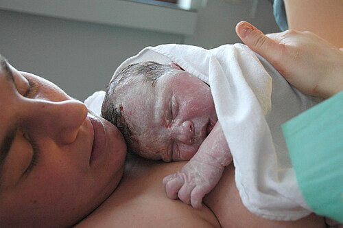

# PUERICULTURA

A puericultura não é apenas uma consulta de rotina para "ver se o bebê está ganhando peso". Para a prova de residência e para a sua vida prática na Atenção Primária, entenda a puericultura como a ciência da vigilância do desenvolvimento integral. Nós não buscamos apenas doenças, nós buscamos desvios da normalidade e promoção de saúde.

Muitos alunos cometem o erro de achar que a puericultura se resume aos primeiros dois anos de vida. Cuidado: a Atenção Primária à Saúde da Criança abrange toda a infância e adolescência. Se a banca perguntar sobre a periodicidade, lembre-se de que ela é mais intensa no início, justamente pela velocidade das transformações biológicas.

*Figura 1 - Linha do tempo dos estágios de desenvolvimento infantil, do período neonatal até a adolescência. A puericultura acompanha todas estas fases com consultas programadas. Fonte: Mikael Häggström, Domínio Público | Wikimedia Commons*

## Indicadores de Saúde e Mortalidade

Antes de examinarmos a criança, precisamos entender o cenário onde ela vive. As bancas de Medicina Preventiva adoram cobrar os coeficientes de mortalidade, pois eles são o termômetro de uma nação.

O Coeficiente de Mortalidade Infantil (CMI) é calculado pelo número de óbitos em menores de 1 ano dividido pelo número de nascidos vivos, multiplicado por mil. Mas o que realmente cai na prova é a divisão desse indicador:

- Mortalidade Neonatal (até 28 dias): Reflete diretamente a qualidade da assistência ao pré-natal e ao parto. Se o CMI neonatal está alto, o problema está no hospital ou no acompanhamento da gestante.

- Mortalidade Infantil Tardia (28 dias a 1 ano): Aqui o bicho pega no ambiente. Esse indicador é sensível às condições de saneamento, nutrição (desmame precoce) e infecções. Se cair uma questão sobre "causas ambientais", foque na mortalidade tardia.

Um conceito que confunde muita gente é o Indicador de Swaroop e Uemura (ISU). Ele não mede apenas crianças, mas a saúde geral. É a proporção de óbitos em pessoas com 50 anos ou mais em relação ao total de óbitos. Quanto maior o ISU, melhor o nível de vida daquela população, pois significa que as pessoas estão morrendo de velhice, não de causas evitáveis na juventude.

*Figura 2 - Recém-nascido com vérnix caseoso sobre a mãe imediatamente após o parto. A avaliação do RN e o contato pele a pele são momentos fundamentais da puericultura neonatal. Fonte: Tom Adriaenssen, CC BY-SA 2.0 | Wikimedia Commons*

## Crescimento Infantil: A Antropometria

Crescimento é aumento de tamanho (hiperplasia e hipertrofia). Para avaliar isso, usamos as curvas da OMS, adotadas pelo Ministério da Saúde.

### Peso e Estatura

O peso é o indicador mais sensível para alterações agudas. Uma diarreia de três dias derruba o peso, mas não mexe na estatura. Já a estatura reflete o histórico crônico da criança. Se a criança é baixa para a idade, ela provavelmente sofreu uma privação prolongada (nutricional ou emocional).

Ao analisar as curvas de escore Z:

- Z entre +1 e -2: Eutrofia (para crianças menores de 5 anos).

- Z abaixo de -2: Baixo peso ou baixa estatura.

- Z acima de +2: Sobrepeso ou obesidade (dependendo do índice).

Um erro clássico é desesperar-se com um ponto isolado na curva. Na puericultura do MedEvo, ensinamos que o que importa é a tendência. Uma criança que sempre esteve no escore Z -1,5 e continua lá, está crescendo no seu canal. O problema é a criança que estava no Z +1 e "cruza" as linhas para baixo.

### Estatura Alvo

Como saber se o potencial genético está sendo atingido? Usamos a fórmula da estatura alvo:

- Meninos: (Altura do pai + Altura da mãe + 13) / 2

- Meninas: (Altura do pai + Altura da mãe - 13) / 2

Isso nos dá uma ideia de onde a criança deve chegar, com uma margem de erro de 5 cm para mais ou para menos.

## Desenvolvimento Neuropsicomotor (DNPM)

Se o crescimento é "quantidade", o desenvolvimento é "qualidade". É a aquisição de funções. Aqui, o examinador quer saber se você conhece os marcos do desenvolvimento e os sinais de alerta.

O Ministério da Saúde utiliza uma caderneta que simplifica o Teste de Denver II. Você deve observar:

- Marcos motores (ex: sustentar a cabeça aos 3 meses, sentar sem apoio aos 6-9 meses, andar aos 12-15 meses).

- Marcos adaptativos e sociais (ex: sorriso social aos 2 meses).

- Linguagem (ex: balbucio aos 6 meses, primeiras palavras com sentido aos 12 meses).

Por que focamos tanto nisso? Porque a detecção precoce de atrasos permite intervenções de plasticidade cerebral que mudam o prognóstico. Fatores de risco como prematuridade, baixo peso ao nascer, violência doméstica e pais adolescentes devem acender o sinal amarelo imediatamente.

## Triagem Neonatal: Os Testes do "Inho"

Este é, sem dúvida, um dos temas mais cobrados. O Brasil possui um Programa Nacional de Triagem Neonatal que é referência.

### Teste do Pezinho

Deve ser feito preferencialmente entre o 3º e o 5º dia de vida. Por que não antes? Porque para detectar doenças como a Fenilcetonúria, a criança precisa ter ingerido proteína (leite) para que os níveis de fenilalanina subam.

As doenças obrigatórias na fase atual do PNTN nacional são:

- Fenilcetonúria.

- Hipotireoidismo Congênito.

- Doença Falciforme (e outras hemoglobinopatias).

- Fibrose Cística.

- Hiperplasia Adrenal Congênita.

- Deficiência de Biotinidase.

### Outros Testes de Triagem

- Teste do Coraçãozinho: Realizado entre 24-48h de vida, antes da alta. Mede a oximetria no membro superior direito (pré-ductal) e em um dos membros inferiores (pós-ductal). Diferença ≥ 3% ou saturação < 95% exige ecocardiograma.

- Teste da Orelhinha (Emissões Otoacústicas): Detecta precocemente a deficiência auditiva congênita. Se falhar, repete-se o teste (reteste) e, se persistir, encaminha-se para o BERA.

- Teste do Olhinho (Reflexo Vermelho): Identifica leucocoria (reflexo branco), que pode indicar catarata congênita ou retinoblastoma.

## Aleitamento Materno: O Padrão Ouro

O Dr. Will sempre reforça: o aleitamento materno exclusivo até os 6 meses é a intervenção isolada com maior impacto na redução da mortalidade infantil.

### Definições Importantes para a Prova

- Exclusivo: Apenas leite materno (direto da mama ou ordenhado). Pode receber gotas de vitaminas/minerais ou medicamentos. Não recebe água nem chás.

- Predominante: Leite materno + água, chás ou sucos. (Isso é um erro comum na prática, mas cai como definição).

- Complementado: Leite materno + alimentos sólidos ou semissólidos.

### Técnica da Amamentação

A "pega" correta é o segredo para evitar fissuras mamárias e garantir o esvaziamento da mama. Os sinais de pega correta são:

- Boca bem aberta (boca de peixinho).

- Lábios evertidos.

- Queixo encostando na mama.

- Aréola mais visível acima da boca do bebê do que abaixo.

Se a mãe apresenta fissuras, a conduta não é suspender a amamentação, mas sim corrigir a pega. A candidíase mamária, embora menos comum, causa dor em "agulhadas" e exige tratamento simultâneo da mãe e do bebê.

### Contraindicações ao Aleitamento

No Brasil, a contraindicação absoluta mais importante é a infecção pelo HIV. O vírus é transmitido pelo leite e o risco não justifica o benefício, já que o governo fornece fórmula infantil gratuitamente. Outra contraindicação absoluta é o vírus HTLV-1 e 2.

Cuidado com a tuberculose: a mãe com TB bacilífera NÃO contraindica a amamentação, mas exige cuidados (máscara e não amamentar se houver lesão mamária de TB). O bebê deve receber quimioprofilaxia.

## Alimentação Complementar e Suplementação

Aos 6 meses, o leite materno sozinho já não supre as necessidades de ferro e zinco, além de a criança já apresentar sinais de prontidão (sentar com apoio, controle cervical, perda do reflexo de extrusão da língua).

### Regras da Introdução Alimentar (MS/SBP)

- Iniciar aos 6 meses.

- Consistência: Começar com papas amassadas (garfo), nunca liquidificador ou peneira. O objetivo é estimular a mastigação.

- Variedade: Grupos de cereais/tubérculos, leguminosas, proteínas e hortaliças.

- Açúcar: Proibido até os 2 anos de idade.

- Sal: Mínimo possível.

### Suplementação de Ferro e Vitamina D

Segundo a Sociedade Brasileira de Pediatria (SBP):

- Vitamina D: 400 UI/dia do nascimento até 12 meses; 600 UI/dia dos 12 aos 24 meses.

- Ferro: O esquema mudou recentemente e as bancas amam.

- Termo, peso adequado, em aleitamento materno: Iniciar **10-12,5 mg/dia dose fixa** de ferro elementar aos 6 meses, em **2 ciclos de 3 meses** (6-9m suplementa, 9-12m pausa, 12-15m suplementa) — SBP 2026.

- Prematuros ou Baixo Peso (< 2.500g): Iniciar com 30 dias de vida. A dose varia conforme o peso de nascimento (2mg/kg a 4mg/kg).

Se a criança consome mais de 500ml/dia de fórmula infantil que já contenha ferro na dose padrão, a suplementação profilática pode ser dispensada.

## Imunização na Puericultura

O Programa Nacional de Imunizações (PNI) é vasto, mas na puericultura focamos nas vacinas do primeiro ano.

Um ponto de muita confusão é a vacina da Poliomielite. Atualmente, o esquema básico é feito exclusivamente com a VIP (Vacina Inativada Poliomielite) aos 2, 4 e 6 meses. A VOP (gotinha) é utilizada apenas nos reforços e campanhas.

Outra pérola: a vacina BCG. Se a criança não apresentar a cicatriz vacinal após 6 meses, a recomendação atual do Ministério da Saúde é NÃO revacinar. Antigamente revacinava-se, mas os estudos mostraram que a ausência de cicatriz não significa falta de proteção.

## Segurança e Prevenção de Acidentes

Acidentes (causas externas) são a principal causa de morte em crianças acima de 1 ano no Brasil. Na puericultura, fazemos a "antecipação do risco".

### Segurança no Trânsito (Lei da Cadeirinha)

- Bebê Conforto: Até 1 ano ou conforme limite de peso do fabricante, virado para trás (reduz lesão cervical).

- Cadeirinha: De 1 a 4 anos, virada para frente.

- Assento de Elevação (Booster): De 4 a 7 anos e meio (ou até atingir 1,45m).

- Banco Traseiro com Cinto: De 7 anos e meio a 10 anos.

### Sono Seguro

Para reduzir o risco de Síndrome da Morte Súbita do Lactente (SMSL), a orientação é clara: o bebê deve dormir de barriga para cima (decúbito dorsal). Dormir de lado ou de bruços é fator de risco evitável. Além disso, o berço deve ser firme, sem pelúcias, protetores ou cobertores soltos.

## O Estatuto da Criança e do Adolescente (ECA)

O ECA é lei federal e cai em quase todas as provas de Preventiva. Ele define:

- Criança: Pessoa até 12 anos incompletos.

- Adolescente: Entre 12 e 18 anos.

Princípios fundamentais:

- Prioridade Absoluta: A criança deve ser a primeira a receber socorro, a primeira em políticas públicas e a primeira na destinação de recursos.

- Proteção Integral: A criança é vista como sujeito de direitos e pessoa em condição peculiar de desenvolvimento.

Maus-tratos: Se você, médico, suspeitar de maus-tratos (não precisa ter certeza absoluta), a notificação é compulsória e imediata aos órgãos de proteção (Conselho Tutelar, Ministério Público ou autoridade policial). Omissão de notificação é infração administrativa e ética.

## Tabelas Comparativas para Fixação

### Tabela 1: Resumo da Triagem Neonatal (Pezinho)

| Doença | O que detecta | Por que tratar cedo? |
| --- | --- | --- |
| Fenilcetonúria | Acúmulo de Fenilalanina | Evitar deficiência intelectual irreversível |
| Hipotireoidismo Congênito | TSH elevado | Evitar o "cretinismo" (atraso mental e de crescimento) |
| Doença Falciforme | Hemoglobina S | Prevenir crises álgicas e infecções graves |
| Fibrose Cística | Tripsina Imunorreativa (IRT) | Melhorar nutrição e função pulmonar |
| Hiperplasia Adrenal | Deficiência de 21-hidroxilase | Evitar crise de perda de sal e virilização |
| Deficiência Biotinidase | Falta da enzima biotina | Evitar convulsões e atraso de desenvolvimento |

### Tabela 2: Classificação do Estado Nutricional (OMS - 0 a 5 anos)

| Índice | Escore Z < -3 | Escore Z < -2 e ≥ -3 | Escore Z > +2 |
| --- | --- | --- | --- |
| Peso / Idade | Muito baixo peso | Baixo peso | (Não usado isolado) |
| Estatura / Idade | Muito baixa estatura | Baixa estatura | (Normal) |
| IMC / Idade | Magreza acentuada | Magreza | Sobrepeso (Z>+2) / Obesidade (Z>+3) |

### Tabela 3: Marcos do Desenvolvimento (Denver II Simplificado)

| Idade | Marco Motor | Marco Social / Linguagem |
| --- | --- | --- |
| 2 meses | Eleva a cabeça | Sorriso social |
| 4 meses | Sustenta a cabeça | Agarra objetos |
| 6 meses | Senta com apoio | Inicia balbucio |
| 9 meses | Senta sozinho | Ansiedade de separação (estranha desconhecidos) |
| 12 meses | Anda com apoio | Fala "papai/mamãe" com sentido |

## Situações Comuns na Puericultura

### Anemia Ferropriva

É a carência nutricional mais comum. O diagnóstico é feito pela hemoglobina (Hb < 11 g/dL em crianças de 6 meses a 5 anos). O tratamento não é apenas dar o ferro, mas investigar a causa (geralmente erro alimentar ou parasitoses) e orientar o consumo de facilitadores da absorção (Vitamina C) e evitar inibidores (cálcio/leite logo após as refeições).

### Dermatite Atópica

Doença inflamatória crônica, muito associada à asma e rinite (tríade atópica). O tratamento baseia-se na hidratação intensa da pele e uso de corticoides tópicos nas crises. A orientação de "banhos rápidos, mornos e sem excesso de sabonete" é questão certa de prova.

### Asma Infantil

O diagnóstico em crianças pequenas é clínico (bebê chiador). O tratamento de manutenção foca no controle da inflamação com corticoides inalatórios. Lembre-se: o uso de "bombinhas" não vicia e é a via preferencial por ter menos efeitos sistêmicos.

## O Papel da Família e do Pai

A puericultura moderna não foca apenas no binômio mãe-filho. A participação paterna é incentivada desde o pré-natal (Pré-natal do Parceiro). O ciclo de vida familiar deve ser avaliado: famílias em situação de vulnerabilidade ou com ciclos vitais "populares" (muitas gerações na mesma casa, tarefas pouco definidas) têm maior risco de desfechos negativos na saúde da criança.

A vigilância à saúde deve ser integral. Se uma mãe traz o filho para pesar, mas você percebe que ela está deprimida ou que o pai está desempregado, isso faz parte da sua consulta de puericultura. O ambiente é o que mais determina a saúde na infância tardia.

## Pontos-Chave para Prova

- **Mortalidade Infantil:** Neonatal (até 28 dias) reflete assistência ao parto/pré-natal; Tardia (28d-1a) reflete ambiente/saneamento.

- **Teste do Pezinho:** Ideal entre o 3º e 5º dia de vida. Se feito antes de 48h, pode dar falso negativo para Fenilcetonúria.

- **HIV e Amamentação:** Contraindicação ABSOLUTA no Brasil. O aleitamento cruzado (ama de leite) também é proibido.

- **Cicatriz da BCG:** Se não formou cicatriz em 6 meses, NÃO revacina (norma MS).

- **Suplementação de Ferro:** Crianças a termo em aleitamento materno iniciam 10-12,5 mg/dia (dose fixa) aos 6 meses, em 2 ciclos de 3 meses (6-9m e 12-15m) — SBP 2026.

- **Vitamina D:** 400 UI/dia no primeiro ano; 600 UI/dia no segundo ano.

- **Posição para Dormir:** Sempre de barriga para cima (decúbito dorsal) para evitar morte súbita.

- **ECA:** Notificação de suspeita de maus-tratos é obrigatória e imediata. Não precisa de prova cabal para notificar.

- **Introdução Alimentar:** Aos 6 meses, comida amassada, sem açúcar e sem uso de peneira/liquidificador.

- **Swaroop-Uemura:** Mede a proporção de óbitos em maiores de 50 anos. Quanto maior, melhor a saúde da população.

- **Poliomielite:** Esquema básico de 3 doses (2, 4 e 6 meses) é feito apenas com VIP (inativada).

- **Crescimento:** Estatura reflete o passado (crônico); Peso reflete o presente (agudo).

- **Fluoretação da Água:** É a medida coletiva mais eficaz e de menor custo para prevenção de cárie dentária.

- **Teste do Coraçãozinho:** Positivo se Sat < 95% ou diferença ≥ 3% entre MSD e MI. Conduta: Repetir em 1h; se persistir, Ecocardiograma em 24h.

- **Estatura Alvo:** (H pai + H mãe + 13)/2 para meninos; -13 para meninas. 💡

 Cópia offline para consulta pessoal.
 Fonte original:
 [https://www.medevo.com.br/material-apoio/ler/844bca38-94d1-412e-bb03-511dcef5c0d4](https://www.medevo.com.br/material-apoio/ler/844bca38-94d1-412e-bb03-511dcef5c0d4)
