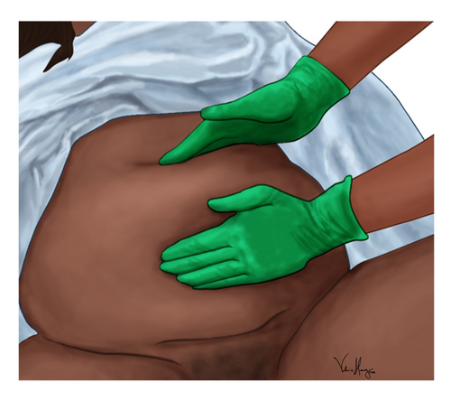
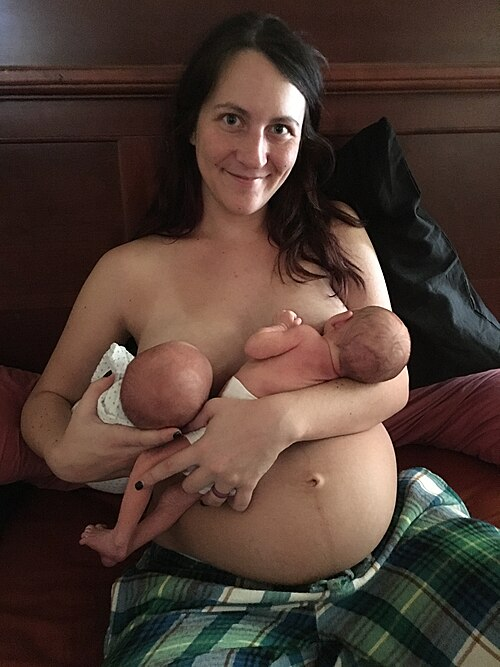

# PUERPÉRIO NORMAL

O puerpério é o período cronológico que se inicia logo após a dequitação placentária e se estende até que as modificações locais e sistêmicas provocadas pela gravidez no organismo materno retornem ao estado pré-gravídico. Embora muitos livros falem em 6 semanas ou 42 dias, na prática e nas provas, esse limite é fluido, especialmente se a mulher estiver amamentando.

Como professor, eu digo: não veja o puerpério apenas como o "fim" da linha. Para as bancas de residência, ele é um campo minado de fisiologia hormonal, escolhas contraceptivas e cuidados com o recém-nascido. Vamos entender como esse processo se divide e o que acontece em cada fase.

*Figura 1 - Ilustração da massagem uterina bimanual no puerpério imediato. Essa manobra promove a contração uterina e auxilia na formação do Globo de Segurança de Pinard, prevenindo hemorragia pós-parto. Fonte: Valerie Henry, CC BY-SA 4.0 | Wikimedia Commons*

## Classificação e Cronologia

Dividimos o puerpério em três grandes fases. Essa divisão não é apenas teórica, ela dita o risco de complicações.

- **Puerpério Imediato:** Do 1º ao 10º dia. É aqui que ocorrem as maiores crises hemorrágicas e onde a hemostasia uterina é testada.

- **Puerpério Tardio:** Do 11º ao 45º dia. É a fase da involução propriamente dita e do estabelecimento da lactação plena.

- **Puerpério Remoto:** Além do 45º dia. Aqui, o foco das provas costuma ser o retorno da fertilidade e a contracepção.

Nas questões de prova, é comum aparecer um cenário de 2º dia pós-parto. Se a paciente tiver útero a cerca de 18 cm da sínfise púbica, colo pérvio para 1,5 cm e loquiação rubra, não se assuste. Isso é o **Puerpério Fisiológico**. O Dr. Will sempre lembra aos alunos: o útero não "some" no dia seguinte ao parto, ele regride gradualmente.

*Figura 2 - Amamentação em tandem de gêmeos com 6 dias de vida no puerpério imediato. O aleitamento materno exclusivo é fundamental neste período e também atua como método contraceptivo (LAM) quando em amamentação exclusiva. Fonte: Mypurplelighter, CC BY-SA 4.0 | Wikimedia Commons*

## Fenômenos Involutivos e Fisiologia

### Involução Uterina

Logo após a saída da placenta, o útero se contrai vigorosamente para formar o chamado Globo de Segurança de Pinard. Por que isso acontece? Para realizar a "ligadura viva" dos vasos uterinos que ficaram expostos. Se o útero não contrai, temos a atonia uterina, principal causa de hemorragia pós-parto.

No pós-parto imediato, o fundo do útero está ao nível da cicatriz umbilical. A cada dia, ele regride cerca de 1 a 2 cm. Por volta do 10º dia, ele se torna um órgão intrapélvico, ou seja, você não consegue mais palpá-lo pelo abdome.

### Loquiação

A loquiação é a eliminação de sangue, muco e tecidos deciduais pelo canal vaginal. Entender a cor da loquiação é fundamental para diferenciar o normal do patológico.

| Tipo de Lóquio | Período Estimado | Características |
| --- | --- | --- |
| **Lóquios Rubra** | 1º ao 3º dia | Vermelho vivo, sangue e restos de membranas. |
| **Lóquios Serosa** | 4º ao 10º dia | Rosado ou acastanhado, serosanguinolento. |
| **Lóquios Flava/Alba** | Após o 10º dia | Amarelado ou esbranquiçado, rico em leucócitos. |

**Cuidado com a pegadinha:** Se a loquiação for "flava" (amarelada) mas vier acompanhada de odor fétido e febre, suspeite de infecção puerperal. Se for apenas amarelada e a paciente estiver bem, é fisiológico.

### Colo do Útero e Vagina

O colo do útero fecha progressivamente. No 2º dia, ele ainda permite a passagem de um ou dois dedos (cerca de 1,5 a 2 cm). Ao final da primeira semana, o orifício interno está fechado. A vagina recupera seu tônus, mas as rugosidades demoram a reaparecer, especialmente em mulheres que amamentam, devido ao estado de hipoestrogenismo.

## Alterações Hormonais e Metabólicas

A saída da placenta provoca uma queda abrupta dos hormônios placentários: estrogênio, progesterona e o lactogênio placentário humano (hPL).

### O Papel da Prolactina e Ocitocina

Com a queda da progesterona, a prolactina assume o protagonismo na glândula mamária para a produção de leite. A ocitocina, liberada pela sucção do bebê, causa a ejeção do leite e, simultaneamente, contrações uterinas. É por isso que muitas puérperas sentem cólicas ao amamentar. Isso é bom! Ajuda na involução uterina e diminui a loquiação.

### Diabetes e Puerpério

Se a paciente teve Diabetes Gestacional (DMG), a queda do hPL (que é um hormônio diabetogênico) muda tudo. No pós-parto, a resistência insulínica cai drasticamente.

- **Conduta:** Reduzir a insulina em 50 a 75% ou até suspendê-la em casos de DMG A2, mantendo monitoramento rigoroso para evitar hipoglicemia.

- **Rastreio:** Toda mulher com DMG deve realizar um novo TOTG 75g entre 6 e 12 semanas após o parto para reclassificação.

### Síndrome de Sheehan

Se houver uma hemorragia pós-parto grave com choque, pode ocorrer necrose isquêmica da hipófise. O primeiro sinal clínico costuma ser a **agalactia** (ausência de leite), seguida de outros sinais de hipopituitarismo. Guarde esse nome, as bancas adoram relacionar hemorragia com falta de leite.

## Assistência à Puérpera no Alojamento Conjunto

A deambulação precoce é a regra de ouro. Por que insistimos tanto nisso? Porque o puerpério é um estado de hipercoagulabilidade. Aumentar a mobilidade reduz drasticamente o risco de Tromboembolismo Venoso (TEV).

### Cuidados com as Mamas

O colostro é o primeiro leite, rico em anticorpos e proteínas, presente nos primeiros dias. A "apojadura" (descida do leite) ocorre geralmente entre o 2º e o 5º dia. Se as mamas estiverem turgidas, mas indolores e sem sinais inflamatórios, é apenas o processo fisiológico.

### Higiene e Ferida Operatória

Banho de chuveiro é permitido e recomendado desde o primeiro dia. A limpeza do períneo (em caso de parto vaginal ou episiotomia) deve ser feita apenas com água e sabão neutro. Não há necessidade de antissépticos complexos.

## Contracepção no Puerpério

Este é, sem dúvida, o tema mais cobrado em provas dentro de "Puerpério Normal". O MedEvo destaca que a escolha do método depende fundamentalmente de dois fatores: o tempo pós-parto e se a mulher está amamentando.

### Critérios de Elegibilidade da OMS

A regra geral é: **Evite Estrogênio**. O estrogênio aumenta o risco de trombose (que já é alto no puerpério) e interfere negativamente na produção de leite.

| Método | Amamentando (< 6 semanas) | Amamentando (> 6 semanas) | Não Amamentando |
| --- | --- | --- | --- |
| **Combinados (Pílula/Injetável)** | Categoria 4 (Proibido) | Categoria 3 (Evitar) | Categoria 3 (<21 dias) / 1 ou 2 (>21 dias) |
| **Progestagênio Isolado** | Categoria 2 (Pode usar) | Categoria 1 (Ideal) | Categoria 1 |
| **DIU de Cobre / Prata** | Categoria 1 (Até 48h ou >4 semanas) | Categoria 1 | Categoria 1 |
| **Implante de Etonogestrel** | Categoria 2 (Pode usar) | Categoria 1 | Categoria 1 |

**Dicas Práticas de Prova:**

- **Pílula de Progestagênio (Minipílula):** Pode ser iniciada imediatamente, mas a recomendação clássica para amamentação exclusiva é iniciar após 6 semanas.

- **DIU:** Pode ser inserido no pós-parto imediato (até 10 minutos após a saída da placenta) ou após 4 semanas. Entre 48h e 4 semanas, o risco de expulsão é muito alto (Categoria 3).

- **Método da Amenorreia Lactacional (MAL):** Só funciona se: amamentação exclusiva + amenorreia + bebê < 6 meses. Se um desses falhar, precisa de outro método.

- **Cefaleia com aura:** É contraindicação absoluta para qualquer método combinado (estrogênio), independentemente do puerpério. O DIU de cobre é sempre uma opção segura.

## O Binômio Mãe-Filho: Cuidados com o Recém-Nascido (RN)

O obstetra precisa conhecer o básico do RN para garantir que o binômio esteja bem para a alta.

### Contato Pele a Pele e Amamentação Precoce

O contato pele a pele imediato, ainda na sala de parto, é indicado para todo RN com boas condições de vitalidade. Isso promove o apego, estabilidade térmica e o sucesso da amamentação na primeira hora de vida (a "hora de ouro").

### Eliminação de Mecônio e Perda de Peso

O mecônio deve ser eliminado nas primeiras 24 a 48 horas. Se houver atraso, devemos investigar obstrução intestinal ou doenças como fibrose cística.
Quanto ao peso, é fisiológico o RN perder até 10% do peso de nascimento na primeira semana de vida. Ele deve recuperar esse peso por volta do 10º ao 14º dia.

### Icterícia Neonatal

- **Icterícia < 24h de vida:** Sempre patológica. Investigar hemólise (Coombs, tipagem sanguínea).

- **Icterícia > 24h:** Pode ser fisiológica, mas se atingir zonas de Kramer avançadas (Zona II ou III em 48h), deve-se dosar bilirrubinas.

- **Colestase:** Se o bebê tem mais de 14 dias e apresenta icterícia com bilirrubina direta (BD) > 1 mg/dL ou > 20% da BT, ou fezes claras (acolia), pense em Atresia de Vias Biliares. É uma emergência cirúrgica!

### Triagens Neonatais (Os "Testinhos")

- **Teste do Pezinho:** Idealmente entre o 3º e 5º dia.

- **Teste do Coraçãozinho (Oximetria):** Feito entre 24-48h de vida, no MSD e em um dos membros inferiores. Normal se ≥ 95% e diferença < 3%. Se alterado, repetir em 1h. Se persistir, Ecocardiograma.

- **Teste da Orelhinha:** Emissões otoacústicas.

- **Teste do Olhinho:** Reflexo vermelho.

## Aspectos Psicossociais

Não confunda "Baby Blues" com Depressão Pós-Parto.

- **Baby Blues (Disforia Puerperal):** Atinge até 80% das mulheres. Começa no 3º dia, dura cerca de duas semanas. É leve, a mãe cuida do bebê, mas está sensível e chorosa. Conduta: Apoio e observação.

- **Depressão Pós-Parto:** Mais grave, sintomas persistentes, desinteresse pelo bebê. Requer tratamento farmacológico e psicoterapia.

## Situações Especiais e Complicações Comuns

### Incontinência Urinária de Esforço (IUE)

Muitas mulheres apresentam IUE no puerpério devido ao trauma do assoalho pélvico. A primeira linha de tratamento não é cirúrgica, mas sim a **fisioterapia do assoalho pélvico** (exercícios de Kegel).

### Síndrome de Asherman

Se a paciente teve uma hemorragia pós-parto que exigiu curetagem vigorosa e depois evoluiu com amenorreia ou hipomenorreia, pense em sinéquias uterinas (Síndrome de Asherman). O trauma endometrial impediu o crescimento do tecido.

### HTLV e HIV

Lembre-se: no Brasil, a amamentação é contraindicada de forma absoluta tanto para mães HIV positivas quanto para mães HTLV positivas. O rastreio deve ser feito no pré-natal, mas se chegar no puerpério sem exame, deve ser testada.

## Critérios de Alta Hospitalar

Para um parto vaginal sem intercorrências, o Ministério da Saúde recomenda um período mínimo de **48 horas** de observação. Por que tanto tempo?

- Para garantir que a amamentação está estabelecida.

- Para realizar o teste do coraçãozinho (após 24h).

- Para observar o pico da icterícia fisiológica.

- Para garantir que a mãe está hemodinamicamente estável e o útero bem contraído.

## Pontos-Chave para Prova

- **Involução Uterina:** O útero deve estar impalpável via abdominal por volta do 10º dia pós-parto.

- **Lóquios:** Rubra (sangue), Serosa (rosado), Alba (branco/amarelo). Odor fétido + febre = Infecção.

- **Contracepção e Estrogênio:** Contraindicação ABSOLUTA nas primeiras 6 semanas pós-parto para mulheres que amamentam (Risco de TEV e ↓ leite).

- **Método de Escolha na Lactação:** Progestagênio isolado (pílula, implante, injetável trimestral) ou DIU.

- **DIU de Cobre:** Pode ser inserido até 48h pós-parto ou após 4 semanas (evitar o intervalo entre 48h-4sem pelo risco de expulsão).

- **Diabetes Gestacional:** Reduzir insulina drasticamente após o parto e realizar TOTG 75g após 6 semanas.

- **Icterícia Neonatal:** Se surgir nas primeiras 24h de vida, é sempre patológica e exige investigação imediata.

- **Perda de Peso do RN:** Até 10% na primeira semana é considerado fisiológico.

- **Teste do Coraçãozinho:** Realizado entre 24-48h. Se saturação < 95% ou diferença ≥ 3% entre mão direita e pé, repetir em 1h; se persistir, solicitar ECO.

- **Síndrome de Sheehan:** Necrose hipofisária pós-hemorragia grave. O sinal clássico é a agalactia (ausência de apojadura).

- **Apgar:** Avaliado no 1º e 5º minutos. Se o 5º minuto for < 7, repetir a cada 5 minutos até os 20 minutos.

- **Amamentação e HIV/HTLV:** Contraindicação absoluta no Brasil. O aleitamento cruzado (ama de leite) também é proibido.

- **Deambulação Precoce:** Principal medida para prevenir tromboembolismo no puerpério.

- **Fezes do Bebê:** Atraso na eliminação de mecônio (>48h) ou fezes acólicas (claras) em bebês com mais de 2 semanas exigem investigação urgente.

- **Dormir Seguro:** O RN em alojamento conjunto deve dormir sempre em decúbito dorsal (barriga para cima) para prevenir a Síndrome da Morte Súbita do Lactente.

 Cópia offline para consulta pessoal.
 Fonte original:
 [https://www.medevo.com.br/material-apoio/ler/81bcef96-4a2b-4c52-a1d0-b509d0290135](https://www.medevo.com.br/material-apoio/ler/81bcef96-4a2b-4c52-a1d0-b509d0290135)
