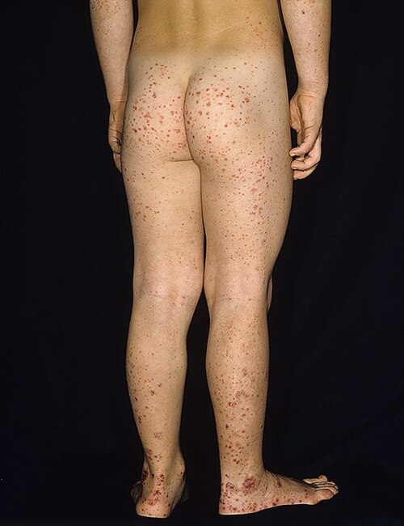
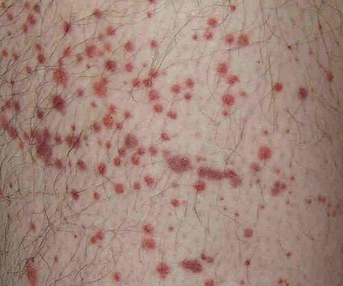

# PÚRPURA DE HENOCH-SCHÖNLEIN

A Púrpura de Henoch-Schönlein (PHS), que hoje chamamos oficialmente de **Vasculite por IgA (IgAV)**, é a vasculite mais comum na infância. Se você vai prestar prova de residência médica no Brasil, este é um tema obrigatório. Não é apenas "mais uma doença da pediatria", é a doença que as bancas amam porque ela mistura dermatologia, reumatologia, nefrologia e gastroenterologia em um único caso clínico.

Como professor, eu já vi muitos alunos perderem questões bobas por não entenderem a lógica por trás da doença. O segredo aqui não é decorar uma lista de sintomas, mas entender que estamos falando de uma inflamação de pequenos vasos causada por um "erro" do sistema imunológico ao lidar com a Imunoglobulina A (IgA).

*Figura 1 - Lesões típicas da Púrpura de Henoch-Schönlein (Vasculite por IgA): púrpura palpável predominando em membros inferiores e nádegas, padrão clássico da doença. Fonte: Madhero88/Dermnet.com, CC BY-SA 3.0 | Wikimedia Commons*

## O que é e por que acontece? (Fisiopatologia)

Para entender a PHS, você precisa lembrar do papel da IgA. Ela é a nossa sentinela das mucosas (respiratória e intestinal). Por isso, em 30 a 50% dos casos, a criança teve uma infecção de vias aéreas superiores (IVAS) ou uma gastroenterite alguns dias antes do quadro começar.

O "pulo do gato" está na estrutura da IgA1. Em pacientes com PHS, ocorre uma glicosilação deficiente dessa molécula (falta galactose na dobradiça da proteína). O corpo não reconhece essa IgA "estranha" e passa a produzir anticorpos IgG contra ela. O resultado? Formação de imunocomplexos que circulam e se depositam na parede dos pequenos vasos (vênulas pós-capilares).

Esses depósitos ativam a via alternativa do sistema complemento (principalmente C3), gerando uma **vasculite leucocitoclástica**. Isso significa que os neutrófilos chegam "quebrando tudo", causando extravasamento de sangue e edema. É por isso que a púrpura é palpável: não é apenas sangue na pele, é inflamação com edema de parede vascular.

Como sempre digo nas mentorias do MedEvo, se você entende que o problema é o depósito de IgA, você entende por que os órgãos afetados são a pele, as articulações, o intestino e os rins. São locais com redes capilares extensas onde esses complexos adoram se alojar.

## Epidemiologia: O Perfil do Paciente

A PHS é uma doença tipicamente pediátrica. Cerca de 90% dos casos ocorrem em crianças menores de 10 anos, com um pico de incidência por volta dos 6 anos de idade.

- **Sexo:** Há uma leve predominância masculina (cerca de 1,5 menino para cada 1 menina).

- **Sazonalidade:** É muito mais comum no outono e no inverno, justamente quando as infecções virais respiratórias estão no auge.

- **Gatilhos:** Além das IVAS (estreptococos é um clássico), pode ser desencadeada por vacinas, picadas de insetos ou uso de alguns medicamentos.

*Figura 2 - Lesões de púrpura na pele. Na PHS, a púrpura é palpável (diferente da PTI) porque há inflamação de parede vascular por depósito de IgA, causando edema e não apenas extravasamento por falta de plaquetas. Fonte: User:Hektor, CC BY-SA 3.0 | Wikimedia Commons*

## O Quadro Clínico: A Tétrade Clássica

As bancas de prova raramente fogem da "tétrade clássica". Se o enunciado descreve uma criança com esses quatro pilares, o diagnóstico está praticamente dado.

### 1. Manifestações Cutâneas (Obrigatório)

A púrpura palpável é a marca registrada. Ela costuma aparecer em áreas de declive ou pressão, como membros inferiores e nádegas.

**Dica de Professor:** Por que nas pernas? Por causa da pressão hidrostática. O sangue "pesa" mais nos vasos de baixo, facilitando o extravasamento onde a parede já está inflamada. Em crianças que ainda não andam (lactentes), as lesões podem aparecer na face e no tronco, mas isso é a exceção.

As lesões começam como urticárias ou máculas eritematosas que evoluem para púrpuras e petéquias palpáveis. Elas não desaparecem à digitopressão. Um detalhe importante: em crianças menores de 2 anos, é comum o **edema subcutâneo** em couro cabeludo, mãos e pés.

### 2. Manifestações Articulares

Ocorre em cerca de 75% dos pacientes. É uma artralgia ou artrite aguda, geralmente migratória e transitória.

- **Locais:** Tornozelos e joelhos são os mais afetados.

- **Característica:** Causa muita dor e limitação funcional (a criança para de andar), mas **não deixa sequelas**. Não há deformidade articular na PHS.

### 3. Manifestações Gastrointestinais

Presente em 50 a 75% dos casos. A dor abdominal costuma ser do tipo cólica, periumbilical, e piora após as refeições (angina abdominal).

- **Por que dói?** Por causa do edema e da hemorragia na parede do intestino.

- **Complicação temida:** A invaginação intestinal (intussuscepção). Na PHS, ela costuma ser **íleo-ileal** (diferente da forma idiopática comum, que é íleo-cólica). Se a dor for súbita e intensa, peça um ultrassom imediatamente.

### 4. Manifestações Renais (O Prognóstico)

Ocorre em até 50% dos casos e é o que define o futuro do paciente. A nefropatia por IgA da PHS é histologicamente idêntica à Doença de Berger.

- **Sinais:** Hematúria (micro ou macroscópica) e proteinúria.

- **Gravidade:** Pode variar de uma alteração leve no sedimento urinário até uma glomerulonefrite rapidamente progressiva com insuficiência renal.

## Critérios Diagnósticos (EULAR/PRINTO/PRES)

Esqueça critérios antigos. Para a prova, o que vale é o consenso de 2008 (Ankara), que exige a púrpura palpável como critério obrigatório.

| Critério | Definição |
| --- | --- |
| **Púrpura Palpável (Obrigatório)** | Petéquias ou púrpuras (geralmente em MMII) sem trombocitopenia. |
| **Dor Abdominal** | Dor aguda, difusa, em cólica (pode ter sangue nas fezes). |
| **Histopatologia** | Vasculite leucocitoclástica com depósitos de IgA (pele) ou glomerulonefrite com IgA (rim). |
| **Artrite ou Artralgia** | Artrite (edema/limitação) ou artralgia (dor) de início agudo. |
| **Acometimento Renal** | Hematúria (>5 hemácias/campo) ou Proteinúria (>0,3g/24h). |

**Diagnóstico Feito:** Púrpura Palpável + pelo menos 1 dos outros 4 critérios.

## Diagnóstico Diferencial: Onde mora o perigo

Aqui é onde o Dr. Will sempre alerta: o diagnóstico de PHS é clínico, mas você precisa excluir "imitadores" perigosos.

- **Púrpura Trombocitopênica Idiopática (PTI):** Na PTI, a plaqueta está baixa. Na PHS, a plaqueta está **normal ou alta** (reagente de fase aguda). Se a plaqueta estiver baixa, não é PHS.

- **Meningococcemia:** O paciente com meningococcemia está em estado tóxico, febril e chocado. A criança com PHS, apesar da dor, geralmente tem bom estado geral.

- **Dengue:** Pode cursar com púrpuras e dor abdominal, mas haverá plaquetopenia e outros sinais epidemiológicos.

- **Edema Agudo Hemorrágico do Lactente:** Ocorre em menores de 2 anos, com lesões em "alvo" grandes na face e extremidades, mas sem o comprometimento sistêmico da PHS.

## Avaliação Laboratorial

Não existe um "exame de PHS". O laboratório serve para avaliar complicações e excluir diferenciais.

- **Hemograma:** Plaquetas normais ou elevadas (fundamental para diferenciar de PTI). Leucocitose discreta pode ocorrer.

- **Função Renal (Ureia/Creatinina):** Essencial na avaliação inicial.

- **Urina I (Sedimento):** O exame mais importante para o seguimento. Procure por hematúria e proteinúria.

- **Coagulograma:** Normal. A PHS não é um distúrbio de coagulação, é uma inflamação do vaso.

- **Sangue Oculto nas Fezes:** Pode ajudar se houver suspeita de sangramento intestinal oculto.

- **Complemento (C3 e C4):** Geralmente normais (diferente do lúpus ou da GNPE).

## Tratamento: O que fazer e o que NÃO fazer

A maioria dos casos de PHS é autolimitada e requer apenas suporte.

### Medidas Gerais

- **Repouso:** Ajuda a reduzir o surgimento de novas lesões purpúricas nos membros inferiores.

- **Hidratação:** Manter boa perfusão renal e intestinal.

- **Analgesia:** Paracetamol ou Dipirona para dor leve.

### Tratamento Farmacológico

Aqui as bancas adoram testar seu conhecimento sobre o uso de corticoides.

- **AINEs (ex: Naproxeno):** Podem ser usados para a artrite/artralgia, desde que não haja comprometimento renal ou sangramento gastrointestinal ativo.

- **Corticosteroides (Prednisona 1-2 mg/kg/dia):**

- **Indicações:** Dor abdominal intensa, hemorragia gastrointestinal, orquite (inflamação testicular) ou edema subcutâneo grave.

- **O Grande Erro de Prova:** Achar que o corticoide previne a nefrite. **Falso!** Estudos mostram que o corticoide ajuda nos sintomas agudos (dor abdominal e articular), mas não reduz a chance de o paciente desenvolver doença renal no futuro.

- **Ranitidina:** A SBP menciona que pode ser usada para reduzir a dor e o risco de sangramento digestivo (dose de 5 mg/kg/dia).

### Quando Internar?

- Incapacidade de manter hidratação oral.

- Dor abdominal intensa ou sangramento digestivo importante.

- Insuficiência renal aguda ou síndrome nefrótica.

- Dúvida diagnóstica.

- Complicações como intussuscepção ou orquite grave.

## Complicações e Seguimento

O acompanhamento é a parte mais negligenciada na prática, mas muito cobrada em provas.

### A Regra dos 6 Meses

Mesmo que a criança melhore da pele e das articulações em 2 semanas, o rim pode "abrir o bico" mais tarde. O risco de nefrite é maior nos primeiros 3 a 6 meses.

- **Protocolo sugerido:** Urina I e aferição de Pressão Arterial semanalmente no primeiro mês, quinzenalmente no segundo e terceiro meses, e mensalmente até completar 6 meses.

- Se após 6 meses os exames estiverem normais, o risco de sequela renal crônica é mínimo.

### Invaginação Intestinal

Diferente da intussuscepção clássica, na PHS ela é causada por um hematoma na parede do intestino que serve como "ponto de partida" para o deslizamento. Se o ultrassom mostrar invaginação, o tratamento pode exigir cirurgia, pois a redução pneumática/hidrostática tem maior taxa de falha devido à inflamação da parede.

## Prognóstico

Excelente na infância. Mais de 90% das crianças se recuperam totalmente. Cerca de 30% podem ter recorrência (geralmente mais leve que o primeiro episódio) nos primeiros meses, muitas vezes desencadeada por uma nova IVAS. O único fator que realmente determina o prognóstico a longo prazo é a **gravidade do envolvimento renal**.

## Pontos-Chave para Prova 💡

- **Definição:** Vasculite de pequenos vasos mediada por IgA (IgA1 mal glicosilada).

- **Critério Obrigatório:** Púrpura palpável (sem trombocitopenia) com predomínio em membros inferiores e nádegas.

- **Plaquetas:** Sempre normais ou aumentadas. Se estiverem baixas, pense em PTI ou Leucemia.

- **Tétrade:** Púrpura + Artralgia/Artrite + Dor Abdominal + Nefrite.

- **Gatilho Clássico:** Infecção de vias aéreas superiores (IVAS) dias antes.

- **Artrite:** Grande articulação (joelho/tornozelo), muito dolorosa, mas **não deixa sequela**.

- **Dor Abdominal:** Piora após comer (angina). Risco de intussuscepção íleo-ileal.

- **Corticoides:** Indicados para dor abdominal grave, orquite e nefrite grave. **NÃO previnem nefrite**.

- **Seguimento Renal:** Obrigatório por pelo menos 6 meses com Urina I e PA.

- **Biópsia de Pele:** Só em casos atípicos. Mostra vasculite leucocitoclástica com IgA.

- **Biópsia Renal:** Indicada se houver proteinúria nefrótica, queda de função renal ou hematúria macro persistente.

- **Diagnóstico Diferencial:** Meningococcemia (paciente grave/tóxico) e PTI (plaquetopenia).

- **O que NÃO fazer:** Não prescrever corticoide de rotina para casos leves (apenas pele e articulação). Não esquecer de monitorar a pressão arterial.

- **Pérola de Prova:** A PHS é a causa mais comum de púrpura não trombocitopênica na infância.

- **Tratamento de Escolha (Artrite):** Repouso e analgésicos/AINEs (se rim ok).

- **Complicação Cirúrgica:** Intussuscepção intestinal (suspeitar se dor abdominal súbita/vômitos).

 Cópia offline para consulta pessoal.
 Fonte original:
 [https://www.medevo.com.br/material-apoio/ler/9b8f9085-3c96-46bc-8689-f917c9f723be](https://www.medevo.com.br/material-apoio/ler/9b8f9085-3c96-46bc-8689-f917c9f723be)
