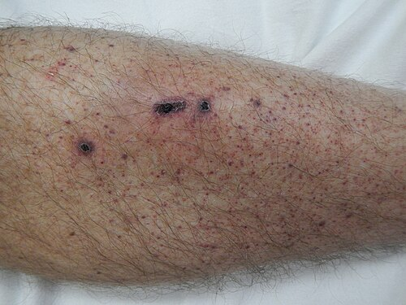
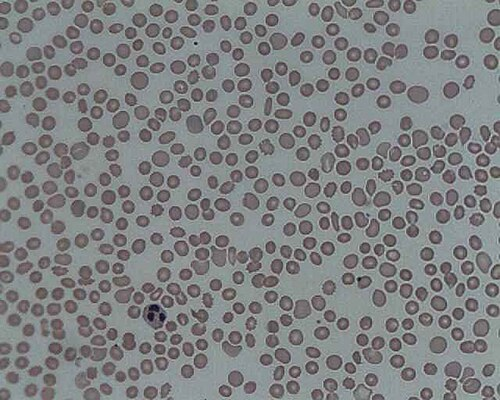

# PÚRPURAS E PLAQUETOPENIA

Para começar nosso estudo, precisamos organizar o raciocínio clínico. Quando você atende uma criança com manchas roxas ou pontinhos vermelhos na pele, a primeira pergunta que deve fazer não é qual o diagnóstico, mas sim: as plaquetas estão baixas ou normais?

Essa distinção separa as púrpuras em dois grandes grupos: as trombocitopênicas (plaquetas < 150.000/mm³) e as não trombocitopênicas (geralmente vasculites ou distúrbios da coagulação). Entender essa bifurcação é o que vai impedir você de errar questões que tentam misturar a Púrpura de Henoch-Schönlein com a PTI.

*Figura 1 - Petéquias difusas em membro inferior de paciente com PTI e plaquetas de 3.000/mm³. As petéquias são lesões puntiformes que não desaparecem à digitopressão e indicam distúrbio da hemostasia primária. Fonte: James Heilman, MD, CC BY-SA 4.0 | Wikimedia Commons*

## Fisiologia e Definições Iniciais

As plaquetas são fragmentos citoplasmáticos dos megacariócitos da medula óssea. Em pediatria, consideramos o valor de referência normal entre 150.000 e 450.000/mm³. Quando falamos em plaquetopenia ou trombocitopenia, estamos nos referindo a valores abaixo de 150.000/mm³.

No entanto, a clínica de sangramento espontâneo geralmente só aparece quando os níveis caem abaixo de 20.000 a 30.000/mm³. É por isso que muitas vezes você verá uma criança com 80.000 plaquetas completamente assintomática no pronto-socorro.

Um conceito que o MedEvo sempre reforça é a diferença morfológica das lesões:

- Petéquias: Pequenos pontos vermelhos (pinpoint), que não desaparecem à digitopressão. Indicam problema na hemostasia primária (plaquetas).

- Equimoses: Manchas maiores, as famosas "manchas roxas".

- Púrpura Palpável: Esta é a palavra-mágica para Vasculite. Se você palpa a lesão, o problema é inflamação do vaso, não apenas falta de plaquetas.

*Figura 2 - Esfregaço de sangue periférico de paciente com trombocitopenia, demonstrando ausência quase completa de plaquetas. O hemograma com lâmina é fundamental para descartar pseudoplaquetopenia por EDTA. Fonte: Prof. Erhabor Osaro, CC BY-SA 4.0 | Wikimedia Commons*

## Púrpura Trombocitopênica Imune (PTI)

A PTI é a "queridinha" das bancas de pediatria. É a causa mais comum de plaquetopenia isolada na infância, com um pico de incidência entre 2 e 5 anos de idade.

### Fisiopatologia: O Porquê do Sangramento

Por que uma criança saudável, de repente, acorda cheia de petéquias? Na maioria das vezes, houve uma infecção viral prévia (IVAS, gastroenterite ou até vacinação como a MMR) cerca de 1 a 4 semanas antes.

O corpo produz anticorpos (geralmente IgG) contra antígenos virais, mas, por um erro de "mira" do sistema imune (mimetismo molecular), esses anticorpos passam a se ligar a glicoproteínas da membrana plaquetária (como a GPIIb/IIIa). Essas plaquetas marcadas passam pelo baço, onde os macrófagos as reconhecem como estranhas e as destroem.

Cuidado: O baço não está doente. Ele está apenas fazendo o trabalho dele de "limpar" o que está marcado com anticorpo. É por isso que, na PTI clássica, não encontramos esplenomegalia. Se houver um baço gigante no exame físico, pare tudo e pense em Leucemia ou Hipertensão Portal.

### Quadro Clínico e Diagnóstico

O cenário clássico de prova é: criança previamente hígida, história de resfriado há duas semanas, que apresenta início súbito de petéquias, equimoses e, às vezes, epistaxe (sangramento nasal). O estado geral é excelente. A criança corre, brinca e não tem febre.

No hemograma, encontramos a plaquetopenia isolada. Muitas vezes, o examinador coloca que existem "macroplaquetas" no esfregaço. Isso acontece porque a medula óssea está saudável e tentando compensar a destruição periférica, jogando plaquetas jovens (maiores) na circulação.

O diagnóstico da PTI é de exclusão. Não existe um "teste padrão-ouro" confirmatório. Se a história é típica, o exame físico é normal (sem massas, sem linfonodomegalia, sem esplenomegalia) e o hemograma mostra apenas plaquetopenia, o diagnóstico é PTI.

### Quando pedir Mielograma?

Este é um dos pontos onde os alunos mais erram. Na PTI típica da criança, o aspirado de medula óssea NÃO é rotina. Segundo a Sociedade Brasileira de Pediatria (SBP), o mielograma deve ser reservado para casos atípicos:

- Presença de febre, dor óssea ou perda de peso (sinais de alerta para Leucemia).

- Alterações em outras linhagens (anemia ou leucopenia que não sejam explicadas por sangramento).

- Esplenomegalia ou linfonodomegalia importante.

- Falha na resposta ao tratamento inicial.

- Antes de iniciar corticoterapia, se houver qualquer dúvida diagnóstica (o corticoide pode "mascarar" uma leucemia linfoide aguda, dificultando o diagnóstico posterior).

### Manejo e Tratamento da PTI

Aqui, a conduta depende mais da clínica do que do número absoluto de plaquetas, embora os protocolos usem cortes numéricos para facilitar.

| Contagem de Plaquetas | Manifestação Clínica | Conduta Recomendada |
| --- | --- | --- |
| > 30.000/mm³ | Apenas pele (petéquias/equimoses) | Observação e orientações (evitar traumas) |
| < 20.000/mm³ | Sangramento mucoso leve | Considerar Corticoide ou IVIg |
| Qualquer valor | Sangramento grave (TGI, SNC) | Emergência: IVIg + Corticoide + Transfusão |

Por que evitamos tratar todos? Porque a PTI pediátrica é autolimitada em 80% dos casos, resolvendo-se sozinha em até 6 meses.

As opções farmacológicas são:

- Corticosteroides (Prednisona 1-4 mg/kg/dia ou Pulsoterapia com Metilprednisolona): Agem diminuindo a clareação esplênica e a produção de anticorpos.

- Imunoglobulina Intravenosa (IVIg): É o "plano de ação rápido". Ela satura os receptores dos macrófagos no baço, impedindo que eles destruam as plaquetas. É a escolha se precisarmos de um aumento rápido (ex: sangramento ativo ou cirurgia iminente). Dose usual: 0,8 a 1 g/kg em dose única.

Dica do Dr. Will: Nunca marque "Transfusão de Plaquetas" como primeira conduta na PTI, a menos que o paciente tenha um sangramento com risco de morte (como hemorragia intracraniana). Como o mecanismo é de destruição periférica, as plaquetas transfundidas serão destruídas em minutos. É como tentar encher um balde furado.

## Púrpura de Henoch-Schönlein (Vasculite por IgA)

Agora, mudamos o foco. Imagine uma criança com as mesmas manchas, mas as plaquetas estão em 300.000/mm³. Se as manchas forem palpáveis e concentradas em nádegas e membros inferiores, você está diante da Púrpura de Henoch-Schönlein (PHS).

### A Tétrade Clássica

A PHS é uma vasculite de pequenos vasos mediada por deposição de imunocomplexos de IgA. Ela também costuma vir após uma infecção de vias aéreas superiores. A prova vai descrever:

- Púrpura Palpável: Lesões que você sente ao passar a mão, geralmente simétricas em áreas de pressão (pernas e bumbum).

- Artralgia ou Artrite: Principalmente em joelhos e tornozelos. É uma dor que "vai e vem" e não deixa sequelas.

- Dor Abdominal: Pode ser intensa e, em casos graves, levar à intussuscepção intestinal (o "alvo" na ultrassonografia).

- Comprometimento Renal: É a complicação que dita o prognóstico a longo prazo. Manifesta-se como hematúria ou proteinúria.

Diferente da PTI, o tratamento da PHS é majoritariamente de suporte (analgesia). O uso de corticoides é controverso e geralmente reservado para dor abdominal intensa ou complicações renais graves, mas eles NÃO previnem a doença renal futura.

## Trombocitopenia Neonatal

O recém-nascido (RN) é um capítulo à parte. Se um RN apresenta petéquias logo ao nascer, precisamos olhar para a mãe.

*Figura 2 - Esfregaço de sangue periférico de paciente com trombocitopenia, demonstrando ausência quase completa de plaquetas. O hemograma com lâmina é fundamental para descartar pseudoplaquetopenia por EDTA. Fonte: Prof. Erhabor Osaro, CC BY-SA 4.0 | Wikimedia Commons*

## Púrpura Trombocitopênica Aloimune Neonatal (PTAIN)

É o equivalente à Doença Hemolítica do RN, mas para plaquetas. A mãe é negativa para um antígeno plaquetário (geralmente HPA-1a) que o feto herdou do pai. A mãe se sensibiliza e produz anticorpos IgG que atravessam a placenta e destroem as plaquetas do bebê.

- Mãe: Plaquetas normais.

- RN: Plaquetas muito baixas, risco alto de hemorragia intracraniana.

- Diferencial: Na PTI materna, a mãe também tem plaquetopenia. Na PTAIN, a mãe é saudável.

## Diagnósticos Diferenciais e Pegadinhas de Prova

### Leucemia Linfoide Aguda (LLA)

A LLA é o grande medo de quem atende uma púrpura. Como diferenciar?

- PTI: Plaquetopenia isolada, criança feliz, sem baço.

- LLA: Pancitopenia (anemia + leucopenia/leucocitose + plaquetopenia), dor óssea que acorda a criança à noite, febre arrastada, hepatoesplenomegalia e linfonodomegalia generalizada.

### Síndrome de Wiskott-Aldrich

Se a questão descrever um menino com:

- Eczema atópico grave.

- Infecções de repetição (imunodeficiência).

- Plaquetopenia com plaquetas MUITO PEQUENAS (microplaquetas).
Pode marcar Wiskott-Aldrich sem medo. É uma herança ligada ao X.

### Síndrome Hemolítico-Urêmica (SHU)

Aqui a tríade é: Anemia hemolítica microangiopática (esquizócitos no sangue periférico) + Plaquetopenia + Insuficiência Renal Aguda. Geralmente ocorre após um quadro de diarreia sanguinolenta (E. coli O157:H7).

### Pseudoplaquetopenia

Às vezes, o laboratório solta um resultado de 40.000 plaquetas em um paciente totalmente assintomático e sem uma petéquia sequer. Antes de internar, peça uma revisão de lâmina (esfregaço periférico). Algumas pessoas têm anticorpos que fazem as plaquetas "grudarem" umas nas outras na presença do anticoagulante EDTA (usado no tubinho do hemograma). O contador automático lê o grumo como uma célula só grande ou ignora, dando um valor falsamente baixo.

## Tabelas Comparativas para Fixação

### Tabela 1: PTI vs. PHS (O duelo das púrpuras)

| Característica | PTI (Imune) | PHS (Henoch-Schönlein) |
| --- | --- | --- |
| Contagem de Plaquetas | Baixa (frequentemente < 20.000) | Normal ou Aumentada |
| Tipo de Lesão | Petéquias e Equimoses planas | Púrpura Palpável |
| Localização | Disseminada | Membros inferiores e nádegas |
| Dor Abdominal | Ausente | Comum (pode ser grave) |
| Artralgia | Ausente | Comum |
| Fisiopatologia | Destruição por IgG no baço | Vasculite por IgA |

### Tabela 2: Diagnóstico Diferencial de Plaquetopenia na Infância

| Diagnóstico | Pistas Clínicas | Achado Laboratorial |
| --- | --- | --- |
| PTI | Bom estado geral, pós-viral | Plaquetopenia isolada, macroplaquetas |
| LLA | Febre, dor óssea, palidez, baço (+) | Blastos, anemia, leucocitose/penia |
| SHU | Pós-diarreia, oligúria, edema | Esquizócitos, aumento de ureia/Cr |
| Wiskott-Aldrich | Menino, eczema, infecções | Microplaquetas |
| Aplasia de Medula | Pancitopenia, sem baço, sem blastos | Medula óssea "vazia" (gordurosa) |

## Tratamento Farmacológico: Doses e Indicações

No manejo da PTI, se decidirmos tratar (geralmente plaquetas < 20.000 com sangramento mucoso ou < 10.000 assintomático), as doses preconizadas são:

- Prednisona: 1 a 2 mg/kg/dia por 7 a 14 dias, com desmame gradual. Alguns protocolos aceitam doses mais altas (4 mg/kg/dia) por apenas 4 dias.

- Imunoglobulina (IVIg): 0,8 a 1 g/kg em dose única. Se não subir, pode-se repetir uma dose. É a droga de escolha para casos de sangramento grave ou necessidade de resposta em 24-48h.

- Anti-D (Imunoglobulina anti-Rh): Apenas para pacientes Rh positivos e não esplenectomizados. Ela causa uma hemólise leve proposital para "distrair" o baço enquanto as plaquetas passam. Pouco usada em provas, mas pode aparecer.

## Situações Especiais e Complicações

### Sangramento Gastrointestinal Oculto

Em crianças com anemia ferropriva que não responde ao tratamento ou sangramento digestivo baixo indolor, lembre-se do Divertículo de Meckel. O diagnóstico é feito pela Cintilografia com Tecnécio-99m, que marca a mucosa gástrica ectópica. Não é uma causa de plaquetopenia, mas é um diagnóstico diferencial importante de sangramento na infância que as bancas adoram misturar.

### Trombose e Cateterização

Nem toda plaquetopenia é destruição imune. Em UTIs neonatais, a trombose de veia renal ou de veia porta (associada a cateterismo umbilical) pode consumir plaquetas. Se o RN tem plaquetopenia e uma massa palpável em flanco com hematúria, pense em trombose de veia renal.

### Esplenectomia

Na pediatria, a esplenectomia é o último recurso. Só é considerada na PTI crônica (mais de 12 meses de evolução) que não responde a nada e mantém risco de sangramento grave. Deve ser evitada ao máximo antes dos 5 anos de idade pelo risco de sepse por germes encapsulados (Pneumococo, Meningococo, Haemophilus).

## Pontos-Chave para Prova

- PTI é plaquetopenia ISOLADA (< 100.000/mm³) em criança com bom estado geral e história viral prévia.

- Se houver esplenomegalia, o diagnóstico NÃO é PTI. Investigue Leucemia ou Hipertensão Portal.

- O mielograma NÃO é necessário na PTI típica. É obrigatório se houver sinais de alerta (febre, dor óssea) ou antes de usar corticoide se houver dúvida.

- Púrpura Palpável com plaquetas normais = Vasculite por IgA (Henoch-Schönlein).

- A complicação mais grave da PHS é a nefrite; a mais comum no TGI é a intussuscepção.

- Na PTI, a conduta inicial para plaquetas > 20.000-30.000 sem sangramento mucoso é apenas OBSERVAÇÃO.

- Transfusão de plaquetas na PTI é exceção absoluta (apenas em hemorragias fatais).

- Microplaquetas + Eczema + Infecções = Síndrome de Wiskott-Aldrich.

- RN com plaquetopenia grave e mãe com plaquetas normais = Púrpura Aloimune Neonatal (PTAIN).

- RN com plaquetopenia e mãe com plaquetopenia = PTI materna com passagem de anticorpos.

- Esquizócitos no sangue periférico + Plaquetopenia + Insuficiência Renal = SHU.

- O pico da PTI ocorre entre 2 e 5 anos; a maioria dos casos é aguda e autolimitada.

- Corticoides na PHS ajudam na dor abdominal e articular, mas NÃO previnem a doença renal.

- Pseudoplaquetopenia por EDTA: resolva pedindo revisão de lâmina ou coleta em tubo com citrato.

- Contraindicação absoluta na PTI: Uso de AAS ou anti-inflamatórios não esteroidais (pioram a função plaquetária que já está em número reduzido).

- Primeira escolha para aumento RÁPIDO de plaquetas na PTI: Imunoglobulina Intravenosa (IVIg).

- Valor de plaquetas para considerar PTI: < 100.000/mm³ (embora a definição clássica de plaquetopenia seja < 150.000).

 Cópia offline para consulta pessoal.
 Fonte original:
 [https://www.medevo.com.br/material-apoio/ler/7029dd35-73f2-464d-ae98-64b8df5f63d6](https://www.medevo.com.br/material-apoio/ler/7029dd35-73f2-464d-ae98-64b8df5f63d6)
