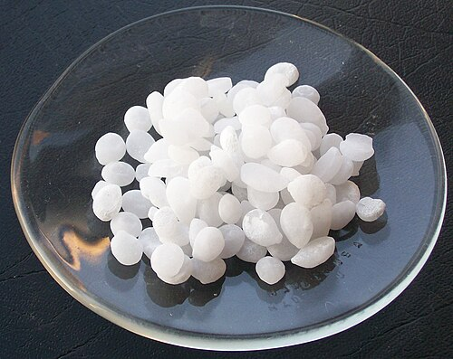
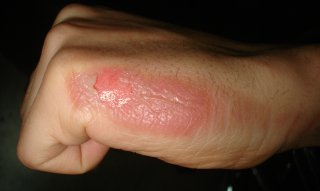

# QUEIMADURAS CÁUSTICAS DO ESÔFAGO

A ingestão de substâncias corrosivas é uma emergência médica que exige do cirurgião e do emergencista uma compreensão clara da fisiopatologia para evitar condutas iatrogênicas. Nas provas de residência, o examinador não quer apenas saber se você conhece o antídoto (que, aliás, não existe), mas se você entende a evolução da lesão e as contraindicações absolutas no manejo inicial.

*Figura 1 - Pellets de hidróxido de sódio (NaOH), principal agente cáustico alcalino envolvido em queimaduras esofágicas. Os álcalis causam necrose de liquefação, com penetração profunda na parede esofágica. Fonte: Walkerma, Domínio Público | Wikimedia Commons*

## Fisiopatologia: O Porquê da Gravidade

Para entender a conduta, você precisa entender o que a substância faz com o tecido. O dano depende do pH, da concentração, do tempo de contato e da forma física (líquidos espalham mais, sólidos aderem e causam lesões localizadas profundas).

### Álcalis: A Necrose de Liquefação

Os álcalis (como a soda cáustica/hidróxido de sódio) são os vilões mais comuns em provas. Eles causam **necrose de liquefação**.

Por que isso é tão grave? O álcali saponifica as gorduras das membranas celulares e desnatura as proteínas, o que permite que a substância penetre profundamente nas camadas da parede esofágica. Não há uma barreira limitante. A lesão progride até que o álcali seja neutralizado pelos próprios tecidos, o que frequentemente resulta em destruição transmural e perfuração.

**Dica de prova:** As bases (álcalis) acometem preferencialmente o esôfago, pois o pH alcalino é "atraído" pelo ambiente menos ácido do esôfago, e a viscosidade facilita o tempo de contato.

### Ácidos: A Necrose de Coagulação

Os ácidos fortes (como o ácido clorídrico ou sulfúrico) causam **necrose de coagulação**.

Ao entrar em contato com o tecido, o ácido forma uma escara (crosta) proteica firme. Essa escara, teoricamente, limita a penetração do ácido nas camadas mais profundas. No entanto, não se engane: se a concentração for alta, a perfuração ocorre da mesma forma.

**Pérola Clínica:** O ácido "passa rápido" pelo esôfago e tende a se acumular no estômago, causando espasmo pilórico. Por isso, em ingestões de ácidos, as lesões gástricas (antro e piloro) costumam ser mais severas que as esofágicas. Guarde isso: Álcali = Esôfago; Ácido = Estômago.

### Tabela 1: Comparativo de Mecanismos de Lesão

| Característica | Álcalis (Bases) | Ácidos |
| --- | --- | --- |
| **Tipo de Necrose** | Liquefação | Coagulação |
| **Penetração** | Profunda e progressiva | Superficial (limitada pela escara) |
| **Órgão mais afetado** | Esôfago | Estômago (Antro/Piloro) |
| **Exemplos comuns** | Soda cáustica, limpa-forno | Ácido de bateria, produtos de limpeza pesada |

*Figura 2 - Queimadura de 2º grau em mão com bolhas (flictenas). As lesões cáusticas do esôfago seguem graus semelhantes: 1º grau (edema/hiperemia), 2º grau (úlceras superficiais/profundas) e 3º grau (necrose transmural com risco de perfuração). Fonte: Kronoman, CC BY-SA 3.0 | Wikimedia Commons*

## Manejo Inicial: O que NÃO fazer é mais importante

Imagine que você está no plantão e chega um paciente que ingeriu soda cáustica há 30 minutos. Ele está com dor retrosternal intensa e sialorreia (salivação excessiva). Aqui, o erro clássico que elimina candidatos em provas é tentar "limpar" ou "neutralizar" a substância.

### Estabilização e Proteção de Via Aérea

A prioridade é o ABCDE. Se houver estridor, rouquidão ou edema de glote, a intubação orotraqueal deve ser precoce.

**Cuidado:** A visualização da orofaringe com lesões não prediz com precisão a gravidade da lesão esofágica. O paciente pode ter a boca intacta e o esôfago destruído, ou vice-versa. No MedEvo, sempre reforçamos: a clínica soberana aqui é a presença de sinais de perfuração (enfisema subcutâneo, peritonismo).

### Contraindicações Absolutas (Decore isso!)

- **NÃO induzir vômitos:** Se a substância queimou na ida, ela vai queimar novamente na volta, aumentando o risco de aspiração e perfuração.

- **NÃO realizar lavagem gástrica:** O risco de perfuração mecânica e química é altíssimo.

- **NÃO usar carvão ativado:** Ele não adere bem a corrosivos e atrapalha a visão da endoscopia posterior.

- **NÃO tentar neutralização química:** Se o paciente bebeu ácido, não dê base (e vice-versa). A reação química de neutralização é exotérmica, ou seja, gera calor, o que vai causar uma queimadura térmica somada à química.

### O Papel da Sonda Nasoenteral (SNE)

Muitos alunos se confundem aqui. Na fase aguda (emergência), a passagem de sonda às cegas é **contraindicada** pelo risco de perfuração. No entanto, após a endoscopia, se o paciente tiver lesões graves (Zargar IIb ou III), o endoscopista pode passar uma sonda sob visão direta para servir de molde e garantir a nutrição. Mas lembre-se: para a prova de "conduta inicial", a resposta é NPO e nada de sonda às cegas.

## Diagnóstico e Classificação de Zargar

Após a estabilização hemodinâmica, o próximo passo é definir a extensão do dano.

### Endoscopia Digestiva Alta (EDA)

A EDA é o padrão-ouro, mas o *timing* é fundamental.

- **Quando fazer:** Entre 12 e 48 horas após a ingestão.

- **Por que não antes?** Nas primeiras horas, a lesão ainda pode estar evoluindo e você pode subestimar a gravidade.

- **Por que não depois?** Após o 5º dia, inicia-se a fase de granulação e intensa fragilidade tecidual. O esôfago vira "papel molhado". Fazer EDA entre o 5º e o 15º dia aumenta drasticamente o risco de perfuração iatrogênica.

### Classificação de Zargar (A queridinha das bancas)

Você precisa memorizar essa classificação, pois ela define quem vai para casa e quem vai para a UTI.

| Grau | Achados Endoscópicos | Conduta Sugerida |
| --- | --- | --- |
| **0** | Exame normal | Alta hospitalar |
| **1** | Edema e hiperemia de mucosa | Dieta líquida, alta precoce |
| **2a** | Exsudatos, erosões, úlceras superficiais | Internação, dieta líquida/pastosa |
| **2b** | Úlceras profundas ou circunferenciais | Internação, NPO, considerar SNE guiada |
| **3a** | Pequenas áreas de necrose (focal) | UTI, NPO, Antibiótico se necessário |
| **3b** | Necrose extensa e profunda | UTI, considerar cirurgia de emergência |

**Dica do Dr. Will:** Se a questão mencionar "úlceras circunferenciais", marque Zargar 2b. Por que isso importa? Porque lesões circunferenciais têm um risco altíssimo de evoluir com estenose cicatricial no futuro.

### Exames de Imagem

Se o paciente apresenta sinais de instabilidade, dor abdominal súbita ou enfisema subcutâneo, não perca tempo com EDA. Peça uma **Tomografia de Tórax e Abdome**. A TC é superior para detectar ar extraluminal (perfuração) e necrose da parede esofágica que a EDA não consegue ver por estar limitada à mucosa.

## Tratamento na Fase Aguda

O tratamento é predominantemente de suporte.

- **Jejum (NPO):** Essencial até a avaliação endoscópica.

- **Hidratação Venosa:** Reposição volêmica vigorosa, especialmente se houver perda de fluidos por vômitos ou sequestro para o terceiro espaço.

- **Inibidores de Bomba de Prótons (IBP):** Usados para evitar que o ácido gástrico piore a lesão esofágica já existente (refluxo agravando a queimadura).

- **Antibióticos:** Não são usados de rotina. Estão indicados apenas se houver suspeita de perfuração, infecção respiratória por aspiração ou em pacientes com lesões grau III (Zargar 3).

- **Corticoides:** Aqui mora a polêmica. A diretriz atual sugere que eles **não** previnem estenose em lesões leves e podem mascarar sinais de perfuração em lesões graves. Algumas bancas ainda aceitam o uso em Zargar 2b para tentar reduzir a inflamação, mas a tendência moderna é o desuso.

### Quando operar na emergência?

A cirurgia (esofagectomia ou gastrectomia de resgate) é indicada em casos de **perfuração confirmada** ou necrose transmural extensa (Zargar 3b com instabilidade). É uma cirurgia de altíssima mortalidade, geralmente envolvendo esofagectomia sem reconstrução imediata (faz-se uma esofagostomia cervical e uma jejunostomia para alimentar o paciente, deixando a reconstrução para meses depois).

## Complicações Tardias: O Sofrimento Crônico

O paciente que sobrevive à fase aguda da queimadura cáustica não está curado. Ele entra em uma fase de acompanhamento que dura a vida toda.

### Estenose Esofágica

É a complicação mais comum, ocorrendo em até 70-80% dos pacientes com lesões Zargar 2b ou 3. A cicatrização fibrótica estreita o lúmen do esôfago, levando à disfagia progressiva.

- **Tratamento:** Dilatação endoscópica (com balão ou velas de Savary).

- **Atenção:** A dilatação só deve começar após a fase de cicatrização aguda (geralmente após 3 a 4 semanas). Tentar dilatar um esôfago inflamado é receita para perfuração.

### Câncer de Esôfago

Esta é uma "pérola" que cai em toda prova de oncologia digestiva. A queimadura cáustica aumenta o risco de **Carcinoma Espinocelular (CEC)** de esôfago em até 1.000 vezes.

- **Latência:** O câncer não aparece logo. Ele surge 20, 30 ou 40 anos após a ingestão.

- **Vigilância:** Pacientes com história de ingestão cáustica devem realizar EDA de rastreamento anualmente a partir de 15-20 anos após o acidente.

**Diferenciação importante:**

- Queimadura Cáustica → Carcinoma Espinocelular (CEC).

- Esôfago de Barrett (Refluxo) → Adenocarcinoma.

## Conexão com Grandes Queimados

Muitas vezes, as questões de prova misturam a ingestão cáustica com o manejo de queimaduras térmicas de pele, pois o paciente pode ter se queimado externamente ao manipular o produto. Você precisa dominar dois conceitos fundamentais:

### 1. Regra dos Nove (Wallace)

Usada para calcular a Superfície Corporal Queimada (SCQ) em adultos:

- Cabeça e Pescoço: 9%

- Tronco Anterior: 18%

- Tronco Posterior: 18%

- Cada Membro Superior: 9%

- Cada Membro Inferior: 18%

- Genitália: 1%

### 2. Fórmula de Parkland

Essencial para a reposição volêmica nas primeiras 24 horas:

- **Volume total = 4ml x Peso (kg) x %SCQ**

- **Como administrar:**

- 50% do volume nas primeiras 8 horas (contadas a partir do momento da queimadura, não da chegada ao hospital!).

- 50% do volume nas 16 horas seguintes.

- **Fluido de escolha:** Cristaloide (Ringer Lactato é o preferido).

**Exemplo Clínico:** Paciente de 70kg, com 20% de SCQ.
Cálculo: 4 x 70 x 20 = 5.600 ml em 24h.
Nas primeiras 8h, ele deve receber 2.800 ml. Se ele demorou 2h para chegar ao hospital, você deve infundir esses 2.800 ml nas próximas 6h.

## Outras Patologias Esofágicas Relacionadas (Diagnóstico Diferencial)

As bancas adoram colocar "Acalasia" ou "Megaesôfago" nas alternativas de questões sobre cáusticos.

- **Acalasia:** É um distúrbio motor (falha no relaxamento do EEI). Também é fator de risco para Carcinoma Espinocelular (CEC), assim como a queimadura cáustica. No entanto, a acalasia apresenta a imagem clássica de "bico de pássaro" no esofagograma, enquanto a queimadura cáustica mostra estenoses longas e irregulares.

- **Esôfago de Barrett:** É uma metaplasia intestinal (troca de epitélio escamoso por colunar). É fator de risco para **Adenocarcinoma**. Não confunda com o CEC dos cáusticos!

### Tabela 2: Fatores de Risco para Câncer de Esôfago

| Fator de Risco | Tipo Histológico Associado |
| --- | --- |
| Ingestão Cáustica | Carcinoma Espinocelular (CEC) |
| Acalasia (Megaesôfago) | Carcinoma Espinocelular (CEC) |
| Tabagismo e Etilismo | Carcinoma Espinocelular (CEC) |
| Tilose Palmar e Plantar | Carcinoma Espinocelular (CEC) |
| Esôfago de Barrett (DRGE) | Adenocarcinoma |
| Obesidade | Adenocarcinoma |

## Situações Especiais e Pegadinhas

### O Paciente Assintomático

"Doutor, meu filho tomou um gole de alvejante, mas ele está ótimo, sem dor e comendo normal."
Mesmo assintomático, se a substância for comprovadamente corrosiva e de alta concentração, a observação hospitalar e a EDA são recomendadas. Cerca de 10-15% dos pacientes com lesões esofágicas graves podem não apresentar lesões orais.

### O Uso de Sonda Nasogástrica para Lavagem

Se a questão disser: "Paciente ingeriu veneno de rato (organofosforado) e soda cáustica. Conduta: Lavagem gástrica?".
**Resposta: NÃO.** A presença do cáustico contraindica a lavagem, mesmo que haja outra substância tóxica associada que normalmente exigiria lavagem. O risco de perfuração pelo corrosivo sobrepõe-se ao benefício da lavagem para o outro tóxico.

### Tabela 3: Resumo de Condutas por Grau de Zargar

| Grau | Local de Manejo | Dieta | Seguimento |
| --- | --- | --- | --- |
| **I** | Domicílio/Enfermaria | Líquida imediata | Alta em 24h |
| **IIa** | Enfermaria | Líquida após 24-48h | EDA se sintomas |
| **IIb** | UTI/Semi-intensiva | NPO / SNE guiada | Risco de estenose (70%) |
| **IIIa/b** | UTI | NPO / Nutrição Parenteral | Risco de perfuração e CEC |

## Resumo da Jornada do Paciente

- **Minuto 0-60:** Estabilização, oxigênio, acesso venoso, analgesia (opioides se necessário). **NADA por via oral.**

- **Hora 1-12:** Rotina de abdome agudo (RX tórax em pé, RX abdome, RX cúpulas) para ver pneumoperitônio ou mediastinite. Se suspeita forte de perfuração → TC.

- **Hora 12-48:** EDA para classificação de Zargar.

- **Dia 3-15:** Período de perigo. Aumento da atividade de colagenases. O esôfago está mais fraco do que no primeiro dia. Evitar procedimentos desnecessários.

- **Semana 3-4:** Início das dilatações se houver disfagia e estenose confirmada.

- **Ano 15-20:** Início do rastreamento para CEC.

Lembre-se: o manejo da queimadura cáustica é um exercício de paciência e vigilância. No MedEvo, focamos em te mostrar que a cirurgia nem sempre é o primeiro passo, mas saber quando ela é o *único* passo salva vidas.

## Pontos-Chave para Prova

- **Mecanismo do Álcali:** Necrose de liquefação (profunda, saponificação de gorduras).

- **Mecanismo do Ácido:** Necrose de coagulação (superficial, formação de escara).

- **Órgão Alvo:** Álcalis preferem o esôfago; Ácidos preferem o estômago (antro/piloro).

- **Contraindicações Absolutas:** Induzir vômito, lavagem gástrica, neutralização química e carvão ativado.

- **Sonda Nasoenteral:** Contraindicada às cegas na fase aguda. Pode ser passada via EDA em casos graves para nutrição e molde.

- **Timing da EDA:** 12 a 48 horas após a ingestão. Evitar entre o 5º e 15º dia (fase de maior fragilidade).

- **Zargar 2b:** Úlceras circunferenciais. Alto risco de estenose.

- **Zargar 3:** Necrose. Risco de perfuração. Antibiótico e UTI indicados.

- **Complicação Crônica mais comum:** Estenose esofágica (tratar com dilatação após 3-4 semanas).

- **Risco de Câncer:** Aumenta 1.000x o risco de Carcinoma Espinocelular (CEC). Rastreamento após 15-20 anos.

- **Fórmula de Parkland:** 4ml x Peso x %SCQ. Metade nas primeiras 8h do acidente.

- **Regra dos Nove:** Tronco (18% frente, 18% verso), Pernas (18% cada), Braços (9% cada), Cabeça (9%).

- **Sinal de Alerta:** Enfisema subcutâneo ou dor abdominal súbita sugere perfuração → TC e Cirurgia de emergência.

- **Antibióticos:** Não são profiláticos para todos. Usar em Zargar 3, suspeita de aspiração ou perfuração.

- **Corticoides:** Uso controverso. Não previnem estenose em lesões leves (Zargar 1 e 2a). 💡

 Cópia offline para consulta pessoal.
 Fonte original:
 [https://www.medevo.com.br/material-apoio/ler/eb4ab47a-48fc-47ed-b5da-0a0d8162634f](https://www.medevo.com.br/material-apoio/ler/eb4ab47a-48fc-47ed-b5da-0a0d8162634f)
