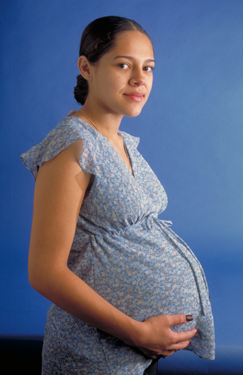
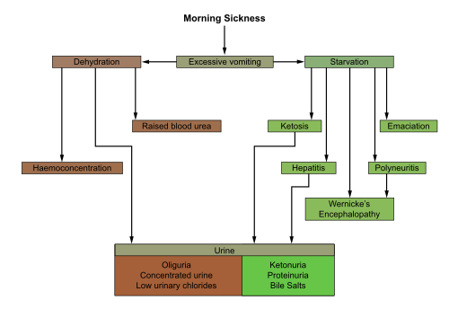

# QUEIXAS COMUNS NA GESTAÇÃO

Para entender as queixas da gestante, você precisa primeiro vestir a "lente da fisiologia". Quase tudo o que a paciente sente de desconforto é, na verdade, uma adaptação do corpo para abrigar o feto. Se você decorar apenas a conduta, vai errar a questão de prova que mudar um detalhe do enunciado. Se você entender o porquê, a resposta se torna óbvia.

O grande maestro dessas mudanças é o binômio hormonal: Progesterona e Estrogênio. A progesterona é a "relaxadora" oficial da gestação. Ela relaxa a musculatura lisa de vasos, do trato gastrointestinal e do sistema urinário. Já o estrogênio é o "proliferador" e "vascularizador", aumentando o volume sanguíneo e a congestão de mucosas.

*Figura 1 - Gestante em acompanhamento nutricional. Durante a gravidez, as adaptações fisiológicas mediadas por progesterona e estrogênio geram diversas queixas que devem ser diferenciadas de sinais de alarme patológicos. Fonte: Ken Hammond/USDA, Domínio Público | Wikimedia Commons*

## Alterações Gastrointestinais: O Império da Progesterona

As queixas digestivas são as campeãs de audiência no pré-natal. Aqui, o erro clássico do aluno é não diferenciar o que é esperado em cada trimestre.

### Náuseas e Vômitos

As náuseas e vômitos atingem cerca de 70 a 80% das gestantes. O pico ocorre entre a 8ª e 12ª semana de gestação, coincidindo exatamente com o pico do beta-hCG. Por que isso acontece? O hCG estimula os receptores na zona de gatilho quimiorreceptora no bulbo.

Cuidado com a pegadinha: enjoo não é sintoma comum no terceiro trimestre. Se a paciente chega com náuseas novas na 36ª semana, você deve pensar em pré-eclâmpsia (síndrome HELLP) ou outras patologias, nunca em "queixa normal da gravidez".

O tratamento inicial é sempre não farmacológico. Orientamos a dieta fracionada (comer pouco várias vezes ao dia), evitar líquidos durante as refeições (priorizar nos intervalos) e evitar gatilhos como odores fortes. Se isso falhar, partimos para a piridoxina (vitamina B6) isolada ou associada à doxilamina. Antieméticos como a metoclopramida e a ondansetrona são opções de segunda linha.

Quando os vômitos se tornam incoercíveis, com perda de peso superior a 5%, desidratação e cetonúria, diagnosticamos a Hiperêmese Gravídica. Aqui, o tratamento exige internação, reposição volêmica e, por vezes, corticoterapia em casos refratários.

### Pirose e Refluxo Gastroesofágico

A azia (pirose) é o resultado de um "golpe duplo". Primeiro, a progesterona causa a hipotonia do Esfíncter Esofagiano Inferior (EEI). Segundo, o útero aumentado exerce uma pressão mecânica sobre o estômago.

A conduta inicial, segundo a FEBRASGO e o Ministério da Saúde, foca em modificações de estilo de vida: não deitar logo após comer, elevar a cabeceira da cama e evitar alimentos gordurosos ou ácidos. Se persistir, antiácidos (hidróxido de alumínio ou magnésio) são a primeira escolha farmacológica. Sucralfato e bloqueadores H2 (como a ranitidina, embora com restrições recentes de mercado) podem ser usados. Inibidores de bomba de prótons (Omeprazol) ficam reservados para casos persistentes.

### Constipação Intestinal

Por que a gestante fica "presa"? A progesterona reduz o peristaltismo (hipotonia do TGI) para que o bolo alimentar fique mais tempo em contato com a mucosa, aumentando a absorção de nutrientes para o feto. O efeito colateral é o aumento da absorção de água, tornando as fezes ressecadas.

A orientação deve ser: aumento da ingestão hídrica e de fibras (mínimo 25-30g/dia). Laxantes osmóticos (como o lactulol) podem ser usados se as medidas dietéticas falharem. Evite laxantes irritativos, pois podem estimular contrações uterinas.

*Figura 2 - Diagrama da fisiopatologia dos vômitos na gestação. O pico de hCG entre 8-12 semanas estimula a zona de gatilho quimiorreceptora no bulbo, gerando náuseas em até 80% das gestantes. Vômitos novas no 3º trimestre devem alertar para HELLP. Fonte: Ian Ramsden e Robin Callander, Domínio Público | Wikimedia Commons*

## Alterações Cardiovasculares e Respiratórias

Aqui o aluno costuma confundir fisiologia com doença cardíaca. Na gestação, o débito cardíaco aumenta em até 50%, a frequência cardíaca sobe cerca de 10 a 15 bpm e a resistência vascular periférica cai drasticamente no primeiro e segundo trimestres.

### Sopro Cardíaco e Dispneia

É extremamente comum encontrar um sopro sistólico fisiológico (ejeção) na gestante, devido ao estado hiperdinâmico (mais sangue passando pelas válvulas). Sopros diastólicos, porém, são sempre patológicos.

A dispneia fisiológica ocorre em mais de 60% das gestantes. Ela acontece porque a progesterona aumenta a sensibilidade do centro respiratório ao CO2, levando a uma hiperventilação relativa (a paciente sente que precisa respirar mais, mesmo com oxigenação normal). No terceiro trimestre, a compressão mecânica do diafragma pelo útero agrava a sensação.

### Edema e Hipotensão Supina

O edema de membros inferiores é comum devido à compressão da veia cava inferior pelo útero e à queda da pressão oncótica (diluição das proteínas do sangue). A orientação é repouso em decúbito lateral esquerdo para descompressão da cava.

A síndrome da hipotensão supina é uma pegadinha de prova: ao deitar de costas, o útero comprime a cava, reduz o retorno venoso e o débito cardíaco, fazendo a gestante sentir tontura e mal-estar. A solução é simples: virar para a esquerda.

## Queixas Musculoesqueléticas e Neurológicas

O corpo da gestante sofre uma mudança drástica no centro de gravidade. Para não cair para frente, ela projeta os ombros para trás e acentua a curvatura lombar, gerando a famosa "marcha anserina" (ou marcha de pato).

### Dor Lombar e Dor Ligamentar

A dor lombar é multifatorial: aumento da lordose, ganho de peso e ação da relaxina, que afrouxa as articulações pélvicas para o parto. O tratamento envolve correção postural, exercícios leves e analgésicos simples (Paracetamol).

Cuidado: AINEs (como Ibuprofeno ou Diclofenaco) são contraindicados, especialmente no terceiro trimestre, devido ao risco de fechamento prematuro do ducto arterioso e oligodramnia. Nunca use AINEs para tratar dor abdominal ou lombar em gestantes avançadas.

Outra queixa comum é a dor no ligamento redondo. É uma dor aguda, tipo pontada, geralmente na região inguinal, que surge ao mudar de posição ou tossir. É benigna e responde ao repouso e calor local. Não confunda com trabalho de parto prematuro, que tem contrações rítmicas e dolorosas.

### Rinite e Epistaxe

O estrogênio causa congestão das mucosas. Isso leva à rinite gestacional (nariz entupido constante) e maior facilidade de sangramento nasal (epistaxe). A conduta é apenas lavagem com soro fisiológico. Descongestionantes nasais devem ser evitados pelo risco de efeito rebote e vasoconstrição sistêmica.

## Queixas Urinárias e Genitais

### Polaciúria

No primeiro trimestre, o útero cresce dentro da pelve e comprime a bexiga. No segundo, o útero sobe para o abdome e a queixa melhora. No terceiro, a cabeça do feto encaixa na pelve e volta a comprimir a bexiga. Portanto, polaciúria (urinar várias vezes) sem dor é normal. Se houver disúria ou dor suprapúbica, investigue Infecção do Trato Urinário (ITU).

### Leucorreia Fisiológica vs. RPM

O aumento de estrogênio aumenta a descamação vaginal e a produção de muco, gerando um corrimento branco, sem odor e sem coceira. Isso é fisiológico.

O problema é quando a paciente chega queixando-se de "perda de líquido". Aqui entra o diagnóstico diferencial com a Rotura Prematura de Membranas (RPM). O diagnóstico é clínico: exame especular visualizando a saída de líquido pelo colo. Se houver dúvida, usamos o teste da nitrazina (o pH vaginal, que é ácido, torna-se básico/azul na presença de líquido amniótico) e o teste da cristalização (o líquido seco em lâmina forma um padrão de "folha de samambaia").

## Situações Especiais e Condutas Obrigatórias

Existem temas que, embora não sejam "queixas" no sentido estrito, aparecem nas provas misturados a esse contexto.

### Sífilis na Gestação

Se uma gestante apresenta teste treponêmico positivo, o tratamento de escolha é a Penicilina Benzatina. Não existe alternativa para o feto. Se a paciente for alérgica, a conduta obrigatória é a dessensibilização em ambiente hospitalar para que ela possa receber a penicilina. No MedEvo, sempre reforçamos: tratamento adequado da sífilis na gestação exige o uso de penicilina, iniciado até 30 dias antes do parto.

### Profilaxia para Estreptococo do Grupo B (EGB)

Se a paciente teve uma urocultura positiva para EGB em qualquer momento da gestação atual, ela já tem indicação de profilaxia intraparto com Penicilina G Potássica (ou Ampicilina). Não precisa fazer o swab retovaginal na 35ª-37ª semana, pois a conduta já está definida.

### Amamentação e Nova Gravidez

Uma dúvida comum: "Doutor, estou grávida e ainda amamento meu filho mais velho. Posso continuar?". A resposta é sim. A amamentação em tandem (amamentar o recém-nascido e o filho mais velho) é segura se a gestação não tiver riscos de prematuridade. A ocitocina liberada na amamentação não é suficiente para deflagrar trabalho de parto em uma gestação saudável.

## Tabelas Comparativas para Fixação

### Tabela 1: Diagnóstico Diferencial de Náuseas e Vômitos

| Característica | Náuseas/Vômitos Comuns | Hiperêmese Gravídica |
| --- | --- | --- |
| Início | 5ª a 8ª semana | 5ª a 10ª semana |
| Perda de Peso | Ausente ou mínima | > 5% do peso pré-gestacional |
| Desidratação | Ausente | Presente (sinais de prega, mucosas secas) |
| Distúrbios Eletrolíticos | Ausentes | Presentes (Hipocalemia, alcalose) |
| Cetonúria | Negativa | Positiva |
| Conduta | Dieta e antieméticos orais | Internação e hidratação venosa |

### Tabela 2: Alterações Fisiológicas vs. Sinais de Alerta

| Sistema | Achado Fisiológico (Normal) | Sinal de Alerta (Investigar) |
| --- | --- | --- |
| Cardiovascular | Sopro sistólico, ↑ FC | Sopro diastólico, dor torácica |
| Respiratório | Dispneia leve, rinite | Taquipneia, sibilância, hemoptise |
| Gastrointestinal | Pirose, constipação | Dor abdominal aguda, hematêmese |
| Urinário | Polaciúria (sem dor) | Disúria, febre, dor lombar (punho-percussão) |
| Musculoesquelético | Lombalgia, dor no ligamento redondo | Perda de força, dor óssea localizada |

### Tabela 3: Testes para Rotura de Membranas (RPM)

| Teste | Mecanismo | Resultado Positivo |
| --- | --- | --- |
| Exame Especular | Visualização direta | Saída de líquido pelo orifício externo do colo |
| Teste da Nitrazina | Mudança de pH (Vagina 4.5-5.5 / Líquido 7.0-7.5) | Papel vira de amarelo para azul/fiteiro |
| Cristalização | Sais de sódio e mucina no líquido | Padrão de "folha de samambaia" na microscopia |
| Amnisure/Prom-test | Detecção de proteínas específicas (PAMG-1/IGFBP-1) | Presença de duas linhas (tipo teste de gravidez) |

## O Manejo da Rotura Prematura de Membranas (RPMO)

Este é um tópico que as bancas amam conectar com as queixas comuns. A paciente chega dizendo que "a bolsa estourou". Se for antes de 37 semanas, chamamos de RPMO pré-termo.

A conduta depende da idade gestacional (IG):

- **Acima de 34 semanas:** A tendência é a interrupção da gravidez (indução do parto), pois o risco de infecção (corioamnionite) supera o risco da prematuridade.

- **Entre 24 e 34 semanas:** Conduta expectante. Internamos a paciente, fazemos corticoterapia (Betametasona ou Dexametasona) para maturação pulmonar, antibioticoprofilaxia para aumentar o período de latência (geralmente Ampicilina + Azitromicina) e, se o parto for iminente antes das 32 semanas, Sulfato de Magnésio para neuroproteção fetal.

Se houver sinais de infecção ovular (febre, taquicardia materna/fetal, útero doloroso, líquido fétido), a conduta é interrupção imediata da gravidez por via vaginal (preferencialmente) e antibioticoterapia de amplo espectro, independentemente da IG.

## Repercussões Neonatais dos Hormônios Maternos

Às vezes, a "queixa" vem da mãe sobre o recém-nascido (RN). O Dr. Will sempre lembra que os hormônios placentários atravessam a barreira e agem no feto.

- **Pseudomenstruação Neonatal:** RN do sexo feminino pode apresentar um pequeno sangramento vaginal nos primeiros dias de vida. Isso ocorre pela queda abrupta dos estrogênios maternos no sangue do bebê após o parto. É fisiológico.

- **Tumefação Mamária:** Tanto meninos quanto meninas podem nascer com as mamas aumentadas e até secretar leite ("leite de bruxa"). Conduta: apenas observação, nunca espremer.

- **Hérnia Inguinal:** Se o enunciado trouxer um lactente com tumoração inguinal redutível, o diagnóstico é hérnia inguinal. Diferente da hérnia umbilical (que podemos esperar até os 4-5 anos), a hérnia inguinal no lactente tem indicação de correção cirúrgica precoce pelo risco de encarceramento.

## Adolescência e Gravidez

Um cenário clássico de prova: adolescente de 15 anos com amenorreia secundária há 3 meses. Ela nega atividade sexual. Qual a conduta? Pedir Beta-hCG. Na adolescência, a negação é comum e a gravidez deve ser sempre a primeira hipótese em casos de interrupção do ciclo menstrual. Não se perca em exames hormonais complexos antes de excluir gestação.

## Pontos-Chave para Prova 💡

- **Progesterona:** Causa relaxamento da musculatura lisa (refluxo, constipação, dilatação ureteral).

- **HCG:** Pico entre 8-12 semanas, principal responsável pelas náuseas e vômitos do primeiro trimestre.

- **Pirose:** Conduta inicial é MEV (não deitar após comer, fracionar dieta). Farmacológico: Antiácidos são primeira linha.

- **Lombalgia:** Causada pela mudança do centro de gravidade e lordose. AINEs são proibidos no 3º trimestre.

- **Sopro Sistólico:** É fisiológico na gestação pelo aumento do débito cardíaco. Sopro diastólico é sempre patológico.

- **Dispneia Fisiológica:** Ocorre pela maior sensibilidade ao CO2 (hiperventilação central).

- **Rinite Gestacional:** Conduta é lavagem com soro fisiológico. Evitar descongestionantes.

- **Sífilis:** Único tratamento aceitável é Penicilina Benzatina. Alérgicas devem ser dessensibilizadas.

- **Urocultura + para EGB:** Indicação direta de profilaxia intraparto, sem necessidade de swab posterior.

- **RPM:** Diagnóstico é clínico (especular). Nitrazina e Cristalização auxiliam em casos duvidosos.

- **Corioamnionite:** Febre + Útero doloroso + Líquido fétido = ATB + Esvaziamento uterino imediato.

- **Pseudomenstruação Neonatal:** Fenômeno normal por queda de estrogênio materno no RN.

- **Hérnia Inguinal em Lactente:** Sempre tem indicação cirúrgica (diferente da umbilical).

- **Amamentação na Gestação:** É permitida e segura em gestações de baixo risco.

- **Pérola MedEvo:** Se a questão fala em "dor em pontada na virilha ao tossir", marque dor no ligamento redondo e não confunda com hérnia ou trabalho de parto.

- **Contraindicação Absoluta:** Nunca usar AINEs no 3º trimestre (risco de fechamento do ducto arterioso).

- **Valores de Referência:** Ganho de peso ideal depende do IMC pré-gestacional (IMC normal: 11,5 a 16 kg).

- **Erro Comum:** Achar que polaciúria no final da gestação é sempre infecção. Se não houver dor, é apenas compressão mecânica.

 Cópia offline para consulta pessoal.
 Fonte original:
 [https://www.medevo.com.br/material-apoio/ler/b68913c3-78b2-4f07-9415-c6f062a4e784](https://www.medevo.com.br/material-apoio/ler/b68913c3-78b2-4f07-9415-c6f062a4e784)
