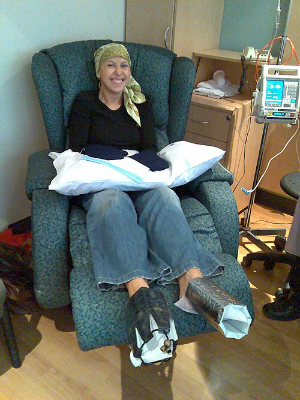

# QUIMIOTERAPIA E EFEITOS ADVERSOS

Para entender a oncologia clínica, você precisa primeiro organizar a "caixa de ferramentas" do oncologista. Não adianta decorar nomes de drogas se você não entende o momento em que elas são usadas. Na prova de residência, a banca vai testar se você sabe a diferença entre tratar para curar e tratar para dar qualidade de vida.

*Figura 1 - Paciente em sessão de quimioterapia com docetaxel para câncer de mama, utilizando luvas de resfriamento acral para prevenir toxicidade ungueal. Estratégias semelhantes de resfriamento são usadas para prevenir alopecia. Fonte: Jenny Mealing, CC BY 2.0 | Wikimedia Commons*

## Fundamentos da Terapia Sistêmica: O "Timing" é Tudo

Muitos alunos confundem os termos básicos, e as bancas adoram trocar esses conceitos. Vamos alinhar isso agora.

A **Quimioterapia Neoadjuvante** é aquela realizada *antes* do tratamento principal (geralmente a cirurgia). Por que fazemos isso? O objetivo não é apenas "diminuir o tumor". O raciocínio clínico aqui é triplo: reduzir o volume tumoral para permitir cirurgias menos mutilantes (preservação de órgãos), tratar micrometástases que já podem estar circulando e, o mais importante, avaliar a resposta tumoral *in vivo*. Se o tumor não regredir com a neoadjuvância, já sabemos que aquele esquema de drogas não é o ideal para aquele paciente.

Já a **Quimioterapia Adjuvante** é feita *após* o controle local (cirurgia ou radioterapia). Aqui, o tumor visível já saiu. Então, por que quimioterapêutico? Para eliminar a doença residual mínima. É um tratamento focado em aumentar a sobrevida livre de doença e a sobrevida global.

Por fim, a **Quimioterapia Paliativa** é aplicada em cenários de doença metastática ou irressecável. O foco aqui muda: o objetivo é controle de sintomas, melhora da qualidade de vida e ganho de sobrevida, mas sem a expectativa de cura.

**Dica de Prova:** Se a questão fala em "preservação de esfíncter" no câncer de reto ou "preservação de mama", ela está gritando "Neoadjuvância" para você.

*Figura 2 - Duas pacientes pediátricas com leucemia linfoblástica aguda (LLA) recebendo quimioterapia endovenosa. A toxicidade hematológica, especialmente a neutropenia febril, é a complicação mais cobrada em provas. Fonte: Bill Branson/NCI, Domínio Público | Wikimedia Commons*

## Toxicidade Hematológica: O Pesadelo da Neutropenia Febril

Esta é, sem dúvida, a complicação mais cobrada em provas de clínica médica. A quimioterapia ataca células em rápida divisão, e a medula óssea é o alvo colateral número um.

### O que define a Neutropenia Febril?

Você precisa decorar estes números. Não há espaço para dúvida:

- **Febre:** Temperatura oral única ≥ 38,3°C ou ≥ 38,0°C mantida por mais de 1 hora.

- **Neutropenia:** Contagem absoluta de neutrófilos (CAN) < 500/mm³ (ou < 1.000/mm³ com previsão de queda para < 500 nas próximas 48 horas).

**Cuidado:** O paciente neutropênico não faz pus. A inflamação depende de leucócitos. Se ele não tem leucócitos, ele pode ter uma pneumonia grave sem um infiltrado radiológico clássico ou uma infecção urinária sem piúria. A febre pode ser o *único* sinal.

### Conduta Imediata

Neutropenia febril é uma **emergência médica**. O tempo porta-antibiótico deve ser inferior a 60 minutos. Segundo as diretrizes da SBOC e consensos internacionais, o manejo começa pela estratificação de risco usando o **Escore MASCC**.

| Critério MASCC | Pontuação |
| --- | --- |
| Carga da doença (sintomas leves ou ausentes) | 5 |
| Ausência de hipotensão (PAS > 90 mmHg) | 5 |
| Ausência de DPOC | 4 |
| Tumor sólido ou ausência de infecção fúngica prévia | 4 |
| Desidratação ausente | 3 |
| Sintomas moderados | 3 |
| Paciente ambulatorial no início da febre | 3 |
| Idade < 60 anos | 2 |

**Interpretação:**

- **MASCC ≥ 21:** Baixo risco. Pode-se considerar tratamento ambulatorial com antibióticos orais (Ciprofloxacina + Amoxicilina-Clavulanato).

- **MASCC < 21:** Alto risco. Internação obrigatória e antibioticoterapia venosa de largo espectro (Cefepime é a escolha clássica por cobrir *Pseudomonas*).

**Erro clássico de prova:** Achar que, se o paciente está bem (estável), você pode esperar o resultado das culturas para começar o antibiótico. Errado. Colha culturas e inicie o ATB imediatamente. No MedEvo, sempre reforçamos: na neutropenia febril, o antibiótico vem antes da certeza diagnóstica.

## Cardiotoxicidade: O Coração sob Ataque

A oncologia e a cardiologia caminham juntas hoje (Cardio-Oncologia). O tratamento oncológico é a segunda causa de disfunção sistólica em alguns grupos, perdendo apenas para a doença isquêmica.

### Antraciclinas (Doxorrubicina, Epirrubicina)

As antraciclinas são o exemplo clássico de cardiotoxicidade **Tipo I**. O dano é celular, por estresse oxidativo, e é **irreversível e dose-dependente**.

- **Mecanismo:** Formação de radicais livres e inibição da topoisomerase II-beta nos cardiomiócitos.

- **Monitoramento:** Ecocardiograma com avaliação da Fração de Ejeção (FEVE) e, idealmente, o *Strain* Global Longitudinal (que detecta dano subclínico antes da queda da FEVE).

### Trastuzumabe (Anti-HER2)

Diferente das antraciclinas, o Trastuzumabe causa toxicidade **Tipo II**.

- **Mecanismo:** Disfunção da sinalização celular, não morte celular.

- **Característica:** É **reversível** na maioria das vezes e **não é dose-dependente**. Se a FEVE cair, você suspende a droga, o coração recupera, e você pode tentar reintroduzir.

### Inibidores de Checkpoint Imunológico (ICIs)

Drogas como Nivolumabe e Ipilimumabe "soltam o freio" do sistema imune. O efeito colateral aqui é imunomediado. A **miocardite por ICI** é rara, mas fulminante. Se o paciente usa imunoterapia e apresenta arritmia nova ou insuficiência cardíaca súbita, pense em miocardite. O tratamento é corticoide em doses altas, não apenas suporte de IC.

## Emergências Metabólicas: Lise Tumoral e Hipercalcemia

Aqui é onde a bioquímica da faculdade encontra a prática da emergência.

### Síndrome de Lise Tumoral (SLT)

Ocorre quando o tratamento (ou o próprio crescimento tumoral) destrói células malignas tão rápido que o rim não consegue depurar o conteúdo intracelular liberado. É comum em linfomas de alto grau (como o de Burkitt) e leucemias agudas.

**O Quadrado da Lise (Memorize isso):**

- **Hiperuricemia:** Ácido úrico precipita nos túbulos renais -> IRA.

- **Hiperpotassemia:** Risco de arritmias fatais.

- **Hiperfosfatemia:** O fósforo sai da célula e se liga ao cálcio.

- **Hipocalcemia:** O cálcio cai porque se precipita com o fósforo (fosfato de cálcio).

**Pegadinha de Prova:** A alternativa vai dizer que a SLT causa hipercalcemia. **Mentira.** A lise causa HIPOCALCEMIA. A hipercalcemia maligna é outra entidade.

**Manejo da SLT:**

- **Hidratação vigorosa:** É a medida mais importante.

- **Alopurinol:** Inibe a formação de novo ácido úrico (profilaxia).

- **Rasburicase:** Degrada o ácido úrico já formado (tratamento).

- **Cuidado:** A alcalinização da urina, que era muito recomendada antigamente, hoje é **contraindicada** em muitos protocolos porque, embora ajude a solubilizar o ácido úrico, ela facilita a precipitação de fosfato de cálcio nos rins.

### Hipercalcemia Maligna

É a emergência metabólica mais comum na oncologia. Pode ocorrer por produção de PTH-rp (proteína relacionada ao PTH) ou por metástases ósseas líticas.

**Sintomas:** "Gemidos, ossos, pedras e transtornos psiquiátricos" (constipação, dor óssea, nefrolitíase, confusão mental). No ECG, procure pelo **intervalo QT curto**.

**Tratamento:**

- **Hidratação com SF 0,9%:** 200-500 ml/h. O sódio compete com o cálcio na reabsorção renal, aumentando a calciúria.

- **Bifosfonatos (Zoledronato):** Inibem os osteoclastos. Demoram 48-72h para agir.

- **Calcitonina:** Age rápido, mas tem efeito curto (taquifilaxia).

- **Furosemida:** Só use *após* o paciente estar euvolêmico. Nunca use tiazídicos (eles aumentam o cálcio!).

## Toxicidades Órgão-Específicas: O que cada droga faz?

As bancas amam associar uma droga a um efeito colateral específico. Vamos criar um mapa mental:

### Pulmão: Bleomicina

A Bleomicina é o quimioterápico clássico da fibrose pulmonar. A toxicidade é dose-dependente (dose cumulativa > 400 unidades aumenta muito o risco).

- **Dica clínica:** Paciente em tratamento para Linfoma de Hodgkin (esquema ABVD) que começa com tosse seca e dispneia -> Peça uma TC de tórax e Prova de Função Pulmonar (queda da DLCO).

### Rim: Cisplatina

A Cisplatina é altamente nefrotóxica (necrose tubular aguda). Para proteger o rim, fazemos a "hiper-hidratação" pré e pós-quimioterapia. Outro efeito marcante da cisplatina é a ototoxicidade e as náuseas intensas (altamente emetogênica).

### Sistema Nervoso: Platinas e Taxanos

A neuropatia periférica é a marca registrada.

- **Oxaliplatina:** Causa uma disestesia ao frio (o paciente sente choque ao tocar em algo gelado ou beber água fria).

- **Vincristina:** Causa neuropatia motora e, classicamente, constipação severa (íleo paralítico).

### Bexiga: Ciclofosfamida e Ifosfamida

Causam **cistite hemorrágica** devido ao metabólito chamado Acroleína, que irrita o urotélio.

- **Prevenção:** Hidratação e uso de **MESNA** (um protetor urotelial que se liga à acroleína).

| Droga | Toxicidade Principal | Medida de Proteção/Monitoramento |
| --- | --- | --- |
| **Antraciclinas** | Cardiotoxicidade (IC) | Ecocardiograma (FEVE / Strain) |
| **Cisplatina** | Nefrotoxicidade | Hidratação vigorosa |
| **Bleomicina** | Fibrose Pulmonar | Espirometria (DLCO) |
| **Ciclofosfamida** | Cistite Hemorrágica | MESNA + Hidratação |
| **Vincristina** | Neuropatia Periférica | Exame neurológico / Função intestinal |
| **Paclitaxel** | Neuropatia / Reação Alérgica | Pré-medicação (Corticoide/Anti-H1) |

## Náuseas e Vômitos Induzidos por Quimioterapia (NVIQ)

Não trate náusea de quimioterapia como se fosse uma virose. O mecanismo é central (zona gatilho quimiorreceptora) e periférico (liberação de serotonina no TGI).

A profilaxia é baseada no **potencial emetogênico** da droga:

- **Alto Potencial (ex: Cisplatina):** Esquema triplo ou quádruplo (Antagonista de NK1 como Aprepitanto + Antagonista de 5-HT3 como Ondansetrona + Dexametasona + Olanzapina).

- **Baixo Potencial:** Apenas Dexametasona ou um antagonista de 5-HT3.

**Dica do Dr. Will:** A Dexametasona é um dos antieméticos mais potentes que temos na oncologia. Nunca subestime o poder do corticoide aqui. Além disso, para mucosite (feridas na boca), o bochecho com dexametasona pode ser muito eficaz.

## Terapias Alvo e Imunoterapia: A Nova Era

Aqui o jogo muda. Não estamos mais falando de "venenos" que matam células que crescem rápido, mas de "chaves" que bloqueiam receptores específicos.

### Inibidores de VEGF (Bevacizumabe)

O VEGF é o fator de crescimento do endotélio vascular. O tumor o usa para fazer angiogênese (criar novos vasos). Se eu bloqueio o VEGF, eu bloqueio a nutrição do tumor.

- **Efeitos Adversos:** Hipertensão arterial (muito comum), proteinúria, atraso na cicatrização e eventos tromboembólicos.

- **Regra de Ouro:** Nunca opere um paciente que usou Bevacizumabe nos últimos 28 dias. O risco de deiscência de sutura é altíssimo.

### Inibidores de Checkpoint (PD-1 / PD-L1 / CTLA-4)

Eles não atacam o tumor. Eles atacam o "disfarce" do tumor, permitindo que os linfócitos T CD8+ reconheçam e destruam a célula cancerígena.

- **Efeitos Adversos:** São as "ites" imunomediadas. Colite, hipofisite, tireoidite, pneumonite, miocardite.

- **Tratamento:** Corticosteroides. Se o sistema imune está atacando o próprio corpo, precisamos suprimir essa resposta.

## Hormonioterapia: O Pilar do Câncer de Mama e Próstata

Muitos tumores são "viciados" em hormônios. No câncer de mama com receptores hormonais positivos (Luminal), a hormonioterapia é fundamental.

### Tamoxifeno

É um SERM (Modulador Seletivo do Receptor de Estrogênio). Ele é antiestrogênico na mama (bom!), mas é estrogênico no útero e no osso.

- **Risco:** Aumenta o risco de câncer de endométrio e fenômenos tromboembólicos (TVP/TEP).

- **Uso:** Pode ser usado tanto na pré quanto na pós-menopausa.

### Inibidores da Aromatase (Anastrozol, Letrozol)

Eles bloqueiam a conversão periférica de androgênios em estrogênios.

- **Importante:** Só funcionam na **pós-menopausa** (ou em mulheres na pré-menopausa que tiveram os ovários bloqueados cirurgicamente ou com drogas).

- **Efeito colateral:** Osteoporose e dores articulares (artralgia).

**Exemplo Clínico:** Paciente de 55 anos (pós-menopausa), câncer de mama RE+, HER2 negativo. Qual a melhor terapia endócrina? Inibidor de aromatase. Se ela tivesse 35 anos, o Tamoxifeno seria a escolha inicial padrão.

## Cuidados de Suporte e Sobrevivência

O tratamento oncológico não termina na última dose de quimioterapia. Os **efeitos tardios** incluem fadiga crônica, risco aumentado de segundos tumores e, principalmente, doenças cardiovasculares.

### Exercício Físico

Esqueça aquela ideia antiga de que o paciente com câncer deve ficar em repouso absoluto. O exercício físico (aeróbico e resistido) é **seguro e recomendado**. Ele melhora a fadiga oncológica, preserva a massa muscular (evitando a sarcopenia) e melhora a qualidade de vida. A recomendação geral segue a da OMS: pelo menos 150 minutos de atividade moderada por semana.

### Manejo da Dor e Sintomas

- **Tosse oncológica:** Em pacientes com metástases pulmonares, a codeína é frequentemente usada como antitussígeno de primeira linha.

- **Fogachos:** Como a terapia de reposição hormonal (TRH) é contraindicada em pacientes com câncer de mama, usamos Inibidores Seletivos da Recaptação de Serotonina (ISRS) como a Venlafaxina ou Paroxetina para controle dos calores.

### Vacinação

Paciente em quimioterapia é imunossuprimido.

- **Regra:** Vacinas de vírus vivo ou bactérias atenuadas (Sabin, Febre Amarela, Tríplice Viral) são **contraindicadas** durante a quimioterapia.

- Vacinas inativadas (Gripe, Pneumo-23) são recomendadas, mas a resposta imune pode ser menor.

## Pontos-Chave para Prova

- **Neutropenia Febril:** CAN < 500 + febre. Cefepime IV imediato para alto risco (MASCC < 21). Cipro + Amoxicilina-Clavulanato para baixo risco.

- **Síndrome de Lise Tumoral:** Hiperuricemia, Hipercalemia, Hiperfosfatemia e **HIPOCALCEMIA**. Hidratação é a base. Alcalinização urinária é perigosa (precipita fosfato de cálcio).

- **Antraciclinas:** Cardiotoxicidade irreversível e dose-dependente (Tipo I). Monitorar com ECO/Strain.

- **Trastuzumabe:** Cardiotoxicidade reversível e não dose-dependente (Tipo II).

- **Bleomicina:** Fibrose pulmonar. Monitorar com DLCO.

- **Cisplatina:** Altamente nefrotóxica e emetogênica. Exige hidratação vigorosa.

- **Ciclofosfamida:** Cistite hemorrágica. Prevenir com MESNA e hidratação.

- **Hipercalcemia Maligna:** Hidratação com SF 0,9% é a primeira medida. QT curto no ECG. Nunca usar tiazídicos.

- **Bevacizumabe (Anti-VEGF):** Causa hipertensão e dificulta cicatrização. Pausar 28 dias antes de cirurgias.

- **Tamoxifeno:** Risco de câncer de endométrio e TVP. Age como estrogênio no útero e osso, mas antiestrogênio na mama.

- **Inibidores de Checkpoint (Imunoterapia):** Causam efeitos colaterais "imunomediados" (ites). Tratar com corticoides.

- **Metástases Ósseas:** O uso de bifosfonatos (Zoledronato) ou Denosumabe ajuda a prevenir eventos esqueléticos (fraturas).

- **Marcadores Tumorais:** Úteis para seguimento e resposta, raramente para diagnóstico (exceção: AFP e hCG em tumores de germinativas). CA-125 (ovário), CEA (cólon), CA 19-9 (pâncreas).

- **Linfonodo Sentinela:** O primeiro linfonodo a receber drenagem do tumor. Se ele for negativo, evita-se a linfadenectomia radical.

- **Contraindicação Absoluta:** Vacinas de vírus vivo em pacientes em vigência de quimioterapia citotóxica. 💉

 Cópia offline para consulta pessoal.
 Fonte original:
 [https://www.medevo.com.br/material-apoio/ler/ac29cc6e-b429-4a92-956d-a669a74151ff](https://www.medevo.com.br/material-apoio/ler/ac29cc6e-b429-4a92-956d-a669a74151ff)
