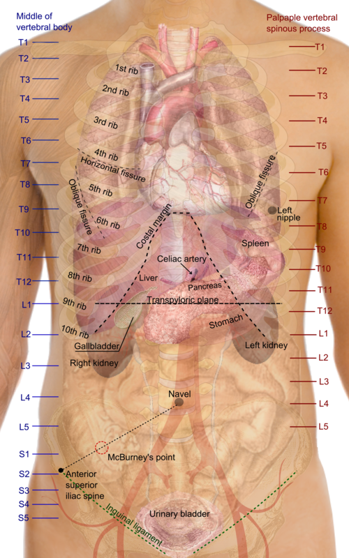
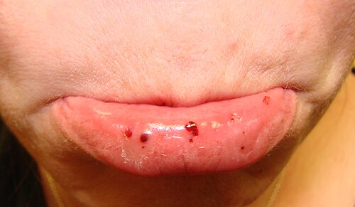

# RACIOCÍNIO CLÍNICO E DIAGNÓSTICO DIFERENCIAL

O raciocínio clínico não é um dom nato; é uma competência técnica treinável. Ele integra epidemiologia, semiologia, fisiopatologia, probabilidade pré-teste e segurança do paciente. Em vez de decorar diagnósticos isolados, o objetivo é construir hipóteses, hierarquizar gravidade e separar diagnósticos comuns de diagnósticos perigosos que não podem ser perdidos.

*Projeção anatômica dos órgãos torácicos e abdominais sobre a parede do tronco. Note a localização do Ponto de McBurney (1/3 da distância entre a espinha ilíaca anterossuperior e o umbigo), referência clássica no diagnóstico de apendicite. Conhecer essas relações anatômicas é a base do raciocínio clínico na dor abdominal. Fonte: Mikael Häggström, Domínio Público | Wikimedia Commons*

Algoritmo do diagnóstico diferencial

1. Síndrome inicial
 → dor torácica, abdome agudo, dispneia, icterícia, febre, síncope etc.

2. Gravidade imediata
 → instabilidade, sepse, hipoxemia, déficit focal, peritonite, choque

3. Hipóteses por frequência e risco
 → comum provável + raro perigoso + diagnóstico tempo-dependente

4. Probabilidade pré-teste
 → idade, sexo, contexto epidemiológico, fatores de risco, prevalência

5. Dados discriminadores
 → achado clínico ou exame que separa hipóteses próximas

6. Reavaliação
 → se o quadro evolui ou os dados discordam, a hipótese deve ser revisada

## O Processo do Raciocínio Clínico: Sistema 1 e Sistema 2

Para entender por que erramos diagnósticos, precisamos entender como pensamos. A psicologia cognitiva divide nosso pensamento em dois sistemas. O Sistema 1 é rápido, intuitivo e baseado em reconhecimento de padrões. Esse sistema atua quando icterícia associada a vesícula palpável e indolor evoca imediatamente o sinal de Courvoisier-Terrier, sem análise deliberada inicial.

Já o Sistema 2 é analítico, lento e consome energia. Ele deve ser ativado quando o quadro é atípico. Por exemplo, uma dor em baixo ventre que parece apendicite, mas o paciente tem sinal do obturador positivo e febre. Nesse cenário, deve-se considerar apendicite pélvica. O erro clássico de prova ocorre quando o aluno usa o Sistema 1 (intuição) em uma questão desenhada para o Sistema 2 (análise).

### Scripts de Doença (Illness Scripts)

O conceito de "scripts de doença" é fundamental. Uma analogia útil é pensar no raciocínio como uma biblioteca de arquivos clínicos. Cada doença tem um script com: epidemiologia (quem pega), fisiopatologia (por que acontece), quadro clínico (como se manifesta) e evolução. Durante o atendimento, os achados do paciente são comparados com scripts clínicos previamente aprendidos.

As bancas adoram testar os limites desses scripts. Elas dão um quadro de tosse seca há mais de duas semanas com RX de tórax normal e sem uso de IECA. Se o script de "tosse" inclui apenas pneumonia, hipóteses frequentes podem ser perdidas. Nesse cenário, também devem ser considerados gotejamento pós-nasal, asma e DRGE.

## Ferramentas Epidemiológicas no Diagnóstico

O diagnóstico não acontece no vácuo: ele depende da prevalência da doença na população. Em contexto de alta circulação de um vírus respiratório, febre e tosse passam a ter probabilidade pré-teste maior para infecção viral específica, o que modifica a interpretação de testes diagnósticos.

*Figura 2 - Petéquias orais em paciente com púrpura trombocitopênica imune (PTI). Achados clínicos como este devem ser interpretados à luz da sensibilidade e especificidade do sinal para guiar o raciocínio diagnóstico. Fonte: Mdscottis, CC BY-SA 3.0 | Wikimedia Commons*

## Sensibilidade, Especificidade e Odds Ratio (OR)

Este ponto costuma gerar confusão. A sensibilidade é a capacidade do teste de identificar os doentes (útil para rastreamento). A especificidade é a capacidade de identificar os saudáveis (útil para confirmar). Em provas, lembre-se: um teste muito específico, quando positivo, praticamente confirma a doença.

O Odds Ratio (OR) é outra figurinha carimbada. Se o OR for menor que 1, estamos falando de um fator protetor. Se for maior que 1, é um fator de risco. Mas cuidado: se o intervalo de confiança (IC) cruzar o número 1 (ex: IC 95% 0,8 a 1,5), o resultado não tem significância estatística. O valor 1 é o ponto de neutralidade para medidas como OR e RR.

### Tabela 1: Comparação de Parâmetros Diagnósticos

| Parâmetro | Definição | Utilidade Clínica |
| --- | --- | --- |
| Sensibilidade | Proporção de verdadeiros positivos entre os doentes | Excluir doença (SNOUT) |
| Especificidade | Proporção de verdadeiros negativos entre os sadios | Confirmar doença (SPIN) |
| Valor Preditivo Positivo | Chance de estar doente dado que o teste é positivo | Depende da prevalência |
| Odds Ratio (OR) | Razão de chances entre expostos e não expostos | Estudos de caso-controle |

## A Lógica da Dor Abdominal e o Diagnóstico Diferencial

A dor abdominal é um cenário clássico para testar raciocínio clínico, especialmente a diferenciação entre dor somática e dor visceral. A dor visceral é difusa, mal localizada, causada pela distensão de vísceras ocas. Já a dor parietal (ou somática) ocorre por irritação do peritônio parietal, é intensa e bem localizada.

Por que isso importa? Porque a apendicite começa como uma dor visceral periumbilical (distensão do apêndice) e evolui para uma dor parietal na fossa ilíaca direita (inflamação do peritônio). Se o aluno não entende essa transição fisiopatológica, ele se perde no diagnóstico diferencial.

### Apendicite e Escores Clínicos

A Pontuação de Alvarado é uma ferramenta de raciocínio clínico que frequentemente aparece em avaliações. Ela utiliza dados da história, exame físico e laboratório para estratificar o risco.

### Tabela 2: Escore de Alvarado (Simplificado)

| Critério | Pontuação |
| --- | --- |
| Dor que migra para o quadrante inferior direito | 1 |
| Anorexia | 1 |
| Náuseas ou Vômitos | 1 |
| Defesa em quadrante inferior direito | 2 |
| Descompressão dolorosa (Sinal de Blumberg) | 1 |
| Elevação da temperatura (> 37,3°C) | 1 |
| Leucocitose (> 10.000/mm³) | 2 |
| Desvio à esquerda no hemograma | 1 |

Interpretação: 0-3 (baixa probabilidade), 4-6 (considerar exames de imagem), 7-10 (alta probabilidade, cirurgia). Note que a defesa abdominal e a leucocitose valem 2 pontos cada. Isso não é por acaso; são os sinais mais fidedignos de inflamação sistêmica e peritoneal.

## O Raciocínio na Medicina de Família e Comunidade (MFC)

Na Atenção Primária à Saúde (APS), o raciocínio clínico segue uma lógica diferente do hospital. Aqui, usamos a "demora permitida". Se um paciente chega com queixas inespecíficas e recorrentes, sem sinais de alerta (red flags), a conduta não é pedir uma bateria de exames. É acolher, observar e construir vínculo. Isso faz parte da Prevenção Quaternária: evitar o excesso de intervenções médicas que podem causar mais dano que benefício.

Um conceito fundamental da MFC é o Método Clínico Centrado na Pessoa (MCCP). O diagnóstico médico (a doença) é apenas uma parte. Também é necessário explorar a experiência da doença (o "illness"), incluindo medos, preocupações e impacto na vida do paciente. Ignorar essa dimensão reduz adesão e efetividade do cuidado.

### Exemplo Clínico: O Caso da Disfunção Erétil

Imagine um paciente hipertenso em uso de Clortalidona e Metildopa que se queixa de disfunção erétil. O raciocínio clínico linear diria para prescrever um inibidor da PDE5. O raciocínio clínico refinado exige procurar a causa antes de adicionar outro medicamento: anti-hipertensivos podem contribuir para disfunção erétil. A primeira abordagem é considerar ajuste ou troca da medicação, quando clinicamente apropriado.

## Fisiopatologia Aplicada ao Diagnóstico

Muitas questões exigem compreensão do mecanismo bioquímico ou celular. A cicatrização, por exemplo, não é um evento único, mas uma sequência:

- Vasodilatação e Inflamação (Polimorfonucleares/PMN).

- Proliferação (Fibroblastos produzindo colágeno e neoformação vascular).

- Remodelação.

Os macrófagos são os maestros aqui, coordenando a transição da fase inflamatória para a proliferativa. Se a prova perguntar qual célula é a "sentinela" da inflamação na resposta ao trauma operatório, a resposta é o mastócito. Entender isso ajuda a compreender por que pacientes desnutridos ou em uso crônico de corticosteroides têm deiscência de sutura: eles falham na fase de proliferação e síntese de colágeno.

### O Efeito dos Corticosteroides

Corticosteroides são indutores de muitas alterações que causam confusão diagnóstica. Eles causam leucocitose com neutrofilia (por desmarginalização dos neutrófilos), mas causam eosinopenia. Eosinofilia deve direcionar o raciocínio para alergias, parasitoses, neoplasias ou insuficiência adrenal, situação em que falta cortisol para suprimir os eosinófilos).

## Diagnóstico Diferencial em Situações Específicas

### Icterícia e Obstrução Biliar

O Sinal de Courvoisier-Terrier (icterícia + vesícula palpável indolor) sugere fortemente uma neoplasia periampular, como o tumor de cabeça de pâncreas ou o Colangiocarcinoma (Tumor de Klatskin). Por que a vesícula é indolor? Porque a obstrução é crônica e progressiva, permitindo que a vesícula se dilate sem a inflamação aguda da colecistite (onde o sinal de Murphy seria positivo).

### Pediatria: Dores de Crescimento vs. Dor Orgânica

Este é um tema frequente. A "dor de crescimento" é um diagnóstico de exclusão. É tipicamente noturna, bilateral, em membros inferiores e sem sinais inflamatórios. Se a criança tem febre, perda de peso, dor fixa em uma articulação ou a dor a desperta com intensidade durante a noite, o raciocínio deve mudar para causas orgânicas (como osteomielite ou leucemia).

### Endocrinologia: O Eixo Tireoide-Prolactina

Um erro comum é não conectar sistemas. No hipotireoidismo primário, o corpo aumenta o TRH para tentar estimular a tireoide. O problema é que o TRH também estimula os lactotrofos na hipófise. Resultado: Hipotireoidismo pode causar hiperprolactinemia, levando a galactorreia e alterações menstruais (menorragia). Sempre que vir galactorreia, cheque o TSH antes de pedir ressonância de sela túrcica.

## Risco Cirúrgico e Pré-operatório

O raciocínio clínico no pré-operatório não serve para "liberar" o paciente, mas para estratificar o risco e otimizar as condições.

- **Diabetes Mellitus:** O foco é evitar a hipoglicemia e a cetoacidose. Não buscamos controle glicêmico perfeito no intraoperatório; a meta geralmente é manter entre 140-180 mg/dL.

- **Tabagismo:** O ideal é parar 8 semanas antes para reduzir complicações respiratórias. Se o paciente parou há apenas 24 horas, o benefício é apenas na redução da carboxi-hemoglobina, não na redução de secreções.

- **Exames de Rotina:** Em pacientes assintomáticos para cirurgias de baixo risco (como colecistectomia eletiva ou oftalmológicas), exames laboratoriais de rotina não reduzem desfechos adversos e não devem ser solicitados sistematicamente.

### Tabela 3: Classificação de Risco Cirúrgico (ASA)

| Classificação | Descrição | Exemplo |
| --- | --- | --- |
| ASA I | Paciente saudável | Não fumante, sem álcool |
| ASA II | Doença sistêmica leve | HAS controlada, DM controlado, Obesidade leve |
| ASA III | Doença sistêmica grave, não incapacitante | DM com complicações vasculares, IAM prévio > 3 meses |
| ASA IV | Doença sistêmica grave com risco constante de morte | Insuficiência cardíaca grave, IAM < 3 meses |
| ASA V | Paciente moribundo, não sobrevive sem a cirurgia | Aneurisma de aorta roto |
| ASA VI | Morte cerebral | Doador de órgãos |

## Documentação Médica: Atestado de Óbito

Preencher a Declaração de Óbito (DO) é uma tarefa de raciocínio clínico reverso: é preciso reconstruir a cadeia de eventos.

A Parte I da DO é dividida em:

- **Causa I (Imediata):** O evento final (ex: Choque séptico).

- **Causa II (Intermediária):** O que levou à causa imediata (ex: Peritonite).

- **Causa III (Básica):** A doença que iniciou tudo (ex: Apendicite aguda perfurada).

A causa básica é a mais importante para as estatísticas de saúde pública. Se a morte foi por causa externa (acidente, homicídio, suicídio), o médico assistente NÃO preenche a DO; o corpo deve ir para o IML. Se a morte foi natural, mas sem assistência médica, vai para o SVO (Serviço de Verificação de Óbitos). Lembre-se: a autoridade policial pode decidir o encaminhamento para o IML mesmo se houver um atestado médico de morte natural, caso haja suspeita de crime.

## Farmacologia e Interações no Raciocínio Clínico

O médico precisa antecipar como as drogas interagem. Um exemplo clássico de prova é o Fenobarbital. Ele é um potente indutor enzimático hepático. Se uma paciente usa anticoncepcional oral e começa a tomar Fenobarbital, o metabolismo do anticoncepcional acelera, os níveis séricos caem e o risco de gravidez aumenta drasticamente.

Outro ponto é o uso de diuréticos tiazídicos (como a Hidroclorotiazida). Eles podem aumentar a glicemia e o ácido úrico. Em um paciente com DM2 de difícil controle, o raciocínio clínico deve incluir a revisão dos diuréticos.

### Tabela 4: Medicamentos e Efeitos Metabólicos

| Medicamento | Efeito Principal | Impacto Clínico |
| --- | --- | --- |
| Tiazídicos | Hiperglicemia, Hiperuricemia | Piora DM e Gota |
| Betabloqueadores | Mascaram sintomas de hipoglicemia | Cuidado em diabéticos insulino-dependentes |
| IECA/BRA | Hipercalemia | Monitorar potássio em insuficiência renal |
| Nitratos | Vasodilatação coronariana | Contraindicados no IAM de Ventrículo Direito |

## Raciocínio em Saúde Coletiva e Bioestatística

O diagnóstico de uma população utiliza indicadores. A Esperança de Vida ao Nascer é o principal indicador de desenvolvimento socioeconômico e saúde coletiva. Já a Letalidade mede a gravidade de uma doença (número de óbitos / número de doentes), enquanto a Mortalidade mede o impacto na população total.

Nos ensaios clínicos, é comum distinguir "desfechos duros" (morte, infarto, AVC) de "desfechos substitutos" (redução da pressão arterial, redução do colesterol). Para mudar uma conduta, sempre preferimos estudos que demonstrem melhora em desfechos duros.

### Regressão à Média

Cuidado com esse conceito em provas de análise de estudos. A regressão à média é o fenômeno onde, se uma variável é extrema na primeira medição, ela tenderá a estar mais próxima da média na segunda medição, puramente por acaso. Isso pode fazer um tratamento ineficaz parecer bom se não houver um grupo controle.

## Casos Clínicos Rápidos para Fixação

**Cenário 1:** Paciente de 45 anos, obeso, com sonolência diurna excessiva e hipertensão que não melhora com três drogas.
*Raciocínio:* Pense em Síndrome da Apneia Obstrutiva do Sono (SAOS). O diagnóstico padrão-ouro é a polissonografia.

**Cenário 2:** Criança com febre, dor abdominal em cólica, vômitos biliosos e ruídos hidroaéreos metálicos. Tem cicatriz de cirurgia prévia.
*Raciocínio:* Abdome Agudo Obstrutivo por bridas (aderências). A cirurgia prévia é o principal fator de risco.

**Cenário 3:** Paciente idoso, ex-tabagista (30 anos-maço), sem sintomas.
*Raciocínio:* Rastreio de Câncer de Pulmão com TC de baixa dosagem se tiver entre 50-80 anos e carga tabágica ≥ 20 anos-maço (conforme recomendações atuais da USPSTF, frequentemente adotadas em provas).

## Pontos-chave

- **Sinal de Courvoisier-Terrier:** Icterícia + vesícula palpável indolor = Neoplasia (geralmente cabeça de pâncreas).

- **Sinal de Murphy:** Interrupção da inspiração à palpação do ponto cístico = Colecistite aguda.

- **Apendicite Pélvica:** Pode apresentar sinal do obturador positivo e sintomas urinários ou tenesmo.

- **Causa Básica de Morte:** É a doença ou lesão que iniciou a cadeia de eventos patológicos que levaram diretamente à morte.

- **IML vs. SVO:** Morte violenta ou suspeita = IML (sempre). Morte natural sem assistência = SVO.

- **Fenobarbital:** Indutor enzimático que reduz eficácia de anticoncepcionais orais.

- **IAM de Ventrículo Direito:** evitar nitratos e diuréticos (dependem de pré-carga).

- **Escore de Alvarado:** Defesa abdominal e leucocitose valem 2 pontos cada; os demais valem 1.

- **Odds Ratio (OR):** Se o intervalo de confiança inclui o 1, o resultado não é estatisticamente significante.

- **Prevenção Quaternária:** Conjunto de medidas que evitam o excesso de medicalização e intervenções desnecessárias.

- **Hipotireoidismo:** Pode causar galactorreia pelo aumento do TRH que estimula a prolactina.

- **Regra dos Nove (Queimados):** Cabeça do adulto é 9%, mas da criança é 18%. Membros inferiores no adulto são 18% cada, na criança 14%.

- **Eosinofilia:** Pensar em insuficiência adrenal se não houver causa alérgica ou parasitária óbvia.

- **Dores de Crescimento:** Diagnóstico de exclusão; nunca deve ter sinais inflamatórios ou perda de peso.

- **Cárie Infantil:** Causa importante de absenteísmo escolar e dificuldade de concentração em provas escolares.

- **Materiais de Diérese:** Bisturi e tesouras (Mayo/Metzenbaum) são usados para dividir tecidos.

- **Padrão-Ouro SAOS:** Polissonografia é o exame para diagnóstico de Apneia do Sono. 🧠

 Cópia offline para consulta pessoal.
 Fonte original:
 [https://www.medevo.com.br/material-apoio/ler/dbdbc483-ec76-4f6b-ab80-d6f1d90e0c8c](https://www.medevo.com.br/material-apoio/ler/dbdbc483-ec76-4f6b-ab80-d6f1d90e0c8c)
