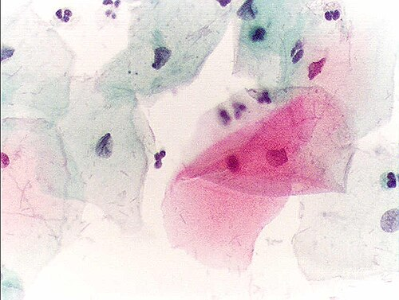

# RASTREAMENTO DO CÂNCER DE COLO UTERINO

Para entender o rastreamento do câncer de colo uterino, você precisa primeiro compreender a lógica da doença. Diferente de outros cânceres que surgem de forma explosiva, o câncer de colo de útero tem uma história natural lenta e previsível. Ele é quase inteiramente causado pela infecção persistente por tipos oncogênicos do Papilomavírus Humano (HPV), especialmente os tipos 16 e 18.

Por que isso importa para a sua prova? Porque se a doença demora anos para progredir de uma lesão precursora para um câncer invasivo, nós temos uma "janela de oportunidade" imensa para intervir. O rastreamento não serve para "achar o câncer", mas sim para achar a lesão que, se deixada lá, viraria um câncer daqui a 10 ou 15 anos. É por isso que o Ministério da Saúde (MS) e o INCA batem tanto na tecla da prevenção secundária com o exame citopatológico, o famoso Papanicolau.

*Figura 1 - Representação da displasia cervical (NIC), mostrando as alterações celulares progressivas no epitélio do colo uterino. Fonte: Blausen Medical Communications, CC BY 3.0 | Wikimedia Commons*

## Epidemiologia e a Realidade Brasileira

No Brasil, o câncer de colo uterino ainda é um problema de saúde pública grave. Ele ocupa a terceira posição entre os cânceres mais incidentes na população feminina (excluindo o câncer de pele não melanoma, que é o primeiro em ambos os sexos). Em algumas regiões menos desenvolvidas do país, ele chega a ser o segundo ou até o primeiro.

As bancas adoram cobrar os determinantes sociais aqui. A incidência está diretamente ligada à iniquidade em saúde e ao acesso aos serviços. Mulheres com menor escolaridade, menor renda e dificuldade de acesso à Atenção Primária à Saúde (APS) são as que mais morrem, não porque a biologia delas é diferente, mas porque o rastreamento não chega nelas.

Lembre-se: a prevenção primária é a vacinação contra o HPV (disponível no SUS para meninas e meninos de 9 a 14 anos) e o uso de preservativos. A prevenção secundária é o rastreamento citopatológico. Quando falamos em evitar exames desnecessários em mulheres fora da faixa etária ou tratar excessivamente lesões que regrediriam sozinhas, estamos falando de prevenção quaternária, um conceito recorrente em questões de Medicina Preventiva e Social.

*Figura 2 - Exame citopatológico (Papanicolaou) normal: células escamosas cervicais em mulher pré-menopausa, coloração de Papanicolaou 400x. Fonte: Alex_brollo, CC BY-SA 3.0 | Wikimedia Commons*

## O Exame Citopatológico: Quem, Quando e Como?

Este é o "coração" das questões de residência. Você precisa decorar as idades e os intervalos, mas vamos entender o porquê de cada número.

### A Faixa Etária de Ouro: 25 a 64 anos

Segundo as Diretrizes Brasileiras para o Rastreamento do Câncer do Colo do Útero (INCA/MS), o início do rastreamento deve ocorrer aos 25 anos para mulheres que já iniciaram a atividade sexual.

Por que não começar antes, se muitas meninas iniciam a vida sexual aos 15 ou 16 anos? Porque a infecção pelo HPV em mulheres jovens é extremamente comum e, na imensa maioria das vezes, transitória. O sistema imune da jovem costuma eliminar o vírus. Se fizermos o Papanicolau em uma menina de 19 anos, vamos achar alterações citológicas que regrediriam sozinhas, mas que acabariam levando a biópsias e procedimentos desnecessários no colo uterino (como a cirurgia de alta frequência), o que pode causar iatrogenia, como a incompetência istmocervical em futuras gestações. Isso é sobremedicalização.

A interrupção ocorre aos 64 anos. Mas cuidado com a pegadinha: para parar aos 64 anos, a mulher deve ter pelo menos dois exames negativos nos últimos cinco anos. Se ela chega aos 65 anos e nunca fez o exame, você não pode simplesmente dispensá-la. Você deve realizar dois exames com intervalo de um a três anos e, se ambos forem negativos, aí sim ela está dispensada.

### Periodicidade: A Regra do 1-1-3

O esquema é clássico:

- Realiza-se o primeiro exame.

- Repete-se após 1 ano.

- Se os dois primeiros forem normais (negativos), os próximos serão realizados a cada 3 anos.

Se algum exame vier alterado, esse fluxo é quebrado e entramos nas condutas específicas que veremos adiante.

### Técnica e Qualidade da Amostra

Para o exame ser considerado de boa qualidade, ele deve obrigatoriamente representar a Zona de Transformação (ZT). É na ZT que ocorre a metaplasia escamosa e onde a maioria das lesões precursoras se desenvolve.

Uma amostra satisfatória deve conter:

- Células escamosas (da ectocérvice).

- Células glandulares ou metaplásicas (da endocérvice).

Se o laudo vier "ausência de células da zona de transformação" em uma paciente assintomática e com exames anteriores normais, você não precisa repetir imediatamente. O MS recomenda apenas manter o rastreamento trienal de rotina. No MedEvo, sempre reforçamos: não trate o laudo, trate a paciente dentro do contexto epidemiológico.

| População | Início | Periodicidade | Fim |
| --- | --- | --- | --- |
| População Geral | 25 anos (se sexarca) | 2 anuais -> trienal | 64 anos (com 2 negativos em 5 anos) |
| Mulheres HIV+ | Após sexarca (independente da idade) | Semestral no 1º ano -> anual se CD4 > 200 | Manter enquanto houver vida sexual |
| Mulheres Virgens | Não rastrear | N/A | N/A |
| Histerectomia Total (por lesão benigna) | Não rastrear | N/A | N/A |

## Situações Especiais: Onde as Bancas se Divertem

### Mulheres HIV Positivas ou Imunossuprimidas

Aqui a regra muda completamente porque o risco de persistência do HPV e progressão para câncer é muito maior.

- Início: Logo após a primeira relação sexual, não importa se ela tem 15 ou 18 anos.

- Intervalo: Semestral no primeiro ano. Se ambos forem negativos, passa a ser anual.

- Condição: Se o CD4 estiver abaixo de 200 cel/mm³, o rastreamento deve ser mantido semestral até a recuperação imunológica.

### Mulheres Histerectomizadas

Se a histerectomia foi total (retirada do corpo e do colo) e por motivos benignos (ex: miomatose), e a paciente tinha exames anteriores normais, ela não precisa mais de rastreamento.
Por outro lado, se a histerectomia foi subtotal (o colo ficou lá), o rastreamento segue a regra da população geral. Se a histerectomia foi total, mas o motivo foi uma lesão precursora ou câncer de colo, ela deve manter o acompanhamento citopatológico da cúpula vaginal.

### Gestantes

O rastreamento na gestante segue as mesmas normas da não gestante. A gestação não protege contra o câncer e nem o exame prejudica o bebê, desde que não se utilize a escovinha endocervical (usa-se apenas a espátula de Ayre). No entanto, se a gestante tiver uma lesão suspeita, a conduta costuma ser conservadora, postergando tratamentos excisionais para o pós-parto, a menos que haja suspeita de câncer invasor.

## Interpretando o Laudo e Tomando Condutas

Este é o ponto onde o Dr. Will recomenda atenção redobrada. As bancas amam trocar "repetir citologia" por "encaminhar para colposcopia".

### ASC-US (Células Escamosas Atípicas de Significado Indeterminado, Possivelmente Não Neoplásicas)

É a alteração mais comum e a mais "leve". A conduta depende exclusivamente da idade:

- < 25 anos: Repetir citologia em 3 anos.

- Entre 25 e 29 anos: Repetir citologia em 12 meses.

- ≥ 30 anos: Repetir citologia em 6 meses.

Por que essa diferença? Porque em mulheres mais jovens, a chance de ser apenas uma inflamação ou uma infecção transitória por HPV é altíssima. Se você repetir em 6 meses na jovem, ainda vai dar alterado e você vai intervir sem necessidade. Damos 12 meses para o corpo "limpar" a alteração.

### LSIL (Lesão Intraepitelial de Baixo Grau)

Reflete a infecção produtiva pelo HPV. A conduta também é baseada na idade e segue a mesma lógica do ASC-US:

- < 25 anos: Repetir citologia em 3 anos.

- ≥ 25 anos: Repetir citologia em 6 meses.

**Atenção:** Se a paciente tem LSIL ou ASC-US e o exame de repetição vier novamente alterado (qualquer alteração), aí sim ela vai para a colposcopia.

### ASC-H (Células Escamosas Atípicas, não se pode excluir lesão de alto grau)

Aqui o "H" vem de High (alto). O citopatologista está te dizendo: "Olha, não tenho certeza, mas pode ser algo grave".

- Conduta: Colposcopia imediata, independente da idade.

### HSIL (Lesão Intraepitelial de Alto Grau)

Esta é a verdadeira lesão precursora do câncer.

- Conduta: Colposcopia imediata. Em pacientes acima de 25 anos, dependendo dos achados colposcópicos, pode-se até realizar o "ver e tratar" (exérese da zona de transformação no mesmo momento).

### AGC (Células Glandulares Atípicas)

Antigamente chamado de AGUS. Células glandulares vêm de dentro do canal ou até do endométrio. É uma situação perigosa.

- Conduta: Colposcopia imediata com avaliação do canal endocervical (escovado ou curetagem). Se a mulher tiver mais de 35 anos ou sangramento uterino anormal, deve-se avaliar também o endométrio (ultrassonografia transvaginal e, se necessário, biópsia de endométrio).

| Resultado do Papanicolau | Conduta Inicial |
| --- | --- |
| ASC-US (< 30 anos) | Repetir citologia em 12 meses |
| ASC-US (≥ 30 anos) | Repetir citologia em 6 meses |
| ASC-H ou HSIL | Colposcopia imediata |
| AGC (Células Glandulares) | Colposcopia + Avaliação de canal (e endométrio se > 35 anos) |
| AOI (Origem Indeterminada) | Colposcopia imediata |

## A Colposcopia e a Biópsia

Quando você encaminha a paciente para a colposcopia, o ginecologista vai usar o colposcópio e aplicar substâncias no colo:

- Ácido Acético: Identifica áreas com alta síntese proteica (núcleos grandes). As áreas ficam "acetobrancas". É o sinal mais importante de lesão.

- Teste de Schiller (Lugol): O lugol cora o glicogênio das células normais de castanho escuro (Schiller negativo). Células doentes ou imaturas não têm glicogênio e não coram, ficando amareladas (Schiller positivo ou iodo-negativo).

Se houver uma área suspeita (acetobranca densa, mosaico, pontilhado), faz-se a biópsia. O resultado da biópsia virá como NIC (Neoplasia Intraepitelial Cervical):

- NIC I: Corresponde ao LSIL. Conduta: Observação (repetir citologia em 6 meses ou 1 ano).

- NIC II e III: Correspondem ao HSIL. Conduta: Tratamento excisional (CAF - Cirurgia de Alta Frequência ou Conização).

## Violência Sexual e o Papel da APS

O rastreamento do câncer de colo muitas vezes é a porta de entrada para identificar outras vulnerabilidades. A violência contra a mulher é um determinante social de saúde fortíssimo. Mulheres que sofrem violência têm maior risco de dor pélvica crônica, ISTs e transtornos sexuais.

Se uma mulher chega à unidade de saúde após um episódio de violência sexual, o rastreamento do câncer fica em segundo plano diante da urgência da Profilaxia Pós-Exposição (PEP).

- PEP para HIV: Deve ser iniciada em até 72 horas (idealmente nas primeiras 2 horas).

- Profilaxia para ISTs não virais: Penicilina benzatina (sífilis), Azitromicina (clamídia), Ceftriaxona (gonorreia) e Metronidazol (tricomoníase).

- Contracepção de Emergência: Deve ser feita o mais rápido possível. Lembre-se: se a mulher já usa um método de alta eficácia (como o DIU ou implante), a anticoncepção de emergência não é necessária.

A abordagem deve ser sempre multiprofissional, envolvendo médico, enfermeiro, assistente social e psicólogo (equipes de Saúde da Família e NASF). O sigilo médico é fundamental, mas a notificação compulsória da violência é obrigatória (para fins epidemiológicos, não necessariamente para denúncia policial, que depende do consentimento da mulher adulta e lúcida).

## Diagnósticos Diferenciais no Exame Físico

Durante a coleta do Papanicolau, você pode encontrar corrimentos. Saber diferenciá-los é essencial para não confundir inflamação com lesão pré-neoplásica.

A Vaginose Bacteriana (causada pela Gardnerella vaginalis) é a causa mais comum de corrimento. O quadro clássico é:

- Corrimento branco-acinzentado, fluido e bolhoso.

- Odor fétido (peixe podre), que piora após o coito ou menstruação (devido à alcalinização do meio).

- pH vaginal > 4,5.

- Presença de "clue cells" (células-alvo) na microscopia.

- Tratamento: Metronidazol (oral ou vaginal).

Dica de mestre: Se você encontrar uma paciente na pós-menopausa com um laudo de LSIL, antes de se desesperar ou encaminhar para colposcopia, lembre-se da colpite atrófica. A falta de estrogênio deixa as células com núcleos maiores, o que pode simular uma lesão. A conduta correta é tratar a atrofia com estrogênio tópico por algumas semanas e repetir o exame. Se a alteração persistir, aí sim seguimos o protocolo.

## Prevenção Quaternária e Iatrogenia

O conceito de prevenção quaternária é um dos favoritos das bancas de Medicina Preventiva. No rastreamento do câncer de colo, ela se aplica quando evitamos:

- Rastrear mulheres < 25 anos.

- Rastrear mulheres que nunca tiveram atividade sexual.

- Rastrear mulheres > 64 anos com histórico de exames normais.

- Realizar colposcopia para ASC-US ou LSIL em jovens na primeira alteração.

O excesso de intervenção causa ansiedade, custos desnecessários ao sistema e danos físicos (como estenose cervical ou partos prematuros por colos encurtados). O bom médico é aquele que sabe quando NÃO intervir.

## O Papel do Agente Comunitário de Saúde (ACS)

Na Atenção Básica, o ACS é o elo entre a comunidade e a unidade. No rastreamento, o papel dele é:

- Identificar mulheres na faixa etária alvo (25-64 anos) que estão com exames atrasados.

- Desmistificar o exame (muitas mulheres têm medo ou vergonha).

- Promover a educação em saúde sobre a importância da prevenção e da vacinação contra o HPV.

- Busca ativa de pacientes que tiveram laudos alterados e não retornaram para a conduta.

## Resumo das Principais Atipias e Condutas

Para facilitar a memorização, vamos consolidar as condutas em uma tabela comparativa focada no que a diretriz do MS preconiza.

| Atipia Citológica | Conduta | Justificativa |
| --- | --- | --- |
| **ASC-US** | < 30a: 12 meses / ≥ 30a: 6 meses | Alta taxa de regressão espontânea |
| **LSIL** | < 30a: 12 meses / ≥ 30a: 6 meses | Reflete apenas o efeito citopático do vírus |
| **ASC-H** | Colposcopia imediata | Risco não desprezível de lesão de alto grau |
| **HSIL** | Colposcopia imediata | Lesão precursora real; alto risco de invasão |
| **AGC** | Colposcopia + Canal | Risco de lesão glandular (mais difícil de rastrear) |
| **NIC I (Biópsia)** | Observação (repetir citologia) | Lesão de baixo grau tem alta taxa de cura espontânea |
| **NIC II/III (Biópsia)** | Tratamento (CAF ou Cone) | Lesões de alto grau devem ser removidas |

## Pontos-Chave para Prova

- **Início do rastreamento:** 25 anos para quem já teve relação sexual. Nunca antes disso na população geral.

- **Fim do rastreamento:** 64 anos, desde que tenha 2 exames negativos nos últimos 5 anos.

- **Periodicidade:** Anual por 2 anos; se negativos, trienal.

- **Mulheres HIV+:** Rastreamento anual após dois exames semestrais negativos. Inicia logo após a sexarca.

- **ASC-US e LSIL:** A conduta é repetir citologia. O intervalo (6 ou 12 meses) depende da idade (corte nos 30 anos).

- **ASC-H, HSIL e AGC:** A conduta é sempre colposcopia imediata.

- **Zona de Transformação (ZT):** É obrigatório que a amostra contenha células escamosas e glandulares/metaplásicas para ser completa.

- **Mulheres virgens:** Não devem ser submetidas ao rastreamento.

- **Histerectomia total por mioma:** Se os exames anteriores eram normais, pode parar o rastreamento.

- **Pós-menopausa com LSIL:** Tratar atrofia com estrogênio antes de repetir o exame.

- **Vacina HPV:** Prevenção primária. Papanicolau: Prevenção secundária. Evitar sobremedicalização: Prevenção quaternária.

- **Violência Sexual:** PEP para HIV deve ser feita em até 72 horas. A anticoncepção de emergência é prioritária se não houver método eficaz prévio.

- **Câncer de Mama vs Colo:** Mama é bienal, 50-74 anos (Nota Técnica nº 626/2025-MS). Colo é trienal (após 2 negativos), 25-64 anos.

- **Biópsia com NIC I:** Não é tratamento cirúrgico! É acompanhamento com nova citologia em 6 meses (se ≥ 30 anos) ou 12 meses (se < 30 anos).

- **Schiller Positivo:** Significa que a área NÃO corou com lugol (iodo-negativa), o que é um sinal de alerta na colposcopia.

- **Câncer mais comum:** Excluindo pele não melanoma, o câncer de mama é o 1º e o de colo uterino é o 3º em incidência no Brasil.

- **Metronidazol:** Tratamento de escolha para Vaginose Bacteriana e Tricomoníase (esta última é uma IST).

- **Não use lubrificantes:** Na coleta do Papanicolau, deve-se evitar o uso de lubrificantes, géis ou duchas vaginais nas 48h anteriores, pois podem prejudicar a análise das células.

 Cópia offline para consulta pessoal.
 Fonte original:
 [https://www.medevo.com.br/material-apoio/ler/65ced737-91de-4f72-b89d-b4f4a769aacf](https://www.medevo.com.br/material-apoio/ler/65ced737-91de-4f72-b89d-b4f4a769aacf)
