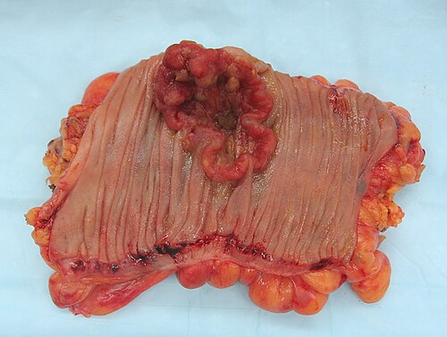

# RASTREAMENTO DO CÂNCER DE MAMA

Para entender o rastreamento do câncer de mama, você precisa primeiro vestir o chapéu do gestor de saúde pública e, logo depois, o do médico assistente. Por que digo isso? Porque no Brasil convivemos com duas diretrizes diferentes, e as bancas de residência amam explorar essa divergência. O rastreamento não é apenas "pedir uma mamografia"; é entender quem se beneficia, quando o exame mais atrapalha do que ajuda e como interpretar a sopa de letrinhas do sistema BI-RADS.

O objetivo principal aqui é a redução da mortalidade específica por câncer de mama. Não rastreamos para "achar doença", rastreamos para achar doença em estágio inicial que, se tratada, não matará a paciente.

*Figura 1 - Mulher realizando mamografia, principal método de rastreamento do câncer de mama. Fonte: National Cancer Institute, Domínio Público | Wikimedia Commons*

## Epidemiologia e a Lógica do Rastreamento

O câncer de mama é a neoplasia maligna mais comum entre as mulheres no Brasil (excluindo o câncer de pele não melanoma). O envelhecimento populacional e a exposição prolongada a estrogênios (menarca precoce, menopausa tardia, nuliparidade) explicam grande parte do aumento da incidência.

Mas cuidado: nem todo câncer diagnosticado no rastreamento é uma vitória. Existe o conceito de sobrediagnóstico (overdiagnosis). Isso ocorre quando detectamos um tumor que cresceria tão lentamente que nunca chegaria a causar sintomas ou a morte da paciente durante sua vida. É por isso que não rastreamos mulheres muito jovens (baixo risco) nem mulheres muito idosas com baixa expectativa de vida.

### Fatores de Risco: O Divisor de Águas

Para a prova, você deve dividir as pacientes em dois grandes grupos: Risco Habitual e Alto Risco. Essa distinção muda completamente o ponto de partida do rastreamento.

**Fatores de Risco Habitual/Moderado:**

- Idade (principal fator isolado).

- História reprodutiva (exposição ao estrogênio).

- Obesidade pós-menopausa.

- Sedentarismo e etilismo.

**Fatores de Alto Risco (Critérios para Rastreamento Diferenciado):**

- História familiar de câncer de mama em parentes de primeiro grau antes dos 50 anos.

- História familiar de câncer de ovário em qualquer idade.

- História familiar de câncer de mama em homens.

- Mutação confirmada nos genes BRCA1 ou BRCA2.

- História pessoal de radioterapia de tórax (ex: tratamento de Linfoma de Hodgkin) entre os 10 e 30 anos de idade.

*Figura 2 - Aspecto macroscópico de peça de colectomia com câncer colorretal, demonstrando a importância do rastreamento oncológico. Fonte: Emmanuelm, CC BY 3.0 | Wikimedia Commons*

## As Diretrizes Brasileiras: O Campo de Batalha das Provas

Aqui está o ponto onde a maioria dos alunos escorrega. Você precisa ler o enunciado com atenção: ele pergunta a conduta segundo o Ministério da Saúde (MS/INCA) ou segundo as Sociedades Especialistas (SBM/FEBRASGO/CBR)?

### Rastreamento no Risco Habitual

| Critério | Ministério da Saúde (MS/INCA) | Sociedades Médicas (SBM/FEBRASGO) |
| --- | --- | --- |
| **Idade de Início** | 40 anos (sob demanda/decisão conjunta) 50 anos (início convocatório) | 40 anos |
| **Idade de Término** | 74 anos (estendimento do tempo na atualização de 2025) | 74 anos (ou enquanto houver boa expectativa de vida) |
| **Periodicidade** | Bienal (a cada 2 anos) | Anual |
| **Exame Físico** | Não recomendado como rastreamento isolado | Recomendado como parte da consulta |
| **Autoexame** | Desaconselhado como método de rastreio | Orientar "conscientização das mamas" |

**Por que a diferença?**
O Ministério da Saúde foca na saúde coletiva e no custo-benefício. Entre 40 e 49 anos, a densidade mamária é maior (reduzindo a sensibilidade da mamografia) e a incidência é menor, o que gera muitos resultados falso-positivos e biópsias desnecessárias. Já as Sociedades Médicas focam no benefício individual: embora mais difícil, detectar o câncer aos 40 anos salva anos potenciais de vida.

**Dica de Prova:** Se a questão citar "rastreamento populacional no SUS", a resposta é **50 a 74 anos, bienal** (Nota Técnica nº 626/2025-MS). Se citar "conduta médica em consultório", tendemos à recomendação das Sociedades (40 anos, anual).

## O Arsenal Diagnóstico: Mamografia e Complementos

A mamografia é o único exame que comprovadamente reduz a mortalidade por câncer de mama em estudos populacionais. Ela é composta por duas incidências básicas em cada mama: Craniocaudal (CC) e Mediolateral Oblíqua (MLO).

### Por que a Mamografia é o Padrão-Ouro?

Ela é excelente para detectar microcalcificações, que muitas vezes são o único sinal de um Carcinoma Ductal In Situ (CDIS). O CDIS frequentemente se apresenta como microcalcificações pleomórficas agrupadas. Guarde esse termo: pleomórficas. Se aparecer na prova, o sinal de alerta para malignidade deve ligar imediatamente.

### Ultrassonografia (USG)

A USG não é exame de rastreamento isolado. Ela é o braço direito da mamografia em duas situações principais:

- **Mamas Densas:** Em mamas com muito tecido glandular (BI-RADS C ou D), a mamografia perde sensibilidade (o câncer é branco e a glândula também, gerando o efeito de "urso polar na neve"). A USG ajuda a "enxergar" através dessa densidade.

- **Diferenciação Sólido vs. Cístico:** Se a mamografia mostra um nódulo de limites precisos, a USG dirá se é um cisto simples (benigno) ou um nódulo sólido (que pode precisar de investigação).

### Ressonância Magnética (RM)

A RM tem altíssima sensibilidade, mas baixa especificidade. Ela é reservada para o rastreamento de pacientes de **Alto Risco** (mutações BRCA, história de radioterapia torácica) ou em casos muito específicos de planejamento cirúrgico. No alto risco, a RM começa a ser feita anualmente, geralmente a partir dos 25-30 anos, intercalada com a mamografia.

## Classificação BI-RADS e Condutas

O sistema BI-RADS (Breast Imaging Reporting and Data System) foi criado para padronizar o laudo e, consequentemente, a conduta. Como diz o Dr. Will, "BI-RADS não é diagnóstico histológico, é uma estimativa de risco".

### BI-RADS 0: Incompleto

A mamografia não foi suficiente. Pode ser uma assimetria focal ou uma área que precisa de melhor avaliação.

- **Conduta:** Comparar com exames anteriores ou realizar exames complementares (USG ou incidências mamográficas adicionais, como compressão focal e magnificação).

- **Pegadinha:** Se houver microcalcificações suspeitas, a conduta é a **magnificação** para avaliar melhor a morfologia e a distribuição.

### BI-RADS 1 e 2: Normal e Benigno

- **BI-RADS 1:** Mama sem achados.

- **BI-RADS 2:** Achados certamente benignos (fibroadenoma calcificado, cisto simples, linfonodo intramamário, calcificações vasculares).

- **Conduta:** Seguir o rastreamento de rotina conforme a idade.

### BI-RADS 3: Provavelmente Benigno

O risco de malignidade é menor que 2%. Exemplos: nódulo sólido, circunscrito, oval e paralelo à pele.

- **Conduta:** Controle radiológico em curto prazo. O esquema clássico é: repetir o exame em 6 meses; se estável, repetir com 12 meses (totalizando 18 meses do início); se estável, repetir com 24 meses (totalizando 3 anos). Se após 2-3 anos a lesão não mudou, ela é reclassificada como BI-RADS 2.

- **Erro Comum:** Pedir biópsia para BI-RADS 3. Não se faz isso de rotina, a menos que a paciente tenha um fator de risco muito alto ou ansiedade extrema.

### BI-RADS 4 e 5: Suspeitos

- **BI-RADS 4:** Suspeita de malignidade (2% a 95%). Subdividido em 4A (baixa), 4B (moderada) e 4C (alta suspeita).

- **BI-RADS 5:** Altamente suspeito (>95%). Nódulo espiculado, irregular, com microcalcificações pleomórficas.

- **Conduta:** Investigação histopatológica (Biópsia).

### BI-RADS 6: Malignidade Comprovada

Paciente que já tem biópsia positiva e está fazendo o exame para controle ou planejamento terapêutico.

| BI-RADS | Risco de Malignidade | Conduta Sugerida |
| --- | --- | --- |
| 0 | Inconclusivo | Avaliação adicional (USG/Magnificação) |
| 1 | 0% | Rastreio de rotina |
| 2 | 0% | Rastreio de rotina |
| 3 | < 2% | Controle em 6 meses |
| 4 | 2 - 95% | Biópsia (Core biopsy ou Mamotomia) |
| 5 | > 95% | Biópsia (Core biopsy ou Mamotomia) |
| 6 | 100% (conhecido) | Tratamento definitivo |

## Procedimentos de Biópsia: Qual escolher?

Quando o BI-RADS é 4 ou 5, precisamos de tecido. No MedEvo, sempre reforçamos: a escolha do método depende da imagem.

- **Core Biopsy (Biópsia por agulha grossa):** É a primeira escolha para nódulos sólidos. Retira fragmentos ("cilindros") de tecido. É feita guiada por USG ou mamografia.

- **Mamotomia (Biópsia vácuo-assistida):** Utiliza uma agulha mais grossa e um sistema de vácuo. É excelente para microcalcificações (BI-RADS 4 ou 5 sem nódulo visível), pois consegue retirar mais material e até colocar um clipe metálico para marcar o local da lesão caso ela seja totalmente aspirada.

- **PAAF (Punção Aspirativa por Agulha Fina):** Ótima para esvaziar cistos sintomáticos ou avaliar linfonodos axilares. **Não serve** para diagnóstico definitivo de nódulo sólido suspeito, pois não avalia a arquitetura do tecido (não diferencia carcinoma in situ de invasor).

## Situações Especiais e Pegadinhas de Prova

### A Paciente Jovem com Nódulo Palpável

Imagine uma mulher de 25 anos com um nódulo móvel e bem delimitado. Você pede mamografia? **Não!** Em mulheres abaixo de 35-40 anos, o tecido mamário é muito denso. O exame inicial de escolha é a **Ultrassonografia**. Se a USG mostrar características suspeitas, aí sim podemos considerar a mamografia diagnóstica.

### Nódulo Maligno na Ultrassonografia

As bancas adoram descrever os achados. Um nódulo maligno típico na USG é:

- Mais alto do que largo (cresce "atravessando" os planos teciduais).

- Margens irregulares ou espiculadas.

- Sombra acústica posterior (o som não passa bem pelo tumor denso).

- Hipoecóico e não paralelo à pele.

### Terapia de Reposição Hormonal (TRH) e Rastreamento

A TRH combinada (estrogênio + progesterona) aumenta levemente o risco de câncer de mama e pode aumentar a densidade mamária, dificultando a mamografia. Se uma paciente em TRH apresenta um achado BI-RADS 4B, a conduta é suspender a TRH e realizar a biópsia. Não se espera "limpar" a imagem para biopsiar depois.

### Vacinação COVID-19 e Linfonodos

Uma pérola clínica recente: a vacina da COVID-19 (e outras vacinas) pode causar linfoadenopatia axilar ipsilateral transitória. Se a paciente fez mamografia logo após a vacina e apareceu um linfonodo axilar isolado, a recomendação é repetir o exame em 4 a 12 semanas antes de classificar como algo suspeito.

## Prevenção Quaternária e Rastreamento

Muitas questões de Medicina de Família e Comunidade abordam o rastreamento sob a ótica da prevenção quaternária (evitar o dano causado pelo excesso de intervenção médica).
O rastreamento em mulheres fora da faixa etária (ex: 40 anos pelo MS) ou com periodicidade excessiva pode levar a:

- **Falso-positivos:** Estresse psicológico e biópsias desnecessárias.

- **Sobrediagnóstico:** Tratar tumores que não matariam.

- **Exposição à radiação:** Embora o risco seja baixo com aparelhos modernos, ele existe.

## Pontos-Chave para Prova

- **Rastreamento MS/INCA:** 50 a 74 anos, bienal (mamografia) — Nota Técnica nº 626/2025. Mulheres de 40-49 anos podem realizar por demanda com decisão compartilhada.

- **Rastreamento SBM/FEBRASGO:** 40 a 74 anos, anual (mamografia).

- **Alto Risco:** Iniciar rastreamento aos 30 anos (ou 10 anos antes do caso mais jovem na família, mas nunca antes dos 25). RM é mandatória aqui.

- **BI-RADS 0:** Conduta é complementação (USG ou novas incidências). Se microcalcificações -> Magnificação.

- **BI-RADS 3:** Conduta é seguimento em 6 meses. Risco de malignidade < 2%.

- **BI-RADS 4 e 5:** Conduta é biópsia histopatológica.

- **Linfonodo Intramamário:** É achado BI-RADS 2 (benigno). Não confunda com linfonodo axilar suspeito.

- **Mamas Densas:** Reduzem a sensibilidade da mamografia; a USG é o complemento ideal.

- **Nódulo em Jovem (< 35 anos):** Começar investigação com Ultrassonografia.

- **Core Biopsy vs. Mamotomia:** Core para nódulos; Mamotomia preferencial para microcalcificações.

- **PAAF:** Não serve para diagnóstico de câncer de mama (não diferencia in situ de invasor).

- **Achado Maligno USG:** Nódulo "mais alto que largo" com sombra acústica posterior.

- **Achado Maligno Mamografia:** Microcalcificações pleomórficas agrupadas ou nódulo espiculado.

- **O que NÃO fazer:** Não pedir CA 15-3 para rastreamento (marcador tumoral não serve para diagnóstico inicial). Não indicar RM para pacientes de risco habitual.

- **Fatores de Risco:** Menarca precoce, menopausa tardia e nuliparidade aumentam o risco (maior tempo de exposição ao estrogênio). 🩺

 Cópia offline para consulta pessoal.
 Fonte original:
 [https://www.medevo.com.br/material-apoio/ler/59d08734-61e0-4eee-9874-f2f0d97f27ff](https://www.medevo.com.br/material-apoio/ler/59d08734-61e0-4eee-9874-f2f0d97f27ff)
