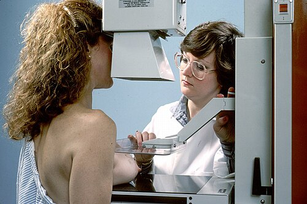
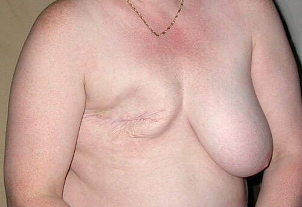

# RASTREAMENTO DO CÂNCER DE MAMA NA APS: FLUXOS E DIRETRIZES

O câncer de mama é a neoplasia maligna mais comum entre as mulheres no Brasil, excetuando-se o câncer de pele não melanoma. Para as provas de residência, entender o rastreamento não é apenas decorar idades, mas compreender a lógica da saúde pública versus a lógica da medicina suplementar, além de dominar a conduta diante de um resultado alterado.

*Figura 1 - Realização de mamografia, exame fundamental no rastreamento do câncer de mama na Atenção Primária à Saúde. Fonte: National Cancer Institute, Domínio Público | Wikimedia Commons*

## Epidemiologia e Fisiopatologia: O Porquê do Rastreamento

Por que focamos tanto no câncer de mama? Porque ele apresenta uma alta incidência e, se detectado tardiamente, uma alta letalidade. No entanto, quando diagnosticado precocemente, as chances de cura ultrapassam 90%. O principal fator de risco é a idade: a incidência aumenta progressivamente após os 50 anos.

Fisiopatologicamente, a maioria dos cânceres de mama são adenocarcinomas, originados nas unidades ducto-lobulares. O estímulo estrogênico prolongado é o grande vilão. Por isso, fatores que aumentam a exposição ao estrogênio ao longo da vida elevam o risco: menarca precoce (antes dos 12 anos), menopausa tardia (após os 55 anos), nuliparidade ou primeira gestação após os 30 anos.

Por outro lado, a amamentação é um fator protetor clássico, pois reduz o número de ciclos ovulatórios e promove a diferenciação celular do tecido mamário. Em provas, a obesidade pós-menopausa é frequentemente citada como fator de risco modificável, pois o tecido adiposo converte androgênios em estrogênio via aromatase, mantendo o estímulo mamário mesmo após a falência ovariana.

## Níveis de Prevenção e o Papel da APS

Na Atenção Primária à Saúde (APS), trabalhamos com todos os níveis de prevenção, e as bancas adoram misturar esses conceitos.

- **Prevenção Primária:** O objetivo é impedir que a doença surja. Aqui entram as orientações sobre estilo de vida: manter o peso adequado, praticar atividade física regular (pelo menos 150 minutos de atividade moderada por semana) e evitar o consumo de álcool.

- **Prevenção Secundária:** É o rastreamento propriamente dito. O objetivo é o diagnóstico precoce em mulheres assintomáticas. A mamografia é a única ferramenta que comprovadamente reduz a mortalidade por câncer de mama em estudos populacionais.

- **Prevenção Terciária:** Foca na reabilitação e na redução de sequelas em mulheres que já trataram o câncer (ex: fisioterapia para evitar linfedema pós-mastectomia).

- **Prevenção Quaternária:** Este é o conceito "da moda" nas provas de Medicina Preventiva. Significa evitar o excesso de intervenções médicas que podem causar mais dano do que benefício (iatrogenia). Solicitar mamografia para uma mulher de 35 anos sem fatores de risco é uma falha na prevenção quaternária, pois expõe a paciente a radiação e ao risco de resultados falso-positivos que levarão a biópsias desnecessárias.

## Estratégias de Detecção Precoce: Rastreamento vs. Diagnóstico Precoce

Cuidado para não confundir esses dois termos. O **rastreamento** é feito na mulher assintomática (aquela que vai à UBS apenas para "fazer os preventivos"). O **diagnóstico precoce** é a abordagem da mulher que já apresenta um sinal ou sintoma (um nódulo palpável, descarga papilar hemática, retração de pele).

O Ministério da Saúde (MS) e o INCA são enfáticos: o autoexame das mamas não deve ser ensinado como método de rastreamento. Por quê? Porque ele não reduz mortalidade e aumenta o número de biópsias de lesões benignas. O que o professor deve orientar é o "Breast Awareness" (autoconhecimento mamário), onde a mulher conhece seu corpo e procura o médico ao notar alterações, sem a obrigatoriedade de uma técnica sistemática de palpação.

Da mesma forma, o Exame Clínico das Mamas (ECM) realizado pelo médico ou enfermeiro, embora faça parte do exame físico completo, não é mais recomendado pelo MS como estratégia de rastreamento populacional isolada, devido à baixa sensibilidade para detectar lesões não palpáveis.

*Figura 2 - Resultado pós-mastectomia, reforçando a importância do diagnóstico precoce através do rastreamento mamográfico adequado. Fonte: Acrocynus, CC BY-SA 3.0 | Wikimedia Commons*

## As Diretrizes de Rastreamento: O Embate MS vs. Sociedades Médicas

Este é o ponto onde 80% das questões de prova se concentram. Você precisa saber quem está perguntando. Se a questão cita "Ministério da Saúde", "INCA" ou "SUS", a regra é uma. Se cita "Sociedade Brasileira de Mastologia (SBM)", "FEBRASGO" ou "Colégio Brasileiro de Radiologia (CBR)", a regra é outra.

### Rastreamento em Mulheres de Risco Habitual

A maioria das mulheres se encaixa aqui: sem história familiar forte e sem mutações genéticas conhecidas.

| Critério | Ministério da Saúde / INCA | SBM / FEBRASGO / CBR |
| --- | --- | --- |
| **Idade de Início** | 50 anos (40, se concordância entre médico e paciente) | 40 anos |
| **Idade de Término** | 74 anos | 74 anos (ou enquanto tiver boa saúde) |
| **Periodicidade** | Bienal (a cada 2 anos) | Anual |
| **Método** | Mamografia | Mamografia |

**Por que o MS recomenda apenas a partir dos 50 anos e bienal?**
Por uma questão de custo-efetividade e balanço de riscos. Antes dos 50 anos, as mamas são mais densas, o que diminui a sensibilidade da mamografia (o parênquima branco "esconde" o câncer que também é branco). Além disso, o número de falso-positivos é muito maior em mulheres jovens, gerando ansiedade e procedimentos desnecessários. O Dr. Will sempre lembra nas discussões de caso: no SUS, seguimos a diretriz do MS para otimizar recursos e proteger a população do sobrediagnóstico.

### Rastreamento em Mulheres de Risco Elevado

Quem são as mulheres de alto risco? Segundo o MS, são aquelas que possuem:

- História familiar de câncer de mama em parente de primeiro grau (mãe, irmã, filha) diagnosticado antes dos 50 anos.

- História familiar de câncer de mama bilateral ou de ovário em qualquer idade.

- História familiar de câncer de mama em homem.

- Lesão mamária de risco (hiperplasia ductal atípica, neoplasia lobular in situ).

Para essas mulheres, o rastreamento deve ser individualizado e geralmente começa mais cedo (aos 35 anos ou 10 anos antes da idade em que o parente foi diagnosticado). Aqui, a Ressonância Magnética (RM) de mamas pode ser utilizada de forma suplementar à mamografia, devido à sua altíssima sensibilidade, embora tenha menor especificidade.

## O Uso da Ultrassonografia e da Ressonância Magnética

Um erro clássico de prova é achar que a Ultrassonografia (USG) pode substituir a mamografia no rastreamento. **Não pode.** A USG não consegue ver microcalcificações, que são, muitas vezes, o primeiro sinal de um câncer in situ.

A USG é um exame **complementar**. Ela é excelente para:

- Diferenciar lesões sólidas de císticas.

- Avaliar mamas densas (onde a mamografia perde sensibilidade).

- Guiar biópsias.

A Ressonância Magnética, como mencionado, é reservada para o rastreamento de mulheres com mutações genéticas (BRCA1 e BRCA2) ou risco muito elevado. Em mamas extremamente densas, a RM suplementar reduz o chamado "câncer de intervalo" (aquele que surge entre uma mamografia e outra porque não foi visto no primeiro exame).

## Classificação BI-RADS e Condutas

Você não pode ir para a prova sem saber a tabela BI-RADS (Breast Imaging-Reporting and Data System). Ela padroniza o laudo e dita a conduta.

| BI-RADS | Avaliação | Risco de Malignidade | Conduta |
| --- | --- | --- | --- |
| **0** | Inconclusivo | N/A | Necessita avaliação adicional (USG, compressão, magnificação) |
| **1** | Negativo | 0% | Repetir rastreamento conforme idade (rotina) |
| **2** | Achados Benignos | 0% | Repetir rastreamento conforme idade (rotina) |
| **3** | Provavelmente Benigno | < 2% | Controle radiológico em 6 meses (por 2 a 3 anos) |
| **4** | Suspeito | 2% - 95% | Biópsia (Core Biopsy ou Mamotomia) |
| **5** | Altamente Suspeito | > 95% | Biópsia (Core Biopsy ou Mamotomia) |
| **6** | Malignidade Confirmada | 100% | Já tem diagnóstico; prosseguir para tratamento |

**Dica de Ouro do MedEvo:** Se a questão mostrar um BI-RADS 0, a resposta NUNCA será biópsia imediata. Você deve primeiro "esgotar" a imagem (pedir um USG se foi mamografia, ou vice-versa, ou fazer manobras especiais).

**Cuidado com o BI-RADS 3:** A conduta é o acompanhamento em curto prazo. Se após 2 ou 3 anos a lesão permanecer estável, ela é reclassificada como BI-RADS 2. Se ela aumentar ou mudar de característica, vira BI-RADS 4 e vai para biópsia.

## Abordagem de Nódulos Mamários na APS

Imagine que uma paciente de 55 anos chega à sua consulta na UBS queixando-se de um nódulo endurecido e fixo na mama direita, percebido há 1 mês. Isso não é rastreamento!

Nesse caso, a conduta inicial é o exame físico detalhado. Nódulos suspeitos são: endurecidos, pouco móveis, com bordas irregulares, associados a retrações de pele ou linfonodomegalias axilares ipsilaterais.

Para mulheres acima de 40-50 anos com nódulo suspeito, o primeiro exame de imagem é a mamografia diagnóstica (mesmo que ela tenha feito uma de rastreio há 6 meses). Se for uma mulher jovem (< 30-35 anos), começamos pela USG, pois a densidade mamária da jovem inviabiliza a mamografia e o risco de câncer é menor, sendo os fibroadenomas (benignos) a causa mais comum.

## Clínica Ampliada e Subjetividade na APS

O médico de família não trata apenas o "nódulo na mama esquerda". Ele trata a Dona Maria, que tem medo de morrer como a vizinha morreu, que cuida dos netos e que talvez não tenha dinheiro para o transporte até o centro de oncologia.

A **Clínica Ampliada** foca na subjetividade e na experiência da paciente com a doença. É fundamental utilizar a **Decisão Compartilhada**. Ao explicar os riscos e benefícios do rastreamento (especialmente naquelas faixas etárias "cinzentas" como entre 40 e 49 anos), o médico deve incluir a paciente na escolha, respeitando sua autonomia e seus valores.

## Atendimento à Vítima de Violência Sexual

Este tema aparece frequentemente correlacionado à saúde da mulher na APS. Se uma mulher chega à UBS relatando violência sexual, a prioridade é o acolhimento e a profilaxia de urgência.

- **Profilaxia HIV (PEP):** Deve ser iniciada em até 72 horas (idealmente nas primeiras 2 horas).

- **Anticoncepção de Emergência:** O mais rápido possível (até 5 dias).

- **Profilaxia de ISTs não virais:** Penicilina benzatina (sífilis), Azitromicina (cancro mole/clamídia), Ceftriaxone (gonorreia).

- **Notificação:** A notificação de violência doméstica e sexual é compulsória e deve ser feita em até 24 horas para as autoridades de saúde (Vigilância Epidemiológica). No prontuário, o registro deve ser detalhado, mas sem julgamentos de valor.

## Situações Especiais e Pegadinhas de Prova

- **Homens podem ter câncer de mama?** Sim, embora seja raro (1% dos casos). Não existe rastreamento para homens, mas qualquer nódulo palpável em homem deve ser investigado imediatamente com mamografia e biópsia.

- **Mamas Densas:** Reduzem a sensibilidade da mamografia. A conduta é complementar com USG.

- **Implantes Mamários:** Não contraindicam a mamografia, mas exigem manobras especiais (Manobra de Eklund) para afastar a prótese e visualizar o parênquima.

- **Novembro Azul:** Foco em câncer de próstata e saúde do homem. Lembre-se que o rastreamento de próstata também exige decisão compartilhada para evitar o sobrediagnóstico.

- **Identidade de Gênero:** Homens trans (que mantêm tecido mamário) e mulheres trans (que usam hormônios por longo prazo) também devem seguir protocolos de rastreamento adaptados. Identidade de gênero é o que a pessoa é; orientação sexual é por quem ela sente atração.

## Pontos-Chave para Prova

- **Rastreamento MS/INCA:** 50 (40, se concordância médico-paciente) a 74 anos, Mamografia Bienal.

- **Rastreamento SBM/FEBRASGO:** 40 a 74 anos, Mamografia Anual.

- **Único exame que reduz mortalidade:** Mamografia.

- **Autoexame das mamas:** Não é método de rastreamento; serve para autoconhecimento.

- **BI-RADS 0:** Inconclusivo. Conduta: Complementar com USG ou novas incidências mamográficas.

- **BI-RADS 3:** Provavelmente benigno. Conduta: Repetir em 6 meses.

- **BI-RADS 4 e 5:** Suspeitos. Conduta: Biópsia (Core Biopsy é preferível à PAAF para lesões sólidas).

- **Fatores de Risco:** Idade (principal), história familiar de 1º grau, nuliparidade, obesidade pós-menopausa.

- **Prevenção Primária:** Dieta, exercício, evitar álcool.

- **Prevenção Quaternária:** Não solicitar exames de rastreio fora da faixa etária ou periodicidade sem justificativa clínica.

- **Alto Risco:** Iniciar rastreio aos 35 anos (ou 10 anos antes do caso índice) com Mamografia + RM anual.

- **Descarga Papilar Suspeita:** Espontânea, unilateral, uniductal, serosanguinolenta ou "água de rocha".

- **Nódulo em Mulher Jovem (< 30 anos):** Iniciar investigação com Ultrassonografia.

- **Notificação de Violência:** Compulsória e imediata (até 24h para a rede de saúde).

- **Clínica Ampliada:** Olhar para o sujeito além da patologia, valorizando a autonomia e o contexto social.

- **Mortalidade:** O coeficiente de mortalidade reflete o risco de morrer pela doença na população geral; o rastreamento visa reduzir esse indicador.

 Cópia offline para consulta pessoal.
 Fonte original:
 [https://www.medevo.com.br/material-apoio/ler/02368f30-41fb-4a01-a6a2-20914a3eeda9](https://www.medevo.com.br/material-apoio/ler/02368f30-41fb-4a01-a6a2-20914a3eeda9)
