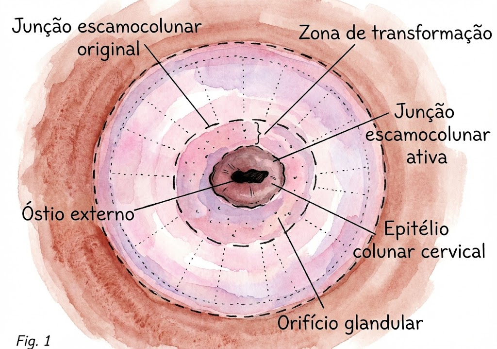

# RASTREAMENTO DO COLO DO ÚTERO, HPV, NIC E COLPOSCOPIA

Para entender o câncer do colo do útero, você precisa entender uma região específica da anatomia feminina: a Zona de Transformação (ZT). É aqui que a mágica, ou melhor, a patologia acontece. O colo do útero tem dois tipos de epitélio: o escamoso (na ectocérvice) e o colunar simples (na endocérvice). O ponto de encontro entre eles é a Junção Escamo-Colunar (JEC).

*Figura 1 - Junção escamo-colunar (JEC): ponto de encontro entre o epitélio escamoso e o colunar, local onde se originam as neoplasias cervicais.*

Ao longo da vida, por influência do pH vaginal e hormônios, o epitélio colunar sofre metaplasia e se transforma em escamoso. Essa área de mudança é a ZT. Por que isso importa para a sua prova? Porque o HPV tem um "carinho" especial por células em metaplasia. É nessa zona de intensa divisão celular que o vírus se integra ao DNA do hospedeiro. Se você entender que o câncer de colo é uma doença da ZT, você entende por que a coleta do Papanicolau precisa, obrigatoriamente, atingir essa região.

## O Agente Etiológico: HPV e a Fisiopatologia

O Papilomavírus Humano (HPV) é o fator necessário, embora não suficiente, para o desenvolvimento do câncer cervical. Existem mais de 150 tipos, mas para a residência, você deve focar em quatro:

- Tipos 6 e 11: Baixo risco oncogênico. Causam os condilomas acuminados (verrugas genitais).

- Tipos 16 e 18: Alto risco oncogênico. Estão presentes em cerca de 70% dos casos de câncer de colo no mundo.

A patogênese envolve a expressão de duas oncoproteínas virais: E6 e E7. A E6 degrada a proteína p53 (o "guardião do genoma"), impedindo a apoptose da célula danificada. A E7 inativa a proteína do retinoblastoma (pRb), liberando o ciclo celular para uma proliferação descontrolada.

Cuidado: a maioria das infecções por HPV é transitória e regride espontaneamente em até 24 meses, especialmente em mulheres jovens. Por isso, como veremos adiante, não saímos fazendo colposcopia para qualquer alteração em pacientes muito novas. O tratamento foca na lesão causada pelo vírus, e não na eliminação do vírus em si, já que não temos antivirais eficazes para o HPV.

## Prevenção Primária: Vacinação

A vacina é a ferramenta mais poderosa que temos. No Brasil, o Programa Nacional de Imunizações (PNI) utiliza a vacina quadrivalente (6, 11, 16 e 18).

Recentemente, houve uma atualização importante que as bancas já estão cobrando: o esquema de dose única.

- Público-alvo: Meninos e meninas de 9 a 14 anos.

- Esquema: Dose única.

- Imunossuprimidos (HIV/AIDS, transplantados, pacientes oncológicos): O esquema permanece de 3 doses (0, 2 e 6 meses) para a faixa etária de 9 a 45 anos.

Um erro comum de prova é achar que a vacina é contraindicada para quem já teve relação sexual ou já teve HPV. Mentira. A vacina ainda é benéfica, pois protege contra os outros tipos contidos no imunizante que a paciente ainda não adquiriu. A única contraindicação absoluta é a reação anafilática a componentes da vacina ou dose anterior.

## Prevenção Secundária: O Rastreamento (Screening)

Aqui é onde a maioria dos alunos perde pontos por detalhes bobos. As Diretrizes Brasileiras (INCA/Ministério da Saúde) são muito claras e devem ser seguidas à risca.

### Quem rastrear?

Mulheres (ou homens trans com colo do útero) entre 25 e 64 anos que já iniciaram atividade sexual.

Pegadinha de prova: Se a paciente tem 20 anos, é casada e tem 3 filhos, ela faz rastreamento? Segundo o Ministério da Saúde, NÃO. O rastreio começa aos 25 anos. Antes disso, as lesões de baixo grau são muito comuns e a regressão espontânea é a regra. Intervir precocemente causaria iatrogenia (como estenose cervical ou incompetência istmocervical desnecessária).

### Periodicidade

- Os dois primeiros exames devem ser anuais.

- Se ambos forem negativos, os próximos serão a cada 3 anos.

Exemplo clínico: Paciente de 28 anos, fez Papanicolau aos 25 (negativo) e aos 26 (negativo). Quando será o próximo? Aos 29 anos. Se ela chegar aos 27 querendo fazer o exame, você deve orientar que, conforme a diretriz, o intervalo agora é trienal. O Dr. Will sempre reforça na MedEvo: "Siga o fluxo do MS, não o desejo da paciente, se quiser acertar a questão".

### Quando parar?

Aos 64 anos, desde que a paciente tenha pelo menos dois exames negativos consecutivos nos últimos cinco anos. Se ela nunca fez o exame e tem 65 anos, você deve realizar dois exames com intervalo de um a três anos antes de dispensá-la.

### Situações Especiais no Rastreamento

- Gestantes: Seguem a mesma periodicidade e faixa etária das não gestantes. A coleta é segura, mas deve-se evitar a coleta endocervical com escovinha (usar apenas espátula de Ayre) para evitar sangramentos que assustem a paciente, embora não haja risco para o feto.

- Imunossuprimidas (incluindo HIV+): O rastreio começa logo após a primeira relação sexual (independente da idade) e deve ser semestral no primeiro ano. Se ambos negativos, segue anual enquanto o CD4 estiver acima de 200. Se CD4 < 200, mantém-se semestral.

- Virgens: Não há indicação de rastreamento.

- Pós-histerectomia total por doença benigna: Se a paciente tinha exames anteriores normais, pode parar o rastreio. Se a histerectomia foi por NIC 2 ou 3, ela deve manter o rastreio da cúpula vaginal conforme o seguimento de uma paciente tratada.

| População | Início | Periodicidade |
| --- | --- | --- |
| Geral (25-64 anos) | 25 anos | 2 anuais -> trienal |
| HIV+ / Imunossuprimida | Após sexarca | 2 semestrais -> anual (se CD4 > 200) |
| Histerectomia Benigna | N/A | Dispensada (se rastreio prévio normal) |
| Histerectomia por NIC 2/3 | N/A | Segue protocolo de tratamento |

### ATUALIZAÇÃO IMPORTANTE: Teste de HPV DNA (INCA 2024/2025)

O INCA publicou novas diretrizes para implementação do rastreamento com **teste molecular de HPV DNA** como método primário, substituindo gradualmente a citologia convencional.

**Nova estratégia (em implementação progressiva a partir de 2025):**

- **Teste primário:** HPV DNA (detecta tipos oncogênicos de alto risco)

- **Periodicidade:** A cada **5 anos** (maior intervalo devido à alta sensibilidade)

- **Faixa etária:** 25 a 64 anos

**Fluxo quando HPV DNA positivo:**

- HPV positivo → realizar **citologia reflexa** (mesmo material ou nova coleta)

- Se citologia normal (NILM): repetir HPV em 12 meses

- Se citologia anormal (ASC-US/LSIL): seguimento em 6-12 meses ou colposcopia

- Se HSIL/ASC-H/AGC: encaminhamento imediato para **colposcopia**

> **Dica de prova:** As provas podem cobrar TANTO o rastreamento tradicional (citologia trienal) QUANTO o novo (HPV DNA a cada 5 anos). Leia atentamente o enunciado para identificar qual diretriz está sendo cobrada. A tendência é que o HPV DNA seja cada vez mais cobrado.

## O Exame Citopatológico (Papanicolau)

Para ser considerado satisfatório, o laudo deve mencionar a presença de células da ectocérvice (escamosas) e da endocérvice (colunares ou metaplásicas). A ausência de células da ZT (endocervicais) em uma paciente assintomática não obriga a repetição imediata do exame, mas deve ser anotado. No entanto, em mulheres na pós-menopausa, a JEC costuma "subir" para dentro do canal, dificultando a coleta. Nesses casos, pode ser necessário o uso de estrogênio tópico por 7 a 14 dias antes de uma nova coleta para "trazer" a JEC para fora.

## Condutas frente a Resultados Alterados

Este é o tópico mais cobrado. Vamos dividir por categorias de Bethesda.

### 1. ASC-US (Atipias de Células Escamosas de Significado Indeterminado, possivelmente não neoplásicas)

É o achado mais comum e o mais "leve". A conduta depende da idade:

- < 25 anos: Repetir citologia em 3 anos (seguindo a regra de não rastrear precocemente).

- 25 a 29 anos: Repetir citologia em 12 meses.

- ≥ 30 anos: Repetir citologia em 6 meses.

Se na repetição o resultado for ≥ ASC-US, encaminhar para Colposcopia. Se vier negativo, volta para o rastreio trienal após dois negativos.

### 2. LSIL (Lesão Intraepitelial Escamosa de Baixo Grau)

Reflete a infecção aguda pelo HPV (NIC 1). A conduta também é idade-dependente:

- < 25 anos: Repetir citologia em 3 anos.

- ≥ 25 anos: Repetir citologia em 6 meses.

Cuidado: A diretriz do MS trata LSIL e ASC-US de forma muito parecida na mulher > 25 anos, mas o tempo de repetição do LSIL é sempre 6 meses, enquanto o ASC-US tem aquela divisão nos 30 anos.

### 3. ASC-H (Atipias de Células Escamosas, não se pode excluir lesão de alto grau)

Aqui o jogo muda. O risco de ter uma lesão grave por trás desse laudo é alto.

- Conduta: Colposcopia imediata, independente da idade.

### 4. HSIL (Lesão Intraepitelial Escamosa de Alto Grau)

É a lesão precursora real (NIC 2 e 3).

- Conduta: Colposcopia imediata. Em alguns serviços, se a paciente tem mais de 25 anos e a lesão é plenamente visível na colposcopia (veremos isso em "Ver e Tratar"), pode-se realizar a excisão da zona de transformação (EZT) já na primeira consulta.

### 5. AGC ou AGUS (Atipias em Células Glandulares)

Este é o "perigo silencioso". As células glandulares vêm de dentro do canal ou até do endométrio.

- Conduta: Colposcopia imediata com avaliação do canal endocervical (escovado ou curetagem).

- Se a paciente tiver ≥ 35 anos ou sangramento uterino anormal, além da colposcopia e avaliação do canal, deve-se avaliar o endométrio (ultrassonografia transvaginal e/ou biópsia de endométrio).

| Resultado Citológico | Conduta Inicial |
| --- | --- |
| ASC-US (25-29 anos) | Repetir em 12 meses |
| ASC-US (≥ 30 anos) | Repetir em 6 meses |
| LSIL (≥ 25 anos) | Repetir em 6 meses |
| ASC-H | Colposcopia |
| HSIL | Colposcopia |
| AGC / AGUS | Colposcopia + Avaliação de Canal |

## Colposcopia: A Arte de Olhar o Colo

A colposcopia não é um exame de rastreio, é um exame de diagnóstico (ou melhor, que guia a biópsia para o diagnóstico).

### Técnica

- Ácido Acético (3% a 5%): Ele coagula as proteínas nucleares. Como as células neoplásicas têm núcleos grandes e muita proteína, elas ficam brancas. É o chamado epitélio acetobranco. Quanto mais rápido aparece e mais denso é o branco, mais grave tende a ser a lesão.

- Teste de Schiller (Lugol): O epitélio escamoso normal é rico em glicogênio, que cora com o iodo (fica marrom escuro). Chamamos de Schiller Negativo (iodo positivo). Áreas sem glicogênio (neoplasias, metaplasia imatura, atrofia) não coram. Chamamos de Schiller Positivo (iodo negativo).

Erro clássico: Achar que Schiller Positivo é bom. Não! Schiller Positivo significa que a área "brilhou" (não corou), logo, é uma área suspeita.

### Achados Colposcópicos

- Menores: Epitélio acetobranco fino, pontilhado fino, mosaico fino.

- Maiores: Epitélio acetobranco denso, pontilhado grosseiro, mosaico grosseiro, orifícios glandulares com halo (cuffed openings).

- Suspeita de Invasão: Vasos atípicos (em saca-rolhas, vírgula, grampo), superfície irregular, sangramento fácil.

A colposcopia é considerada satisfatória quando a JEC é totalmente visível. Se a JEC está dentro do canal e não conseguimos vê-la nem com espéculo endocervical, a colposcopia é insatisfatória. Nesses casos, a avaliação do canal (curetagem ou escovado) torna-se obrigatória.

## Neoplasia Intraepitelial Cervical (NIC) e Tratamento

O diagnóstico definitivo de NIC é HISTOPATOLÓGICO (biópsia).

### NIC 1 (Lesão de Baixo Grau)

Representa apenas a expressão citopática do vírus.

- Conduta: Observação. Repetir citologia em 6 e 12 meses. A maioria regride. Só tratamos se persistir por mais de 2 anos.

### NIC 2 e NIC 3 (Lesões de Alto Grau)

Aqui o risco de progressão para câncer invasor é real.

- Conduta: Tratamento excisional.

- Métodos: EZT (Excisão da Zona de Transformação) ou CAF (Cirurgia de Alta Frequência). É o padrão-ouro pois permite análise histopatológica da peça.

- Conização (Traquelectomia): Reservada para casos onde a ZT não é visível (tipo 3), suspeita de invasão ou doença glandular (adenocarcinoma in situ).

Cuidado com a NIC 2 em jovens (< 25 anos): A diretriz permite uma conduta conservadora com acompanhamento semestral por até 24 meses, devido ao alto potencial de regressão e ao desejo de preservar o colo para futuras gestações. No entanto, se for NIC 3, o tratamento é mandatório independente da idade.

## Casos Especiais e Pegadinhas de Prova

### A Gestante com Lesão de Alto Grau

Se o Papanicolau vier HSIL, você faz a colposcopia. Se a colposcopia mostrar uma área suspeita, você só faz a biópsia se houver suspeita de INVASÃO. Se parecer "apenas" uma NIC 2 ou 3, você pode acompanhar a gestante com colposcopias trimestrais e deixar para tratar 6 a 12 semanas após o parto. O objetivo na gestação é apenas excluir câncer invasor.

### O Condiloma Acuminado (Verruga)

O tratamento de escolha na gestante é o Ácido Tricloroacético (ATA) a 80-90% ou a exérese cirúrgica/cauterização. Podofilina e Imiquimod são contraindicados na gestação. Lembre-se: a presença de condiloma NÃO é indicação de cesárea, a menos que as lesões sejam tão grandes que obstruam o canal de parto ou causem risco de sangramento excessivo.

### Citologia com "Células Metaplásicas" ou "Disceratose"

Isso não é doença! Células metaplásicas indicam que a coleta atingiu a ZT (exame de boa qualidade). Disceratose e coilocitose são sinais indiretos de efeito viral pelo HPV, mas se não houver atipia (NIC), a conduta segue o rastreio normal.

### Vasos Atípicos

Sempre que ler "vasos atípicos" na descrição de uma colposcopia em prova, marque a alternativa que suspeita de carcinoma invasor. É o sinal colposcópico mais fidedigno de malignidade.

## Pontos-Chave para Prova 💡

- Rastreamento oficial: 25 a 64 anos, após sexarca.

- Periodicidade: 2 anuais negativos -> trienal.

- HIV+: Rastreio semestral no 1º ano após sexarca, depois anual (se CD4 > 200).

- ASC-US: < 25a (3 anos), 25-29a (12 meses), ≥ 30a (6 meses).

- LSIL ≥ 25 anos: Repetir em 6 meses.

- ASC-H e HSIL: Colposcopia imediata.

- AGC / AGUS: Colposcopia + Avaliação de canal (sempre!).

- Avaliação de endométrio no AGC: Se idade ≥ 35 anos ou sangramento anormal.

- Teste de Schiller Positivo: É a área que NÃO cora pelo iodo (suspeita).

- Epitélio acetobranco denso e mosaico grosseiro: Achados maiores (sugerem NIC 2/3).

- Vasos atípicos: Sugerem invasão.

- Tratamento de NIC 2/3: Excisão (EZT/CAF ou Conização).

- NIC 1: Conduta expectante (repetir citologia).

- Vacina HPV no PNI: Dose única (9-14 anos). Imunossuprimidos: 3 doses (9-45 anos).

- Gestante com condiloma: Usar ATA 80-90%. Podofilina é proibida.

- Histerectomia por NIC 3: Manter rastreio de cúpula vaginal.

- Erro comum: Fazer colposcopia para NIC 1 ou LSIL em paciente jovem sem repetição da citologia. Não caia nessa!

Este material foi estruturado para que você tenha a visão do examinador. As bancas amam trocar os prazos do ASC-US e as condutas no AGC. Se você dominar esses fluxogramas e entender o papel da ZT, o tema de colo do útero será um garantidor de pontos na sua prova de residência. Como sempre dizemos na MedEvo, o segredo não é ler tudo, é ler o que cai com a mentalidade de quem resolve.

 Cópia offline para consulta pessoal.
 Fonte original:
 [https://www.medevo.com.br/material-apoio/ler/9376645e-5b92-4704-a22e-eba25ed2dac0](https://www.medevo.com.br/material-apoio/ler/9376645e-5b92-4704-a22e-eba25ed2dac0)
