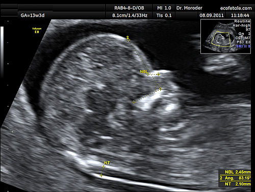

# RASTREAMENTO E DIAGNÓSTICO PRÉ-NATAL DE ANEUPLOIDIAS E MALFORMAÇÕES

Para entender o rastreamento pré-natal, você precisa primeiro separar dois conceitos na sua cabeça: rastrear não é diagnosticar. O rastreamento calcula um risco, enquanto o diagnóstico nos dá uma certeza (ou o mais próximo dela que a medicina permite). Nas provas de residência, as bancas adoram confundir o aluno justamente nessa transição: quando eu apenas observo e quando eu preciso invadir?

*Figura 1 - Medida ultrassonográfica da translucência nucal (TN) fetal com 13 semanas de gestação, incluindo ângulo facial e osso nasal, certificada pela Fetal Medicine Foundation. Fonte: Wolfgang Moroder, CC BY-SA 3.0 | Wikimedia Commons*

## A Lógica do Rastreamento no Primeiro Trimestre

O período de ouro para o rastreamento de aneuploidias, especialmente a Trissomia do 21 (Síndrome de Down), ocorre entre 11 semanas e 13 semanas e 6 dias. Por que esse intervalo tão rígido? Porque é nesse momento que o comprimento cabeça-nádega (CCN) do feto está entre 45 mm e 84 mm, permitindo a visualização adequada de marcadores que desaparecem ou mudam depois.

O rastreamento combinado de primeiro trimestre é o padrão-ouro inicial. Ele une três pilares: a idade materna, os marcadores ultrassonográficos e os marcadores bioquímicos.

### Marcadores Ultrassonográficos do Primeiro Trimestre

O marcador mais famoso é a Translucência Nucal (TN). Ela é o acúmulo de fluido na região cervical posterior do feto. O valor de referência clássico é 2,5 mm, mas o ideal é usar tabelas de percentis para o CCN. Se a TN está aumentada (acima do percentil 95 ou > 3,0 a 3,5 mm), o risco para cromossomopatias sobe drasticamente.

Mas atenção: TN aumentada não é sinônimo exclusivo de Down. Pode indicar outras trissomias (13 e 18), Síndrome de Turner (frequentemente associada ao higroma cístico, que é uma TN muito septada e volumosa) e, muito importante para provas, cardiopatias congênitas. Se a TN está alterada e o cariótipo é normal, o próximo passo obrigatório é um ecocardiograma fetal.

Além da TN, avaliamos o Osso Nasal. A ausência ou hipoplasia do osso nasal no primeiro trimestre é um marcador fortíssimo para Trissomia 21. Cuidado com a pegadinha: o osso nasal não é um marcador isolado para diagnóstico, ele apenas recalcula o risco.

O terceiro marcador essencial é o Ducto Venoso. Avaliamos a onda "a", que corresponde à contração atrial fetal. Se a onda "a" estiver ausente ou reversa, isso indica um risco aumentado de aneuploidias e, principalmente, de falência cardíaca fetal ou cardiopatias. Em um feto normal, a onda "a" deve ser sempre anterógrada (positiva).

*Figura 2 - Cariótipo da Síndrome de Down (Trissomia 21): presença de três cópias do cromossomo 21, a aneuploidia mais comum detectada no rastreamento pré-natal. Fonte: National Human Genome Research Institute, Domínio Público | Wikimedia Commons*

## Marcadores Bioquímicos

Muitos alunos esquecem da bioquímica, mas ela cai muito. No primeiro trimestre, dosamos duas substâncias no sangue materno:

- PAPP-A (Proteína plasmática A associada à gravidez): Nas trissomias (21, 18 e 13), ela geralmente está baixa.

- Beta-hCG livre: Na Trissomia 21, ele está elevado. Nas Trissomias 18 e 13, ele está baixo.

Memorize este padrão para a Trissomia 21: PAPP-A baixa + Beta-hCG livre alto. Se a prova trouxer ambos baixos, pense em Trissomia 18 ou 13.

## O Teste Pré-Natal Não Invasivo (NIPT)

O NIPT revolucionou a obstetrícia, mas gera muita confusão em provas. Ele analisa o cfDNA (DNA livre fetal) que circula no sangue materno, vindo do trofoblasto.

O NIPT pode ser feito a partir de 10 semanas. Ele tem uma sensibilidade altíssima para Trissomia 21 (superior a 99%), mas continua sendo um teste de rastreamento. Por que? Porque se o resultado vier "alto risco", você ainda precisa confirmar com um exame invasivo antes de qualquer conduta definitiva.

Quando indicar o NIPT? Segundo a FEBRASGO, ele pode ser oferecido para todas as gestantes, mas o custo ainda é um limitador. Na prova, ele aparece como uma excelente opção para gestantes de risco intermediário ou para aquelas que desejam evitar procedimentos invasivos inicialmente. Lembre-se: o NIPT não substitui o ultrassom de primeiro trimestre, pois o ultrassom vê morfologia (como a anencefalia ou onfalocele), o que o NIPT não faz.

## Diagnóstico Invasivo: Quando e Como?

Se o rastreamento (seja pelo combinado ou pelo NIPT) vier de alto risco, passamos para o diagnóstico de certeza através do cariótipo fetal. Aqui, você precisa saber o tempo de cada exame e os riscos envolvidos.

### Biópsia de Vilo Corial (BVC)

É realizada entre 10 e 13 semanas e 6 dias. A grande vantagem é a precocidade. O médico retira uma amostra da placenta. O risco de perda gestacional é levemente superior ao da amniocentese (cerca de 0,5 a 1%).

### Amniocentese

Realizada a partir de 15 a 16 semanas. Coleta-se líquido amniótico. É o procedimento mais comum e seguro para diagnóstico citogenético. Antes de 15 semanas, não deve ser feita pelo risco de pé torto congênito e perda de líquido.

### Cordocentesis

Coleta de sangue fetal pelo cordão umbilical. Geralmente feita após 20 semanas. Hoje é menos usada para cariótipo (já que a amniocentese resolve), sendo mais reservada para casos de anemia fetal grave ou quando precisamos de um resultado de curtíssimo prazo.

| Procedimento | Época Ideal | Material Coletado | Principal Vantagem |
| --- | --- | --- | --- |
| Biópsia de Vilo Corial | 10 a 13+6 semanas | Tecido Placentário | Diagnóstico precoce |
| Amniocentese | > 15-16 semanas | Líquido Amniótico | Menor risco de perda |
| Cordocentese | > 20 semanas | Sangue Fetal | Avaliação de anemia/infecção |

## Rastreamento no Segundo Trimestre e Marcadores Morfológicos

O ultrassom morfológico do segundo trimestre (18 a 24 semanas) é o momento de olhar a "planta da casa" detalhadamente. Aqui, buscamos malformações maiores e marcadores menores (soft markers).

Um erro comum é confundir marcadores de primeiro com os de segundo trimestre. Por exemplo, o "Golf Ball" (foco ecogênico no coração) e o cisto do plexo coroide são marcadores de segundo trimestre. Isoladamente, em uma paciente de baixo risco, eles têm pouco valor, mas as bancas citam para te assustar.

### Sinais Clássicos de Malformação do SNC

Existem dois sinais que você deve tatuar no cérebro para a prova de residência, pois indicam o diagnóstico de Malformação de Arnold-Chiari II (associada à espinha bífida/mielomeningocele):

- Sinal do Limão: O formato do crânio nas regiões frontais fica indentado.

- Sinal da Banana: O cerebelo perde seu formato habitual e se curva ao redor do tronco cerebral devido à tração caudal da medula.

Se aparecer "sinal do limão" ou "sinal da banana", a resposta quase sempre envolverá defeitos do tubo neural.

## Avaliação da Vitalidade e Dopplerfluxometria

O Doppler não é apenas para ver o sangue passar, ele conta a história da adaptação fetal ao ambiente uterino. Como o Dr. Will sempre reforça em suas discussões no MedEvo, o Doppler deve ser interpretado como uma hierarquia de vasos.

### Artérias Uterinas

Avaliam o lado materno. Elas refletem a invasão trofoblástica. Se houver alta resistência ou persistência da incisura protodiastólica após 24-26 semanas, temos um risco aumentado de Pré-eclâmpsia e Restrição de Crescimento Intrauterino (CIUR). É o marcador de predição, não de sofrimento agudo.

### Artéria Umbilical

Avalia a placenta. É o vaso que leva sangue do feto para a placenta. O normal é ter baixa resistência (muito sangue passando na diástole). Quando a placenta adoece (insuficiência placentária), a resistência sobe.

- Diástole Zero: Situação grave. Mais de 70% do território placentário está comprometido.

- Diástole Reversa: Situação crítica. Risco iminente de morte fetal. Indica necessidade de interrupção, dependendo da viabilidade.

### Artéria Cerebral Média (ACM)

Avalia o feto. O feto é inteligente: se falta oxigênio vindo da placenta (umbilical ruim), ele abre os vasos do cérebro para garantir que o órgão nobre receba sangue. Isso se chama Centralização Fetal.
No Doppler, vemos isso como uma queda da resistência na ACM.

Mas cuidado! A ACM tem outra função vital em provas: o Pico de Velocidade Sistólica (PSV). Se o PSV da ACM estiver aumentado (acima de 1,5 MoM), isso é o diagnóstico não invasivo de Anemia Fetal. Por que a velocidade aumenta? Porque o sangue anêmico é menos viscoso (mais "fino") e o coração bate mais rápido para compensar a falta de hemoglobina. Isso é essencial no manejo da Doença Hemolítica Perinatal (DHRN).

### Ducto Venoso

É o último baluarte. Quando o ducto venoso altera (onda "a" reversa), significa que o coração fetal não está mais aguentando a pressão e está entrando em acidose/falência. É o marcador que frequentemente decide o momento do parto no feto prematuro grave.

| Vaso Doppler | O que avalia | Alteração Típica | Significado Clínico |
| --- | --- | --- | --- |
| Artéria Uterina | Lado Materno | Incisura / Alta Resistência | Risco de Pré-eclâmpsia / CIUR |
| Artéria Umbilical | Placenta | Diástole Zero ou Reversa | Insuficiência Placentária Grave |
| Artéria Cerebral Média | Feto (Cérebro) | Baixa Resistência (Centralização) | Hipóxia Fetal |
| ACM (Pico Sistólico) | Sangue Fetal | Velocidade Aumentada (>1,5 MoM) | Anemia Fetal |
| Ducto Venoso | Coração Fetal | Onda "a" Reversa | Acidose / Risco de Óbito Iminente |

## Doença Hemolítica Perinatal (DHRN) e Isoimunização

Este tema é um prato cheio para questões de conduta. A sequência lógica é:

- Tipagem Sanguínea e Coombs Indireto (CI) na primeira consulta.

- Se CI negativo: Repetir com 28, 32, 36 e 40 semanas.

- Se CI positivo: Quantificar o título.

- Títulos baixos (< 1:8 ou < 1:16, dependendo do serviço): Apenas seguimento mensal.

- Títulos altos (≥ 1:16): Iniciar avaliação de anemia fetal com Doppler de ACM (Pico Sistólico).

Se o Doppler da ACM mostrar VSM > 1,5 MoM, a conduta é invasiva: Cordocentese para avaliar o hematócrito fetal e, se necessário, Transfusão Intrauterina (TIU).

Não esqueça da profilaxia com Imunoglobulina Anti-D! Ela deve ser feita:

- Com 28 semanas para todas as gestantes Rh negativo com CI negativo.

- Após qualquer evento hemorrágico ou procedimento invasivo (BVC, amniocentese).

- Após o parto, se o RN for Rh positivo (fazer em até 72 horas).

O Teste de Kleihauer-Betke é usado para quantificar a hemorragia feto-materna e ajustar a dose da imunoglobulina, caso suspeite-se de uma hemorragia maior que o padrão.

## Malformações Específicas e Achados de Prova

### Cardiopatias Congênitas

O rastreamento começa no pré-natal com o corte de quatro câmaras e saída de grandes vasos no USG morfológico. No entanto, o "Teste do Coraçãozinho" (Oximetria de Pulso) é o rastreio neonatal obrigatório.

- Como fazer: Entre 24-48h de vida, no membro superior direito (pré-ductal) e em um dos membros inferiores (pós-ductal).

- Alterado: Saturação < 95% ou diferença ≥ 3% entre os membros.

- Conduta se alterado: Repetir em 1 hora. Se persistir alterado, realizar Ecocardiograma antes da alta.

### Defeitos de Parede Abdominal

Diferença crucial entre Gastrosquise e Onfalocele:

- Gastrosquise: À direita do cordão, sem membrana cobrindo as alças. As alças ficam "soltas" no líquido amniótico (o que causa inflamação). Não costuma estar associada a síndromes genéticas.

- Onfalocele: No centro (pelo cordão), coberta por membrana (peritônio e amnio). Frequentemente associada a trissomias (13 e 18).

### Maturidade Pulmonar Fetal

Embora hoje usemos mais a idade gestacional e o corticoide antenatal, as provas ainda cobram a análise do líquido amniótico:

- Relação Lecitina/Esfingomielina (L/E): Se > 2, indica maturidade.

- Fosfatidilglicerol: Se presente, indica maturidade (é o marcador mais tardio e confiável).

- Teste de Clements: Avalia a estabilidade das bolhas de ar no líquido (positivo = maduro).

## Infecções Congênitas e Malformações

As infecções podem mimetizar malformações genéticas.

- Toxoplasmose: Tríade de Sabin (Hidrocefalia, Calcificações intracranianas difusas e Coriorretinite).

- Citomegalovírus (CMV): Calcificações periventriculares e microcefalia. É a infecção congênita mais comum.

- Rubéola: Catarata, cardiopatia (persistência do ducto arterioso) e surdez.

## Pontos-Chave para Prova

- O intervalo para o USG de primeiro trimestre (TN, Osso Nasal, Ducto Venoso) é de 11 semanas a 13 semanas e 6 dias (CCN 45-84 mm).

- TN aumentada (> 3,5 mm) com cariótipo normal exige Ecocardiograma Fetal para afastar cardiopatias.

- O padrão bioquímico da Trissomia 21 no 1º trimestre é PAPP-A baixa e Beta-hCG livre alto.

- NIPT é rastreamento de alta performance, mas nunca é diagnóstico definitivo. Resultados positivos exigem confirmação invasiva.

- Biópsia de Vilo Corial (BVC) pode ser feita a partir de 10 semanas; Amniocentese apenas após 15-16 semanas.

- Centralização Fetal no Doppler: Vasodilatação da ACM (queda da resistência) em resposta à hipóxia.

- Pico de Velocidade Sistólica (PSV) da ACM > 1,5 MoM é o marcador de escolha para Anemia Fetal.

- Sinal do Limão e Sinal da Banana no USG de 2º trimestre indicam Malformação de Arnold-Chiari II (espinha bífida).

- Onda "a" reversa no Ducto Venoso indica acidose fetal e falência cardíaca iminente.

- Gastrosquise não tem membrana protetora; Onfalocele tem membrana e alta associação com aneuploidias.

- Teste do Coraçãozinho alterado (Sat < 95% ou diferença ≥ 3%) exige repetição em 1h e, se mantido, Ecocardiograma.

- Profilaxia de Isoimunização Rh: Imunoglobulina Anti-D para mãe Rh negativa, CI negativo, se RN Rh positivo ou após eventos de sangramento/procedimentos.

- Erro comum: Achar que Doppler de Artéria Uterina avalia sofrimento fetal agudo. Ele avalia risco de pré-eclâmpsia e CIUR (território materno).

- Pegadinha: O "Golf Ball" (foco ecogênico cardíaco) é um marcador menor de 2º trimestre e não deve gerar pânico se for um achado isolado em baixo risco. 🧠

 Cópia offline para consulta pessoal.
 Fonte original:
 [https://www.medevo.com.br/material-apoio/ler/ea637908-b3f3-439b-bf71-2da5c5f77685](https://www.medevo.com.br/material-apoio/ler/ea637908-b3f3-439b-bf71-2da5c5f77685)
