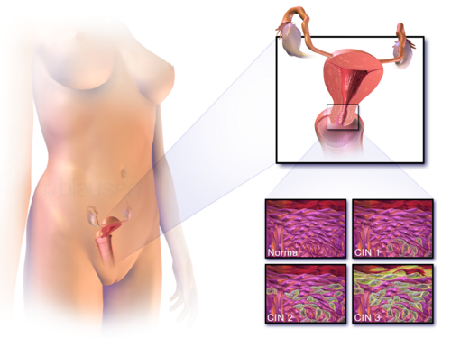

# RASTREAMENTO E PREVENÇÃO DE CÂNCER

Para entender rastreamento e prevenção, você precisa primeiro mudar sua mentalidade de "médico de pronto-socorro" para "médico de saúde populacional". No pronto-socorro, buscamos o diagnóstico para tratar uma doença instalada. No rastreamento, buscamos uma doença que não deu sinais, em alguém que se sente perfeitamente bem.

Por que isso é difícil? Porque, ao intervir em pessoas saudáveis, o nosso risco de causar dano (iatrogenia) é altíssimo. É aqui que entra o conceito de **Prevenção Quaternária**: a arte de evitar o excesso de intervenções médicas desnecessárias. Guarde esse termo, pois as bancas adoram cobrar a prevenção quaternária no contexto do rastreamento de câncer de próstata e de tireoide.

*Figura 1 - Diagrama ilustrando procedimento de colonoscopia para rastreamento de câncer colorretal, um dos cânceres mais rastreáveis na prática clínica. Fonte: Cancer Research UK, CC BY-SA 4.0 | Wikimedia Commons*

## Níveis de Prevenção: Onde o Câncer se Encaixa

Antes de mergulharmos nos órgãos específicos, vamos alinhar os conceitos. A prova vai tentar confundir Prevenção Primária com Secundária.

- **Prevenção Primária:** Você age ANTES da doença existir. O objetivo é remover o fator causal.

- Exemplos: Vacinação contra HPV (previne CA de colo de útero), cessação do tabagismo, uso de Celecoxibe ou AAS para reduzir o risco de Câncer Colorretal (CCR) em grupos de altíssimo risco (quimioprevenção).

- **Prevenção Secundária:** A doença já existe (fase pré-clínica), mas o paciente é assintomático. O objetivo é o **Rastreamento (Screening)** para diagnóstico precoce e aumento da chance de cura.

- Exemplos: Mamografia, Colonoscopia, PSA, Citopatológico de colo uterino.

- **Prevenção Terciária:** A doença já é sintomática. O objetivo é reduzir complicações e reabilitar.

- **Prevenção Quaternária:** Evitar o sobrediagnóstico (overdiagnosis) e o sobretratamento (overtreatment).

**Dica de Prova:** O rastreamento só faz sentido se a doença tiver uma fase pré-clínica longa, se o teste for sensível e se o tratamento precoce for comprovadamente melhor que o tratamento na fase sintomática. Se o câncer cresce rápido demais (como alguns tumores de pâncreas), o rastreamento não funciona porque, entre um exame e outro, a doença já avançou.

*Figura 2 - Representação da displasia cervical (NIC), exemplo clássico de prevenção secundária através do rastreamento com Papanicolaou. Fonte: Blausen Medical Communications, CC BY 3.0 | Wikimedia Commons*

## Câncer Colorretal (CCR): O Queridinho das Provas

O CCR é um dos temas mais previsíveis em provas de residência porque as condutas são muito bem sedimentadas. Aqui, a fisiopatologia dita a regra: a famosa **sequência adenoma-carcinoma**.

### Fisiopatologia e Genética

A maioria dos tumores colorretais nasce de um pólipo adenomatoso. Esse processo leva, em média, 10 anos. É por isso que o intervalo da colonoscopia em pacientes de risco médio é de 10 anos.

- **Evento Inicial:** Mutação no gene **APC** (5q21). É o "freio" da célula que quebra. Isso leva à formação de criptas aberrantes e pólipos.

- **Evento Tardio:** Perda do gene supressor de tumor **p53** (17p). Isso marca a progressão do adenoma para o carcinoma invasivo.

**Atenção ao Risco do Pólipo:** Nem todo pólipo vira câncer. O risco aumenta se:

- Tamanho > 2 cm.

- Histologia Vilosa (o "vilão" é o viloso).

- Displasia de alto grau.

### Estratégias de Rastreamento (Risco Médio)

Para aquele paciente de 50 anos (ou 45 anos, dependendo da diretriz mais recente, mas o Ministério da Saúde ainda foca nos 50), sem história familiar, as opções são:

- **Colonoscopia (Padrão-ouro):** A cada 10 anos. Vantagem: Diagnóstica e terapêutica (polipectomia).

- **Pesquisa de Sangue Oculto nas Fezes (FIT - Imunoquímico):** Anual. Se positivo, OBRIGATORIAMENTE requer colonoscopia.

- **Retossigmoidoscopia:** A cada 5 anos.

**Exemplo Clínico:** Homem de 52 anos, assintomático, sem histórico familiar. Qual a prioridade? Rastreamento de CCR. Se ele fizer uma colonoscopia e encontrar um adenoma tubular único < 10mm com displasia de baixo grau, o seguimento é em 5 anos. Se a colonoscopia for normal, 10 anos.

### O Grupo de Alto Risco (História Familiar e Síndromes)

Aqui é onde os alunos mais erram. Decore estas regras:

- **Parente de 1º grau com CCR <60 anos (ou dois de 1º grau):** Início aos 40 anos ou 10 anos antes do caso mais jovem; colonoscopia a cada 5 anos.

- **Parente de 1º grau com CCR >60 anos:** Início aos 40 anos; colonoscopia a cada 10 anos.

- **Polipose Adenomatosa Familiar (PAF):** Mutação no gene APC. Milhares de pólipos. Risco de câncer é de 100%. Conduta: Proctocolectomia total profilática com bolsa ileal assim que atingir a idade adulta.

- **Síndrome de Lynch (HNPCC):** Poucos pólipos, mas que malignizam rápido (instabilidade de microssatélites - genes de reparo de DNA como MSH2, MLH1). Rastreamento com colonoscopia aos 20-25 anos, a cada 1-2 anos. Associado a câncer de endométrio e ovário.

### Quadro Clínico: Direita vs. Esquerda

As bancas amam cobrar a localização:

- **Cólon Direito (Ceco e Ascendente):** O lúmen é largo, as fezes são líquidas. O tumor cresce muito antes de obstruir. Sintoma clássico: **Anemia ferropriva e massa palpável** (sangramento oculto).

- **Cólon Esquerdo (Descendente e Sigmoide):** O lúmen é estreito, as fezes são sólidas. Sintoma clássico: **Alteração do hábito intestinal e obstrução precoce**.

- **Reto:** Hematoquezia (sangue vivo), tenesmo e muco.

| Característica | Cólon Direito | Cólon Esquerdo / Reto |
| --- | --- | --- |
| **Sintoma Principal** | Anemia / Fadiga | Alteração do hábito / Obstrução |
| **Sangue** | Oculto | Visível (Hematoquezia) |
| **Massa** | Palpável no flanco/fossa ilíaca D | Raro palpar (exceto toque retal) |
| **Prognóstico** | Frequentemente diagnóstico tardio | Diagnóstico mais precoce pelos sintomas |

## Câncer de Próstata: O Terreno da Incerteza

Se no CCR a regra é clara, na próstata o lema é **Decisão Compartilhada**. O câncer de próstata é o segundo mais comum em homens (atrás apenas do câncer de pele não melanoma).

### O Dilema do PSA

O PSA (Antígeno Prostático Específico) é órgão-específico, mas NÃO é câncer-específico.
**O que eleva o PSA além do câncer?**

- Hiperplasia Prostática Benigna (HPB).

- Prostatite (infecção).

- Trauma (ciclismo, sondagem).

- Ejaculação recente.

- Toque retal (elevação discreta, mas na prova, se perguntarem se a postectomia altera, a resposta é NÃO).

**Dica do MedEvo:** O principal objetivo do toque retal não é medir o tamanho da próstata (isso o USG faz melhor), mas sim identificar **nódulos suspeitos** (endurecidos, pétreos).

### Rastreamento: Quando e Para Quem?

Não existe consenso universal. O Ministério da Saúde e a USPSTF não recomendam o rastreamento populacional generalizado. A Sociedade Brasileira de Urologia (SBU) sugere:

- **Início aos 50 anos:** População geral.

- **Início aos 45 anos:** Negros ou homens com parente de 1º grau com CA de próstata (alto risco).

- **Interrupção:** Expectativa de vida < 10-15 anos (geralmente em torno dos 75 anos).

**Por que não rastrear todo mundo?** Pelo risco de **Sobrediagnóstico**. Muitos homens morrem *com* câncer de próstata, mas não *de* câncer de próstata. Tratar um tumor de crescimento lentíssimo (Gleason 3+3) em um idoso de 80 anos causa impotência e incontinência sem aumentar sua sobrevida. Isso é o que chamamos de iatrogenia.

### Conduta no Câncer Localizado

Se o diagnóstico for feito (Biópsia transretal guiada por USG), e o tumor for de **Baixo Risco** (PSA < 10, Gleason 6 [3+3], T1c ou T2a):

- **Vigilância Ativa:** É a melhor conduta para muitos idosos. Não é "não fazer nada". É acompanhar de perto com PSA e toque frequentes e só intervir se houver progressão.

## Câncer de Mama: Onde as Diretrizes se Enfrentam

Este é o ponto de maior confusão nas provas, pois existem duas "verdades" dependendo da fonte citada.

-

**Ministério da Saúde / INCA:**

- Idade: 50 a 74 anos (Nota Técnica nº 626/2025-MS).

- Periodicidade: Bienal (a cada 2 anos).

- Método: Mamografia.

-

**Sociedade Brasileira de Mastologia (SBM) / FEBRASGO:**

- Idade: 40 a 74 anos.

- Periodicidade: Anual.

**Como responder na prova?** Olhe o enunciado. Se falar "Segundo o Ministério da Saúde...", use a regra dos **50-74 anos** (Nota Técnica nº 626/2025-MS). Se for um caso clínico de consultório privado, a tendência é seguir a SBM/CBR/FEBRASGO (40-74 anos, anual).

### BI-RADS: A Linguagem Universal

Você precisa saber o que fazer com o resultado:

- **BI-RADS 0:** Inconclusivo. Conduta: Exame adicional (USG, compressão, magnificação).

- **BI-RADS 1 e 2:** Normal/Benigno. Conduta: Seguimento de rotina.

- **BI-RADS 3:** Provavelmente benigno (risco < 2%). Conduta: Controle em 6 meses.

- **BI-RADS 4 e 5:** Suspeito/Altamente suspeito. Conduta: **Biópsia** (Core biopsy ou Mammotomy).

**Pegadinha de Prova:** O USG de mama NÃO substitui a mamografia no rastreamento. Ele é um excelente auxiliar para diferenciar cisto de massa sólida ou para avaliar mamas densas em pacientes jovens.

## Câncer de Pulmão: O Novo Rastreamento

Antigamente, dizíamos que não se rastreava pulmão. Isso mudou.
**Quem rastrear?**

- Tabagistas pesados (carga tabágica ≥ 20-30 maços-ano).

- Idade entre 50 e 80 anos.

- Fumantes ativos ou que pararam há menos de 15 anos.
**Qual o exame?** Tomografia de Tórax de Baixa Dosagem (anual). Raio-X de tórax NÃO serve para rastreamento.

## Outros Tumores e Pérolas de Prevenção

### Câncer de Endométrio

Não se faz rastreamento em assintomáticas. Porém, qualquer **sangramento na pós-menopausa** é câncer de endométrio até que se prove o contrário.

- **Investigação inicial:** USG Transvaginal.

- **Espessura endometrial suspeita:** > 4-5 mm (sem TH) ou > 8 mm (com TH). Se espessado, o próximo passo é a biópsia (Histeroscopia com biópsia é o padrão-ouro).

### Câncer de Ovário

Infelizmente, não temos um bom teste de rastreamento. O marcador **CA-125** é péssimo para rastreio porque eleva em qualquer inflamação peritoneal (endometriose, DIP, mioma). Ele serve para **acompanhamento** pós-tratamento.

### Câncer Gástrico

No Brasil, não fazemos rastreamento populacional com EDA. A prevenção primária foca na erradicação do *H. pylori* em grupos de risco e na redução do consumo de alimentos defumados e conservados no sal.

### Câncer de Colo de Útero

- **Início:** 25 anos (para quem já iniciou vida sexual).

- **Frequência:** Anual. Após 2 exames normais, a cada 3 anos.

- **Término:** 64 anos (se exames anteriores normais).

## Tabelas Comparativas para Fixação

### Tabela 1: Rastreamento de Câncer Colorretal por Categoria de Risco

| Categoria de Risco | Quando Iniciar | Periodicidade | Exame de Escolha |
| --- | --- | --- | --- |
| **Risco Médio** | 50 anos (MS) | 10 em 10 anos | Colonoscopia |
| **1 Parente 1º grau < 60a** | 40 anos ou 10a antes do caso | 1-2 em 1-2 anos | Colonoscopia |
| **Síndrome de Lynch** | 20-25 anos | 1-2 em 1-2 anos | Colonoscopia |
| **PAF** | 10-12 anos | Anual | Retossigmoidoscopia |

### Tabela 2: Fatores que Alteram o PSA

| Aumentam o PSA | NÃO Alteram o PSA |
| --- | --- |
| Prostatite / Infecção Urinária | Postectomia (Circuncisão) |
| Hiperplasia Prostática Benigna (HPB) | Toque retal (elevação clínica irrelevante) |
| Ejaculação (nas últimas 48h) | Atividade física leve |
| Biópsia de próstata (esperar 6 semanas) | Uso de AAS ou AINEs |
| Retenção urinária aguda | |

### Tabela 3: Marcadores Tumorais e sua Utilidade Real

| Marcador | Tumor Principal | Utilidade Principal |
| --- | --- | --- |
| **CEA** | Colorretal | Acompanhamento de recidiva (NÃO serve para rastreio) |
| **PSA** | Próstata | Rastreamento e Seguimento |
| **CA-125** | Ovário | Seguimento (NÃO serve para rastreio) |
| **AFP** | Carcinoma Hepatocelular | Rastreio em Cirróticos (junto com USG) |

## Situações Especiais e Comorbidades

Um erro clássico que o Dr. Will sempre aponta nas discussões de caso é ignorar a **expectativa de vida** do paciente.
Imagine uma paciente de 82 anos, com Insuficiência Cardíaca grave (NYHA IV) e Doença Renal Crônica dialítica. Faz sentido solicitar uma mamografia de rastreamento? **Não.**
O rastreamento deve ser descontinuado quando as comorbidades graves limitam a sobrevida a menos de 10 anos, pois o paciente morrerá da doença de base antes de se beneficiar de qualquer diagnóstico oncológico precoce. Isso é medicina baseada em evidências e bom senso clínico.

## Epidemiologia e Fatores de Risco Gerais

- **Obesidade:** É fator de risco para quase todos os cânceres (mama pós-menopausa, cólon, endométrio, rim, pâncreas). A gordura visceral gera um estado inflamatório crônico e hiperinsulinemia, que são pró-carcinogênicos.

- **Tabagismo:** Responsável por 90% dos casos de câncer de pulmão, mas também aumenta o risco de bexiga, rim, cabeça e pescoço, e pâncreas.

- **Álcool:** Risco aumentado para mama, esôfago e fígado.

- **Atividade Física:** 150 minutos de atividade moderada por semana é a recomendação padrão para redução de risco oncológico.

## Pontos-Chave para Prova

- **CCR Esporádico:** O fator prognóstico mais importante é o **número de linfonodos acometidos** na peça cirúrgica.

- **Sequência Adenoma-Carcinoma:** APC (inicial) → KRAS (intermediário) → p53 (tardio).

- **Síndrome de Lynch:** Critérios de Amsterdam (3 familiares, 2 gerações, 1 caso < 50 anos).

- **PSA e Toque:** O rastreio deve ser uma decisão compartilhada. PSA > 4,0 ng/ml ou toque alterado indicam biópsia.

- **Densidade do PSA (PSAD):** PSA dividido pelo volume da próstata. Valores > 0,15 sugerem câncer em vez de HPB.

- **BI-RADS 3:** Não biopsia de cara! Repete em 6 meses.

- **BI-RADS 0:** Não é normal! É exame incompleto. Precisa de mais imagem.

- **Câncer de Pulmão:** Rastreio com TC de baixa dosagem, não RX.

- **Prevenção Quaternária:** O conceito-chave para evitar o rastreamento excessivo em idosos frágeis.

- **Aspirina (AAS):** Pode ser usada para quimioprevenção de CCR em pacientes com risco cardiovascular elevado e idade entre 50-59 anos (segundo a USPSTF).

- **H. pylori:** Sua erradicação é prevenção primária para câncer gástrico e linfoma MALT.

- **Sangramento Pós-Menopausa:** Conduta inicial é USG Transvaginal para medir o endométrio.

- **Pólipos:** Vilão = Viloso. O tubular é o mais comum e de menor risco.

- **Linfonodos no CCR:** Devem ser ressecados no mínimo 12 linfonodos para um estadiamento adequado.

- **Vigilância Ativa:** Opção preferencial para câncer de próstata de baixo risco (Gleason 6).

 Cópia offline para consulta pessoal.
 Fonte original:
 [https://www.medevo.com.br/material-apoio/ler/9519fd94-1d65-42b1-87e4-e7ac088a7c06](https://www.medevo.com.br/material-apoio/ler/9519fd94-1d65-42b1-87e4-e7ac088a7c06)
