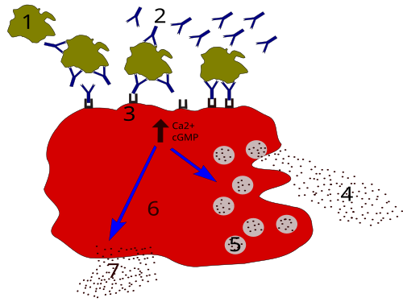
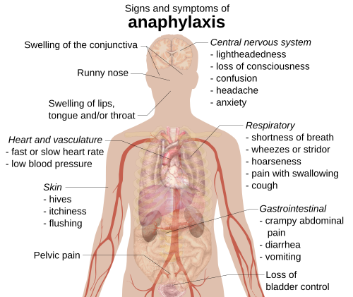

# REAÇÕES DE HIPERSENSIBILIDADE

Para entender as reações de hipersensibilidade, você precisa primeiro tirar da cabeça a ideia de que o sistema imune é sempre o "mocinho". Às vezes, ele é um herói exagerado que, para matar uma formiga, explode o prédio inteiro. Hipersensibilidade é exatamente isso: uma resposta imune excessiva ou inadequada a um antígeno (alérgeno) que resulta em dano tecidual ao hospedeiro.

A classificação clássica de Gell e Coombs divide essas reações em quatro tipos (I a IV). Se você dominar essa divisão, já resolve 60% das questões de prova. Mas o examinador moderno quer mais: ele quer que você saiba diferenciar uma alergia alimentar IgE-mediada de uma proctocolite alérgica, ou que saiba manejar uma anafilaxia no meio do plantão.

*Figura 1 - Processo de degranulação de mastócitos na hipersensibilidade tipo I: 1-antígeno, 2-IgE, 3-receptor FcεRI, 4-mediadores pré-formados (histamina, proteases), 5-grânulos, 6-mastócito, 7-mediadores neoformados (prostaglandinas, leucotrienos). Fonte: Paweł Kuźniar, CC BY-SA 3.0 | Wikimedia Commons*

## A Classificação de Gell e Coombs: O Mapa da Mina

Antes de mergulharmos em cada uma, veja esta tabela comparativa. Ela é o seu resumo mental para consultas rápidas.

| Tipo | Nome | Mediador Principal | Tempo de Reação | Exemplos Clínicos |
| --- | --- | --- | --- | --- |
| **I** | Imediata | IgE e Mastócitos | Minutos a horas | Anafilaxia, Asma, Rinite, Urticária |
| **II** | Citotóxica | IgG / IgM + Complemento | Horas a dias | Hemólise, Miastenia Gravis, Febre Reumática |
| **III** | Imunocomplexos | Complexos Ag-Ac | 3 a 10 dias | Doença do Soro, Reação de Arthus, LES |
| **IV** | Tardia (Celular) | Linfócitos T / Macrófagos | 48 a 72 horas | Dermatite de Contato, DRESS, SSJ/NET, PPD |

*Figura 2 - Sinais e sintomas da anafilaxia (hipersensibilidade tipo I grave), afetando múltiplos sistemas: respiratório, cardiovascular, cutâneo, gastrointestinal e neurológico. Fonte: Mikael Häggström, CC0 | Wikimedia Commons*

## Hipersensibilidade Tipo I (Imediata)

Aqui o protagonista é a **IgE**. O processo começa com a **sensibilização**: o indivíduo entra em contato com o alérgeno (ex: pólen, proteína do leite), os linfócitos Th2 estimulam os linfócitos B a produzirem IgE específica. Essa IgE se liga aos receptores de alta afinidade nos **mastócitos** e **basófilos**.

Na segunda exposição, o alérgeno faz uma "ponte" entre duas IgEs no mastócito (cross-linking), causando a **desgranulação**.

### Mediadores e Fisiopatologia

A **histamina** é a estrela do show inicial, causando vasodilatação, aumento da permeabilidade vascular e prurido. Mas não esqueça dos mediadores secundários, como leucotrienos e prostaglandinas, que sustentam a inflamação.

**Dica de Prova:** As bancas adoram perguntar sobre a IL-4. Por que? Porque a IL-4 é a citocina chave para o "switch" de classe para IgE. Sem IL-4, não há hipersensibilidade tipo I. Já a IL-5 é quem chama os eosinófilos para a festa.

### Anafilaxia: A Emergência Máxima

A anafilaxia é a manifestação sistêmica mais grave do Tipo I. O diagnóstico é **clínico**. Não espere exames laboratoriais para tratar.

**Critérios Diagnósticos (Resumo ASBAI/WAO):**

- Início agudo (minutos a horas) com envolvimento de pele/mucosa **E** (comprometimento respiratório **OU** queda da PA/disfunção orgânica).

- Dois ou mais dos seguintes após exposição a provável alérgeno: envolvimento cutâneo, respiratório, queda de PA ou sintomas gastrointestinais persistentes (cólica, vômitos).

- Queda da PA após exposição a alérgeno conhecido para aquele paciente.

**Tratamento: Adrenalina (Epinefrina) Intramuscular.**

- **Dose:** 0,01 mg/kg (máximo de 0,5 mg em adultos e 0,3 mg em crianças).

- **Local:** Vasto lateral da coxa (músculo grande, altamente vascularizado, absorção mais rápida que no deltoide ou subcutâneo).

- **Por que não subcutânea?** Porque na anafilaxia há vasoconstrição periférica e a absorção SC é errática e lenta. No MedEvo, sempre reforçamos: em choque, o músculo é o caminho.

### Alergia à Proteína do Leite de Vaca (APLV)

Este é um tema quente em pediatria e clínica. Existem três formas:

- **IgE-mediada:** Urticária, angioedema, vômitos imediatos, anafilaxia. Diagnóstico por IgE específica ou Prick Test.

- **Não IgE-mediada:** Proctocolite alérgica (sangue nas fezes em lactente que está bem), enteropatia induzida por proteína alimentar. Aqui o mecanismo é celular (Tipo IV).

- **Mista:** Dermatite atópica, esofagite eosinofílica.

**Pérola Clínica:** Se um lactente em aleitamento materno exclusivo apresenta proctocolite (sangue vivo nas fezes), a conduta é a **dieta de exclusão de leite e derivados para a mãe**. Se ele usa fórmula, deve-se trocar por uma **fórmula extensamente hidrolisada**. Se não houver melhora ou se a reação for anafilática grave, usa-se a fórmula de aminoácidos.

**Cuidado:** Muitos confundem APLV com Intolerância à Lactose. A APLV é uma reação imune à **proteína** (caseína, beta-lactoglobulina). A intolerância é um problema enzimático (falta de lactase) para digerir o **açúcar** (lactose). Intolerância NÃO causa anafilaxia nem sangue nas fezes.

*Figura 2 - Sinais e sintomas da anafilaxia (hipersensibilidade tipo I grave), afetando múltiplos sistemas: respiratório, cardiovascular, cutâneo, gastrointestinal e neurológico. Fonte: Mikael Häggström, CC0 | Wikimedia Commons*

## Hipersensibilidade Tipo II (Citotóxica)

Aqui, o anticorpo (IgG ou IgM) se liga a um antígeno que está na **superfície de uma célula** ou na matriz extracelular. Essa ligação ativa o sistema complemento ou atrai células NK e macrófagos para destruir aquela célula específica.

### Exemplos Clássicos de Prova

- **Anemia Hemolítica Autoimune:** Anticorpos contra hemácias.

- **Miastenia Gravis:** Anticorpos contra o receptor de acetilcolina (Anti-AChR). Lembra da pérola? Fraqueza que piora ao fim do dia e melhora com edrofônio.

- **Febre Reumática:** O anticorpo contra o Estreptococo faz reação cruzada com tecidos cardíacos (mimetismo molecular).

- **Pênfigo Vulgar:** Anticorpos contra a **Desmogleína 1 e 3**. Isso causa **acantólise** (perda de adesão entre os queratinócitos) e formação de bolhas flácidas.

## Hipersensibilidade Tipo III (Imunocomplexos)

A diferença fundamental do Tipo II para o Tipo III é onde o antígeno está. No Tipo II, ele é fixo na célula. No Tipo III, o antígeno é **solúvel**.
O anticorpo se liga ao antígeno no sangue, formando o **imunocomplexo**. Esses complexos circulam e se depositam em endotélios (vasos), glomérulos e sinóvia, ativando o complemento e causando vasculite.

### Doença do Soro

Ocorre 7 a 10 dias após a exposição a uma proteína estranha (ex: soro antiofídico, alguns monoclonais ou mesmo antibióticos como amoxicilina).

- **Tríade clássica:** Febre + Urticária + Artralgia/Artrite.

- **Dica do Dr. Will:** Se o paciente tomou amoxicilina e 10 dias depois apareceu com urticária e dor nas juntas, não pense em alergia imediata (Tipo I). Pense em Reação tipo Doença do Soro (Tipo III).

### Reação de Arthus

É a forma localizada da hipersensibilidade tipo III. Ocorre, por exemplo, após reforços de vacinas (como a da difteria/tétano) em pessoas que já têm muitos anticorpos. Forma-se um edema doloroso e até necrose no local da aplicação devido à vasculite por imunocomplexos.

## Hipersensibilidade Tipo IV (Tardia ou Celular)

Esqueça os anticorpos. Aqui quem manda são os **Linfócitos T**. Como essas células precisam migrar até o local do antígeno e liberar citocinas para recrutar macrófagos, a reação demora de 48 a 72 horas para aparecer.

### Subtipos de Gell e Coombs (Classificação de Pichler)

As provas mais difíceis podem cobrar isso:

- **IVa:** Ativação de macrófagos (ex: PPD, dermatite de contato).

- **IVb:** Ativação de eosinófilos (ex: **DRESS**).

- **IVc:** Linfócitos T citotóxicos matando células diretamente (ex: **SSJ/NET**).

- **IVd:** Ativação de neutrófilos (ex: Pustulose Exantemática Generalizada Aguda - PEGA).

### Farmacodermias Graves: O Terror das Bancas

#### 1. DRESS (Drug Reaction with Eosinophilia and Systemic Symptoms)

É uma reação grave, geralmente 2 a 8 semanas após o início da droga (latência longa!).

- **Drogas comuns:** Alopurinol, Carbamazepina, Fenitoína, Sulfas.

- **Clínica:** Febre alta + Exantema morbiliforme + Linfadenomegalia + **Eosinofilia** + **Acometimento Orgânico** (o fígado é o mais afetado, com aumento de transaminases).

- **Tratamento:** Suspender a droga e usar Corticoides sistêmicos em doses altas (1 mg/kg/dia).

#### 2. Síndrome de Stevens-Johnson (SSJ) e Necrólise Epidérmica Tóxica (NET)

Aqui ocorre morte celular em massa dos queratinócitos (apoptose). A diferença entre as duas é a área de superfície corporal (ASC) descolada:

- **SSJ:** < 10% da ASC.

- **NET:** > 30% da ASC.

- **Sobreposição SSJ/NET:** 10-30%.

**Sinal de Nikolsky:** Presente. Você pressiona a pele sã e ela se descola.
**Manejo:** É igual a um grande queimado. Suporte volêmico, controle de temperatura e evitar infecção. O tratamento específico (Ciclosporina ou Imunoglobulina) ainda é debatido, mas a suspensão da droga causadora é mandatória e imediata.

| Característica | DRESS | SSJ / NET |
| --- | --- | --- |
| **Latência** | Longa (2-8 semanas) | Curta (1-3 semanas) |
| **Lesão de Pele** | Exantema, edema facial | Bolhas, descolamento epidérmico |
| **Mucosas** | Raramente afetadas | **Sempre** afetadas (oral, ocular, genital) |
| **Laboratório** | Eosinofilia, Linfócitos atípicos | Citopenias, aumento de ureia |
| **Mortalidade** | ~10% | Até 30-50% na NET |

## Situações Especiais e Diagnósticos Diferenciais

### Síndrome de Loeffler

Muitas vezes cobrada junto com hipersensibilidade. É uma reação de hipersensibilidade pulmonar à passagem de larvas de helmintos (*Ascaris, Ancilostomídeos, Strongyloides*).

- **Clínica:** Tosse seca, dispneia e **infiltrados pulmonares migratórios** no RX.

- **Laboratório:** Eosinofilia periférica importante.

### Alergia ao Contraste Iodado

Antigamente achava-se que era alergia ao iodo. Errado! É uma reação **anafilactoide** (ou pseudoalérgica). O contraste tem alta osmolaridade e desgranula o mastócito diretamente, sem precisar de IgE.

- **Conduta:** Se o paciente já teve reação, fazemos pré-medicação com corticoides e anti-histamínicos e usamos contraste de baixa osmolaridade.

### Reação de Jarisch-Herxheimer

Não é hipersensibilidade propriamente dita, mas cai como diferencial. Ocorre no tratamento da sífilis (especialmente secundária) com penicilina. A destruição em massa das espiroquetas libera antígenos que causam febre, calafrios e exacerbação do exantema. **Conduta:** Expectante (AINEs), não suspender o tratamento.

## Diagnóstico em Alergia: Ferramentas Práticas

Para reações IgE-mediadas (Tipo I), temos:

- **Prick Test (Teste de Puntura):** In vivo. Rápido, mas risco de anafilaxia (raro). Deve ser feito com o paciente fora de uso de anti-histamínicos por pelo menos 7 dias.

- **IgE Específica (RAST/ImmunoCAP):** In vitro. Útil se o paciente tem dermatite grave ou não pode parar o anti-histamínico.

- **Teste de Provocação Oral (TPO):** O **Padrão-Ouro** para alergia alimentar. Consiste em oferecer o alimento em doses crescentes sob supervisão médica.

- **Contraindicação Absoluta:** Reação anafilática grave e recente documentada. Não vamos arriscar a vida do paciente se o diagnóstico já está claro pela história.

Para reações tardias (Tipo IV):

- **Patch Test (Teste de Contato):** Coloca-se o antígeno em contato com a pele por 48-72h. Usado para Dermatite de Contato.

## Manejo Farmacológico: O que você deve prescrever

### 1. Anti-histamínicos

- **H1 de 1ª Geração (Hidroxizina, Difenidramina):** Atravessam barreira hematoencefálica. Causam muita sonolência. Úteis se o prurido impede o sono.

- **H1 de 2ª Geração (Cetirizina, Loratadina, Fexofenadina):** Preferenciais para uso diário (Rinite, Urticária). Menos efeitos no SNC.

### 2. Corticoides

- **Mecanismo:** Bloqueiam a fase tardia da inflamação, diminuindo a produção de citocinas.

- **Uso:** Crise de asma, DRESS, reações graves. Na anafilaxia, eles **não** salvam a vida no momento agudo (quem faz isso é a adrenalina), mas evitam a reação bifásica (aquela que volta horas depois).

### 3. Imunoterapia (Dessensibilização)

É o único tratamento que muda a história natural da doença Tipo I. Consiste em aplicar doses crescentes do alérgeno para "treinar" o sistema imune a produzir IgG4 (anticorpo bloqueador) em vez de IgE. Muito eficaz para veneno de insetos (abelha, vespa) e rinite.

## Pontos-Chave para Prova 🎯

- **Anafilaxia:** O tratamento é **Adrenalina IM** (0,01 mg/kg até 0,5 mg). Não perca tempo com corticoide ou nebulização antes da adrenalina.

- **DRESS:** Latência longa (2-8 semanas), eosinofilia e hepatite. Droga clássica: Alopurinol.

- **SSJ/NET:** Descolamento de epiderme e acometimento de mucosas. NET > 30% da superfície corporal.

- **APLV:** No lactente com proctocolite, a primeira conduta é dieta de exclusão para a mãe (se amamentação exclusiva).

- **Teste de Provocação Oral:** É o padrão-ouro para alergia alimentar, mas é **contraindicado** se houver história de anafilaxia grave prévia.

- **Síndrome de Loeffler:** Pense nela se vir "infiltrado pulmonar migratório" + "eosinofilia".

- **Angioedema por IECA:** Não é mediado por IgE, mas por acúmulo de **bradicinina**. Não adianta dar adrenalina ou corticoide com a mesma eficácia; o foco é suspender a droga.

- **Urticária Aguda:** Definida como duração < 6 semanas. A maioria é idiopática ou viral, não necessariamente alérgica.

- **Reação de Arthus:** Exemplo clássico de Hipersensibilidade Tipo III local.

- **Linfócito Th2:** É o orquestrador da resposta alérgica (produz IL-4, IL-5, IL-13).

- **Pênfigo Vulgar:** Hipersensibilidade Tipo II contra Desmogleína 1 e 3.

- **Mononucleose + Amoxicilina:** Causa exantema maculopapular que **não** é alergia verdadeira, mas uma reação imune específica à infecção viral.

- **Óxido de Etileno:** Causa comum de anafilaxia em pacientes dialisados (usado na esterilização de materiais).

- **Látex:** Pode fazer reação cruzada com frutas (banana, abacate, kiwi) - Síndrome Látex-Fruta.

- **Adrenalina em Crianças:** A dose máxima é geralmente 0,3 mg para evitar taquiarritmias graves.

- **Betabloqueadores:** Podem tornar a anafilaxia resistente ao tratamento com adrenalina. Nesses casos, o **Glucagon** pode ser necessário.

Lembre-se: em provas de residência, o examinador adora colocar uma questão de "reação alérgica à penicilina" que, na verdade, é uma Sífilis Secundária ou uma Mononucleose. Olhe sempre para o contexto sistêmico (febre, linfonodomegalia, tempo de evolução) antes de marcar "Hipersensibilidade Tipo I". O Dr. Will sempre diz: "A clínica soberana não é apenas um ditado, é o seu guia para não cair em pegadinhas".

 Cópia offline para consulta pessoal.
 Fonte original:
 [https://www.medevo.com.br/material-apoio/ler/816344f5-c234-4078-9de6-b4549efb2fff](https://www.medevo.com.br/material-apoio/ler/816344f5-c234-4078-9de6-b4549efb2fff)
