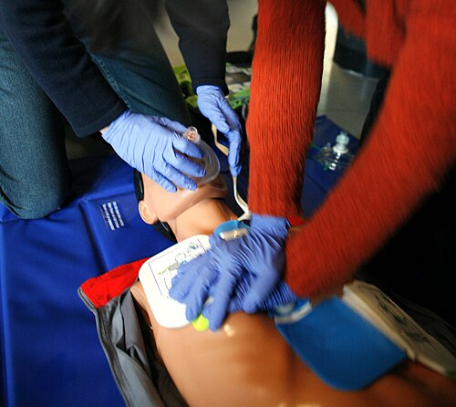

# REANIMAÇÃO CARDIOPULMONAR PEDIÁTRICA

Para entender a Reanimação Cardiopulmonar (RCP) em pediatria, você precisa esquecer um pouco o modelo mental do adulto. No adulto, o coração geralmente para por um evento súbito, uma arritmia primária como a Fibrilação Ventricular decorrente de um infarto. Na criança, o buraco é mais embaixo. A parada cardíaca pediátrica é, na esmagadora maioria das vezes, o desfecho final de uma falência respiratória ou de um choque circulatório que não foi revertido a tempo.

Por que isso importa para a sua prova e para a sua vida no plantão? Porque se a causa é hipóxia, o tratamento não pode ser apenas "empurrar o peito". A ventilação ganha um papel protagonista que ela não tem na RCP do adulto. É por isso que as diretrizes da Sociedade Brasileira de Pediatria (SBP) e da American Heart Association (AHA) batem tanto na tecla da ventilação de alta qualidade.

*Figura 1 - Treinamento de reanimação cardiopulmonar (RCP) demonstrando compressões torácicas em manequim, técnica fundamental no Suporte Básico de Vida pediátrico. Fonte: Rama, CC BY-SA 2.0 FR | Wikimedia Commons*

## A Fisiopatologia da PCR Pediátrica

A progressão clássica na pediatria é: Insuficiência Respiratória ou Choque → Hipóxia e Acidose → Bradicardia Progressiva → Parada Cardiorrespiratória (PCR).

Quando o coração da criança para por hipóxia, ele não para em Fibrilação Ventricular (FV). Ele para em ritmos não chocáveis: Assistolia ou Atividade Elétrica Sem Pulso (AESP). Guarde isso: mais de 80% das PCRs pediátricas ocorrem em ritmos não chocáveis. Se a banca te der um caso de uma criança com pneumonia grave que evolui para PCR, não procure o desfibrilador como primeira ação; procure a adrenalina e a via aérea.

A exceção a essa regra é o colapso súbito presenciado, como em crianças com cardiopatias congênitas ou adolescentes que sofrem um mal súbito durante atividade física. Nesses casos, a etiologia cardíaca primária é mais provável, e o ritmo chocável (FV ou Taquicardia Ventricular sem pulso) aparece com mais frequência.

## Suporte Básico de Vida (SBV): O Reconhecimento

O tempo é o seu maior inimigo. O reconhecimento da PCR deve ser rápido, levando no máximo 10 segundos. Se você ficar na dúvida se sentiu o pulso ou não, trate como se não tivesse pulso. No lactente (até 1 ano), o pulso de escolha é o braquial ou femoral. Na criança (de 1 ano até a puberdade), usamos o carotídeo ou femoral.

Um erro comum que vejo alunos cometerem em simulados é esquecer a sequência C-A-B (Compressões, Via Aérea, Respiração). Desde 2010, a prioridade é iniciar as compressões o mais rápido possível para garantir a perfusão coronariana e cerebral. Mas atenção: a primeira atitude, antes de encostar no paciente, é garantir a segurança da cena. Ninguém ajuda ninguém se houver risco de se tornar a próxima vítima.

### A Regra de Ouro da FC

| Situação | Relação (Comp:Vent) |
| --- | --- |
| 1 Socorrista (Lactente ou Criança) | 30 : 2 |
| 2 Socorristas (Lactente ou Criança) | 15 : 2 |
| Via Aérea Avançada (IOT ou Máscara Laríngea) | Compressões contínuas + 1 ventilação a cada 2-3s |

Por que mudamos para 15:2 com dois socorristas? Porque, como a causa da PCR é respiratória, precisamos de mais ventilações por minuto para reverter a hipóxia e a hipercapnia. Com dois socorristas, conseguimos fazer isso sem prejudicar tanto a perfusão.

*Figura 2 - Auto-injetor de epinefrina (EpiPen), medicamento de primeira linha no protocolo de emergência pediátrica incluindo anafilaxia e como vasopressor no SAVP. Fonte: CC BY-SA 3.0 | Wikimedia Commons*

## Suporte Avançado de Vida (SAVP/PALS)

Uma vez que a equipe de saúde chega com o material, entramos no Suporte Avançado. O primeiro passo aqui é identificar o ritmo cardíaco no monitor.

### Ritmos Não Chocáveis (Assistolia e AESP)

Como discutimos, são os mais comuns. O tratamento aqui é o "feijão com arroz" bem feito: RCP de alta qualidade e Adrenalina o mais rápido possível.

A dose da Adrenalina (Epinefrina) é 0,01 mg/kg. Na prática, usamos a diluição de 1:10.000 (1 ml de adrenalina + 9 ml de soro fisiológico), o que resulta em 0,1 ml/kg dessa solução. A administração deve ser repetida a cada 3 a 5 minutos.

Dica do Dr. Will: Em ritmos não chocáveis, a administração precoce da adrenalina (nos primeiros 5 minutos) está diretamente ligada a um melhor prognóstico neurológico. Não espere a segunda ou terceira rodada de compressões para fazer a droga.

### Ritmos Chocáveis (FV e TV sem pulso)

Se o ritmo for chocável, o tratamento prioritário é a desfibrilação.

- Primeiro Choque: 2 J/kg.

- Segundo Choque: 4 J/kg.

- Choques subsequentes: ≥ 4 J/kg (máximo de 10 J/kg ou dose de adulto).

A sequência é: Choque → RCP por 2 minutos → Checa ritmo. A adrenalina entra apenas após o segundo choque. Se a FV/TVSP persistir após o terceiro choque, iniciamos os antiarrítmicos: Amiodarona (5 mg/kg em bolus) ou Lidocaína (1 mg/kg).

## Manejo da Via Aérea e Ventilação

Na pediatria, a ventilação com bolsa-valva-máscara (Ambu) é frequentemente tão eficaz quanto a intubação orotraqueal (IOT) em ambientes pré-hospitalares. No entanto, se a ventilação com máscara for difícil ou se a PCR for prolongada, a IOT se torna necessária.

### Escolha da Cânula Orotraqueal

A diretriz atual prefere o uso de cânulas COM balonete (cuff), inclusive para lactentes. O balonete permite uma melhor vedação, o que garante volumes correntes mais precisos e pressões de ventilação mais altas, comuns em pulmões com baixa complacência (como na pneumonia ou edema pulmonar).

As fórmulas para escolha do tamanho (diâmetro interno em mm) são:

- Sem cuff: (Idade / 4) + 4

- Com cuff: (Idade / 4) + 3,5

Cuidado com a pressão do cuff: ela deve ser mantida abaixo de 20-25 cmH2O para evitar isquemia da mucosa traqueal e estenose subglótica posterior.

### Ventilação Pós-Via Aérea Avançada

Uma vez que o paciente está intubado, as compressões passam a ser contínuas (100-120/min) e as ventilações são feitas de forma independente. A frequência recomendada pela AHA 2020 é de 1 ventilação a cada 2 a 3 segundos (20 a 30 incursões por minuto). Isso é muito mais rápido do que no adulto (que é 1 a cada 6 segundos). Lembre-se: crianças têm frequências respiratórias fisiológicas mais altas.

## Acessos Vasculares: A Via Intraóssea (IO)

Em uma PCR pediátrica, você tem 90 segundos ou 3 tentativas para conseguir um acesso venoso periférico. Se não conseguiu, a próxima etapa obrigatória é o acesso intraósseo.

Não perca tempo tentando uma veia central em uma criança parada. O acesso IO é rápido, seguro e permite a infusão de qualquer medicação, fluido ou hemoderivado na mesma dose e velocidade que a via endovenosa. Os locais preferenciais são a tíbia proximal (abaixo da tuberosidade tibial) e o fêmur distal.

As contraindicações absolutas para o acesso IO são:

- Fratura no osso onde será feita a punção.

- Infecção no local da punção (celulite grave).

- Tentativa prévia mal sucedida no mesmo osso (o líquido vai vazar pelo furo anterior).

- Osteogênese imperfeita (contraindicação relativa, mas importante).

## Arritmias Peri-PCR

Nem toda arritmia é uma parada, mas muitas levam a ela. Você precisa saber manejar as duas principais:

### 1. Bradicardia Sintomática

Se a criança tem FC < 60 bpm com sinais de choque, mas ainda responde, o primeiro passo é oxigênio e ventilação. Se não melhorar, iniciamos RCP. A droga de escolha é a Adrenalina. A Atropina (0,02 mg/kg) só é usada se a bradicardia for de origem vagal (ex: durante a intubação) ou se houver bloqueio atrioventricular total.

### 2. Taquicardia Supraventricular (TSV)

É a taquiarritmia mais comum na infância. No lactente, a FC costuma ser > 220 bpm; na criança, > 180 bpm. O QRS é estreito e a onda P geralmente está ausente.

- Estável: Manobras vagais (gelo na face para lactentes) ou Adenosina (0,1 mg/kg, podendo dobrar para 0,2 mg/kg).

- Instável (sinais de choque): Cardioversão elétrica sincronizada (0,5 a 1 J/kg). Se falhar, aumentamos para 2 J/kg.

## Situações Especiais: Afogamento e Trauma

No afogamento, a causa da PCR é puramente hipóxica. Aqui, a sequência A-B-C pode ser considerada antes da C-A-B, pois a ventilação é a prioridade absoluta. Se o paciente estiver em AESP após afogamento, a intubação precoce é mandatória.

No trauma, se houver uma parada em AESP, pense sempre em causas reversíveis mecânicas. Um exemplo clássico de prova é a criança com asma grave ou em ventilação mecânica que subitamente evolui com AESP e desvio de traqueia. O diagnóstico é Pneumotórax Hipertensivo e o tratamento é a descompressão torácica imediata (toracostomia com dedo ou agulha).

## Cuidados Pós-Parada

Conseguimos o Retorno da Circulação Espontânea (RCE). E agora? O trabalho apenas começou. O objetivo agora é evitar a lesão neurológica secundária.

- Oxigenação: Mantenha a saturação de oxigênio (SpO2) entre 94% e 99%. Evite a hiperóxia, pois o excesso de radicais livres de oxigênio piora a lesão de reperfusão cerebral.

- Ventilação: Mantenha a PaCO2 dentro da normalidade para a idade. A hipocapnia causa vasoconstrição cerebral e piora a isquemia.

- Pressão Arterial: Use inotrópicos ou vasopressores para manter a pressão arterial sistólica acima do percentil 5 para a idade.

- Temperatura: Evite febre a todo custo. A febre aumenta o metabolismo cerebral e o dano neuronal. O manejo direcionado da temperatura (manter normotermia entre 36°C e 37,5°C) é o padrão ouro.

- Glicemia: Evite hipoglicemia. O cérebro pós-PCR está em crise energética.

## Tabelas Comparativas para Fixação

### Tabela 1: Resumo do SBV Pediátrico (AHA/SBP)

| Parâmetro | Lactentes (< 1 ano) | Crianças (1 ano até Puberdade) |
| --- | --- | --- |
| Reconhecimento | Sem pulso ou FC < 60 com má perfusão | Sem pulso ou FC < 60 com má perfusão |
| Local do Pulso | Braquial ou Femoral | Carotídeo ou Femoral |
| Profundidade | 4 cm (1/3 do diâmetro AP) | 5 cm (1/3 do diâmetro AP) |
| Técnica (1 socorrista) | 2 dedos no centro do tórax | 1 ou 2 mãos na metade inferior do esterno |
| Técnica (2 socorristas) | 2 polegares envolvendo o tórax | 1 ou 2 mãos na metade inferior do esterno |
| Relação (1 socorrista) | 30 : 2 | 30 : 2 |
| Relação (2 socorristas) | 15 : 2 | 15 : 2 |

### Tabela 2: Drogas na RCP Pediátrica

| Droga | Dose | Observações |
| --- | --- | --- |
| Adrenalina | 0,01 mg/kg (0,1 ml/kg de 1:10.000) | Primeira droga em todos os ritmos. Repetir 3-5 min. |
| Amiodarona | 5 mg/kg | Ritmos chocáveis refratários. Máximo 3 doses. |
| Lidocaína | 1 mg/kg (ataque) | Alternativa à amiodarona. |
| Adenosina | 0,1 mg/kg (máx 6mg) | TSV estável. Fazer em flush rápido. |
| Gluconato de Cálcio | 60-100 mg/kg | Apenas se hipercalemia, hipocalcemia ou intoxicação por bloqueador de canal de cálcio. |

### Tabela 3: Metas Pós-Reanimação

| Parâmetro | Meta | Por que? |
| --- | --- | --- |
| Saturação (SpO2) | 94% - 99% | Evitar estresse oxidativo da hiperóxia. |
| Temperatura | 36,0°C - 37,5°C | Evitar aumento do consumo de O2 cerebral. |
| Glicemia | Normoglicemia | Evitar neurotoxicidade da hipo/hiperglicemia. |
| Pressão Arterial | > Percentil 5 para idade | Garantir Pressão de Perfusão Cerebral (PPC). |

## Diagnóstico Diferencial: Os 6 Hs e 5 Ts

Durante a RCP, você deve passar mentalmente por essa lista para tentar reverter a causa da parada. No MedEvo, sempre reforçamos que a AESP sem tratamento da causa base não reverte apenas com adrenalina.

- Hs: Hipovolemia, Hipóxia, Hidrogênio (acidose), Hipoglicemia, Hipo/Hipercalemia, Hipotermia.

- Ts: Tensão no tórax (Pneumotórax), Tamponamento cardíaco, Toxinas, Tromboembolismo Pulmonar, Trombose coronariana.

Na pediatria, os campeões são Hipóxia e Hipovolemia. Sempre cheque se o tubo não deslocou (D-O-P-E: Deslocamento, Obstrução, Pneumotórax, Equipamento).

## Pontos-Chave para Prova

- A causa mais comum de PCR na infância é a insuficiência respiratória (hipóxia).

- Ritmos mais frequentes: Assistolia e AESP.

- FC < 60 bpm com sinais de má perfusão após ventilação inicial: Iniciar compressões torácicas imediatamente.

- Relação compressão-ventilação com 2 socorristas: 15:2. Com 1 socorrista: 30:2.

- Profundidade das compressões: 1/3 do diâmetro anteroposterior do tórax (4 cm em lactentes, 5 cm em crianças).

- Dose de desfibrilação (ritmo chocável): Inicial 2 J/kg, segunda dose 4 J/kg, doses seguintes ≥ 4 J/kg.

- Adrenalina: 0,01 mg/kg (1:10.000) a cada 3-5 minutos. Em ritmos não chocáveis, deve ser feita o mais rápido possível.

- Via Intraóssea (IO): Deve ser estabelecida se o acesso venoso não for obtido em 90 segundos.

- Ventilação com via aérea avançada: 1 ventilação a cada 2-3 segundos (20-30 por minuto), sem sincronia com as compressões.

- Cânulas com cuff: São preferíveis atualmente; pressão do balonete deve ser < 20-25 cmH2O.

- Cardioversão sincronizada (TSV instável): 0,5 a 1 J/kg.

- Adenosina: 0,1 mg/kg na primeira dose para TSV estável.

- Pós-PCR: Evite hiperóxia (meta SpO2 94-99%) e febre.

- Erro clássico: Tentar usar a Escala de Coma de Glasgow durante a PCR. Ela só é usada após o RCE para avaliação neurológica.

- Contraindicação absoluta de IO: Fratura no osso alvo ou tentativa prévia no mesmo osso.

- Pegadinha de prova: A banca diz que a criança está em assistolia e pergunta qual o próximo passo. A resposta correta é RCP + Adrenalina imediata, NUNCA choque. 🩺

 Cópia offline para consulta pessoal.
 Fonte original:
 [https://www.medevo.com.br/material-apoio/ler/c5a0d4a1-779a-4782-a003-0e4e02a3f4b3](https://www.medevo.com.br/material-apoio/ler/c5a0d4a1-779a-4782-a003-0e4e02a3f4b3)
