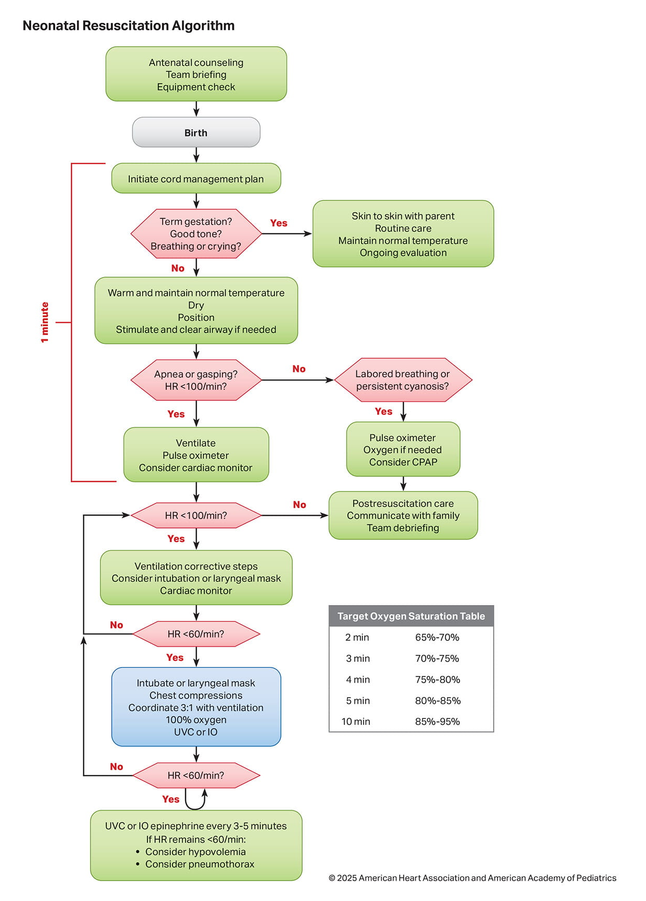
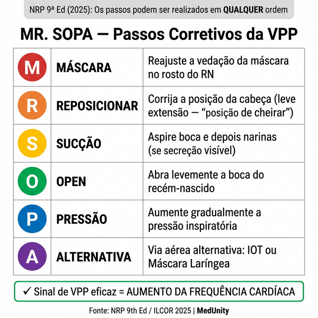
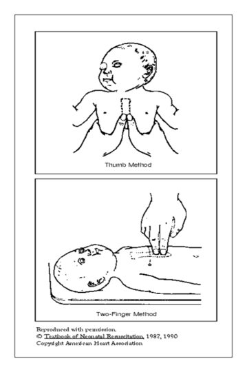

# REANIMAÇÃO NEONATAL

A reanimação neonatal deve ser entendida de forma diferente da reanimação do adulto. No adulto, a parada costuma ser primariamente cardíaca, como em infarto ou arritmia. No recém-nascido, a deterioração geralmente é hipóxica: o coração para porque o pulmão não ventilou. Por isso, o ponto central da reanimação neonatal é a **ventilação efetiva**.

Cerca de 1 a cada 10 recém-nascidos precisa de ajuda para iniciar a respiração. Se falarmos de prematuros, esse número sobe drasticamente. O papel da equipe na sala de parto é garantir que essa transição da vida intrauterina para a extrauterina ocorra sem asfixia.

## Preparo para a Assistência: O que vem antes do choro

Muitos alunos erram questões por ignorar o preparo. A reanimação começa antes do bebê nascer. Segundo a Diretriz da Sociedade Brasileira de Pediatria (SBP, 2021), toda sala de parto deve ter pelo menos uma pessoa capaz de iniciar a reanimação (VPP com máscara) e, para gestações de risco, duas a três pessoas, incluindo um médico capaz de intubar.

O ambiente é crucial. O RN perde calor por quatro mecanismos (condução, convecção, radiação e evaporação). Por isso, a temperatura da sala de parto deve estar entre **23°C e 26°C**.

Cuidado com a pegadinha: a banca pode dizer que 22°C está bom porque é confortável para a equipe médica. Errado. O foco é o bebê. Além da temperatura da sala, o berço de calor radiante deve estar ligado previamente.

### Material Mínimo Obrigatório

O material deve ser revisado antes de cada parto. Falhas como laringoscópio sem pilha ou máscara inadequada atrasam a ventilação no recém-nascido em apneia.

- Fonte de oxigênio e ar comprimido com fluxômetro.

- Misturador de gases (Blender) – essencial para não dar oxigênio demais ou de menos.

- Aspirador com manômetro.

- Reanimador manual (balão autoinflável) com máscara facial adequada.

- Laringoscópio com lâminas retas (00, 0 e 1).

- Cânulas traqueais (2,5 a 4,0 mm).

- Monitor cardíaco e oxímetro de pulso.

## O Nascimento e as Três Perguntas Mágicas

Assim que o bebê nasce, realiza-se uma avaliação rápida "de relance". Nesse momento, a decisão é clínica e visual, sem depender inicialmente de estetoscópio. As três perguntas que definem se o bebê vai para o colo da mãe ou para a mesa de reanimação são:

- **Gestação ≥ 34 semanas?**

- **Respirando ou chorando?**

- **Tônus muscular bom?** (Flexão dos membros)

Se a resposta for **SIM para as três**, o bebê é vigoroso. Ele vai para o contato pele a pele imediato com a mãe, onde será provido calor, mantendo as vias aéreas pérvias. O clampeamento do cordão, nesse caso, é oportuno (tardio), ocorrendo após 1 a 3 minutos.

Se a resposta for **NÃO para qualquer uma** das perguntas, o bebê precisa de intervenção. Nesse ponto entra o conceito do "Minuto de Ouro": a ventilação deve ser iniciada em até 60 segundos quando indicada.

## Passos Iniciais da Reanimação (Estabilização)

Se o bebê não é vigoroso, levamos para a mesa de reanimação (berço aquecido). A sequência deve ser decorada, pois as bancas cobram a ordem exata:

- **Prover calor:** Colocar sob fonte de calor radiante.

- **Posicionar a cabeça:** Leve extensão do pescoço (posição de "cheirar o ar"). Cuidado para não hiperextender nem fletir demais, o que obstrui a via aérea.

- **Aspirar vias aéreas (SE NECESSÁRIO):** Só aspiramos se houver obstrução evidente por secreção ou mecônio que impeça a respiração. Primeiro boca, depois narinas. Erro comum: aspirar todo bebê de rotina. Isso causa bradicardia reflexa e trauma.

- **Secar e remover campos úmidos:** Essencial para evitar perda de calor por evaporação.

- **Reposicionar a cabeça:** Após secar e manipular o recém-nascido, a posição da cabeça pode mudar. Reposicione.

Tudo isso deve levar no máximo 30 segundos. Após esses passos, avaliam-se a **Frequência Cardíaca (FC)** e a **Respiração**.

### Como avaliar a FC na sala de parto?

A ausculta do precórdio com estetoscópio é o método clínico inicial. Porém, para fins de prova e prática avançada, o **monitor cardíaco (ECG)** é o método mais rápido e preciso para guiar a reanimação. O oxímetro de pulso demora a "pegar" a curva em bebês chocados, então não confie apenas nele para a FC nos primeiros minutos.

## Ventilação com Pressão Positiva (VPP): O Pulo do Gato

Se após os passos iniciais o bebê apresentar **FC < 100 bpm, apneia ou respiração irregular (gasping)**, a VPP deve ser iniciada imediatamente.

A VPP é a manobra mais importante da reanimação neonatal. Quando a VPP é efetiva, a maioria dos recém-nascidos não evolui para necessidade de massagem cardíaca ou drogas.

### Parâmetros da VPP:

- **Frequência:** 30 a 60 incursões por minuto (atualização ILCOR 2025; antes era 40-60). O ritmo ditado é: "Aperta, solta, solta... Aperta, solta, solta...".

- **Concentração de O2:**

- RN ≥ 34 semanas: Começa com ar ambiente (**O2 a 21%**).

- RN < 34 semanas: Começa com **O2 a 60%**, com ajuste guiado pela SpO2 pré-ductal e pela FC, aumentando ou reduzindo a oferta em passos de 20% a cada 30 segundos.

- **Monitorização:** Obrigatório colocar oxímetro de pulso no membro superior direito (saturação pré-ductal) e monitor cardíaco.

O sinal mais importante de que a sua VPP está sendo eficaz é o **aumento da frequência cardíaca**. Se a FC sobe, mantém-se a ventilação. Se a FC não sobe e o tórax não expande, usa-se o mnemônico **MR. SOPA** para corrigir a técnica (NRP 9ª Ed, 2025: os passos podem ser realizados em qualquer ordem):

- **M** (Mascara): Ajuste a máscara.

- **R** (Reposicionar): Melhore a posição da cabeça.

- **S** (Suction): Aspire secreções.

- **O** (Open): Abra a boca do bebê.

- **P** (Pressure): Aumente a pressão de ventilação.

- **A** (Alternativa): Considere via aérea alternativa (Intubação ou Máscara Laríngea).

## Intubação Orotraqueal (IOT)

Quando indicar a IOT?

- VPP com máscara não está sendo efetiva (FC não sobe).

- Necessidade de VPP prolongada.

- Necessidade de massagem cardíaca (é impossível coordenar massagem e ventilação de forma eficaz apenas com máscara).

- Situações especiais como Hérnia Diafragmática Congênita (onde a VPP com máscara é contraindicada para não insuflar o intestino no tórax).

A profundidade da cânula pode ser estimada pelo peso do bebê ou pela distância entre o trago e o septo nasal + 1 cm.

## Massagem Cardíaca

A massagem cardíaca só é iniciada se, após **30 segundos de VPP técnica e via aérea garantida (preferencialmente IOT)**, a FC permanecer **abaixo de 60 bpm**.

Aqui está a maior pegadinha de prova: a banca vai dizer que o bebê nasceu com FC de 40 bpm e perguntar a conduta. O aluno desatento marca "massagem". Errado! A conduta é VPP. Só fazemos massagem se a FC continuar < 60 após VPP adequada.

### Técnica da Massagem:

- **Local:** Terço inferior do esterno, logo abaixo da linha intermamilar.

- **Método:** Técnica dos dois polegares (mais eficaz que a de dois dedos).

- **Profundidade:** 1/3 do diâmetro anteroposterior do tórax.

- **Relação Massagem:Ventilação:** 3 para 1. São 90 compressões e 30 ventilações por minuto, totalizando 120 eventos.

- **Oxigênio:** Assim que inicia a massagem, o O2 deve ser aumentado para **100%**.

Na reanimação neonatal, o foco é a ventilação. Por isso, a relação é 3:1, diferente dos esquemas usados em pediatria maior/adulto, garantindo que cada ciclo de ventilação seja efetivo.

## Medicamentos na Reanimação

Se foram realizados 30 segundos de VPP efetiva, seguidos de VPP + massagem por mais 60 segundos, e a FC permanece < 60 bpm, indica-se medicação.

-

**Adrenalina:**

- **Via preferencial:** Veia umbilical (cateterismo venoso de emergência).

- **Dose IV/umbilical:** solução 1:10.000, **0,1 a 0,3 mL/kg**, o que corresponde a **0,01 a 0,03 mg/kg**.

- **Via alternativa:** Endotraqueal (enquanto pega o acesso). Dose maior: 0,05 a 0,1 mg/kg. Mas atenção: a absorção traqueal é errática, use apenas uma vez enquanto providencia o acesso venoso.

-

**Expansores de Volume (Soro Fisiológico 0,9%):**

- Indicado se houver suspeita de hipovolemia (palidez, pulsos finos, história de descolamento de placenta ou hemorragia).

- **Dose:** 10 mL/kg, infundido lentamente (5 a 10 minutos). Em prematuros extremos, cuidado redobrado pelo risco de hemorragia intracraniana.

| Medicamento | Dose (IV) | Diluição | Quando usar? |
| --- | --- | --- | --- |
| Adrenalina | 0,1 - 0,3 mL/kg = 0,01 - 0,03 mg/kg | 1:10.000 | FC < 60 após VPP + Massagem |
| Soro Fisiológico | 10 mL/kg | - | Suspeita de choque/hipovolemia |

## O Caso Especial do Líquido Meconial

Antigamente, se o bebê tivesse mecônio e não fosse vigoroso, a gente intubava para aspirar a traqueia. **Isso mudou!**

Segundo a SBP 2021, a conduta para o líquido meconial (fluido ou espesso) é a mesma do líquido claro:

- Bebê vigoroso: Colo da mãe.

- Bebê não vigoroso: Mesa de reanimação, passos iniciais. Se não respirar ou FC < 100, **VPP**.

- A aspiração traqueal não é mais recomendada de rotina, pois atrasa o início da VPP, que é o que realmente salva o bebê.

## Prematuros

| Sinal | 0 pontos | 1 ponto | 2 pontos |
| --- | --- | --- | --- |
| **A**parência (Cor) | Cianose/Palidez | Acrocianose | Rosado |
| **P**ulso (FC) | Ausente | < 100 bpm | > 100 bpm |
| **G**esticulação (Irritabilidade) | Sem resposta | Careta | Choro/Espirro |
| **A**tividade (Tônus) | Flácido | Flexão de extremidades | Movimentação ativa |
| **R**espiração (Esforço) | Ausente | Lenta/Irregular | Choro vigoroso |

Lembre-se: o Apgar avalia a FC, mas **não avalia a frequência respiratória** (avalia o esforço/choro).

## Situações Especiais e Malformações

### Hérnia Diafragmática Congênita

O bebê nasce com desconforto respiratório e abdome escavado.

- **O que NÃO fazer:** VPP com máscara e balão. Isso joga ar no estômago e alças intestinais que estão no tórax, comprimindo ainda mais o pulmão.

- **O que fazer:** Intubação imediata e passagem de sonda gástrica para descompressão.

### Atresia de Coanas

O bebê fica cianótico em repouso e melhora quando chora (pois respira pela boca). A conduta é manter a via aérea oral pérvia (cânula de Guedel).

### Síndrome de Pierre-Robin

Mandíbula muito pequena (micrognatia) e a língua cai para trás (glossoptose). Colocar o bebê em decúbito ventral pode ajudar a liberar a via aérea.

## Metas de Saturação de Oxigênio (SatO2)

Não espere que o bebê sature 95% no primeiro minuto de vida. Ele estava dentro do útero, em um ambiente de hipóxia relativa. A saturação sobe gradualmente. No MedEvo, sempre reforçamos que dar oxigênio demais causa lesão por radicais livres (estresse oxidativo).

| Tempo de Vida | SatO2 Alvo (Pré-ductal) |
| --- | --- |
| Até 5 min | 70% - 80% |
| 5 - 10 min | 80% - 90% |
| > 10 min | 85% - 95% |

Se o bebê está em VPP e a saturação está dentro do alvo, não aumente o O2, mesmo que ele pareça "roxinho". A cor (cianose) não é um bom parâmetro para decidir oxigenoterapia.

## Cuidados Pós-Reanimação

Se o bebê precisou de reanimação avançada (massagem ou drogas), ele deve ir para a UTI Neonatal.
Dois pontos são cruciais aqui:

- **Glicemia:** O estresse da reanimação consome estoques de glicogênio. Monitore para evitar hipoglicemia, que agrava a lesão cerebral.

- **Neuroproteção (Hipotermia Terapêutica):** Para bebês a termo com Encefalopatia Hipóxico-Isquêmica moderada a grave, a manutenção da temperatura corporal entre 33,5°C e 34,5°C por 72 horas reduz sequelas neurológicas.

## Pontos-Chave para Prova

- **FC < 100 bpm ou Apneia/Gasping:** Indicação imediata de VPP.

- **Sinal de VPP eficaz:** Aumento da Frequência Cardíaca.

- **Massagem Cardíaca:** Apenas se FC < 60 bpm após 30 segundos de VPP eficaz (preferencialmente com IOT).

- **Relação Massagem/Ventilação:** 3:1 (90 compressões e 30 ventilações por minuto).

- **Oxigênio Inicial:** 21% para ≥ 34 semanas; 60% para < 34 semanas, com titulação pela oximetria pré-ductal e pela frequência cardíaca.

- **Líquido Meconial:** Não se aspira traqueia de rotina. Se não for vigoroso, segue o fluxo normal: passos iniciais e VPP se necessário.

- **Adrenalina:** Via preferencial é a veia umbilical. Dose 0,01-0,03 mg/kg (1:10.000).

- **Hérnia Diafragmática:** Contraindicação absoluta de VPP com máscara. Intube imediatamente.

- **Temperatura da Sala:** 23°C a 26°C.

- **Apgar:** Não decide conduta de reanimação. Avalia resposta ao tratamento e prognóstico.

- **Monitorização da FC:** O ECG é o padrão-ouro na sala de parto por ser mais rápido e preciso que a oximetria.

- **Clampeamento do Cordão:** No RN vigoroso (termo ou prematuro tardio), esperar de 1 a 3 minutos. No prematuro < 34 semanas vigoroso, esperar 30 a 60 segundos.

- **Naloxona:** Pode ser considerada se houver depressão respiratória por opioides administrados à mãe nas últimas 4 horas, mas **NUNCA** antes de estabilizar a ventilação (VPP primeiro).

- **O que NÃO fazer:** Tapinhas nas costas ou "leite de soja" (estímulos dolorosos excessivos). O estímulo tátil permitido é apenas um leve peteleco na planta do pé ou fricção do dorso, no máximo duas vezes.

 Cópia offline para consulta pessoal.
 Fonte original:
 [https://www.medevo.com.br/material-apoio/ler/f8e6e2dc-0fbd-42d1-83c2-f437a4ee647f](https://www.medevo.com.br/material-apoio/ler/f8e6e2dc-0fbd-42d1-83c2-f437a4ee647f)
