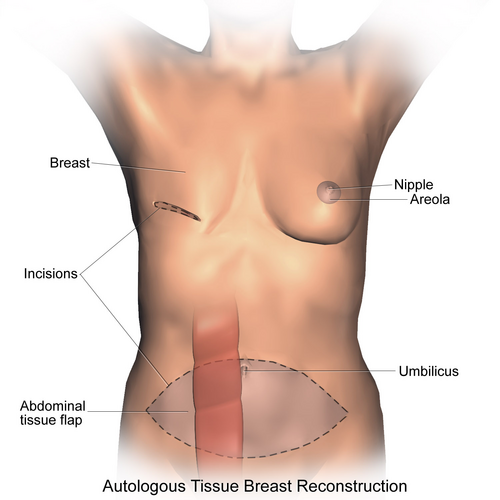
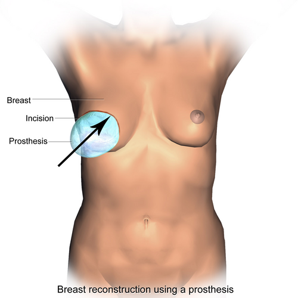

# RECONSTRUÇÃO MAMÁRIA

A reconstrução mamária não é apenas um procedimento estético; na prova de residência e na vida real, ela é considerada parte integrante do tratamento do câncer de mama. O seu objetivo é restaurar a forma, o volume e a simetria, mas, para o cirurgião, o desafio é fazer isso respeitando a oncologia e a anatomia vascular.

Para entender reconstrução, você precisa dominar dois pilares: **Timing** (quando fazer) e **Técnica** (como fazer). Se você entender a vascularização, nunca mais vai precisar decorar qual retalho usar, porque a resposta estará na anatomia.

*Figura 1 - Reconstrução mamária com retalho TRAM (Transverse Rectus Abdominis Myocutaneous): técnica autóloga que utiliza tecido do abdome para reconstruir a mama. Fonte: BruceBlaus/Blausen Medical, CC BY 3.0 | Wikimedia Commons*

## Timing da Reconstrução: Imediata vs. Tardia

A primeira decisão que tomamos junto à equipe de mastologia é o momento da reconstrução. Aqui, o fator determinante não é apenas o desejo da paciente, mas o estágio da doença e a necessidade de tratamentos adjuvantes, especialmente a radioterapia.

### Reconstrução Imediata

É realizada no mesmo ato cirúrgico da mastectomia. É a preferida pelas pacientes por evitar o impacto psicológico da ausência da mama.
**Vantagem:** Melhores resultados estéticos, pois preserva o envelope cutâneo (mastectomia poupadora de pele ou de complexo aréolo-papilar).
**Desvantagem:** Se a paciente precisar de radioterapia pós-operatória, o resultado estético pode ser seriamente comprometido por fibrose e retração.

### Reconstrução Tardia

Realizada meses ou anos após o tratamento oncológico completo.
**Indicação clássica:** Pacientes com tumores avançados que necessitam de radioterapia agressiva ou que possuem comorbidades graves que tornariam o tempo cirúrgico da mastectomia + reconstrução perigoso.
**Vantagem:** Segurança oncológica total e tecidos já cicatrizados.
**Desvantagem:** O envelope cutâneo é perdido, exigindo quase sempre o uso de tecidos de outras partes do corpo (retalhos).

| Característica | Reconstrução Imediata | Reconstrução Tardia |
| --- | --- | --- |
| **Momento** | Junto com a mastectomia | Após o término da adjuvância |
| **Estética** | Geralmente superior (preserva pele) | Mais desafiadora (falta pele) |
| **Impacto da Radioterapia** | Alto risco de complicações | Tecido já sofreu o dano (planejamento melhor) |
| **Principal Indicação** | Estágios iniciais (I e II) | Estágios avançados ou comorbidades |

## O Impacto da Radioterapia na Cicatrização

Este é um tema recorrente em provas. Você precisa entender o **porquê** a radioterapia é a "inimiga" da reconstrução com próteses.

A radiação ionizante causa um dano tecidual primário por **isquemia microvascular**. Ela promove uma endarterite obliterante (inflamação e fechamento dos pequenos vasos). O tecido irradiado torna-se hipovascular, hipocelular e hipóxico.

**Dica de Prova:** Se a questão mencionar uma paciente que já fez radioterapia e pergunta a melhor conduta para reconstrução, a resposta raramente será "apenas prótese". O tecido irradiado não estica bem e tem má cicatrização. Nesses casos, preferimos trazer tecido sadio e vascularizado de fora do campo de radiação (retalhos autólogos).

*Figura 2 - Reconstrução mamária com prótese de silicone: técnica aloplástica utilizando expansor tissular seguido de implante definitivo. Fonte: BruceBlaus/Blausen Medical, CC BY 3.0 | Wikimedia Commons*

## Reconstrução com Materiais Aloplásticos (Próteses e Expansores)

É a técnica mais utilizada no mundo pela sua simplicidade técnica comparada aos retalhos microcirúrgicos.

### Expansores Teciduais

Usamos quando não há pele suficiente para cobrir o volume desejado. O expansor é colocado vazio ou parcialmente cheio sob o músculo peitoral maior. Semanalmente, injetamos soro fisiológico através de uma válvula até atingir o volume alvo.
Após alguns meses, faz-se uma segunda cirurgia para trocar o expansor por uma prótese definitiva.

### Próteses Definitivas

Indicadas quando a mastectomia preserva pele suficiente (Skin-sparing) e o tecido tem boa qualidade.
**Cuidado:** O maior erro do aluno é achar que a prótese é sempre a melhor opção. Em pacientes muito magras ou irradiadas, a prótese pode ficar visível, palpável ou sofrer extrusão.

## Retalhos Autólogos: A Anatomia que Cai na Prova

Aqui é onde a maioria dos candidatos se perde, mas onde o Dr. Will e a metodologia MedEvo focam para você garantir o ponto. Para entender retalhos, você deve focar no **pedículo vascular**.

### 1. Retalho Miocutâneo do Grande Dorsal (Latissimus Dorsi)

É o "burro de carga" da cirurgia plástica. É um retalho extremamente confiável.

- **Anatomia Vascular:** O pedículo principal é a **Artéria Toracodorsal** (ramo da artéria subescapular).

- **Indicação:** Quando precisamos de cobertura de pele e um pouco de volume, mas a paciente não tem abdome para um TRAM. Frequentemente associado a uma prótese por baixo do músculo para dar volume total.

- **Vantagem:** Grande arco de rotação e vascularização robusta.

- **Pérola de Prova:** Se a questão disser que a artéria toracodorsal foi ligada durante a linfadenectomia axilar, o retalho ainda pode sobreviver por circulação retrógrada através da artéria serrátil, mas o risco de isquemia aumenta drasticamente. Na prova, considere a toracodorsal como a principal.

### 2. Retalho TRAM (Transverse Rectus Abdominis Myocutaneous)

Este é o favorito das bancas. Consiste em levar a pele e a gordura da região infraumbilical para o tórax.

Existem dois tipos principais de TRAM, e você PRECISA saber a diferença vascular entre eles:

#### A. TRAM Pediculado

O músculo reto abdominal é desinserido de sua origem inferior e rodado para o tórax, mantendo-se preso apenas pela sua inserção superior.

- **Vascularização:** Baseia-se na **Artéria Epigástrica Superior Profunda**.

- **O "Pulo do Gato":** Fisiologicamente, o território cutâneo do abdome inferior é melhor irrigado pela artéria epigástrica *inferior*. No TRAM pediculado, forçamos o sangue a vir de cima (superior) para baixo através de conexões (anastomoses) entre as epigástricas. Por isso, esse retalho é mais propenso a necroses parciais em fumantes ou obesas.

#### B. TRAM Microcirúrgico (Livre)

O retalho é totalmente cortado do abdome e levado ao tórax, onde os vasos são anastomosados (geralmente nos vasos mamários internos ou toracodorsais).

- **Vascularização:** Baseia-se na **Artéria Epigástrica Inferior Profunda**.

- **Vantagem:** Melhor vascularização que o pediculado, pois usa o vaso "natural" daquela gordura.

### 3. Retalho DIEP (Deep Inferior Epigastric Perforator)

É a evolução do TRAM. No DIEP, nós dissecamos apenas os pequenos vasos (perfurantes) que atravessam o músculo reto abdominal, preservando o músculo íntegro no lugar.

- **Vascularização:** **Artéria Epigástrica Inferior Profunda**.

- **Vantagem:** Menor taxa de hérnias e fraqueza abdominal pós-operatória (preserva a função da parede abdominal).

- **Dica de Prova:** O DIEP é sempre um retalho **livre** (microcirúrgico). Não existe DIEP pediculado.

| Retalho | Pedículo Vascular Principal | Tipo de Cirurgia | Preserva Músculo? |
| --- | --- | --- | --- |
| **Grande Dorsal** | Artéria Toracodorsal | Pediculado | Não (leva o músculo) |
| **TRAM Pediculado** | Art. Epigástrica Superior Profunda | Pediculado | Não (leva o músculo) |
| **TRAM Livre** | Art. Epigástrica Inferior Profunda | Microcirúrgica | Não (leva parte do músculo) |
| **DIEP** | Art. Epigástrica Inferior Profunda | Microcirúrgica | Sim |

## O Retalho de Holmström (Toracodorsal Lateral)

Muitos livros negligenciam, mas as questões de residência adoram termos específicos. O retalho de Holmström é um **retalho fasciocutâneo** da região lateral do tórax.
Diferente do Grande Dorsal, ele não leva o músculo. Ele usa a pele e a fáscia da região lateral, sendo útil para reconstruções de quadrantes laterais ou para complementar volume em mamas menores. Guarde este nome: Holmström = Fasciocutâneo Lateral.

## Anatomia do Reto Abdominal e Zonas de Hartrampf

Imagine o abdome dividido em 4 zonas para o retalho TRAM:

- **Zona I:** Logo acima do músculo que está sendo levado (melhor vascularização).

- **Zona II:** Lado oposto ao músculo, cruzando a linha média (pior vascularização no TRAM pediculado).

- **Zona III:** Lateral à Zona I (mesmo lado do músculo).

- **Zona IV:** Lateral à Zona II (a área com maior risco de necrose).

**Erro comum em prova:** Achar que a Zona II é melhor que a Zona III. No TRAM pediculado, o sangue precisa cruzar a linha média (cicatriz umbilical) para chegar ao outro lado, o que torna as zonas contralaterais (II e IV) mais instáveis.

## Complicações Pós-Operatórias

Você deve ser capaz de identificar a complicação pelo quadro clínico apresentado na questão.

### Isquemia e Necrose

Se o retalho ficar pálido, frio e com tempo de enchimento capilar lento: **Isquemia Arterial**.
Se o retalho ficar roxo, inchado e com enchimento capilar imediato: **Congestão Venosa**.

- **Conduta:** No retalho livre, a suspeita de sofrimento vascular exige reintervenção imediata para revisar a anastomose. No retalho pediculado, a conduta costuma ser expectante para delimitação da necrose, a menos que haja infecção.

### Complicações do Doador (Abdome)

A principal complicação do TRAM é a **hérnia ou abaulamento abdominal** (bulge). Isso ocorre porque o músculo reto abdominal foi retirado ou enfraquecido.

- **Prevenção:** Uso de telas de polipropileno para reforçar a parede abdominal.

### Seroma

Muito comum na área doadora do Grande Dorsal (dorso). O tratamento é a punção aspirativa no consultório.

## Exemplo Clínico 1: A Paciente de Alto Risco

Imagine uma paciente de 52 anos, tabagista (1 maço/dia), obesa (IMC 32), com diagnóstico de carcinoma ductal infiltrativo em mama esquerda. Ela deseja reconstrução imediata.

**O que o professor médico te diz:** O tabagismo é uma contraindicação relativa fortíssima para o TRAM pediculado. O cigarro causa vasoconstrição periférica, e como o TRAM pediculado já trabalha no limite da vascularização (lembra da epigástrica superior?), o risco de necrose total do retalho é altíssimo.
**Conduta ideal:** Estimular cessação do tabagismo (mínimo 4 semanas antes) e considerar técnicas que não dependam de microcirculação tão precária, ou preferir o DIEP (se houver equipe microcirúrgica) por ter melhor aporte sanguíneo.

## Exemplo Clínico 2: O Dilema da Radioterapia

Paciente de 45 anos, submetida a mastectomia e radioterapia há 2 anos. Apresenta pele do tórax fina, com teleangiectasias e retração (radiodermite). Ela quer reconstruir a mama.

**Análise:** Colocar um expansor ou prótese aqui é "pedir para dar errado". A pele não vai expandir, vai sofrer isquemia e a prótese vai acabar exposta.
**Solução:** Precisamos de tecido novo. O retalho de Grande Dorsal com prótese ou o TRAM/DIEP são as escolhas de ouro. O tecido autólogo traz sua própria vascularização, o que ajuda até a melhorar a qualidade da pele vizinha irradiada.

## Diagnóstico Diferencial de Massas Pós-Reconstrução

Um cenário comum em provas é a paciente que volta 6 meses após um TRAM com um nódulo endurecido na mama reconstruída.

- **Principal suspeita:** Necrose gordurosa (esteatonecrose).

- **Por que ocorre?** Áreas do retalho que receberam pouco sangue (Zona IV) sofrem isquemia, a gordura morre e calcifica, gerando um nódulo firme.

- **Diferencial:** Recidiva tumoral.

- **Conduta:** Exames de imagem (Mamografia/Ultrassom) e, se houver dúvida, biópsia. A necrose gordurosa tem aspecto característico de "cisto oleoso" na imagem.

## Reconstrução do Complexo Aréolo-Papilar (CAP)

É a última etapa da reconstrução, geralmente feita 3 a 6 meses após a reconstrução do volume, para garantir que a mama "assentou" na posição final.

- **Papila:** Pode ser feita com retalhos locais (pequenos "z-plasti" de pele da própria mama reconstruída) ou enxerto de parte da papila da mama contralateral.

- **Aréola:** Enxerto de pele total (geralmente da região inguinal, que é mais escura) ou, o mais comum hoje, tatuagem intradérmica.

## Simetrização da Mama Contralateral

Raramente a mama reconstruída fica idêntica à mama natural. Por isso, quase sempre realizamos um procedimento na mama sadia para atingir a simetria.

- **Mastopexia:** Se a mama sadia estiver caída.

- **Mamoplastia Redutora:** Se a mama sadia for muito grande.

- **Mamoplastia de Aumento:** Se a mama sadia for pequena.

**Dica de Prova:** A simetrização pode ser feita no mesmo tempo da reconstrução ou em um segundo tempo. Em reconstruções com retalhos, prefere-se o segundo tempo, pois o volume do retalho muda nos primeiros meses (atrofia muscular e redução do edema).

## Pontos Críticos de Anatomia Vascular para Memorizar

As bancas de cirurgia plástica são obcecadas por vasos sanguíneos. Se você souber isso, você acerta 80% das questões de retalhos:

- **Músculo Reto Abdominal:** Possui suprimento sanguíneo tipo IV de Mathes e Nahai (dois pedículos dominantes).

- Superior: Artéria Epigástrica Superior (ramo da Mamária Interna).

- Inferior: Artéria Epigástrica Inferior Profunda (ramo da Ilíaca Externa).

- **Músculo Grande Dorsal:** Suprimento tipo V (um pedículo dominante e vários segmentares).

- Dominante: Artéria Toracodorsal.

- **Pele do Abdome Inferior:** Irrigada principalmente por perfurantes da Epigástrica Inferior Profunda.

## Pontos-Chave para Prova 🧠

- **Principal artéria do retalho TRAM pediculado:** Artéria Epigástrica Superior Profunda.

- **Principal artéria do retalho DIEP e TRAM livre:** Artéria Epigástrica Inferior Profunda.

- **Principal artéria do retalho de Grande Dorsal:** Artéria Toracodorsal.

- **Retalho de Holmström:** É um retalho fasciocutâneo lateral, não leva músculo.

- **Radioterapia:** Causa isquemia por endarterite obliterante; é a principal indicação para uso de retalhos autólogos em vez de próteses.

- **Vantagem do DIEP sobre o TRAM:** Preservação da musculatura abdominal, reduzindo risco de hérnias e fraqueza.

- **Zona IV de Hartrampf:** É a área de maior risco de necrose no retalho TRAM (mais distante do pedículo e contralateral).

- **Necrose gordurosa:** Principal diagnóstico diferencial de nódulos palpáveis em mamas reconstruídas com retalhos.

- **Contraindicação absoluta ao TRAM:** Cirurgias abdominais prévias que tenham seccionado os vasos epigástricos (ex: abdominoplastia prévia).

- **Linfadenectomia axilar:** Pode lesar a artéria toracodorsal, colocando em risco um futuro retalho de Grande Dorsal.

- **Expansor tecidual:** Usado na reconstrução imediata quando há déficit de pele, mas exige uma segunda cirurgia para troca por prótese.

- **Tabagismo:** Aumenta drasticamente o risco de complicações em retalhos pediculados (vasoconstrição).

- **Reconstrução do CAP:** É a última etapa; a aréola pode ser feita com enxerto de pele inguinal ou tatuagem.

- **Isquemia Arterial vs. Congestão Venosa:** Palidez/frio vs. Cianose/edema. A congestão venosa é mais comum em retalhos microcirúrgicos.

- **Reforço abdominal no TRAM:** O uso de tela de polipropileno é recomendado quando a fáscia do reto abdominal é retirada bilateralmente ou quando há tensão na sutura.

- **O que NÃO fazer:** Nunca prometa simetria perfeita na primeira cirurgia; a reconstrução é um processo de etapas.

Este material foi estruturado para que você entenda a lógica por trás das escolhas cirúrgicas. Como sempre dizemos no MedEvo, quem entende a anatomia não precisa decorar a conduta. Foque nos vasos sanguíneos e no impacto da radioterapia, pois esses são os temas que definem a sua aprovação em Cirurgia Plástica.

 Cópia offline para consulta pessoal.
 Fonte original:
 [https://www.medevo.com.br/material-apoio/ler/358124db-c27f-4de8-9c6f-c023db73e86c](https://www.medevo.com.br/material-apoio/ler/358124db-c27f-4de8-9c6f-c023db73e86c)
