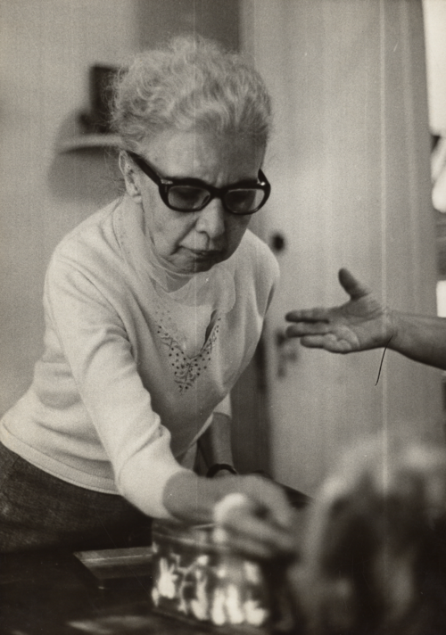

# REDE DE ATENÇÃO PSICOSSOCIAL

Para entender a Rede de Atenção Psicossocial, a famosa RAPS, você precisa primeiro esquecer a ideia de que a saúde mental se resume a um consultório de psiquiatra ou a um hospital especializado. Se você for para a prova com a mentalidade do "modelo hospitalocêntrico", você vai errar questões bobas.

A RAPS não é um prédio; é uma lógica de cuidado. Ela nasce da Reforma Psiquiátrica Brasileira (Lei 10.216/2001), que mudou o foco do isolamento para a convivência na comunidade. O objetivo aqui é a desinstitucionalização. Guarde essa palavra: o SUS quer o paciente sendo tratado no território dele, perto da família, e não trancado em um hospício a quilômetros de distância.

*Dra. Nise da Silveira (1905-1999), psiquiatra alagoana que revolucionou o tratamento psiquiátrico no Brasil ao substituir métodos violentos como eletrochoque e lobotomia pela arte-terapia e convivência com animais. Seu trabalho no Centro Psiquiátrico Pedro II, no Rio de Janeiro, lançou as bases da Reforma Psiquiátrica que culminou na Lei 10.216/2001 e na criação da RAPS. Fonte: Arquivo Nacional, Domínio Público | Wikimedia Commons*

## O Porquê da RAPS: A Lógica da Rede

Por que criamos uma rede em vez de apenas construir mais hospitais? Porque o transtorno mental é complexo e multifatorial. Um paciente com esquizofrenia não precisa apenas de haloperidol; ele precisa de moradia, de lazer, de suporte familiar e, muitas vezes, de ajuda para recuperar sua cidadania.

A RAPS é estruturada para oferecer "Integralidade". Isso significa que, se o paciente está em crise aguda, a rede oferece o suporte de urgência. Se ele está estável, mas sem vínculos familiares, a rede oferece moradia. Se ele quer voltar ao mercado de trabalho, a rede oferece estratégias de economia solidária.

Aqui no MedEvo, sempre batemos na tecla de que a prova de Preventiva adora cobrar o conceito de "Territorialização". A RAPS só funciona se os serviços estiverem onde as pessoas vivem.

## Os 7 Componentes da RAPS

As bancas amam perguntar quais são os componentes da RAPS. De acordo com a Portaria nº 3.088/2011 do Ministério da Saúde, a rede é composta por sete eixos fundamentais. Vamos detalhar cada um, focando no que realmente cai.

### 1. Atenção Básica em Saúde

A porta de entrada preferencial. Aqui estão as Unidades Básicas de Saúde (UBS), as equipes de Consultório na Rua e os centros de convivência.

Um erro clássico de aluno é achar que "saúde mental é coisa de especialista". Errado. A maior parte dos transtornos mentais leves a moderados (ansiedade, depressão leve) deve ser manejada na UBS.

O conceito chave aqui é o **Matriciamento**. O pessoal do CAPS (especialista) dá suporte técnico-pedagógico para a equipe da UBS. Eles discutem casos juntos. Se a questão de prova disser que a UBS deve "encaminhar e esquecer" o paciente, a alternativa está incorreta. O cuidado é compartilhado.

### 2. Atenção Psicossocial Especializada

Aqui brilha o **CAPS (Centro de Atenção Psicossocial)**. Ele é o articulador da rede. O CAPS não é um ambulatório onde o paciente vai, consulta e vai embora. É um serviço de base comunitária, com equipe multiprofissional (médico, psicólogo, enfermeiro, assistente social, terapeuta ocupacional).

### 3. Atenção de Urgência e Emergência

Inclui o SAMU 192, as UPAs 24h e os prontos-socorros em hospitais gerais.
**Dica de prova:** Se um paciente chega na UBS com agitação psicomotora grave, oferecendo risco iminente a si ou a terceiros, a conduta correta é estabilizar e acionar o SAMU para transferência para um serviço de urgência. A UBS não tem estrutura para contenção física ou química prolongada.

### 4. Atenção Residencial de Caráter Transitório

Focada principalmente em usuários de substâncias psicoativas. Aqui entram as Unidades de Acolhimento e as Comunidades Terapêuticas (estas últimas são alvo de muitas discussões éticas, mas constam na legislação atual como parte da rede, desde que sigam normas específicas).

### 5. Atenção Hospitalar

Sim, a RAPS tem hospitais, mas o foco mudou. O objetivo agora são as **Enfermarias Especializadas em Hospital Geral**.
Por que hospital geral? Para evitar o estigma e garantir que o paciente psiquiátrico tenha acesso a exames e outras especialidades médicas se precisar. O "Hospital Psiquiátrico" isolado está em extinção no modelo da RAPS.

### 6. Estratégias de Desinstitucionalização

Aqui temos o **Serviço Residencial Terapêutico (SRT)**. São casas inseridas na cidade onde moram pessoas que passaram anos (às vezes décadas) internadas em hospitais psiquiátricos e perderam o vínculo familiar.
Também temos o Programa "De Volta para Casa", que é um auxílio financeiro para ajudar nessa reintegração.

### 7. Reabilitação Psicossocial

Foca em iniciativas de geração de renda, cooperativas sociais e oficinas de trabalho. O trabalho aqui é visto como ferramenta de cura e cidadania, não apenas ocupação de tempo.

## O Coração da Rede: Centros de Atenção Psicossocial (CAPS)

Se você tiver que decorar uma tabela para a prova, é esta. As bancas adoram trocar as populações e as funções de cada tipo de CAPS.

| Tipo de CAPS | População de Referência | Público-alvo | Horário de Funcionamento |
| --- | --- | --- | --- |
| **CAPS I** | Cidades > 15.000 hab. | Transtornos graves e persistentes (todas as idades) | 08h às 18h (Dias úteis) |
| **CAPS II** | Cidades > 70.000 hab. | Transtornos graves e persistentes (adultos) | 08h às 18h (Dias úteis) |
| **CAPS III** | Cidades > 150.000 hab. | Transtornos graves e persistentes (adultos) | **24 horas (inclui feriados e fins de semana)** |
| **CAPS i** | Cidades > 70.000 hab. | Crianças e adolescentes | 08h às 18h (Dias úteis) |
| **CAPS ad** | Cidades > 70.000 hab. | Álcool e outras Drogas | 08h às 18h (Dias úteis) |
| **CAPS ad III** | Cidades > 150.000 hab. | Álcool e outras Drogas | **24 horas (com acolhimento noturno)** |

**Pérola de Prova:** O que diferencia o CAPS III dos demais? O acolhimento noturno. Ele possui leitos (geralmente de 8 a 12) para que o paciente em crise possa ficar alguns dias sendo observado sem precisar ser internado em um hospital. É o recurso para evitar a hospitalização.

*Pacientes do Hospital Colônia de Barbacena (MG) em 1921. Neste local, estima-se que mais de 60 mil pessoas morreram em condições desumanas ao longo de décadas, episódio conhecido como o "Holocausto Brasileiro". A RAPS e a Lei 10.216 nasceram da luta para que essa realidade nunca mais se repita. Fonte: Arquivo Nacional (Fundo Afonso Pena Jr.), Domínio Público | Wikimedia Commons*

## Ferramentas de Abordagem Familiar e Comunitária

Na RAPS, o médico não olha só para o sintoma; ele olha para o contexto. Duas ferramentas aparecem constantemente em questões de residência: o Genograma e o Ecomapa. Como o Dr. Will costuma dizer nas aulas, "quem não desenha, não entende o paciente".

### Genograma

É a representação gráfica da estrutura familiar. Ele mostra pelo menos três gerações. Serve para identificar padrões de doença, conflitos e alianças.

- **Símbolos básicos:** Quadrado (homem), Círculo (mulher), Linhas duplas (vínculo forte), Linhas serrilhadas (conflito).

### Ecomapa

Este é o que mais cai quando o assunto é RAPS. Enquanto o genograma olha para *dentro* da família, o ecomapa olha para *fora*. Ele desenha a relação da família com o ambiente: igreja, trabalho, UBS, CAPS, vizinhos, justiça.

- **Por que usar?** Para identificar redes de apoio. Se um paciente com esquizofrenia tem um ecomapa "vazio" (sem conexões externas), o risco de recaída e isolamento é altíssimo.

## Manejo da Crise e Emergências na RAPS

Imagine o cenário: Paciente de 28 anos, diagnóstico de transtorno bipolar, em fase de mania, chega à UBS gritando, despindo-se e ameaçando os funcionários. O que você faz?

- **Segurança em primeiro lugar:** Não tente ser herói. Garanta a segurança da equipe e do paciente.

- **Abordagem verbal:** Sempre tente o "desescalonamento". Fale baixo, mantenha distância, não confronte.

- **Contenção Química:** Se a abordagem verbal falhar e houver risco, a medicação de escolha geralmente envolve um antipsicótico (Haloperidol) associado ou não a um benzodiazepínico (Diazepam ou Midazolam).

- *Cuidado:* Evite Diazepam IM (absorção errática). Se for fazer IM, prefira Midazolam.

- **Acionamento da Rede:** Se a UBS não consegue conter, chama-se o SAMU. O destino não é o CAPS (que é um serviço ambulatorial/dia), mas sim a Urgência (UPA ou Hospital Geral).

**Pegadinha de Prova:** A alternativa vai dizer que o paciente em crise deve ser levado imediatamente para o CAPS. Se for um CAPS I ou II, ele pode estar fechado (noite/fim de semana). O fluxo correto da urgência é SAMU -> UPA/Hospital Geral.

## Redução de Danos (RD)

Este é um dos pilares do tratamento para usuários de álcool e drogas na RAPS. A Redução de Danos causa muita confusão porque as pessoas acham que é "incentivar o uso".

**O que é RD de verdade?** É uma estratégia de saúde pública que foca em minimizar as consequências negativas do uso de drogas, respeitando a autonomia do usuário.

- **Não exige abstinência imediata.** Se o paciente não consegue ou não quer parar de usar, nós trabalhamos para que ele use de forma menos perigosa (ex: trocar o crack pela maconha, usar seringas descartáveis, hidratar-se enquanto bebe).

- **Foco na Cidadania:** O usuário de drogas continua tendo direitos. O objetivo é mantê-lo vivo e vinculado ao serviço de saúde.

| Modelo de Abstinência | Modelo de Redução de Danos |
| --- | --- |
| Foco na droga (o problema é a substância) | Foco no sujeito (o problema é a relação com a substância) |
| Objetivo único: Parar de usar | Objetivos graduais: Diminuir riscos e danos |
| Se o paciente usa, é considerado "fracasso" | O uso é parte do processo; o vínculo é o sucesso |
| Frequentemente punitivo ou excludente | Inclusivo e baseado em Direitos Humanos |

## Desastres Naturais e Saúde Mental

Recentemente, as bancas (especialmente as que cobram Saúde Coletiva) começaram a incluir o impacto de desastres (enchentes, deslizamentos) na RAPS.

O que você precisa saber:

- **Reação Normal a Situação Anormal:** Nem todo mundo que sofre um trauma terá Transtorno de Estresse Pós-Traumático (TEPT). Nos primeiros dias, a maioria terá sintomas de estresse agudo (insônia, hipervigilância, choro), o que é esperado.

- **Primeiros Cuidados Psicológicos (PCP):** Não é hora de fazer terapia profunda. É hora de oferecer segurança, comida, abrigo e escuta ativa.

- **Fatores de Risco para Suicídio pós-desastre:** Perda de entes queridos, perda de todos os bens materiais e histórico prévio de transtorno mental.

- *Atenção:* Transtornos de personalidade são fatores de risco para suicídio em geral, mas em situações de desastre, as perdas agudas e o isolamento social pesam mais na balança da prova.

## O Projeto Terapêutico Singular (PTS)

O PTS é a ferramenta que materializa a "Clínica Ampliada". Em vez de uma conduta padrão para todos os pacientes com a mesma doença, a equipe do CAPS ou da UBS senta e monta um plano específico para *aquele* indivíduo.

O PTS tem 4 momentos:

- **Diagnóstico e Análise:** Não só o CID, mas como o paciente vive, quem o apoia.

- **Definição de Metas:** O que queremos a curto, médio e longo prazo? (Ex: voltar a tomar banho sozinho, conseguir ir à padaria).

- **Divisão de Responsabilidades:** Quem faz o quê? (O médico ajusta a dose, o psicólogo faz a escuta, o assistente social busca o BPC).

- **Reavaliação:** O plano está funcionando? Se não, mudamos.

## Diagnóstico Diferencial e Manejo Farmacológico na RAPS

Embora a RAPS seja muito focada no social, você é médico e a prova vai cobrar a parte biológica. No contexto da rede, o uso de psicofármacos deve ser racional.

### Depressão na Atenção Básica

- **Primeira escolha:** Inibidores Seletivos da Recaptação de Serotonina (ISRS) como Fluoxetina ou Sertralina.

- **Dose:** Começar baixo. Fluoxetina 20mg/dia. Explicar que demora 2 a 4 semanas para fazer efeito.

- **Cuidado:** Em idosos, cuidado com hiponatremia e interações medicamentosas.

### Alcoolismo

- **Abstinência Leve/Moderada:** Benzodiazepínicos (Diazepam ou Lorazepam) para prevenir convulsões e Delirium Tremens.

- **Manutenção:** Naltrexona (reduz o "craving" ou desejo) ou Acamprosato.

- **Vitamina B1 (Tiamina):** Obrigatória para prevenir Encefalopatia de Wernicke. Nunca dê glicose antes da tiamina em um paciente desnutrido/etilista!

### Esquizofrenia e Transtornos Graves (Foco do CAPS)

- **Antipsicóticos Típicos:** Haloperidol, Clorpromazina. (Mais efeitos extrapiramidais: parkinsonismo, acatisia).

- **Antipsicóticos Atípicos:** Risperidona, Quetiapina, Olanzapina. (Mais efeitos metabólicos: ganho de peso, diabetes).

- **Clozapina:** O "padrão ouro" para esquizofrenia refratária.

- *Exigência:* Hemograma semanal/mensal devido ao risco de agranulocitose. Se o leucograma cair abaixo de 3.000 ou neutrófilos abaixo de 1.500, deve-se suspender.

## Direitos Humanos e Legislação

A Lei 10.216/2001 é o marco legal. Ela define os tipos de internação psiquiátrica, e isso cai muito:

- **Internação Voluntária:** Com o consentimento do paciente. Ele assina uma declaração.

- **Internação Involuntária:** Sem o consentimento, a pedido de terceiro (geralmente família).

- *Regra de Ouro:* Deve ser comunicada ao Ministério Público em até 72 horas.

- **Internação Compulsória:** Determinada pela Justiça. Não depende da vontade da família ou do paciente.

**Importante:** A internação, em qualquer modalidade, só deve ocorrer quando os recursos extra-hospitalares (CAPS, UBS) se mostrarem insuficientes. A internação deve ser o mais breve possível.

## Pontos-Chave para Prova

- **CAPS III e CAPS ad III:** São os únicos que funcionam 24h e possuem leitos de acolhimento noturno. População > 150 mil hab.

- **Matriciamento:** É o suporte especializado à Atenção Básica. Não é encaminhamento puro e simples; é compartilhamento de cuidado.

- **Genograma vs. Ecomapa:** Genograma = Família (genética/vínculos internos). Ecomapa = Família + Mundo (redes de apoio externas).

- **Redução de Danos:** Não exige abstinência. Foca na autonomia e na diminuição de riscos. É a estratégia oficial do SUS para drogas.

- **Serviço Residencial Terapêutico (SRT):** Moradia para quem saiu de longas internações. Máximo de 8 moradores por casa.

- **Crise na UBS:** Estabilizar e chamar SAMU. O CAPS não é porta de entrada para emergência clínica/agitação grave.

- **Clozapina:** Risco de agranulocitose. Exige controle rigoroso com hemograma.

- **Tiamina (B1):** Sempre antes da glicose no paciente etilista em risco de Wernicke.

- **Internação Involuntária:** Notificar o Ministério Público em até 72 horas. É uma medida de proteção, não de punição.

- **Integralidade:** É o atributo da APS que justifica acionar a RAPS para casos complexos.

- **Desinstitucionalização:** É o processo de tirar o foco do hospital psiquiátrico e devolver o paciente para a comunidade.

- **Ecomapa em Prova:** Se a questão fala em "relação com a igreja", "conflito com o vizinho" ou "apoio da ONG", a resposta é Ecomapa.

- **O que NÃO fazer:** Nunca prescrever benzodiazepínicos a longo prazo para idosos na UBS sem uma indicação muito clara (risco de quedas e demência).

- **Erro clássico:** Achar que o CAPS substitui a UBS. O paciente do CAPS continua sendo paciente da UBS para cuidar da hipertensão, diabetes e preventivo.

Lembre-se do que discutimos aqui no MedEvo: a RAPS é desenhada para ser uma rede "viva". O paciente circula por ela conforme sua necessidade. Se você entender que o objetivo é sempre manter o sujeito em liberdade e com dignidade, você matará qualquer questão sobre o tema.

 Cópia offline para consulta pessoal.
 Fonte original:
 [https://www.medevo.com.br/material-apoio/ler/08027182-006e-497d-910a-beb58b8a3fed](https://www.medevo.com.br/material-apoio/ler/08027182-006e-497d-910a-beb58b8a3fed)
