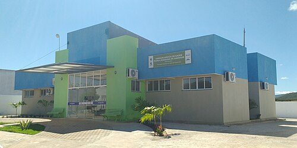
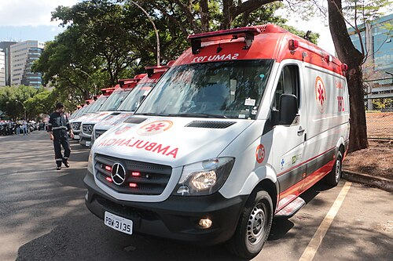

# REDES DE ATENÇÃO À SAÚDE

Para entender as Redes de Atenção à Saúde (RAS), você precisa primeiro esquecer a imagem da pirâmide. Durante décadas, fomos ensinados que o SUS funcionava como uma hierarquia rígida, onde a Atenção Básica ficava na base e o hospital no topo, como se o objetivo final de todo paciente fosse "subir" de nível. Esse modelo faliu. Ele é o que chamamos de Sistema Fragmentado, focado apenas em condições agudas e em procedimentos.

As RAS surgem para substituir essa pirâmide por uma rede poliárquica. Imagine um círculo ou uma teia, onde não há hierarquia de importância, mas sim uma diferenciação de densidade tecnológica. Todos os pontos são igualmente necessários. O objetivo central não é o procedimento, mas a continuidade do cuidado.

Por que essa mudança é cobrada exaustivamente em provas? Porque o Brasil vive uma transição demográfica e epidemiológica. Nossa população está envelhecendo e a carga de doenças mudou. Hoje, o que mata e incapacita são as Doenças Crônicas Não Transmissíveis (DCNT), como hipertensão, diabetes e câncer, além das causas externas. Um sistema que só sabe atender a "crise" (o modelo agudo) não consegue gerenciar um paciente que terá uma doença pelos próximos 30 anos.

*Figura 1 - UBS Mãe Belinha em Paraná (RN): exemplo real de uma Unidade Básica de Saúde, centro de comunicação e ordenadora da Rede de Atenção à Saúde no território. Fonte: Marcos Elias de Oliveira Júnior, CC0 | Wikimedia Commons*

## Fundamentos e Elementos Constitutivos das RAS

Para que uma rede exista de fato, e não seja apenas um conjunto de postos e hospitais espalhados, ela precisa de três elementos fundamentais. Se faltar um deles, a rede se rompe.

### 1. População Adscrita

Toda RAS começa com uma população alvo. Não se faz saúde para "todo mundo" de forma genérica, mas para uma população específica, com riscos estratificados. Na Estratégia Saúde da Família (ESF), isso é a territorialização. Precisamos saber quem são os hipertensos, onde estão as gestantes de alto risco e qual a prevalência de transtornos mentais naquela região. Sem conhecer a população, não há planejamento de recursos.

### 2. Estrutura Operacional

Aqui é onde a maioria dos alunos se confunde em provas. A estrutura não é apenas o prédio da UBS ou do hospital. Ela é composta por:

- **Centro de Comunicação:** É a Atenção Primária à Saúde (APS). Ela é o nó central, a ordenadora da rede e a coordenadora do cuidado.

- **Pontos de Atenção Secundários e Terciários:** Ambulatórios de especialidades, CAPS, UPAs e hospitais.

- **Sistemas de Apoio:** Lugares onde ocorrem diagnósticos e assistência farmacêutica.

- **Sistemas Logísticos:** É o "sangue" que corre na rede. Inclui o Cartão SUS, o prontuário eletrônico, os sistemas de transporte (como o SAMU) e a regulação de vagas.

- **Sistema de Governança:** Como os gestores (município, estado e união) se conversam para financiar e gerir essa rede.

### 3. Modelo de Atenção à Saúde

É a forma como operamos. Nas RAS, o modelo deve ser focado nas Condições Crônicas. Enquanto o modelo tradicional espera o paciente chegar com dor, o modelo de rede é proativo. Ele busca o paciente antes da complicação aparecer.

| Característica | Sistema Fragmentado (Antigo) | Redes de Atenção à Saúde (RAS) |
| --- | --- | --- |
| Hierarquia | Piramidal (Hospital no topo) | Poliárquica (APS no centro) |
| Foco | Condições Agudas | Condições Agudas e Crônicas |
| Relação | Reativa (espera o paciente) | Proativa (busca ativa/gestão de risco) |
| Comunicação | Inexistente ou precária | Fluida (Sistemas Logísticos) |
| Objetivo | Cura e Procedimento | Cuidado Integral e Longitudinal |

## O Papel Central da Atenção Primária (APS)

Se a prova perguntar qual é o "coração" da RAS, a resposta é a Atenção Primária. Mas cuidado: a banca pode usar os termos de Barbara Starfield, que são os atributos essenciais da APS. Você precisa decorar esses quatro, pois eles definem se um serviço é realmente atenção primária ou apenas um "postinho" de triagem.

- **Acesso de Primeiro Contato:** A APS deve ser a porta de entrada preferencial. O paciente deve pensar na UBS antes de pensar na UPA.

- **Longitudinalidade:** É o acompanhamento ao longo do tempo. O médico da família conhece o paciente, sua história e seus medos. Isso cria vínculo.

- **Integralidade:** A APS deve oferecer tudo o que o paciente precisa naquele nível, desde prevenção até pequenos procedimentos, e garantir que ele receba o que precisa nos outros níveis.

- **Coordenação do Cuidado:** Se o paciente vai ao cardiologista no nível secundário, a APS precisa saber o que foi decidido lá e trazer esse cuidado de volta para o território.

**Dica do Dr. Will:** As bancas adoram colocar "Eficiência" ou "Foco no Lucro" como atributos da APS. Não caia nessa. Os atributos derivados são Orientação Familiar, Orientação Comunitária e Competência Cultural. Eficiência é um objetivo de gestão, não um atributo clínico da APS.

## Decreto 7.508/2011: A Bíblia da Organização do SUS

Este decreto regulamentou a Lei 8.080/90 e definiu termos que caem em 9 de cada 10 provas de Preventiva. Vamos desmistificar os conceitos principais:

### Região de Saúde

É um espaço geográfico contínuo, constituído por agrupamentos de municípios limítrofes. Para ser considerada uma "Região de Saúde", o território deve oferecer, no mínimo:

- Atenção Primária.

- Urgência e Emergência.

- Atenção Psicossocial.

- Atenção Ambulatorial Especializada e Hospitalar.

- Vigilância em Saúde.

**Erro clássico de prova:** Achar que uma Região de Saúde precisa ter transplante ou neurocirurgia de alta complexidade. Não precisa. Ela precisa do "arroz com feijão" completo listado acima.

### Portas de Entrada

São os serviços por onde o usuário acessa o SUS sem precisar de encaminhamento. São elas:

- Atenção Primária.

- Atenção de Urgência e Emergência (UPAs, Pronto-Socorros).

- Atenção Psicossocial (CAPS).

- Serviços de Especial Acesso Aberto (ex: Centros de Testagem para HIV).

### COAP (Contrato Organizativo da Ação Pública)

É o acordo formal, com valor jurídico, entre os entes federativos (Município, Estado e União) para organizar a rede. No COAP, define-se quem paga o quê, quais as metas de cada um e como será a regulação. É a materialização da gestão compartilhada.

*Figura 2 - Ambulâncias do SAMU 192: componente pré-hospitalar móvel da Rede de Urgência e Emergência, com financiamento tripartite (União, Estados e Municípios). Foto: Vinícius de Melo/VGDF, Domínio Público | Wikimedia Commons*

## Redes Temáticas Prioritárias

O Ministério da Saúde definiu algumas redes como prioritárias para enfrentar os maiores problemas de saúde pública do Brasil. Vamos focar nas que mais caem.

### Rede Cegonha

Focada na saúde da mulher e da criança. Ela não é apenas "pré-natal". Ela abrange desde o planejamento reprodutivo até os primeiros dois anos de vida da criança.

- **Componentes:** Pré-natal, Parto e Nascimento, Puerpério e Atenção Integral à Saúde da Criança, e o Sistema Logístico (transporte seguro).

- **Diretrizes:** Garantia de acompanhante no parto (Lei do Acompanhante), vinculação da gestante à maternidade onde ela irá parir (evitar a "peregrinação") e boas práticas no parto (evitar episiotomia de rotina, por exemplo).

### Rede de Atenção Psicossocial (RAPS)

Aqui o foco é a desinstitucionalização. O paciente com transtorno mental ou uso de substâncias deve ser tratado na comunidade, não em hospitais psiquiátricos isolados.

- **CAPS:** São os pontos nodais. Existem diferentes tipos (I, II, III, i para infância, ad para álcool e drogas). O CAPS III é aquele que funciona 24h e tem leitos de acolhimento noturno.

- **Saúde Mental na APS:** O matriciamento (apoio especializado à equipe de saúde da família) é a ferramenta chave aqui.

### Rede de Urgência e Emergência (PNAUE)

Organiza o fluxo do paciente crítico.

- **UPA 24h:** É um ponto intermediário. Não é atenção básica e não é hospital. Ela serve para estabilizar o paciente e resolver urgências de complexidade intermediária.

- **SAMU 192:** É o componente pré-hospitalar móvel. Lembre-se: o financiamento do SAMU é tripartite (União, Estado e Município).

- **Sala de Estabilização:** Localizada em municípios menores ou remotos, serve para manter o paciente vivo até que ele possa ser transferido.

### Rede de Atenção às Doenças Crônicas (RADC)

Focada em DCNT. O ponto principal aqui são as **Linhas de Cuidado**. Uma linha de cuidado é o "mapa" que o paciente percorre. Por exemplo, na Linha de Cuidado do Infarto, define-se desde o reconhecimento dos sintomas na UBS até a reabilitação pós-angioplastia. Isso garante que o cuidado não se perca nas transições entre serviços.

## Política Nacional de Humanização (PNH - HumanizaSUS)

A PNH não é um "sorriso no rosto", é uma política de gestão e clínica. Ela busca enfrentar a fragmentação e o descaso. Para a prova, você precisa separar **Princípios** de **Diretrizes**.

### Princípios (A base teórica)

- **Transversalidade:** A humanização deve atravessar todas as políticas e serviços. Não é um setor isolado.

- **Indissociabilidade entre Atenção e Gestão:** Não dá para humanizar o atendimento ao paciente se o trabalhador é explorado ou se a gestão é autoritária. Como cuidamos e como gerimos são duas faces da mesma moeda.

- **Protagonismo, Corresponsabilidade e Autonomia:** O usuário e o trabalhador devem participar das decisões.

### Diretrizes (A ação prática)

- **Acolhimento:** Não é triagem. É receber o usuário, ouvir sua demanda e dar uma resposta resolutiva, com classificação de risco.

- **Gestão Participativa e Cogestão:** Inclusão de novos sujeitos nos processos de análise e decisão.

- **Ambiência:** Espaços saudáveis e acolhedores.

- **Clínica Ampliada:** O médico não olha apenas para a doença, mas para o sujeito e seu contexto social. Aqui entra o **Projeto Terapêutico Singular (PTS)**, que é um plano de cuidado feito sob medida para casos complexos.

- **Valorização do Trabalhador:** Garantir boas condições de trabalho.

| Conceito PNH | O que significa na prática? |
| --- | --- |
| Acolhimento | Escuta qualificada + Classificação de risco (não é fila por ordem de chegada). |
| Cogestão | Rodas de conversa e colegiados gestores onde todos opinam. |
| Clínica Ampliada | Discutir o caso do paciente com a equipe multi para entender por que ele não adere ao tratamento. |
| Ambiência | Reformar a sala de espera para que não pareça uma prisão, mas um lugar de bem-estar. |

## Situações Específicas e "Pérolas" de Prova

Existem temas transversais que as bancas amam inserir dentro do contexto de Redes. Vamos pontuar os mais importantes para você não perder questões bobas.

### Atendimento à Violência Sexual

Este é um tema de Direitos Humanos e Saúde Pública.

- **Não precisa de BO:** Para realizar o aborto legal em caso de estupro, a mulher NÃO precisa apresentar boletim de ocorrência ou autorização judicial. Basta o relato e a assinatura de um termo de responsabilidade.

- **Objeção de Consciência:** O médico pode alegar, mas a INSTITUIÇÃO deve garantir que outro profissional realize o procedimento. Não se pode negar o direito.

- **Profilaxias:** Devem ser iniciadas preferencialmente nas primeiras 72 horas (HIV, ISTs não virais e contracepção de emergência).

### Saúde da População LGBT+

- **Hormonioterapia:** No SUS, a hormonioterapia cruzada pode ser iniciada a partir dos 18 anos.

- **Cirurgia de Redesignação:** A idade mínima para o procedimento cirúrgico é de 21 anos, após acompanhamento multiprofissional.

- **Nome Social:** É um direito garantido em todos os pontos da rede, desde a recepção da UBS.

### Práticas Integrativas e Complementares (PICS)

O SUS reconhece diversas PICS (Acupuntura, Homeopatia, Yoga, Reiki, Cromoterapia, etc.).

- **Onde ocorrem?** Elas podem estar em qualquer lugar, mas a diretriz nacional prioriza a sua inserção na **Atenção Primária**. O objetivo é a visão ampliada do cuidado e a promoção da saúde.

### Cuidados Paliativos

Muitos alunos acham que paliativo é "quando não tem mais nada para fazer" ou que é exclusivo do hospital de câncer.

- **Conceito Correto:** É a assistência integral para melhorar a qualidade de vida de pacientes com doenças incuráveis e progressivas.

- **Onde?** Deve ocorrer em TODOS os níveis de atenção. A APS tem um papel fundamental no cuidado paliativo domiciliar (Programa Melhor em Casa).

## Gestão e Financiamento: O Lado B da Rede

Você não precisa ser um economista, mas precisa saber como o dinheiro e as decisões fluem.

- **Financiamento Tripartite:** O SUS é financiado por recursos da União, Estados e Municípios. O SAMU é o exemplo clássico de custeio dividido entre os três.

- **PPI (Programação Pactuada e Integrada):** É onde se define a cota de exames e consultas que um município vai oferecer para o outro. Se o município A não tem mamógrafo, ele pactua com o município B via PPI.

- **Regulação:** É o processo de gerenciar as filas. O médico regulador avalia a prioridade clínica. Um paciente com suspeita de câncer passa na frente de um paciente para cirurgia eletiva de hérnia. Isso é **Equidade**.

**Exemplo Clínico 1:**
Paciente, 54 anos, com Diabetes Mellitus tipo 2, chega à UBS para consulta de rotina. O médico percebe que o paciente não faz exame de fundo de olho há 2 anos. O médico solicita o exame, que será realizado no Centro de Especialidades Municipal, e agenda o retorno para discutir o resultado.

- **O que estamos vendo aqui?** A APS exercendo a **Coordenação do Cuidado** e a **Longitudinalidade**. O Centro de Especialidades é um ponto de atenção secundário da RAS.

**Exemplo Clínico 2:**
Vítima de acidente automobilístico com fratura exposta de fêmur e sinais de choque hipovolêmico. O SAMU é acionado, realiza a estabilização inicial e leva o paciente direto para o Hospital de Referência em Trauma, ignorando a UPA local.

- **O que estamos vendo aqui?** O uso do **Sistema Logístico** (SAMU) e o fluxo direto para o ponto de atenção com densidade tecnológica adequada (Hospital de Agudos), respeitando a gravidade do caso.

## Sistemas de Apoio e Logísticos: O que sustenta a Rede

Para que o MedEvo ou qualquer sistema de saúde funcione, a informação precisa circular. Nas provas, os sistemas logísticos são frequentemente citados como a solução para a fragmentação.

- **Sistemas de Apoio:** São os lugares onde o cuidado não acontece diretamente, mas que dão suporte. Exemplo: Laboratórios de análises clínicas, Centros de Diagnóstico por Imagem e a Assistência Farmacêutica. Sem um laboratório que entregue o resultado do HbA1c rápido, a rede de doenças crônicas para.

- **Sistemas Logísticos:**

- **Prontuário Eletrônico:** Permite que o médico da UPA veja o que o médico da UBS prescreveu.

- **Sistemas de Identificação:** O Cartão Nacional de Saúde (CNS).

- **Sistemas de Regulação:** O SISREG é o mais famoso.

- **Sistemas de Transporte:** Transporte Sanitário Eletivo (para levar o paciente da hemodiálise) e o SAMU (para urgências).

**Cuidado com a pegadinha:** A banca pode dizer que o hospital é um sistema de apoio. Mentira. O hospital é um **Ponto de Atenção**. O laboratório dentro do hospital é que pode ser considerado parte do sistema de apoio.

## Prevenção Quaternária e RAS

Um conceito que tem aparecido muito associado à APS dentro das redes é a **Prevenção Quaternária**.

- **Definição:** É a detecção de indivíduos em risco de intervenções médicas excessivas (overmedicalization) para protegê-los de novas intervenções desnecessárias e sugerir alternativas eticamente aceitáveis.

- **Na RAS:** A APS, como coordenadora do cuidado, deve evitar que o paciente "se perca" em um excesso de especialistas que pedem exames redundantes ou prescrevem medicamentos que interagem entre si (iatrogenia).

## Telessaúde: A Nova Fronteira

A Telessaúde (incluindo teleconsulta e teleconsultoria) foi definitivamente incorporada às RAS.

- **Objetivo:** Aumentar a resolutividade da APS. Se o médico da família tem uma dúvida sobre uma lesão de pele, ele faz uma teleconsultoria com um dermatologista antes de encaminhar o paciente.

- **Impacto:** Reduz filas na atenção especializada e diminui a necessidade de TFD (Tratamento Fora do Domicílio), economizando recursos e tempo do paciente.

## Pontos-Chave para Prova

- **RAS vs. Pirâmide:** A RAS é poliárquica (circular), sem hierarquia de importância, apenas de densidade tecnológica. A APS é o centro de comunicação.

- **Atributos da APS (Starfield):** Primeiro Contato, Longitudinalidade, Integralidade e Coordenação. Memorize esses quatro como "essenciais".

- **Decreto 7.508/2011:** Define Região de Saúde, Portas de Entrada (APS, Urgência, CAPS, Acesso Aberto) e o COAP (contrato com valor jurídico).

- **Região de Saúde:** Deve ter obrigatoriamente: APS, Urgência, Saúde Mental, Especialidades/Hospitalar e Vigilância.

- **Rede Cegonha:** Vai do planejamento reprodutivo até os 2 anos da criança. Foca na vinculação à maternidade e no parto humanizado.

- **Hormonioterapia Trans:** Pode ser iniciada aos 18 anos no SUS. Redesignação cirúrgica aos 21 anos.

- **Aborto Legal por Estupro:** Não exige boletim de ocorrência nem autorização judicial. É um direito garantido.

- **PNH (HumanizaSUS):** Princípios (Transversalidade, Indissociabilidade, Protagonismo) vs. Diretrizes (Acolhimento, Cogestão, Clínica Ampliada, Ambiência).

- **UPA 24h:** Ponto de atenção intermediário da Rede de Urgência. Não é atenção básica.

- **CAPS III:** É o que possui acolhimento noturno e funciona 24 horas.

- **Matriciamento:** É o suporte especializado dado às equipes de referência (geralmente da APS) para ampliar sua capacidade resolutiva.

- **Linhas de Cuidado:** Padronizam o fluxo do paciente entre os diferentes pontos da rede para garantir a integralidade.

- **PICS:** Devem ser priorizadas na Atenção Primária à Saúde.

- **Financiamento do SAMU:** É tripartite (União, Estados e Municípios).

- **Prevenção Quaternária:** Evitar o excesso de intervenções médicas desnecessárias (iatrogenia).

- **Cuidados Paliativos:** Devem estar presentes em todos os níveis de atenção, não apenas no hospitalar.

- **Equidade na Regulação:** O acesso não é por ordem de chegada, mas por estratificação de risco (quem precisa mais, passa na frente). 🩺

 Cópia offline para consulta pessoal.
 Fonte original:
 [https://www.medevo.com.br/material-apoio/ler/21523bf1-7676-41f3-ba78-5aa94f405ebd](https://www.medevo.com.br/material-apoio/ler/21523bf1-7676-41f3-ba78-5aa94f405ebd)
