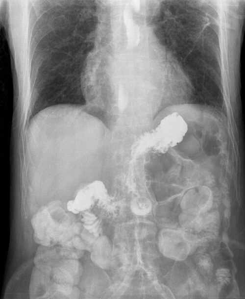

# REFLUXO GASTROESOFÁGICO

Para começarmos nossa conversa sobre o refluxo na pediatria, você precisa ter uma distinção muito clara na sua cabeça, pois é aqui que as bancas de residência ganham o jogo: a diferença entre o "Golfador Feliz" e a criança com Doença do Refluxo Gastroesofágico (DRGE).

O Refluxo Gastroesofágico (RGE) é um processo fisiológico. É a passagem do conteúdo gástrico para o esôfago, com ou sem regurgitação e vômito. Quase todo lactente tem isso. Já a DRGE é quando esse refluxo causa sintomas incômodos ou complicações (como esofagite, baixo ganho de peso ou sintomas respiratórios).

No MedEvo, sempre batemos na tecla: se o bebê está ganhando peso e está feliz, o problema é da lavadeira que vai lavar a roupa suja, não do médico.

*Figura 1 - Doença do Refluxo Gastroesofágico (DRGE): ilustração mostrando o refluxo do conteúdo gástrico para o esôfago devido à incompetência do esfíncter esofágico inferior. Fonte: BruceBlaus, CC BY-SA 4.0 | Wikimedia Commons*

## Fisiopatologia: Por que o bebê reflui tanto?

Você já se perguntou por que o lactente é o "paciente padrão" do refluxo? Não é apenas um fator, mas um conjunto deles. O principal mecanismo, e isso cai muito em prova, são os Relaxamentos Transitórios do Esfíncter Esofágico Inferior (RTEEI).

Diferente do adulto, onde muitas vezes temos uma hipotonia mantida do esfíncter, no bebê o esfíncter "abre do nada" sem que haja uma deglutição. Por que isso acontece? Pela distensão gástrica (estômago cheio de leite) e pela imaturidade dos mecanismos de controle.

Além disso, some os seguintes fatores:

- Dieta exclusivamente líquida (leite).

- Volume ingerido muito alto proporcionalmente ao tamanho do estômago.

- Posição predominantemente horizontal (decúbito dorsal).

- Esôfago curto.

- Ângulo de His mais obtuso (o que facilita a subida do conteúdo).

Entender isso é fundamental para você não sair prescrevendo remédio para todo mundo. Se a causa é imaturidade e anatomia, o tempo é o melhor tratamento.

## O Espectro Clínico: Do Fisiológico ao Patológico

### O Lactente Regurgitador (RGE Fisiológico)

Este é o famoso "Golfador Feliz". Ele apresenta regurgitações frequentes, geralmente pós-prandiais, mas mantém um excelente ganho pondero-estatural. O exame físico é completamente normal e a criança não demonstra irritabilidade excessiva durante os episódios.

A evolução natural é a melhora com o tempo. O pico dos sintomas ocorre por volta dos 4 meses de vida, e cerca de 80% a 90% dos casos resolvem-se espontaneamente até os 12 meses, coincidindo com a postura ereta e a introdução de alimentos sólidos.

### Doença do Refluxo Gastroesofágico (DRGE)

Aqui o cenário muda. Suspeitamos de DRGE quando o refluxo traz "prejuízo". Os sinais de alerta que você deve buscar no enunciado da questão são:

- Recusa alimentar e irritabilidade importante (choro durante ou logo após as mamadas).

- Baixo ganho de peso ou perda ponderal (desaceleração da curva de crescimento).

- Sintomas respiratórios de repetição (sibilância recorrente, pneumonia aspirativa, tosse crônica).

- Esofagite (que pode levar a anemia ferropriva por perda oculta ou hematêmese).

### Síndrome de Sandifer

Esta é uma "pérola" de prova. É uma manifestação atípica da DRGE onde a criança apresenta posturas anormais do pescoço (torcicolo paroxístico) e arqueamento das costas (opistótono).

Muitas vezes, o aluno confunde isso com crise convulsiva ou problema neurológico. Na verdade, é uma tentativa reflexa da criança de proteger as vias aéreas e reduzir o desconforto causado pelo refluxo ácido. Se aparecer "lactente com movimentos distônicos de pescoço associados à alimentação", marque DRGE/Sandifer sem medo.

*Figura 2 - Radiografia contrastada demonstrando refluxo gastroesofágico: o contraste de bário migra do estômago para o esôfago, evidenciando o refluxo. Fonte: Steven Fruitsmaak, CC BY-SA 3.0 | Wikimedia Commons*

## Diagnóstico Diferencial: Onde moram as pegadinhas

Este é o ponto mais importante desta aula. As bancas amam colocar um lactente que vomita e pedir o diagnóstico. Você precisa saber diferenciar o RGE de três grandes vilões: Estenose Hipertrófica de Piloro, APLV e Má Rotação Intestinal.

### Estenose Hipertrófica de Piloro (EHP)

A EHP é a principal causa de cirurgia abdominal no lactente jovem. Grave estes marcos:

- **Idade:** Geralmente entre 2 e 8 semanas de vida (raro após os 3 meses).

- **Vômitos:** Em jato, não biliosos, progressivos e sempre após as mamadas.

- **Estado do bebê:** O bebê tem "fome voraz". Ele vomita e quer mamar logo em seguida. Com o tempo, ele desidrata e para de ganhar peso.

- **Exame físico:** Massa palpável em hipocôndrio direito/epigástrio, conhecida como "oliva pilórica". Pode haver ondas peristálticas visíveis (ondas de Kussmaul).

- **Distúrbio Metabólico:** Alcalose metabólica hipoclorêmica e hipocalêmica. Por que? Porque ele perde ácido clorídrico (H+ e Cl-) no vômito e o rim, tentando poupar volume, acaba excretando potássio.

### Alergia à Proteína do Leite de Vaca (APLV)

Muitas vezes a APLV se manifesta com vômitos e regurgitações, mimetizando a DRGE. Como diferenciar? Na APLV, é comum haver outros sinais como:

- Diarreia com estrias de sangue ou muco.

- Dermatite atópica grave.

- História familiar de atopia.

- Irritabilidade que não melhora com medidas para refluxo.

Se a questão trouxer um lactente com baixo ganho de peso, irritabilidade e regurgitação, e mencionar que ele usa fórmula infantil ou que a mãe consome muito leite, a conduta pode ser um teste terapêutico com dieta de exclusão.

### Má Rotação Intestinal e Vólvulo

Aqui o sinal de alerta máximo é o **vômito bilioso**. No RGE e na EHP, o vômito NÃO é bilioso (pois a obstrução ou o refluxo ocorrem acima da ampola de Vater). Se o bebê vomita verde, você deve pensar em obstrução distal ao duodeno, como o vólvulo de intestino médio, que é uma emergência cirúrgica.

**Tabela 1: Diferenciação dos Vômitos no Lactente**

| Característica | RGE Fisiológico | DRGE | Estenose de Piloro | APLV |
| --- | --- | --- | --- | --- |
| **Idade de início** | Nascimento a 4 meses | Qualquer idade | 2 a 8 semanas | Geralmente < 6 meses |
| **Tipo de vômito** | Regurgitação leve | Variável | Em jato, não bilioso | Variável |
| **Ganho de peso** | Normal | Prejudicado | Muito prejudicado | Pode estar prejudicado |
| **Estado Geral** | "Golfador Feliz" | Irritável | Fome voraz / Desidratado | Irritável / Atópico |
| **Exame Físico** | Normal | Normal ou dor | Oliva pilórica | Dermatite / Sangue fezes |

## Investigação Complementar: Quando pedir exames?

Cuidado: no RGE fisiológico, o diagnóstico é CLÍNICO. Não se pede exame para quem está bem. O Dr. Will sempre lembra que pedir exame desnecessário gera ansiedade materna e gastos inúteis.

Os exames são reservados para a DRGE ou para dúvidas diagnósticas:

- **EED (Estudo Contrastado de Esôfago, Estômago e Duodeno):** Serve para avaliar a ANATOMIA. É excelente para ver se há estenoses, membranas ou má rotação. Ele NÃO serve para diagnosticar DRGE, pois um refluxo de contraste durante o exame pode ser fisiológico.

- **pH-metria de 24 horas:** É o padrão-ouro para detectar refluxo ÁCIDO. Avalia a frequência e a duração dos episódios de queda do pH esofágico abaixo de 4. É útil para correlacionar sintomas (como tosse ou apneia) com episódios de refluxo.

- **Impedâncio-pH-metria:** É superior à pH-metria isolada porque detecta refluxos não ácidos (líquidos ou gasosos). É o melhor exame para avaliar sintomas atípicos e crianças que continuam com sintomas mesmo em uso de IBP.

- **Endoscopia Digestiva Alta (EDA) com Biópsia:** Fundamental para diagnosticar complicações como esofagite, estenose esofágica ou Esôfago de Barrett. Lembre-se: na pediatria, a biópsia é obrigatória, pois pode haver esofagite microscópica mesmo com mucosa macroscopicamente normal. Além disso, ajuda a excluir Esofagite Eosinofílica.

- **Ultrassonografia de Abdome:** É o exame de escolha (padrão-ouro) para confirmar a **Estenose Hipertrófica de Piloro**. Ela vai medir a espessura do músculo pilórico (> 3-4mm) e o comprimento do canal pilórico (> 14-17mm).

## Manejo Terapêutico

### 1. Medidas Não Farmacológicas (O primeiro passo sempre!)

Para o "Golfador Feliz", o tratamento é apenas orientação e tranquilização dos pais. Para casos de DRGE leve ou RGE incomodativo, as diretrizes da SBP recomendam:

- **Posicionamento:** O bebê deve ser mantido em decúbito dorsal (barriga para cima) para dormir. **Atenção:** Embora o decúbito ventral (prona) ou lateral reduza o refluxo, eles aumentam drasticamente o risco de Síndrome da Morte Súbita do Lactente (SIDS). Portanto, para dormir, SEMPRE decúbito dorsal. A elevação da cabeceira do berço não tem evidência científica de melhora e não é mais recomendada rotineiramente.

- **Dieta:** Evitar superalimentação (volumes muito grandes). Para bebês em fórmula, pode-se usar fórmulas espessadas (AR - Antirregurgitação). O espessamento não reduz o número de episódios de refluxo, mas reduz o número de vômitos visíveis (o conteúdo fica mais pesado e difícil de subir).

- **Exclusão de PLV:** Em lactentes com sintomas persistentes de DRGE, a SBP sugere um teste de 2 a 4 semanas com dieta de exclusão de proteína do leite de vaca (na mãe, se aleitamento exclusivo, ou usando fórmulas de aminoácidos/extensamente hidrolisadas).

### 2. Tratamento Farmacológico

Só deve ser iniciado se houver evidência de DRGE (esofagite comprovada ou sintomas claros de complicação).

- **Inibidores de Bomba de Prótons (IBP):** Omeprazol (dose de 1 mg/kg/dia). São a primeira escolha para o tratamento da esofagite e para o alívio dos sintomas relacionados ao ácido. O tempo de tratamento costuma ser de 4 a 8 semanas.

- **Antagonistas H2:** Ranitidina (hoje em desuso por questões regulatórias/contaminação, mas ainda pode aparecer em provas antigas).

- **Procinéticos (Domperidona, Metoclopramida):** Cuidado aqui! As diretrizes atuais (NASPGHAN/ESPGHAN e SBP) NÃO recomendam o uso rotineiro de procinéticos para DRGE. Eles têm muitos efeitos colaterais (arritmias, sintomas extrapiramidais) e pouca eficácia na cicatrização da esofagite.

### 3. Tratamento Cirúrgico

A Fundoplicatura a Nissen é reservada para casos graves e refratários:

- Crianças com neuropatias graves (paralisia cerebral) com risco alto de aspiração.

- Estenoses esofágicas que não respondem ao tratamento clínico.

- Doença pulmonar crônica grave por aspiração comprovada.

## Situações Especiais e Complicações

### O Lactente com Paralisia Cerebral

Este é um público de altíssimo risco para DRGE grave. Eles têm hipotonia, passam muito tempo deitados, têm disfunção da deglutição e constipação crônica (que aumenta a pressão intra-abdominal). Nesses pacientes, muitas vezes a gastrostomia associada à válvula antirrefluxo é necessária para garantir a nutrição e proteger o pulmão.

### Cólica do Lactente vs. Refluxo

Muitas mães chegam ao consultório achando que o choro é refluxo. Lembre-se dos **Critérios de Wessel** para cólica: choro por mais de 3 horas por dia, pelo menos 3 dias por semana, por pelo menos 3 semanas, em um bebê que cresce bem. A cólica é fisiológica e autolimitada; o refluxo patológico causa outros sinais além do choro isolado.

### Disquezia do Lactente

Outra confusão comum. O bebê faz força, fica vermelho, chora por 10-20 minutos e depois evacua fezes MOLES. Isso não é constipação nem dor por refluxo. É apenas a falta de coordenação entre o aumento da pressão abdominal e o relaxamento do esfíncter anal. Conduta: tranquilizar.

## Manejo da Estenose Hipertrófica de Piloro (EHP)

Se o diagnóstico for EHP, o tratamento NÃO é clínico. É cirúrgico: **Piloromiotomia a Fredet-Ramstedt**.
Mas atenção à pegadinha de prova: a cirurgia NUNCA é uma emergência imediata. A prioridade absoluta é a correção dos distúrbios hidroeletrolíticos e da desidratação. Você primeiro estabiliza a alcalose e o potássio, e depois opera.

**Tabela 2: Resumo de Condutas na DRGE Pediátrica**

| Cenário Clínico | Conduta Inicial |
| --- | --- |
| Lactente que regurgita e ganha peso | Tranquilizar pais, orientar decúbito dorsal. |
| Lactente com irritabilidade e baixo ganho de peso | Investigar APLV (dieta de exclusão) ou DRGE. |
| Suspeita de Esofagite | EDA com biópsia + IBP (4-8 semanas). |
| Vômitos em jato + alcalose (< 2 meses) | USG de abdome (buscar EHP). |
| Vômitos biliosos | Radiografia/Contrastado urgente (excluir vólvulo). |
| Sintomas respiratórios crônicos / Sandifer | pH-metria ou Impedâncio-pH-metria. |

## Pontos-Chave para Prova

- O principal mecanismo do RGE no lactente são os **Relaxamentos Transitórios do Esfíncter Esofágico Inferior (RTEEI)**.

- **Golfador Feliz:** Lactente com regurgitação, mas com bom ganho de peso e desenvolvimento. Conduta: Observação e orientações.

- **Sinais de Alarme:** Vômitos biliosos, início após 6 meses de vida, hematêmese, diarreia, febre, letargia, hepatoesplenomegalia e fontanela abaulada.

- **Estenose Hipertrófica de Piloro:** Lactente de 2-8 semanas, vômitos em jato não biliosos, fome voraz, alcalose metabólica hipoclorêmica.

- **Diagnóstico de EHP:** Ultrassonografia abdominal é o padrão-ouro (espessura do músculo > 3mm).

- **Síndrome de Sandifer:** Postura distônica de pescoço e tronco associada ao refluxo. Frequentemente confundida com convulsão.

- **Posicionamento:** Para dormir, SEMPRE decúbito dorsal (prevenção de SIDS), mesmo em quem tem refluxo.

- **Tratamento Farmacológico:** IBP (Omeprazol) é a primeira escolha para esofagite. Procinéticos devem ser evitados.

- **Esofagite:** O diagnóstico definitivo exige biópsia esofágica na EDA, pois a mucosa pode parecer normal a olho nu.

- **APLV:** É o principal diagnóstico diferencial de DRGE em lactentes com sintomas sistêmicos ou irritabilidade. O teste é a dieta de exclusão de leite e derivados da dieta materna ou uso de fórmulas especiais.

- **Vômito Bilioso:** É sinal de obstrução distal à ampola de Vater (ex: vólvulo, atresia duodenal). Nunca é "apenas refluxo".

- **Impedâncio-pH-metria:** Exame de escolha para avaliar refluxo não ácido e sintomas atípicos.

- **Alcalose na EHP:** É hipoclorêmica e hipocalêmica. A correção hidroeletrolítica deve preceder a cirurgia.

- **Fumo Passivo:** É um fator de risco importante, pois aumenta os relaxamentos transitórios do esfíncter esofágico inferior.

- **Critérios de Wessel:** Definem a cólica do lactente (regra dos 3). Não confundir com a irritabilidade da DRGE. 💡

Ao revisar este material, foque especialmente na diferenciação entre o fisiológico e o patológico e nas características da Estenose de Piloro. Estes dois tópicos somam mais de 70% das questões sobre o tema em provas de residência médica no Brasil.

 Cópia offline para consulta pessoal.
 Fonte original:
 [https://www.medevo.com.br/material-apoio/ler/e4f6bcf8-91df-4398-aad6-877c645af1e8](https://www.medevo.com.br/material-apoio/ler/e4f6bcf8-91df-4398-aad6-877c645af1e8)
