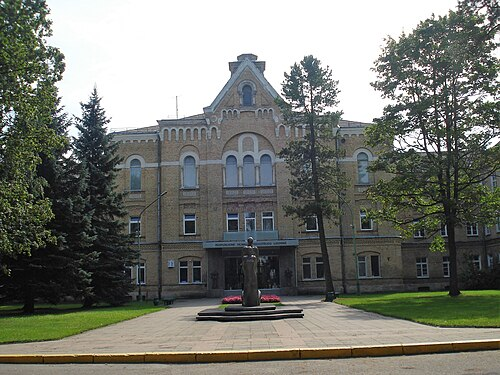

# REFORMA PSIQUIÁTRICA

Para entender a Reforma Psiquiátrica Brasileira (RPB), você precisa primeiro esquecer a ideia de que ela é apenas um conjunto de leis. Ela é, acima de tudo, uma mudança de paradigma. Antes, o foco era a doença e o isolamento, hoje, o foco é o sujeito e o território. Se você entender essa lógica, as questões de Medicina Preventiva e Social se tornam muito mais intuitivas.

Historicamente, o modelo era o hospitalocêntrico. O paciente "atrapalhava" a sociedade, então era trancado em hospitais psiquiátricos, os manicômios. A Reforma vem para dizer que o tratamento deve ocorrer em liberdade, priorizando a rede comunitária. No Brasil, esse movimento ganhou força nos anos 70 e culminou na Lei 10.216 de 2001, que é o marco legal que você deve ter na ponta da língua.

*Figura 1 - Narrenturm de Viena (1784): primeiro hospital psiquiátrico do mundo, símbolo do modelo manicomial que a Reforma Psiquiátrica brasileira busca superar. Fonte: Gryffindor, CC BY 2.5 | Wikimedia Commons*

## O Marco Legal: Lei 10.216/2001

Esta lei não extinguiu os hospitais psiquiátricos da noite para o dia, mas redirecionou o modelo assistencial. Ela dispõe sobre a proteção e os direitos das pessoas portadoras de transtornos mentais. O ponto central aqui é a desinstitucionalização.

Por que desinstitucionalizar? Porque o isolamento prolongado gera a chamada "síndrome da institucionalização", onde o indivíduo perde a autonomia, os vínculos sociais e a própria identidade. A lei garante que o paciente deve ser tratado, preferencialmente, em serviços comunitários de saúde mental.

### Direitos do Paciente

A lei assegura que a pessoa com transtorno mental tem direito ao melhor tratamento do sistema de saúde, consentâneo às suas necessidades, e a ser protegida contra qualquer forma de abuso e exploração. Além disso, garante o direito de ser tratada em ambiente o menos restritivo possível.

Cuidado com as pegadinhas de prova: a banca pode sugerir que a internação é proibida. Isso é falso. A internação é permitida, mas apenas quando os recursos extra-hospitalares se mostrarem insuficientes. Ela deve ter finalidade terapêutica e ser o mais breve possível.

### Modalidades de Internação

Este é um dos temas que o MedEvo sempre destaca como recorrente. Você precisa diferenciar as três modalidades de internação previstas na Lei 10.216:

- **Internação Voluntária:** Aquela que se dá com o consentimento do usuário. O paciente assina uma declaração de que optou por esse regime. Importante: se o paciente quiser sair, ele tem direito à alta voluntária, a menos que o médico identifique risco iminente, o que mudaria o status da internação.

- **Internação Involuntária:** Ocorre sem o consentimento do usuário e a pedido de terceiros (geralmente familiares). Atenção aqui: o médico deve comunicar o Ministério Público Estadual em até 72 horas após a internação e também após a alta.

- **Internação Compulsória:** É determinada pela justiça. Não depende da vontade do paciente ou da família, mas sim de uma ordem judicial, geralmente após laudo médico atestando a necessidade.

| Modalidade | Consentimento | Quem solicita/determina | Comunicação ao MP |
| --- | --- | --- | --- |
| Voluntária | Sim | O próprio paciente | Não necessária |
| Involuntária | Não | Familiares ou responsáveis | Sim (em 72h) |
| Compulsória | Irrelevante | Juiz competente | Já ocorre via processo |

*Figura 2 - Hospital Psiquiátrico Republicano de Vilnius (1902): exemplo de instituição psiquiátrica tradicional que a Reforma Psiquiátrica busca substituir por serviços comunitários. Fonte: Domínio Público | Wikimedia Commons*

## Rede de Atenção Psicossocial (RAPS)

A RAPS, instituída pela Portaria 3.088/2011, é a estrutura que operacionaliza a Reforma Psiquiátrica. Imagine a RAPS como uma teia. Se um ponto falha, o outro deve sustentar o paciente. Ela é composta por vários componentes, e a prova vai querer saber se você sabe onde o paciente deve estar em cada situação.

### Atenção Primária à Saúde (APS)

Aqui está o coração da rede. A Estratégia Saúde da Família (ESF) é responsável pelo cuidado em saúde mental no território. O erro clássico de prova é achar que "caso grave vai direto para o CAPS e a UBS esquece o paciente". Errado. A APS mantém a responsabilidade pelo cuidado, fazendo o acompanhamento longitudinal e o vínculo.

O apoio à APS é feito pelo NASF (Núcleo de Apoio à Saúde da Família), através do Apoio Matricial. O matriciamento não é um encaminhamento simples, é um compartilhamento de saberes. O especialista do NASF e a equipe da ESF discutem o caso e constroem juntos a conduta.

### Atenção Psicossocial Especializada

Aqui entram os CAPS (Centros de Atenção Psicossocial). Eles são serviços de saúde municipais, abertos e comunitários. O CAPS não é um "ambulatorinho" de passar receita, é um lugar de reabilitação psicossocial.

Existem diferentes tipos de CAPS, e as bancas adoram cobrar as diferenças:

| Tipo de CAPS | Público-alvo | Funcionamento | População de referência |
| --- | --- | --- | --- |
| CAPS I | Geral (todas as idades) | Horário comercial | Municípios > 15 mil hab. |
| CAPS II | Adultos | Horário comercial | Municípios > 70 mil hab. |
| CAPS III | Adultos (casos graves) | 24 horas (com acolhimento noturno) | Municípios > 150 mil hab. |
| CAPS i | Crianças e adolescentes | Horário comercial | Municípios > 70 mil hab. |
| CAPS ad | Álcool e Drogas | Horário comercial | Municípios > 70 mil hab. |
| CAPS ad III | Álcool e Drogas (casos graves) | 24 horas | Municípios > 150 mil hab. |

### Outros Componentes da RAPS

- **Atenção de Urgência e Emergência:** SAMU 192, UPA 24h e prontos-socorros. O paciente em crise aguda deve ser estabilizado aqui antes de ser encaminhado para outros pontos da rede.

- **Atenção Residencial de Caráter Transitório:** Unidades de Acolhimento (UA) para usuários de substâncias.

- **Estratégias de Desinstitucionalização:** Serviços de Residência Terapêutica (SRT). São casas inseridas na comunidade para pessoas que passaram anos internadas e perderam o vínculo familiar.

- **Reabilitação Psicossocial:** Iniciativas de geração de renda e trabalho, como cooperativas e oficinas.

## Projeto Terapêutico Singular (PTS)

O PTS é uma ferramenta fundamental da Clínica Ampliada. Como o próprio nome diz, ele é "singular", ou seja, feito sob medida para aquele indivíduo específico. Não existe "receita de bolo" no PTS.

O PTS é um conjunto de propostas de condutas terapêuticas articuladas, para um sujeito individual ou coletivo, resultado da discussão coletiva de uma equipe interdisciplinar. Ele geralmente é dividido em quatro momentos:

- **Diagnóstico e Análise da Situação:** Não é apenas o diagnóstico da CID-10. É entender a vulnerabilidade, os riscos, a rede de apoio e os desejos do paciente.

- **Definição de Objetivos e Metas:** O que queremos alcançar? As metas devem ser realistas e pactuadas com o paciente.

- **Divisão de Responsabilidades:** Quem faz o quê? É preciso definir um "técnico de referência" que será o principal articulador do caso.

- **Reavaliação:** O PTS é dinâmico. Se a meta não foi atingida ou o quadro mudou, o plano deve ser revisto.

Imagine um paciente, Sr. João, 45 anos, com esquizofrenia, que parou de tomar a medicação porque quer voltar a trabalhar na marcenaria, mas o remédio dá muito tremor. Um PTS para ele não seria apenas "trocar a medicação". Seria articular com a marcenaria do bairro, ajustar a dose para reduzir o tremor, envolver a família no suporte e garantir que ele frequente as oficinas de reabilitação no CAPS. Percebe a complexidade? Isso é integralidade.

## Reabilitação Psicossocial e Autonomia

Um conceito que cai muito é o de Reabilitação Psicossocial. Muitos alunos erram ao achar que reabilitar é "curar" o transtorno. Na verdade, reabilitar em saúde mental significa aumentar a contratualidade social do sujeito.

Isso envolve focar nos recursos, talentos e estratégias do paciente para minimizar a incapacidade mental. O objetivo é a autonomia. Autonomia não é fazer tudo sozinho, mas ter a capacidade de decidir sobre a própria vida, mesmo com limitações. O tratamento deve promover autonomia, não dependência. Por isso, o acolhimento e a escuta ativa são pilares essenciais.

## Níveis de Prevenção em Saúde Mental

A saúde coletiva divide a prevenção em níveis, e na saúde mental isso é aplicado de forma muito específica. Dr. Will costuma lembrar que as bancas amam misturar esses conceitos.

- **Prevenção Primária:** Foca em evitar o surgimento do transtorno. Exemplo: programas de combate ao bullying nas escolas ou intervenções em grupos de risco (como filhos de pais com depressão grave).

- **Prevenção Secundária:** Foca no diagnóstico precoce e tratamento imediato para evitar a progressão. Exemplo: rastreamento de depressão pós-parto na UBS.

- **Prevenção Terciária:** Foca em reduzir as sequelas e a incapacidade. É aqui que entra a reabilitação psicossocial.

- **Prevenção Quaternária:** Foca em evitar a iatrogenia, o excesso de medicalização e intervenções desnecessárias. Em saúde mental, isso é vital para evitar o "rótulo" desnecessário de doente mental.

- **Prevenção Quinquenária:** Este é um conceito mais recente e muito cobrado. Refere-se ao cuidado com a saúde do profissional de saúde. Um médico ou enfermeiro com Burnout coloca em risco a segurança do paciente. Cuidar de quem cuida é prevenção quinquenária.

## Saúde Mental e Trabalho

O trabalho pode ser tanto um fator de proteção quanto um fator de risco para a saúde mental. A epidemiologia ocupacional mostra uma alta prevalência de transtornos psíquicos relacionados ao trabalho, como a Síndrome de Burnout.

Quando um paciente apresenta sintomas psíquicos, o médico deve investigar os determinantes sociais e as condições de trabalho. Não basta tratar o sintoma, é preciso intervir na causa. O Burnout, por exemplo, é um fenômeno ocupacional, caracterizado por exaustão emocional, despersonalização e baixa realização profissional.

## Bullying: Definição e Impacto

O bullying é um tema que migrou da educação para a saúde pública devido ao seu impacto na saúde mental. A Lei 13.185/2015 instituiu o Programa de Combate à Intimidação Sistemática (Bullying).

Para ser considerado bullying, a violência deve ser:

- Intencional.

- Repetitiva.

- Ocorrer em uma relação de desequilíbrio de poder.

Um detalhe importante para a prova: o bullying pode ser praticado por adultos contra alunos, e não apenas entre pares. As consequências incluem depressão, ansiedade, queda no rendimento escolar e, em casos graves, ideação suicida. A abordagem deve ser intersetorial (saúde e escola).

## Educação Popular em Saúde e Saúde Mental

A Reforma Psiquiátrica bebe muito na fonte de Paulo Freire e da Educação Popular em Saúde. Os princípios aqui são:

- **Diálogo:** Não é uma imposição de saber médico, mas uma troca.

- **Amorosidade:** O cuidado envolve afeto e vínculo.

- **Problematização:** Levar o paciente a refletir sobre sua realidade para transformá-la.

- **Empoderamento:** Dar ferramentas para que o sujeito seja protagonista do seu tratamento.

Na Terapia Comunitária Integrativa, por exemplo, utiliza-se o conceito de resiliência, buscando transformar "feridas em pérolas". Ou seja, utilizar o sofrimento como base para o crescimento e fortalecimento do indivíduo e do grupo.

## Desafios Clínicos e Éticos

### O Paciente com Juízo Crítico Prejudicado

Imagine um paciente com esquizofrenia, em surto, com delírios persecutórios, que solicita a internação. Se ele solicita, ela é voluntária? Sim, formalmente. Porém, o médico deve avaliar se o juízo crítico está preservado. Se o paciente pede para ser internado porque acha que a CIA está tentando matá-lo na rua, a decisão médica de internar deve considerar o risco e a necessidade real de cuidado, independentemente da "vontade" delirante.

### Perspectiva Qualitativa

A investigação em saúde mental não pode ser apenas quantitativa (contar sintomas). Ela deve valorizar a perspectiva qualitativa, abordando a complexidade e a multicausalidade. O sofrimento mental é influenciado por determinantes sociais, biológicos e psicológicos. Por isso, o tratamento deve ser biopsicossocial.

### Vínculo e Implicação Clínica

Trabalhar em saúde mental exige o que chamamos de "trabalho clinicamente implicado". Isso significa que o profissional não é um observador neutro. Ele deve criar vínculo, escutar ativamente e se responsabilizar pelo desfecho do caso. Sem vínculo, não há adesão ao PTS.

## Resumo das Estruturas de Cuidado

Para facilitar a memorização, veja como a rede se organiza conforme a complexidade:

| Nível de Atenção | Principal Ator | Função Principal |
| --- | --- | --- |
| Atenção Primária | ESF / UBS | Coordenação do cuidado, vínculo, casos leves e moderados. |
| Apoio à Primária | NASF-AB | Matriciamento, discussão de casos, suporte especializado. |
| Atenção Especializada | CAPS | Casos graves e persistentes, reabilitação, crise. |
| Urgência | UPA / SAMU | Estabilização da crise aguda, risco de vida. |
| Hospitalar | Leitos em Hosp. Geral | Internação de curtíssima duração quando a rede extra-hospitalar falha. |

Lembre-se: o Hospital Psiquiátrico (Manicômio) está em extinção no modelo da Reforma. A internação, quando necessária, deve ocorrer preferencialmente em leitos de saúde mental dentro de Hospitais Gerais. Isso evita o estigma e garante que o paciente tenha acesso a outras especialidades médicas se precisar.

## Diagnóstico Diferencial e Abordagem

Ao atender um paciente com queixa de saúde mental na atenção básica, o primeiro passo é descartar causas orgânicas. Hipotireoidismo pode mimetizar depressão, deficiência de B12 pode causar sintomas psicóticos em idosos, e infecções urinárias podem causar delirium.

Após descartar o orgânico, a classificação deve seguir o sofrimento do paciente. O acolhimento é a ferramenta de ouro. Acolher não é apenas "dar bom dia", é escutar a demanda, classificar o risco e dar uma resposta positiva, seja um agendamento, uma conversa ou um encaminhamento.

## Pontos-Chave para Prova

- **Lei 10.216/2001:** É o marco legal da Reforma Psiquiátrica. Prioriza o tratamento em serviços comunitários e define os tipos de internação.

- **Internação Involuntária:** Exige comunicação ao Ministério Público em até 72 horas. Não confunda com a compulsória (judicial).

- **PTS (Projeto Terapêutico Singular):** Possui 4 etapas: Diagnóstico, Metas, Responsabilidades e Reavaliação. É a base do cuidado individualizado.

- **Matriciamento:** É a relação entre o NASF e a ESF. Não é encaminhamento, é compartilhamento de cuidado e saber.

- **CAPS III e CAPS ad III:** São os únicos que funcionam 24 horas com acolhimento noturno.

- **Reabilitação Psicossocial:** O objetivo é aumentar a autonomia e a contratualidade social, não necessariamente a "cura" dos sintomas.

- **Prevenção Quinquenária:** Foca na saúde do trabalhador da saúde para garantir a segurança do paciente.

- **Bullying (Lei 13.185/2015):** Deve ser intencional, repetitivo e com desequilíbrio de poder. Pode ser praticado por adultos contra crianças.

- **Educação Popular (Paulo Freire):** Baseia-se no diálogo, amorosidade, problematização e empoderamento.

- **APS como Coordenadora:** A Atenção Primária nunca perde a responsabilidade pelo paciente, mesmo que ele esteja em acompanhamento no CAPS.

- **Desinstitucionalização:** Processo de retirar o paciente do isolamento manicomial e reinseri-lo na sociedade (ex: Residências Terapêuticas).

- **Primeira Escolha na Crise:** O acolhimento e a escuta ativa. A medicalização deve ser criteriosa (Prevenção Quaternária).

- **Erro Comum:** Achar que o CAPS é a porta de entrada única da saúde mental. A porta de entrada preferencial é a Atenção Primária (UBS/ESF).

- **Internação em Hospital Geral:** É a recomendação atual para casos que precisam de hospitalização, evitando os hospitais psiquiátricos isolados.

- **Vínculo Terapêutico:** É ferramenta clínica, não apenas "educação". Sem vínculo, não há eficácia no tratamento de transtornos mentais crônicos. 🧠

 Cópia offline para consulta pessoal.
 Fonte original:
 [https://www.medevo.com.br/material-apoio/ler/3d239e57-8763-4192-b76e-5fd95d006228](https://www.medevo.com.br/material-apoio/ler/3d239e57-8763-4192-b76e-5fd95d006228)
