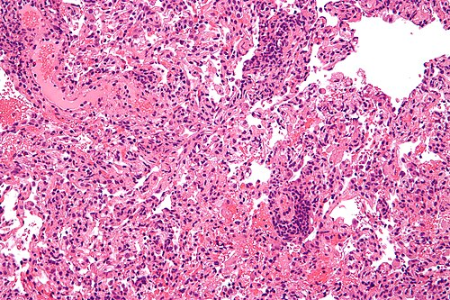
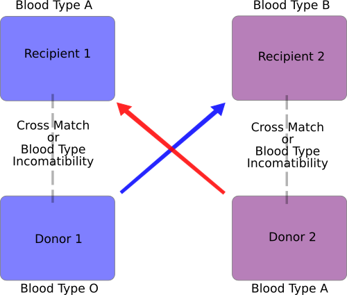

# REJEIÇÃO E IMUNOSSUPRESSÃO

Para entender transplante, você precisa parar de pensar no órgão como uma "peça de reposição" e começar a vê-lo como um "invasor biológico". O sistema imunológico do receptor não sabe que aquele rim ou fígado está lá para salvar sua vida; ele só vê proteínas estranhas que precisam ser destruídas.

Nesta aula, vamos dissecar como o corpo identifica esse invasor, como ele tenta expulsá-lo (rejeição) e como nós, médicos, "enganamos" o sistema imune para que ele aceite o novo hóspede (imunossupressão).

*Figura 1 - Rejeição aguda de transplante pulmonar: micrografia mostrando infiltrado linfocitário perivascular, achado histológico característico da rejeição celular aguda. Coloração H&E. Fonte: Nephron, CC BY-SA 3.0 | Wikimedia Commons*

## A Base de Tudo: O Sistema HLA e a Compatibilidade

Antes de falarmos de rejeição, precisamos entender o que o corpo está vigiando. O "RG" das nossas células é o sistema HLA (*Human Leukocyte Antigen*), ou Complexo de Histocompatibilidade Principal (MHC).

Existem dois tipos principais que você deve levar para a prova:

- **HLA Classe I (A, B, C):** Presente em todas as células nucleadas. É o que diz ao linfócito T citotóxico (CD8+): "Eu sou eu, não me mate".

- **HLA Classe II (DR, DQ, DP):** Presente em células apresentadoras de antígenos (macrófagos, células dendríticas). É o que diz ao linfócito T auxiliar (CD4+): "Olha o que eu achei, vamos montar um ataque".

**Dica de Prova:** A compatibilidade HLA é fundamental no transplante de rim e medula óssea, mas no transplante de fígado, ela é secundária. No fígado, o que manda é a compatibilidade ABO e o tamanho do órgão. Por que? Porque o fígado é um órgão "imunologicamente privilegiado", ele tolera melhor as incompatibilidades HLA do que o rim.

### A Barreira ABO

Nunca esqueça: a compatibilidade ABO é o primeiro filtro. Se você transplantar um órgão de um doador A para um receptor O, os anticorpos anti-A já presentes no receptor vão destruir o órgão em minutos. Isso nos leva ao nosso primeiro grande tema.

## Rejeição Hiperaguda: O Desastre na Mesa de Cirurgia

Imagine a cena: o cirurgião termina as anastomoses vasculares, solta os clamps, o órgão cora por alguns segundos e, de repente, ele fica cianótico, mosqueado e tenso. Isso é a rejeição hiperaguda.

**Por que acontece?**
Porque o receptor já tinha anticorpos pré-formados contra o doador. O sistema imune não precisou "aprender" a atacar; as armas já estavam carregadas. Esses anticorpos (geralmente anti-HLA ou anti-ABO) se ligam ao endotélio do enxerto, ativam o sistema complemento, geram trombose maciça e necrose isquêmica.

**Quando ocorre?**
Em minutos a poucas horas após a revascularização.

**Como evitar? (O "Pulo do Gato" das Bancas)**
Fazendo a **Prova Cruzada (Crossmatch)** antes do transplante. Pegamos o soro do receptor e as células do doador. Se houver reação (lise celular), a prova cruzada é positiva e o transplante é contraindicado.

**Tratamento:**
Não existe tratamento eficaz para salvar o órgão. A conduta é a retirada imediata do enxerto (exérese).

| Característica | Rejeição Hiperaguda |
| --- | --- |
| **Tempo** | Minutos a Horas |
| **Mecanismo** | Anticorpos pré-formados + Complemento |
| **Fisiopatologia** | Trombose e necrose do enxerto |
| **Prevenção** | Prova cruzada (Crossmatch) e ABO |
| **Conduta** | Retirada do órgão |

## Rejeição Celular Aguda (RCA): O Dia a Dia do Transplantador

Esta é a forma mais comum de rejeição. Se a hiperaguda é mediada por anticorpos (imunidade humoral), a aguda é mediada por **Linfócitos T**.

**O "Porquê" da RCA:**
Os linfócitos T do receptor reconhecem o HLA do doador como estranho. Eles se proliferam e infiltram o órgão, causando inflamação.

**Quando ocorre?**
Geralmente após o 5º dia, sendo mais comum nos primeiros meses (até 6 meses). Mas atenção: ela pode ocorrer a qualquer momento se o paciente parar de tomar os remédios.

### O Caso Especial do Fígado (Pérola Clínica MedEvo)

As bancas de residência amam o transplante hepático. Na Rejeição Celular Aguda do fígado, você verá uma tríade clássica na biópsia:

- Infiltrado inflamatório no espaço porta.

- Lesão de ductos biliares (ductulite).

- Endotelialite (inflamação das veias portais ou centrais).

**Sinal Clínico Crítico:** No dreno biliar (tubo em T ou dreno de Kehr), você observará uma **diminuição do volume da bile** e a bile se tornará **mais clara (fluida)**.
*Erro comum de prova:* A alternativa vai dizer que a bile fica espessa e aumenta de volume. Mentira! O hepatócito e o ducto doente param de produzir e concentrar a bile adequadamente.

**Diagnóstico:**
O padrão-ouro é a **Biópsia**. No fígado, usamos o Escore de Banff (ou Critério de Rejeição de Snover). No rim, também usamos a classificação de Banff. Não se faz diagnóstico de rejeição apenas com exames de sangue (TGO/TGP ou Creatinina), eles apenas sugerem a necessidade da biópsia.

**Tratamento:**
Aqui a gente "pesa a mão" na imunossupressão. A primeira escolha é a **Pulsoterapia com Corticoide** (Metilprednisolona 500mg a 1g/dia por 3 dias). Se não responder, usamos anticorpos antilinfocitários (como a Timoglobulina).

## Rejeição Humoral Aguda (Mediada por Anticorpos)

Diferente da hiperaguda, aqui os anticorpos não estavam lá antes. O corpo os produziu *depois* do transplante. É mais difícil de tratar que a celular e tem pior prognóstico. O diagnóstico histopatológico depende da marcação do fragmento **C4d** (um subproduto do complemento). Se o patologista vir C4d positivo, pense em anticorpo.

## Rejeição Crônica: A Cicatriz Inevitável?

A rejeição crônica ocorre meses ou anos após o transplante. É um processo lento de fibrose.

**Fisiopatologia:**
É uma resposta imunológica de baixa intensidade e persistente que leva à oclusão arterial (arteriosclerose do enxerto) e fibrose do parênquima.

**Manifestações por Órgão:**

- **Rim:** Fibrose intersticial e atrofia tubular (FIAT). O paciente começa a perder função renal lentamente.

- **Fígado:** Síndrome do desaparecimento dos ductos biliares (Ductopenia).

- **Coração:** Arteriosclerose coronariana acelerada.

- **Pulmão:** Bronquiolite obliterante.

**Tratamento:**
Infelizmente, a rejeição crônica é pouco responsiva ao aumento da imunossupressão. O foco é o controle de fatores de risco (HAS, dislipidemia) e, eventualmente, o retransplante.

*Figura 2 - Troca pareada de rins (paired kidney exchange): diagrama mostrando como pares doador-receptor incompatíveis podem trocar órgãos entre si para viabilizar o transplante. Fonte: Protonk, CC BY-SA 3.0 | Wikimedia Commons*

## Imunossupressão: A Arte de Equilibrar o Jogo

Como diz o Dr. Will, "Imunossupressão é o equilíbrio entre a rejeição e a infecção". Se você der pouco, o paciente perde o órgão. Se der muito, ele morre de CMV ou sepse.

Dividimos o tratamento em duas fases: **Indução** e **Manutenção**.

### 1. Terapia de Indução

Feita no momento da cirurgia (intraoperatório e primeiros dias). O objetivo é "nocautear" o sistema imune logo de cara.

- **Anticorpos Monoclonais (Ex: Basiliximab):** Bloqueia o receptor de IL-2 (CD25) nos linfócitos T. É bem tolerado, usado em pacientes de baixo risco imunológico.

- **Anticorpos Policlonais (Ex: Timoglobulina - ATG):** Causa uma depleção profunda de linfócitos. Usado em pacientes de alto risco (retransplantes, prova cruzada positiva por citometria) ou quando queremos adiar o início dos inibidores de calcineurina para proteger o rim.

### 2. Terapia de Manutenção

É o que o paciente vai tomar pelo resto da vida. A regra de ouro é a **Terapia Tríplice**. Por que três drogas? Porque elas agem em pontos diferentes da ativação do linfócito, permitindo doses menores de cada uma e reduzindo a toxicidade.

A combinação clássica é:
**Inibidor de Calcineurina + Antimetabólito + Corticoide**

#### A) Inibidores de Calcineurina (A base de tudo)

Eles bloqueiam a produção de IL-2, impedindo a proliferação de linfócitos T.

- **Tacrolimus (FK506):** É a droga de escolha na maioria dos centros hoje. Mais potente que a ciclosporina.

- *Efeitos colaterais:* Nefrotoxicidade (vasoconstrição da arteríola aferente), Neurotoxicidade (tremores), Diabetes pós-transplante.

- **Ciclosporina:** Menos usada hoje.

- *Efeitos colaterais:* Hipertrofia gengival, hirsutismo, nefrotoxicidade.

#### B) Antimetabólitos (Inibidores da síntese de purinas)

Eles impedem que o linfócito se divida.

- **Micofenolato de Mofetila (ou Sódico):** Substituiu a Azatioprina na maioria dos protocolos por ser mais eficaz.

- *Efeitos colaterais:* **Gastrointestinais** (diarreia, gastrite) e Mielossupressão (leucopenia). Se o paciente tiver muita diarreia, a conduta é reduzir a dose ou trocar pelo sódico.

- **Azatioprina:** Mais barata, ainda usada em alguns protocolos. Cuidado com a interação com o **Alopurinol** (risco de aplasia de medula fatal!).

#### C) Inibidores da mTOR (O "Plano B")

- **Sirolimus e Everolimus:** Bloqueiam a resposta à IL-2.

- **Quando usar?** Frequentemente usados para substituir o Tacrolimus quando o paciente tem insuficiência renal (eles não são nefrotóxicos) ou quando há neoplasias (eles têm efeito antitumoral).

- **Cuidado:** Eles prejudicam a cicatrização. Nunca comece mTOR logo após a cirurgia; espere pelo menos 30 dias.

#### D) Corticoides

- **Prednisona:** Usada em doses decrescentes. Muitos protocolos tentam retirar o corticoide após 3-6 meses para evitar efeitos colaterais (osteopose, Cushing, catarata).

| Classe | Fármaco | Principal Efeito Colateral | Dica de Prova |
| --- | --- | --- | --- |
| **Inib. Calcineurina** | Tacrolimus | Nefrotoxicidade / Tremores | Droga principal do transplante |
| **Antimetabólito** | Micofenolato | Diarreia / Leucopenia | Não causa nefrotoxicidade |
| **Inib. mTOR** | Sirolimus | Deiscência de ferida | Ótimo para pacientes com câncer |
| **Corticoide** | Prednisona | Diabetes / Osteoporose | Usado na pulsoterapia da rejeição |

## Diagnóstico Diferencial: Nem tudo que reluz é Rejeição

Se um paciente transplantado de fígado chega com aumento de transaminases e queda do estado geral, você deve pensar em três coisas principais:

- **Rejeição:** (Já discutimos).

- **Problemas Vasculares:** Trombose de artéria hepática (uma catástrofe que pode simular rejeição). Diagnóstico: Doppler de artéria hepática.

- **Problemas Biliares:** Estenose de anastomose. Diagnóstico: Colangiorressonância ou CPRE.

No rim, o diferencial de uma creatinina que sobe inclui:

- **Toxicidade pelo Tacrolimus:** Sim, o remédio que protege o rim também pode atacá-lo. Como diferenciar? Dosagem do nível sérico de Tacrolimus e, se necessário, biópsia (a biópsia da toxicidade é diferente da biópsia da rejeição).

- **Obstrução Urinária:** Estenose do ureter ou linfocele comprimindo o enxerto.

## Complicações Infecciosas: O Calendário do Transplantado

Isso cai muito em provas de clínica e cirurgia. O risco de infecção depende do tempo pós-transplante:

- **Primeiro Mês:** Infecções hospitalares e cirúrgicas (abscessos, pneumonia, ITU, infecção da ferida). Bactérias da flora do hospital.

- **1º ao 6º Mês:** Infecções oportunistas (o período de maior imunossupressão).

- **CMV (Citomegalovírus):** A mais comum. Causa febre, leucopenia e pode afetar qualquer órgão (hepatite, colite, esofagite).

- **Pneumocistose (PJP):** Prevenida com Sulfametoxazol-Trimetoprima (Bactrim).

- **Fungos:** Candidíase, Criptococose.

- **Após 6 Meses:** Infecções comunitárias (Gripe, Pneumonia pneumocócica), a menos que o paciente tenha tido rejeição e precisado de mais pulsos de corticoide.

## Situações Especiais e Manejo Clínico

### Gestação e Transplante

A paciente transplantada pode engravidar? Sim, mas deve esperar pelo menos 1-2 anos de estabilidade do enxerto.
**Mudança Crítica:** O **Micofenolato é teratogênico**. Deve ser trocado pela Azatioprina pelo menos 6 semanas antes da concepção. O Tacrolimus e a Prednisona podem ser mantidos.

### O Paciente Idoso

No idoso, o sistema imune é mais "preguiçoso" (imunossenescência). Eles rejeitam menos, mas morrem mais de infecção. A tendência é usar protocolos de imunossupressão mais leves.

### Metas Terapêuticas

Não basta dar o remédio, tem que medir o nível no sangue.

- **Tacrolimus:** Geralmente mantemos entre 5-10 ng/mL nos primeiros meses.

- **Ciclosporina:** Níveis de 100-300 ng/mL.

- **Objetivo da Manutenção:** Inibir a ativação linfocitária para reduzir a rejeição, aumentar a sobrevida do enxerto e minimizar infecções oportunistas.

## Pontos-Chave para Prova 💡

- **Rejeição Hiperaguda:** Ocorre em minutos/horas por anticorpos pré-formados. O tratamento é a retirada do órgão. Prevenção: Prova cruzada (Crossmatch).

- **Rejeição Celular Aguda (RCA):** Mediada por Linfócitos T. É a mais comum. Tratamento inicial: Pulsoterapia com Metilprednisolona.

- **Bile no Transplante Hepático:** Na rejeição, o volume da bile **diminui** e ela fica **mais clara/fluida**.

- **Padrão-Ouro Diagnóstico:** Biópsia do enxerto (Classificação de Banff).

- **Tríade da Imunossupressão:** Inibidor de Calcineurina (Tacrolimus) + Antimetabólito (Micofenolato) + Corticoide.

- **Nefrotoxicidade:** Tacrolimus e Ciclosporina são nefrotóxicos (causam vasoconstrição da arteríola aferente). Micofenolato e Sirolimus NÃO são nefrotóxicos.

- **Micofenolato:** Principal efeito colateral é gastrointestinal (diarreia). É teratogênico.

- **Azatioprina + Alopurinol:** Interação perigosa! O alopurinol inibe a xantina oxidase, aumentando os níveis de azatioprina e causando aplasia de medula.

- **Sirolimus (mTOR):** Atrasa a cicatrização de feridas. Útil em pacientes com histórico de neoplasias.

- **CMV:** Infecção oportunista mais comum entre o 1º e 6º mês.

- **C4d Positivo:** Marcador histopatológico de Rejeição Humoral (por anticorpos).

- **Crossmatch Positivo:** Contraindicação absoluta ao transplante (exceto em protocolos experimentais de dessensibilização).

- **HLA no Fígado:** Menos importante que no rim. No fígado, priorizamos ABO e gravidade (MELD).

- **Linfócitos:** São as células-alvo da terapia de manutenção para evitar a rejeição.

- **Não confunda:** Rejeição hiperaguda (anticorpos pré-formados) com Rejeição aguda humoral (anticorpos formados *de novo* após o transplante).

- **Erro clássico:** Achar que aumento de TGO/TGP após transplante de fígado é sempre rejeição. Lembre-se da trombose de artéria hepática! Peça o Doppler.

Este material resume o que há de mais cobrado nas provas de residência do Brasil, seguindo as diretrizes da ABTO e os consensos internacionais de transplante. Revise as tabelas de fármacos, elas são o "feijão com arroz" das questões de imunossupressão.

 Cópia offline para consulta pessoal.
 Fonte original:
 [https://www.medevo.com.br/material-apoio/ler/2c32b332-8c71-4ed6-be3f-3e8db60319fe](https://www.medevo.com.br/material-apoio/ler/2c32b332-8c71-4ed6-be3f-3e8db60319fe)
