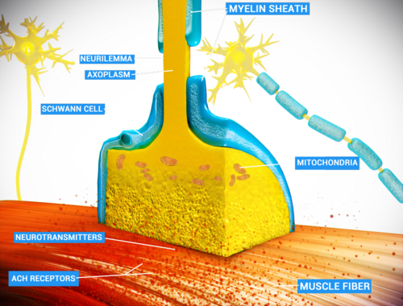

# RELAXANTES MUSCULARES

Para entender os relaxantes musculares — ou, tecnicamente, os Bloqueadores Neuromusculares (BNM) — você precisa primeiro visualizar a Junção Neuromuscular (JNM). Imagine que o nervo motor e o músculo estão tentando conversar. O nervo libera acetilcolina (ACh), que atravessa a fenda sináptica e se encaixa nos receptores nicotínicos na placa motora do músculo. Quando a ACh se liga, o canal se abre, o sódio entra, o potássio sai, ocorre a despolarização e o músculo contrai.

O BNM entra nessa história como um "intruso" que impede essa conversa. Se o músculo não recebe o sinal, ele não contrai. Por que fazemos isso na anestesia? Muitos alunos acham que é para o paciente não se mexer, mas isso é papel dos anestésicos (hipnóticos e opioides). O BNM serve para três coisas principais: facilitar a intubação orotraqueal (IOT), melhorar as condições cirúrgicas (relaxar o abdome, por exemplo) e facilitar a ventilação mecânica em casos graves.

Lembre-se: BNM NÃO é anestésico. Ele não tira a dor e não tira a consciência. Um erro imperdoável, tanto na prova quanto na vida, é paralisar um paciente que não está adequadamente sedado. Isso gera o pesadelo da "consciência intraoperatória com paralisia".

*Figura 1 - Junção neuromuscular (placa motora): diagrama mostrando receptores de acetilcolina e mitocôndrias do neurônio motor, local onde atuam os relaxantes musculares. Fonte: Paul Hege, CC BY-SA 4.0 | Wikimedia Commons*

## Fisiologia da Placa Motora e Receptores

O receptor nicotínico é uma proteína pentamérica (cinco subunidades). No adulto normal, temos duas subunidades alfa, uma beta, uma delta e uma épsilon. Para o canal abrir, duas moléculas de ACh precisam se ligar simultaneamente às duas subunidades alfa.

Aqui mora um conceito que as bancas amam: os **receptores extrajuncionais**. Em situações de denervação (paraplegia), queimaduras graves, imobilização prolongada ou infecções sistêmicas graves, o corpo tenta "compensar" a falta de sinal nervoso criando novos receptores. Esses receptores imaturos têm uma subunidade gama no lugar da épsilon.

Por que isso importa? Porque esses receptores extrajuncionais ficam abertos por muito mais tempo quando estimulados e estão espalhados por todo o músculo, não só na placa motora. Quando você usa succinilcolina nesses pacientes, a saída de potássio é massiva, levando à hipercalemia fatal.

## Classificação dos Bloqueadores Neuromusculares

Dividimos os BNMs em dois grandes grupos baseados no mecanismo de ação: Despolarizantes e Não-Despolarizantes.

### Bloqueadores Despolarizantes (Succinilcolina)

A succinilcolina (ou suxametônio) é o único representante clínico desta classe. Pense nela como uma "super-acetilcolina". Ela se liga ao receptor e causa uma despolarização prolongada. O músculo contrai primeiro (as famosas fasciculações) e depois fica paralisado porque a membrana não consegue repolarizar para receber um novo estímulo.

**Dica de Prova:** A succinilcolina é a droga de escolha para a **Intubação de Sequência Rápida (ISR)**. Por quê? Porque ela tem o início de ação mais rápido (30-60 segundos) e a duração mais curta (5-10 minutos). Em um paciente de "estômago cheio", você quer garantir a via aérea o mais rápido possível e, se não conseguir intubar, quer que o paciente volte a respirar sozinho rapidamente.

### Bloqueadores Não-Despolarizantes

Estes agem por competição. Eles sentam no receptor alfa, não fazem nada (não despolarizam) e impedem que a acetilcolina se ligue. É como colocar uma chave que entra na fechadura, mas não gira, e ainda impede que a chave verdadeira entre.

Eles são divididos quimicamente em:

- **Aminosteroides:** Pancurônio (longa duração), Vecurônio e Rocurônio (duração intermediária).

- **Benzilisoquinolínios:** Atracúrio e Cisatracúrio (duração intermediária).

| Fármaco | Classe | Início de Ação | Duração | Metabolismo/Eliminação |
| --- | --- | --- | --- | --- |
| **Succinilcolina** | Despolarizante | 30-60 seg | 5-10 min | Pseudocolinesterase plasmática |
| **Rocurônio** | Aminosteroide | 60-90 seg | 30-60 min | Hepático (principal) e Renal |
| **Cisatracúrio** | Benzilisoquinolínio | 2-3 min | 40-60 min | Eliminação de Hofmann |
| **Atracúrio** | Benzilisoquinolínio | 2-3 min | 30-45 min | Hofmann + Esterases inespecíficas |
| **Vecurônio** | Aminosteroide | 2-3 min | 30-45 min | Hepático e Renal |

## Succinilcolina: O Alvo Preferido das Bancas

Se você tiver pouco tempo para estudar, foque aqui. A succinilcolina é "suja" farmacologicamente, o que significa que ela tem muitos efeitos colaterais, e é exatamente isso que cai em prova.

### O Problema do Potássio

Normalmente, a succinilcolina aumenta o potássio sérico em cerca de 0,5 mEq/L. Em um paciente hígido, isso é irrelevante. Mas em pacientes com "upregulation" de receptores (aqueles extrajuncionais que mencionei), esse aumento pode ser de 5 a 10 mEq/L, levando à parada cardíaca em assistolia.

**Cuidado:** Muitos alunos acham que o risco de hipercalemia na queimadura é imediato. Errado! O risco começa após 24-48 horas da lesão, quando os novos receptores começam a ser sintetizados. No trauma agudo (primeiras horas), a succinilcolina ainda pode ser usada, a menos que o paciente já tenha hipercalemia prévia (ex: insuficiência renal anúrica).

### Contraindicações Absolutas da Succinilcolina

- Hipertermia Maligna (história pessoal ou familiar).

- Hipercalemia confirmada (> 5,5 mEq/L).

- Grandes queimados, traumas extensos ou esmagamento (após 24-48h).

- Doenças neuromusculares (Distrofia de Duchenne, Miastenia Gravis - embora na Miastenia a resposta seja variável, a prova costuma considerar contraindicado pelo risco de rabdomiólise).

- Denervação (Paraplegia, Tetraplegia) após as primeiras 24h.

### Efeitos Colaterais "Clássicos"

- **Bradicardia:** Especialmente em crianças (que têm tônus vagal alto) ou na segunda dose em adultos. Por isso, em pediatria, muitas vezes associamos atropina.

- **Mialgia pós-operatória:** O paciente acorda sentindo que "foi atropelado por um caminhão" devido às fasciculações.

- **Aumento das pressões:** Aumenta pressão intracraniana (PIC), intraocular (PIO) e intragástrica.

- *Pérola do Dr. Will:* Apesar de aumentar a pressão intragástrica, ela aumenta ainda mais o tônus do esfíncter esofágico inferior, por isso o balanço final é protetor contra aspiração na ISR.

- **Bloqueio de Fase II:** Ocorre quando usamos doses altas ou infusão contínua de succinilcolina. O receptor "se cansa" e passa a se comportar como se tivesse sido bloqueado por um BNM não-despolarizante (apresenta fadiga no TOF).

## Bloqueadores Não-Despolarizantes: Escolhendo o Ideal

Aqui a escolha depende do perfil do paciente. Como professor, eu sempre digo: "Olhe para os rins e para o fígado do seu paciente".

### Rocurônio: O Vice-Rei da ISR

O rocurônio é o BNM não-despolarizante de início mais rápido. Na dose de 1,2 mg/kg (dose de sequência rápida), ele consegue condições de intubação em 60 segundos, aproximando-se da succinilcolina.

- **Vantagem:** Não causa hipercalemia nem hipertermia maligna.

- **Desvantagem:** A duração é longa (pode passar de 60 minutos nessa dose). Se você não conseguir intubar nem ventilar, terá um problema sério em mãos, a menos que tenha Sugammadex disponível.

### Cisatracúrio e Atracúrio: Os "Rins e Fígado Independentes"

Eles sofrem a **Eliminação de Hofmann**. Isso é uma degradação química espontânea que depende apenas do pH e da temperatura corporal.

- **Indicação de Ouro:** Pacientes com insuficiência renal ou hepática.

- **Diferença crucial:** O Atracúrio libera histamina (pode causar hipotensão e broncoespasmo). O Cisatracúrio NÃO libera histamina e é mais potente. Por isso, o Cisatracúrio é o preferido em UTIs e em pacientes asmáticos ou cardiopatas.

### Vecurônio

É um intermediário. Não libera histamina, mas depende de metabolismo hepático e excreção renal. Em provas, ele aparece muito como opção para infusão contínua em situações de estabilidade hemodinâmica, como na Hipertensão Pulmonar pós-operatória, por não alterar a frequência cardíaca.

*Figura 2 - Junção neuromuscular: diagrama detalhado mostrando bainha de mielina, mitocôndrias, fibra muscular, receptores de acetilcolina (ACh), neurotransmissores e célula de Schwann — local de ação dos bloqueadores neuromusculares. Fonte: Doctor Jana, CC BY 4.0 | Wikimedia Commons*

## Monitorização Neuromuscular (TOF)

Você não pode gerenciar o que não mede. Na anestesia moderna, usar BNM sem monitorização é má prática. O monitor mais comum é o estimulador de nervo periférico, geralmente no nervo ulnar (músculo adutor do polegar).

O padrão-ouro é o **TOF (Train of Four)** ou Sequência de Quatro Estímulos.
Damos 4 estímulos rápidos.

- **BNM Não-Despolarizante:** Apresenta "Fadiga" (Fade). O primeiro estímulo é forte, o segundo menor, até sumir.

- **BNM Despolarizante (Fase I):** Não apresenta fadiga. Todos os quatro estímulos diminuem de intensidade por igual.

**Interpretando o TOF:**

- 4/4 estímulos: Bloqueio leve ou ausente (mas cuidado, até 70% dos receptores podem estar bloqueados mesmo com 4/4).

- 2/4 ou 3/4 estímulos: Nível ideal para cirurgia abdominal.

- 0/4 estímulos: Bloqueio profundo. Aqui usamos o **PTC (Post-Tetanic Count)** para saber quanto tempo falta para o paciente começar a recuperar.

**Erro comum de prova:** Achar que o paciente está pronto para extubação só porque ele "está mexendo os braços". O critério seguro de extubação é uma **relação TOF > 0,9** (o quarto estímulo deve ter pelo menos 90% da força do primeiro). Abaixo disso, o paciente tem risco de curarização residual, hipóxia e aspiração.

## Reversão do Bloqueio: O Caminho de Volta

Quando a cirurgia acaba, precisamos tirar o BNM do receptor. Temos duas formas:

### 1. Neostigmina (Anticolinesterásico)

A neostigmina inibe a enzima que destrói a acetilcolina. Com isso, sobra mais ACh na fenda sináptica para "ganhar a briga" contra o BNM não-despolarizante.

- **O "Pulo do Gato":** A neostigmina aumenta a ACh em todo o corpo, inclusive nos receptores muscarínicos (coração, pulmão, intestino). Isso causa bradicardia severa, salivação e broncoespasmo.

- **A Solução:** Sempre associamos um antimuscarínico (Atropina) na mesma seringa para proteger o coração.

- **Limitação:** A neostigmina só funciona se o paciente já tiver algum grau de recuperação espontânea (pelo menos 2/4 no TOF). Se o bloqueio for profundo (0/4), ela não funciona e pode até piorar o bloqueio (bloqueio paradoxal).

### 2. Sugammadex

Uma molécula em forma de anel que "engole" o Rocurônio ou o Vecurônio no plasma.

- **Vantagem:** Reverte qualquer nível de bloqueio, mesmo o profundo, em menos de 3 minutos. Não tem efeitos autonômicos (não precisa de atropina).

- **Dica MedEvo:** O Sugammadex só funciona para aminosteroides (Rocurônio > Vecurônio). Ele NÃO reverte succinilcolina nem benzilisoquinolínios (Cisatracúrio).

| Característica | Neostigmina | Sugammadex |
| --- | --- | --- |
| **Mecanismo** | Indireto (Inibe a AChE) | Direto (Encapsulamento) |
| **Fármacos Revertidos** | Todos os Não-Despolarizantes | Rocurônio e Vecurônio |
| **Necessita Atropina?** | Sim, obrigatoriamente | Não |
| **Reverte Bloqueio Profundo?** | Não | Sim |
| **Efeito Colateral Principal** | Bradicardia, Sialorreia | Reação anafilática (rara), interferência com anticoncepcional oral |

## Situações Especiais e Pegadinhas

### Síndrome do Desconforto Respiratório Agudo (SDRA)

O uso de BNM (geralmente Cisatracúrio) em pacientes com SDRA grave (Relação P/F < 150) foi muito defendido para melhorar a sincronia com o ventilador e reduzir a lesão pulmonar induzida pela ventilação (VILI).

- *Atualização:* Estudos recentes (como o ROSE trial) mostram que o uso rotineiro não é obrigatório se o paciente puder ser bem sedado, mas ainda é uma ferramenta valiosa em casos de hipoxemia refratária. Em pediatria, o uso prolongado deve ser evitado pelo risco de miopatia do doente crítico, especialmente se associado a corticoides.

### Insuficiência Renal

Paciente renal crônico precisa de IOT de sequência rápida. Qual a melhor conduta?

- Se K+ estiver normal (< 5,5): Succinilcolina ainda é a primeira escolha pela rapidez.

- Se K+ estiver alto: Rocurônio em dose alta (1,2 mg/kg).

- Para manutenção: Cisatracúrio (independente do rim).

### Miastenia Gravis

Esses pacientes têm poucos receptores nicotínicos funcionando.

- **Resposta à Succinilcolina:** São RESISTENTES (precisam de doses maiores), mas o risco de complicações desencoraja o uso.

- **Resposta aos Não-Despolarizantes:** São EXTREMAMENTE SENSÍVEIS. Uma dose mínima pode paralisar o paciente por horas.

### Hipertermia Maligna (HM)

A HM é uma síndrome farmacogenética desencadeada por anestésicos inalatórios e pela **Succinilcolina**. Causa uma liberação desenfreada de cálcio do retículo sarcoplasmático.

- **Sinal mais precoce:** Aumento do ETCO2 (metabolismo acelerado).

- **Sinal clássico:** Rigidez de masseter após succinilcolina.

- **Tratamento:** Interromper o gatilho, resfriamento e **Dantrolene** (2,5 mg/kg).

## Pontos-Chave para Prova 🚀

- **Succinilcolina e Potássio:** O aumento médio é de 0,5 mEq/L. Contraindicação absoluta se K+ > 5,5 mEq/L ou em condições de upregulation de receptores (queimados > 24h, denervação, esmagamento).

- **Succinilcolina e Sódio:** Ela NÃO altera o sódio. As bancas tentam te confundir com o potássio.

- **Mecanismo da Succinilcolina:** É o único BNM despolarizante. Causa fasciculações antes da paralisia.

- **Eliminação de Hofmann:** Exclusiva do Atracúrio e Cisatracúrio. Depende de pH e Temperatura. Ideal para insuficiência renal e hepática.

- **Histamina:** O Atracúrio libera; o Cisatracúrio não. Cuidado com asmáticos.

- **Sequência Rápida (ISR):** Succinilcolina (1 mg/kg) ou Rocurônio (1,2 mg/kg).

- **Reversão de Rocurônio:** Sugammadex é o padrão-ouro, especialmente para bloqueios profundos.

- **Neostigmina:** Sempre associar Atropina para evitar bradicardia extrema.

- **Monitorização:** TOF > 0,9 é o critério para extubação segura. Fadiga (fade) só ocorre nos não-despolarizantes ou no bloqueio de fase II da succinilcolina.

- **Laringoespasmo:** A succinilcolina pode ser usada em doses baixas para tratar laringoespasmo grave que não resolve com pressão positiva.

- **Bradicardia na Pediatria:** Succinilcolina em crianças exige atenção redobrada e, frequentemente, pré-tratamento com atropina.

- **Miosites e Distrofias:** Risco de rabdomiólise e hipercalemia grave com succinilcolina.

- **Overdose de Paracetamol:** NÃO é contraindicação para succinilcolina (pegadinha clássica de prova misturando com insuficiência hepática).

- **BNM na SDRA:** Melhora a troca gasosa e a sincronia, mas não deve ser usado de forma indiscriminada por tempo prolongado.

- **Amnésia:** BNM NÃO causa amnésia nem analgesia. O paciente pode ficar paralisado e acordado se você vacilar na sedação.

 Cópia offline para consulta pessoal.
 Fonte original:
 [https://www.medevo.com.br/material-apoio/ler/39233011-17f3-4c4b-b046-5d41d63a17a5](https://www.medevo.com.br/material-apoio/ler/39233011-17f3-4c4b-b046-5d41d63a17a5)
