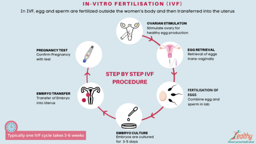

# REPRODUÇÃO ASSISTIDA

Para entender a Reprodução Assistida (RA), você precisa primeiro esquecer a ideia de que ela é um "atalho" mágico. Na verdade, a RA é uma manipulação precisa da fisiologia que falhou. Como sempre digo nas mentorias do MedEvo, o segredo da prova não é saber a técnica em si, mas saber exatamente quando indicar cada uma e quais são os limites éticos impostos pelo Conselho Federal de Medicina (CFM).

*Figura 1 - Injeção Intracitoplasmática de Espermatozóide (ICSI): técnica de fertilização in vitro onde um único espermatozoide é injetado diretamente no citoplasma do óvulo. Fonte: Centers for Disease Control (CDC), Domínio Público | Wikimedia Commons*

## Fisiologia Aplicada e Reserva Ovariana

Antes de falarmos de agulhas e laboratórios, precisamos entender o material de trabalho: o folículo. A foliculogênese é um processo orquestrado. O folículo de Graaf, que é o folículo maduro pronto para a ovulação, deve atingir um diâmetro médio de 17 a 25 mm. Se a prova te der um ultrassom com folículos de 10 mm, eles ainda não estão prontos.

A base de tudo é a teoria das duas células, duas gonadotrofinas. O LH estimula as células da teca a produzirem androgênios, e o FSH estimula as células da granulosa a converterem esses androgênios em estrogênio (aromatização). Guarde isso: quimioterápicos são extremamente tóxicos para os ovários, comprometendo justamente essas células (granulosa e teca), o que pode levar a uma insuficiência gonadal permanente ou transitória.

### Avaliação da Reserva Ovariana

Este é o tópico "queridinho" das bancas. Como saber se ainda há "estoque"?
O melhor preditor de reserva ovariana atualmente é o Hormônio Antimulleriano (AMH). Diferente do FSH, que varia conforme o dia do ciclo, o AMH é ciclo-independente.

Outros parâmetros importantes:

- Contagem de Folículos Antrais (CFA): Realizada por USG transvaginal entre o 2º e 5º dia do ciclo.

- FSH basal: Se estiver muito alto (geralmente > 10-12 mUI/mL), indica que o ovário está "cansado" e o cérebro está gritando para ele funcionar.

Cuidado: Muitos alunos confundem Insuficiência Ovariana Prematura (IOP) com menopausa fisiológica. Na IOP (antes dos 40 anos), as opções de maternidade são a adoção ou o uso de óvulos de doadora. A criopreservação oocitária só é útil se tiver sido feita ANTES da falência ovariana se instalar.

## Investigação do Casal Infértil

A definição clássica de infertilidade é a ausência de gravidez após 1 ano de relações sexuais regulares sem uso de métodos contraceptivos. Se a mulher tiver mais de 35 anos, esse prazo cai para 6 meses.

A investigação básica deve ser simultânea para o casal e inclui:

- Fator Tuboperitoneal: Histerossalpingografia (HSG).

- Fator Ovulatório: Dosagens hormonais e USG seriada.

- Fator Masculino: Espermograma.

Dica de prova: Se a HSG mostrar obstrução tubária bilateral, não perca tempo com indução de ovulação ou inseminação. O caminho aqui é a Fertilização in Vitro (FIV). Se houver hidrossalpinge (tuba dilatada com líquido), a conduta correta é realizar a salpingectomia antes da FIV, pois o líquido inflamatório da tuba é embriotóxico e reduz as taxas de sucesso.

## Técnicas de Baixa Complexidade: Inseminação Intrauterina (IIU)

A IIU consiste em depositar o sêmen processado (melhores espermatozoides) diretamente dentro da cavidade uterina no momento da ovulação.

Por que fazemos IIU e não partimos direto para a FIV? Porque é mais barato e menos invasivo. Mas atenção às indicações e pré-requisitos:

- Pelo menos uma tuba deve estar obrigatoriamente pérvia.

- O fator masculino deve ser leve (concentração de espermatozoides móveis recuperados > 5 milhões).

- É indicada para casos de Infertilidade Sem Causa Aparente (ISCA), endometriose leve ou fatores cervicais.

Erro clássico de prova: Achar que IIU serve para fator masculino grave. Não serve! Se o espermograma estiver muito alterado (oligoastenoteratozoospermia), a indicação é alta complexidade.

*Figura 2 - Etapas da Fertilização in Vitro (FIV): do estímulo ovariano à transferência embrionária, passando por coleta de óvulos, fertilização e cultivo em laboratório. Fonte: Zealthy, CC BY-SA 4.0 | Wikimedia Commons*

## Técnicas de Alta Complexidade: FIV e ICSI

Aqui o encontro do óvulo com o espermatozoide acontece fora do corpo da mulher.

### Fertilização in Vitro Clássica (FIV)

Colocamos o óvulo em uma placa com milhares de espermatozoides e deixamos a "natureza" agir para que um deles penetre.

### Injeção Intracitoplasmática de Espermatozoides (ICSI)

Um único espermatozoide é escolhido e injetado mecanicamente dentro do óvulo.
Quando indicar ICSI?

- Fator masculino grave.

- Falha de fertilização em ciclo de FIV anterior.

- Uso de espermatozoides recuperados cirurgicamente (ex: paciente vasectomizado).

O Dr. Will costuma alertar: Paciente vasectomizado que deseja engravidar tem duas opções: reversão da vasectomia ou FIV com ICSI e aspiração espermática (PESA/TESA). Se a parceira tiver fatores de infertilidade ou idade avançada, a FIV com ICSI é sempre a conduta mais adequada.

| Característica | Inseminação (IIU) | Fertilização in Vitro (FIV/ICSI) |
| --- | --- | --- |
| Local da Fertilização | Trompa (In vivo) | Laboratório (In vitro) |
| Permeabilidade Tubária | Obrigatória | Desnecessária |
| Complexidade | Baixa | Alta |
| Fator Masculino | Deve ser leve | Pode ser grave |
| Risco de Gemelaridade | Moderado | Controlado (pelo nº de embriões) |

## O Fator Masculino e o Espermograma

O exame padrão-ouro é o espermograma seguindo os critérios da OMS. Um ponto que as bancas amam é a Morfologia de Kruger.

- Morfologia de Kruger ≥ 4%: Normal.

- Morfologia de Kruger < 4%: Teratozoospermia (alteração de forma).

Outros termos que você deve dominar:

- Azoospermia: Ausência total de espermatozoides. Pode ser obstrutiva (excretora) ou não-obstrutiva (secretora).

- Astenozoospermia: Motilidade reduzida.

- Oligozoospermia: Baixa concentração.

Se o paciente tem azoospermia excretora (ex: fibrose cística ou pós-vasectomia), o tratamento é a recuperação cirúrgica de espermatozoides para ICSI, e não necessariamente banco de sêmen. O banco de sêmen é indicado quando não há produção de espermatozoides (azoospermia secretora total) ou em casos de produção independente (mulheres solteiras ou casais homoafetivos femininos).

## Endometriose e Infertilidade

A relação entre endometriose e infertilidade é complexa. A doença causa distorção anatômica, inflamação pélvica e piora da qualidade oocitária.

- Endometriose leve/moderada: Pode-se tentar cirurgia para ressecção de focos ou IIU.

- Endometriose profunda ou grave: A indicação é preferencialmente FIV.

Cuidado com o Danazol: Ele já foi muito usado para tratar a dor da endometriose, mas não melhora a fertilidade e tem muitos efeitos colaterais androgênicos. Hoje, para infertilidade na endometriose, focamos em cirurgia ou RA.

## Complicações da Reprodução Assistida

Não pense que tudo são flores. A RA traz riscos específicos que caem muito em prova.

### Síndrome de Hiperestimulação Ovariana (SHO)

É a complicação mais temida da indução da ovulação. Ocorre devido a uma resposta exagerada dos ovários, com aumento da permeabilidade capilar mediada pelo VEGF.

- Fisiopatologia: O líquido sai do vaso e vai para o terceiro espaço.

- Quadro clínico: Dor abdominal, ascite, derrame pleural, hemoconcentração e risco aumentado de trombose.

- Conduta na SHO grave: Internação, suporte clínico, controle hidroeletrolítico e profilaxia para trombose.

### Gestação Ectópica

Sim, mesmo colocando o embrião dentro do útero na FIV, o risco de gestação ectópica é maior do que na população geral (devido a fatores tubários pré-existentes ou contratilidade uterina).

- Diagnóstico: Atraso menstrual + Beta-hCG positivo + Útero vazio ao USG.

- Zona discriminatória: Beta-hCG > 1500-2000 mUI/mL sem saco gestacional intrauterino é altamente suspeito de ectópica.

- Imagem clássica: Massa anexial ou sinal do anel tubário. O "pseudo saco gestacional" é uma coleção líquida central no útero que pode confundir o examinador, mas não possui o anel trofoblástico excêntrico da gestação tópica.

### Riscos Obstétricos e Neonatais

A gestação pós-FIV é considerada de alto risco. Há uma maior incidência de pré-eclâmpsia, parto prematuro, gemelaridade (pela transferência de mais de um embrião) e anomalias congênitas em comparação com a gestação espontânea.

## Aspectos Éticos e Resoluções do CFM

As bancas de residência adoram cobrar a Resolução vigente do CFM (atualmente a 2.320/2022, mas muitas questões ainda citam a 2.121/2015 ou 2013/13). Vamos aos pontos que não mudam e são cobrados:

- Idade Limite: A idade máxima para a mulher se submeter à RA é 50 anos (exceções dependem de autorização do CRM). Para doadoras de óvulos, a idade máxima é 35 anos.

- Seleção de Sexo: É terminantemente PROIBIDA para fins de escolha social. Só é permitida para evitar doenças ligadas ao sexo (ex: Hemofilia).

- Útero de Substituição (Barriga de Aluguel): Deve haver um problema médico que impeça a gestação. A cedente deve pertencer à família de um dos parceiros num parentesco consanguíneo até o quarto grau (mãe, irmã, avó, tia ou prima). Se não for parente, precisa de autorização do CRM. Não pode haver caráter lucrativo.

- Casais Homoafetivos e Pessoas Solteiras: É permitido o uso das técnicas de RA para todos, sem discriminação.

- Descarte de Embriões: Os embriões criopreservados por 3 anos ou mais podem ser descartados se esta for a vontade expressa do casal (a resolução de 2015 falava em 5 anos, fique atento ao enunciado).

- Número de Embriões Transferidos: Para evitar a gemelaridade múltipla (trigêmeos ou mais), o CFM limita o número de embriões de acordo com a idade da mulher:

- Até 37 anos: Até 2 embriões.

- Acima de 37 anos: Até 3 embriões.

- Em caso de ovodoação, vale a idade da doadora (que é sempre ≤ 35 anos, logo, no máximo 2 embriões).

| Situação | Regra do CFM |
| --- | --- |
| Idade da Doadora de Óvulos | Máximo 35 anos |
| Idade da Receptora | Geralmente até 50 anos |
| Seleção de Sexo | Apenas para doenças genéticas |
| Útero de Substituição | Parente até 4º grau (sem fins lucrativos) |
| Redução Embrionária | Proibida em gestações múltiplas |

## Casos Clínicos para Fixação

### Caso 1: O Fator Tubário

Paciente de 28 anos, casada há 2 anos, sem conseguir engravidar. HSG mostra obstrução tubária bilateral. Parceiro com espermograma normal.

- Conduta: FIV. Por que? Porque a obstrução é bilateral e a paciente é jovem. A cirurgia de reversão de laqueadura ou tuboplastia tem taxas de sucesso menores que a FIV hoje em dia.

### Caso 2: O Fator Masculino Grave

Paciente de 35 anos, marido realizou vasectomia há 10 anos. Desejam engravidar.

- Conduta: FIV com ICSI e recuperação espermática (aspiração de epidídimo ou testículo). Lembre-se: a vasectomia causa uma azoospermia obstrutiva. O espermatozoide está lá, só não consegue sair.

### Caso 3: A Emergência na RA

Paciente em D10 pós-transferência de embriões chega ao pronto-socorro com dor abdominal intensa, ascite e dispneia.

- Diagnóstico: Síndrome de Hiperestimulação Ovariana (SHO).

- Por que aconteceu? Provavelmente devido ao uso de hCG para maturação folicular e à própria gravidez (o hCG da gestação mantém o estímulo ovariano).

## Pontos-Chave para Prova

- Reserva Ovariana: O Hormônio Antimulleriano (AMH) é o melhor preditor e não varia com o ciclo menstrual.

- Folículo de Graaf: Considerado maduro entre 17 e 25 mm de diâmetro.

- Inseminação (IIU): Exige tubas pérvias e fator masculino leve.

- FIV/ICSI: Indicada para fator tubário bilateral, fator masculino grave e falha de técnicas simples.

- Vasectomia: A conduta de escolha para gravidez é a ICSI com aspiração de espermatozoides.

- Endometriose Grave: Indicação absoluta de FIV se houver desejo gestacional e infertilidade.

- Hidrossalpinge: Deve ser operada (salpingectomia) ANTES da FIV para não prejudicar a implantação.

- SHO: Complicação grave caracterizada por aumento da permeabilidade capilar, ascite e risco de trombose.

- Gestação Ectópica: Suspeitar se Beta-hCG > 1500-2000 mUI/mL com útero vazio ao USG.

- Idade da Doadora: Máximo de 35 anos (Resolução CFM).

- Seleção de Sexo: Proibida, exceto para evitar doenças genéticas ligadas ao sexo.

- Útero de Substituição: Permitido até 4º grau de parentesco sem fins lucrativos.

- Descarte de Embriões: Permitido após 3 anos de criopreservação (conforme normas vigentes).

- Sangramento Menstrual Normal: O volume deve ser inferior a 80 mL.

- Contraindicação Absoluta de Redução Embrionária: É proibido reduzir o número de embriões em caso de gestação múltipla decorrente de RA.

- Erro Comum: Achar que malformações uterinas (como útero septado) são indicações primárias de FIV. Primeiro corrige-se a malformação cirurgicamente. 💡

 Cópia offline para consulta pessoal.
 Fonte original:
 [https://www.medevo.com.br/material-apoio/ler/11f55921-f9e1-4e26-97e7-3101c4e0ac60](https://www.medevo.com.br/material-apoio/ler/11f55921-f9e1-4e26-97e7-3101c4e0ac60)
