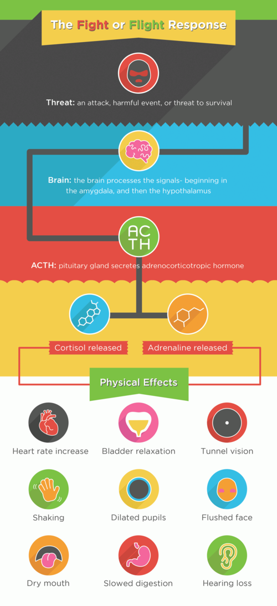

# RESPOSTA ENDÓCRINO-METABÓLICA AO TRAUMA (REMIT)

Para entender a REMIT, você não deve pensar nela como uma doença, mas sim como uma tentativa desesperada e coordenada do corpo para sobreviver. Imagine que o organismo é uma cidade sitiada. O que ele faz? Corta serviços não essenciais, mobiliza todas as reservas de energia para os soldados e tenta manter a pressão da água nos canos principais. É exatamente isso que acontece no trauma ou na cirurgia.

A REMIT é o conjunto de alterações hormonais, metabólicas e imunológicas que ocorrem após uma agressão. O objetivo é manter a homeostase, garantir a perfusão de órgãos nobres e fornecer substrato para a cicatrização. No entanto, se essa resposta for excessiva ou prolongada, ela mesma passa a ser o problema, levando à falência de órgãos.

*Figura 1 - Eixo HPA: o trauma ativa o hipotálamo (CRH), que estimula a hipófise anterior (ACTH), levando à liberação de cortisol pelo córtex adrenal — eixo central da REMIT. Fonte: ShelleyAdams, CC BY-SA 3.0 | Wikimedia Commons*

## O Gatilho: Como o corpo percebe o trauma?

O corpo não tem olhos dentro das vísceras, então ele usa três vias principais para perceber que algo deu errado:

- **Via Neural (Aferências Nervosas):** É a mais rápida. A dor e os barorreceptores (que sentem a queda da pressão) enviam sinais imediatos ao Sistema Nervoso Central. Um ponto que as bancas adoram: a dor aguda intensa pode ter sua percepção inicial atrasada pela modulação endógena (endorfinas e sistema de luta ou fuga), mas o sinal de estresse já chegou ao cérebro.

- **Via Humoral (Citocinas):** O tecido lesado libera substâncias. O TNF-alfa é a citocina chave inicial, a "primeira a chegar na festa" da inflamação. Ela recruta outras, como a IL-1 e a IL-6.

- **Via Endócrina:** O eixo Hipotálamo-Hipófise-Adrenal (HPA) é ativado, resultando na liberação maciça de hormônios.

## As Fases da REMIT: Ebb e Flow

Esta é a classificação clássica de Cuthbertson, e você precisa saber a diferença entre elas porque as questões de prova trocam os conceitos o tempo todo.

### Fase Ebb (Refluxo ou Choque)

Ocorre nas primeiras 24 a 48 horas. É o momento do "nocaute". O corpo está tentando não morrer.

- **O que acontece:** Há uma queda generalizada do metabolismo.

- **Sinais:** Queda do consumo de oxigênio, queda da temperatura corporal (hipotermia), queda do débito cardíaco e vasoconstrição periférica.

- **Objetivo:** Priorizar a perfusão de órgãos nobres (cérebro e coração).

- **Dica de prova:** Se a questão falar em "fase de choque" ou "instabilidade hemodinâmica inicial", ela está falando da fase Ebb.

### Fase Flow (Fluxo ou Catabólica)

Após a estabilização inicial, o corpo entra em um estado de hipermetabolismo. É aqui que a "cidade sitiada" começa a queimar todos os seus móveis para manter as luzes acesas.

- **O que acontece:** Aumento do consumo de oxigênio, aumento da temperatura (febre metabólica), aumento do débito cardíaco.

- **Metabolismo:** É a fase do catabolismo intenso. Ocorre proteólise (quebra de músculo) e lipólise (quebra de gordura).

- **Balanço Nitrogenado:** Torna-se negativo (o paciente excreta mais nitrogênio na urina do que ingere, sinal de que está perdendo massa muscular).

### Fase Anabólica (Recuperação)

Pode durar semanas ou meses. É quando o balanço nitrogenado volta a ser positivo, ocorre a cicatrização definitiva e o retorno das funções normais. Um sinal clínico clássico de que o paciente entrou nesta fase é o retorno do apetite, a eosinofilia no hemograma e a poliúria (o corpo começa a eliminar o excesso de líquido retido).

| Característica | Fase Ebb (Refluxo) | Fase Flow (Fluxo) |
| --- | --- | --- |
| Duração | 24-48 horas | Dias a semanas |
| Débito Cardíaco | Diminuído | Aumentado |
| Consumo de O2 | Diminuído | Aumentado |
| Temperatura | Diminuída (Hipotermia) | Aumentada (Febre) |
| Estado Metabólico | Hipometabolismo | Hipermetabolismo |
| Objetivo | Sobrevivência imediata | Reparo tecidual |

## Resposta Hormonal: Quem sobe e quem desce?

Aqui está o "filé mignon" das provas de residência. Você precisa decorar quem aumenta e quem diminui, mas eu vou te explicar o porquê para você não esquecer.

### Os Hormônios que Aumentam (Contrarreguladores)

O objetivo desses hormônios é aumentar a oferta de glicose no sangue (combustível) e manter a pressão arterial.

- **Cortisol:** É o hormônio do estresse por excelência. Sua elevação é a primeira alteração metabólica importante. Ele promove a gliconeogênese (formação de glicose a partir de aminoácidos) e a lipólise. Além disso, ele estabiliza a membrana dos lisossomos e diminui a resposta inflamatória excessiva. **Cuidado:** A redução do cortisol no trauma é uma exceção raríssima e indica insuficiência adrenal.

- **Catecolaminas (Adrenalina e Noradrenalina):** Causam taquicardia, vasoconstrição e aumentam a glicogenólise (quebra do glicogênio em glicose).

- **Glucagon:** O grande inimigo da insulina. Ele vai ao fígado e ordena: "quebre todo o glicogênio e produza glicose".

- **ADH (Hormônio Antidiurético):** O corpo entende que qualquer trauma pode significar perda de sangue. O ADH fecha a torneira dos rins para reter água. Por isso, o paciente cirúrgico costuma ter oligúria nas primeiras horas.

- **Aldosterona:** Ativada pelo Sistema Renina-Angiotensina-Aldosterona (SRAA). Ela retém Sódio (Na+) e água, e excreta Potássio (K+) e Hidrogênio (H+).

- **GH (Hormônio do Crescimento):** No trauma, ele não age como anabólico, mas sim como um hormônio que ajuda na lipólise e antagoniza a insulina.

### Os Hormônios que Diminuem (ou têm sua ação prejudicada)

- **Insulina:** Embora os níveis de insulina possam até estar normais ou elevados, o corpo desenvolve uma **Resistência Insulínica Periférica**. É como se a fechadura da célula estivesse emperrada; a glicose sobra no sangue (hiperglicemia de estresse), mas não entra na célula.

- **Hormônios Tireoidianos (T3 e T4):** Ocorre a Síndrome do Eutireoideo Doente. O corpo diminui a conversão periférica de T4 em T3 (que é a forma ativa) para "poupar energia". O TSH geralmente está normal ou baixo.

- **IGF-1:** Os níveis de IGF-1 (mediador do GH) caem, contribuindo para o estado catabólico.

**Dica do Dr. Will:** Em provas, se aparecer uma alternativa dizendo que o TSH aumenta no trauma, marque como incorreta. O TSH geralmente cai ou fica normal, ao contrário do GH e do ACTH que sobem.

*Figura 2 - Exemplo de estudo contrastado: a avaliação radiológica é ferramenta essencial no diagnóstico de complicações pós-trauma, incluindo lesões gastrointestinais e íleo paralítico. Fonte: Steven Fruitsmaak, CC BY-SA 3.0 | Wikimedia Commons*

## Metabolismo de Macronutrientes no Trauma

### Carboidratos: A Hiperglicemia de Estresse

O paciente cirúrgico terá glicemia alta, mesmo que não seja diabético. Isso acontece por três motivos:

- Aumento da glicogenólise (rápido).

- Aumento da gliconeogênese (sustentado, usando lactato, glicerol e aminoácidos).

- Resistência insulínica periférica.

Por que isso é importante? Porque a hiperglicemia excessiva aumenta o risco de infecção de ferida operatória e deiscências. Em cirurgias cardíacas, o controle rigoroso da glicemia é fundamental.

### Proteínas: O Balanço Nitrogenado Negativo

O corpo sacrifica o músculo esquelético para obter aminoácidos (principalmente Alanina e Glutamina). Esses aminoácidos vão para o fígado para produzir glicose e proteínas de fase aguda (como a Proteína C Reativa).

- **Consequência:** Perda de massa magra, fraqueza da musculatura respiratória (dificultando a extubação) e prejuízo na cicatrização.

- **Albumina:** No trauma, a albumina cai. Não é porque o fígado parou de produzir, mas porque aumenta a permeabilidade vascular e ela "vaza" para o terceiro espaço. Além disso, o fígado prioriza a produção de proteínas de fase aguda. Portanto, albumina baixa no pós-operatório imediato não é marcador de desnutrição, mas sim de gravidade do trauma.

### Gorduras: A Reserva de Energia

A lipólise é estimulada pelas catecolaminas e pelo glucagon. Os ácidos graxos são liberados para servirem de fonte de energia para os tecidos periféricos, poupando a glicose para o cérebro. Em casos de jejum prolongado, o fígado realiza a beta-oxidação, produzindo corpos cetônicos (acetoacetato e 3-hidroxibutirato).

## Alterações Hidroeletrolíticas e Renais

Devido à ação do ADH e da Aldosterona, o perfil clássico do paciente no pós-operatório imediato é:

- **Retenção Hídrica:** O paciente ganha peso, mas está "inchado" (edema), não necessariamente hidratado intravascularmente.

- **Oligúria:** É uma resposta fisiológica ao estresse. Nem toda oligúria no pós-operatório é sinal de que o paciente precisa de mais soro.

- **Excreção de Potássio:** A aldosterona troca Na+ por K+. Portanto, o paciente tende a perder potássio na urina.

## Complicações Clínicas e Cirúrgicas Relacionadas à REMIT

Como professor, vejo muitos alunos errando questões de conduta por não entenderem a fisiopatologia. Vamos conectar os pontos.

### Febre no Pós-Operatório

A febre é uma das queixas mais comuns. A cronologia é o segredo para acertar a questão:

- **Primeiras 24-48 horas:** A causa número um é a **Atelectasia Pulmonar**. O paciente sente dor, respira "curto", os alvéolos colapsam e geram uma resposta inflamatória com febre. O tratamento não é antibiótico, é fisioterapia respiratória e analgesia.

- **72 horas a 5 dias:** Pense em Infecção do Trato Urinário (ITU), especialmente se houve sondagem vesical.

- **Após 5 a 7 dias:** Infecção da Ferida Operatória (IFO).

- **Após 7 a 10 dias:** Abscessos intra-abdominais ou deiscências de anastomose.

### Motilidade Gastrointestinal (Íleo Fisiológico)

Após uma laparotomia, o intestino "para". Mas ele não para todo ao mesmo tempo. O retorno ocorre em tempos diferentes:

- **Intestino Delgado:** Retorna muito rápido, em cerca de 4 a 8 horas. Por isso, a nutrição enteral precoce é possível e recomendada.

- **Estômago:** Retorna em cerca de 24 horas.

- **Cólon:** É o mais preguiçoso, levando de 3 a 5 dias (72h a 120h) para voltar a funcionar.

**Pérola de Prova:** O sinal clínico mais confiável de que o trânsito intestinal retornou é a eliminação de flatos ou fezes, e não apenas a presença de ruídos hidroaéreos.

### Síndrome Compartimental Abdominal (SCA)

Esta é uma emergência médica que cai muito em provas de trauma. Ocorre quando a Pressão Intra-Abdominal (PIA) sobe tanto que compromete a perfusão dos órgãos.

- **Definição de Hipertensão Intra-Abdominal (HIA):** PIA sustentada > 12 mmHg.

- **Definição de SCA:** PIA > 20 mmHg associada a uma **nova disfunção de órgão** (insuficiência renal, piora respiratória ou queda do débito cardíaco).

- **Conduta:** Se a PIA estiver entre 20-25 mmHg, tentamos medidas clínicas (esvaziar estômago com sonda, drenar ascite, sedação). Se a PIA for > 25 mmHg (ou 34-40 cmH2O) com disfunção orgânica, a conduta é a **descompressão cirúrgica urgente** (laparostomia/peritoniostomia).

Imagine um paciente queimado que recebeu grandes volumes de cristaloides. Ele começa a ficar oligúrico e o ventilador começa a apitar por pressão de via aérea alta. O que você faz? Mede a pressão intravesical (que reflete a PIA). Se estiver alta, você tem o diagnóstico.

## Como Modular a REMIT?

Hoje em dia, o objetivo da cirurgia moderna (protocolos ERAS ou ACERTO no Brasil) é diminuir a REMIT para que o paciente recupere mais rápido.

- **Cirurgia Minimamente Invasiva:** A videolaparoscopia causa menos trauma tecidual e, consequentemente, uma REMIT muito menor do que a cirurgia aberta.

- **Analgesia Eficaz:** Bloquear a dor (via neural) diminui a ativação do eixo HPA.

- **Jejum Abreviado:** Dar líquidos com carboidratos até 2 horas antes da cirurgia reduz a resistência insulínica pós-operatória.

- **Nutrição Enteral Precoce:** Mantém a barreira intestinal, diminui a translocação bacteriana e reduz a resposta inflamatória sistêmica.

| Intervenção | Efeito na REMIT |
| --- | --- |
| Videolaparoscopia | Reduz a resposta inflamatória e hormonal |
| Bloqueio Epidural | Diminui a liberação de catecolaminas e cortisol |
| Nutrição Precoce | Diminui o catabolismo e protege a mucosa GI |
| Controle da Glicemia | Reduz complicações infecciosas |

## Situações Especiais e Pegadinhas

### Síndrome do Eutireoideo Doente

Não confunda com hipotireoidismo. No trauma, o T3 cai porque o corpo quer economizar energia. O TSH está normal. Você **não** deve repor hormônio tireoidiano para esses pacientes. É uma adaptação fisiológica.

### Hipoalbuminemia

Se você vir um paciente com albumina de 2,0 mg/dL no 2º PO de uma gastrectomia, não saia correndo para dar dieta proteica achando que vai resolver em 24h. Essa albumina caiu pelo estresse (vazamento para o interstício). No entanto, saiba que a hipoalbuminemia grave (< 2,2 mg/dL) é um forte preditor de que o paciente terá dificuldade em sair da ventilação mecânica.

### O Papel do Fígado

O fígado é o órgão central da fase Flow. É ele quem faz a gliconeogênese, produz as proteínas de fase aguda e processa os subprodutos do catabolismo muscular. Se o paciente tem cirrose, a REMIT pode ser catastrófica porque ele não consegue suprir essa demanda metabólica.

### Intoxicação por Chumbo (Saturnismo)

Parece um tema aleatório, mas as bancas costumam colocar isso em questões de cirurgia/trauma ocupacional. Lembre-se: intoxicação por chumbo é de notificação compulsória no SINAN. O paciente apresenta dor abdominal (cólica saturnina), anemia e linha de Burton nas gengivas.

## Diagnóstico Diferencial de Choque no Pós-Operatório

Se o seu paciente está hipotenso, taquicárdico e com acidose metabólica no pós-operatório:

- **Choque Hipovolêmico (Hemorrágico):** É a primeira hipótese. PVC baixa, PAM baixa. Conduta: Expansão volêmica com cristaloides e, se necessário, reintervenção.

- **Choque Séptico:** Febre, sinais de infecção, vasodilatação (inicialmente pode ter extremidades quentes).

- **Embolia Pulmonar:** Dispneia súbita, taquicardia, dor torácica.

- **Infarto Agudo do Miocárdio (IAM):** Especialmente em idosos e vasculopatas.

Na MedEvo, sempre reforçamos que a clínica soberana deve ser guiada pela fisiopatologia. Se você entende que o trauma gera vasoconstrição e retenção de sódio, uma hipotensão franca é sempre um sinal de alarme de que os mecanismos compensatórios falharam.

## Pontos-Chave para Prova

- **Primeira alteração hormonal:** Aumento do Cortisol (ativação do eixo HPA).

- **Fase Ebb:** Hipometabolismo, queda do débito cardíaco, queda da temperatura (primeiras 24-48h).

- **Fase Flow:** Hipermetabolismo, catabolismo, aumento da temperatura, balanço nitrogenado negativo.

- **Hormônios que SOBEM:** Cortisol, Catecolaminas, Glucagon, ADH, Aldosterona, GH, ACTH.

- **Hormônios que DESCEM:** Insulina (resistência), T3, T4, IGF-1.

- **Febre no 1º PO:** Atelectasia é a causa mais comum (especialmente em tabagistas e cirurgias abdominais altas).

- **Íleo Fisiológico:** Delgado (4-8h) -> Estômago (24h) -> Cólon (3-5 dias).

- **Síndrome Compartimental Abdominal:** PIA > 20 mmHg + disfunção de órgão. Conduta definitiva: Descompressão cirúrgica se PIA > 25 mmHg.

- **Hiperglicemia de Estresse:** Causada por gliconeogênese hepática e resistência periférica à insulina.

- **Balanço Nitrogenado Negativo:** Marcador de proteólise intensa na fase Flow.

- **Retorno da Motilidade:** O sinal mais fidedigno é a eliminação de gases/fezes.

- **Laparoscopia:** Reduz significativamente a REMIT em comparação com a laparotomia.

- **Albumina no Trauma:** Cai devido ao aumento da permeabilidade vascular (terceiro espaço) e mudança na prioridade de síntese hepática.

- **Oligúria no Pós-Op:** Frequentemente fisiológica devido ao ADH e Aldosterona; cuidado com a sobrecarga hídrica.

- **Contraindicação Absoluta:** Não se deve repor hormônios tireoidianos na Síndrome do Eutireoideo Doente no contexto de trauma.

- **Tratamento da Atelectasia:** Analgesia e fisioterapia respiratória (não é antibiótico!).

- **Fase Anabólica:** Marcada por balanço nitrogenado positivo, eosinofilia e poliúria. 🩺

 Cópia offline para consulta pessoal.
 Fonte original:
 [https://www.medevo.com.br/material-apoio/ler/e2198fe8-7231-4951-b00f-fb85a10163d1](https://www.medevo.com.br/material-apoio/ler/e2198fe8-7231-4951-b00f-fb85a10163d1)
