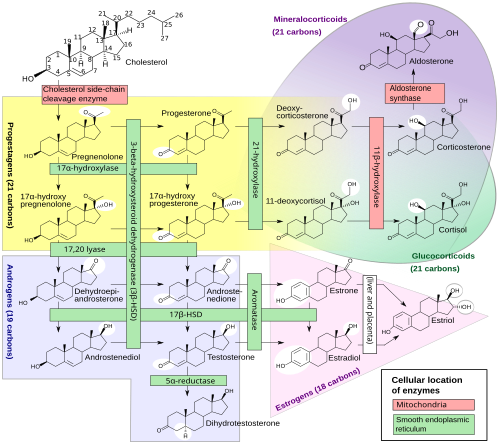

# RESPOSTA METABÓLICA AO TRAUMA

Quando um paciente sofre uma lesão, seja ela um atropelamento ou uma colecistectomia eletiva, o organismo não diferencia a "intenção" do insulto. Ele entende que a integridade foi quebrada e dispara uma cascata de eventos perfeitamente orquestrada para garantir a sobrevivência. Essa é a Resposta Metabólica ao Trauma (REMET).

Como professor, vejo muitos alunos tentando decorar nomes de citocinas. Esqueça a decoreba por um momento. Pense na REMET como uma "economia de guerra". O corpo prioriza o que é essencial (cérebro, coração) e sacrifica a periferia (músculos, gordura) para obter energia rápida. Se você entender essa lógica, as questões de prova deixam de ser um desafio e passam a ser óbvias.

*Figura 1 - Esteroidogênese: as vias biossintéticas desde o colesterol até cortisol, aldosterona e hormônios sexuais. O trauma ativa massivamente a produção de glicocorticoides (cortisol) e mineralocorticoides. Fonte: Häggström & Richfield, CC0 | Wikimedia Commons*

## A Lógica das Fases: Ebb e Flow

A primeira coisa que você precisa dominar é a cronologia descrita por Cuthbertson. O corpo não entra em hipermetabolismo imediatamente. Existe uma transição.

### Fase de Choque (Ebb Phase)

Esta é a fase inicial, que dura de 24 a 48 horas. Imagine um paciente que acabou de chegar ao trauma ou saiu de uma grande cirurgia instável. O corpo está em "modo de economia".

- **O que acontece:** Há uma queda generalizada do metabolismo. O consumo de oxigênio diminui, a temperatura corporal cai e o débito cardíaco reduz.

- **Por que?** O foco aqui é a sobrevivência imediata e a manutenção da perfusão de órgãos nobres. É um estado de hipometabolismo.

- **Dica de Prova:** Se a questão descreve um paciente logo após o trauma com bradicardia relativa (ou hipotensão) e baixa temperatura, ela está falando da fase Ebb.

### Fase de Fluxo (Flow Phase)

Passado o susto inicial e a estabilização hemodinâmica, entramos na fase Flow. Aqui, a "economia de guerra" está a todo vapor. Ela se divide em duas:

- **Fase Catabólica:** É o auge da resposta. O corpo começa a "queimar" suas próprias reservas para fornecer substrato para a cicatrização e para o sistema imune. Há um aumento do consumo de oxigênio e da temperatura (febre pós-operatória não infecciosa).

- **Fase Anabólica:** É o período de recuperação, que pode durar semanas ou meses. O balanço nitrogenado volta a ser positivo e o corpo reconstrói o que foi perdido.

| Característica | Fase Ebb (Choque) | Fase Flow (Catabólica) |
| --- | --- | --- |
| **Duração** | 24 - 48 horas | Dias a semanas |
| **Metabolismo** | Diminuído (Hipometabolismo) | Aumentado (Hipermetabolismo) |
| **Débito Cardíaco** | Diminuído | Aumentado |
| **Temperatura** | Diminuída | Aumentada |
| **Objetivo** | Estabilização hemodinâmica | Reparo tecidual |

## O Maestro: O Eixo Hipotálamo-Hipofisário-Adrenal

Para que essa resposta ocorra, o sistema nervoso central precisa ser avisado. O estímulo principal é a **dor** e a **hipovolemia**. Os barorreceptores e os nociceptores enviam sinais ao hipotálamo, que inicia a orquestra hormonal.

### Hormônios Contrarregulatórios

Aqui está o coração da REMET. Chamamos de "contrarregulatórios" porque eles agem de forma oposta à insulina. Enquanto a insulina quer guardar energia, estes querem liberar.

- **Catecolaminas (Adrenalina e Noradrenalina):** São as primeiras a subir. Causam vasoconstrição periférica, taquicardia e estimulam a glicogenólise (quebra de glicogênio em glicose).

- **Cortisol (Glicocorticoide):** É o hormônio do estresse por excelência. Ele promove a proteólise (quebra de músculo) para fornecer aminoácidos para a gliconeogênese hepática.

- **Glucagon:** Estimula o fígado a produzir mais glicose.

**Pérola Clínica do Dr. Will:** Nas provas, lembre-se que as catecolaminas e o glucagon dependem do cortisol para terem sua ação plena e sinérgica. Sem o cortisol "preparando o terreno", a resposta ao estresse é ineficaz. É por isso que pacientes com insuficiência adrenal entram em choque refratário no trauma.

### O Papel do ADH e do Sistema Renina-Angiotensina-Aldosterona (SRAA)

No 1º dia de pós-operatório (PO), é comum o paciente urinar pouco. Muitos alunos se desesperam e querem prescrever diurético ou volume excessivo. Calma!

O trauma estimula a liberação de **ADH (Vasopressina)** pela neuro-hipófise e ativa o **SRAA**.

- **ADH:** Retém água livre nos túbulos coletores.

- **Aldosterona:** Retém sódio e água, e excreta potássio e hidrogênio.

**Resultado:** O paciente apresenta retenção hídrica, baixa diurese e pode ter uma leve hipocalemia e alcalose metabólica. Isso é fisiológico nas primeiras 24-48h. Não confunda essa oligúria funcional com insuficiência renal aguda (IRA) orgânica logo de cara.

## Metabolismo: A Hiperglicemia de Estresse

Se você vir uma glicemia de 180 mg/dL em um paciente não diabético no pós-operatório, não se assuste. Isso é a **Hiperglicemia de Estresse**.

### Por que o corpo faz isso?

O cérebro e as feridas em cicatrização precisam de glicose constante. O corpo garante isso através de dois mecanismos:

- **Aumento da produção:** Glicogenólise (rápida) e Gliconeogênese (sustentada, a partir de aminoácidos e glicerol).

- **Resistência à Insulina:** O trauma gera um estado de resistência periférica à insulina, mediado principalmente pelo cortisol e pelas citocinas pró-inflamatórias (TNF-alfa, IL-1, IL-6). O músculo "fecha a porta" para a glicose, deixando-a sobrando no sangue para os órgãos que não dependem de insulina (como o cérebro).

### Trauma vs. Inanição (Jejum Prolongado)

Este é um dos temas favoritos das bancas de residência. Eles vão tentar confundir a resposta do trauma com a resposta ao jejum simples.

No **jejum simples (inanição)**, o corpo tenta preservar a proteína muscular. Após alguns dias, o cérebro se adapta a usar **corpos cetônicos** vindos da quebra de gordura (lipólise). O metabolismo cai para poupar energia.

No **trauma**, o metabolismo sobe (hipercatabolismo). O corpo não quer saber de poupar músculo; ele quebra proteína de forma agressiva. A cetogênese é **baixa** ou inibida pela presença de níveis circulantes de insulina (que, embora resistente na periferia, ainda é suficiente para frear a cetogênese no fígado).

| Característica | Inanição (Jejum) | Trauma (REMET) |
| --- | --- | --- |
| **Gasto Energético** | Diminuído | Aumentado |
| **Fonte de Energia** | Corpos Cetônicos / Gordura | Glicose / Proteína Muscular |
| **Proteólise** | Diminuída (Preservação) | Aumentada (Agressiva) |
| **Cetogênese** | Muito Aumentada | Diminuída / Ausente |

**Dica MedEvo:** Na inanição, ácidos graxos livres e corpos cetônicos são fontes vitais de energia para tecidos não glicolíticos, incluindo o coração e os rins. No trauma, a prioridade é a glicose.

## Resposta Inflamatória e Citocinas

O trauma tecidual ativa macrófagos e monócitos que liberam citocinas. As "estrelas" aqui são:

- **TNF-alfa:** O primeiro a aparecer. Causa anorexia e induz o catabolismo.

- **IL-1:** Responsável pela febre (age no centro termorregulador do hipotálamo).

- **IL-6:** A principal indutora da produção de proteínas de fase aguda pelo fígado (como a Proteína C Reativa - PCR).

Se essa resposta for exagerada e sistêmica, temos a **SIRS (Síndrome da Resposta Inflamatória Sistêmica)**, que pode evoluir para disfunção orgânica múltipla.

*Figura 2 - Trato gastrointestinal: ilustração do esôfago e estômago. O íleo pós-operatório é uma das complicações gastrointestinais mais importantes da resposta metabólica ao trauma. Fonte: BruceBlaus, CC BY-SA 4.0 | Wikimedia Commons*

## O Trato Gastrointestinal: O Íleo Pós-Operatório

É clássico: o paciente opera o abdômen e para de eliminar flatos e fezes. Isso é a **Disfunção Intestinal Transitória** ou Íleo Paralítico/Adinâmico.

### A Cronologia do Retorno

O intestino não volta a funcionar todo de uma vez. Existe uma hierarquia de retorno da motilidade:

- **Intestino Delgado:** É o "apressadinho". Volta em menos de **12 horas**. Por isso, a nutrição enteral precoce é segura e recomendada.

- **Estômago:** Retorno entre **24 e 48 horas**.

- **Cólon:** O "preguiçoso". Demora de **48 a 72 horas** para recuperar o peristaltismo.

**Erro Comum de Prova:** Achar que o retorno da função intestinal é definido apenas pela evacuação. Errado! Os critérios de resolução do íleo são a **presença de flatos** e a **tolerância à dieta oral**.

### Fatores que Prolongam o Íleo

- Manipulação excessiva das alças (trauma mecânico).

- Distúrbios eletrolíticos (principalmente a **hipocalemia**).

- Uso de opioides (morfina, fentanil).

- Inflamação peritoneal.

**Dica de Conduta:** Agentes procinéticos (como metoclopramida) têm pouco ou nenhum efeito no íleo pós-operatório verdadeiro. A melhor prevenção é a cirurgia minimamente invasiva (videolaparoscopia), deambulação precoce e redução de opioides.

## Complicações Específicas e Casos Críticos

### Rabdomiólise e Injúria Renal Aguda (IRA)

Imagine um paciente vítima de soterramento ou trauma por esmagamento. Ele chega com urina escura (cor de "Coca-Cola").

- **Fisiopatologia:** A lesão muscular libera mioglobina. No rim, a mioglobina é tóxica para os túbulos, especialmente em ambiente ácido, causando Necrose Tubular Aguda (NTA).

- **Diagnóstico:** CPK (Creatinofosfoquinase) muito elevada (geralmente > 5.000 ou 10.000 U/L). A Fração Excretória de Sódio (FENA) será **maior que 1%**, indicando lesão intrínseca.

- **Tratamento:** Hidratação vigorosa para manter débito urinário alto e evitar a precipitação da mioglobina.

### Síndrome de Compartimento Abdominal (SCA)

Cenário: Paciente com trauma abdominal grave, recebeu 10 litros de cristaloides na ressuscitação. O abdômen está tenso, a pressão de pico no ventilador subiu e a diurese caiu.

- **O que é:** Aumento da pressão intra-abdominal (PIA) > 20 mmHg associado a uma nova disfunção de órgãos.

- **Conduta:** Se a PIA estiver alta e houver disfunção, a descompressão cirúrgica (laparotomia) pode ser necessária.

### Terapia Renal Substitutiva Contínua (TRSC)

Em pacientes com instabilidade hemodinâmica que desenvolvem IRA e hipercatabolismo, a hemodiálise convencional pode causar quedas bruscas de pressão.

- **Escolha:** Terapia renal substitutiva contínua, como a **Hemodiafiltração Veno-Venosa Contínua (HDFVVC)**. Ela remove solutos e líquidos de forma lenta e constante, sendo melhor tolerada pelo paciente crítico.

## O Impacto da Técnica Cirúrgica

A evolução da cirurgia permitiu reduzir a REMET.

- **Laparotomia (Aberta):** Grande incisão, maior manipulação de alças, maior exposição ao ar. Gera uma resposta inflamatória e metabólica muito mais intensa.

- **Videolaparoscopia:** Menor trauma tecidual, menor dor pós-operatória. Isso resulta em menores níveis de cortisol e citocinas, retorno mais rápido do peristaltismo e menor tempo de internação.

**Atelectasia: A Vilã do Pós-Operatório**
A complicação pulmonar mais comum no PO é a atelectasia. Por que? A dor abdominal faz o paciente respirar "curto" (hipoventilação) e não tossir. Isso colapsa os alvéolos nas bases pulmonares. O tratamento não é antibiótico, é fisioterapia respiratória e analgesia adequada.

## Comparativo: Resumo das Alterações Metabólicas

| Parâmetro | Alteração no Trauma | Motivo |
| --- | --- | --- |
| **Glicemia** | Aumentada | Gliconeogênese + Resistência à Insulina |
| **Balanço Nitrogenado** | Negativo | Proteólise muscular intensa |
| **Balanço Hídrico** | Positivo (Retenção) | Ação de ADH e Aldosterona |
| **Taxa Metabólica** | Aumentada | Necessidade de reparo e resposta imune |
| **Lipólise** | Aumentada | Fornecimento de glicerol e ácidos graxos |

## Pontos-Chave para Prova

- **Fases de Cuthbertson:** Ebb (Choque/Hipometabolismo) e Flow (Catabolismo/Hipermetabolismo).

- **Hormônio "Permissivo":** O Cortisol é essencial para que as catecolaminas e o glucagon exerçam sua função máxima.

- **Hiperglicemia de Estresse:** Causada por hormônios contrarregulatórios e citocinas (TNF, IL-1). Há resistência periférica à insulina.

- **Trauma vs. Inanição:** No trauma, o gasto energético aumenta e a cetogênese é baixa. Na inanição, o gasto diminui e a cetogênese é alta.

- **Oligúria no 1º PO:** Geralmente é funcional devido ao ADH e Aldosterona. Não saia fazendo volume sem avaliar o contexto.

- **Retorno do Íleo:** Delgado (<12h) -> Estômago (24-48h) -> Cólon (48-72h).

- **Critério de Resolução do Íleo:** Flatos e tolerância à dieta oral (não espere o paciente evacuar para dar alta).

- **Rabdomiólise:** Suspeite com CPK elevada + urina escura. Causa IRA intrínseca (FENA > 1%).

- **Síndrome de Compartimento Abdominal:** PIA > 20 mmHg + Disfunção de Órgãos. Comum após grandes ressuscitações volêmicas.

- **Atelectasia:** Complicação pulmonar mais comum. Causa febre nas primeiras 24-48h de PO.

- **Vantagem da Laparoscopia:** Reduz a magnitude da resposta metabólica e inflamatória em comparação à via aberta.

- **TRSC (HDFVVC):** Indicada para pacientes instáveis hemodinamicamente com IRA e hipercatabolismo.

- **Contraindicação Absoluta de Procinéticos:** Não use se houver suspeita de obstrução mecânica ou anastomose intestinal recente de risco (embora no íleo adinâmico eles sejam apenas ineficazes).

- **Primeira Escolha para Analgesia:** Poupadores de opioides (como AINEs e dipirona) para acelerar o retorno da motilidade intestinal, se não houver contraindicação renal.

- **Valores de PIA:** Normal (5-7 mmHg); Hipertensão Intra-abdominal (>12 mmHg); Síndrome de Compartimento (>20 mmHg + lesão de órgão). 🩺

 Cópia offline para consulta pessoal.
 Fonte original:
 [https://www.medevo.com.br/material-apoio/ler/e4748e21-6960-4a9f-ae43-6bcae4765c8b](https://www.medevo.com.br/material-apoio/ler/e4748e21-6960-4a9f-ae43-6bcae4765c8b)
