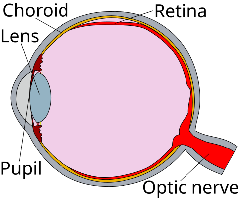
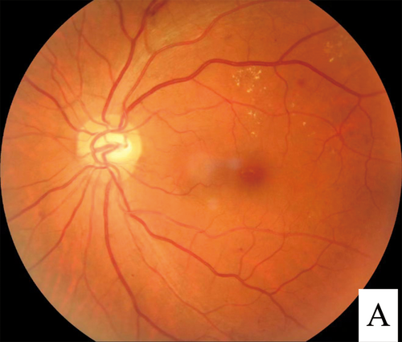

# RETINOPATIAS E DOENÇAS DA RETINA

A retina não é apenas uma camada de tecido no fundo do olho; para nós, clínicos e candidatos à residência, ela é uma janela escancarada para a saúde sistêmica do paciente. Quando você olha um fundo de olho, está vendo diretamente vasos sanguíneos e tecido nervoso. Se o diabetes está destruindo os capilares da retina, ele provavelmente está fazendo o mesmo nos glomérulos renais.

Neste material, vamos dissecar as doenças da retina com o olhar de quem precisa acertar a questão de prova, mas também de quem precisa saber o que fazer quando um paciente chega com perda visual súbita no plantão.

*Figura 1 - Anatomia do olho humano mostrando descolamento de retina: a retina se separa do epitélio pigmentar, causando perda visual. Conhecer a anatomia é fundamental para entender as retinopatias. Fonte: Erin Silversmith, CC BY-SA 3.0 | Wikimedia Commons*

## Anatomia Aplicada e Motilidade Ocular

Antes de mergulharmos nas patologias, precisamos revisar um ponto que as bancas amam e que muitos alunos erram por pura confusão de nomes: a inervação extrínseca.

### O Nervo Troclear (IV) e o Músculo Oblíquo Superior

O músculo oblíquo superior é o "queridinho" das questões de anatomia ocular. Por que? Porque sua função não é intuitiva. Ele realiza a **depressão, abdução e rotação interna (intorsão)** do globo ocular.

**Dica de Professor:** Se o paciente tem uma paralisia do IV par, ele terá dificuldade em olhar para baixo e para dentro (como ao descer escadas ou ler). Ele costuma inclinar a cabeça para o lado oposto à lesão para compensar a diplopia. Lembra do "SO4" (Superior Oblique - 4º par)? É o único músculo inervado pelo troclear.

### O Nervo Abducente (VI) e a Microangiopatia

O VI par inerva o reto lateral (abdução). Em pacientes com Diabetes Mellitus (DM) ou Hipertensão Arterial Sistêmica (HAS) de longa data, a diplopia súbita por paralisia do VI par é um clássico.

**Por que isso acontece?** Por isquemia dos *vasa nervorum* (pequenos vasos que nutrem o nervo). É uma neuropatia diabética focal. Diferente de uma compressão por tumor, aqui a pupila geralmente está preservada.

*Figura 2 - Fundoscopia de retinopatia diabética: imagem do fundo de olho mostrando exsudatos duros (pontos amarelados), microaneurismas e pequenas hemorragias retinianas. Fonte: Hao et al., CC BY 4.0 | Wikimedia Commons*

## Retinopatia Diabética (RD)

Segundo a Diretriz da Sociedade Brasileira de Diabetes (SBD, 2024/2025), a RD é a principal causa de cegueira evitável em adultos em idade produtiva.

### Fisiopatologia: O "Porquê" das Lesões

A hiperglicemia crônica causa dano ao endotélio capilar e perda dos pericitos (células que dão suporte aos vasos). Isso gera duas frentes de problemas:

- **Aumento da Permeabilidade:** O vaso "vaza". Isso gera edema macular e exsudatos duros (depósitos de lipídeos).

- **Obstrução Vascular:** O vaso "entope". Isso gera isquemia. A retina isquêmica libera fatores de crescimento (como o VEGF), tentando criar novos vasos. O problema é que esses neovasos são frágeis e sangram facilmente.

### Classificação da RD (SBD 2024/2025)

| Classificação | Achados na Fundoscopia |
| --- | --- |
| **RD Não Proliferativa (RDNP) Leve** | Apenas microaneurismas (pontos vermelhos minúsculos). |
| **RDNP Moderada** | Microaneurismas + hemorragias e exsudatos, mas sem critérios de grave. |
| **RDNP Grave (Regra 4-2-1)** | Hemorragias em **4** quadrantes; OU dilatação venosa em **2** quadrantes; OU anomalias microvasculares (IRMA) em **1** quadrante. |
| **RDNP Muito Grave** | Presença de 2 ou mais critérios da RDNP Grave. |
| **RD Proliferativa (RDP)** | **Neovasos** de disco ou retina; Hemorragia vítrea ou pré-retiniana. |

**Exemplo Clínico:** Paciente de 55 anos, DM tipo 2 há 15 anos, HbA1c 9,5%. Na fundoscopia, você vê hemorragias em chama de vela nos 4 quadrantes e vasos tortuosos. Diagnóstico? RDNP Grave. Risco iminente de evoluir para RDP.

### Rastreamento e Metas

- **DM Tipo 1:** Iniciar rastreamento 5 anos após o diagnóstico.

- **DM Tipo 2:** Iniciar rastreamento **no momento do diagnóstico** (pois o paciente pode ser diabético há anos sem saber).

- **Gestantes Diabéticas:** Devem ser avaliadas antes da concepção ou no primeiro trimestre.

**Tratamento:** O controle glicêmico rigoroso (HbA1c < 7%) e da PA (< 130/80 mmHg) são fundamentais. Para casos avançados ou edema macular, usamos injeções intravítreas de anti-VEGF (ex: Ranibizumabe) ou fotocoagulação a laser.

## Retinopatia Hipertensiva

Diferente da diabética, a hipertensiva reflete o estado das arteríolas sistêmicas. A classificação de **Keith-Wagener-Barker (KWB)** é a bíblia aqui.

### Classificação de Keith-Wagener-Barker

- **Grau I:** Estreitamento arteriolar leve e generalizado ("vasos finos").

- **Grau II:** Estreitamento focal e **cruzamentos arteriovenosos (AV) patológicos**. A artéria rígida comprime a veia no ponto de cruzamento.

- **Grau III:** Grau II + **Hemorragias** (em chama de vela) e **Exsudatos** (algodonosos - indicam isquemia da camada de fibras nervosas).

- **Grau IV:** Grau III + **Edema de Papila** (Papiledema). Isso define a Hipertensão Maligna/Urgência Hipertensiva.

**Cuidado de Prova:** Muitos alunos acham que exsudato algodonoso é exclusivo de diabetes. Errado! No Grau III da HAS ele é clássico. O que define o Grau IV é o edema de papila.

## Oclusões Vasculares da Retina

Aqui entramos no campo das **Emergências Oftalmológicas**. Se o paciente perdeu a visão subitamente e não dói, você deve pensar em oclusão.

### Oclusão da Artéria Central da Retina (OACR)

É o "infarto do olho". Geralmente causada por um êmbolo (carotídeo ou cardíaco).

- **Quadro:** Perda visual súbita, profunda e indolor.

- **Fundoscopia:** Retina pálida/edemaciada com a famosa **Mácula em Cereja** (a fóvea continua vermelha porque é nutrida pela coróide, que não foi afetada).

- **Conduta:** Emergência! Tentar reduzir a pressão intraocular (massagem ocular, acetazolamida). Em centros avançados, a trombólise intra-arterial pode ser considerada se feita em poucas horas.

- **Pérola MedEvo:** OACR é um marcador de alto risco para AVC. O paciente precisa de investigação cardiovascular urgente (Doppler de carótidas e ECG).

### Oclusão da Veia Central da Retina (OVCR)

O sangue entra, mas não consegue sair. Ocorre um "congestionamento".

- **Quadro:** Perda visual súbita ou subaguda, indolor.

- **Fundoscopia:** Aspecto de **"Sangue e Trovão"** (hemorragias extensas em todos os quadrantes, veias dilatadas e tortuosas, edema de papila).

- **Fator de Risco:** Idade, HAS, Glaucoma.

## Doenças Infecciosas: Toxoplasmose e CMV

No Brasil, a toxoplasmose é a causa número 1 de uveíte posterior.

### Toxoplasmose Ocular

Causada pelo *Toxoplasma gondii*. A marca registrada é a **Retinocoroidite**.

- **Lesão Satélite:** É o termo que você vai procurar na questão. Uma área de inflamação ativa (branca-amarelada, "foco de farol na neblina" devido à vitreíte) adjacente a uma cicatriz pigmentada antiga.

- **Tratamento:** Sulfadiazina + Pirimetamina + Ácido Folínico (para evitar depressão medular) por 4-6 semanas. Alternativa: Sulfametoxazol-Trimetoprim. Corticoide oral pode ser usado *após* o início do antiparasitário se houver ameaça à visão central.

### Retinite por Citomegalovírus (CMV)

Ocorre em imunocomprometidos graves (geralmente HIV com CD4 < 50).

- **Aspecto:** Retinopatia em **"Queijo com Ketchup"** (áreas de necrose branca misturadas com hemorragias extensas).

- **Diferencial:** Diferente da Toxoplasmose, o CMV não costuma ter muita vitreíte (o vítreo fica limpo).

- **Tratamento:** Ganciclovir (IV ou intravítreo) ou Valganciclovir oral.

## Descolamento de Retina (DR)

O tipo mais comum é o **Regmatogênico** (causado por uma ruptura na retina que permite a entrada de líquido).

- **Sintomas Precursores:** Fotopsias (flashes de luz) e moscas volantes (pontos pretos).

- **Quadro Instalado:** Perda de campo visual descrita como uma **"cortina ou sombra"** que se fecha.

- **Fatores de Risco:** Alta miopia, trauma, cirurgia de catarata prévia.

- **Conduta:** Cirúrgica (Vitrectomia, Introflexão Escleral ou Retinopexia Pneumática). Se a mácula ainda estiver colada ("macula-on"), a cirurgia é uma urgência absoluta para salvar a visão central.

## Neuro-oftalmologia e Vias Ópticas

As bancas adoram testar sua capacidade de localizar a lesão pelo defeito de campo.

- **Nervo Óptico:** Perda visual unilateral (ex: Neurite Óptica).

- **Quiasma Óptico:** **Hemianopsia Bitemporal** (perda das metades temporais de ambos os campos). Clássico de tumores de hipófise.

- **Trato Óptico / Radiações:** Hemianopsia homônima contralateral.

- **Lobo Occipital:** Hemianopsia homônima com **preservação macular** (devido à dupla vascularização da área macular no córtex).

## Tabelas Comparativas para Revisão Rápida

### Tabela 1: Diagnóstico Diferencial da Perda Visual Súbita Indolor

| Patologia | Achado Principal na Fundoscopia | Contexto Típico |
| --- | --- | --- |
| **OACR** | Mácula em cereja, retina pálida. | Idoso, risco cardiovascular, êmbolo. |
| **OVCR** | Hemorragias "sangue e trovão", veias tortuosas. | HAS, Glaucoma, perda visual subaguda. |
| **Descolamento de Retina** | Retina descolada (bolhosa ou pregueada). | Míope, trauma, flashes e moscas volantes. |
| **Hemorragia Vítrea** | Ausência de reflexo vermelho, vítreo opaco. | Diabético (RDP) ou trauma. |
| **NOINA*** | Edema de papila pálido, hemorragias peridiscais. | Idoso, perda visual ao acordar (altitudinal). |

**Neuropatia Óptica Isquêmica Não Arterítica.*

### Tabela 2: Toxoplasmose vs. CMV

| Característica | Toxoplasmose Ocular | Retinite por CMV |
| --- | --- | --- |
| **Hospedeiro** | Imunocompetente ou Imunodeprimido. | Imunodeprimido grave (CD4 < 50). |
| **Aspecto** | Lesão satélite (foco ativo + cicatriz). | "Queijo com Ketchup" (necrose + sangue). |
| **Vitreíte** | Intensa ("farol na neblina"). | Mínima ou ausente. |
| **Tratamento** | Sulfadiazina + Pirimetamina. | Ganciclovir / Valganciclovir. |

### Tabela 3: Nervos Cranianos e Motilidade

| Nervo | Músculo | Ação Principal | Sinal de Paralisia |
| --- | --- | --- | --- |
| **III (Oculomotor)** | Retos (exceto lateral), Oblíquo Inf. | Elevação, adução, depressão. | Ptose, olho "para baixo e para fora", midríase. |
| **IV (Troclear)** | Oblíquo Superior | Depressão e Intorsão. | Diplopia vertical (piora ao olhar para baixo). |
| **VI (Abducente)** | Reto Lateral | Abdução. | Esotropia (olho desviado para dentro). |

## Pontos-Chave para Prova 💡

- **Músculo Oblíquo Superior:** Inervado pelo IV par (Troclear). Função: abaixa, abduz e roda internamente.

- **Retinopatia Diabética:** O rastreio no DM2 é imediato; no DM1 é após 5 anos. A "Regra 4-2-1" define RDNP Grave.

- **Mácula em Cereja:** Patognomônico de Oclusão da Artéria Central da Retina (OACR). É uma urgência!

- **Hemianopsia Bitemporal:** Lesão no Quiasma Óptico (pense em Adenoma de Hipófise).

- **Toxoplasmose:** Lesão satélite (foco novo ao lado de cicatriz antiga). Tratamento clássico: Sulfadiazina + Pirimetamina + Ácido Folínico.

- **CMV:** Aspecto de "queijo com ketchup" em pacientes com AIDS e CD4 muito baixo.

- **Hifema vs. Hiposfagma:** Hifema é sangue na câmara anterior (nível hidroaéreo, baixa visão, dor). Hiposfagma é hemorragia subconjuntival (olho vermelho vivo, visão normal, sem dor).

- **Manchas de Roth:** Hemorragias retinianas com centro branco. Clássicas de Endocardite Infecciosa (fenômeno imunológico).

- **Diplopia no Diabético:** Frequentemente por paralisia do VI par (microangiopatia).

- **Queimadura Química:** A primeira conduta é **lavagem copiosa** com soro ou água por 20-30 min, antes mesmo de testar acuidade ou encaminhar.

- **Glaucoma Agudo:** Perda visual súbita, **dor intensa**, náuseas, pupila em médio-midríase fixa e olho "duro como pedra".

- **Descolamento de Retina:** Flashes (fotopsias) e moscas volantes precedem a "cortina" negra no campo visual.

- **Contraindicação Absoluta:** Nunca use corticoides isolados em suspeita de infecção ocular ativa (como toxo ou herpes) sem cobertura antimicrobiana.

- **Erro Comum:** Achar que hemorragia subconjuntival (hiposfagma) é sinal de retinopatia diabética. Não é! É geralmente trauma ou pico hipertensivo.

- **OACR e AVC:** Paciente com OACR tem risco altíssimo de AVC isquêmico nos dias seguintes. Investigação sistêmica é mandatória.

 Cópia offline para consulta pessoal.
 Fonte original:
 [https://www.medevo.com.br/material-apoio/ler/3eefd8de-8246-438e-946a-0144d2bce32d](https://www.medevo.com.br/material-apoio/ler/3eefd8de-8246-438e-946a-0144d2bce32d)
