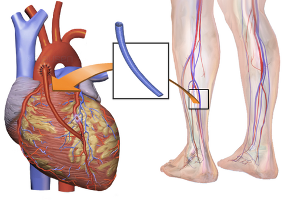

# REVASCULARIZAÇÃO MIOCÁRDICA

A revascularização miocárdica é, talvez, o tema mais denso e recorrente dentro da cirurgia cardiovascular nas provas de residência. Para entender esse assunto, você não pode apenas decorar fluxogramas; você precisa entender a lógica da oferta e demanda de oxigênio e, principalmente, por que escolhemos a faca (cirurgia) em vez do cateter (angioplastia) em determinados cenários.

O coração é um órgão aeróbico estrito. Quando as artérias coronárias não conseguem suprir a demanda metabólica, entramos no terreno da isquemia. A revascularização é o conjunto de procedimentos que visa restabelecer esse fluxo, seja "pulando" a obstrução com um enxerto (Cirurgia de Revascularização Miocárdica - CRM) ou "esmagando" a placa com um stent (Intervenção Coronária Percutânea - ICP).

*Figura 1 - Cirurgia de bypass coronariano: enxertos são utilizados para desviar o fluxo sanguíneo das áreas de obstrução, revascularizando o miocárdio. Fonte: Blausen Medical, CC BY 3.0 | Wikimedia Commons*

## Anatomia Coronariana e a Base do Problema

Antes de falarmos de conduta, você precisa ter a anatomia na ponta da língua. O tronco da coronária esquerda (TCE) nasce do seio de Valsalva esquerdo e se divide em duas artérias fundamentais: a Artéria Interventricular Anterior (AIVA ou Descendente Anterior - DA) e a Artéria Circunflexa (CX).

A DA irriga a parede anterior e o septo interventricular (os dois terços anteriores). A CX irriga a parede lateral. Já a Coronária Direita (CD) irriga o ventrículo direito e, na maioria das pessoas (85% - dominância direita), dá origem à artéria descendente posterior, que irriga a parede inferior.

**Dica de Prova:** O TCE irriga aproximadamente 75% da massa miocárdica do ventrículo esquerdo. Por isso, uma lesão > 50% no TCE é considerada gravíssima e quase sempre indica intervenção. Se a banca disser que o TCE irriga 90%, está errado; o número clássico é 75%.

Outro ponto anatômico que cai muito: o arco aórtico. A sequência de saída é: 1º Tronco Braquiocefálico (que dá a subclávia direita e carótida comum direita), 2º Carótida Comum Esquerda e 3º Subclávia Esquerda. Por que isso importa? Porque a Artéria Torácica Interna (Mamária), nosso melhor enxerto, nasce da artéria subclávia.

## Indicações de Revascularização: O Grande Embate (CRM vs. ICP)

Aqui é onde o aluno mais erra. A escolha entre cirurgia e angioplastia não é aleatória. Ela se baseia em três pilares: anatomia, presença de diabetes e função ventricular.

### Estabilidade Clínica e Isquemia

Em pacientes com Angina Estável, a primeira conduta é sempre otimizar a terapia médica (AAS, estatina, betabloqueador, IECA). Se o paciente tem isquemia leve (< 10% do miocárdio em exames de estresse) e função ventricular preservada, a revascularização não provou reduzir mortalidade em relação ao tratamento clínico isolado.

**Cuidado:** Se a isquemia for > 10% ou se o paciente mantiver sintomas mesmo com remédios no talo, aí sim pensamos em revascularizar.

### O SYNTAX Score

Para decidir entre CRM e ICP em pacientes multiarteriais, usamos o SYNTAX Score. Ele avalia a complexidade anatômica das lesões (calcificação, bifurcações, extensão).

- **SYNTAX Baixo (0-22):** Resultados similares entre CRM e ICP. Pode-se optar pela ICP pela menor invasividade.

- **SYNTAX Intermediário (23-32) ou Alto (≥ 33):** A CRM é superior, reduzindo eventos cardiovasculares maiores (MACE) e necessidade de nova revascularização.

### Tabela 1: Escolha da Estratégia de Revascularização (SBC 2021)

| Cenário Clínico | Preferência por ICP | Preferência por CRM |
| --- | --- | --- |
| Lesão de TCE (SYNTAX ≤ 22) | Considerar (se alto risco cirúrgico) | Primeira escolha |
| Lesão de TCE (SYNTAX > 22) | Evitar (pior prognóstico) | Mandatório |
| Diabético Multiarterial | Apenas se anatomia muito simples | Primeira escolha (FREEDOM trial) |
| Disfunção de VE (FE < 35%) | Casos selecionados | Primeira escolha |
| Anatomia complexa (SYNTAX ≥ 33) | Contraindicado (pela diretriz) | Mandatório |
| Comorbidades graves (Frágil) | Primeira escolha | Evitar |

**Exemplo Clínico:** Paciente de 62 anos, diabético, triarterial, com lesão proximal na DA. O SYNTAX deu 25. Qual a conduta? CRM. Por que? Porque ele é diabético e o SYNTAX é intermediário. O estudo FREEDOM deixou claro: diabéticos multiarteriais vivem mais e infartam menos se operarem.

*Figura 2 - Angioplastia coronária com stent: o balão expande a área de estenose e o stent metálico mantém a artéria aberta, restabelecendo o fluxo sanguíneo. Fonte: BruceBlaus, CC BY 3.0 | Wikimedia Commons*

## Cirurgia de Revascularização Miocárdica (CRM)

A CRM consiste em criar desvios (pontes) para o sangue chegar após a obstrução. Temos dois tipos principais de enxertos: arteriais e venosos.

### Enxertos Arteriais

- **Artéria Torácica Interna (Mamária):** É o padrão-ouro. A mamária esquerda (LITA) para a DA (AIVA) é o casamento perfeito da cirurgia cardíaca. A patência (estar aberta) em 10 anos é superior a 90-95%.

- **Artéria Radial:** Excelente opção para o segundo ou terceiro enxerto, especialmente em multiarteriais. **Pegadinha de prova:** Para usar a radial, a estenose na coronária nativa deve ser importante (> 70% ou 90%), caso contrário, o fluxo competitivo da coronária faz o enxerto de radial fechar (espasmo).

### Enxertos Venosos

- **Veia Safena Magna:** Fácil de obter, mas tem um problema: a "arterialização" da veia. Como a veia não foi feita para aguentar a pressão arterial, ela sofre hiperplasia intimal e aterosclerose acelerada. Em 10 anos, cerca de 50% das safenas estão ocluídas ou doentes.

### Circulação Extracorpórea (CEC)

A maioria das cirurgias é feita "on-pump" (com CEC). O sangue é desviado para uma máquina que oxigena e bombeia, enquanto o coração é parado com solução cardioplégica (rica em potássio) para o cirurgião suturar com precisão.

A CEC, porém, não é isenta de danos. Ela desencadeia uma **Resposta Inflamatória Sistêmica** brutal. O contato do sangue com os tubos plásticos ativa o sistema complemento, neutrófilos e plaquetas. Isso explica por que o paciente sai "inchado" e, às vezes, vasoplégico.

**Dica do Dr. Will:** A CRM "off-pump" (sem CEC, com o coração batendo) pode ser considerada em pacientes com "aorta em porcelana" (muito calcificada) para reduzir o risco de AVC, já que não precisamos manipular tanto a aorta.

## Intervenção Coronária Percutânea (ICP)

A ICP evoluiu muito. Saímos dos balões isolados, passamos pelos stents convencionais (BMS) e chegamos aos stents farmacológicos (DES) de nova geração.

### Stents Farmacológicos (DES)

Eles liberam drogas (como o Everolimus ou Sirolimus) que inibem a proliferação neointimal, reduzindo drasticamente a reestenose.

- **Duração da DAPT (Dupla Antiagregação Plaquetária):** Em pacientes com angina estável pós-DES, o padrão é AAS + Clopidogrel por 6 meses. No IAM, o padrão é 12 meses.

- **Cuidado:** Se o risco de sangramento for muito alto, podemos encurtar para 1 a 3 meses, dependendo do stent e do contexto.

### ICP no Infarto Agudo (IAMCSST)

Aqui o tempo é músculo.

- **ICP Primária:** É a estratégia de escolha se puder ser feita em até 120 minutos do primeiro contato médico.

- **Fibrinólise:** Se o tempo porta-balão for > 120 min, fazemos o trombolítico (preferencialmente Tenecteplase).

- **ICP de Resgate:** Se o trombolítico falhar (dor persistente ou redução do supra < 50% em 60-90 min), o paciente deve ir IMEDIATAMENTE para a hemodinâmica. Não espere.

## Complicações Pós-Operatórias e Pós-ICP

Como professor, vejo muitos alunos esquecerem que o manejo pós-operatório é tão importante quanto a cirurgia.

### Fibrilação Atrial (FA) Pós-Operatória

É a complicação mais comum da CRM (ocorre em até 30% dos pacientes). Geralmente acontece entre o 2º e 3º dia pós-op. O tratamento envolve controle de frequência (betabloqueadores são a primeira escolha) e, se instável, cardioversão. A maioria reverte para ritmo sinusal espontaneamente em semanas.

### Reação à Protamina

Ao final da CEC, usamos protamina para reverter a heparina. Alguns pacientes fazem uma reação anafilactoide ou tipo III, com hipotensão severa e hipertensão pulmonar aguda. Se isso cair na sua prova, o tratamento é suporte e, às vezes, retornar para a CEC.

### Vasoplegia

O paciente está com pressão baixa, mas o débito cardíaco está normal ou alto e a resistência vascular sistêmica está baixa. É o choque distributivo pós-CEC. A droga de escolha aqui é a Noradrenalina. Se refratário, pensamos em Azul de Metileno ou Vasopressina.

### Tabela 2: Diagnóstico Diferencial de Choque no Pós-Operatório Imediato

| Tipo de Choque | Pressão de Enchimento (PCP) | Débito Cardíaco (DC) | Resistência Vascular (RVS) | Causa Provável |
| --- | --- | --- | --- | --- |
| Cardiogênico | Alta | Baixo | Alta | Infarto perioperatório, disfunção miocárdica |
| Hipovolêmico | Baixa | Baixo | Alta | Sangramento, desidratação |
| Vasoplégico | Baixa/Normal | Alto/Normal | Baixa | Resposta inflamatória à CEC |
| Tamponamento | Alta (Igualação de pressões) | Baixo | Alta | Sangramento no espaço pericárdico |

**Pegadinha de Prova:** No tamponamento cardíaco pós-cirúrgico, o quadro pode ser atípico. Nem sempre você verá a Tríade de Beck clássica. Às vezes, é apenas uma queda súbita do débito do dreno seguida de deterioração hemodinâmica.

## Suporte Circulatório Mecânico

Quando o coração não aguenta sozinho (Choque Cardiogênico refratário), precisamos de ajuda.

### Balão Intra-Aórtico (BIA)

O BIA funciona por contrapulsação. Ele infla na diástole (aumentando a perfusão coronariana) e desinfla na sístole (reduzindo a pós-carga por um efeito de vácuo).

- **Indicação:** Choque cardiogênico pós-IAM, complicações mecânicas (insuficiência mitral aguda, CIV).

- **Contraindicação Absoluta:** Insuficiência Aórtica importante (o balão jogaria sangue de volta para o VE) e Dissecção de Aorta.

### ECMO (Oxigenação por Membrana Extracorpórea)

A VA-ECMO (Veno-Arterial) substitui o coração e o pulmão.

- **Atenção:** A VA-ECMO periférica aumenta a pós-carga do ventrículo esquerdo (porque ela joga sangue contra o fluxo natural da aorta). Isso pode causar distensão do VE e edema pulmonar. Às vezes, precisamos associar um BIA ou fazer um "vent" (drenagem) do VE.

- **Contraindicação Absoluta:** Hemorragia cerebral ativa ou dano neurológico irreversível.

## Situações Especiais e Pérolas de Consultório (MedEvo)

- **Triglicerídeos:** Não ignore um TG alto. Ele é um fator de risco INDEPENDENTE para DAC. Se estiver > 150 mg/dL, já ligue o alerta para síndrome metabólica.

- **Nefropatia por Contraste:** Comum pós-cateterismo. Define-se por aumento de 0,5 mg/dL ou 25% da creatinina basal em 48-72h. A melhor prevenção é hidratação com salina isotônica.

- **Poliarterite Nodosa (PAN):** Se a questão mostrar um paciente com infartos de repetição, sem fatores de risco para aterosclerose, e microaneurismas nas coronárias, pense em vasculite, especificamente PAN.

- **Cardiomiopatia Hipertrófica:** Paciente jovem, dor no peito, síncope e sopro que piora com Valsalva. Se der nitrato, ele piora (reduz pré-carga e aumenta a obstrução da via de saída).

### Tabela 3: Contraindicações à Fibrinólise no IAMCSST (SBC 2021)

| Absolutas (NUNCA fazer) | Relativas (Avaliar risco-benefício) |
| --- | --- |
| AVC Hemorrágico prévio (qualquer tempo) | AIT nos últimos 6 meses |
| AVC Isquêmico nos últimos 6 meses | Uso de anticoagulante oral |
| Neoplasia intracraniana ou Malformação AV | Gestação ou 1ª semana pós-parto |
| Trauma craniano/facial grave (< 3 meses) | Hipertensão refratária (PA > 180/110) |
| Sangramento interno ativo (exceto menstruação) | Úlcera péptica ativa |
| Dissecção aórtica suspeita | RCP prolongada ou traumática |

## Otimização Farmacológica Pós-Revascularização

Não adianta operar e não tratar a doença de base (aterosclerose). Todo paciente pós-CRM ou ICP deve sair com o "quarteto fantástico":

- **Antiagregante:** AAS (sempre) + Inibidor P2Y12 (se stent ou SCA).

- **Estatina de Alta Potência:** Atorvastatina 40-80mg ou Rosuvastatina 20-40mg. Meta de LDL < 50 mg/dL (ou até < 40 mg/dL em muito alto risco).

- **Betabloqueador:** Especialmente se houver disfunção de VE ou se foi pós-IAM.

- **IECA ou BRA:** Mandatório se FE < 40%, DM ou HAS.

**Dica de Prova:** Se o paciente fez CRM e está estável, o AAS deve ser iniciado nas primeiras 6 horas pós-operatórias para garantir a patência dos enxertos de veia safena.

## Pontos-Chave para Prova 💡

- **Artéria Torácica Interna (Mamária):** Enxerto de escolha para DA; maior patência a longo prazo (> 90% em 10 anos).

- **Veia Safena:** Patência de ~50% em 10 anos; sofre processo de arterialização e aterosclerose.

- **Diabetes + Multiarterial:** CRM é superior à ICP (reduz mortalidade).

- **Lesão de TCE:** Revascularizar sempre se > 50%. CRM é o padrão, ICP apenas em casos selecionados (SYNTAX baixo).

- **SYNTAX Score:** 0-22 (Baixo), 23-32 (Intermediário), ≥ 33 (Alto). CRM vence no intermediário e alto.

- **Complicação mais comum pós-CRM:** Fibrilação Atrial (FA) - 30% dos casos.

- **IAM pós-CRM:** Se o paciente elevar ST logo após a cirurgia, a conduta é CATE imediato para ver se o enxerto fechou.

- **BIA (Balão Intra-Aórtico):** Infla na diástole (melhora perfusão), desinfla na sístole (reduz pós-carga). Contraindicado na Insuficiência Aórtica.

- **VA-ECMO Periférica:** Cuidado com a distensão do VE por aumento da pós-carga.

- **Tempo Porta-Balão:** Meta < 120 minutos para ICP primária.

- **Fibrinólise falha:** Critério é redução do supra < 50% em 60-90 min. Conduta: ICP de Resgate.

- **Reação à Protamina:** Hipotensão + Hipertensão Pulmonar.

- **Nó Sinusal:** Localizado na junção da Veia Cava Superior com o Átrio Direito.

- **Onda "a" em canhão:** Sugere dissociação AV (BAVT), comum em IAM de parede inferior (CD).

- **Triglicerídeos:** Fator de risco independente para DAC.

- **DAPT pós-DES:** 6 meses na angina estável; 12 meses na SCA (regra geral).

- **Não usar Sangue Total:** No pós-operatório, se precisar transfundir, use Concentrado de Hemácias.

- **Hipotermia na CEC:** Serve para reduzir o consumo de oxigênio (CMRO2) e proteger órgãos nobres como o cérebro.

 Cópia offline para consulta pessoal.
 Fonte original:
 [https://www.medevo.com.br/material-apoio/ler/6f3004a7-d424-4eae-8b86-0da57aa4ec3b](https://www.medevo.com.br/material-apoio/ler/6f3004a7-d424-4eae-8b86-0da57aa4ec3b)
