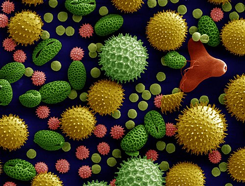

# RINITE ALÉRGICA

A rinite alérgica não é apenas um "nariz escorrendo". Se você encarar assim na prova, vai errar questões de imunologia, pediatria e até de gestão em saúde. Como professor, vejo muitos alunos negligenciando este tema por acharem "simples", mas as bancas utilizam a rinite como porta de entrada para cobrar a **Marcha Atópica** e a fisiopatologia da hipersensibilidade tipo I.

Para entender rinite, você precisa entender que o nariz é o "porteiro" do sistema respiratório. Quando esse porteiro é hiper-reativo, ele causa uma inflamação mediada por IgE que afeta a qualidade de vida, o sono e o desempenho escolar do paciente.

*Figura 1 - Rinite alérgica: a inalação de alérgenos ativa mastócitos sensibilizados por IgE na mucosa nasal, liberando histamina e outros mediadores que causam edema, rinorreia e prurido. Fonte: BruceBlaus, CC BY 3.0 | Wikimedia Commons*

## Fisiopatologia: O Porquê dos Sintomas

Por que o nariz do alérgico fica pálido e não vermelho como na gripe? Por que o paciente espirra 20 vezes seguidas? A resposta está na imunologia.

A rinite alérgica é uma reação de hipersensibilidade tipo I (imediata). Tudo começa com a **fase de sensibilização**: o indivíduo geneticamente predisposto é exposto a um alérgeno (ácaro, pólen, epitélio de cão). O sistema imune, em vez de ignorar essa partícula inócua, monta uma resposta Th2, produzindo citocinas como IL-4, IL-5 e IL-13, que estimulam os linfócitos B a fabricarem **IgE específica**.

Essa IgE se acopla aos mastócitos na mucosa nasal. Quando o paciente reencontra o alérgeno, ocorre a **fase efetora**:

- **Fase Imediata (minutos):** O alérgeno se liga à IgE no mastócito, causando sua degranulação. O principal vilão aqui é a **histamina**. Ela estimula terminações nervosas (causando prurido e espirros) e promove vasodilatação e aumento da permeabilidade vascular (causando rinorreia aquosa e edema).

- **Fase Tardia (4 a 8 horas):** Aqui entram os eosinófilos, recrutados pela IL-5. Eles liberam proteínas básicas que perpetuam a inflamação e causam a **obstrução nasal** crônica.

**Dica de Prova:** Se a questão descreve uma mucosa nasal "pálida, edemaciada e violácea", marque rinite alérgica. Se descrever "hiperemiada e avermelhada", pense em rinite infecciosa (resfriado comum).

## Epidemiologia e a Hipótese da Higiene

A rinite alérgica é a doença alérgica mais prevalente em crianças em idade escolar. Mas por que temos tantos alérgicos hoje em dia?

A **Hipótese da Higiene** explica isso: o excesso de limpeza e o uso precoce de antibióticos diminuem a exposição a microbios na infância. Sem "treinamento" com bactérias (que desviariam a resposta para Th1), o sistema imune "se vicia" na resposta Th2 (alérgica).

Fatores de risco clássicos que aparecem em provas:

- História familiar de atopia (o fator isolado mais forte).

- Exposição ao **tabagismo passivo** (aumenta a sensibilização e agrava os sintomas).

- Parto cesáreo (altera a microbiota inicial).

- Exposição precoce a alérgenos domiciliares.

## O Conceito de Marcha Atópica

Aqui no MedEvo, sempre enfatizamos que o paciente atópico é um só. A rinite raramente vem sozinha. A **Marcha Atópica** é a sequência temporal de manifestações alérgicas:

- Alergia Alimentar (geralmente APLV nos primeiros meses).

- Dermatite Atópica (lactente).

- Asma (pré-escolar).

- Rinite Alérgica (escolar/adolescente).

**Cuidado:** Se uma questão trouxer uma criança com rinite e tosse seca noturna, não pense apenas em gotejamento pós-nasal. Pense em **Asma**. Rinite e Asma são consideradas "uma única via aérea, uma única doença". O controle da rinite é fundamental para o controle da asma.

## Quadro Clínico e Exame Físico

O diagnóstico da rinite alérgica é **essencialmente clínico**. Você não precisa de exames sofisticados para dizer que o paciente tem rinite, mas precisa saber identificar os sinais clássicos que as bancas adoram descrever.

### Sintomas Cardinais

- **Prurido Nasal:** Pode ser intenso, levando ao sinal da "saudação alérgica" (o ato de empurrar o nariz para cima com a palma da mão).

- **Espirros em Salva:** Mais de 5 espirros consecutivos, geralmente ao acordar ou ao contato com poeira.

- **Rinorreia Aquosa:** Coriza hialina, "água" saindo pelo nariz.

- **Obstrução Nasal:** Frequentemente pior à noite ou ao deitar.

### Sinais no Exame Físico

- **Sulco Nasal Transverso:** Uma linha horizontal no dorso do nariz causada pela saudação alérgica repetida.

- **Allergic Shiners (Olheiras Alérgicas):** Coloração escura infraorbitária. Por que isso acontece? É **congestão venosa** secundária ao edema crônico da mucosa nasal que dificulta a drenagem local.

- **Linhas de Dennie-Morgan:** Pregas cutâneas extras abaixo das pálpebras inferiores, comuns na dermatite atópica e rinite.

- **Palato em Ogiva:** O paciente respira pela boca (respirador bucal), o que altera o desenvolvimento facial, elevando o palato.

- **Hipertrofia de Cornetos:** Ao exame com espéculo nasal, você verá cornetos aumentados e pálidos.

**Exemplo Clínico:** Imagine um menino de 8 anos com tosse crônica, especialmente ao deitar. A mãe diz que ele "está sempre gripado". Ao exame: olheiras profundas e uma linha no nariz. Diagnóstico? Rinite alérgica com gotejamento pós-nasal irritando a hipofaringe.

## Classificação ARIA (O Coração da Prova)

As bancas não perguntam mais se a rinite é "sazonal" ou "perene". Elas usam a classificação do consenso **ARIA (Allergic Rhinitis and its Impact on Asthma)**. Você PRECISA decorar esta tabela.

### Tabela 1: Classificação ARIA

| Critério | Definição |
| --- | --- |
| **Intermitente** | Sintomas < 4 dias por semana **OU** < 4 semanas consecutivas por ano. |
| **Persistente** | Sintomas ≥ 4 dias por semana **E** ≥ 4 semanas consecutivas por ano. |
| **Leve** | Sono normal; atividades diárias/esporte normais; escola/trabalho normais; **sem** sintomas perturbadores. |
| **Moderada-Grave** | Presença de 1 ou mais: Sono alterado; prejuízo nas atividades/esporte; prejuízo na escola/trabalho; sintomas perturbadores. |

**Erro Clássico:** Achar que "Persistente" é o mesmo que "Grave". Um paciente pode ter rinite persistente (todo dia), mas leve (não atrapalha em nada). A conduta muda completamente conforme essa classificação.

## Diagnóstico Complementar

Se o diagnóstico é clínico, para que servem os exames? Para identificar o **gatilho** e planejar a imunoterapia.

- **Teste de Prick (Teste Cutâneo de Leitura Imediata):** É um teste *in vivo*. Pinga-se o alérgeno na pele e faz-se uma puntura. Se houver pápula ≥ 3mm após 15-20 min, o teste é positivo. É rápido, barato e sensível.

- **IgE Específica Sérica:** Teste *in vitro* (métodos imunoenzimáticos como o ImmunoCAP). Indicado se o paciente tiver dermatite grave (sem área de pele sã), se usar anti-histamínicos que não podem ser suspensos ou se houver risco de anafilaxia.

- **Eosinofilia Sérica/Nasal:** Tem baixa sensibilidade e especificidade. Não define diagnóstico.

- **Radiografia de Seios Paranasais:** **NÃO** é necessária para confirmar rinite. É um erro comum pedir "RX de seios da face" para rinite. Só peça se suspeitar de rinossinusite bacteriana aguda como complicação.

- **Espirometria:** Não é necessária para o diagnóstico de rinite, mas deve ser solicitada se houver qualquer suspeita de asma associada (tosse, sibilância, aperto no peito).

## Diagnóstico Diferencial

Nem tudo que espirra é rinite alérgica. Como o Dr. Will costuma dizer, o bom clínico é aquele que enxerga além do óbvio.

### Tabela 2: Diagnóstico Diferencial das Rinites

| Tipo de Rinite | Características Principais |
| --- | --- |
| **Infecciosa** | Aguda, autolimitada, febre baixa, mucosa hiperemiada, secreção purulenta após alguns dias. |
| **Medicamentosa** | Uso crônico de descongestionantes tópicos (oximetazolina). Causa efeito rebote grave. |
| **Vasomotora** | Gatilhos físicos: mudança de temperatura, odores fortes, fumaça. Prurido e espirros são raros. |
| **NARES** | Rinite Não-Alérgica com Eosinofilia. Sintomas de rinite, Prick negativo, mas muitos eosinófilos no citograma nasal. |
| **Gustatória** | Rinorreia aquosa desencadeada por alimentos quentes ou picantes. |

*Figura 2 - Diversos grãos de pólen vistos ao microscópio eletrônico (imagem colorizada): os alérgenos inalatórios como o pólen são os principais desencadeantes da rinite alérgica sazonal. Fonte: Dartmouth, Domínio Público | Wikimedia Commons*

## Tratamento: O Passo a Passo

O tratamento baseia-se em três pilares: Controle Ambiental, Farmacoterapia e Imunoterapia.

### 1. Controle Ambiental (Higiene do Ambiente)

Muitas questões cobram o que funciona e o que não funciona.

- **Eficaz:** Uso de capas impermeáveis (plástico ou tecido especial) em colchões e travesseiros (Prevenção primária contra ácaros). Lavar roupas de cama com água quente (> 55°C). Retirar tapetes e cortinas do quarto.

- **Ineficaz/Não ideal:** Aspiradores de pó comuns (eles levantam o pó e espalham alérgenos se não tiverem filtro HEPA). Purificadores de ar isolados.

- **Tabagismo:** Cessação completa do tabagismo passivo é mandatória.

### 2. Farmacoterapia

Aqui a diretriz é clara: a escolha depende da classificação ARIA.

- **Rinite Leve Intermitente:** Anti-histamínicos H1 de 2ª geração (Loratadina, Desloratadina, Cetirizina, Fexofenadina). Eles são preferíveis aos de 1ª geração (Dexclorfeniramina) porque não causam sedação nem prejuízo cognitivo.

- **Rinite Moderada-Grave ou Persistente:** O **Corticoide Tópico Nasal** é a primeira linha de tratamento. É o fármaco mais eficaz para tratar a obstrução nasal e a inflamação tardia.

- Exemplos: Mometasona, Fluticasona, Budesonida.

- Dose: Geralmente 1 a 2 jatos em cada narina, 1x ao dia.

- Início de ação: Demora de 12 a 24h para começar e até 2 semanas para o efeito máximo. Avise o paciente!

**Dica de Ouro:** Se o paciente tem sintomas oculares (conjuntivite alérgica) associados, os corticoides nasais também ajudam por via reflexa, mas colírios anti-histamínicos podem ser associados.

### 3. Lavagem Nasal

O uso de solução salina (soro fisiológico 0,9%) deve ser estimulado em todos os pacientes. Ela remove mecanicamente os alérgenos e o muco, além de hidratar a mucosa. Pode ser feita várias vezes ao dia.

### 4. Imunoterapia Alérgeno-Específica

É o único tratamento que pode **modificar a história natural da doença**, prevenindo a progressão para asma.

- Indicação: Pacientes com rinite moderada-grave que não respondem bem ao tratamento clínico ou que têm efeitos colaterais.

- Como funciona: Exposições repetidas a doses crescentes do alérgeno para induzir tolerância (desvio de resposta Th2 para Th1/Treg).

## Situações Especiais e Comorbidades

### Rinite e Asma

Cerca de 80% dos asmáticos têm rinite. O tratamento da rinite reduz o número de hospitalizações por asma. Nunca trate um sem avaliar o outro.

### Dermatite Atópica (DA)

A DA é frequentemente a primeira manifestação da atopia. Caracteriza-se por prurido intenso e lesões eczematosas.

- **Fase Aguda:** Lesões exsudativas. Tratamento: Corticoide tópico + compressas úmidas.

- **Fase Crônica:** Liquenificação (pele grossa). Tratamento: Hidratação intensiva e corticoides de maior potência.

- **Ptiríase Alba:** Aquelas manchas esbranquiçadas na face de crianças atópicas. Não é "verme" nem "fungo", é um sinal de atopia e ressecamento da pele.

### Alergia à Proteína do Leite de Vaca (APLV)

A APLV é a alergia alimentar mais comum na infância.

- **Reatividade Cruzada:** O leite de cabra e de ovelha tem proteínas muito parecidas com as do leite de vaca. Portanto, **leite de cabra NÃO é substituto para APLV**.

- **Fórmulas:** Para lactentes com APLV, usamos fórmulas extensamente hidrolisadas ou de aminoácidos.

- **Diagnóstico:** O padrão-ouro é o **Teste de Provocação Oral (TPO)**. Porém, se o paciente teve anafilaxia recente e tem IgE específica alta, o TPO é contraindicado pelo risco de morte.

### Amamentação e Medicamentos

O aleitamento materno exclusivo até os 4-6 meses é a principal estratégia de prevenção de doenças alérgicas.

- **Amiodarona:** Contraindicada na lactação (risco de hipotireoidismo no lactente devido à alta carga de iodo).

- **Anti-histamínicos:** Preferir os de 2ª geração, que passam menos para o leite e causam menos sonolência no bebê.

### Imunodeficiências

Se você vir uma criança com rinite, asma e **infecções de repetição** (otites, pneumonias), pense em **Deficiência Seletiva de IgA**. É a imunodeficiência primária mais comum e está fortemente associada a doenças atópicas.

## Tabela 3: Resumo do Tratamento Farmacológico

| Classe Farmacológica | Principal Indicação | Observações de Prova |
| --- | --- | --- |
| **Anti-H1 2ª Geração** | Sintomas leves, prurido, espirros. | Pouca sedação. Ex: Loratadina, Fexofenadina. |
| **Corticoide Nasal** | Rinite Moderada/Grave ou Persistente. | Padrão-ouro para obstrução nasal. |
| **Descongestionantes** | Alívio imediato da obstrução. | Uso limitado a 3-5 dias (risco de rinite medicamentosa). |
| **Antileucotrienos** | Rinite + Asma associada. | Ex: Montelucaste. Menos eficaz que corticoide nasal para rinite isolada. |
| **Cromonas** | Prevenção. | Perfil de segurança excelente, mas eficácia baixa e múltiplas doses. |

## Ética e Regulação (O que cai em provas de Preventiva)

Muitas vezes o tema rinite é usado para cobrar conceitos de rede de atenção.

- **Regulação de Vagas:** Um hospital de referência não pode negar atendimento a um caso de anafilaxia ou crise grave de asma alegando falta de vaga, se tiver capacidade técnica para resolver.

- **Transferência:** Deve ser feita de médico para médico, garantindo a estabilidade do paciente.

## Pontos-Chave para Prova 🧠

- **Definição de Rinite Persistente:** Sintomas > 4 dias/semana E > 4 semanas/ano.

- **Tratamento de Escolha (Moderada/Grave):** Corticoide tópico nasal (ex: Mometasona).

- **Allergic Shiners:** Olheiras por congestão venosa devido ao edema nasal.

- **Mucosa Nasal na Rinite:** Pálida e edemaciada (diferente da rinite infecciosa, que é hiperemiada).

- **Diagnóstico:** Primariamente clínico. Radiografia de seios da face NÃO é necessária.

- **Marcha Atópica:** Dermatite Atópica -> Alergia Alimentar -> Asma -> Rinite.

- **APLV e Leite de Cabra:** Contraindicado devido à alta reatividade cruzada (proteínas homólogas).

- **Prevenção de Ácaros:** Capas plásticas/impermeáveis em colchões e travesseiros são a medida mais eficaz.

- **Teste de Prick:** É um teste *in vivo*. Anti-histamínicos devem ser suspensos 7 dias antes.

- **Deficiência de IgA:** Suspeitar se houver atopia + infecções respiratórias de repetição.

- **Amiodarona na Lactação:** Contraindicação absoluta pelo risco de toxicidade tireoidiana no lactente.

- **Epinefrina Autoinjetável:** Prescrever sempre que houver história de anafilaxia (ex: alergia grave a amendoim).

- **Chocolate:** NÃO é um alérgeno alimentar comum em provas (os comuns são leite, ovo, soja, trigo, amendoim, peixe e frutos do mar).

- **Tosse Crônica:** Rinite alérgica é uma das causas mais comuns de tosse crônica na infância (gotejamento pós-nasal).

- **O que NÃO fazer:** Usar descongestionantes tópicos por mais de 5 dias ou usar anti-histamínicos de 1ª geração como rotina para rinite.

 Cópia offline para consulta pessoal.
 Fonte original:
 [https://www.medevo.com.br/material-apoio/ler/88f552a3-5614-4608-b0dd-8b14e9f8bcf0](https://www.medevo.com.br/material-apoio/ler/88f552a3-5614-4608-b0dd-8b14e9f8bcf0)
