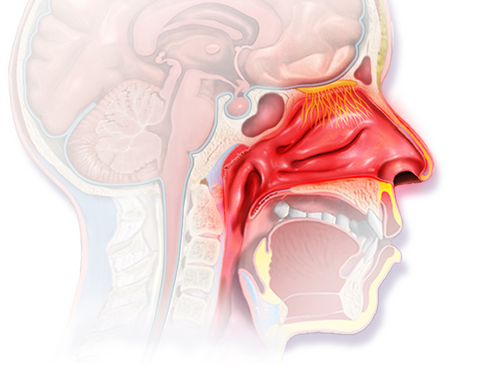

# RINITE ALÉRGICA E RINOSSINUSITES

Para começar nossa conversa, você precisa internalizar um conceito que mudou a forma como a medicina encara as doenças respiratórias: a teoria da via aérea única. Esqueça a ideia de que o nariz e os pulmões são órgãos isolados. Se o seu paciente tem rinite, a chance de ele ter ou vir a ter asma é altíssima. No MedEvo, sempre reforçamos que tratar o nariz é, muitas vezes, o primeiro passo para controlar o pulmão.

*Figura 1 - Rinite alérgica: a exposição a alérgenos desencadeia resposta imunológica mediada por IgE, com liberação de histamina pelos mastócitos da mucosa nasal. Fonte: BruceBlaus, CC BY 3.0 | Wikimedia Commons*

## Rinite Alérgica: Muito Além do Espirro

A rinite alérgica (RA) é a doença crônica mais comum na pediatria. Não é apenas um incômodo, ela impacta o sono, o rendimento escolar e a qualidade de vida da criança. Segundo o V Consenso Brasileiro sobre Rinites (2024), a prevalência em escolares e adolescentes no Brasil gira em torno de 25 a 30%.

### Fisiopatologia e a Hipótese da Higiene

Por que algumas crianças desenvolvem rinite e outras não? Aqui entra a Hipótese da Higiene. O Dr. Will costuma explicar que nosso sistema imunológico é como um exército que precisa de treinamento. Se a criança vive em um ambiente excessivamente limpo, sem exposição a microbios e endotoxinas na primeira infância, esse exército (o sistema imune) fica "entediado" e começa a atacar alvos inofensivos, como o pólen ou as fezes do ácaro.

Mecanicamente, a RA é uma reação de hipersensibilidade do tipo I (mediada por IgE). Quando o alérgeno entra em contato com a mucosa nasal de um indivíduo sensibilizado, ocorre a degranulação de mastócitos, liberando histamina (fase imediata, responsável pelo prurido e espirros) e, horas depois, a infiltração de eosinófilos e liberação de leucotrienos (fase tardia, responsável pela obstrução nasal).

### Quadro Clínico: O que o examinador quer que você veja

As bancas adoram descrever o "fácies do respirador bucal". Fique atento a estes sinais no enunciado:

- **Saudação Alérgica:** O ato de esfregar o nariz para cima com a palma da mão para aliviar o prurido.

- **Sulco Nasal Transversal:** Uma linha horizontal acima da ponta do nariz, causada pela saudação alérgica repetida.

- **Olheiras Alérgicas (Dennie-Morgan):** Pregas infraorbitárias acentuadas devido à congestão venosa crônica.

- **Voz anasalada e respiração bucal:** Sugerem obstrução crônica importante.

### Classificação ARIA (O Coração da Conduta)

Você não pode ir para a prova sem saber a classificação ARIA (Allergic Rhinitis and its Impact on Asthma). É ela que define se você vai prescrever apenas um anti-histamínico ou se vai precisar de corticoide tópico.

**Tabela 1: Classificação ARIA (Adaptada do V Consenso Brasileiro, 2024)**

| Critério | Definição |
| --- | --- |
| **Frequência: Intermitente** | Sintomas < 4 dias por semana OU < 4 semanas consecutivas. |
| **Frequência: Persistente** | Sintomas ≥ 4 dias por semana E ≥ 4 semanas consecutivas. |
| **Gravidade: Leve** | Sono normal, atividades diárias normais, sem incômodo importante. |
| **Gravidade: Moderada/Grave** | Presença de 1 ou mais: distúrbio do sono, prejuízo escolar/laboral, sintomas incômodos. |

### Diagnóstico: Quando pedir exames?

O diagnóstico da rinite alérgica é eminentemente clínico. No entanto, para confirmar a etiologia alérgica e orientar a imunoterapia, utilizamos:

- **Teste de Puntura (Skin Prick Test):** Padrão-ouro para identificar sensibilização. É rápido e tem alto valor preditivo negativo.

- **IgE Específica (RAST/ImmunoCAP):** Útil quando o teste cutâneo é contraindicado (ex: dermatite atópica grave ou uso de anti-histamínicos que não podem ser suspensos).

Cuidado: IgE total aumentada e eosinofilia sanguínea são inespecíficas. Elas podem estar presentes em parasitoses, por exemplo. Não feche diagnóstico de rinite alérgica apenas com IgE total alta.

### Tratamento Farmacológico: A Escada Terapêutica

Aqui é onde a maioria dos alunos erra por querer "economizar" no tratamento.

- **Controle Ambiental:** É o passo zero. Reduzir ácaros (capas de colchão, retirar tapetes), evitar mofo e fumaça de cigarro. Mas atenção: a diretriz deixa claro que o controle ambiental isolado raramente controla a rinite moderada/grave.

- **Anti-histamínicos H1 de 2ª Geração:** (Desloratadina, Cetirizina, Fexofenadina). São a primeira escolha para rinite leve ou intermitente. Por que não usar os de 1ª geração (Dexclorfeniramina)? Porque eles atravessam a barreira hematoencefálica, causam sonolência e prejudicam o aprendizado da criança.

- **Corticosteroides Intranasais (CEI):** (Budesonida, Fluticasona, Mometasona). São o tratamento mais eficaz para a congestão nasal. São a primeira linha para rinite moderada/grave (persistente ou intermitente).

- **Antagonistas de Receptores de Leucotrienos:** (Montelucaste). Excelente se houver asma associada, mas não é primeira linha isolada para rinite.

**Tabela 2: Resumo do Tratamento conforme Gravidade**

| Classificação | Conduta Inicial |
| --- | --- |
| **Intermitente Leve** | Anti-histamínico oral ou nasal (se necessário). |
| **Intermitente Mod/Grave** | Anti-histamínico oral ou CEI. |
| **Persistente Leve** | Anti-histamínico oral ou CEI. |
| **Persistente Mod/Grave** | CEI (obrigatório) + considerar Anti-histamínico ou Montelucaste. |

*Figura 2 - Ilustração de rinossinusite: inflamação e acúmulo de secreção nos seios paranasais. A obstrução do óstio sinusal causa dor facial e congestão nasal. Fonte: CDC, Domínio Público | Wikimedia Commons*

## Rinossinusites na Infância

A rinossinusite (RS) é a inflamação da mucosa do nariz e dos seios paranasais. Na criança, os seios etmoidais e maxilares já estão presentes ao nascimento, mas os frontais e esfenoidais só se desenvolvem mais tarde (frontais após os 7 anos). Isso explica por que crianças pequenas não têm "sinusite frontal".

### Diferenciando o Resfriado Comum da Rinossinusite Bacteriana

Este é o ponto mais cobrado em provas de pediatria. A maioria das IVAS é viral. Como saber quando entrar com antibiótico?

Segundo a SBP e o Consenso Brasileiro de Rinossinusites, o diagnóstico de Rinossinusite Aguda Bacteriana (RSAB) é clínico e baseia-se em três padrões:

- **Sintomas Persistentes:** Tosse e rinorreia (de qualquer cor) que duram mais de 10 dias sem melhora.

- **Quadro Grave (Início Severo):** Febre alta (≥ 39°C) associada a secreção nasal purulenta por pelo menos 3 a 4 dias consecutivos logo no início da doença.

- **Piora Clínica (Double Sickening):** A criança estava melhorando de um resfriado comum e, de repente, volta a ter febre, tosse ou secreção nasal piorada.

### O Erro Clássico: A Cor da Secreção

Nunca, em hipótese alguma, use a cor da secreção (amarela ou verde) como critério isolado para prescrever antibiótico. No resfriado comum, a secreção pode ficar purulenta devido à descamação celular e presença de polimorfonucleares, sem que haja infecção bacteriana. O que importa é o tempo (10 dias) ou a gravidade inicial.

### Exames de Imagem: Por que não pedir Raio-X?

A diretriz brasileira é categórica: a radiografia simples de seios da face NÃO deve ser utilizada para o diagnóstico de RSAB em crianças. Ela tem baixa especificidade (muitos falsos positivos em crianças saudáveis ou com rinite) e não diferencia infecção viral de bacteriana.

A Tomografia Computadorizada (TC) é reservada para:

- Suspeita de complicações (orbitárias ou intracranianas).

- Rinossinusite crônica (sintomas > 12 semanas) que não responde ao tratamento.

- Planejamento cirúrgico.

### Tratamento da Rinossinusite Aguda Bacteriana

O objetivo é erradicar a infecção, prevenir complicações e reduzir os sintomas.

- **Primeira Escolha:** Amoxicilina (45 mg/kg/dia, dividida em 2 ou 3 doses).

- **Quando usar Amoxicilina-Clavulanato ou Dose Dobrada?** Se a criança frequenta creche, usou antibiótico nos últimos 30 dias ou tem menos de 2 anos, usamos Amoxicilina em dose alta (80 a 90 mg/kg/dia) ou associamos o Clavulanato.

- **Duração:** Geralmente 10 a 14 dias, ou 7 dias após a resolução dos sintomas.

- **Adjuvantes:** Lavagem nasal com solução salina isotônica é fundamental. Corticoides nasais podem ser usados se houver componente alérgico associado.

**Tabela 3: Antibioticoterapia na RSAB Pediátrica**

| Perfil do Paciente | Antibiótico | Dose (mg/kg/dia) |
| --- | --- | --- |
| **Baixo Risco (> 2 anos, sem creche)** | Amoxicilina | 45 mg/kg/dia |
| **Alto Risco (Creche, < 2 anos, ATB recente)** | Amoxicilina-Clavulanato | 80-90 mg/kg/dia (da Amox) |
| **Alérgicos a Penicilina (Não anafilaxia)** | Cefuroxima ou Ceftriaxone | Conforme bula |
| **Alérgicos a Penicilina (Anafilaxia)** | Claritromicina ou Azitromicina | Conforme bula |

### Complicações: O Pesadelo do Pediatra

As complicações orbitárias são as mais comuns devido à proximidade do seio etmoide com a órbita (separados apenas pela fina lâmina papirácea).

**Classificação de Chandler (Simplificada):**

- **Celulite Pré-septal:** Edema e eritema palpebral. Movimentação ocular e visão normais. Tratamento ambulatorial.

- **Celulite Orbitária (Pós-septal):** Proptose, dor à movimentação ocular, quemose. Emergência! Requer internação e ATB venoso.

- **Abscesso Subperiosteal:** Desvio do globo ocular.

- **Abscesso Orbitário:** Risco de perda visual.

- **Trombose de Seio Cavernoso:** Oftalmoplegia bilateral, sinais meníngeos. Gravíssimo.

## Diagnóstico Diferencial: As Pegadinhas de Prova

Imagine este cenário: Criança de 3 anos com rinorreia purulenta unilateral e fétida há 5 dias. Qual o diagnóstico?
Se você pensou em sinusite, errou. Rinorreia unilateral fétida em criança é **Corpo Estranho Nasal** até que se prove o contrário. A sinusite bacteriana costuma ser bilateral.

Outro diferencial importante é a **Hipertrofia de Adenoide**. A criança apresenta obstrução nasal crônica, roncos e respiração bucal, mas sem o prurido e os espirros típicos da rinite. No exame físico, pode apresentar a "fácies adenoidiana" (rosto alongado, palato ogival). O diagnóstico é feito por videonasofibroscopia ou radiografia de perfil da rinofaringe (Raio-X de Cavum).

## Situações Especiais e Comorbidades

### A Marcha Atópica

Muitas vezes, a rinite é apenas uma parada na "marcha atópica". A sequência clássica é: Dermatite Atópica no lactente → Alergia Alimentar → Rinite Alérgica → Asma. Se você atende um lactente com sibilância recorrente e dermatite atópica, o risco de ele ser um asmático no futuro é altíssimo.

### Otite Média Recorrente

A disfunção da tuba auditiva causada pela inflamação da rinite ou pela hipertrofia de adenoide leva à otite média com efusão (otite serosa). Tratar a rinite é essencial para prevenir a colocação de tubos de ventilação.

## Pontos-Chave para Prova 🎯

- **Rinite Alérgica:** Diagnóstico clínico. Tríade: espirros, prurido, rinorreia hialina e obstrução.

- **Classificação ARIA:** Persistente é > 4 dias/semana E > 4 semanas. Moderada/Grave altera sono ou atividades.

- **Tratamento RA:** Corticoide nasal é a 1ª linha para moderada/grave. Anti-histamínicos de 2ª geração para leve.

- **Hipótese da Higiene:** Menos exposição microbiana precoce aumenta o risco de doenças atópicas (Th2).

- **Rinossinusite Bacteriana (RSAB):** Três critérios: sintomas > 10 dias, início grave (febre alta + pus 3 dias) ou piora após melhora (double sickening).

- **Cor da secreção:** Amarela ou verde NÃO define uso de antibiótico.

- **Imagem na RSAB:** Radiografia simples NÃO é recomendada. TC apenas para complicações ou casos crônicos.

- **Antibiótico RSAB:** Amoxicilina 45 mg/kg/dia é a base. Dobrar a dose (90 mg/kg) se houver risco de resistência (creche, < 2 anos).

- **Corpo Estranho:** Suspeite sempre que a secreção for unilateral e fétida.

- **Complicação Orbitária:** Celulite pré-septal (pálpebra) vs. orbitária (olho/movimento). A segunda é emergência.

- **Hipertrofia de Adenoide:** Causa roncos e respiração bucal crônica. Diagnóstico diferencial importante da rinite.

- **Anti-histamínicos de 1ª Geração:** Evitar na pediatria devido aos efeitos colaterais cognitivos e sedação.

- **Lavagem Nasal:** Medida não-farmacológica mais importante em todas as rinites e rinossinusites.

- **Marcha Atópica:** Rinite, asma e dermatite atópica andam juntas. Sempre investigue as outras se encontrar uma.

- **Sibilância Recorrente:** Lactente sibilante com dermatite atópica tem alta chance de asma.

- **Contraindicação Absoluta:** Não use descongestionantes tópicos (vasoconstritores) por mais de 3 a 5 dias (risco de rinite medicamentosa e efeito rebote).

- **Erro de Prova:** A alternativa dirá que "toda criança com 7 dias de coriza verde precisa de Amoxicilina". Falso! Precisa de 10 dias ou critérios de gravidade.

- **Dica do MedEvo:** Se a questão mostrar uma criança com "face alongada" e "olheiras", pense em rinite alérgica + hipertrofia de adenoide. A conduta será corticoide nasal e avaliação da adenoide.

 Cópia offline para consulta pessoal.
 Fonte original:
 [https://www.medevo.com.br/material-apoio/ler/d8fb1f03-0441-4425-bca0-4ef50938099b](https://www.medevo.com.br/material-apoio/ler/d8fb1f03-0441-4425-bca0-4ef50938099b)
