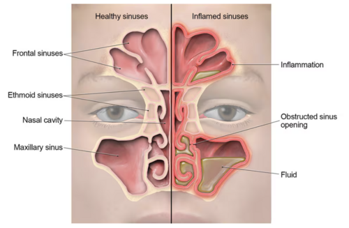
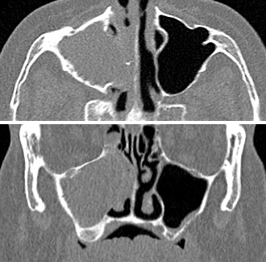

# RINOSSINUSITES

Para começar nosso estudo, você precisa esquecer o termo "sinusite". Na prática médica e, principalmente, nas provas de residência baseadas nas diretrizes da Associação Brasileira de Otorrinolaringologia e Cirurgia Cérvico-Facial (ABORL-CCF), utilizamos o termo **Rinossinusite**.

Por que essa mudança? Porque a mucosa dos seios paranasais é contínua com a mucosa da cavidade nasal. É virtualmente impossível ter uma inflamação dos seios sem que o nariz também esteja envolvido. Entender isso ajuda a compreender por que o tratamento sempre passa pelo nariz, e não apenas por medicações sistêmicas.

## Classificação e Temporalidade: O Divisor de Águas

O primeiro grande erro que vejo alunos cometerem em provas é não olhar o relógio. Nas rinossinusites, o tempo é o seu melhor amigo para o diagnóstico.

A classificação oficial divide o quadro em:

- **Rinossinusite Aguda (RSA):** Sintomas que duram até 12 semanas.

- **Rinossinusite Crônica (RSC):** Sintomas que ultrapassam 12 semanas, sem resolução completa.

Dentro da fase aguda, temos uma subdivisão crítica que as bancas amam explorar para testar se você sabe quando prescrever antibióticos:

- **Rinossinusite Viral (Resfriado Comum):** Duração dos sintomas inferior a 10 dias.

- **Rinossinusite Pós-Viral:** Piora dos sintomas após o 5º dia ou persistência além do 10º dia, mas com duração total menor que 12 semanas.

- **Rinossinusite Bacteriana Aguda (RSBA):** É a minoria dos casos (cerca de 0,5% a 2%).

**Dica de Prova:** Se a questão descreve um paciente com 3 ou 4 dias de sintomas leves, a resposta NUNCA será antibiótico. A imensa maioria das rinossinusites agudas é viral.

*Figura 1 - Rinossinusite: a obstrução do complexo ostiomeatal impede a drenagem de muco dos seios paranasais, favorecendo a proliferação bacteriana e a inflamação. Fonte: CDC, Domínio Público | Wikimedia Commons*

## Fisiopatologia: Por que o seio inflama?

Para o Dr. Will e a equipe da MedEvo, entender o "porquê" é o que diferencia o médico que decora do médico que raciocina. O seio paranasal é uma cavidade aerada que precisa de três coisas para ser saudável:

- Óstios de drenagem pérvios (abertos).

- Aparelho mucociliar funcionando (os cílios "varrem" o muco).

- Secreção de qualidade (muco fluido).

Na rinossinusite, ocorre um insulto (geralmente viral) que causa edema da mucosa. Esse edema fecha o óstio de drenagem. Imagine uma sala fechada, quente e com lixo acumulado. O muco fica retido, a pressão aumenta (causando dor) e o ambiente se torna um meio de cultura perfeito para bactérias.

É por isso que a base do tratamento, como veremos adiante, é "abrir a porta" e "limpar a sala" com lavagem nasal e corticoides, e não apenas tentar matar a bactéria que está lá dentro.

## Critérios Diagnósticos: O que você deve procurar

O diagnóstico da rinossinusite aguda é **essencialmente clínico**. Guarde isso: você não precisa de tomografia para diagnosticar uma rinossinusite aguda não complicada.

Segundo o Consenso Brasileiro, o diagnóstico clínico de RSA requer a presença de dois ou mais sintomas "maiores", sendo que um deles deve ser obrigatoriamente **obstrução nasal** ou **rinorreia (secreção nasal)**.

Os sintomas principais são:

- Obstrução nasal (congestão).

- Rinorreia (pode ser anterior ou posterior, o famoso "gotejamento pós-nasal").

- Dor ou pressão facial.

- Redução ou perda do olfato (hiposmia/anosmia).

Em crianças, a tosse é um sintoma muito comum e substitui a alteração do olfato nos critérios diagnósticos.

### Quando suspeitar de etiologia bacteriana?

Esta é a "menina dos olhos" das provas de residência. Como diferenciar o vírus da bactéria? A diretriz aponta três cenários que sugerem fortemente bactéria:

- **Duração:** Sintomas que duram mais de 10 dias sem melhora.

- **Piora após melhora (Double Sickening):** O paciente começa como um resfriado comum, melhora por 2 ou 3 dias e, de repente, volta a ter febre alta, dor intensa e secreção purulenta.

- **Gravidade inicial:** Febre alta (acima de 39°C) associada a secreção nasal purulenta e dor facial intensa por pelo menos 3 dias consecutivos logo no início do quadro.

**Tabela 1: Diferenciação Clínica das Rinossinusites Agudas**

| Característica | Viral (Resfriado) | Pós-Viral | Bacteriana (RSBA) |
| --- | --- | --- | --- |
| Duração | < 10 dias | 10 dias a 12 semanas | > 10 dias ou "piora" |
| Febre | Baixa ou ausente | Rara | Comum e alta (>39°C) |
| Intensidade | Leve a moderada | Moderada | Intensa |
| Conduta | Sintomáticos | Corticoide Tópico | Antibiótico + Tópico |

## Exame Físico e o Registro SOAP

No exame físico, você deve buscar sinais de purulência no meato médio (através da rinoscopia anterior) e avaliar a sensibilidade à palpação dos seios da face. No entanto, a ausência de dor à palpação não exclui o diagnóstico.

Aproveitando o contexto ambulatorial, as provas frequentemente cobram o registro **SOAP**. Lembre-se:

- **S (Subjetivo):** O que o paciente sente (ex: "Sinto um peso no rosto há 12 dias").

- **O (Objetivo):** O que você vê (ex: "Presença de secreção purulenta em meato médio à rinoscopia").

- **A (Avaliação):** O seu diagnóstico (ex: "Rinossinusite Aguda Bacteriana").

- **P (Plano):** Sua conduta (ex: "Amoxicilina + Lavagem nasal").

## Diagnóstico Diferencial e "Red Flags"

Aqui é onde o aluno desatento perde a questão. Nem tudo que dói no rosto e entope o nariz é sinusite.

### Neoplasias de Via Aerodigestiva Superior

Se a questão descreve um paciente com sintomas **unilaterais** (obstrução de um lado só, sangramento de um lado só) e persistentes, acenda o sinal vermelho.

- **Carcinoma de Nasofaringe:** A apresentação inicial mais comum é uma **massa cervical** (linfonodomegalia endurecida e indolor). Outro sinal clássico é a **otite média serosa unilateral** em adultos (o tumor obstrui a tuba auditiva). Se vir "otite serosa unilateral em adulto" na prova, a resposta envolve videolaringoscopia ou nasofibroscopia para excluir câncer.

- **Adenocarcinoma de Etmoide:** Relacionado à exposição ocupacional, especificamente **poeira de madeira**. Se o paciente é marceneiro e tem sintomas nasais crônicos, pense em neoplasia.

### Outros diferenciais

- Rinite alérgica (prurido, espirros, história familiar).

- Disfunção temporomandibular (dor facial que piora ao mastigar).

- Neuralgia do trigêmeo (dor em choque, muito intensa).

## Tratamento: A Arte de Não Prescrever Antibióticos Desnecessários

O tratamento da rinossinusite mudou muito nos últimos anos. O foco saiu do "matar a bactéria" para "restaurar a fisiologia".

### 1. Medidas Não-Farmacológicas (Obrigatórias)

A **lavagem nasal com solução salina** é o pilar fundamental. Ela remove mecanicamente o muco, as crostas, os mediadores inflamatórios e os antígenos.

- **Como fazer:** Use grandes volumes (pelo menos 10-20 ml por narina em adultos) com baixa pressão. A solução deve ser isotônica ou levemente hipertônica.

### 2. Tratamento da Rinossinusite Viral e Pós-Viral

- **Analgésicos e Antipiréticos:** Paracetamol ou Ibuprofeno para controle da dor e febre.

- **Corticosteroides Intranasais:** São a primeira escolha na rinossinusite pós-viral. Eles reduzem o edema da mucosa e ajudam a abrir os óstios de drenagem. Exemplos: Mometasona, Fluticasona ou Budesonida.

- **Descongestionantes Tópicos:** Podem ser usados por, no máximo, 3 a 5 dias. O uso prolongado causa rinite medicamentosa (efeito rebote).

### 3. Tratamento da Rinossinusite Bacteriana Aguda (RSBA)

Quando o diagnóstico de RSBA está firmado (critérios de tempo ou gravidade), o antibiótico está indicado.

- **Primeira Escolha:** Amoxicilina (500 mg de 8/8h ou 875 mg de 12/12h por 7 a 10 dias).

- **Segunda Escolha (ou se falha terapêutica):** Amoxicilina-Clavulanato. O clavulanato é necessário se houver suspeita de bactérias produtoras de beta-lactamase (como *H. influenzae* e *M. catarrhalis*).

- **Alérgicos à Penicilina:** Claritromicina ou Azitromicina (embora a resistência do *S. pneumoniae* aos macrolídeos esteja aumentando) ou Doxiciclina.

**Cuidado:** As bancas adoram perguntar sobre o uso de corticoide sistêmico. Ele pode ser usado em casos de dor muito intensa, mas o corticoide tópico é preferível pela segurança.

**Tabela 2: Opções Antibióticas na RSBA (Adultos)**

| Droga | Dose Padrão | Observação |
| --- | --- | --- |
| Amoxicilina | 1,5g a 3g / dia | Primeira linha na maioria dos casos |
| Amoxicilina-Clavulanato | 875/125mg 12/12h | Se uso de ATB prévio ou falha |
| Levofloxacino | 500mg 1x/dia | Alérgicos graves a beta-lactâmicos |

## Rinossinusite Crônica (RSC)

Se os sintomas durarem mais de 12 semanas, entramos no terreno da cronicidade. Aqui, a fisiopatologia é mais complexa, envolvendo inflamação tecidual e, às vezes, biofilmes bacterianos.

A RSC é dividida em dois grandes fenótipos:

- **RSC com Polipose Nasal (RSCcPN):** Frequentemente associada à asma e intolerância à aspirina (Tríade de Samter).

- **RSC sem Polipose Nasal (RSCsPN):** Mais comum.

O diagnóstico da RSC **exige** confirmação por exame de imagem (Tomografia de Seios da Face) ou endoscopia nasal, demonstrando sinais de inflamação (pólipos, secreção mucopurulenta ou edema em meato médio).

**Dica de Ouro:** Nunca peça Tomografia (TC) para rinossinusite aguda, a menos que suspeite de complicação. Na crônica, a TC é obrigatória para avaliar a anatomia antes de qualquer cirurgia.

*Figura 2 - Tomografia computadorizada coronal dos seios paranasais: observa-se velamento bilateral dos seios maxilares, compatível com rinossinusite crônica. A TC é fundamental para avaliar complicações. Fonte: Mikael Häggström, CC0 | Wikimedia Commons*

## Complicações: Quando a situação fica séria

As complicações ocorrem quando a infecção rompe as barreiras ósseas dos seios paranasais. Elas são emergências médicas.

### 1. Complicações Orbitárias (Mais comuns)

Ocorrem principalmente a partir do seio etmoidal, que é separado da órbita apenas pela fina lâmina papirácea. A classificação de Chandler ajuda a definir a gravidade:

- **Celulite Pré-septal:** Edema de pálpebra, mas a movimentação ocular está normal e não há proptose.

- **Celulite Orbitária:** Proptose, dor à movimentação ocular e quemose.

- **Abscesso Subperiosteal:** Desvio do globo ocular.

- **Abscesso Orbitário:** Risco iminente de amaurose (cegueira).

### 2. Complicações Intracranianas

- Meningite (a mais frequente).

- Abscesso epidural, subdural ou cerebral.

- Trombose do seio cavernoso (quadro gravíssimo com oftalmoplegia e sinais neurológicos).

**Sinais de Alerta (Encaminhar para Emergência):**

- Edema ou eritema periorbitário.

- Desvio do globo ocular ou visão dupla (diplopia).

- Cefaleia holocraniana de forte intensidade.

- Sinais meníngeos ou alteração do nível de consciência.

## Situações Especiais e Prevenção Quaternária

Na pediatria, a rinossinusite é um diagnóstico muito comum. Lembre-se que os seios frontais só se desenvolvem após os 7-10 anos de idade. Portanto, uma criança de 3 anos com dor na testa provavelmente não tem sinusite frontal.

A **Prevenção Quaternária** é um conceito que as bancas de Medicina de Família e Comunidade adoram. No contexto das rinossinusites, ela significa evitar a medicalização excessiva. Ou seja, não prescrever antibióticos para quadros virais, evitando efeitos colaterais e resistência bacteriana.

### Exposição Ocupacional e Câncer

Como mencionado nas pérolas clínicas, a exposição à poeira de madeira está fortemente ligada ao **Adenocarcinoma de Etmoide**. Já a exposição ao níquel e formaldeído liga-se ao carcinoma espinocelular. Se o paciente tem uma história de "sinusite que não cura" apenas de um lado e trabalha em serralheria ou marcenaria, a TC e a biópsia são urgentes.

## Diagnóstico Diferencial: Resumo Comparativo

Para facilitar sua memorização, vamos comparar as principais patologias que "imitam" a rinossinusite nas provas.

**Tabela 3: Diagnóstico Diferencial de Massas e Sintomas Nasais**

| Patologia | Quadro Clínico Chave | Achado de Exame |
| --- | --- | --- |
| **RSBA** | >10 dias, secreção purulenta bilateral | Pus no meato médio |
| **Corpo Estranho** | Criança, rinorreia fétida UNILATERAL | Objeto visível na rinoscopia |
| **Ca de Nasofaringe** | Adulto, massa cervical, otite serosa unilateral | Lesão em teto de nasofaringe |
| **Polipose Nasal** | Anosmia, obstrução bilateral crônica | Massas brilhantes (aspecto de uva) |
| **Angiofibroma** | Adolescente masculino, epistaxe volumosa | Massa avermelhada em rinofaringe |

## Pontos-Chave para Prova

- **Tempo é tudo:** < 10 dias com sintomas leves = Viral. > 10 dias ou piora após o 5º dia = Bacteriana ou Pós-viral.

- **Etiologia:** Os principais agentes da RSBA são *Streptococcus pneumoniae*, *Haemophilus influenzae* e *Moraxella catarrhalis*.

- **Antibiótico de escolha:** Amoxicilina é a primeira linha. Amoxicilina-Clavulanato se falha ou gravidade.

- **Lavagem Nasal:** Deve ser feita com grandes volumes de soro fisiológico. É o tratamento não-farmacológico mais importante.

- **Corticosteroides:** Tópicos (nasais) são indicados na RSA pós-viral e bacteriana. Sistêmicos são reservados para casos graves ou com muita dor.

- **Tomografia:** NÃO deve ser feita na RSA não complicada. É o exame de escolha na RSC e na suspeita de complicações.

- **Unilateralidade é perigo:** Sintomas unilaterais, especialmente em idosos ou com sangramento, exigem investigação para neoplasia.

- **Massa Cervical + Otite Serosa:** Pense em Carcinoma de Nasofaringe até que se prove o contrário.

- **Poeira de Madeira:** Fator de risco clássico para Adenocarcinoma de Etmoide.

- **Complicação Orbitária:** A celulite pré-septal não altera a motilidade ocular; a orbitária sim.

- **O que NÃO fazer:** Não usar antibiótico para resfriado comum. Não usar descongestionante tópico por mais de 5 dias.

- **Critérios de RSBA:** 1) Sintomas > 10 dias; 2) Febre > 39°C + pus por 3 dias; ou 3) "Double sickening" (piora após melhora).

- **SOAP:** S (Subjetivo/História), O (Objetivo/Exame), A (Avaliação/Hipótese), P (Plano/Conduta).

- **Tríade de Samter:** Polipose nasal + Asma + Intolerância a AAS/AINEs.

- **Cefaleia e Febre:** Se houver opacificação na TC, o diagnóstico é Rinossinusite Aguda, mas sempre descarte meningite se houver sinais de irritação meníngea. 👃

 Cópia offline para consulta pessoal.
 Fonte original:
 [https://www.medevo.com.br/material-apoio/ler/3f39d6f4-22a9-48c5-899f-9c937546fcf5](https://www.medevo.com.br/material-apoio/ler/3f39d6f4-22a9-48c5-899f-9c937546fcf5)
