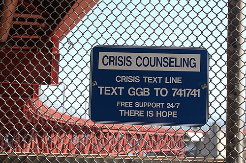
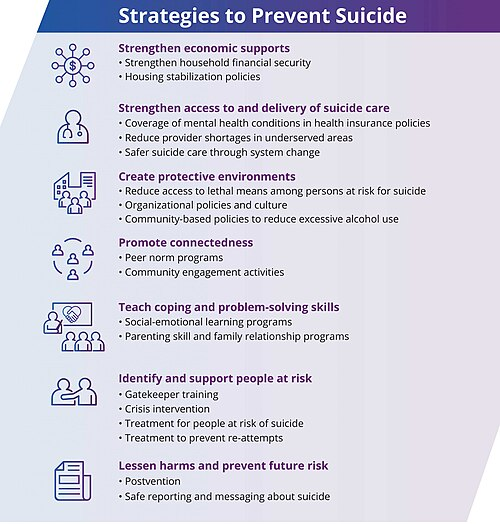

# RISCO DE SUICÍDIO E MANEJO DA CRISE: AVALIAÇÃO E MEDIDAS DE SEGURANÇA

O suicídio não é uma doença em si, mas o desfecho trágico de uma série de fatores que convergem em um momento de dor insuportável. Para a prova de residência e para a sua vida no plantão, entenda: ninguém "quer morrer", a pessoa quer "parar de sofrer". Quando você compreende essa lógica, sua abordagem deixa de ser julgadora e passa a ser técnica e empática.

As bancas examinadoras adoram este tema porque ele mistura clínica, ética, legislação e saúde pública. Vamos dissecar como avaliar esse risco e, mais importante, como intervir para salvar vidas. A placa na imagem abaixo, instalada na Golden Gate Bridge, simboliza a importância da intervenção em momentos de crise — um lembrete de que sempre há esperança:

*Figura 1 - Placa de aconselhamento de crise na Golden Gate Bridge: "There is Hope" (Há Esperança). A restrição de meios e a oferta de suporte imediato são estratégias comprovadas de prevenção ao suicídio. Fonte: Mariyum Noor, CC BY-SA 4.0 | Wikimedia Commons*

## O Peso do Problema: Epidemiologia e Fatores de Risco

Por que alguns pacientes tentam o suicídio e outros não? A resposta está no balanço entre fatores de risco e fatores de proteção.

O maior preditor de um suicídio consumado, disparado, é a **tentativa de suicídio prévia**. Se o paciente já tentou uma vez, a barreira do "inimaginável" foi quebrada. Ele já sabe como é o processo. Por isso, nunca subestime uma história de tentativa anterior, mesmo que tenha sido há anos ou com métodos de baixa letalidade.

O segundo grande pilar é a presença de um **Transtorno Mental**. Cerca de 90% a 95% das pessoas que morrem por suicídio tinham um diagnóstico psiquiátrico, sendo a Depressão a mais comum, seguida pelo Transtorno por Uso de Substâncias e pela Esquizofrenia.

### Tabela 1: Fatores de Risco vs. Fatores de Proteção

| Fatores de Risco (O que acende o alerta) | Fatores de Proteção (O que segura o paciente) |
| --- | --- |
| Tentativa prévia (Principal fator isolado) | Sentido de responsabilidade com a família (filhos pequenos) |
| Doença mental (Depressão, Borderline, Bipolar) | Religiosidade e crenças morais contra o suicídio |
| Sexo masculino (completam mais o ato) | Bom suporte social e rede de apoio ativa |
| Idosos e adultos jovens | Gravidez e maternidade (fortes inibidores) |
| Desemprego e isolamento social | Capacidade de resolução de problemas |
| Doenças crônicas ou terminais com dor | Aliança terapêutica sólida com o médico |

**Dica de Prova:** As bancas costumam colocar o sexo feminino como fator de risco para *tentativa* (mulheres tentam mais), mas o sexo masculino é fator de risco para *suicídio consumado* (homens usam métodos mais letais). Não confunda as duas coisas!

## Avaliação Clínica: O Medo de Perguntar

Muitos alunos e médicos recém-formados têm medo de perguntar diretamente sobre suicídio, achando que podem "dar a ideia" ao paciente. Isso é um mito perigoso. Perguntar sobre ideação suicida de forma clara e direta alivia o paciente e abre espaço para a intervenção.

Como o Dr. Will costuma enfatizar em suas discussões de caso, a avaliação deve ser progressiva. Você não começa perguntando "Você quer se matar?". Você começa avaliando o humor, passa para o desânimo, para a falta de perspectiva e, então, chega à ideação.

- **Ideação Passiva:** "Às vezes eu queria dormir e não acordar mais."

- **Ideação Ativa:** "Eu ando pensando em tirar minha própria vida."

- **Planejamento:** "Eu já sei como vou fazer, comprei os remédios."

Quanto mais detalhado e letal o plano, maior a urgência da intervenção. Se o paciente tem o meio disponível (ex: possui arma de fogo em casa ou mora em andar alto e já planejou o salto), o risco é iminente.

## Transtorno Depressivo Maior e o Risco Suicida

A depressão é o pano de fundo mais frequente. Mas cuidado: o risco de suicídio muitas vezes aumenta logo **após** o início do tratamento. Por quê? Porque o antidepressivo melhora a energia e a psicomotricidade do paciente antes de melhorar o humor e a desesperança. O paciente ganha o "fôlego" que precisava para executar o plano que já tinha em mente.

### Manejo Farmacológico na Crise

Em quadros de depressão grave com risco suicida, precisamos de rapidez. Os antidepressivos comuns (ISRS) demoram de 2 a 4 semanas para fazer efeito. Em provas, se o cenário for de alto risco e necessidade de resposta rápida, considere:

- **Escetamina (Intranasal):** Aprovada para depressão resistente e crises suicidas agudas. Tem efeito antisuicida em horas.

- **Eletroconvulsoterapia (ECT):** Ainda é o padrão-ouro para depressão com risco de suicídio imediato ou recusa alimentar. É seguro, inclusive em gestantes e idosos.

**Erro clássico de prova:** Achar que prescrever apenas Benzodiazepínicos (como o Diazepam) resolve o risco suicida. Pelo contrário, os benzos podem causar desinibição e aumentar a impulsividade, facilitando a tentativa. Eles servem apenas para controle sintomático da ansiedade e insônia, nunca como tratamento isolado.

### Manutenção do Tratamento

Segundo as diretrizes da ABP (Associação Brasileira de Psiquiatria), um paciente com depressão grave, recorrente ou que apresentou risco suicida deve manter o tratamento antidepressivo por, no mínimo, **12 meses após a remissão total dos sintomas**. Parar antes disso é garantia de recaída e novo risco de crise.

## Transtorno de Personalidade Borderline (TPB) e Impulsividade

Aqui o cenário muda um pouco. No TPB, o risco de suicídio está ligado à **instabilidade emocional** e aos relacionamentos interpessoais caóticos.

Você precisa diferenciar a **Tentativa de Suicídio** do **Comportamento Parassuicida** (ou Autolesão Não Suicida).

- **Autolesão:** O paciente se corta ou se queima para aliviar uma dor emocional insuportável, sem a intenção real de morrer.

- **Tentativa:** Há intenção letal clara.

No entanto, a pegadinha de prova é: pacientes com TPB que se autolesionam repetidamente têm um risco muito maior de, eventualmente, cometerem suicídio (seja por erro de cálculo na letalidade ou por agravamento do quadro). Portanto, toda autolesão deve ser levada a sério.

## Transtorno de Estresse Pós-Traumático (TEPT) e Saúde Ocupacional

O TEPT é um tema quente, especialmente associado à saúde do trabalhador. Para o diagnóstico, os sintomas devem durar **mais de 1 mês** após o evento traumático. Se durarem menos, chamamos de Reação Aguda ao Estresse.

Os sintomas clássicos são:

- **Intrusivos:** Flashbacks, pesadelos.

- **Evitação:** Fugir de lugares ou pessoas que lembram o trauma.

- **Alterações Cognitivas/Humor:** Amnésia dissociativa, culpa excessiva, anedonia.

- **Hiperreatividade:** Hipervigilância, resposta de sobressalto exagerada.

**Manejo do Trauma Agudo:** Se o paciente acabou de sofrer um trauma (ex: assalto no trabalho), a conduta é suporte e psicoterapia breve. **Evite benzodiazepínicos** na fase aguda do trauma, pois eles podem interferir no processamento da memória e aumentar a chance de cronificação para TEPT.

### Aspectos Previdenciários

Se o TEPT for relacionado ao trabalho (doença ocupacional), o médico deve emitir a CAT (Comunicação de Acidente de Trabalho).

- Até 15 dias de afastamento: Pagos pelo empregador.

- Após o 16º dia: O paciente deve ser encaminhado ao INSS para receber o **Benefício por Incapacidade Temporária** (antigo auxílio-doença).

## Estratificação de Risco e Conduta

O infográfico a seguir, desenvolvido pelo CDC, sintetiza as principais estratégias de prevenção ao suicídio em múltiplos níveis — desde o fortalecimento econômico até a intervenção clínica direta:

*Figura 2 - Estratégias de prevenção ao suicídio: fortalecimento de suporte econômico, acesso ao cuidado, ambientes protetores, promoção de conectividade, ensino de habilidades de enfrentamento, identificação de pessoas em risco e redução de danos. Fonte: CDC, Domínio Público | Wikimedia Commons*

Esta é a parte mais importante para a sua prática no MedEvo e para as questões de conduta.

### Tabela 2: Estratificação e Conduta

| Nível de Risco | Características | Conduta Imediata |
| --- | --- | --- |
| **Baixo** | Ideação passageira, sem plano, bons fatores de proteção. | Acompanhamento ambulatorial, reforçar rede de apoio, plano de segurança. |
| **Médio** | Ideação persistente, plano vago, poucos fatores de proteção. | Encaminhamento para Psiquiatria, intensificar consultas, envolver família 24h. |
| **Alto** | Plano detalhado, meios disponíveis, tentativa recente, desesperança. | **Internação Psiquiátrica** (Voluntária ou Involuntária). |

### O Plano de Segurança

Para pacientes que ficam em casa, você deve construir um Plano de Segurança. Isso inclui:

- Identificar sinais de alerta (ex: "quando começo a me isolar").

- Estratégias de distração interna (ex: ouvir música, caminhar).

- Contatos de emergência (família, CVV 188).

- Restrição de meios (retirar facas, cordas e medicamentos do alcance).

## Modalidades de Internação (Lei 10.216/2001)

A Lei da Reforma Psiquiátrica é cobrada em quase todas as provas de Medicina Preventiva e Psiquiatria. Você precisa saber os três tipos de internação:

- **Voluntária:** O paciente concorda e assina o termo.

- **Involuntária:** Ocorre sem o consentimento do paciente, a pedido de terceiros (geralmente família). Exige que o médico comunique ao Ministério Público em até 72 horas. É indicada quando há risco iminente para si ou para terceiros e o paciente não tem discernimento.

- **Compulsória:** Determinada por um **juiz** (magistrado), independentemente da vontade do paciente ou da família. Geralmente ligada a questões de ordem pública ou segurança.

**Cuidado:** A internação é uma medida de exceção, usada quando os recursos extra-hospitalares (CAPS, ambulatório) se mostraram insuficientes ou o risco é imediato.

## Manejo na Atenção Primária à Saúde (APS)

A maioria dos casos de ideação suicida passará primeiro pelo médico de família. O papel da APS é fundamental no rastreio e no seguimento.

- **Matriciamento:** É o suporte técnico especializado dado pelas equipes de saúde mental (CAPS) à equipe da APS.

- **Contrarreferência:** Após uma internação ou atendimento especializado, o paciente **deve** retornar para o seguimento na APS. A coordenação do cuidado é da Unidade Básica de Saúde.

### Notificação Compulsória

No Brasil, a **tentativa de suicídio** e a **autolesão** são eventos de notificação compulsória **imediata** (em até 24 horas) para as autoridades de saúde. Isso serve para gerar estatísticas e políticas públicas de prevenção.

## Particularidades: Adolescentes e Idosos

### Adolescentes

O suicídio é uma das principais causas de morte nesta faixa etária. A impulsividade é a marca registrada.

- **Conduta:** Se houver risco, você **deve** quebrar o sigilo médico e comunicar os responsáveis. A segurança do paciente prevalece sobre a confidencialidade em casos de risco de vida.

- **Mídias Sociais:** O cyberbullying e a exposição a conteúdos de autolesão são fatores de risco modernos importantes.

### Idosos

Idosos usam métodos muito mais letais e dão menos avisos. Frequentemente, a depressão no idoso se manifesta com sintomas somáticos (dores, queixas gastrointestinais) em vez de tristeza. O isolamento social e o luto são gatilhos potentes.

### Tabela 3: Diagnóstico Diferencial de Crise de Agitação/Suicídio

| Diagnóstico | Pista Clínica | Conduta Principal |
| --- | --- | --- |
| **Depressão Maior** | Tristeza, anedonia, lentificação. | Antidepressivo + Psicoterapia. |
| **Transtorno Borderline** | Medo do abandono, impulsividade. | Psicoterapia (DBT) + Estabilizadores. |
| **TEPT** | Trauma prévio, flashbacks, evitação. | Psicoterapia + ISRS (evitar Benzos). |
| **Abstinência/Intoxicação** | Sinais autonômicos (midríase, taquicardia). | Manejo da substância específica. |

## O Uso de Medicamentos Específicos

Ao prescrever para um paciente com risco de suicídio, prefira medicamentos com **baixo índice de toxicidade em overdose**.

- **ISRS (Sertralina, Fluoxetina):** São seguros mesmo se o paciente tomar a caixa inteira.

- **Tricíclicos (Amitriptilina, Nortriptilina):** São extremamente perigosos em overdose (causam arritmias fatais por bloqueio de canais de sódio). Evite-os se houver risco suicida ativo.

O Lítio é um dos poucos fármacos com evidência robusta de redução de suicídio a longo prazo em pacientes com Transtorno Bipolar e Depressão Recorrente. No entanto, exige monitoramento da litemia devido à sua janela terapêutica estreita.

## Pontos-Chave para Prova 🧠

- **Maior fator de risco isolado:** Tentativa de suicídio prévia.

- **Transtorno mental mais associado:** Depressão Maior.

- **Diferença de gênero:** Mulheres tentam mais; homens morrem mais (métodos mais letais).

- **Manutenção na Depressão Grave:** Mínimo de 12 meses após a remissão dos sintomas.

- **Efeito antisuicida rápido:** Escetamina intranasal ou ECT (Eletroconvulsoterapia).

- **TEPT - Tempo para diagnóstico:** Sintomas devem estar presentes por > 1 mês.

- **TEPT - O que evitar na fase aguda:** Benzodiazepínicos (atrapalham o processamento do trauma).

- **Internação Involuntária:** Sem consentimento do paciente; exige comunicação ao Ministério Público em 72h.

- **Internação Compulsória:** Determinada por um juiz.

- **Notificação Compulsória:** Tentativas de suicídio devem ser notificadas em até 24 horas.

- **Comportamento Parassuicida:** Autolesão sem intenção de morte (comum no Borderline), mas aumenta o risco futuro de suicídio.

- **Sigilo Médico:** Deve ser quebrado em caso de risco iminente de suicídio (especialmente em menores).

- **Benefício INSS:** O empregador paga os primeiros 15 dias; a partir do 16º dia, o ônus é da previdência social.

- **CAT (Comunicação de Acidente de Trabalho):** Deve ser emitida se o transtorno mental (como TEPT) for desencadeado por evento no trabalho.

- **O que NÃO fazer:** Prescrever antidepressivos tricíclicos para pacientes com plano suicida (alta letalidade em overdose).

- **Mito clássico:** Perguntar sobre suicídio NÃO induz o paciente ao ato; pelo contrário, é protetor.

 Cópia offline para consulta pessoal.
 Fonte original:
 [https://www.medevo.com.br/material-apoio/ler/fb0a52dd-b1fb-4d96-bac7-2306c4d91902](https://www.medevo.com.br/material-apoio/ler/fb0a52dd-b1fb-4d96-bac7-2306c4d91902)
