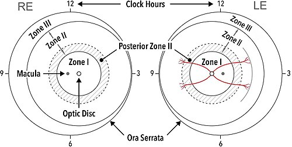
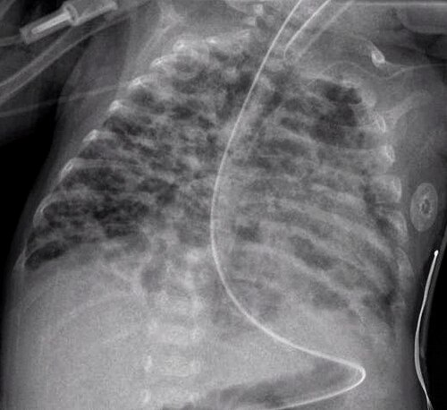

# RN PRÉ-TERMO E COMPLICAÇÕES

Para começar nosso estudo, precisamos alinhar o que define o nosso paciente. Na neonatologia, a precisão dos termos não é preciosismo, é o que define o risco de morte e de sequelas. Quando falamos em recém-nascido (RN) pré-termo, estamos falando de qualquer nascimento que ocorra antes de completar 37 semanas de idade gestacional (IG).

Mas cuidado, as bancas de residência não se contentam com o "antes de 37". Elas querem que você saiba as subdivisões, pois a conduta muda drasticamente.

*Figura 1 - Diagrama das zonas retinianas utilizadas na classificação da retinopatia da prematuridade (ROP), mostrando os limites das zonas I, II e III e os setores horários para localização da doença. Fonte: Chiang et al., CC BY 4.0 | Wikimedia Commons*

## Classificação e Definições Cruciais

A classificação do prematuro é feita por dois eixos: a idade gestacional e o peso ao nascer. Entender isso ajuda a prever complicações. Por exemplo, um prematuro tardio tem riscos muito diferentes de um prematuro extremo.

## Classificação por Idade Gestacional (IG)

- **Pré-termo extremo:** < 28 semanas.

- **Muito pré-termo:** 28 semanas a 31 semanas e 6 dias.

- **Pré-termo moderado:** 32 semanas a 33 semanas e 6 dias.

- **Pré-termo tardio:** 34 semanas a 36 semanas e 6 dias.

Aqui vai uma dica de ouro do Dr. Will: o prematuro tardio é o "grande enganador". Ele parece um bebê a termo, muitas vezes tem um peso bom, mas funcionalmente é imaturo. Ele tem maior risco de hipoglicemia, icterícia e dificuldade de sucção. Se a prova te der um bebê de 35 semanas que está perdendo muito peso, não ignore. A recomendação da Sociedade Brasileira de Pediatria (SBP) é que perdas de peso superiores a 10% nesses bebês exijam reavaliação em 24 a 48 horas.

*Figura 1 - Diagrama das zonas retinianas utilizadas na classificação da retinopatia da prematuridade (ROP), mostrando os limites das zonas I, II e III e os setores horários para localização da doença. Fonte: Chiang et al., CC BY 4.0 | Wikimedia Commons*

## Classificação por Peso ao Nascer

- **Baixo Peso (BP):** < 2.500g.

- **Muito Baixo Peso (MBP):** < 1.500g.

- **Extremo Baixo Peso (EBP):** < 1.000g.

### Relação Peso x Idade Gestacional

Não basta saber o peso, precisamos saber se aquele peso é o esperado para aquela idade. Usamos as curvas de crescimento (como as de Fenton ou Intergrowth-21st).

- **AIG (Adequado para a Idade Gestacional):** Peso entre o percentil 10 e 90.

- **PIG (Pequeno para a Idade Gestacional):** Peso abaixo do percentil 10.

- **GIG (Grande para a Idade Gestacional):** Peso acima do percentil 90.

**Erro clássico de prova:** Achar que todo PIG é prematuro. Um bebê pode ser termo (39 semanas) e ser PIG porque sofreu restrição de crescimento intrauterino. Por outro lado, um prematuro pode ser AIG ou até GIG (filho de mãe diabética, por exemplo).

| Classificação | Critério de Peso |
| --- | --- |
| Baixo Peso | < 2.500g |
| Muito Baixo Peso | < 1.500g |
| Extremo Baixo Peso | < 1.000g |
| Microprematuro (termo comum em UTI) | < 750g ou < 800g |

## Termorregulação: Por que o Prematuro Esfria?

A hipotermia é um dos principais preditores de mortalidade neonatal. Por que fazemos tanto esforço na sala de parto, usando sacos plásticos e toucas?

O prematuro tem três grandes problemas para manter o calor:

- **Grande superfície corporal em relação ao peso:** Ele perde calor para o ambiente muito rápido.

- **Escassez de gordura marrom:** O RN termo produz calor queimando gordura marrom (termogênese sem tremor). O prematuro não teve tempo de acumular essa gordura, que só se deposita no terceiro trimestre.

- **Pele fina e imatura:** Aumenta a perda de calor por evaporação.

**Atenção à fisiopatologia:** Quando o RN fica hipotérmico, ele tenta produzir calor. Isso aumenta o consumo de oxigênio e de glicose. Portanto, a hipotermia leva diretamente à hipóxia tecidual, acidose metabólica e hipoglicemia. Se a questão disser que a hipotermia diminui o consumo de O2, marque como errada! Ela aumenta o gasto metabólico na tentativa desesperada de aquecer.

Na sala de parto, para prematuros < 34 semanas, a conduta obrigatória segundo o Programa de Reanimação Neonatal da SBP é:

- Ambiente aquecido (23 a 25°C).

- Berço de calor radiante.

- Saco plástico de polietileno (sem secar o corpo!).

- Touca plástica e touca de lã por cima.

*Figura 2 - Radiografia de tórax demonstrando displasia broncopulmonar (DBP) em recém-nascido prematuro, com padrão de opacidades difusas e hiperinsuflação pulmonar. Fonte: Pulmonological, CC BY-SA 3.0 | Wikimedia Commons*

## Complicações Respiratórias: O Coração da Neonatologia

Este é o tema que mais cai. O pulmão é um dos últimos órgãos a amadurecer.

### Síndrome do Desconforto Respiratório (SDR) ou Doença da Membrana Hialina

A causa é a deficiência quantitativa e qualitativa de **surfactante**. O surfactante reduz a tensão superficial nos alvéolos, impedindo que eles colapsem na expiração. Sem ele, o bebê faz atelectasias progressivas.

- **Fatores de Risco:** Prematuridade (principal), diabetes materno, sexo masculino, parto cesáreo sem trabalho de parto.

- **Clínica:** Desconforto respiratório precoce (nas primeiras horas de vida), com gemido expiratório (uma tentativa de criar uma pressão positiva expiratória final - PEEP - para manter o alvéolo aberto), batimento de asa de nariz e retrações.

- **Radiografia:** Infiltrado reticulogranular fino ("vidro fosco") com broncogramas aéreos e volume pulmonar reduzido.

**Tratamento:** O foco é o recrutamento alveolar. O CPAP (pressão positiva contínua nas vias aéreas) precoce em sala de parto é a recomendação atual para evitar a intubação. Se o bebê falha no CPAP ou tem desconforto grave, indicamos o surfactante exógeno.

### Taquipneia Transitória do Recém-Nascido (TTRN)

Embora mais comum no termo precoce, pode cair como diferencial. O problema aqui é o retardo na reabsorção do líquido pulmonar fetal.

- **Cenário típico:** RN termo ou prematuro tardio, nascido de cesárea eletiva sem trabalho de parto.

- **Radiografia:** Hiperinsuflação, congestão hilar, derrame cisural ("coração peludo").

- **Conduta:** Suporte de oxigênio (baixo fluxo ou CPAP). É autolimitada (24 a 72h).

### Displasia Broncopulmonar (DBP)

É a complicação crônica. Definida como a necessidade de oxigênio suplementar por pelo menos 28 dias. A nova definição foca na necessidade de O2 ou suporte ventilatório com 36 semanas de idade corrigida.

- **Fisiopatologia:** Lesão pulmonar causada por oxigênio em altas concentrações e ventilação mecânica (barotrauma/volutrauma) em um pulmão imaturo.

- **Prevenção:** Uso de corticoides antenatais, surfactante, ventilação gentil e saturação alvo entre 90 e 95%.

| Doença | Mecanismo | RX Típico | População |
| --- | --- | --- | --- |
| SDR (Membrana Hialina) | Deficiência de Surfactante | Vidro fosco, volume reduzido | Prematuros < 34 sem |
| TTRN | Líquido pulmonar retido | Cisurite, hiperinsuflação | Termo/Tardio, Cesárea |
| DBP | Lesão inflamatória/fibrose | Áreas de enfisema e fibrose | Prematuros em VM |

## Persistência do Ducto Arterioso (PDA)

O ducto arterioso liga a artéria pulmonar à aorta na vida fetal. Ele deve fechar funcionalmente nas primeiras 24 a 48 horas. No prematuro, ele frequentemente permanece aberto.

**Por que isso é um problema?** Com a queda da resistência vascular pulmonar após o nascimento, o sangue começa a fluir da aorta (maior pressão) para a artéria pulmonar (menor pressão). Isso causa um hiperfluxo pulmonar e um "roubo" de fluxo da circulação sistêmica.

- **Sinais Clínicos Clássicos:** Sopro contínuo (em maquinaria) em borda esternal esquerda superior, pulsos amplos (devido à queda da pressão diastólica pelo escape de sangue para o pulmão) e precórdio hiperdinâmico.

- **Atenção:** Se um prematuro com SDR estava melhorando e, por volta do 3º ao 6º dia, apresenta piora respiratória e necessidade de aumentar os parâmetros do ventilador, pense em PDA! O excesso de sangue no pulmão causa edema e piora a mecânica respiratória.

**Tratamento:**

- Restrição hídrica leve e diuréticos (para manejar a congestão).

- Inibidores da ciclooxigenase (Indometacina ou Ibuprofeno) ou Paracetamol IV. Eles bloqueiam as prostaglandinas que mantêm o ducto aberto.

- Fechamento cirúrgico (se falha do tratamento clínico e repercussão hemodinâmica grave).

*Figura 2 - Radiografia de tórax demonstrando displasia broncopulmonar (DBP) em recém-nascido prematuro, com padrão de opacidades difusas e hiperinsuflação pulmonar. Fonte: Pulmonological, CC BY-SA 3.0 | Wikimedia Commons*

## Complicações Neurológicas: A Fragilidade da Matriz Germinativa

O cérebro do prematuro, especialmente abaixo de 32 semanas, tem uma região chamada matriz germinativa. Ela é extremamente vascularizada, mas esses vasos são frágeis e não têm suporte de tecido conjuntivo.

### Hemorragia Peri-intraventricular (HPIV)

Qualquer oscilação brusca na pressão arterial ou no fluxo sanguíneo cerebral pode romper esses vasos. Por isso, na UTI Neonatal, evitamos infusões rápidas de volume e manuseamos o bebê com extremo cuidado.

- **Diagnóstico:** Ultrassonografia (USG) transfontanelar. É o exame de escolha porque pode ser feito à beira do leito, sem transportar o bebê instável.

- **Rastreio:** Todo prematuro < 32 semanas deve fazer USG transfontanelar rotineira (geralmente na primeira semana de vida).

### Convulsões Neonatais

Diferente das crianças maiores, o prematuro raramente faz crises tônico-clônicas generalizadas. As crises são **sutis**.

- **O que procurar:** Movimentos oculares (desvio fixo, nistagmo), movimentos de mastigação, movimentos de "pedalar" ou "remar", e apneias súbitas.

- **Cuidado:** Se a prova descrever movimentos que param quando você segura o membro do bebê, são tremores (comuns na hipoglicemia ou abstinência), não convulsões. A convulsão não para com o estímulo tátil.

### Neuroproteção com Sulfato de Magnésio

Segundo as diretrizes da FEBRASGO e SBP, o uso de Sulfato de Magnésio em gestantes em trabalho de parto prematuro iminente (< 32 semanas) reduz o risco de paralisia cerebral.
**Pegadinha de prova:** O magnésio materno pode causar depressão do SNC no RN, levando a hipotonia e risco aumentado de apneia logo após o nascimento. Esteja preparado para reanimar!

## Nutrição e Crescimento

O prematuro perdeu o período de maior ganho ponderal e acúmulo de nutrientes (terceiro trimestre).

### Nutrição Parenteral (NPT)

Deve ser iniciada o mais precocemente possível (nas primeiras 24h) para prematuros de muito baixo peso, para evitar o catabolismo.

### Colostroterapia

Mesmo que o bebê não possa mamar ainda (devido à imaturidade da coordenação sucção-deglutição, que ocorre por volta de 34 semanas), usamos o colostro.

- **Como é feito:** 0,2 mL de colostro cru na mucosa oral.

- **Por que?** Não é para nutrir, é para imunomodulação. O contato do colostro com o tecido linfoide orofaríngeo estimula o sistema imune e protege contra a enterocolite necrotizante.

### Monitorização

Usamos a idade corrigida para avaliar o crescimento e o desenvolvimento até os 2 anos de idade.
**Cálculo da Idade Corrigida:**
Idade Corrigida = Idade Cronológica - (40 semanas - Idade Gestacional ao Nascer)

Exemplo: Um bebê de 3 meses (12 semanas) que nasceu de 28 semanas.
40 - 28 = 12 semanas de "atraso".
12 semanas (cronológica) - 12 semanas (atraso) = 0 semanas de idade corrigida.
Ou seja, esse bebê de 3 meses deve ser avaliado como um recém-nascido a termo.

## Imunização no Prematuro

Este é um tópico favorito das bancas. A regra geral é: o prematuro segue o calendário da idade cronológica, mas existem exceções importantes baseadas no peso.

- **Vacina BCG:** Só pode ser feita se o RN tiver peso ≥ 2.000g. Se ele nasceu com 1.500g, você espera ele ganhar peso para vacinar.

- **Vacina Hepatite B:**

- Se o RN tem ≥ 2.000g: Esquema padrão (0, 2, 4, 6 meses).

- Se o RN tem < 2.000g ou < 33 semanas: O esquema muda. Ele recebe uma dose ao nascer, e depois o esquema da Pentavalente (2, 4, 6 meses). No total, ele recebe 4 doses de Hep B.

- **Palivizumabe (Profilaxia para VSR):** Não é uma vacina, é um anticorpo monoclonal. Indicado para:

- Prematuros até 28 semanas e 6 dias (no primeiro ano de vida).

- Crianças com cardiopatia congênita com repercussão hemodinâmica ou doença pulmonar crônica da prematuridade (até o segundo ano de vida).

- Prematuros entre 29 semanas e 31 semanas e 6 dias (até os 6 meses de vida, se nascidos no período de sazonalidade).

## Outras Complicações Importantes

### Enterocolite Necrotizante (ECN)

A maior emergência gastrointestinal na UTI Neonatal.

- **Fatores de risco:** Prematuridade + alimentação enteral + isquemia/colonização bacteriana.

- **Clínica:** Distensão abdominal, resíduo gástrico bilioso, sangue nas fezes.

- **Raio-X:** Pneumatose intestinal (ar na parede do intestino) é o sinal patognomônico.

### Retinopatia da Prematuridade (ROP)

A vascularização da retina do prematuro é incompleta. O excesso de oxigênio causa vasoconstrição e, depois, uma proliferação vascular desordenada.

- **Rastreio:** Todo RN ≤ 1.500g ou ≤ 32 semanas deve ser avaliado pelo oftalmologista entre a 4ª e 6ª semana de vida.

- **Tratamento:** Laser ou terapia antiangiogênica (anti-VEGF).

### Apneia da Prematuridade

Definida como pausa respiratória > 20 segundos OU pausa menor acompanhada de bradicardia ou cianose.

- **Causa:** Imaturidade do centro respiratório no tronco cerebral.

- **Tratamento:** Metilxantinas (Citrato de Cafeína é a primeira escolha). A cafeína estimula o centro respiratório e aumenta a sensibilidade ao CO2.

## Exemplos Clínicos para Fixação

**Caso 1:** RN de 29 semanas, atualmente com 5 dias de vida, em ventilação mecânica por SDR. Nas últimas 12 horas, apresentou aumento da necessidade de FiO2, pulsos pediosos facilmente palpáveis e sopro sistólico em borda esternal esquerda. Qual a principal suspeita e conduta?

- **Resposta:** Persistência do Ducto Arterioso (PDA). A piora respiratória após melhora inicial da SDR, associada a pulsos amplos, é clássica. Conduta: Realizar ecocardiograma para confirmar e iniciar Ibuprofeno ou Indometacina se confirmado.

**Caso 2:** RN de 35 semanas (prematuro tardio), parto cesáreo por pré-eclâmpsia materna. Com 6 horas de vida, apresenta tremores de extremidades e taquipneia leve.

- **Resposta:** Hipoglicemia neonatal. O prematuro tardio tem baixa reserva de glicogênio e a mãe hipertensa aumenta o risco. Conduta: Glicemia capilar imediata. Lembre-se: tremores que não param ao toque sugerem convulsão, mas tremores finos em prematuros tardios gritam "hipoglicemia" ou "hipocalcemia".

## Diagnóstico Diferencial de Cianose e Desconforto

É vital diferenciar causas respiratórias de cardíacas.

- **Teste do Coraçãozinho:** Realizado entre 24-48h de vida em RN > 34 semanas. Mede saturação no membro superior direito (pré-ductal) e em um dos membros inferiores (pós-ductal).

- **Alterado se:** Saturação < 95% em qualquer medida ou diferença ≥ 3% entre elas.

- **Atresia de Coanas:** Uma pegadinha clássica. O bebê fica cianótico em repouso (pois o RN é respirador nasal exclusivo) e a cianose melhora quando ele chora (pois abre a boca para respirar).

## Pontos-Chave para Prova 💡

- **BCG no prematuro:** Apenas com peso ≥ 2.000g.

- **Hepatite B no prematuro < 2kg:** Esquema de 4 doses (0, 2, 4, 6 meses).

- **SDR (Membrana Hialina):** Vidro fosco no RX + prematuridade. Tratamento é CPAP e Surfactante.

- **TTRN:** Cesárea eletiva + melhora rápida + cisurite no RX.

- **PDA:** Sopro contínuo + pulsos amplos + piora respiratória tardia. Trata com Indometacina/Ibuprofeno.

- **HPIV:** Diagnóstico por USG Transfontanelar. Rastreio obrigatório em < 32 semanas.

- **Apneia da prematuridade:** Pausa > 20s ou com bradicardia/cianose. Trata com Cafeína.

- **Enterocolite Necrotizante:** Pneumatose intestinal no RX é a chave.

- **Palivizumabe:** Profilaxia para VSR, não é vacina. Lembrar dos critérios de 28s6d e 31s6d.

- **Idade Corrigida:** Usar até os 2 anos para peso, estatura e perímetro cefálico.

- **Hipotermia:** Aumenta consumo de O2 e glicose. Nunca diga que o bebê "poupa energia" no frio.

- **Sulfato de Magnésio materno:** Neuroproteção para o bebê (< 32 sem), mas pode causar apneia ao nascer.

- **PIG proporcional:** Quando peso, comprimento e PC estão todos abaixo do P10 (geralmente insulto precoce na gestação).

- **Anemia da prematuridade:** É mais precoce e mais intensa que a fisiológica do termo.

- **Cianose que melhora ao choro:** Atresia de coanas bilateral.

- **Hematêmese nas primeiras horas:** Pode ser sangue materno deglutido (Teste de Apt-Downey diferencia Hb fetal de Hb adulta).

- **Contraindicação Absoluta:** Não se faz corticoide pós-natal de rotina para prevenir DBP devido ao risco de paralisia cerebral (usar apenas em casos selecionados e graves).

- **Primeira escolha para convulsão neonatal:** Fenobarbital (dose de ataque 20mg/kg).

Como o MedEvo sempre reforça, na neonatologia, o segredo é antecipar o problema. Se você sabe que o bebê é prematuro, você já entra na sala de parto esperando a hipotermia, a SDR e a hipoglicemia. Se você antecipa, você não erra a conduta.

 Cópia offline para consulta pessoal.
 Fonte original:
 [https://www.medevo.com.br/material-apoio/ler/44b80fcd-149c-43d7-a836-a70358fe9b53](https://www.medevo.com.br/material-apoio/ler/44b80fcd-149c-43d7-a836-a70358fe9b53)
