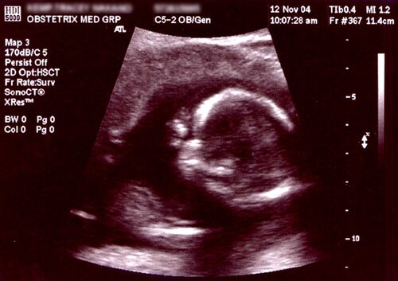

# ROTINA DO PRÉ-NATAL: CALENDÁRIO, SUPLEMENTAÇÃO E VACINAÇÃO

O pré-natal não é apenas uma sequência de consultas para "ver se o bebê está bem". É, na verdade, a maior oportunidade de medicina preventiva que temos na obstetrícia. Quando você atende uma gestante, seu foco está em dois pacientes simultâneos e em um objetivo principal: reduzir a morbimortalidade materna e perinatal.

Para as provas de residência, o Ministério da Saúde (MS) e a FEBRASGO são as referências de ouro. As bancas adoram cobrar as divergências e as convergências entre esses dois órgãos. Vamos entender a lógica por trás de cada conduta para que você não precise apenas decorar tabelas.

*Figura 1 - Ultrassonografia obstétrica: exame fundamental no acompanhamento pré-natal, permitindo avaliar idade gestacional, morfologia fetal e rastrear complicações. Fonte: Domínio Público | Wikimedia Commons*

## O Calendário de Consultas: Quando e Por Que?

A primeira coisa que você precisa saber é que o pré-natal deve ser precoce. O ideal é que a primeira consulta ocorra ainda no primeiro trimestre, preferencialmente antes da 12ª semana. Por que isso? Porque é nesse período que datamos a gestação com maior precisão via ultrassonografia (comprimento cabeça-nádega) e iniciamos as intervenções que dependem da idade gestacional, como a suplementação de ácido fólico.

O Ministério da Saúde estabelece um número mínimo de 6 consultas, distribuídas da seguinte forma:

- Uma consulta no primeiro trimestre (até 12 semanas).

- Duas consultas no segundo trimestre (entre a 13ª e a 27ª semana).

- Três consultas no terceiro trimestre (da 28ª semana até o parto).

Na prática clínica e seguindo a FEBRASGO, o acompanhamento costuma ser mais estreito:

- Até 28 semanas: Consultas mensais.

- De 28 a 36 semanas: Consultas quinzenais.

- De 36 semanas até o parto: Consultas semanais.

Cuidado com a pegadinha: a consulta do puerpério (até o 42º dia após o parto) não conta para o número mínimo de consultas de pré-natal, mas é obrigatória para fechar o ciclo de assistência.

## Rastreamento e Exames de Rotina

Aqui é onde a maioria dos alunos se perde. O segredo é dividir os exames por trimestres e entender o que estamos procurando. No MedEvo, sempre reforçamos que o rastreamento é uma forma de prevenção secundária: a doença pode estar lá, e queremos achá-la antes que cause dano.

### Primeiro Trimestre: A Bateria Inicial

Na primeira consulta, pedimos o "pacote básico". Se a paciente chega com 8 semanas, você deve solicitar:

- Hemograma: Para detectar anemia (Hb < 11 g/dL) ou infecções.

- Tipagem Sanguínea e Fator Rh: Se a mãe for Rh negativo, precisamos saber o Rh do pai ou partir para o Coombs Indireto.

- Glicemia de Jejum: Para rastrear Diabetes Mellitus prévio ou gestacional precoce.

- Urina tipo 1 e Urinocultura: Fundamental. A gestante tem maior risco de bacteriúria assintomática devido à progesterona (que relaxa o ureter) e à compressão mecânica. Se não tratarmos a bacteriúria assintomática, 30% evoluem para pielonefrite, o que aumenta o risco de parto prematuro.

- VDRL (Sífilis): A sífilis congênita é uma tragédia evitável. O rastreio é obrigatório no 1º e 3º trimestres e no momento do parto.

- HIV e HBsAg (Hepatite B): Prevenção da transmissão vertical.

- Toxoplasmose (IgG e IgM): Se a paciente for suscetível (IgG negativo), o acompanhamento deve ser mensal ou trimestral.

- TSH: O hipotireoidismo subclínico está associado a prejuízos no desenvolvimento cognitivo fetal.

### Segundo Trimestre: O Momento do TOTG

Entre a 24ª e a 28ª semana, o foco muda. É o período de maior resistência insulínica devido aos hormônios placentários (principalmente o lactogênio placentário). Por isso, o Teste Oral de Tolerância à Glicose (TOTG 75g) é realizado aqui.

Erro clássico de prova: achar que o TOTG é feito na primeira consulta. Não é. Na primeira consulta, fazemos a glicemia de jejum. Se ela vier alterada (entre 92 e 125 mg/dL), o diagnóstico de Diabetes Gestacional já está dado. O TOTG fica para quem teve glicemia de jejum normal (< 92 mg/dL) no início.

### Terceiro Trimestre: Preparação para o Parto

Repetimos os exames infecciosos (VDRL, HIV, Hepatite B, Hepatite C) e o hemograma. Além disso, temos o rastreamento do Streptococcus do Grupo B (GBS).

O swab vaginal e anal para GBS deve ser realizado entre 35 e 37 semanas. Por que esse intervalo? Porque a validade do resultado é de cerca de 5 semanas. Se fizermos muito cedo, o resultado pode não refletir a flora no momento do parto.

**Tabela 1: Resumo do Rastreamento Infeccioso**

| Infecção | Rastreio Inicial | Repetição | Conduta se Positivo |
| --- | --- | --- | --- |
| Sífilis (VDRL) | 1º Trimestre | 3º Trimestre / Parto | Penicilina benzatina para a gestante + avaliar/testar/tratar parcerias para evitar reinfecção |
| HIV | 1º Trimestre | 3º Trimestre / Parto | TARV + Protocolo de Parto |
| Hepatite B (HBsAg) | 1º Trimestre | 3º Trimestre | Vacina se suscetível / Imunoglobulina no RN |
| Toxoplasmose | 1º Trimestre | Se IgG neg: mensal/trimestral | Espiramicina (se infecção fetal não confirmada) |
| GBS (Streptococcus) | Não | 35-37 semanas | Antibioticoprofilaxia intraparto |

## Suplementação: O Que o Feto Precisa?

A suplementação no pré-natal foca em dois pilares: Ácido Fólico e Ferro.

### Ácido Fólico (Vitamina B9)

O ácido fólico é essencial para o fechamento do tubo neural, que ocorre muito cedo, por volta da 4ª semana de gestação. Por isso, como diz o Dr. Will, o ideal é que a suplementação seja pré-concepcional (pelo menos 3 meses antes de engravidar).

- Risco habitual: 400 µg/dia (0,4 mg/dia).

- Alto risco (filho anterior com defeito de tubo neural, uso de anticonvulsivantes como carbamazepina, DM, obesidade, pós-bariátrica conforme protocolo): 4 a 5 mg/dia no período pré-concepcional e até a 12ª semana; depois, individualizar conforme risco nutricional, anemia/deficiência de folato e protocolo local.

Para **prevenção de defeitos do tubo neural**, o ponto de prova é: iniciar no período pré-concepcional (idealmente 1 a 3 meses antes) e manter **até a 12ª semana gestacional**. Após 12 semanas, a continuidade de folato em baixa dose pode ocorrer por protocolo local, polivitamínico pré-natal ou indicação clínica (ex.: deficiência de folato/anemia megaloblástica), mas não deve ser apresentada como regra obrigatória para prevenção do fechamento do tubo neural.

### Ferro (Sulfato Ferroso)

A gestação aumenta a demanda de ferro devido à expansão da massa eritrocitária e às necessidades do feto e da placenta. O Ministério da Saúde recomenda a suplementação universal de 40 mg de ferro elementar por dia para todas as gestantes, desde o início da gestação, mantendo até o 3º mês pós-parto para mulheres não lactantes.

Atenção à dose: 200 mg de Sulfato Ferroso equivalem a aproximadamente 40 mg de ferro elementar. Se a paciente estiver anêmica (Hb < 11 g/dL), a dose passa a ser terapêutica (120 a 200 mg de ferro elementar/dia).

### Cálcio e Vitamina D

A suplementação de cálcio (1.000 a 2.000 mg/dia) é indicada pela OMS e FEBRASGO para gestantes com baixa ingestão dietética, iniciada a partir da 12° semana, visando a prevenção de pré-eclâmpsia. Já a Vitamina D não é universal; deve ser guiada pela dosagem sérica em pacientes de risco (ex: obesas, baixa exposição solar).

*Figura 2 - Atendimento pré-natal: o acompanhamento regular da gestante inclui exame físico, solicitação de exames laboratoriais, suplementação e orientações sobre imunização. Fonte: USAID, Domínio Público | Wikimedia Commons*

## Imunização na Gestação: Protegendo Dois com uma Agulha

A vacinação na gravidez é um dos temas mais cobrados. A lógica é simples: vacinas de vírus ou bactérias inativadas são seguras. Vacinas de vírus vivos atenuados são, em regra, contraindicadas.

### As Obrigatórias (O "Quarteto de Ouro")

- Influenza: Pode ser feita em qualquer idade gestacional. É dose única anual. A gestante é grupo de risco para complicações respiratórias graves da gripe.

- Hepatite B: Se a gestante não tiver o esquema completo (3 doses), deve iniciar ou completar no pré-natal. Não há risco para o feto.

- dTpa (Difteria, Tétano e Coqueluche acelular): Esta é a "queridinha" das bancas. Deve ser feita a partir da 20ª semana, idealmente entre a 27ª e 36ª semana. O objetivo principal aqui não é proteger a mãe, mas sim promover a passagem transplacentária de anticorpos contra a coqueluche para o recém-nascido, que só receberá sua própria vacina aos 2 meses. **A dTpa deve ser feita em TODA gestação**, independentemente do histórico vacinal prévio.

- COVID-19: A vacina contra a COVID-19 no pré-natal é fundamental para proteger a gestante de formas graves da doença e prevenir partos prematuros ou morte neonatal. Ela é segura em qualquer trimestre, transmitindo anticorpos essenciais para o bebê via placenta, protegendo-o também após o nascimento.

### As Contraindicadas (Vírus Vivos)

- Tríplice Viral (Sarampo, Caxumba, Rubéola).

- Varicela.

- Sabin (Pólio Oral).

- Febre Amarela (Regra geral: contraindicada. Exceção: se o risco de contrair a doença em área endêmica for maior que o risco teórico da vacina, pode ser considerada após os 6 meses).

Se uma gestante for vacinada inadvertidamente com uma vacina de vírus vivo (como a rubéola), isso não é indicação de interrupção da gravidez. O risco teórico existe, mas os casos relatados de síndrome da rubéola congênita por vacina são raríssimos. Apenas orientamos e acompanhamos.

**Tabela 2: Esquema Vacinal da Gestante**

| Vacina | Indicação | Época |
| --- | --- | --- |
| Influenza | Universal | Qualquer idade gestacional |
| Hepatite B | Se esquema incompleto | 3 doses (0, 1 e 6 meses) |
| dTpa | Universal (em cada gestação) | A partir da 20ª semana (ideal 27-36s) |
| dT (Dupla Adulto) | Se esquema de tétano incompleto | Completar 3 doses de reforço |
| Raiva | Pós-exposição (alto risco) | Inativada, pode ser usada |
| COVID-19 | Universal (em cada gestação) | Em qualquer trimestre gestacional |

## Situações Especiais e Pérolas Clínicas

### O Exame Físico e as Manobras de Leopold

Durante as consultas, o exame físico deve ser minucioso. A medida da Altura Uterina (AU) é nossa ferramenta de rastreio para desvios de crescimento fetal. Se a AU estiver abaixo do percentil 10 para a idade gestacional, suspeitamos de Restrição de Crescimento Intrauterino (RCIU). Se estiver acima do percentil 90, pensamos em macrossomia ou polidrâmnio.

As Manobras de Leopold são usadas para determinar a estática fetal (situação, posição e apresentação). Elas são muito mais úteis e fáceis de realizar no terceiro trimestre, quando o feto já tem volume suficiente para ser palpado com precisão.

### Prevenção da Transmissão Vertical do HIV

Se o rastreio de HIV for positivo, a conduta é iniciar a Terapia Antirretroviral (TARV) imediatamente, independentemente da contagem de CD4. O esquema preferencial atual no Brasil é TDF (Tenofovir) + 3TC (Lamivudina) + DTG (Dolutegravir). O objetivo é chegar ao parto com carga viral indetectável para permitir o parto vaginal. Se a carga viral for desconhecida ou > 1.000 cópias/mL após 34 semanas, a indicação é de cesárea eletiva com 38 semanas.

### O Cuidado com o Recém-Nascido: Vitamina K

Logo após o nascimento, o RN deve receber Vitamina K (fitomenadiona) por via intramuscular. Por que? Porque os fatores de coagulação dependentes de vitamina K (II, VII, IX e X) estão baixos ao nascimento, e o leite materno é pobre nessa vitamina. Sem a profilaxia, o bebê corre risco de Doença Hemorrágica do Recém-Nascido.

### Exercício Físico e Estilo de Vida

A gestante de baixo risco deve ser estimulada a manter atividade física. A recomendação é de pelo menos 150 minutos de atividade aeróbica de intensidade moderada por semana (ex: caminhada, natação). Deve-se evitar esportes de contato ou com risco de queda.

Quanto ao álcool, a orientação é clara: não existe dose segura. O consumo de álcool na gestação pode levar à Síndrome Alcoólica Fetal, com danos irreversíveis ao neurodesenvolvimento.

## Diagnóstico Diferencial e Erros Comuns

Um erro muito comum em provas é confundir os critérios de anemia. Na gestante, existe a "anemia fisiológica". O volume plasmático aumenta cerca de 50%, enquanto a massa de glóbulos vermelhos aumenta apenas 20-30%. O resultado é uma hemodiluição. Por isso, só consideramos anemia na gestante se a Hemoglobina for < 11 g/dL no 1º e 3º trimestres, ou < 10,5 g/dL no 2º trimestre.

Outro ponto de confusão é a vacina da Febre Amarela. Se a banca colocar uma gestante que mora em área de surto ou que precisa viajar para área de risco iminente, a vacina pode ser feita. A contraindicação é relativa ao risco epidemiológico. Já a vacina da Raiva, por ser inativada, é permitida em situações de profilaxia pós-exposição (mordedura de animal suspeito).

**Tabela 3: Diagnóstico de Diabetes na Gestação**

| Exame | Momento | Valor de Referência | Diagnóstico |
| --- | --- | --- | --- |
| Glicemia de Jejum | 1ª Consulta | 92 a 125 mg/dL | Diabetes Gestacional |
| Glicemia de Jejum | 1ª Consulta | ≥ 126 mg/dL | Diabetes Mellitus Prévio |
| TOTG 75g (Jejum) | 24-28 semanas | ≥ 92 mg/dL | Diabetes Gestacional |
| TOTG 75g (1h) | 24-28 semanas | ≥ 180 mg/dL | Diabetes Gestacional |
| TOTG 75g (2h) | 24-28 semanas | ≥ 153 mg/dL | Diabetes Gestacional |

## O Papel da Ultrassonografia

Embora o Ministério da Saúde não obrigue a realização de ultrassom em todas as consultas, a FEBRASGO recomenda pelo menos três exames:

- Precoce (1º trimestre): Para datar a gestação e ver vitalidade.

- Morfológico do 1º Trimestre (11-14 semanas): Medida da Translucência Nucal e rastreio de aneuploidias.

- Morfológico do 2º Trimestre (20-24 semanas): Avaliação detalhada da anatomia fetal e medida do comprimento cervical (colo do útero).

A medida do comprimento cervical entre 18 e 24 semanas é fundamental para rastrear o risco de parto prematuro. Se o colo for curto (< 25 mm), a conduta padrão é o uso de progesterona vaginal diária.

## Pontos-Chave para Prova

- O número mínimo de consultas pelo Ministério da Saúde é 6, mas o ideal é o acompanhamento mensal até 28 semanas.

- Ácido fólico 0,4 mg/dia previne defeitos do tubo neural: iniciar no pré-concepcional e manter até a 12ª semana. Se houver antecedente de filho com DTN, uso de anticonvulsivantes ou outro alto risco, usar 4-5 mg/dia até a 12ª semana e individualizar depois.

- A suplementação de ferro (40 mg de ferro elementar/dia) deve ser universal desde o início da gestação, mantendo até o 3º mês pós-parto para mulheres não lactantes.

- Vacinas de vírus vivos (Tríplice Viral, Varicela, Sabin) são contraindicadas na gestação.

- A vacina dTpa deve ser aplicada em cada gestação, a partir da 20ª semana, para proteger o RN contra coqueluche via transferência de anticorpos.

- O rastreio de GBS (Streptococcus agalactiae) é feito com swab vaginal e anal entre 35 e 37 semanas.

- Bacteriúria assintomática na gestante SEMPRE deve ser tratada para evitar pielonefrite e parto prematuro.

- Diabetes Gestacional é diagnosticado se Glicemia de Jejum ≥ 92 mg/dL ou qualquer valor alterado no TOTG (92/180/153).

- A primeira consulta de pré-natal deve ser precoce (antes de 12 semanas) para melhor datação da idade gestacional.

- A vacina da Influenza é segura e recomendada em qualquer idade gestacional.

- O Coombs Indireto deve ser solicitado em todas as gestantes Rh negativo com parceiro Rh positivo ou desconhecido.

- Vitamina K intramuscular no RN é a conduta padrão para prevenir a doença hemorrágica do recém-nascido.

- A sífilis deve ser rastreada no 1º e 3º trimestres e no parto. O tratamento materno adequado exige penicilina benzatina no esquema correto para o estágio clínico, respeitando intervalos e iniciado pelo menos 30 dias antes do parto; as parcerias sexuais devem ser avaliadas e tratadas para evitar reinfecção, mas isso não deve ser usado como critério isolado de adequação do tratamento da gestante.

- A colpocitologia oncótica (Papanicolau) pode e deve ser realizada no pré-natal se a paciente estiver com o exame atrasado.

- O ganho de peso na gestação deve ser monitorado conforme o IMC pré-gestacional; não existe um valor único para todas.

- A ausculta dos batimentos cardiofetais (BCF) com Doppler pode ser feita a partir de 10-12 semanas. Com o estetoscópio de Pinard, apenas após 18-20 semanas. 🩺

Lembre-se: o pré-natal é um processo dinâmico. O que é baixo risco hoje pode se tornar alto risco amanhã. O olhar atento do médico e a adesão aos protocolos baseados em evidências, como os discutidos aqui no MedEvo, são o que garantem o desfecho favorável para a mãe e para o bebê.

 Cópia offline para consulta pessoal.
 Fonte original:
 [https://www.medevo.com.br/material-apoio/ler/fb818677-cc59-43ec-921c-59f7b2711ea1](https://www.medevo.com.br/material-apoio/ler/fb818677-cc59-43ec-921c-59f7b2711ea1)
