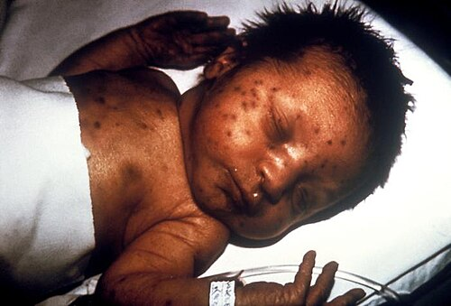
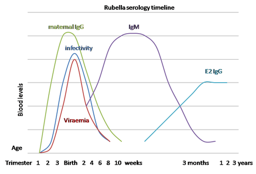

# RUBÉOLA CONGÊNITA

A rubéola é um daqueles temas que o estudante de medicina costuma negligenciar porque "quase não se vê mais na prática". De fato, o Brasil recebeu o certificado de eliminação da rubéola e da Síndrome da Rubéola Congênita (SRC) em 2015. Mas cuidado: para as bancas de residência, o vírus continua circulando intensamente nos cadernos de prova. O examinador adora a rubéola porque ela permite cobrar imunologia, embriologia, cardiologia pediátrica e oftalmologia em uma única questão.

Aqui no MedEvo, sempre reforçamos que entender a rubéola congênita é entender o conceito de teratogenicidade viral. Não estamos falando apenas de uma "virose da infância", mas de um agente capaz de interromper a divisão celular no momento mais crítico da formação de um ser humano.

*Figura 1 - Lesões cutâneas tipo "blueberry muffin" em recém-nascido com Síndrome da Rubéola Congênita (SRC): as petéquias e púrpuras são causadas por hematopoiese extramedular. Fonte: CDC, Domínio Público | Wikimedia Commons*

## O Agente e a Fisiopatologia: Por que o feto sofre tanto?

O vírus da rubéola é um vírus de RNA, do gênero Rubivirus, família Togaviridae. Ele é transmitido por via respiratória (transmissão horizontal) e, na gestante, atinge o feto por via transplacentária. Mas por que ele causa malformações tão específicas?

Diferente de outros vírus que destroem as células por necrose rápida, o vírus da rubéola é mais "sutil" e cruel. Ele causa uma inibição da mitose celular. Imagine que o feto está em plena fase de organogênese, onde as células precisam se dividir freneticamente para formar o coração, os olhos e o cérebro. O vírus chega e diz: "parem de se dividir". O resultado é um órgão hipoplásico ou malformado.

Além disso, o vírus causa uma vasculite nos vasos sanguíneos em desenvolvimento, levando a áreas de isquemia e necrose tecidual. É por isso que as lesões da rubéola são difusas e não localizadas. Se a infecção ocorre nas primeiras semanas, o dano é sistêmico.

### O fator tempo: A regra de ouro da idade gestacional

Se você gravar apenas uma coisa sobre a fisiopatologia, grave isto: o risco é inversamente proporcional à idade gestacional.

Quanto mais precoce a infecção materna, maior o risco de transmissão para o feto e maior a gravidade das sequelas. Se a gestante contrai rubéola nas primeiras 11 a 12 semanas de gestação, o risco de o feto ter a Síndrome da Rubéola Congênita chega a 80 ou 90 por cento. É o período da organogênese.

Após a 20ª semana, o risco de malformações cai drasticamente, embora a infecção ainda possa causar restrição de crescimento intrauterino (RCIU) ou problemas auditivos tardios. O vírus é um mestre em causar danos durante a formação dos órgãos, mas perde força teratogênica conforme as estruturas já estão prontas.

## O Quadro Clínico Materno: O sinal de alerta

Muitas vezes, a gestante nem sabe que teve rubéola. Cerca de 50 por cento dos casos são subclínicos ou oligossintomáticos. Quando os sintomas aparecem, o quadro clássico é:

- Exantema maculopapular morbiliforme, que começa na face e progride para o tronco e membros (direção cefalocaudal).

- Febre baixa.

- Linfadenopatia característica: linfonodos retroauriculares, occipitais e cervicais posteriores.

Cuidado com a pegadinha: se a prova descrever uma gestante com exantema e linfadenopatia retroauricular, ela está gritando "Rubéola" para você. O diagnóstico diferencial clássico é o sarampo (que tem febre alta, manchas de Koplik e tosse intensa) e o eritema infeccioso (parvovírus B19).

## A Síndrome da Rubéola Congênita (SRC): A Tríade de Gregg

Quando falamos de SRC em provas, você precisa ter a "Tríade Clássica de Gregg" tatuada na memória. Embora a síndrome seja muito mais ampla, esses três pilares são os mais cobrados:

- Surdez Neurossensorial: É a manifestação mais comum da SRC. Pode ser a única sequela em infecções mais tardias (após o primeiro trimestre).

- Malformações Oculares: A catarata congênita é o marco. Ela é geralmente bilateral e central. O glaucoma congênito e a microftalmia também ocorrem.

- Cardiopatia Congênita: Aqui está o detalhe que define quem passa na prova. As duas cardiopatias "queridinhas" da rubéola são a Persistência do Canal Arterial (PCA) e a Estenose da Artéria Pulmonar (especialmente os ramos periféricos).

Imagine um recém-nascido que apresenta um sopro contínuo (em maquinaria) na região infraclavicular esquerda. O examinador quer que você ligue esse sopro (PCA) à história de exantema materno no primeiro trimestre.

### Outras manifestações importantes

Além da tríade, o bebê com SRC pode apresentar:

- Microcefalia (devido à inibição da mitose cerebral).

- Púrpura Trombocitopênica: O famoso aspecto de "blueberry muffin baby" (bebê com muffin de mirtilo), causado pela hematopoiese extramedular na pele.

- Alterações ósseas: Radiotransparências metafisárias (aspecto de "tala de aipo").

- Hepatoesplenomegalia e icterícia neonatal.

### Manifestações Tardias: O perigo que dorme

Um erro comum é achar que, se o bebê nasceu bem, ele está livre. A SRC tem manifestações tardias que podem surgir anos depois. As mais cobradas são o Diabetes Mellitus tipo 1 (o vírus pode causar uma pancreatite crônica progressiva) e disfunções tireoidianas. Isso mostra que o vírus pode persistir no organismo por muito tempo.

*Figura 2 - Cronologia sorológica da rubéola: evolução dos títulos de IgM e IgG ao longo do tempo. A interpretação correta das sorologias é essencial para o diagnóstico de infecção aguda na gestante. Fonte: Graham Beards, Domínio Público | Wikimedia Commons*

## Diagnóstico na Gestante: O labirinto das sorologias

Este é o ponto onde a maioria dos alunos se perde. Vamos organizar o raciocínio clínico para você não errar mais.

Quando uma gestante chega com suspeita de rubéola ou relato de contato, o primeiro passo é a sorologia (IgM e IgG).

### Cenário 1: IgG Negativo e IgM Negativo

A gestante é suscetível. Se houve contato recente, você deve repetir a sorologia em 2 a 3 semanas para ver se houve soroconversão. Se continuar negativo, ela não foi infectada.

### Cenário 2: IgG Positivo e IgM Negativo

A gestante está imunizada. Seja por vacinação prévia ou infecção antiga. O feto está seguro. Fim de papo.

### Cenário 3: IgG Positivo e IgM Positivo

Aqui mora o perigo. O IgM positivo pode significar três coisas:

- Infecção aguda (recente).

- IgM persistente (algumas pessoas mantêm IgM positivo por meses).

- Falso-positivo (reação cruzada com outros vírus).

Como diferenciar? Usamos o Teste de Avidez de IgG.

- Alta Avidez: A infecção ocorreu há mais de 3 ou 4 meses (antes da gestação, se ela estiver no primeiro trimestre). Risco fetal desprezível.

- Baixa Avidez: A infecção é recente (menos de 3 meses). Risco fetal altíssimo se estiver no início da gravidez.

Cuidado: O teste de avidez só tem utilidade se realizado precocemente (até a 16ª-20ª semana). Se você pedir avidez no terceiro trimestre, ela naturalmente será alta, mesmo que a infecção tenha ocorrido no início da gestação.

### Cenário 4: IgG Negativo e IgM Positivo

Provável infecção muito recente. Repita em 2 semanas para confirmar a soroconversão do IgG.

| Resultado Sorológico | Interpretação | Conduta |
| --- | --- | --- |
| IgM - / IgG - | Suscetível | Repetir em 3 semanas se contato |
| IgM - / IgG + | Imune | Pré-natal de rotina |
| IgM + / IgG + (Alta Avidez) | Infecção Antiga | Pré-natal de rotina |
| IgM + / IgG + (Baixa Avidez) | Infecção Recente | Investigar infecção fetal |

## Diagnóstico de Infecção Fetal: O Padrão-Ouro

Se confirmamos que a gestante teve rubéola no primeiro trimestre, precisamos saber se o vírus atravessou a placenta.

O exame de escolha (padrão-ouro) é a PCR no líquido amniótico, coletado via amniocentese.

- Quando fazer? Geralmente após a 18ª semana de gestação. Por que não antes? Porque antes disso a diurese fetal (que carrega o vírus para o líquido) não é suficiente, o que aumenta o risco de falso-negativo.

O Dr. Will sempre lembra nas discussões de caso: a ultrassonografia pode mostrar sinais de SRC (microcefalia, calcificações, RCIU), mas ela tem baixa sensibilidade. Um ultrassom normal NÃO exclui rubéola congênita.

## Diagnóstico no Recém-Nascido

Para confirmar a SRC no bebê, temos duas vias principais:

- Sorologia: Presença de IgM específico para rubéola no sangue do cordão ou do RN. Como o IgM não atravessa a placenta, se o bebê tem IgM, ele mesmo produziu em resposta à infecção.

- Isolamento Viral ou PCR: O vírus pode ser isolado na orofaringe, urina ou líquor.

Um detalhe fundamental para a vigilância epidemiológica: o RN com rubéola congênita é um grande transmissor de vírus. Ele pode eliminar o vírus pelas secreções respiratórias e urina por até 12 meses. Por isso, esses bebês devem ser mantidos em isolamento de contato se forem internados.

## Diagnóstico Diferencial: As "TORCH"

Na prova, o examinador vai colocar um RN com microcefalia e petéquias e te perguntar qual é a infecção. Você precisa dos "distintivos" de cada uma:

- Rubéola: Catarata + PCA (Persistência do Canal Arterial) + Surdez.

- Toxoplasmose: Tríade de Sabin (Coriorretinite + Hidrocefalia + Calcificações intracranianas difusas).

- Citomegalovírus (CMV): Calcificações periventriculares + Surdez (é a causa #1 de surdez não hereditária, mas a rubéola ganha se houver catarata e PCA).

- Sífilis: Rinite serossanguinolenta + Lesões palmoplantares + Alterações ósseas (periostite).

| Doença | Achado Patognomônico/Sugerido | Cardiopatia? |
| --- | --- | --- |
| Rubéola | Catarata e PCA | Sim (PCA/Estenose Pulmonar) |
| Toxoplasmose | Calcificações Difusas e Hidrocefalia | Raro |
| CMV | Calcificações Periventriculares | Raro |
| Sífilis | Rinite e Pênfigo Palmoplantar | Não |

## Manejo e Conduta: O que fazer?

Infelizmente, não existe tratamento antiviral eficaz para a rubéola, nem para a mãe, nem para o feto. A conduta é baseada em suporte e prevenção de danos.

### Na Gestante

Se a infecção for confirmada no primeiro trimestre, o aconselhamento é fundamental. No Brasil, a rubéola não é uma indicação legal de interrupção da gravidez, mas os pais devem ser informados sobre o alto risco de malformações graves.

O uso de imunoglobulina após a exposição é controverso. Segundo o Ministério da Saúde, a imunoglobulina não previne a infecção fetal. Ela pode apenas mascarar os sintomas maternos e prolongar o período de incubação. Portanto, não é recomendada de rotina para evitar a SRC. Só deve ser considerada se a gestante suscetível tiver contato e a interrupção da gravidez não for uma opção (mesmo assim, com eficácia muito duvidosa).

### No Recém-Nascido

O tratamento é multidisciplinar:

- Cirurgia cardíaca para corrigir o PCA ou a estenose pulmonar.

- Reabilitação auditiva precoce (aparelhos ou implante coclear).

- Acompanhamento oftalmológico (cirurgia de catarata).

- Monitoramento rigoroso do desenvolvimento neuropsicomotor.

## Prevenção: A Vacina é a Estrela

A única forma eficaz de combater a SRC é a vacinação. A vacina é a Tríplice Viral (SCR - Sarampo, Caxumba, Rubéola) ou Tetra Viral.

Regras de ouro da vacinação para a prova:

- A vacina é de vírus vivo atenuado. Portanto, é contraindicada na gestação.

- Mulheres em idade fértil que receberem a vacina devem evitar a gravidez por pelo menos 30 dias (algumas diretrizes antigas falavam em 3 meses, mas o Ministério da Saúde e a FEBRASGO adotam 30 dias).

- Vacinação acidental: Se uma mulher descobrir que estava grávida quando tomou a vacina, o que fazer? Calma. Não há nenhum caso registrado de SRC por vírus vacinal. A conduta é apenas acompanhamento pré-natal de rotina. A vacinação acidental NÃO é indicação de interrupção da gravidez.

- Contato com vacinados: Uma gestante pode conviver com pessoas que acabaram de tomar a vacina? Sim! O vírus vacinal não é transmitido para contatos. Não há risco.

## Vigilância Epidemiológica

A rubéola é uma doença de notificação compulsória imediata. Todo caso suspeito (gestante com exantema ou RN com sinais de SRC) deve ser notificado em até 24 horas para as autoridades de saúde.

Como o Brasil eliminou a circulação endêmica, qualquer caso novo é considerado um evento de saúde pública grave, possivelmente um caso importado que pode gerar um novo surto em bolsões de não vacinados.

## Exemplo Clínico para Fixação

Imagine o seguinte cenário:
Paciente, 22 anos, primigesta, 10 semanas de gestação. Refere que há 3 dias apresentou febre baixa e manchas vermelhas no corpo que duraram pouco tempo. Ao exame, você nota linfonodos retroauriculares palpáveis. Ela traz uma sorologia realizada hoje: IgM Reagente e IgG Reagente.

Qual o próximo passo?
Muitos alunos marcariam "Amniocentese imediata". Errado!
O próximo passo é o Teste de Avidez de IgG. Por quê? Porque se a avidez for alta, ela teve rubéola antes de engravidar e esse IgM é apenas persistente ou um falso-positivo. Se a avidez for baixa, aí sim confirmamos infecção aguda na gestação e seguiremos para a investigação fetal com PCR do líquido amniótico após a 18ª semana.

Percebeu a lógica? Primeiro confirmamos a infecção materna (Avidez), depois confirmamos a infecção fetal (PCR no líquido).

## Pontos-Chave para Prova

- A tríade clássica de Gregg é composta por: Surdez neurossensorial (mais comum), Catarata congênita e Cardiopatia (PCA e Estenose Pulmonar).

- O risco de malformações é máximo no primeiro trimestre (até 80-90 por cento de risco antes de 12 semanas).

- O diagnóstico de infecção aguda na gestante requer IgM positivo com Baixa Avidez de IgG (se IgG também for positivo).

- O teste de avidez só é útil se realizado até a 16ª-20ª semana de gestação.

- O padrão-ouro para diagnóstico de infecção fetal é a PCR do líquido amniótico (amniocentese), preferencialmente após a 18ª semana.

- A vacina Tríplice Viral é de vírus vivo atenuado e é contraindicada na gestação.

- Vacinação acidental em gestante NÃO justifica interrupção da gravidez; o risco de SRC vacinal é teórico e nunca comprovado.

- O recém-nascido com SRC elimina o vírus por secreções e urina por até 1 ano; requer isolamento de contato.

- A Persistência do Canal Arterial (PCA) é a cardiopatia mais associada à rubéola nas questões de prova.

- O sinal do "blueberry muffin baby" indica hematopoiese extramedular e pode aparecer na rubéola, CMV e outras infecções TORCH.

- O Brasil é considerado livre de rubéola endêmica desde 2015, mas a vigilância é rigorosa.

- Diabetes Mellitus tipo 1 e tireoidopatias são complicações tardias possíveis da SRC.

- O Teste do Olhinho é fundamental no RN para rastrear a catarata e o glaucoma congênito.

- A linfadenopatia retroauricular e occipital é o sinal clínico mais característico da rubéola na gestante.

- Erro clássico: Achar que a imunoglobulina previne a rubéola congênita após exposição. Não previne.

- Primeira escolha para prevenção: Vacinação universal de crianças e mulheres em idade fértil (antes de engravidar). 💉

 Cópia offline para consulta pessoal.
 Fonte original:
 [https://www.medevo.com.br/material-apoio/ler/ea02952d-2cbd-489d-bec7-e800d1c2bee2](https://www.medevo.com.br/material-apoio/ler/ea02952d-2cbd-489d-bec7-e800d1c2bee2)
