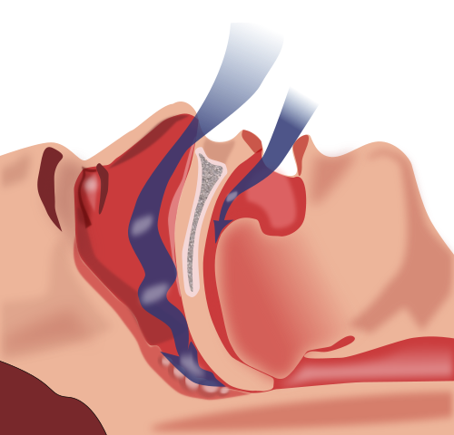
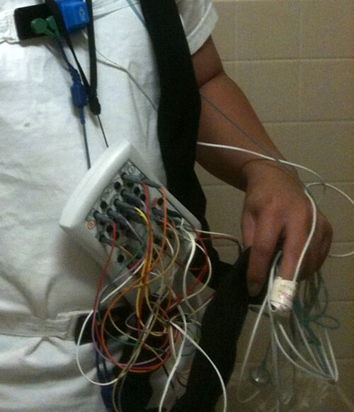

# SAHOS (APNEIA OBSTRUTIVA DO SONO)

A Síndrome da Apneia e Hipopneia Obstrutiva do Sono (SAHOS) deixou de ser, há muito tempo, apenas o "distúrbio do ronco". Hoje, entendemos a SAHOS como uma doença sistêmica, inflamatória e com repercussões hemodinâmicas graves. Para a sua prova de residência, o examinador não quer apenas que você saiba que o paciente para de respirar; ele quer que você entenda por que o coração dele falha e por que o CPAP é a primeira escolha.

*Figura 1 - Apneia obstrutiva do sono: durante o sono, o relaxamento da musculatura faríngea provoca o colapso da via aérea superior, interrompendo o fluxo de ar. Fonte: Habib M'henni, Domínio Público | Wikimedia Commons*

## Fisiopatologia: O Colapso da Via Aérea

Para entender a SAHOS, você precisa visualizar a faringe como um tubo colapsável. Diferente da traqueia, que tem anéis cartilaginosos para mantê-la aberta, a faringe depende exclusivamente do tônus muscular.

Durante a vigília, o músculo genioglosso e outros dilatadores da faringe trabalham ativamente para manter a patência. Quando dormimos, ocorre um relaxamento fisiológico dessa musculatura. Em indivíduos saudáveis, a via aérea permanece aberta. No paciente com SAHOS, fatores anatômicos (como micrognatia ou depósito de gordura cervical) e fatores funcionais (como um limiar de despertar muito baixo) levam ao fechamento total (apneia) ou parcial (hipopneia) da via aérea.

### O Ciclo Vicioso da Apneia

Quando a via aérea fecha, o esforço inspiratório continua (isso diferencia a apneia obstrutiva da central). Esse esforço gera uma pressão intratorácica negativa absurda, tentando "puxar" o ar. O resultado?

- **Hipóxia intermitente e Hipercapnia:** O oxigênio cai, o CO2 sobe.

- **Despertar (Arousal):** O cérebro "acorda" por alguns segundos para retomar o tônus muscular e abrir a via aérea. O paciente raramente percebe esses despertares, mas eles fragmentam o sono, impedindo que ele chegue às fases profundas (N3 e REM).

- **Surto Adrenérgico:** Cada vez que o paciente volta a respirar após uma apneia, ocorre uma descarga maciça de catecolaminas. É por isso que a SAHOS é uma das principais causas de hipertensão arterial sistêmica (HAS) resistente.

**Dica de Prova:** Se a questão descreve um paciente com HAS que usa três ou quatro drogas e não controla a pressão, procure "roncos" ou "sonolência" no enunciado. A SAHOS é o diagnóstico oculto mais comum em provas de hipertensão resistente.

## Epidemiologia e Fatores de Risco

A prevalência da SAHOS é assustadora. Estudos brasileiros (como o EPISONO em São Paulo) mostram que cerca de 32,9% da população adulta preenche critérios para o diagnóstico. Ou seja, um em cada três adultos sentados na sua frente no ambulatório pode ter a doença.

Os fatores de risco clássicos que você deve buscar no enunciado:

- **Obesidade:** O principal fator modificável. O acúmulo de gordura na região cervical (gordura parafaríngea) reduz o lúmen da via aérea.

- **Sexo Masculino:** Homens têm duas a três vezes mais chance, embora essa diferença diminua após a menopausa nas mulheres.

- **Idade:** A prevalência aumenta com o envelhecimento devido à perda de elasticidade dos tecidos.

- **Alterações Craniofaciais:** Retrognatia (queixo "para trás"), micrognatia, hipertrofia de amígdalas (especialmente em crianças e adultos jovens magros).

- **Circunferência do Pescoço:** Valores maiores que 43 cm em homens e 40 cm em mulheres são preditores fortíssimos.

## Quadro Clínico: Além da Sonolência

O quadro clínico é dividido em sintomas noturnos e diurnos. Aqui mora uma pegadinha: nem todo paciente com SAHOS é o obeso que dorme sentado.

### Sintomas Noturnos

- **Roncos:** Quase universais, mas cuidado: nem todo mundo que ronca tem apneia (ronco primário), mas quase todo mundo que tem apneia ronca.

- **Apneias presenciadas:** Geralmente é o cônjuge quem relata que o paciente "para de respirar e volta com um solavanco".

- **Engasgos ou sufocação noturna:** O paciente acorda assustado.

- **Nictúria:** Frequentemente confundida com problemas de próstata. Por que ocorre? A pressão intratorácica negativa da apneia distende o átrio cardíaco, simulando uma sobrecarga de volume e liberando o Peptídeo Natriurético Atrial (ANP), que aumenta a diurese.

### Sintomas Diurnos

- **Sonolência Excessiva Diurna (SED):** O sintoma cardeal. O paciente dorme em situações passivas (lendo, vendo TV) ou até ativas (dirigindo).

- **Cefaleia Matinal:** Causada pela vasodilatação cerebral decorrente da hipercapnia noturna.

- **Déficit de atenção e irritabilidade:** O sono fragmentado destrói a função executiva.

**Exemplo Clínico:** Imagine um paciente de 45 anos, motorista de caminhão, IMC 32 kg/m², que se queixa de acordar cansado e ter "vontade de urinar três vezes à noite". Ele nega disúria. O examinador quer que você pense em SAHOS, não em hiperplasia prostática. O Dr. Will sempre reforça nas aulas do MedEvo: nictúria em paciente jovem/meia-idade sem sintomas obstrutivos urinários é apneia até que se prove o contrário.

## Exame Físico Detalhado

No exame físico, você deve focar na via aérea superior e no fenótipo metabólico.

- **Escala de Mallampati Modificada:** Avalia a visibilidade das estruturas da orofaringe. Classes III e IV (onde você mal vê a úvula ou o palato mole) sugerem via aérea difícil e maior risco de colapso.

- **Circunferência Cervical:** Meça na altura da membrana cricotireoidea.

- **Avaliação da Mandíbula:** Observe o perfil do paciente para identificar retrognatia.

- **Exame da Cavidade Oral:** Hipertrofia de amígdalas (graus III e IV de Brodsky), macroglossia e palato em ogiva.

*Figura 2 - Polissonografia: paciente adulto com conexões de eletrodos para monitorização de EEG, EOG, EMG, fluxo aéreo e esforço respiratório — padrão-ouro no diagnóstico da SAHOS (IAH): leve (5-14), moderada (15-29) e grave (≥30 eventos/hora. Fonte: Domínio Público | Wikimedia Commons*

## Diagnóstico: O Padrão-Ouro e as Alternativas

O diagnóstico da SAHOS não é clínico. Você pode ter 100% de certeza pela história, mas a diretriz brasileira e a AASM (American Academy of Sleep Medicine) exigem a confirmação objetiva.

### Polissonografia Tipo 1 (Padrão-Ouro)

Realizada em laboratório de sono, assistida por um técnico, com pelo menos 7 canais (EEG, EOG, EMG, ECG, fluxo aéreo, esforço respiratório e oximetria). É o exame de escolha para casos complexos ou quando se suspeita de outras patologias (insônia, movimentos periódicos de pernas).

### Polissonografia Domiciliar (Tipos 3 e 4)

Ganhou muita força nas diretrizes recentes. É indicada para pacientes com **alta probabilidade pré-teste** de SAHOS moderada a grave e que não tenham comorbidades instáveis (como IC grave ou DPOC).

- **Vantagem:** Mais barato e confortável (o paciente dorme em casa).

- **Desvantagem:** Se o resultado for negativo em um paciente com muitos sintomas, você DEVE proceder para a polissonografia tipo 1 (risco de falso-negativo).

### Critérios Diagnósticos (Diretriz Brasileira)

O diagnóstico é confirmado se:

- **IAH (Índice de Apneia e Hipopneia) ≥ 15 eventos/hora**, mesmo na ausência de sintomas.
**OU**

- **IAH ≥ 5 eventos/hora** associado a pelo menos um dos seguintes:

- Sonolência diurna, sono não reparador, fadiga ou insônia.

- Despertar com asfixia ou engasgo.

- Ronco habitual ou apneias presenciadas.

- Diagnóstico de HAS, distúrbio de humor, disfunção cognitiva, doença coronariana, AVC, ICC, fibrilação atrial ou diabetes mellitus tipo 2.

**Tabela 1: Classificação de Gravidade da SAHOS (Adultos)**

| Gravidade | IAH (eventos por hora) |
| --- | --- |
| Normal | < 5 |
| Leve | 5 a 14,9 |
| Moderada | 15 a 29,9 |
| Grave | ≥ 30 |

*Nota: Para crianças, os valores são diferentes. IAH > 1 já é considerado alterado.*

## Diagnóstico Diferencial

Muitos alunos erram questões por não considerarem outras causas de sonolência.

- **Síndrome da Resistência das Vias Aéreas Superiores (SRVAS):** O paciente tem despertares relacionados ao esforço respiratório (RERAs), mas não chega a ter apneias ou quedas de saturação. O IAH é normal, mas o índice de despertares é alto.

- **Narcolepsia:** Caracterizada por sonolência avassaladora, cataplexia (perda súbita de tônus muscular com emoção), alucinações hipnagógicas e paralisia do sono. O diagnóstico é pelo Teste de Latência Múltipla do Sono (TLMS).

- **Síndrome da Hipoventilação da Obesidade (Síndrome de Pickwick):** O paciente tem hipercapnia diurna (PaCO2 > 45 mmHg) que não é explicada apenas pela apneia.

- **Movimentos Periódicos de Pernas (MPP):** Chutes repetitivos durante o sono que causam microdespertares.

## Tratamento: Estratégias e Metas

O tratamento da SAHOS deve ser individualizado, mas a diretriz é clara: o objetivo é eliminar as apneias, normalizar a saturação de oxigênio e restaurar a arquitetura do sono.

### Medidas Gerais (Obrigatórias para todos)

- **Higiene do Sono:** Horários regulares, ambiente escuro e silencioso.

- **Perda de Peso:** Fundamental. Uma redução de 10% no peso corporal pode reduzir o IAH em até 26%.

- **Abstinência de Álcool e Sedativos:** O álcool relaxa a musculatura da faringe e aumenta o limiar de despertar, tornando as apneias mais longas e graves.

- **Terapia Posicional:** Para pacientes que têm apneia apenas quando estão em decúbito dorsal (supina). Existem dispositivos que impedem o paciente de virar de costas.

### CPAP (Continuous Positive Airway Pressure)

É a **primeira escolha** para SAHOS moderada e grave, e para SAHOS leve com sintomas importantes ou risco cardiovascular.

- **Como funciona?** Ele atua como uma "férula pneumática". O fluxo de ar constante impede que as paredes da faringe colapsem.

- **Titulação:** O paciente deve realizar uma nova polissonografia (ou usar um aparelho automático em casa) para descobrir qual a pressão exata (em cmH2O) necessária para abrir a via aérea sem causar desconforto.

- **Adesão:** É o maior desafio. Consideramos boa adesão o uso por pelo menos 4 horas por noite em 70% dos dias.

### Aparelhos Intraorais (AIO)

Indicados para SAHOS leve a moderada, ou para pacientes que recusam ou não toleram o CPAP.

- **Mecanismo:** Eles realizam o avanço mandibular, puxando a base da língua para frente e aumentando o espaço retrofaríngeo.

- **Contraindicação:** Pacientes com doença periodontal grave ou falta de elementos dentários para ancoragem.

### Tratamento Cirúrgico

A cirurgia não é a primeira linha para a maioria dos adultos.

- **Uvulopalatofaringoplastia (UPFP):** Historicamente muito realizada, mas com taxas de sucesso variáveis (cerca de 50%). Hoje é indicada para casos selecionados com hipertrofia óbvia de tecidos moles.

- **Avanço Maxilomandibular (AMM):** A cirurgia mais eficaz (sucesso > 90%). É um procedimento de grande porte, indicado para casos graves com alterações esqueléticas (retrognatia) que falharam ao CPAP.

- **Estimulação do Nervo Hipoglosso:** Uma tecnologia mais recente (marcapasso de língua) que estimula a protrusão da língua durante a inspiração. Já presente em diretrizes internacionais e começando a ser discutida no Brasil.

**Tabela 2: Resumo das Indicações de Tratamento**

| Gravidade | Conduta de Primeira Escolha | Alternativas |
| --- | --- | --- |
| **Leve (IAH 5-15)** | Medidas gerais + Terapia Posicional | AIO ou CPAP (se sintomas/comorbidades) |
| **Moderada (IAH 15-30)** | CPAP ou AIO | Cirurgia (casos selecionados) |
| **Grave (IAH > 30)** | CPAP | Avanço Maxilomandibular |

## Complicações e Prognóstico

Não tratar a SAHOS é aceitar um risco cardiovascular altíssimo. A hipóxia intermitente gera estresse oxidativo e disfunção endotelial.

- **Cardiovasculares:** HAS sistêmica e pulmonar, Arritmias (especialmente Fibrilação Atrial noturna), Insuficiência Cardíaca, IAM e AVC.

- **Metabólicas:** Resistência à insulina e Diabetes Tipo 2.

- **Neurocognitivas:** Depressão, ansiedade e risco aumentado de acidentes de trânsito (o risco de um paciente com SAHOS grave bater o carro é até 7 vezes maior que a população geral).

## Situações Especiais

### SAHOS na Gestante

A prevalência aumenta no terceiro trimestre devido ao ganho de peso e edema de vias aéreas. Está associada a pré-eclâmpsia e diabetes gestacional. O tratamento de escolha continua sendo o CPAP, que é seguro na gestação.

### Idosos

O ponto de corte do IAH em idosos é controverso. Alguns autores sugerem que um IAH leve (até 10 ou 15) possa ser "fisiológico" do envelhecimento se não houver sintomas. No entanto, a diretriz atual ainda mantém os critérios padrão, recomendando cautela e foco na qualidade de vida.

### Pré-operatório

Pacientes com SAHOS têm risco aumentado de complicações respiratórias pós-operatórias devido ao efeito depressor dos opioides e anestésicos. Se o paciente já usa CPAP, ele DEVE levar o aparelho para o hospital e usá-lo no pós-operatório imediato.

## Pontos-Chave para Prova

- **Critério Diagnóstico:** IAH ≥ 15 (assintomático) ou IAH ≥ 5 (com sintomas ou comorbidades).

- **Padrão-Ouro:** Polissonografia Tipo 1 (laboratorial).

- **Polissonografia Domiciliar:** Indicada apenas se alta probabilidade pré-teste e sem comorbidades graves.

- **Fisiopatologia:** Colapso da via aérea por perda do tônus muscular + fatores anatômicos. Esforço respiratório está PRESENTE (diferente da apneia central).

- **Exame Físico:** Mallampati III/IV, pescoço > 43cm (homens) ou 40cm (mulheres), retrognatia.

- **Primeira Escolha no Tratamento (Grave):** CPAP.

- **Mecanismo do CPAP:** Férula pneumática (pressão positiva constante).

- **Aparelho Intraoral (AIO):** Indicado para casos leves/moderados ou recusa ao CPAP. Atua pelo avanço mandibular.

- **Nictúria:** É um sintoma comum causado pela liberação de Peptídeo Natriurético Atrial (ANP) devido à pressão intratorácica negativa.

- **HAS Resistente:** Sempre investigar SAHOS. É a causa secundária mais comum.

- **Acidentes de Trânsito:** É uma das maiores causas de mortalidade indireta da doença.

- **O que NÃO fazer:** Não prescrever benzodiazepínicos para o paciente com SAHOS dormir melhor. Eles relaxam ainda mais a musculatura da faringe e pioram as apneias.

- **Cirurgia de escolha para casos graves refratários:** Avanço Maxilomandibular.

- **Cefaleia matinal:** Ocorre por hipercapnia noturna (vasodilatação cerebral).

- **Crianças:** A principal causa é hipertrofia adenotonsilar; o tratamento de primeira linha costuma ser a cirurgia (adenotonsilectomia).

Lembre-se: a banca adora o paciente "clássico" (obeso, roncador, hipertenso), mas as questões mais difíceis trarão o paciente com "insônia" ou "nictúria" para testar se você conhece as apresentações atípicas que o Dr. Will sempre discute. Estude a classificação do IAH, pois os valores (5, 15, 30) são cobrados de forma literal.

 Cópia offline para consulta pessoal.
 Fonte original:
 [https://www.medevo.com.br/material-apoio/ler/6a08b9fe-6c78-4cd1-9ac8-cd376cae9f97](https://www.medevo.com.br/material-apoio/ler/6a08b9fe-6c78-4cd1-9ac8-cd376cae9f97)
