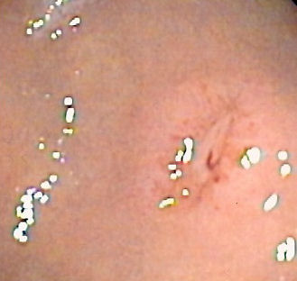

# SANGRAMENTO DIGESTIVO ALTO

O Sangramento Digestivo Alto (HDA) é definido como a perda de sangue originada em qualquer segmento do trato gastrointestinal acima do ângulo de Treitz (flexura duodenojejunal). Na prática de pronto-socorro e nas provas de residência, este é um dos temas mais "quentes" porque exige uma tomada de decisão rápida e hierarquizada.

Muitos alunos erram questões de HDA porque tentam decorar a conduta antes de entender a prioridade. Lembre-se: ninguém morre de "falta de endoscopia" nos primeiros 15 minutos; morre-se de choque hipovolêmico ou aspiração de via aérea.

*Figura 1 - Imagem endoscópica de úlcera gástrica com vaso visível (Forrest IIA): a endoscopia digestiva alta é fundamental para diagnóstico, classificação e tratamento do sangramento digestivo alto não-varicoso. Fonte: Samir, CC BY-SA 3.0 | Wikimedia Commons*

## Abordagem Inicial e Estabilização Hemodinâmica

Imagine que você está no plantão e chega um paciente de 55 anos, pálido, sudoreico, com hematêmese volumosa. O que você faz primeiro? Se você respondeu "chamar a endoscopia", você errou a questão.

A prioridade absoluta é o **ABCDE da Reanimação**. Em HDA grave com perda de consciência ou hematêmese maciça, a proteção da via aérea (Intubação Orotraqueal - IOT) deve ser considerada precocemente para evitar a broncoaspiração de sangue.

### Reposição Volêmica e Metas

A reposição deve ser feita com cristaloides (Ringer Lactato ou Soro Fisiológico) através de dois acessos venosos periféricos de grosso calibre (14G ou 16G).

Cuidado com a pegadinha: em pacientes cirróticos com sangramento varicoso, a reposição volêmica deve ser **cautelosa**. Se você "encharcar" o paciente, a pressão portal sobe e as varizes voltam a sangrar. A meta de Hemoglobina (Hb) para a maioria dos pacientes é manter entre 7 e 9 g/dL. Transfusão excessiva em cirróticos aumenta a mortalidade.

### Avaliação de Risco

Utilizamos escores para decidir quem pode ir para casa e quem precisa de UTI.

- **Glasgow-Blatchford:** Usado *antes* da endoscopia. Se for 0 ou 1, o risco é muito baixo e o paciente pode, teoricamente, fazer investigação ambulatorial.

- **Escore de Rockall:** Usa dados da endoscopia para prever mortalidade e ressangramento.

## Diagnóstico Diferencial: Onde está o sangue?

Para a prova, dividimos a HDA em dois grandes grupos: **Não-Varicosa** (80% dos casos) e **Varicosa** (20% dos casos, mas com maior mortalidade).

### HDA Não-Varicosa

A causa número um no Brasil e no mundo é a **Úlcera Péptica**.

- **Úlcera Duodenal:** Geralmente na parede posterior do duodeno. Por que isso cai? Porque ali passa a **artéria gastroduodenal**. Se a úlcera corrói essa artéria, o sangramento é catastrófico.

- **Laceração de Mallory-Weiss:** É a laceração da junção esofagogástrica após vômitos vigorosos ou tosse intensa. É o clássico paciente que bebeu muito, vomitou "limpo" várias vezes e, na última, veio sangue. Na maioria das vezes, o sangramento é autolimitado e o tratamento é conservador.

- **Lesão de Dieulafoy:** Uma artéria submucosa de grande calibre que protrui através da mucosa. Causa sangramentos intermitentes e maciços, muitas vezes difíceis de achar na endoscopia inicial.

- **Hemobilia:** Sangramento pela via biliar. Suspeite se o paciente tiver a Tríade de Sandblom: dor em hipocôndrio direito + icterícia + hemorragia digestiva. Geralmente ocorre após trauma hepático ou procedimentos em vias biliares.

### HDA Varicosa

Ocorre em pacientes com Hipertensão Portal (Cirrose, Esquistossomose). Aqui, o manejo muda completamente porque o problema não é uma "ferida" (úlcera), mas sim um sistema de alta pressão que rompeu.

## Manejo da HDA Não-Varicosa (Úlcera Péptica)

A Endoscopia Digestiva Alta (EDA) deve ser realizada idealmente nas primeiras 24 horas, após a estabilização. Ela é diagnóstica e terapêutica.

### Classificação de Forrest

Esta tabela você precisa saber de cor. Ela define quem recebe tratamento endoscópico e quem tem alto risco de ressangramento.

| Classificação | Descrição | Risco de Ressangramento | Conduta Endoscópica |
| --- | --- | --- | --- |
| **I a** | Sangramento arterial em jato | 90% | Obrigatória |
| **I b** | Sangramento "babando" (venoso) | 10-30% | Obrigatória |
| **II a** | Vaso visível não sangrante | 40-50% | Obrigatória |
| **II b** | Coágulo aderente | 20-30% | Considerar (remover coágulo) |
| **II c** | Hematina na base da úlcera | < 10% | Não necessária |
| **III** | Base clara (úlcera limpa) | < 5% | Não necessária |

**Dica do Dr. Will:** As bancas adoram colocar um Forrest IIb (coágulo aderente) e perguntar a conduta. A recomendação atual é tentar remover o coágulo para tratar o que está por baixo (pode ser um vaso visível). Se o coágulo não sair com irrigação, tratamos com IBP em dose alta.

### Terapia Farmacológica

O Inibidor de Bomba de Prótons (IBP) é o padrão-ouro. O Omeprazol deve ser feito em dose dobrada (80mg em bólus + 8mg/h em infusão contínua ou 40mg 12/12h).
*Por que o IBP ajuda no sangramento?* Porque a agregação plaquetária e a estabilidade do coágulo são dependentes de pH. Em pH < 6,0, o coágulo se dissolve. Mantendo o estômago alcalino, protegemos o coágulo.

### Quando a Endoscopia Falha?

Se o paciente ressangra após a primeira EDA, a conduta é **tentar uma segunda EDA**. Se houver nova falha ou se o sangramento for tão maciço que impede a visualização (choque refratário), partimos para:

- **Arteriografia com Embolização:** Ótima para pacientes graves sem condições cirúrgicas. Detecta sangramentos > 0,5 a 1,0 mL/min.

- **Cirurgia de Urgência:** Indicada em falha endoscópica persistente, choque refratário ou necessidade de mais de 3-6 bolsas de sangue em 24h. Na úlcera duodenal, faz-se a duodenotomia e a sutura do vaso (ulcerorrafia).

*Figura 2 - Anatomia do trato gastrointestinal superior: o esôfago e o estômago são os principais sítios de sangramento digestivo alto (HDA), seja por úlceras pépticas ou por varizes esofágicas. Fonte: BruceBlaus, CC BY-SA 4.0 | Wikimedia Commons*

## Manejo da HDA Varicosa (Hipertensão Portal)

Aqui o jogo é outro. O paciente cirrótico é frágil, tem coagulopatia e risco de infecção.

### O Tripé do Tratamento

- **Drogas Vasoativas Esplâncnicas:** Devem ser iniciadas **antes** da endoscopia, na suspeita clínica.

- **Terlipressina:** A única que comprovadamente reduz mortalidade. Cuidado com isquemia periférica e hiponatremia.

- **Octreotide:** Análogo da somatostatina, muito seguro, mas menos potente que a terlipressina.

- **Antibioticoterapia Profilática:** Todo cirrótico com HDA deve receber antibiótico (Ceftriaxone 1g IV ou Norfloxacino 400mg VO). Isso reduz a incidência de PBE (Peritonite Bacteriana Espontânea) e o ressangramento.

- **Terapia Endoscópica:** A **Ligadura Elástica** é a primeira escolha para varizes de esôfago. A escleroterapia fica como segunda opção.

### Varizes Gástricas: O "Pulo do Gato"

Se o sangramento for de varizes gástricas (especialmente as fúndicas), a ligadura elástica não funciona bem. O tratamento de escolha aqui é a injeção de **Cianoacrilato** (uma "super cola").

**Pegadinha de Prova:** Se o paciente tem varizes gástricas isoladas (sem varizes de esôfago) e esplenomegalia, pense em **Trombose da Veia Esplênica** (Hipertensão Portal Esquerda ou Segmentar). A causa clássica é a pancreatite crônica. O tratamento definitivo? **Esplenectomia**.

### O Balão de Sengstaken-Blakemore

É uma medida de **salvamento/ponte**. Se o paciente está chocando e a endoscopia não resolveu ou não está disponível, passamos o balão.

- **Balão Gástrico:** Insuflado com 200-300ml de ar. É ele quem faz a tração e comprime o cárdia.

- **Balão Esofágico:** Insuflado até 30-45 mmHg.

- **Cuidado:** Não pode ficar mais de 24h pelo risco de necrose esofágica. É apenas uma ponte para o TIPS ou cirurgia.

### TIPS (Shunt Portossistêmico Intra-hepático Transjugular)

É a colocação de uma prótese entre a veia hepática e a veia porta por via percutânea.

- **Indicação:** Sangramento refratário ou ascite intratável.

- **Contraindicação:** Insuficiência cardíaca direita grave e encefalopatia hepática grave (o TIPS desvia o sangue com amônia direto para a circulação sistêmica, piorando a encefalopatia).

## Tratamento Cirúrgico da Hipertensão Portal

Nas provas de cirurgia, você precisa saber quando indicar cada técnica, especialmente na Esquistossomose (onde a função hepática é preservada - Child A).

### 1. Desconexão Ázigo-Portal + Esplenectomia (DAPE)

É a cirurgia de escolha na **Esquistossomose** com sangramento recorrente. Como o fígado é "bom", não queremos fazer um shunt que cause encefalopatia. Nós "desconectamos" os vasos que levam sangue do sistema porta para o esôfago.

- **Vantagem:** Não causa encefalopatia.

- **Desvantagem:** Risco de trombose da veia porta no pós-operatório.

### 2. Shunts Seletivos (Cirurgia de Warren)

Consiste na anastomose da veia esplênica com a veia renal esquerda (Shunt Esplenorrenal Distal).

- **Objetivo:** Descomprimir apenas as varizes, mantendo o fluxo de sangue portal para o fígado (fluxo hepatopetal).

- **Indicação:** Pacientes Child A ou B com sangramento refratário.

### 3. Shunts Não-Seletivos (Portocava)

Conecta a veia porta diretamente à veia cava. Descomprime tudo, mas a taxa de encefalopatia é altíssima. Praticamente abandonada, exceto em situações de extrema urgência.

### 4. Transplante Hepático

É o tratamento definitivo para o cirrótico Child C com hipertensão portal. Resolve a causa (cirrose) e a consequência (varizes).

## Tabelas Comparativas para Revisão Rápida

### Tabela 1: Diferenciando as Causas de HDA

| Causa | História Clínica Típica | Achado na EDA |
| --- | --- | --- |
| **Úlcera Péptica** | Uso de AINEs, H. pylori, dor epigástrica | Solução de continuidade com fibrina/sangue |
| **Mallory-Weiss** | Vômitos vigorosos após etilismo | Laceração longitudinal na JEC |
| **Varizes** | Cirrose, Esquistossomose, Ascite | Cordões venosos dilatados |
| **Dieulafoy** | Sangramento maciço "do nada" | Artéria pulsátil em mucosa íntegra |
| **Ectasia Antral** | "Estômago em melancia", anemia crônica | Estrias avermelhadas no antro |

### Tabela 2: Metas e Doses Farmacológicas

| Intervenção | Dose/Meta | Observação |
| --- | --- | --- |
| **Hemoglobina** | 7 - 9 g/dL | Meta restritiva reduz ressangramento |
| **Terlipressina** | 2mg IV 4/4h (ataque) | Manter por 2 a 5 dias |
| **Ceftriaxone** | 1g IV 24/24h | Profilaxia de PBE obrigatória |
| **Omeprazol** | 80mg (bolus) + 8mg/h | pH gástrico ideal > 6,0 |

## Situações Especiais e Pegadinhas

### Enterorragia Maciça: É Alta ou Baixa?

Este é um conceito que o MedEvo sempre reforça: cerca de 10-15% das hemorragias que se manifestam como **hematoquezia ou enterorragia** (sangue vivo pelo ânus) são, na verdade, **HDA maciça**.
Se o paciente tem sangue vivo pelo reto E instabilidade hemodinâmica, a primeira conduta diagnóstica é a **Endoscopia Digestiva Alta**, não a colonoscopia. O sangue passa tão rápido pelo intestino que não sofre digestão (não vira melena).

### O Paciente com EDA Normal

Você suspeita de HDA, faz a EDA e ela vem normal. E agora?

- Pode ser um sangramento intermitente (Dieulafoy ou Hemobilia).

- Pode ser um sangramento do **Intestino Delgado** (antigamente chamado de Sangramento de Origem Obscura). A causa mais comum em idosos são as angiodisplasias. O exame de escolha inicial é a Enteroscopia ou Cápsula Endoscópica.

- Se o sangramento for vultuoso e a EDA/Colono forem normais, a **Arteriografia** ou **Angiotomografia** podem localizar o foco.

### Hipertensão Portal Esquistossomótica

Diferente do cirrótico, o esquistossomótico tem função hepática preservada (não tem icterícia, não tem queda de albumina importante). O problema é uma fibrose periportal (Fibrose de Symmers).

- **Prova:** Se cair um paciente com esplenomegalia gigante, varizes de esôfago, mas exames laboratoriais de função hepática normais, marque Esquistossomose. O tratamento cirúrgico preferencial é a DAPE (Desconexão Ázigo-Portal + Esplenectomia).

## Complicações do Balão de Sengstaken-Blakemore

As bancas adoram perguntar por que não usamos o balão por muito tempo.

- **Pneumonia por aspiração:** O paciente não consegue deglutir saliva.

- **Necrose de esôfago:** Pela pressão excessiva do balão na parede esofágica.

- **Ruptura esofágica:** Se o balão gástrico for insuflado acidentalmente no esôfago.

- **Asfixia:** Se o balão migrar para cima e obstruir a laringe (sempre deixe uma tesoura no leito para cortar o balão em caso de insuficiência respiratória súbita).

## Indicações Cirúrgicas na Úlcera Péptica (HDA Não-Varicosa)

Hoje a cirurgia é rara, mas cai em prova. As indicações são:

- **Falha do tratamento endoscópico** (duas tentativas sem sucesso).

- **Hemorragia persistente** com instabilidade hemodinâmica refratária.

- **Ressangramento grave** em paciente que já está internado e otimizado.

- **Tipo de úlcera:** Úlceras gigantes (> 2cm) têm maior taxa de falha endoscópica.

Na úlcera duodenal (mais comum), fazemos a **Piloroplastia + Ulcerorrafia**. Se o paciente tiver estabilidade, pode-se associar a Vagotomia Troncular para tratar a causa da acidez.

## Pontos-Chave para Prova 💡

- **Prioridade 1:** Estabilização hemodinâmica (ABCDE) antes de qualquer exame diagnóstico.

- **Meta de Hemoglobina:** 7-9 g/dL (estratégia restritiva). Evite hiper-hidratação no cirrótico.

- **Antibiótico no Cirrótico:** Obrigatório (Ceftriaxone ou Norfloxacino) para reduzir PBE e mortalidade.

- **Drogas Vasoativas:** Iniciar IMEDIATAMENTE na suspeita de varizes, antes mesmo da EDA.

- **Forrest I e IIa:** Tratamento endoscópico obrigatório (alto risco de ressangramento).

- **Forrest III:** Pode receber alta para tratamento ambulatorial (baixo risco).

- **Mallory-Weiss:** Laceração por vômitos; conduta geralmente é apenas observação.

- **Dieulafoy:** Artéria submucosa calibrosa; sangramento arterial intermitente em mucosa "normal".

- **Trombose de Veia Esplênica:** Varizes gástricas isoladas + Pancreatite crônica. Tratamento: Esplenectomia.

- **Sengstaken-Blakemore:** Medida de exceção/ponte. Máximo 24 horas.

- **TIPS:** Contraindicado em IC direita e Encefalopatia grave.

- **Esquistossomose:** Função hepática preservada. Cirurgia: Desconexão Ázigo-Portal + Esplenectomia.

- **Artéria Gastroduodenal:** A principal culpada no sangramento maciço por úlcera duodenal posterior.

- **Angiotomografia/Arteriografia:** Indicadas quando a EDA é inconclusiva e o sangramento é ativo (> 0,5 ml/min).

- **Cianoacrilato:** Tratamento de escolha para Varizes Gástricas (fúndicas).

- **O que NÃO fazer:** Não fazer EDA em paciente instável. Não transfundir até Hb 12 no cirrótico. Não esquecer o antibiótico no cirrótico.

 Cópia offline para consulta pessoal.
 Fonte original:
 [https://www.medevo.com.br/material-apoio/ler/bf3e931a-9016-40e3-9812-4d40cad9c711](https://www.medevo.com.br/material-apoio/ler/bf3e931a-9016-40e3-9812-4d40cad9c711)
