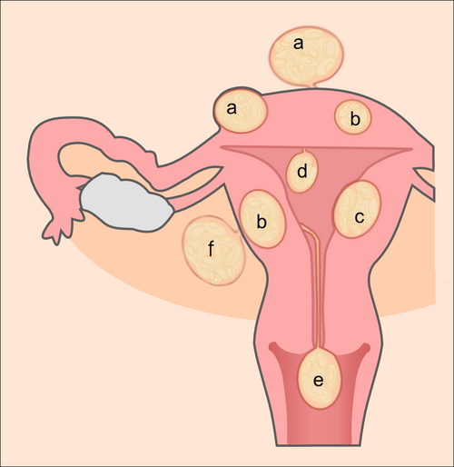

# SANGRAMENTO UTERINO ANORMAL

O Sangramento Uterino Anormal (SUA) é, sem dúvida, um dos temas que você mais encontrará no seu dia a dia de ambulatório e, consequentemente, um dos preferidos das bancas de residência. Para entender SUA, você precisa esquecer termos antigos como "menorragia" ou "metrorragia". A FIGO (Federação Internacional de Ginecologia e Obstetrícia) simplificou tudo para que falemos a mesma língua.

O SUA não é uma doença, mas um sinal. É o útero gritando que algo está errado, seja na sua estrutura ou no seu funcionamento endócrino. Se você dominar a classificação PALM-COEIN e souber o que priorizar em cada faixa etária, você não erra nenhuma questão.

O diagrama a seguir apresenta a anatomia do sistema reprodutor feminino — compreender a localização e as relações entre útero, ovários e tubas uterinas é fundamental para raciocinar sobre as diferentes causas de SUA:

*Figura 1 - Esquema do sistema reprodutor feminino em vista frontal: o útero (com endométrio e miométrio), os ovários e as tubas uterinas. Alterações estruturais ou funcionais em qualquer uma dessas estruturas podem originar o SUA. Fonte: CDC/Mysid, Domínio Público | Wikimedia Commons*

## Definições e Parâmetros da Normalidade

Antes de dizer o que é anormal, você precisa saber o que é um ciclo normal. A FIGO (2017/2018) estabeleceu critérios objetivos. Se o caso clínico da prova fugir desses números, estamos diante de um SUA.

**Tabela 1: Parâmetros do Ciclo Menstrual Normal (FIGO)**

| Parâmetro | Normalidade | Terminologia Anormal |
| --- | --- | --- |
| Frequência | 24 a 38 dias | < 24 (Polimenorreia) / > 38 (Oligomenorreia) |
| Duração | Até 8 dias | > 8 dias (Sangramento prolongado) |
| Volume | Definido pela paciente | "Volume excessivo" (substitui menorragia) |
| Regularidade | Variação < 7 a 9 dias | Irregular (variação > 10 dias) |

Um ponto fundamental que o Dr. Will sempre reforça nas discussões de caso: o sangramento intermenstrual (aquele "spotting" entre as regras) é sempre considerado anormal, exceto se for o sangramento ovulatório fisiológico (pequena queda de estrogênio no meio do ciclo), mas na prova, se houver queixa, investigamos.

## A Regra de Ouro: Excluir Gestação

Se você vir uma mulher em idade fértil com sangramento vaginal, não importa se ela usa DIU, se toma pílula ou se diz que "não tem relações", o seu primeiro passo é o Beta-hCG.

Por que isso é tão cobrado? Porque as complicações da gestação (abortamento, gravidez ectópica, doença trofoblástica) são diagnósticos diferenciais críticos. Uma gravidez ectópica rota pode matar a paciente em minutos por choque hipovolêmico. Lembre-se: dor abdominal + amenorreia + sangramento vaginal + ßHCG positivo = suspeita de gravidez ectópica. Se houver instabilidade e líquido livre no fundo de saco (paracentese ou USG com debris), a conduta é cirúrgica imediata (laparotomia ou laparoscopia).

## Classificação PALM-COEIN

Esta é a espinha dorsal do tema. A FIGO dividiu as causas em estruturais (PALM), que você vê no exame de imagem, e não estruturais (COEIN), que dependem de exames laboratoriais ou são diagnósticos de exclusão.

### Causas Estruturais (PALM)

#### Pólipo (P)

São projeções do endométrio. O quadro clássico de prova é o sangramento intermenstrual ou o sangramento após o coito. No ultrassom, vemos um espessamento focal. O diagnóstico definitivo e o tratamento são feitos pela histeroscopia com polipectomia. Se a paciente tem pólipo e sangramento, tem que tirar.

#### Adenomiose (A)

É a presença de tecido endometrial dentro do miométrio. Imagine o útero como uma esponja que não consegue se contrair direito. O quadro típico é: mulher multípara, com SUA e dismenorreia (cólica) intensa. Ao exame físico, o útero está aumentado de volume ("útero em bola") e amolecido. No ultrassom, vemos miométrio heterogêneo e zonas juncionais espessadas.

#### Leiomioma (L)

O diagrama esquemático a seguir ilustra os diferentes tipos de miomas uterinos e suas localizações — perceba que somente os submucosos, que distorcem a cavidade endometrial, são os principais causadores de SUA:

*Figura 2 - Representação esquemática dos tipos de leiomiomas uterinos: subserosos (projetam-se para a superfície externa do útero), intramurais (dentro do miométrio) e submucosos (deformam a cavidade endometrial). Os submucosos são os mais associados ao sangramento uterino anormal. Fonte: Hic et nunc, CC BY-SA 3.0 | Wikimedia Commons*

Os famosos miomas. Mas cuidado: nem todo mioma causa sangramento. Os miomas subserosos (fora do útero) não causam SUA. Os intramurais podem causar se forem grandes. Os verdadeiros vilões do SUA são os **miomas submucosos**. Eles distorcem a cavidade endometrial e impedem a hemostasia local. Se a questão fala em mioma e sangramento, procure a alternativa que mencione o componente submucoso.

#### Malignidade e Hiperplasia (M)

Aqui mora o perigo. Sempre que houver um endométrio espessado, especialmente em mulheres com fatores de risco (obesidade, nuliparidade, anovulação crônica, uso de Tamoxifeno), devemos suspeitar de hiperplasia ou câncer de endométrio.
Na pós-menopausa, qualquer sangramento é suspeito. Embora a causa mais comum de sangramento na pós-menopausa seja a **atrofia endometrial**, a nossa obrigação é excluir o câncer. O ponto de corte no ultrassom para pacientes sem terapia hormonal é de 4 a 5 mm. Se estiver acima disso, biópsia neles!

### Causas Não Estruturais (COEIN)

#### Coagulopatia (C)

Muitos médicos esquecem disso, mas as bancas não. Cerca de 13% das mulheres com sangramento excessivo têm alguma coagulopatia, sendo a Doença de Von Willebrand a mais comum.
**Dica de Prova:** Se a paciente for uma adolescente com sangramento grave desde a menarca, ou se houver história de petéquias, gengivorragia ou sangramento excessivo em cirurgias dentárias, investigue coagulopatia. O tratamento em casos agudos graves pode envolver o uso de desmopressina ou concentrado de fator.

#### Ovulatória (O)

Aqui entra o antigo "Sangramento Uterino Disfuncional". Ocorre principalmente nos extremos da vida reprodutiva (adolescência e perimenopausa).
Na adolescência, o eixo hipotálamo-hipófise-ovário ainda é imaturo. Não há pico de LH, não há ovulação e, consequentemente, não há produção de progesterona pelo corpo lúteo. O endométrio fica exposto apenas ao estrogênio, cresce desordenadamente e descama de forma irregular.
Na perimenopausa, os folículos estão acabando e são menos sensíveis às gonadotrofinas, levando também a ciclos anovulatórios.

#### Endometrial (E)

É um diagnóstico de exclusão. O ciclo é ovulatório (regular), não há miomas ou pólipos, mas a paciente sangra muito. A causa é uma disfunção local de substâncias como prostaglandinas e citocinas inflamatórias. A endometrite crônica (presença de plasmócitos na biópsia) também entra aqui e pode causar sangramento e infertilidade.

#### Iatrogênica (I)

Sangramento causado por intervenção médica. Exemplos: uso de DIU de cobre (que pode aumentar o fluxo), uso de anticoagulantes, ou o famoso "sangramento de escape" (spotting) em usuárias de anticoncepcionais hormonais.
Um detalhe importante para a vida e para a prova: pacientes pós-cirurgia bariátrica disabsortiva podem ter falha na absorção de anticoncepcionais orais. Nelas, preferimos métodos não orais, como o injetável ou o DIU.

#### Não Classificada (N)

Causas raras ou ainda mal definidas, como malformações arteriovenosas ou istmocele (um "buraco" na cicatriz da cesárea anterior que acumula sangue).

**Tabela 2: Resumo PALM-COEIN**

| Categoria | Característica Principal | Diagnóstico Sugerido |
| --- | --- | --- |
| **P**ólipo | Sangramento intermenstrual | Ultrassom / Histeroscopia |
| **A**denomiose | SUA + Dismenorreia intensa | USG / Ressonância |
| **L**eiomioma | Mioma submucoso é o principal | USG / Histeroscopia |
| **M**alignidade | Pós-menopausa / Fatores de risco | Biópsia / Histeroscopia |
| **C**oagulopatia | Desde a menarca / Equimoses | Coagulograma / Fator vW |
| **O**vulatória | Ciclos irregulares / Extremos da vida | Clínico (excluir outros) |
| **E**ndometrial | Ciclos regulares / Exclusão | Clínico / Biópsia |
| **I**atrogênica | Uso de fármacos / DIU | Anamnese |

## Abordagem Diagnóstica: O Passo a Passo

Quando uma paciente chega com SUA, você deve ser sistemático. No MedEvo, sempre ensinamos que a organização mental poupa tempo e evita erros.

- **Estabilidade Hemodinâmica:** Antes de perguntar quando foi a última menstruação, veja se a paciente está chocada. Se houver hipotensão, taquicardia ou palidez extrema, o foco é estabilização: acesso venoso calibroso, cristaloide e, se necessário, hemoderivados.

- **Anamnese:** Pergunte sobre o padrão do sangramento (quantidade, coágulos, duração), uso de medicamentos, história familiar de sangramento e sintomas associados (dor, perda de peso).

- **Exame Físico:**

- Geral: Sinais de anemia, petéquias (coagulopatia), acantose nigricans ou hirsutismo (SOP/Anovulação), bócio (tireoidopatias).

- Ginecológico: Exame especular é obrigatório! Você precisa ver de onde vem o sangue. Pode ser um pólipo cervical, uma laceração vaginal ou um câncer de colo uterino. O toque bimanual avalia o tamanho e a mobilidade do útero.

- **Exames Laboratoriais:**

- Beta-hCG (Sempre!).

- Hemograma (para avaliar o grau da anemia).

- Coagulograma (se suspeita de causa sistêmica ou em adolescentes).

- TSH (Hipotireoidismo é causa clássica de menorragia).

- **Exames de Imagem:**

- Ultrassonografia Transvaginal (USTV): É o exame de primeira linha. Avalia a espessura endometrial e a presença de miomas ou pólipos.

- Histeroscopia: É o padrão-ouro para avaliar a cavidade uterina. Permite a visão direta e a biópsia dirigida. Se o ultrassom mostrou algo duvidoso ou se o tratamento clínico falhou, a histeroscopia é o próximo passo.

## Tratamento do Sangramento Uterino Anormal

O tratamento depende de dois fatores: a causa (PALM-COEIN) e se o sangramento é agudo ou crônico.

### Manejo do Sangramento Agudo (Urgência)

A paciente chega sangrando muito, mas está estável. O objetivo é parar o sangramento rápido.

- **Estrogênios em altas doses:** O estrogênio promove a proliferação endometrial rápida, "selando" as áreas descamadas. Pode ser usado o estrogênio equino conjugado EV ou doses altas de anticoncepcional oral combinado (AOC).

- **Antifibrinolíticos:** O Ácido Tranexâmico é excelente para o controle agudo. Ele não é hormônio, ele apenas impede a lise do coágulo. Dose comum: 1g a 1,5g a cada 8 horas.

- **AINEs:** Ajudam a reduzir o fluxo e a dor, mas não são a primeira escolha na urgência grave.

- **Tamponamento uterino:** Em casos desesperadores, pode-se usar uma sonda de Foley com balão inflado dentro do útero para compressão mecânica.

- **Curetagem Semiótica/Terapêutica:** Se o tratamento medicamentoso falhar ou se a paciente estiver instável, a curetagem limpa a cavidade e permite a contração uterina, além de fornecer material para biópsia.

### Manejo do Sangramento Crônico (Manutenção)

Aqui o objetivo é tratar a causa e melhorar a qualidade de vida.

#### Tratamento Não Hormonal

Indicado para quem tem ciclos regulares (causa endometrial) ou contraindicações aos hormônios.

- **AINEs:** Reduzem o fluxo em cerca de 30-50%. Devem ser iniciados no primeiro dia da menstruação.

- **Ácido Tranexâmico:** Muito eficaz para reduzir o volume sanguíneo.

#### Tratamento Hormonal

- **Anticoncepcionais Orais Combinados (AOC):** Regularizam o ciclo e reduzem o fluxo. Ótimos para causas ovulatórias.

- **Progestagênios isolados:** Podem ser usados de forma cíclica (para quem tem ciclos anovulatórios) ou contínua (para promover atrofia endometrial).

- **Sistema Intrauterino de Levonorgestrel (SIU-LNG / Mirena):** É um dos melhores tratamentos para SUA crônico (especialmente adenomiose e miomas pequenos). Reduz o fluxo em até 90% após alguns meses.

#### Tratamento Cirúrgico

- **Ablação Endometrial:** Destruição da camada funcional do endométrio. Indicada para mulheres que já completaram a prole e não querem retirar o útero.

- **Miomectomia/Polipectomia:** Tratamento das causas estruturais específicas.

- **Histerectomia:** O tratamento definitivo. Reservado para casos de falha do tratamento clínico, suspeita de malignidade ou quando a paciente assim o deseja após esclarecimento.

**Tabela 3: Opções de Tratamento Medicamentoso**

| Medicamento | Indicação Principal | Mecanismo |
| --- | --- | --- |
| Ácido Tranexâmico | SUA agudo ou crônico intenso | Antifibrinolítico |
| AINEs (ex: Ácido Mefenâmico) | SUA + Dismenorreia | Inibição de Prostaglandinas |
| AOC (Alta dose) | Estabilização aguda | Proliferação e estabilização |
| SIU-LNG (Mirena) | Manutenção / Adenomiose | Atrofia endometrial local |
| Progesterona Cíclica | Anovulação (adolescente/perimenopausa) | Regularização do ciclo |

## Situações Especiais e Pegadinhas de Prova

### A Adolescente

Lembre-se: a causa mais comum é a anovulação por imaturidade do eixo HHO. No entanto, se o sangramento for grave desde a primeira menstruação, a prova quer que você marque **Coagulopatia**. Se a adolescente for virgem e precisar de tratamento hormonal agudo, usamos estrogênio em altas doses ou AOC oral. Não se faz exame especular ou USG transvaginal em virgens (usa-se a via pélvica/abdominal).

### A Perimenopausa

É a fase de transição. A anovulação é frequente, mas o risco de câncer de endométrio começa a subir. Se a paciente tem ciclos irregulares e o ultrassom é normal, o tratamento de escolha é a progesterona cíclica para "organizar" a descamação do endométrio. Se houver falha no tratamento, biópsia sempre.

### A Pós-menopausa

Regra de ouro: Sangrou? Investigue.
Causa mais comum: Atrofia endometrial.
Causa mais temida: Câncer de endométrio.
Fatores de risco para câncer: Obesidade, Diabetes, Hipertensão, Nuliparidade, Menopausa tardia, uso de Tamoxifeno.
O Tamoxifeno é um modulador seletivo do receptor de estrogênio (SERM). Ele é antiestrogênico na mama, mas **estrogênico no útero**. Por isso, aumenta o risco de pólipos e câncer de endométrio.

### Miomas e Gravidez

Um clássico: gestante com dor abdominal aguda sobre um mioma pré-existente. Diagnóstico: **necrobiose asséptica** (ou degeneração rubra). O mioma cresce rápido demais pela estimulação hormonal, falta sangue para ele e ele sofre infarto. O tratamento é apenas analgesia; não se opera mioma durante a gravidez ou parto (risco de hemorragia maciça).

### Pós-Bariátrica

Como já mencionado, a cirurgia bariátrica (especialmente as técnicas disabsortivas como o Bypass em Y de Roux) compromete a eficácia dos anticoncepcionais orais. Se a paciente bariátrica apresentar irregularidade menstrual, a conduta é trocar para um método não oral, como o injetável combinado ou o DIU.

## Diagnóstico Diferencial de Sangramento na Gravidez

Embora o foco seja SUA, as provas misturam os temas. Se o Beta-hCG for positivo, o raciocínio muda:

- **Abortamento Incompleto:** Sangramento, colo aberto, restos ovulares ao USG. Manejo: Esvaziamento uterino (AMIU ou curetagem).

- **Gravidez Ectópica:** Dor lateralizada, colo fechado, útero vazio ao USG com massa anexial.

- **Doença Trofoblástica (Mola):** Sangramento em "suco de ameixa", vesículas, Beta-hCG estratosférico, imagem em "tempestade de neve" no USG.

## O "Porquê" das Condutas

Por que usamos progesterona na anovulação? Porque na anovulação o endométrio só recebe estrogênio (proliferação). Ele cresce sem suporte estrutural e descama em pedaços. A progesterona interrompe a proliferação e promove a diferenciação secretora. Quando paramos a progesterona, o endométrio descama de forma organizada e completa (a famosa "menstruação provocada").

Por que o DIU de cobre aumenta o sangramento? Porque ele causa uma reação inflamatória estéril no endométrio, aumentando a produção de prostaglandinas e a vascularização local. Já o DIU de Mirena faz o oposto: libera levonorgestrel que atrofia as glândulas endometriais.

## Estratificação de Risco e Metas

A meta principal no SUA agudo é a estabilidade hemodinâmica e a parada do sangramento para evitar a necessidade de transfusão. No SUA crônico, a meta é manter a hemoglobina em níveis normais e permitir que a mulher exerça suas atividades sem o constrangimento de sangramentos inesperados ou excessivos.

Sempre que você se deparar com uma questão de SUA, pergunte-se:

- Está grávida?

- Está instável?

- Qual a idade (adolescente, adulta ou menopausada)?

- O útero é normal ou tem nódulos/espessamentos?

Respondendo a isso, o diagnóstico sai naturalmente.

## Pontos-Chave para Prova

- **Critérios de Normalidade:** Ciclo de 24-38 dias, duração até 8 dias, variação < 9 dias.

- **Primeira Conduta:** Beta-hCG em toda mulher em idade fértil.

- **Exame de Imagem Inicial:** Ultrassonografia transvaginal.

- **Padrão-Ouro para Cavidade:** Histeroscopia diagnóstica com biópsia.

- **Causa mais comum na Adolescência:** Anovulação por imaturidade do eixo HHO.

- **Causa a ser investigada na Adolescente com sangramento grave:** Coagulopatia (Von Willebrand).

- **Causa mais comum na Pós-menopausa:** Atrofia endometrial.

- **Espessura Endometrial na Pós-menopausa:** Preocupar-se se > 4-5 mm (sem TH) ou > 8 mm (com TH).

- **Tamoxifeno:** Aumenta o risco de câncer de endométrio (efeito agonista no útero).

- **Tratamento Agudo (Estável):** Estrogênios em altas doses, AOC (3/dia) ou Ácido Tranexâmico.

- **Tratamento Agudo (Instável):** Estabilização hemodinâmica + Curetagem uterina ou Balão de Foley.

- **Tratamento de Manutenção (Padrão-Ouro Clínico):** SIU-LNG (Mirena).

- **Adenomiose:** Tríade de SUA + Dismenorreia + Útero aumentado/globoso.

- **Mioma que causa SUA:** Submucoso (Classificação FIGO 0, 1 e 2).

- **Pós-Bariátrica:** Evitar anticoncepcional oral; preferir injetáveis ou DIU.

- **O que NÃO fazer:** Não prescrever hormônios sem antes excluir gravidez e, em mulheres mais velhas, sem avaliar o endométrio se houver suspeita de malignidade.

- **Pegadinha de Prova:** A alternativa dirá que a causa mais comum na pós-menopausa é o câncer. Errado! É a atrofia. O câncer é a causa mais importante de excluir, mas não a mais frequente. 🩺

 Cópia offline para consulta pessoal.
 Fonte original:
 [https://www.medevo.com.br/material-apoio/ler/50f22d8f-6b86-42a0-8be8-fc081b6389a2](https://www.medevo.com.br/material-apoio/ler/50f22d8f-6b86-42a0-8be8-fc081b6389a2)
