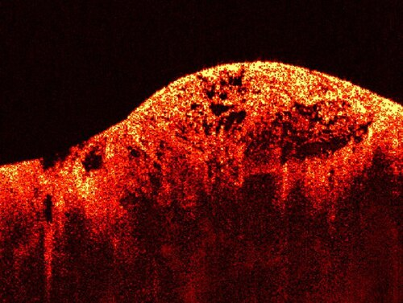
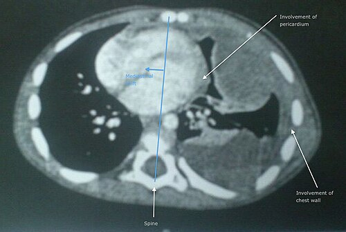

# SARCOMAS DE PARTES MOLES

Os sarcomas de partes moles (SPM) representam um grupo heterogêneo de neoplasias mesenquimais raras, mas com um peso enorme em provas de residência. Por que eles caem tanto? Porque o manejo exige conceitos fundamentais de oncologia cirúrgica que se aplicam a quase tudo: margens, biópsia correta, estadiamento sistêmico e biologia tumoral.

Diferente dos carcinomas, que se originam do epitélio, os sarcomas vêm do "recheio" do corpo: gordura, músculo, vasos, nervos e tecido conectivo. Existem mais de 50 subtipos histológicos, mas para a sua prova, o foco deve estar nos princípios gerais e nos tipos específicos que "batem cartão" nos enunciados, como o GIST e o Lipossarcoma.

*Figura 1 - Tomografia de Coerência Óptica (OCT) de um sarcoma de partes moles: à esquerda, tecido normal; à direita, estrutura tumoral irregular e desorganizada. Os sarcomas são tumores mesenquimais raros que representam menos de 1% dos tumores malignos. Fonte: NIBIB/Dr. S. Boppart, Domínio Público | Wikimedia Commons*

## Epidemiologia e Fatores de Risco

Embora correspondam a apenas 1% das neoplasias malignas em adultos, nos pequenos o cenário muda: o **Rabdomiossarcoma** é o sarcoma de partes moles mais comum em crianças e está frequentemente associado a síndromes genéticas, como a Neurofibromatose tipo 1 (Doença de von Recklinghausen) e a Síndrome de Li-Fraumeni.

Em adultos, o **Lipossarcoma** é o tipo histológico mais comum, especialmente na faixa dos 50-70 anos. Se a questão falar em massa retroperitoneal, pense em Lipossarcoma até que se prove o contrário.

### Fatores Etiológicos

A maioria dos casos é esporádica, mas as bancas adoram cobrar os fatores de risco clássicos:

- **Radiação Ionizante:** Pacientes tratados para câncer de mama ou linfoma podem desenvolver sarcomas na área irradiada. Cuidado com a pegadinha: o período de latência é longo, geralmente de 10 a 20 anos, e não apenas 5 anos.

- **Linfedema Crônico:** O clássico Angiossarcoma em braço com linfedema pós-mastectomia (Síndrome de Stewart-Treves).

- **Cicatrizes Crônicas:** A **Úlcera de Marjolin** refere-se ao carcinoma espinocelular que surge em cicatrizes de queimaduras ou traumas antigos, mas o conceito de degeneração maligna em tecido cicatricial é recorrente.

- **Síndromes Genéticas:** Além da NF1, a **Polipose Adenomatosa Familiar (PAF)** está fortemente ligada ao **Tumor Desmoide** (até 30% dos pacientes com PAF o desenvolvem).

## Quadro Clínico e Exame Físico

O paciente típico chega ao consultório com uma "bola" que não dói. Esse é o maior perigo. Como a massa é indolor e cresce lentamente, o diagnóstico costuma ser tardio.

**Dica de Ouro do Dr. Will:** Toda massa de partes moles que seja **maior que 5 cm** ou que esteja **profunda à fáscia muscular** deve ser considerada maligna até prova em contrário.

No exame físico, você deve avaliar:

- **Tamanho e profundidade:** Lesões superficiais e pequenas têm melhor prognóstico.

- **Fixação:** Se a massa se move com a contração muscular, ela provavelmente é profunda ou infiltra o músculo.

- **Linfonodos:** Sarcomas raramente disseminam por via linfática (a disseminação clássica é **hematogênica**, preferencialmente para o pulmão).

- *Exceções (os "sarcomas que dão linfonodo"):* Epitelioide, Sinovial, Células Claras e Rabdomiossarcoma.

Se você encontrar uma massa retroperitoneal em um paciente jovem, não esqueça de palpar os testículos e as cadeias linfonodais (virilha, axila, pescoço). Isso serve para descartar tumores de células germinativas ou linfomas, que mudam completamente a conduta.

*Figura 2 - TC de tórax mostrando sarcoma de partes moles indiferenciado em pulmão esquerdo com invasão de pericárdio e parede torácica. A biópsia incisional é mandatória antes do tratamento definitivo: deve ser realizada no sentido longitudinal ao membro, e o trajeto da biópsia deve ser incluído na peça cirúrgica final. Fonte: Domínio Público | Wikimedia Commons*

## Diagnóstico e Biópsia: Onde o Aluno Reprova

Este é o ponto mais crítico. Um erro na biópsia pode custar o membro do paciente.

### Exames de Imagem

- **Extremidades:** A **Ressonância Magnética (RM)** é o padrão-ouro. Ela mostra a relação do tumor com feixes neurovasculares e compartimentos musculares.

- **Retroperitônio e Abdome:** A **Tomografia Computadorizada (TC)** com contraste é preferível para avaliar a anatomia e o envolvimento de órgãos adjacentes.

### A Técnica da Biópsia

Nunca faça uma biópsia excisional (tirar tudo) para uma massa suspeita sem planejamento. Se você "cutucar" o tumor de forma errada, você contamina planos teciduais que antes estavam limpos.

- **Biópsia por Agulha Grossa (Core Biopsy):** É a primeira escolha. É precisa, barata e segura.

- **Biópsia Incisional:** Reservada para casos onde a Core Biopsy foi inconclusiva ou se o tumor for muito grande.

- **Regra de Ouro:** Em membros, a incisão deve ser **sempre longitudinal**. Por quê? Porque o trajeto da biópsia deve ser ressecado em monobloco com o tumor na cirurgia definitiva. Uma incisão transversa obrigaria o cirurgião a retirar uma faixa enorme de pele e tecido, muitas vezes impedindo o fechamento primário ou exigindo amputação.

- **Punção por Agulha Fina (PAAF):** Geralmente insuficiente para o diagnóstico histológico e graduação de sarcomas. Serve apenas para confirmar recidivas conhecidas.

| Tipo de Biópsia | Indicação Principal | Vantagem | Risco |
| --- | --- | --- | --- |
| **Core Biopsy** | Padrão-ouro inicial | Preserva arquitetura tecidual | Baixo risco de contaminação |
| **Incisional** | Lesões > 5cm (se Core falhar) | Grande volume de material | Alta contaminação se mal planejada |
| **Excisional** | Lesões < 3cm e superficiais | Diagnóstico e tratamento | Margens comprometidas se for sarcoma |

## Estadiamento e Fatores Prognósticos

O estadiamento do AJCC (8ª edição) utiliza o sistema TNM, mas com um diferencial: o **Grau Histológico (G)** é o fator prognóstico mais importante.

- **Grau (G):** Baseado na diferenciação celular, índice mitótico e extensão da necrose (Sistema FNCLCC).

- G1: Baixo grau.

- G2/G3: Alto grau.

- **T (Tamanho):** T1 (≤ 5 cm), T2 (> 5 e ≤ 10 cm), T3 (> 10 e ≤ 15 cm), T4 (> 15 cm).

- **N (Linfonodo):** Como vimos, N1 é raro, mas quando presente, é um péssimo sinal.

- **M (Metástase):** O pulmão é o sítio principal. Por isso, todo sarcoma de alto grau exige uma TC de tórax para estadiamento sistêmico antes de qualquer conduta local.

Lembre-se: **Estadiamento T1N0M0** em um lipossarcoma bem diferenciado geralmente significa ressecção cirúrgica com margens amplas (> 1 cm) e, muitas vezes, sem necessidade de terapia adjuvante.

## Tumores Estromais Gastrointestinais (GIST)

O GIST merece um capítulo à parte porque é o "queridinho" das bancas de cirurgia e oncologia digestiva.

### Fisiopatologia e Diagnóstico

O GIST não é um câncer de epitélio (como o adenocarcinoma gástrico), mas sim um tumor mesenquimal que se origina das **Células Intersticiais de Cajal** (o marcapasso do intestino).

- **Localização:** O estômago é o sítio mais comum (60-70%), seguido pelo intestino delgado.

- **Imunohistoquímica:** O marcador clássico é o **CD117 (proteína KIT)**. Quase 95% dos GISTs são positivos para KIT. Outro marcador importante é o DOG1.

- **Mutações:** A maioria apresenta mutação no gene KIT (especialmente no exon 11).

### Tratamento do GIST

Diferente do adenocarcinoma, o GIST raramente dá metástase linfonodal. Portanto, a **linfadenectomia de rotina NÃO é necessária**.

- **Cirurgia:** Ressecção segmentar (em cunha no estômago) com margem macroscópica negativa (R0). O objetivo é a ressecção completa sem romper a pseudocápsula do tumor.

- **Terapia Alvo (Imatinibe):** Um inibidor da tirosina quinase.

- **Adjuvante:** Indicado para pacientes com alto risco de recorrência (baseado no tamanho do tumor, índice mitótico e localização — GISTs de intestino delgado têm pior prognóstico que os gástricos de mesmo tamanho).

- **Neoadjuvante:** Usado para citorredução de tumores grandes ou em locais difíceis (reto, esôfago) para permitir uma cirurgia menos mutilante.

### Prognóstico do GIST

Os três pilares para definir o risco de recidiva são:

- **Tamanho do tumor.**

- **Índice mitótico** (número de mitoses por 50 campos de grande aumento).

- **Localização** (Gástrico é melhor que extra-gástrico).

## Sarcomas Retroperitoneais

Aqui o desafio é o espaço. O retroperitônio é vasto e permite que o tumor cresça muito antes de dar sintomas. O tipo mais comum é o **Lipossarcoma**.

**Princípio Cirúrgico:** Ressecção em **monobloco**. Se o tumor estiver encostado no rim ou no cólon, você não tenta "descolar" o tumor do órgão. Você retira o rim ou o cólon junto para garantir margens livres. A ressecção cirúrgica completa é o único tratamento com potencial curativo e o principal fator prognóstico.

**Cuidado com o Nódulo Adrenal:** Frequentemente encontrado em TCs de estadiamento.

- **Adenoma Benigno:** Rico em gordura, washout rápido do contraste.

- **Malignidade (Carcinoma Adrenocortical ou Metástase):** Baixo washout de contraste (< 50-60% absoluto ou < 40% relativo após 15 min). Se houver suspeita de Feocromocitoma, **nunca biópsie** antes de bloquear o paciente com alfa-bloqueadores, sob risco de crise hipertensiva fatal.

## Tumor Desmoide (Fibromatose Agressiva)

O tumor desmoide é uma neoplasia fibroblástica rara. Ele é "benigno" no sentido de que **não metastatiza**, mas é localmente muito agressivo e tem uma taxa de recidiva local altíssima.

- **Associação:** Fortemente ligado à PAF (Síndrome de Gardner).

- **Marcadores:** Imunohistoquímica positiva para **beta-catenina** e actina de músculo liso.

- **Manejo:** A tendência atual é a observação ativa ("watch and wait") para lesões assintomáticas, pois muitas regridem espontaneamente. Se houver progressão ou sintomas, opta-se por cirurgia com margens amplas ou tratamento sistêmico (antiestrogênicos como Tamoxifeno, AINEs como Sulindaco, ou quimioterapia).

## Princípios da Cirurgia Oncológica em Sarcomas

Para passar na prova, você precisa dominar a nomenclatura das margens (Classificação R):

- **R0:** Ressecção completa, margens microscopicamente negativas. É o objetivo.

- **R1:** Margem microscópica positiva (o cirurgião acha que tirou tudo, mas o patologista vê tumor na borda).

- **R2:** Tumor residual macroscópico.

**Cirurgia Citorredutora (Debulking):** Consiste na remoção da maior quantidade possível de massa tumoral. Na oncologia, isso pode aumentar a sensibilidade do tumor residual a terapias adjuvantes (quimio/radio). Já a **cirurgia paliativa** visa apenas o alívio de sintomas (dor, obstrução, sangramento) e melhora da qualidade de vida, sem intenção curativa.

**Braquiterapia:** É a radioterapia interna, onde fontes radioativas (sementes ou fios) são colocadas diretamente no leito tumoral. É uma opção para reforço de dose local em sarcomas de extremidades.

## Outros Tipos Importantes

- **Sarcoma de Kaposi:** Associado ao HHV-8 e imunossupressão (HIV/transplante). Manifesta-se como lesões cutâneas violáceas e pode envolver vísceras.

- **Leiomiossarcoma:** Origem no músculo liso (vasos sanguíneos, útero, TGI).

- **Angiossarcoma:** Tumor vascular agressivo. O padrão-ouro é a ressecção com margens negativas associada à radioterapia adjuvante.

- **Linfoma Não-Hodgkin (LNH) Extranodal:** O trato gastrointestinal é o sítio extranodal mais comum. O estadiamento de linfomas é diferente (Ann Arbor), e o tratamento costuma ser quimioterápico, mas a cirurgia pode ser necessária em complicações (perfuração/obstrução).

## Tabelas Comparativas para Revisão Rápida

### Tabela 1: Diferenciação de Tumores de Partes Moles

| Tumor | Origem | Marcador Principal | Característica de Prova |
| --- | --- | --- | --- |
| **GIST** | Células de Cajal | CD117 (KIT) | Estômago, Imatinibe |
| **Lipossarcoma** | Adipócitos | MDM2 / CDK4 | Mais comum em adultos, retroperitônio |
| **Rabdomiossarcoma** | Músculo estriado | Desmina / Miogenina | Mais comum em crianças, associado a NF1 |
| **Tumor Desmoide** | Fibroblastos | Beta-catenina | Associado a PAF, alta recidiva local |
| **Leiomiossarcoma** | Músculo liso | Actina de m. liso | Frequentemente de origem vascular |

### Tabela 2: GIST - Estratificação de Risco de Recidiva

| Risco | Tamanho | Índice Mitótico (por 50 CGA) |
| --- | --- | --- |
| **Muito Baixo** | < 2 cm | ≤ 5 |
| **Baixo** | 2 - 5 cm | ≤ 5 |
| **Intermediário** | < 5 cm (mitose > 5) ou 5-10 cm (mitose ≤ 5) | Variável |
| **Alto** | > 10 cm ou qualquer tamanho com mitose > 10 | > 5 ou > 10 |

### Tabela 3: Diagnóstico Diferencial de Massa Adrenal na TC

| Característica | Adenoma Benigno | Carcinoma / Metástase |
| --- | --- | --- |
| **Densidade (HU)** | Baixa (< 10 HU) | Alta (> 20 HU) |
| **Washout Absoluto** | > 60% | < 50% |
| **Margens** | Regulares | Irregulares / Infiltrativas |

## Pontos-Chave para Prova

- **Biópsia em membros:** Sempre longitudinal. O trajeto da biópsia deve ser removido na cirurgia.

- **Disseminação:** Principalmente hematogênica para o pulmão. Linfonodo é exceção.

- **GIST:** CD117 positivo. Tratamento padrão é cirurgia R0 sem linfadenectomia. Imatinibe é a droga de escolha (especialmente mutação exon 11).

- **Lipossarcoma:** Sarcoma mais comum em adultos e o mais frequente no retroperitônio.

- **Rabdomiossarcoma:** Sarcoma mais comum na infância.

- **Tumor Desmoide:** Não dá metástase, mas infiltra localmente. Associado à Polipose Adenomatosa Familiar (PAF).

- **Fator Prognóstico:** O Grau Histológico (G) é o mais importante para sarcomas de partes moles.

- **Margens:** Ressecção em monobloco com margens livres (R0) é o pilar do tratamento curativo.

- **Radiação:** É fator de risco para sarcoma, mas com latência longa (10-20 anos).

- **Massa Retroperitoneal em Jovem:** Sempre palpar testículos (excluir tumor de células germinativas).

- **Nódulo Adrenal Maligno:** Sugerido por baixo washout de contraste (< 50% absoluto).

- **Sarcoma de Kaposi:** Associado ao vírus HHV-8 e imunossupressão.

- **Úlcera de Marjolin:** Carcinoma espinocelular surgindo em cicatriz de queimadura.

- **Erro clássico:** Tentar fazer PAAF para diagnóstico primário de sarcoma (material insuficiente).

- **Contraindicação Absoluta:** Nunca biopsiar massa adrenal suspeita de feocromocitoma sem bloqueio alfa-adrenérgico prévio.

- **MedEvo Insight:** Lembre-se que a citorredução (debulking) visa melhorar a resposta a outras terapias, enquanto a cirurgia paliativa foca exclusivamente em sintomas.

 Cópia offline para consulta pessoal.
 Fonte original:
 [https://www.medevo.com.br/material-apoio/ler/ce25ad67-3046-43f4-8b0b-2be43e8e04d9](https://www.medevo.com.br/material-apoio/ler/ce25ad67-3046-43f4-8b0b-2be43e8e04d9)
