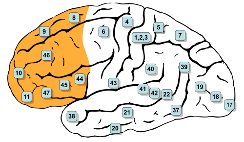
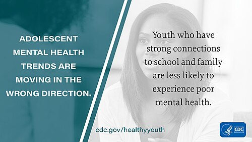

# SAÚDE MENTAL DO ADOLESCENTE

Para entender a saúde mental do adolescente, você precisa primeiro desconstruir a ideia de que o adolescente é apenas um "adulto em miniatura" ou uma "criança grande". Na prova de residência, a banca quer saber se você compreende as bases biológicas e psicossociais que justificam o comportamento desse paciente. Se você entender o porquê da impulsividade ou o porquê do sigilo médico, você não precisará decorar tabelas infinitas.

## O Cérebro em Metamorfose: A Neurobiologia da Adolescência

O conceito fundamental aqui é a imaturidade cerebral. Muitas questões de prova abordam o desenvolvimento do sistema nervoso central, e o erro clássico é achar que o cérebro termina de crescer na infância. Na verdade, ele passa por uma reorganização maciça até os 24 ou 25 anos.

O fenômeno principal é a poda sináptica (pruning) e a mielinização, que ocorrem de trás para frente. O lobo occipital amadurece primeiro, enquanto o córtex pré-frontal é o último da fila. A imagem a seguir ilustra exatamente essa região — destacada em laranja — que é a última a completar sua maturação:

*Figura 1 - Visão lateral do hemisfério cerebral esquerdo com o córtex pré-frontal destacado em laranja (áreas de Brodmann 8-11, 44-47). Esta é a região responsável pelo julgamento, controle de impulsos e planejamento — e a última a amadurecer completamente, por volta dos 24-25 anos. Adaptado de Gray's Anatomy. Fonte: Henry Vandyke Carter / Tkgd2007, Domínio Público | Wikimedia Commons*

### O Descompasso entre Emoção e Controle

Por que o adolescente é impulsivo e busca riscos? Porque existe um hiato temporal entre o amadurecimento do sistema límbico (centro das emoções e recompensas) e do córtex pré-frontal (centro do julgamento, controle de impulsos e planejamento).

Imagine um carro com um motor potente (sistema límbico), mas com freios que ainda estão sendo instalados (córtex pré-frontal). O adolescente sente tudo com muita intensidade, mas tem dificuldade biológica em avaliar consequências a longo prazo. É por isso que, na prática clínica e nas questões, falamos em vivência temporal singular: o foco é no presente e no futuro imediato. O "amanhã" parece uma eternidade abstrata para eles.

Como o Dr. Will costuma enfatizar em suas discussões no MedEvo, esse descompasso neurobiológico é o que fundamenta a vulnerabilidade ao uso de substâncias e aos comportamentos de risco. Não é "falta de educação", é uma janela de desenvolvimento crítica.

## Aspectos Psicossociais: A Síndrome do Adolescente Normal

A banca pode tentar te confundir chamando comportamentos típicos de patológicos. Existe o que chamamos de Síndrome do Adolescente Normal, um conceito que descreve flutuações de humor, necessidade de isolamento, questionamento de autoridade e a busca por uma identidade própria.

### Marcos Cognitivos e Comportamentais

- Fábula Pessoal: O adolescente acredita que é especial, único e que nada de ruim vai acontecer com ele. "Eu posso dirigir rápido porque eu sou bom nisso, o acidente só acontece com os outros". Isso explica a baixa percepção de risco.

- Egocentrismo Adolescente: A sensação de que todos estão olhando para ele (a "audiência imaginária"). Um erro comum em provas é confundir isso com narcisismo patológico.

- Masturbação: É um comportamento sexual normal, esperado e reflexo do desenvolvimento puberal. Nunca deve ser tratado como problema de saúde mental em provas, a menos que seja compulsivo e gere prejuízo funcional grave.

- Participação em Grupos: O grupo de pares substitui temporariamente a família como referência. A participação em grupos culturais ou esportivos é um dos maiores fatores protetores para a saúde mental global.

A campanha do CDC ilustrada abaixo sintetiza a preocupação global com a saúde do adolescente em ambiente escolar — um dos principais cenários de detecção precoce de transtornos mentais:

*Figura 2 - Campanha do CDC sobre saúde e bem-estar do adolescente em ambiente escolar: a escola é um espaço privilegiado para identificação precoce de problemas de saúde mental e promoção de fatores de proteção. Fonte: CDC, Domínio Público | Wikimedia Commons*

## A Consulta com o Adolescente: Ética, Sigilo e Técnica

Este é, sem dúvida, o tópico mais cobrado. Se você errar a conduta sobre sigilo, você perde a questão e, na vida real, perde a confiança do paciente.

### A Estrutura da Consulta

A recomendação da Sociedade Brasileira de Pediatria (SBP) é clara: a consulta deve ter um momento com os pais, um momento a sós com o adolescente e um momento final de síntese.

Por que o momento a sós é inegociável? Porque é nele que você fará a triagem de risco real: uso de substâncias, atividade sexual, ideação suicida e abuso de eletrônicos. O adolescente dificilmente falará sobre o uso de maconha na frente da mãe.

### O Sigilo Médico e suas Fronteiras

O sigilo médico na adolescência não é um "favor" que o médico faz, é um direito garantido pelo Código de Ética Médica e pelo Estatuto da Criança e do Adolescente (ECA).

Regra de ouro para a prova: O adolescente tem direito ao sigilo e à confidencialidade, desde que tenha capacidade de discernimento. Isso vale mesmo que os pais estejam pagando a consulta.

No entanto, o sigilo NÃO é absoluto. Ele deve ser quebrado em situações de risco iminente à vida do paciente ou de terceiros.

**Tabela 1: Manejo do Sigilo na Consulta do Adolescente**

| Situação | Conduta em relação ao Sigilo | Justificativa |
| --- | --- | --- |
| Início de atividade sexual | Manter sigilo | Direito à autonomia e privacidade. |
| Uso experimental de álcool/tabaco | Manter sigilo (orientar riscos) | Focar na aliança terapêutica e redução de danos. |
| Ideação suicida estruturada | QUEBRA OBRIGATÓRIA | Risco iminente à vida (dever de proteção). |
| Abuso sexual sofrido | QUEBRA OBRIGATÓRIA | Crime e risco à integridade física/mental. |
| Gravidez | Manter sigilo (estimular contar) | A menos que haja risco de vida ou o paciente seja incapaz. |

Cuidado: A alternativa da prova vai dizer que você deve contar aos pais sobre a pílula anticoncepcional porque eles são os responsáveis legais. Isso está errado. Se o adolescente tem discernimento, o sigilo é mantido.

## Transtornos Mentais Comuns na Adolescência

### Depressão e Ansiedade

A depressão no adolescente muitas vezes não se apresenta como tristeza profunda, mas como irritabilidade e instabilidade.

Sinais de alerta que as bancas adoram:

- Queda súbita no rendimento escolar.

- Desânimo persistente com abandono de atividades que antes eram prazerosas (anedonia).

- Mudança no padrão de sono e apetite.

- Descaso com a higiene pessoal (sinal clássico de gravidade).

Diferente do adulto, o diagnóstico diferencial deve sempre incluir o uso de substâncias e as crises normativas da adolescência. Se o prejuízo é funcional e persistente, pensamos em transtorno.

### Automutilação e Risco Suicida

A automutilação (cortes, queimaduras) tem crescido assustadoramente. O erro clássico de prova é achar que toda automutilação é uma tentativa de suicídio. Na maioria das vezes, é uma estratégia (disfuncional) de regulação emocional para aliviar uma dor psíquica insuportável.

No entanto, a automutilação é um dos maiores fatores de risco para o suicídio futuro. A conduta diante de um adolescente que se corta é:

- Acolhimento sem julgamento.

- Avaliação detalhada do risco suicida.

- Investigação de comorbidades (depressão, borderline).

- Não internar rotineiramente (a internação é reservada para risco iminente de vida).

Lembre-se: No Brasil, o homicídio é a principal causa de óbito em adolescentes, mas o suicídio ocupa posições alarmantes logo em seguida, especialmente em grandes centros urbanos.

## Uso de Substâncias Psicoativas

O uso de drogas na adolescência é particularmente perigoso porque interfere na maturação cerebral que discutimos no início.

### Álcool e Maconha

O álcool é a droga mais consumida. Qualquer consumo em menores de 18 anos é considerado comportamento de risco.

Sobre a maconha, a ciência (e as provas) são enfáticas: o uso na adolescência aumenta significativamente o risco de desenvolvimento de Esquizofrenia em indivíduos vulneráveis. Isso ocorre porque o THC interfere na poda sináptica e na sinalização dopaminérgica.

### Sinais de Alerta para Abuso de Drogas

As questões costumam apresentar um caso clínico de um "bom aluno" que mudou de comportamento. Fique atento a este conjunto de sinais:

- Mudança súbita de grupo de amigos.

- Irritabilidade e oscilações bruscas de humor.

- Queda no rendimento escolar.

- Desleixo com a aparência e higiene.

- Alterações no padrão de sono (trocar o dia pela noite).

**Tabela 2: Impacto das Substâncias no Desenvolvimento**

| Substância | Principal Risco no Adolescente | Nota de Prova |
| --- | --- | --- |
| Álcool | Danos ao hipocampo (memória) e acidentes. | Droga mais usada e porta de entrada. |
| Maconha | Risco de surto psicótico e esquizofrenia. | Prejudica a atenção e funções executivas. |
| Tabaco | Dependência rápida e dano pulmonar. | Ambiente livre de tabaco em casa protege o jovem. |
| Inalantes | Morte súbita e dano neurológico extenso. | Comum em populações de maior vulnerabilidade. |

## Saúde Digital: O Desafio das Telas

Este é um tema "quente" e muito atual nas provas. A exposição excessiva a telas (smartphones, tablets, jogos) está diretamente ligada a distúrbios do sono, ansiedade e sedentarismo.

### O Impacto da Luz Azul

A luz azul emitida pelas telas inibe a produção de melatonina pela glândula pineal. Sem melatonina, o adolescente não atinge o sono profundo necessário para a consolidação da memória e regulação emocional.

Recomendações da SBP que você deve memorizar:

- Tempo de tela para 11-18 anos: Limitar a 2-3 horas por dia (nunca 6 horas ou mais).

- Higiene do sono: Suspender o uso de telas 1 a 2 horas antes de dormir.

- Proibir o uso de telas durante as refeições.

A Nomofobia (medo de ficar sem o celular) é um conceito que pode aparecer como sintoma de dependência digital. O tratamento é a reeducação e, em casos graves, abordagem psicoterápica.

## Fatores de Risco e Proteção

A saúde mental não acontece no vácuo. Ela é determinada pelo contexto.

### Determinantes Sociais

O status socioeconômico familiar é apontado como o fator mais significativo na saúde mental de adolescentes. A pobreza, a violência urbana e a falta de acesso a lazer são fatores de risco potentes.

Por outro lado, temos os fatores protetores:

- Bom vínculo familiar (não precisa ser uma família "perfeita", mas presente).

- Ambiente familiar livre de tabaco (reduz o risco de o jovem fumar, mesmo que os pais fumem fora).

- Espiritualidade ou participação em grupos sociais.

- Sucesso escolar e esportivo.

### O Ciclo de Vida Familiar

A adolescência de um filho coincide frequentemente com a crise de meia-idade dos pais e a fragilidade dos avós. É o que chamamos de "geração sanduíche". As provas cobram a percepção de que a família precisa renegociar papéis. Os pais precisam deixar de ser "cuidadores de crianças" para se tornarem "consultores de adolescentes", permitindo a autonomia progressiva.

## Diagnóstico Diferencial e Manejo Clínico

Ao avaliar um adolescente com queixa de saúde mental, o exame físico é essencial. Não ignore a antropometria. O cálculo do IMC e a plotagem nas curvas da OMS são obrigatórios em toda consulta.

### Diagnóstico Diferencial

Nem tudo que parece psiquiátrico é.

- Acne Vulgar: Pode causar isolamento social e depressão secundária pela baixa autoestima.

- Ginecomastia Fisiológica: Comum no início da puberdade (Tanner G2-G3), pode gerar ansiedade extrema sobre a imagem corporal.

- Distúrbios da Tireoide: Hipotireoidismo pode mimetizar depressão.

- Covid Longa: Em adolescentes, pode se manifestar como fadiga crônica, "névoa mental" e irritabilidade. O manejo deve ser multidisciplinar.

**Tabela 3: Diagnóstico Diferencial de Alterações Comportamentais**

| Sintoma | Causa Psiquiátrica | Causa Orgânica/Outras |
| --- | --- | --- |
| Irritabilidade | Depressão, Transtorno Bipolar | Hipertireoidismo, Uso de estimulantes |
| Sonolência Diurna | Depressão | Apneia do sono, Uso de telas à noite |
| Queda Escolar | TDAH, Transtorno de Aprendizagem | Deficiência auditiva/visual, Abuso de drogas |
| Perda de Peso | Anorexia Nervosa | Diabetes Mellitus tipo 1, Doença Celíaca |

## Manejo Terapêutico: Onde Começar?

A primeira escolha no tratamento de transtornos mentais leves a moderados na adolescência é a psicoterapia (especialmente a Terapia Cognitivo-Comportamental) e intervenções ambientais (ajuste de rotina, sono, atividade física).

O tratamento farmacológico deve ser reservado para casos moderados a graves ou quando não há resposta à terapia. Os Inibidores Seletivos de Recaptação de Serotonina (ISRS), como a Fluoxetina, são frequentemente a primeira escolha para depressão e ansiedade nessa faixa etária, mas sempre com monitoramento rigoroso do risco de ativação e ideação suicida no início do tratamento.

A promoção da saúde mental deve ser integrada ao cuidado primário. O médico deve usar a Caderneta de Saúde do Adolescente como ferramenta de acompanhamento e diálogo.

## O Papel do Conselho Tutelar

Muitas questões de ética e pediatria envolvem o Conselho Tutelar. Lembre-se:

- É um órgão municipal, não judiciário.

- Os membros são eleitos pela comunidade.

- Sua função é zelar pelo cumprimento dos direitos da criança e do adolescente.

- O médico deve acionar o Conselho Tutelar em casos de suspeita de maus-tratos, negligência grave ou quando os direitos do menor estão sendo violados e a família não consegue protegê-lo.

## Pontos-Chave para Prova

- Sigilo Médico: É a regra. Só se quebra em risco de vida iminente ou violência/abuso.

- Imaturidade Cerebral: O córtex pré-frontal (freio) amadurece depois do sistema límbico (motor).

- Depressão na Adolescência: Frequentemente se manifesta como irritabilidade e queda no rendimento escolar.

- Tempo de Tela: Recomendação SBP é de 2 a 3 horas/dia para adolescentes de 11 a 18 anos.

- Higiene do Sono: Suspender telas 1 a 2 horas antes de dormir para evitar bloqueio da melatonina pela luz azul.

- Maconha: Uso na adolescência é fator de risco estabelecido para o desenvolvimento de Esquizofrenia.

- Principal Causa de Morte: No Brasil, é o homicídio (causas externas).

- Fábula Pessoal: Crença na invulnerabilidade, justificando comportamentos de risco.

- Automutilação: É sinal de sofrimento psíquico grave e fator de risco para suicídio, mas nem sempre é tentativa de suicídio.

- Consulta: Deve ter momento a sós com o adolescente para garantir a triagem de riscos.

- Masturbação: Comportamento sexual normal e esperado.

- Fator Protetor: Participação em grupos e bom suporte familiar são os principais.

- Status Socioeconômico: É o determinante social mais forte para a saúde mental.

- Quebra de Sigilo: Se houver ideação suicida estruturada, você DEVE comunicar os responsáveis, mesmo contra a vontade do paciente.

- Acne e Ginecomastia: Problemas físicos comuns que impactam severamente a saúde mental e imagem corporal.

- Covid Longa: Deve ser considerada em casos de fadiga e alteração cognitiva persistente pós-infecção.

- Conselho Tutelar: Órgão administrativo (não judicial) para proteção de direitos.

- Álcool: Droga mais consumida; qualquer uso < 18 anos é considerado risco. 🧠

 Cópia offline para consulta pessoal.
 Fonte original:
 [https://www.medevo.com.br/material-apoio/ler/2827fa46-6f65-4473-b6d8-bae37325b6d9](https://www.medevo.com.br/material-apoio/ler/2827fa46-6f65-4473-b6d8-bae37325b6d9)
