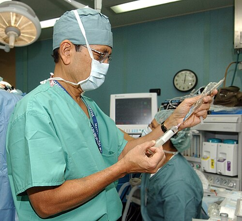
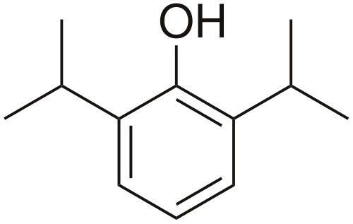

# SEDAÇÃO E ANALGESIA

Para entender sedação e analgesia na Unidade de Terapia Intensiva (UTI), você precisa primeiro mudar sua mentalidade de "apagar o paciente" para "conforto e segurança". Antigamente, o paciente ideal de UTI era aquele imóvel, profundamente sedado. Hoje, sabemos que isso aumenta a mortalidade, o tempo de ventilação mecânica e as sequelas neuropsiquiátricas.

O foco atual, segundo as diretrizes da AMIB (Associação de Medicina Intensiva Brasileira), é a estratégia **Analgesia-First** (ou e-CASH: *early Comfort using Analgesia, minimal Sedation and Maximal Humane care*). Ou seja, primeiro tratamos a dor, depois avaliamos a necessidade de sedação, sempre buscando o nível mais leve possível.

*Figura 1 - Anestesiologista em procedimento: a analgesia é a base do tratamento do paciente crítico, e deve ser sempre abordada antes da sedação. Escalas como BPS e CPOT guiam a titulação dos analgésicos. Fonte: US Navy, Domínio Público | Wikimedia Commons*

## A Base de Tudo: Analgesia

Muitos alunos erram em provas por acharem que o paciente agitado precisa de sedativo. Na verdade, a causa mais comum de agitação na UTI é a dor. Se você seda um paciente com dor sem analgésico, você apenas "amordaça" o sistema nervoso dele, mas o estresse metabólico e o sofrimento continuam lá.

### Avaliação da Dor

Se o paciente consegue se comunicar, o padrão-ouro é a Escala Visual Analógica (EVA) ou a Escala Numérica (0 a 10). Mas e o paciente intubado? Aqui as bancas cobram as escalas comportamentais:

- **BPS (Behavioral Pain Scale):** Avalia expressão facial, movimentos de membros superiores e complacência com a ventilação mecânica. Varia de 3 a 12. Um escore > 5 indica dor significativa.

- **CPOT (Critical-Care Pain Observation Tool):** Semelhante à BPS, mas inclui a tensão muscular.

### Farmacologia dos Analgésicos

Os opioides são a base do tratamento na UTI. O **Fentanil** é o mais utilizado devido ao seu início de ação rápido e meia-vida curta em infusões breves. No entanto, cuidado: em infusão contínua prolongada, ele se acumula no tecido adiposo, prolongando o despertar.

A **Cetamina** (ou ketamina) merece atenção especial. Ela promove uma "anestesia dissociativa" e tem um efeito analgésico potente em doses subanestésicas. Diferente dos opioides, ela não causa depressão respiratória e mantém o drive ventilatório, sendo excelente para pacientes com broncoespasmo ou choque, pois estimula a liberação de catecolaminas.

*Figura 2 - A sedação em UTI deve seguir o princípio "menos é mais": protocolos de despertar diário e escalas validadas (RASS, BPS) reduzem tempo de ventilação mecânica e incidência de delirium. Fonte: Domínio Público | Wikimedia Commons*

## Sedação: Menos é Mais

A sedação deve ser vista como um "mal necessário" para permitir a ventilação mecânica ou procedimentos invasivos. O objetivo é manter o paciente calmo, cooperativo e confortável.

### Escalas de Sedação (Obrigatório Memorizar)

Você não pode ir para uma prova de residência sem dominar a **Escala RASS (Richmond Agitation-Sedation Scale)**. Ela é superior à antiga Escala de Ramsay porque avalia tanto a agitação quanto a sedação de forma mais detalhada.

| Escore RASS | Descrição | Comportamento |
| --- | --- | --- |
| +4 | Combativo | Ansioso, violento, perigo imediato à equipe |
| +3 | Muito Agitado | Tenta remover tubos ou cateteres |
| +2 | Agitado | Movimentos frequentes, briga com o ventilador |
| +1 | Ansioso | Inquieto, mas sem movimentos vigorosos |
| 0 | Alerta e Calmo | Estado ideal |
| -1 | Sonolento | Acorda ao comando verbal (contato visual > 10s) |
| -2 | Sedação Leve | Acorda ao comando verbal (contato visual < 10s) |
| -3 | Sedação Moderada | Movimento ou abertura ocular ao som, SEM contato visual |
| -4 | Sedação Profunda | Sem resposta ao som, mas responde ao estímulo físico |
| -5 | Sedação Muito Profunda | Sem resposta ao estímulo físico |

**Dica do Dr. Will:** A banca vai tentar te confundir entre RASS -3 e -4. Lembre-se: no -3 o paciente ainda abre o olho ou se mexe com a sua voz. No -4, você precisa "sacudir" ou causar dor para ele reagir.

A **Escala de Ramsay** ainda aparece em questões mais antigas ou de bancas menos atualizadas:

- Ramsay 1: Ansioso, agitado.

- Ramsay 2: Cooperativo, orientado, tranquilo.

- Ramsay 3: Responde apenas a comandos.

- Ramsay 4: Dormindo, resposta rápida ao estímulo sonoro.

- Ramsay 5: Dormindo, resposta lenta ao estímulo.

- Ramsay 6: Sem resposta.

### Principais Agentes Sedativos

#### 1. Midazolam (Benzodiazepínico)

O "queridinho" de antigamente, hoje é evitado para sedação contínua. Por que? Ele é um fator de risco independente para o desenvolvimento de **Delirium** e prolonga o tempo de desmame ventilatório.

- **Indicação atual:** Crises convulsivas, sedação procedimental curta ou quando há necessidade de sedação profunda (ex: bloqueio neuromuscular).

- **Efeito adverso:** Depressão respiratória e hipotensão (especialmente em idosos e hipovolêmicos).

#### 2. Propofol

Um agente hipnótico de ação ultrarrápida. É excelente para o "desmame" da ventilação, pois você desliga a bomba e em 10-15 minutos o paciente está acordando.

- **Cuidado:** Causa hipotensão importante por vasodilatação sistêmica.

- **Síndrome da Infusão do Propofol (PRIS):** Ocorre em doses altas (> 5mg/kg/h) por mais de 48h. Cursa com acidose metabólica, rabdomiólise, hipertrigliceridemia e insuficiência renal. É uma emergência médica.

#### 3. Dexmedetomidina (Precedex)

Este é o tema que mais cai em provas recentes. É um agonista alfa-2 adrenérgico altamente seletivo. Diferente dos outros, ela promove uma "sedação consciente": o paciente parece dormindo, mas se você chamá-lo, ele acorda, interage e depois volta a dormir.

**Mecanismo de Ação e Receptores:**
A dexmedetomidina atua em três subtipos de receptores alfa-2:

- **Alfa-2A:** Responsável pela sedação, analgesia e proteção celular (localizado principalmente no *locus coeruleus*).

- **Alfa-2B:** Promove vasoconstrição periférica (pode causar hipertensão transitória no início da infusão) e efeitos antitremor.

- **Alfa-2C:** Modulação do processamento sensorial e neurotransmissão.

**Vantagens:** Não causa depressão respiratória (pode ser usada na VMNI ou pré-extubação) e reduz a incidência de delirium.
**Efeitos Colaterais Clássicos:** Bradicardia e hipotensão. Isso ocorre porque ela reduz o *outflow* simpático central. Se a questão fala de um paciente já bradicárdico, a dexmedetomidina é contraindicada.

## Indução na Sequência Rápida de Intubação (SRI)

Na emergência ou UTI, a escolha do sedativo para intubar o paciente em choque é crítica. Errar aqui pode levar à parada cardiorrespiratória pós-intubação.

### O Etomidato

É o padrão-ouro para o paciente instável. Por que? Porque ele tem **mínima repercussão hemodinâmica**. Ele não mexe na pressão arterial nem na frequência cardíaca de forma significativa.

- **Início de ação:** 15 a 45 segundos.

- **Pegadinha de prova:** O etomidato causa supressão adrenal transitória (inibe a enzima 11-beta-hidroxilase). Apesar disso, em dose única para intubação, as diretrizes ainda o recomendam pela segurança cardiovascular.

### A Cetamina

Também é excelente para o choque (especialmente choque séptico) e para o paciente asmático (broncodilatador). Como ela libera catecolaminas, tende a subir a pressão e a frequência cardíaca.

- **Evitar em:** Cardiopatas graves com reserva funcional esgotada ou em vigência de infarto agudo do miocárdio, onde o aumento do consumo de oxigênio pelo miocárdio é prejudicial.

| Droga | Indicação Principal | Principal Efeito Colateral |
| --- | --- | --- |
| **Etomidato** | Instabilidade Hemodinâmica | Supressão Adrenal |
| **Cetamina** | Choque Séptico / Broncoespasmo | Alucinações / Hipertensão |
| **Midazolam** | Status Epilepticus | Delirium / Hipotensão |
| **Propofol** | Sedação Rápida / Neuroproteção | Hipotensão / PRIS |

## Delirium na UTI

O delirium é uma disfunção cerebral aguda caracterizada por flutuação do estado mental, desatenção e pensamento desorganizado. No MedEvo, sempre reforçamos: delirium não é apenas agitação (delirium hiperativo). O tipo mais comum e perigoso é o **hipoativo** (o paciente "quietinho" que passa despercebido).

### Diagnóstico

A ferramenta mais utilizada é o **CAM-ICU** (Confusion Assessment Method for the ICU). Para o diagnóstico, o paciente deve apresentar:

- Início agudo ou curso flutuante; **E**

- Desatenção; **E**

- Pensamento desorganizado **OU** Alteração do nível de consciência (RASS diferente de 0).

### Manejo do Delirium

O tratamento **não farmacológico** é a primeira linha e o mais eficaz:

- Otimização do ambiente: luz acesa de dia, apagada à noite (ciclo sono-vigília).

- Redução de ruídos.

- Presença de acompanhantes e objetos familiares.

- Mobilização precoce.

- Uso de óculos e aparelhos auditivos se o paciente já os utilizava.

**Tratamento Farmacológico:**
O **Haloperidol** é o antipsicótico clássico. Atenção: ele é indicado para o controle da agitação psicomotora grave que coloca o paciente em risco. Ele **não** previne o delirium e não deve ser usado de rotina no delirium hipoativo.

- **Efeito colateral crítico:** Prolongamento do intervalo QT (risco de *Torsades de Pointes*). Sempre cheque o ECG antes de prescrever.

## Complicações do Paciente Crítico

A sedação prolongada e a própria gravidade da doença levam a síndromes que as bancas adoram cobrar como "diagnóstico diferencial" de fraqueza.

### Neuromiopatia do Paciente Crítico (NMPC)

É a causa mais comum de fraqueza adquirida na UTI.

- **Fatores de Risco:** Sepse, Síndrome de Disfunção de Múltiplos Órgãos (SDMO), hiperglicemia e uso de corticoides ou bloqueadores neuromusculares.

- **Quadro Clínico:** Fraqueza muscular simétrica, predominantemente proximal, que dificulta o desmame da ventilação mecânica.

### Síndrome Pós-Tratamento Intensivo (PITS)

Refere-se ao declínio na saúde física, cognitiva e mental que persiste após a alta da UTI.

- **Saúde Mental:** Depressão, ansiedade e Transtorno de Estresse Pós-Traumático (TEPT).

- **Cognição:** Déficits de memória e atenção semelhantes ao Alzheimer leve.

- **Físico:** Fraqueza muscular persistente.

### Hiperatividade Simpática Paroxística (HSP)

Comum em pacientes com lesão cerebral grave (TCE, anóxia). É uma "tempestade autonômica".

- **Sintomas:** Taquicardia, hipertensão, taquipneia, sudorese e postura extensora.

- **Tratamento:** Não se usa haloperidol aqui! O tratamento envolve **Dexmedetomidina**, Baclofeno, Propranolol ou Midazolam para abortar as crises.

## Situações Especiais e Bioética

### Ventilação Mecânica Não Invasiva (VMNI)

A VMNI é a primeira linha na DPOC exacerbada com acidose respiratória (pH < 7.35, pCO2 > 45) e no edema agudo de pulmão.

- **Sedação na VMNI:** Se o paciente estiver muito ansioso e "brigando" com a máscara, a droga de escolha é a **Dexmedetomidina**, pois ela não deprime o drive respiratório. Usar midazolam aqui é um erro grave que frequentemente leva à intubação desnecessária.

### Humanização e Pediatria

Na UTI pediátrica, a presença dos pais não é apenas um "desejo", é um direito e parte do tratamento para reduzir o trauma psicológico. A autonomia do paciente pediátrico deve ser respeitada conforme sua capacidade de compreensão (assentimento).

### Ortotanásia

Diferente da eutanásia (que é crime no Brasil), a ortotanásia é a suspensão de tratamentos fúteis que apenas prolongam o processo de morrer em pacientes terminais, garantindo o alívio da dor e do sofrimento (cuidados paliativos). Em provas, isso aparece ligado à autonomia do paciente e à dignidade humana.

## Monitoramento Neurológico e Sedação Moderada

Para procedimentos fora da UTI (como uma endoscopia ou biópsia), utilizamos a **Sedação Moderada** (antigamente chamada de sedação consciente).

- **Definição:** O paciente responde a comandos verbais ou estímulo tátil leve. A via aérea é mantida espontaneamente e a função cardiovascular costuma ser preservada.

- **Monitoramento:** Oximetria de pulso é obrigatória, mas lembre-se: a oximetria demora a cair se o paciente parar de respirar (especialmente se estiver usando cateter de O2). O monitor mais precoce para detectar apneia é a **Capnografia**.

## Tabelas Comparativas para Revisão Rápida

### Tabela 1: Fatores de Risco para Neuromiopatia (NMPC)

| Categoria | Fatores |
| --- | --- |
| **Doença de Base** | Sepse (principal), SDMO, Pancreatite grave |
| **Metabólico** | Hiperglicemia sustentada (> 180 mg/dL) |
| **Drogas** | Corticoides em altas doses, Bloqueadores Neuromusculares |
| **Imobilidade** | Tempo prolongado de ventilação mecânica |

### Tabela 2: Diagnóstico Diferencial de Agitação na UTI

| Suspeita | Pista Clínica | Conduta Inicial |
| --- | --- | --- |
| **Dor** | Taquicardia, fácies de dor, BPS alto | Analgesia (Opioide) |
| **Delirium** | Flutuação, CAM-ICU positivo | Medidas não farmacológicas |
| **Hipóxia** | Queda na saturação, cianose | Otimizar oxigenação |
| **Abstinência** | Etilista crônico, tremores, midríase | Benzodiazepínicos |

### Tabela 3: Subtipos de Receptores Alfa-2 da Dexmedetomidina

| Receptor | Localização Principal | Efeito Clínico |
| --- | --- | --- |
| **Alfa-2A** | Locus Coeruleus (SNC) | Sedação e Analgesia |
| **Alfa-2B** | Vasos Periféricos | Vasoconstrição (Hipertensão inicial) |
| **Alfa-2C** | Medula Espinal / SNC | Modulação de neurotransmissores |

## Pontos-Chave para Prova

- **Etomidato** é a droga de escolha na indução de pacientes com instabilidade hemodinâmica (mínimo efeito cardiovascular).

- **Dexmedetomidina** não causa depressão respiratória; seus principais efeitos colaterais são bradicardia e hipotensão.

- **RASS -3** significa que o paciente abre os olhos ao chamado, mas não consegue manter contato visual.

- **Ramsay 5** é o paciente que dorme e tem resposta lenta ao estímulo doloroso ou auditivo forte.

- **Delirium Hipoativo** é o subtipo mais comum na UTI e o mais subdiagnosticado.

- **Haloperidol** é contraindicado se o intervalo QT estiver prolongado no ECG.

- **Analgesia-First:** Sempre trate a dor antes de iniciar ou aumentar a sedação.

- **Fatores de risco para NMPC:** Sepse, SDMO e Hiperglicemia são os "queridinhos" das bancas.

- **PITS (Síndrome Pós-UTI):** Envolve sequelas físicas, cognitivas e mentais (Depressão, TEPT).

- **Hiperatividade Simpática Paroxística (HSP):** Tratar com dexmedetomidina ou benzodiazepínicos; evitar haloperidol.

- **VMNI na DPOC:** Indicada se pH < 7.35 e pCO2 > 45. Se precisar sedar para tolerar a máscara, use dexmedetomidina.

- **Contraindicação Absoluta ao Etomidato:** Não há uma absoluta para dose única, mas evite infusão contínua devido à supressão adrenal.

- **Cetamina na IOT:** Excelente para choque séptico e asma; evitar em coronariopatas graves.

- **Propofol:** Causa hipotensão por vasodilatação. Cuidado com a PRIS (acidose, rabdomiólise) em doses altas e prolongadas.

- **Medidas não farmacológicas:** São mais eficazes que remédios para prevenir e tratar delirium (ciclo sono-vigília, luz, acompanhante). 🧠

 Cópia offline para consulta pessoal.
 Fonte original:
 [https://www.medevo.com.br/material-apoio/ler/595088da-7faa-4bfc-908b-70eafca61e40](https://www.medevo.com.br/material-apoio/ler/595088da-7faa-4bfc-908b-70eafca61e40)
