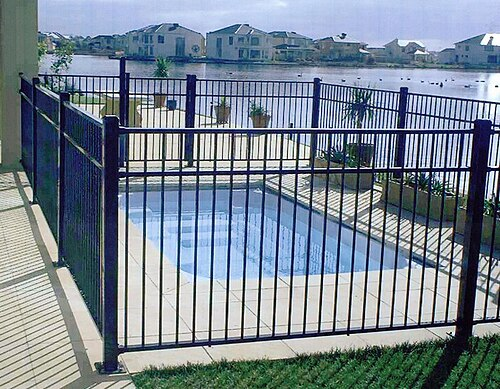

# SEGURANÇA DA CRIANÇA E PREVENÇÃO DE ACIDENTES

Para entender segurança infantil, você precisa primeiro mudar o vocabulário. Em provas de residência e na vida acadêmica, paramos de usar o termo acidente para adotar lesões não intencionais. Por que essa mudança? Porque acidente passa a ideia de algo inevitável, obra do destino. Lesão não intencional reforça que o evento poderia ter sido previsto e evitado.

Nas estatísticas brasileiras, as causas externas (que englobam os acidentes e as violências) são a principal causa de morte em crianças e adolescentes de 1 a 19 anos. Guarde esse marco: antes de 1 ano, as causas perinatais e malformações dominam. Passou do primeiro aniversário, o trauma é o grande vilão.

## Epidemiologia e Determinantes de Saúde

Os acidentes não ocorrem ao acaso. Existe um padrão epidemiológico claro que as bancas adoram explorar. Meninos se acidentam mais que meninas em praticamente todas as faixas etárias. Por que? Por questões socioculturais de maior estímulo à exposição ao risco e comportamentos mais impulsivos.

Outro ponto fundamental é a distinção entre prevenção ativa e passiva.
A prevenção ativa depende de uma mudança de comportamento contínua do cuidador (exemplo: sempre verificar a temperatura da água do banho).
A prevenção passiva é aquela que protege independentemente da ação humana imediata (exemplo: airbags, embalagens de medicamentos com tampas de segurança, grades em janelas).
Dica do MedEvo: As medidas de prevenção passiva são muito mais eficazes em saúde pública, pois não falham por cansaço ou esquecimento do responsável.

*Figura 1 - Dispositivo de retenção veicular (DRV) para lactente: o bebê-conforto deve ser instalado voltado para trás até pelo menos 1 ano de idade. O uso correto do DRV reduz em até 71% a mortalidade em acidentes de trânsito. Fonte: BruceBlaus, CC BY-SA 4.0 | Wikimedia Commons*

## Segurança no Trânsito: O Dispositivo de Retenção Veicular (DRV)

Este é, sem dúvida, o tópico mais cobrado. Você precisa dominar a Resolução 819/2021 do CONTRAN, que atualizou as regras de transporte. O critério para mudar de dispositivo não é apenas a idade, mas também o peso e a altura.

### A Lógica do Transporte Seguro

Por que o bebê viaja de costas? A cabeça de um lactente representa cerca de 25% do seu peso corporal, e a musculatura cervical é frágil. Em uma colisão frontal, se o bebê estiver de frente, a cabeça é chicoteada para frente, podendo causar luxação atlanto-axial e morte instantânea. De costas, o impacto é distribuído por todo o encosto do dispositivo, protegendo o eixo pescoço-medula.

Tabela 1: Dispositivos de Retenção por Faixa Etária e Peso

| Dispositivo | Faixa Etária Sugerida | Critério de Instalação |
| --- | --- | --- |
| Bebê-conforto | 0 a 1 ano | No banco traseiro, voltado para trás |
| Cadeirinha | 1 a 4 anos | No banco traseiro, voltada para frente |
| Assento de Elevação (Booster) | 4 a 10 anos (ou até 1,45m) | No banco traseiro, com cinto de 3 pontos |
| Cinto de Segurança | > 10 anos ou > 1,45m | Banco traseiro (preferencial) ou dianteiro |

Atenção ao detalhe: Se a criança tem 10 anos, mas ainda não atingiu 1,45m, ela deve continuar usando o assento de elevação. Por que? Porque o cinto de três pontos do carro foi projetado para adultos. Sem o assento, o cinto passa no pescoço da criança (risco de asfixia ou corte) e no abdome (risco de lesão de vísceras sólidas em vez de apoiar na pelve).

Exemplo clínico: João tem 14 meses e pesa 11kg. Qual a orientação? Segundo a legislação atual, ele já poderia usar a cadeirinha voltada para frente. No entanto, a recomendação da Sociedade Brasileira de Pediatria (SBP) é manter o maior tempo possível voltado para trás, idealmente até os 2 anos ou até atingir o limite de peso do fabricante para essa posição. Em prova, siga a regra: < 1 ano ou < 13kg é obrigatoriamente de costas.

*Figura 2 - Cerca de proteção ao redor de piscina: o afogamento é uma das principais causas de óbito em crianças de 1 a 4 anos. Barreiras físicas são medidas comprovadamente eficazes na prevenção. A orientação deve considerar a faixa etária e o desenvolvimento neuropsicomotor da criança: lactentes são mais vulneráveis a quedas e sufocação; pré-escolares a intoxicações e queimaduras. Fonte: Domínio Público | Wikimedia Commons*

## Prevenção de Acidentes por Faixa Etária e Desenvolvimento

O tipo de acidente acompanha o marco do desenvolvimento motor e cognitivo. Como diz o Dr. Will, a criança é um explorador sem noção de perigo.

### O Lactente (0 a 12 meses)

Nesta fase, os riscos principais são sufocação, quedas e queimaduras.
A Síndrome da Morte Súbita do Lactente (SMSL) é uma preocupação central. A recomendação padrão ouro é o decúbito dorsal (barriga para cima).
Erro comum de prova: Achar que o decúbito lateral é seguro. Não é. O bebê pode rolar para a posição ventral (barriga para baixo), que é o maior fator de risco para SMSL por causar reinalação de CO2 e obstrução de vias aéreas superiores.

Outras orientações para o sono seguro:

- Colchão firme e plano.

- Berço livre de objetos (almofadas, protetores de berço, bichos de pelúcia, cobertores soltos).

- Não compartilhar a cama (co-leito é fator de risco para sufocação acidental), mas manter o berço no quarto dos pais até os 6 meses é protetor.

- O uso de chupeta na hora de dormir parece ter um efeito protetor contra SMSL, embora possa interferir na amamentação se introduzida precocemente.

### O Pré-escolar (1 a 4 anos)

Aqui a mobilidade aumenta. A criança começa a andar e escalar.
O andador infantil é o inimigo número um do pediatra. As bancas cobram isso repetidamente. O andador não ajuda a andar; na verdade, ele atrasa o desenvolvimento motor pois a criança não precisa treinar o equilíbrio do tronco. Além disso, causa acidentes gravíssimos, como quedas de escadas e acesso a objetos altos (panelas, substâncias tóxicas).

Nesta idade, o afogamento se torna a principal causa de morte acidental. Lembre-se: uma criança pode se afogar em apenas 2,5 cm de água. Isso inclui baldes, vasos sanitários e banheiras. A supervisão deve ser a distância de um braço. Boias de braço dão uma falsa sensação de segurança e não substituem o colete salva-vidas ou a supervisão.

### O Escolar e o Adolescente

Para os maiores, os atropelamentos e acidentes com bicicletas/skates ganham relevância. O uso do capacete reduz o risco de traumatismo craniano em até 85%.
Na adolescência, as causas externas mudam de perfil: entram em cena os homicídios e suicídios, além dos acidentes de trânsito envolvendo álcool e drogas.

## Queimaduras: Manejo Imediato e Prevenção

A escaldadura (líquido quente) é o mecanismo mais comum em crianças pequenas. A cozinha é o lugar mais perigoso da casa.
Regra de ouro para a prova: O tratamento imediato de uma queimadura térmica é o resfriamento com água corrente em temperatura ambiente (não gelada) por 10 a 20 minutos.
Por que não usar gelo? O gelo causa vasoconstrição intensa e pode aprofundar a lesão tecidual por isquemia.
Por que não usar manteiga, pasta de dente ou pó de café? Essas substâncias contaminam a ferida, dificultam a avaliação médica e podem causar infecções.

Dica de segurança doméstica: Nunca aqueça mamadeiras no micro-ondas. O aquecimento é irregular, criando pontos de calor extremo (hot spots) que podem causar queimaduras graves na orofaringe do lactente, mesmo que a parte externa da mamadeira pareça morna.

## Intoxicações Exógenas

A maioria das intoxicações em crianças menores de 5 anos ocorre dentro de casa, com produtos de limpeza ou medicamentos.
As bancas gostam de testar se você sabe o que NÃO fazer.

- Nunca induzir o vômito (especialmente se for substância corrosiva ou hidrocarboneto, pelo risco de nova lesão esofágica ou aspiração pulmonar).

- Não oferecer leite ou água para neutralizar.

- Manter produtos em suas embalagens originais. O erro clássico é colocar desinfetante colorido em garrafa de refrigerante; a criança associa a cor e o recipiente a algo potável.

## Saúde Digital e Tempo de Tela

Este é um tema quente e atualizado pela SBP. O excesso de telas está ligado a atraso de linguagem, distúrbios do sono, obesidade e comportamento agressivo.

Tabela 2: Recomendações de Tempo de Tela (SBP)

| Idade | Recomendação de Tempo |
| --- | --- |
| Menores de 2 anos | Zero exposição (nem passiva) |
| 2 a 5 anos | Máximo 1 hora por dia, com supervisão |
| 6 a 10 anos | Máximo 1 a 2 horas por dia, com supervisão |
| 11 a 18 anos | Máximo 2 a 3 horas por dia; nunca virar a noite |

Além do tempo, a mediação parental é crucial. O pediatra deve orientar que telas não devem ser usadas durante as refeições e devem ser desligadas 1 a 2 horas antes de dormir para não prejudicar a produção de melatonina pela luz azul.

## Higiene e Cuidados com a Pele

A pele do recém-nascido tem um pH levemente ácido (cerca de 5.5), o que funciona como uma barreira bactericida natural.
O primeiro banho deve ser adiado por pelo menos 24 horas. Por que? Para garantir a estabilidade térmica do bebê e permitir que o vérnix caseoso seja absorvido, pois ele tem propriedades imunológicas e hidratantes.
No banho, deve-se usar sabonetes com pH neutro ou levemente ácido (syndets), evitando sabões alcalinos que destroem a barreira cutânea.

Quanto à proteção solar:

- Menores de 6 meses: Não devem usar filtro solar químico. A proteção deve ser mecânica (chapéus, roupas, sombra).

- 6 meses a 2 anos: Preferência por filtros físicos (barreira mineral), que têm menor absorção sistêmica.

- Maiores de 2 anos: Filtros químicos infantis estão liberados.

## Diagnóstico Diferencial: Acidente vs. Maus-tratos

Como professor, preciso te alertar para uma pegadinha de prova e de vida: a Síndrome do Bebê Sacudido (Shaken Baby Syndrome).
Muitas vezes, a história clínica de um acidente doméstico (ex: caiu do sofá) não condiz com a gravidade das lesões.
Sinais de alerta para maus-tratos:

- Hemorragia retiniana (quase patognomônico de sacudida).

- Hematoma subdural sem fratura de crânio evidente.

- Fraturas em diferentes estágios de consolidação.

- Lesões em áreas protegidas (dorso, nádegas, orelhas).

Lembre-se: no Brasil, a notificação de suspeita de maus-tratos ao Conselho Tutelar é obrigatória para o médico, não sendo necessária a prova cabal do fato.

## Prevenção de Aspiração de Corpo Estranho

Lactentes de 1 ano estão na fase oral e têm o reflexo de tosse e deglutição ainda em maturação.
Objetos pequenos (moedas, botões, baterias de disco) e alimentos como amendoim, pipoca e uvas inteiras são os principais vilões.
A bateria de disco é uma emergência médica absoluta se impactada no esôfago, pois pode causar necrose por liquefação e perfuração em poucas horas devido à corrente elétrica e liberação de substâncias químicas.

## O Papel da Puericultura na Prevenção

A consulta de puericultura é o momento de antecipar o risco. Se o bebê tem 4 meses e começou a rolar, você deve avisar os pais hoje que ele não pode mais ficar sozinho no trocador, mesmo que por um segundo.
A prevenção é baseada na antecipação dos marcos do desenvolvimento.
Se a criança tem 9 meses e está começando a se içar para ficar de pé, é hora de baixar o estrado do berço e colocar grades nas escadas.

## Pontos-Chave para Prova

- Principal causa de morte > 1 ano: Causas externas (acidentes e violências).

- Posição para dormir: Sempre supina (barriga para cima) para prevenir SMSL. Decúbito lateral é erro de prova.

- Andador infantil: Proibido pela SBP. Aumenta risco de trauma craniano e atrasa desenvolvimento motor.

- Transporte < 1 ano ou < 13kg: Bebê-conforto voltado para trás no banco traseiro.

- Transporte > 1,45m de altura: Pode usar o cinto de segurança de 3 pontos sem assento de elevação, independentemente de ter 10 anos ou não.

- Afogamento: Causa número 1 de morte acidental entre 1 e 4 anos. Ocorre em pouca água e de forma silenciosa.

- Queimadura imediata: Resfriar com água corrente por 10 a 20 minutos. Nunca usar gelo ou substâncias caseiras.

- Tempo de tela < 2 anos: Zero. Nenhuma exposição, nem mesmo passiva (TV ligada ao fundo).

- Intoxicação: Nunca induzir vômito em caso de ingestão de cáusticos ou derivados de petróleo.

- Bateria de disco no esôfago: Emergência endoscópica imediata pelo risco de perfuração rápida.

- Primeiro banho: Aguardar 24 horas para estabilidade térmica e preservação do vérnix.

- Filtro solar: Apenas após os 6 meses de idade.

- ECA: Criança é até 12 anos incompletos; adolescente é de 12 a 18 anos.

- Mortalidade na adolescência: Liderada por causas externas (violência e trânsito).

- Prevenção passiva: Mais eficaz que a ativa por não depender da vigilância constante do cuidador. 🛡️

 Cópia offline para consulta pessoal.
 Fonte original:
 [https://www.medevo.com.br/material-apoio/ler/e63d673d-8437-4a1d-b75c-24f7014c77d6](https://www.medevo.com.br/material-apoio/ler/e63d673d-8437-4a1d-b75c-24f7014c77d6)
