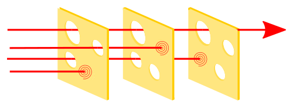
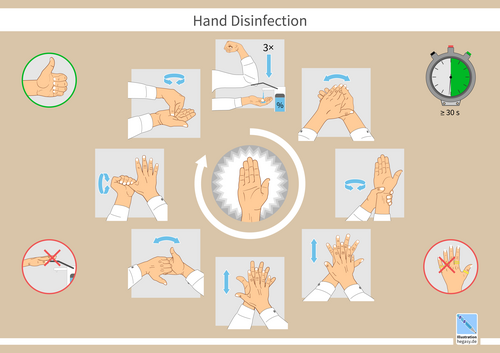

# SEGURANÇA DO PACIENTE E IRAS: BUNDLES, INDICADORES E NOTIFICAÇÃO

Para começar nossa conversa, esqueça aquela ideia antiga de que erro médico é sempre culpa de um profissional negligente. Se você entrar na prova com esse pensamento punitivo, vai errar as questões de Medicina Preventiva. Aqui no MedEvo, trabalhamos com a visão sistêmica. O erro acontece porque as barreiras do sistema falharam. É o famoso Modelo do Queijo Suíço de James Reason: cada fatia de queijo é uma barreira de segurança (protocolos, conferências, alarmes), mas todas têm furos (falhas latentes). Quando os furos se alinham, o dano atinge o paciente.

O diagrama a seguir ilustra esse modelo de forma esquemática — observe como as falhas latentes (furos) precisam se alinhar em todas as camadas de proteção para que o dano atinja o paciente:

*Figura 1 - O Modelo do Queijo Suíço de James Reason: cada "fatia" representa uma barreira de segurança (protocolos, conferências, alarmes) e os furos simbolizam falhas latentes. Quando os furos se alinham, o evento adverso atinge o paciente. Fonte: BenAveling, CC BY-SA 4.0 | Wikimedia Commons*

## Cultura de Segurança e a Classificação de Incidentes

Antes de falarmos de bactérias e cateteres, precisamos entender a linguagem da OMS (Organização Mundial da Saúde) e da ANVISA. As bancas adoram trocar esses conceitos, então preste atenção na diferença fundamental entre eles.

Um incidente é qualquer evento ou circunstância que poderia ter resultado, ou resultou, em dano desnecessário ao paciente. Mas nem todo incidente é igual.

### Tipos de Incidentes

- **Circunstância Notificável:** É o risco potencial. Por exemplo, você percebe que a escala de enfermagem está reduzida à metade no plantão. O dano ainda não aconteceu, mas o cenário é propício.

- **Near Miss (Quase Erro):** O erro aconteceu, mas não chegou ao paciente. Imagine que você prescreveu a dose errada, o farmacêutico percebeu e não dispensou. O "furo do queijo" foi bloqueado na última barreira.

- **Incidente sem Dano:** O erro atingiu o paciente, mas, por sorte ou biologia, não houve lesão. Você administrou o soro errado, mas o paciente não teve nenhuma reação.

- **Evento Adverso (EA):** Este é o que mais cai. É o incidente que resulta em dano ao paciente. Importante: o dano é decorrente da assistência, não da evolução natural da doença. Se o paciente morre de choque séptico pela pneumonia que o trouxe ao hospital, é evolução da doença. Se ele morre porque recebeu potássio concentrado na veia por erro, é Evento Adverso.

**Tabela 1: Classificação de Incidentes (OMS/PNSP)**

| Termo | Definição Prática | Exemplo de Prova |
| --- | --- | --- |
| **Circunstância Notificável** | Potencial de dano presente | Desfibrilador sem bateria na emergência |
| **Near Miss** | Erro que não atingiu o paciente | Medicamento errado detectado antes da infusão |
| **Incidente sem Dano** | Atingiu o paciente, mas não lesionou | Soro fisiológico infundido em vez de Ringer |
| **Evento Adverso** | Dano real causado pela assistência | Queda do leito resultando em fratura de fêmur |

## As 6 Metas Internacionais de Segurança do Paciente

O Programa Nacional de Segurança do Paciente (PNSP), instituído pela Portaria MS 529/2013 e pela RDC 36/2013, segue as metas da Joint Commission e da OMS. Você precisa saber essas seis metas de cor, pois elas são o esqueleto de qualquer protocolo hospitalar.

### Meta 1: Identificação Correta do Paciente

Por que usamos dois identificadores (geralmente nome completo e data de nascimento)? Porque o número do quarto ou o diagnóstico mudam. O paciente "da insuficiência cardíaca" pode ser substituído por outro no mesmo leito.

**Dica do Dr. Will:** Nunca use o número do leito como identificador. Em provas de cirurgia, a meta 1 se une à meta 4: conferir a identidade antes de qualquer procedimento.

### Meta 2: Comunicação Efetiva

A causa mais comum de eventos-sentinela (aqueles que causam morte ou dano grave) é a comunicação deficiente.

- **Ordens Verbais:** Devem ser evitadas, mas em emergências, a técnica é o "read-back" (repetir em voz alta para confirmar). Você diz: "Faça 1mg de Adrenalina". O enfermeiro repete: "Vou fazer 1mg de Adrenalina". Você confirma: "Isso mesmo".

### Meta 3: Segurança na Prescrição, Uso e Administração de Medicamentos

Foco nos "Medicamentos de Alta Vigilância" (eletrólitos concentrados, quimioterápicos, anticoagulantes).

- **Alertas em Prontuário Eletrônico:** Na Atenção Primária (APS), os alertas mais eficazes para segurança são os de **alergias e interações medicamentosas**. Isso otimiza o cuidado e evita iatrogenia.

### Meta 4: Cirurgia Segura

Envolve o uso do Checklist de Cirurgia Segura da OMS. Ele é dividido em três momentos:

- **Before Induction (Antes da anestesia):** Confirmar paciente, sítio cirúrgico e consentimento.

- **Time-out (Antes da incisão):** Toda a equipe para e confirma em voz alta o que será feito.

- **Sign-out (Antes do paciente sair da sala):** Contagem de compressas e conferência de etiquetas de biópsia.

### Meta 5: Higienização das Mãos

A medida isolada mais barata e eficaz para prevenir IRAS. Vamos detalhar isso adiante, mas lembre-se: o foco é interromper a transmissão por contato.

### Meta 6: Redução do Risco de Quedas e Lesões por Pressão (LPP)

Aqui entra a avaliação de risco. Para LPP, usamos a **Escala de Braden**. Para quedas, a Escala de Morse.

## Infecções Relacionadas à Assistência à Saúde (IRAS) e Bundles

As IRAS não são apenas "infecções de hospital". Elas podem ocorrer em qualquer ambiente de cuidado, inclusive na APS. O conceito moderno foca na prevenção através de **Bundles** (Pacotes de Medidas).

Um Bundle não é uma lista de desejos. É um conjunto pequeno de intervenções (3 a 5) que, quando implementadas juntas, resultam em um desfecho muito melhor do que se fossem aplicadas isoladamente. É o "tudo ou nada": para o indicador de adesão ser positivo, o paciente precisa ter recebido TODAS as medidas do pacote.

### Prevenção de Infecção de Corrente Sanguínea (IPCS) associada a Cateter Central

Esta é a favorita das bancas quando o assunto é "medida mais impactante".

- **Higiene das mãos:** Sempre em primeiro lugar.

- **Barreira máxima de precaução:** Gorro, máscara, avental estéril, luvas estéreis e campos grandes.

- **Antissepsia da pele:** Clorexidina alcoólica 0,5% a 2% é a escolha (superior ao PVPI).

- **Seleção do sítio:** Evitar a veia femoral em adultos (maior risco de infecção). Preferir subclávia.

- **Revisão diária da necessidade:** O melhor cateter é aquele que é retirado assim que não é mais essencial.

### Prevenção de Pneumonia Associada à Ventilação (PAV)

- **Cabeceira elevada:** 30 a 45 graus (evita microaspiração).

- **Higiene oral com clorexidina:** Reduz a carga bacteriana da orofaringe.

- **Desmame diário:** Avaliar diariamente se o paciente pode respirar sozinho.

- **Pressão do cuff:** Mantida entre 20-30 cmH2O.

### Higienização das Mãos: Os 5 Momentos

A higienização das mãos é reconhecida universalmente como a medida isolada mais eficaz na prevenção de IRAS. O diagrama a seguir apresenta a técnica padronizada de desinfecção das mãos segundo a norma DIN EN 1500:

*Figura 2 - Diagrama ilustrativo da técnica de desinfecção das mãos conforme a norma DIN EN 1500: cada etapa garante cobertura completa de todas as superfícies das mãos, reduzindo significativamente a transmissão de patógenos. Fonte: Guido Hegasy, CC BY-SA 4.0 | Wikimedia Commons*

A ANVISA e a OMS batem muito forte nisso. Você deve saber os momentos exatos:

- Antes de tocar o paciente.

- Antes de realizar procedimento limpo/asséptico.

- Após risco de exposição a fluidos corporais.

- Após tocar o paciente.

- Após tocar superfícies próximas ao paciente.

**Pegadinha de Prova:** Quando usar água e sabão em vez de álcool gel?

- Quando as mãos estiverem visivelmente sujas.

- Após exposição a fluidos corporais (sangue, urina).

- Após contato com pacientes com diarreia por *Clostridioides difficile* (o álcool não mata os esporos).

## Lesões por Pressão (LPP): Avaliação e Estadiamento

A LPP é um indicador clássico de qualidade da assistência de enfermagem e médica. O local mais comum é a **região sacra**, seguida pelo calcâneo, devido às proeminências ósseas.

### Escala de Braden

É a ferramenta de predição de risco mais utilizada. Ela avalia:

- Percepção sensorial.

- Umidade.

- Atividade física.

- Mobilidade.

- Nutrição.

- Fricção e cisalhamento.

**Cuidado:** Na pediatria, usamos a **Escala de Braden Q**. Se a questão falar de criança, procure por esse "Q".

### Estadiamento das LPP (NPUAP/ANVISA)

- **Estágio 1:** Pele íntegra com eritema que NÃO embranquece à pressão.

- **Estágio 2:** Perda parcial da espessura da derme. Úlcera rasa, leito rosado, sem esfacelo. Pode ser uma bolha íntegra.

- **Estágio 3:** Perda total da espessura da pele. O tecido subcutâneo (gordura) pode estar visível, mas ossos, tendões e músculos NÃO estão expostos.

- **Estágio 4:** Perda total de tecido com exposição de osso, tendão ou músculo.

- **Não Estadiável:** Quando a base da ferida está coberta por esfacelo (amarelo, verde) ou escara (marrom, preto), impedindo a visualização da profundidade real.

- **Lesão Tissular Profunda:** Área localizada de cor púrpura ou castanha, pele íntegra ou bolha de sangue, devido a dano no tecido mole subjacente.

**Tabela 2: Resumo do Estadiamento de LPP**

| Estágio | Característica Principal | O que você vê? |
| --- | --- | --- |
| **1** | Eritema não branqueável | Pele vermelha que não "apaga" ao apertar |
| **2** | Perda parcial da pele | Bolha ou úlcera rasa (derme exposta) |
| **3** | Perda total da pele | Gordura visível |
| **4** | Perda total de tecido | Osso, músculo ou tendão visíveis |
| **Não Estadiável** | Profundidade mascarada | Esfacelo ou necrose cobrindo o fundo |

## Segurança do Paciente na Atenção Primária à Saúde (APS)

Muitos alunos acham que segurança do paciente é só dentro da UTI. Errado! A APS é onde a segurança começa, especialmente através da **Prevenção Quaternária**.

### Prevenção Quaternária e NNH

O conceito de prevenção quaternária é: detectar pacientes em risco de sobremedicalização, protegê-los de intervenções médicas invasivas desnecessárias e sugerir alternativas eticamente aceitáveis.

- **NNH (Number Needed to Harm):** É o número de pacientes que precisam ser tratados para que um sofra um dano. Em segurança do paciente, queremos um NNH alto (significa que o dano é raro).

- **Sobrediagnóstico e Sobretratamento:** São falhas de segurança. Tratar um câncer de próstata indolente em um idoso de 95 anos pode causar mais dano (incontinência, impotência) do que benefício.

### ICSAP: Internações por Condições Sensíveis à Atenção Primária

Este é um dos indicadores de qualidade mais cobrados em provas de Medicina Preventiva.
**Conceito:** Se a APS funciona bem, o paciente não deve internar por certas doenças. Se as taxas de internação por essas causas estão altas, a qualidade da APS está baixa.

**Condições que compõem a lista de ICSAP no Brasil:**

- Asma e DPOC.

- Insuficiência Cardíaca e Hipertensão.

- Diabetes Mellitus.

- Anemias.

- Infecções de Pele e Tecido Subcutâneo.

- Infecção do Trato Urinário (ITU).

- Gastroenterites Infecciosas.

**Exemplo Clínico:** Imagine uma cidade onde as internações por crise hipertensiva subiram 30%. O gestor não deve construir mais leitos de hospital primeiro; ele deve investigar por que os postos de saúde não estão controlando a pressão dos pacientes. A ICSAP é um indicador de **efetividade** da APS.

## Notificação de Eventos e Vigilância

A segurança do paciente depende da transparência. No Brasil, o sistema oficial de notificação é o **NOTIVISA** (Sistema de Notificações em Vigilância Sanitária).

### O que e quem deve notificar?

- **Quem:** Todos os profissionais de saúde, pacientes e familiares podem notificar. Nos hospitais, o Núcleo de Segurança do Paciente (NSP) centraliza essas informações.

- **O que:** Eventos adversos, queixas técnicas de produtos (seringa estragada, remédio com cor estranha) e erros de medicação.

- **Prazo:** Eventos adversos que resultaram em **óbito** devem ser notificados em até **24 horas**.

### Acidentes com Material Biológico

Este tema cruza Segurança do Paciente com Saúde do Trabalhador.

- **Conduta Imediata:** Lavar com água e sabão (se pele) ou soro fisiológico (se mucosa). NUNCA espremer o local ou usar agentes irritantes (éter, hipoclorito).

- **Notificação:** Deve-se emitir a CAT (Comunicação de Acidente de Trabalho) e preencher o SINAN.

- **Sorologias:** Colher do acidentado e do paciente-fonte (HIV, HBV, HCV).

- **Profilaxia Pós-Exposição (PPE):** Se indicada, deve ser iniciada o mais rápido possível, idealmente nas primeiras 2 horas, até no máximo 72 horas.

- **Acompanhamento:** Sorologias basais, e repetição com 30 e 90 dias (conforme protocolos vigentes).

## Indicadores de Qualidade e Gestão de Risco

Como medimos se um hospital é seguro? Através de indicadores. Donabedian propôs três pilares para avaliar a qualidade:

- **Estrutura:** O que o hospital tem (número de enfermeiros por leito, presença de NSP).

- **Processo:** O que o hospital faz (taxa de adesão à higienização das mãos, uso do checklist cirúrgico).

- **Resultado:** O que acontece com o paciente (taxa de mortalidade, taxa de incidência de LPP, taxa de IPCS).

### Triagem em Desastres: Método START

Em situações de múltiplas vítimas (catástrofes), a segurança coletiva sobrepõe-se à individual. O método START (Simple Triage and Rapid Treatment) classifica as vítimas por cores:

- **Vermelho (Imediato):** Prioridade 1. Vítimas com risco de morte, mas que têm chance de sobrevida (ex: obstrução de via aérea, choque).

- **Amarelo (Adiado):** Prioridade 2. Lesões graves, mas que podem aguardar um pouco (ex: fraturas expostas estáveis).

- **Verde (Ambulatorial):** Prioridade 3. Os "feridos que andam".

- **Preto (Expectante/Óbito):** Sem pulso ou respiração após manobras básicas de via aérea.

## Situações Especiais e Pegadinhas Recentes

### RCP em Pacientes com COVID-19

Durante a pandemia, os protocolos de segurança foram adaptados para proteger a equipe (Biossegurança).

- **Via Aérea:** Priorizar intubação precoce por profissional experiente para evitar aerolização. O uso de filtros HEPA no circuito do ventilador é obrigatório.

- **Equipamentos:** Não deixar materiais de via aérea soltos no leito; usar bandejas para higienização posterior.

### O Papel do Farmacêutico Clínico

As bancas têm valorizado muito o cuidado interprofissional. O farmacêutico clínico é essencial na **conciliação medicamentosa** (comparar o que o paciente usava em casa com o que foi prescrito no hospital) para evitar erros de omissão ou duplicidade terapêutica.

### Identificação do Paciente Cirúrgico

A marcação do sítio cirúrgico deve ser feita pelo cirurgião que realizará o procedimento, com o paciente acordado, antes de ele ir para o centro cirúrgico. Se for um órgão bilateral (ex: rim esquerdo), a marcação é obrigatória.

**Tabela 3: Condições Sensíveis à Atenção Primária (ICSAP - Exemplos)**

| Grupo | Condições Específicas |
| --- | --- |
| **Doenças Imunopreviníveis** | Vacinação deficiente (ex: sarampo, tétano) |
| **Doenças Infecciosas** | Gastroenterites, Sífilis congênita |
| **Doenças Crônicas** | Hipertensão, Diabetes, Insuficiência Cardíaca |
| **Doenças Respiratórias** | Asma, DPOC, Pneumonias evitáveis |
| **Outros** | Anemia ferropriva, Doença inflamatória pélvica |

## Por que o sistema falha? (Fatores Humanos)

Ao estudar para a residência, você verá que a segurança do paciente foca muito em "Fatores Humanos". Isso significa entender que o ser humano tem limites cognitivos (cansaço, estresse, memória falha).
Por isso, protocolos de segurança não devem depender da memória.

- **Checklists** são ferramentas de suporte cognitivo.

- **Equipes fixas** aumentam a familiaridade e a comunicação, o que reduz erros.

- **Postura ativa do paciente:** Incentivar o paciente a perguntar sobre seus medicamentos e sintomas melhora a acurácia diagnóstica.

## Pontos-Chave para Prova

- **Evento Adverso vs. Near Miss:** O EA causa dano; o Near Miss é interceptado antes de atingir o paciente.

- **Meta 1 (Identificação):** Use dois identificadores (Nome e Data de Nascimento). NUNCA o número do leito.

- **Meta 5 (Mãos):** Álcool gel é o padrão, mas água e sabão são obrigatórios se houver sujeira visível ou após contato com fluidos corporais e esporos (*C. diff*).

- **Bundle de Cateter Central:** Clorexidina alcoólica é superior ao PVPI. O sítio de preferência é a subclávia (evitar femoral).

- **Escala de Braden:** Avalia risco de Lesão por Pressão. O local mais comum de LPP é o sacro.

- **LPP Estágio 1:** Eritema que não embranquece. Pele ainda está íntegra.

- **LPP Estágio 3 vs 4:** No estágio 3 vemos gordura; no estágio 4 vemos osso, músculo ou tendão.

- **ICSAP:** Indicador de qualidade da APS. Se a APS é boa, as internações por asma, DM e ICC devem cair.

- **Prevenção Quaternária:** Evitar o excesso de intervenção médica (iatrogenia). Usa o conceito de NNH.

- **Notificação no NOTIVISA:** Eventos adversos graves (óbito) devem ser notificados em até 24 horas.

- **Causa raiz de erros graves:** Falha na comunicação da equipe é a resposta mais frequente em provas.

- **Modelo do Queijo Suíço:** O erro é sistêmico, não apenas individual. Foca na "Cultura Justa" em vez da cultura punitiva.

- **Triagem START:** Vermelho é prioridade imediata; Amarelo pode aguardar; Verde são os feridos leves; Preto é óbito ou sem chance de sobrevida.

- **Acidente Biológico:** Lavar com água e sabão, colher sorologias do fonte e do acidentado, iniciar PPE em até 72h (idealmente 2h) se houver risco.

- **Checklist Cirúrgico:** O "Time-out" ocorre imediatamente antes da incisão cirúrgica, com toda a equipe presente. 🛡️

Lembre-se do que sempre digo no MedEvo: a prova não quer saber se você é um carrasco que pune erros, mas se você é um médico que entende como criar barreiras para proteger o paciente. Entender o "porquê" de cada meta e de cada bundle é o que vai te fazer acertar aquela questão difícil de Medicina Preventiva.

 Cópia offline para consulta pessoal.
 Fonte original:
 [https://www.medevo.com.br/material-apoio/ler/58dccfb7-39f7-44ae-8a6e-4d2042536c41](https://www.medevo.com.br/material-apoio/ler/58dccfb7-39f7-44ae-8a6e-4d2042536c41)
