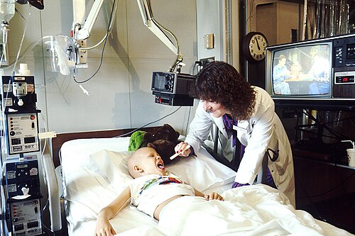

# SEMIOLOGIA E PROPEDÊUTICA

A semiologia é a base do raciocínio clínico: transforma queixas, sinais vitais, inspeção, palpação, percussão e ausculta em hipóteses diagnósticas testáveis. Em provas e na prática, não basta reconhecer o nome de um sinal; é necessário entender o que aquele achado representa na fisiopatologia do paciente. O diagnóstico começa antes do exame segmentar, no modo como o paciente entra, fala, respira, senta, caminha e interage. A imagem a seguir ilustra esse cenário fundamental da prática médica:

*Figura 1 - A relação médico-paciente é o alicerce da semiologia: a anamnese bem conduzida, com escuta ativa e empatia, responde por grande parte das hipóteses diagnósticas iniciais. Fonte: NCI, Domínio Público | Wikimedia Commons*

Roteiro completo do encontro clínico

1. Preparação
 → higiene das mãos, privacidade, identificação do paciente, consentimento

2. Impressão geral
 → nível de consciência, posição no leito, fácies, padrão respiratório, dor

3. Anamnese
 → queixa principal, HDA cronológica, antecedentes, medicamentos, alergias, hábitos

4. Sinais vitais
 → PA, FC, FR, temperatura, SpO2, dor e glicemia quando indicada

5. Exame físico sistemático
 → inspeção, palpação, percussão e ausculta conforme o segmento

6. Síntese
 → problemas ativos, hipóteses, gravidade, exames necessários e conduta inicial

Essa sequência evita dois erros comuns: examinar sem hipótese e fechar diagnóstico sem reavaliar dados discordantes.

## Anamnese e Relação Médico-Paciente

A anamnese é a ferramenta diagnóstica mais poderosa da medicina. Mais de 70% dos diagnósticos são selados aqui. Nas provas, a abordagem sobre comunicação médica tem crescido muito, focando na técnica de coleta de dados.

Existem dois tipos principais de perguntas: as abertas e as fechadas. As perguntas abertas, como "A senhora quer falar mais sobre este problema?", são essenciais no início da consulta. Elas estimulam a escuta ativa e permitem que o paciente narre a história cronologicamente, o que evita o viés de confirmação do médico. Já as perguntas fechadas são úteis no final da anamnese para refinar detalhes específicos (ex: "A dor piora quando o senhor tosse?").

Um erro comum em provas é subestimar a competência cultural. O médico deve adaptar sua linguagem e entender o contexto psicossocial da dor. A "dor psicossocial" ou "dor total" é um conceito que aparece frequentemente em questões de cuidados paliativos e clínica geral, lembrando que o sofrimento emocional pode amplificar a percepção dolorosa física.

## Sinais Vitais e Propedêutica Geral

### Pressão Arterial (PA)

A aferição correta da PA é um tema clássico. Para um valor ser confiável, o paciente deve estar em repouso de pelo menos 5 minutos, com a bexiga vazia, sem ter ingerido café, álcool ou fumado nos últimos 30 minutos. O manguito deve ser adequado à circunferência do braço (cobrir 80% da circunferência).

Ponto técnico importante: manguito muito pequeno para um braço com grande circunferência superestima a pressão arterial; manguito muito grande pode subestimá-la. Em situações de emergência ou choque, o uso de cateter intra-arterial é o padrão-ouro para monitorização contínua, mas na triagem ambulatorial, o rigor técnico é o que evita diagnósticos errados de hipertensão.

### Temperatura e Febre

A temperatura corporal acima de 41°C é definida como hiperpirexia. Isso é uma emergência médica grave, pois pode levar à desnaturação proteica e falência orgânica. Não confunda com febre simples ou febrícula.

## Pele e Fâneros

A semiologia da pele nos traz dados valiosos. A madarose (perda do terço distal das sobrancelhas) ou a alopecia de supercílios podem indicar hipotireoidismo ou hanseníase. A cianose central (observada em língua e mucosas) indica má oxigenação do sangue arterial, enquanto a cianose periférica sugere apenas má perfusão local.

No exame das pupilas, lembre-se dos termos técnicos:

- Isocoria: Pupilas iguais.

- Anisocoria: Pupilas de tamanhos diferentes (pode indicar lesão neurológica expansiva).

- Midríase: Dilatação.

- Miose: Constrição.

- Discoria: Forma irregular da pupila.

## Cicatrização e Lesões por Pressão

Este é um tema que transita entre a semiologia e a cirurgia. O processo de cicatrização segue uma ordem cronológica que as bancas adoram cobrar.

- Fase Inflamatória (1 a 4 dias): Ocorre hemostasia inicial. O primeiro evento vascular após a lesão é uma vasoconstrição que dura segundos, seguida por uma vasodilatação (10-15 min) que permite a chegada de neutrófilos e macrófagos.

- Fase Proliferativa: Caracterizada pela fibroplasia, angiogênese e epitelização.

- Fase de Maturação/Remodelação: Onde ocorre a contração da ferida e a reorganização do colágeno.

As Lesões por Pressão (LPP) são classificadas por estágios. A LPP sacral é a mais comum em pacientes acamados. A prevenção envolve mudança de decúbito a cada 2 horas e manutenção da hidratação da pele.

| Estágio LPP | Descrição Clínica |
| --- | --- |
| Estágio 1 | Pele íntegra com eritema que não embranquece à pressão. |
| Estágio 2 | Perda de espessura parcial da derme (úlcera rasa, bolha). |
| Estágio 3 | Perda de espessura total; gordura subcutânea visível. |
| Estágio 4 | Perda total de tecido com exposição de músculo, tendão ou osso. |

## Semiologia Cardiovascular

A ausculta cardíaca exige conhecimento preciso dos focos de ausculta. O diagrama a seguir apresenta a localização dos focos valvares no tórax:

*Figura 2 - Relações de superfície do tórax: os focos de ausculta Mitral (M/B), Tricúspide (T), Aórtico (A) e Pulmonar (P) aparecem em suas posições clássicas na parede torácica. Adaptado de Gray's Anatomy. Fonte: Henry Vandyke Carter, Domínio Público | Wikimedia Commons*

Para interpretar a ausculta cardíaca, é fundamental dominar a fisiologia da segunda bulha (S2). A S2 é composta pelo fechamento das valvas aórtica (A2) e pulmonar (P2). Normalmente, na inspiração, o retorno venoso para o ventrículo direito aumenta, o que retarda o fechamento da valva pulmonar, gerando o desdobramento fisiológico da S2.

Na Estenose Aórtica, o componente A2 pode estar abafado ou ocorrer após o P2 (desdobramento paradoxal). O sopro inocente é um diferencial frequente: costuma ser sistólico, suave (grau I ou II/VI), sem frêmitos, e pode aumentar em estados hipercinéticos, como febre ou exercício. Sopro diastólico deve ser considerado patológico até prova em contrário.

O pulso paradoxal é definido como uma queda maior que 10 mmHg na pressão arterial sistólica durante a inspiração. Isso acontece no tamponamento cardíaco e na pericardite constritiva, pois o enchimento do ventrículo direito "empurra" o septo para a esquerda, reduzindo o volume ejetado pelo ventrículo esquerdo.

## Semiologia Respiratória

Aqui, o segredo é comparar os achados de palpação, percussão e auscultação. Imagine um paciente com pneumonia (consolidação) versus um com derrame pleural.

Na Consolidação Pulmonar:

- Expansibilidade: Diminuída.

- Frêmito Toraco-Vocal (FTV): Aumentado (o som propaga melhor no meio sólido).

- Percussão: Macicez.

- Ausculta: Estertores finos, broncofonia e pectorilóquia.

No Derrame Pleural:

- Expansibilidade: Diminuída.

- FTV: Diminuído ou ausente (o líquido bloqueia a vibração).

- Percussão: Macicez (frequentemente com sinal de parábola de Damoiseau).

- Ausculta: Murmúrio vesicular diminuído. Na borda superior do derrame, pode haver egofonia (voz de cabra).

Em paciente tabagista com tosse crônica e expectoração, mesmo hialina, a investigação de tuberculose com baciloscopia é relevante no Brasil. Também deve ser considerado câncer de pulmão, especialmente se houver perda ponderal, hemoptise, rouquidão, dor torácica ou mudança recente no padrão da tosse. Nesses cenários, a TC de tórax é exame importante na investigação de achados suspeitos.

## Semiologia Abdominal: O Exame Físico que Salva Vidas

O abdome deve ser examinado na ordem: Inspeção, Ausculta, Percussão e Palpação. Por que a ausculta vem antes? Porque a palpação pode alterar os ruídos hidroaéreos (RHA).

### Sinais de Irritação Peritoneal e Apendicite

A apendicite aguda é a causa mais comum de abdome agudo cirúrgico. A dor clássica começa periumbilical (dor visceral, inervação do sistema nervoso autônomo) e depois se localiza na Fossa Ilíaca Direita (FID) (dor somática, irritação do peritônio parietal).

- Sinal de Rovsing: Compressão da Fossa Ilíaca Esquerda (FIE) que gera dor na FID. Isso ocorre pelo deslocamento de gases que distendem o ceco inflamado.

- Sinal de Blumberg: Dor à descompressão brusca no ponto de McBurney. Indica peritonite.

- Sinal de Dumphy: Dor na fossa ilíaca ao tossir.

- Apendicite Retrocecal: Frequentemente apresenta sinais mais frustros na palpação anterior, podendo cursar com dor à extensão do quadril (Sinal do Psoas).

### Patologias Biliares e Hepáticas

O Sinal de Murphy é o achado clássico da colecistite aguda: interrupção da inspiração profunda durante a palpação do ponto cístico. Já o Sinal de Courvoisier (vesícula palpável e indolor em paciente ictérico) sugere fortemente neoplasia periampular ou de cabeça de pâncreas, e não cálculos, pois na colelitíase crônica a vesícula costuma ser fibrótica e não distende.

Na investigação de hemorragia retroperitoneal (como na pancreatite necro-hemorrágica), procure pelos sinais de Cullen (equimose periumbilical) e Grey Turner (equimose nos flancos).

### O Falso Abdome Agudo

Muitas condições mimetizam um abdome cirúrgico. A porfiria intermitente aguda, a cetoacidose diabética, a pneumonia basal e a adenite mesentérica são causas de "falso abdome agudo". Por outro lado, a Hérnia de Petersen (uma complicação de bypass gástrico) é uma causa de abdome agudo cirúrgico verdadeiro por obstrução intestinal.

RHA metálicos associados a distensão abdominal e parada de eliminação de flatos e fezes sugerem obstrução intestinal. Na radiografia, procure por pregas coniventes (intestino delgado - sinal do empilhamento de moedas) ou haustrações (cólon).

## Semiologia Vascular e Linfática

A Insuficiência Venosa Crônica (IVC) é classificada pela escala CEAP. Para a prova, memorize o C6:

- C0: Sem sinais visíveis.

- C1: Telangiectasias.

- C2: Varizes.

- C3: Edema.

- C4: Alterações tróficas (lipodermatoesclerose, eczema).

- C6: Úlcera venosa ATIVA.

O padrão-ouro para mapear o refluxo venoso é o Ecodoppler vascular realizado com o paciente em posição ortostática. O edema da IVC costuma ser vespertino e melhora com a elevação dos membros. Diferencie do linfedema, que é um edema duro, sem cacifo, e que pode apresentar o Sinal de Stemmer (impossibilidade de pinçar a pele do dorso do segundo dedo do pé).

O edema sem cacifo também é característico do mixedema pré-tibial na Doença de Graves (hipertireoidismo).

## Semiologia do Sistema Musculoesquelético e Coluna

A dor lombar é uma das queixas mais comuns no ambulatório. A maioria é de origem mecânica (pós-esforço, sem déficit neurológico) e o tratamento é clínico, com orientações e analgesia. O principal fator de risco modificável é a falta de atividade física.

No entanto, red flags (sinais de alarme) indicam necessidade de exames de imagem (RX, RM ou TC):

- Idade > 50 anos ou < 20 anos.

- História de neoplasia.

- Febre ou perda de peso inexplicada.

- Déficit neurológico focal ou progressivo.

- Uso de drogas IV ou imunossupressão.

- Trauma importante.

- Dor que não melhora com o repouso (dor não mecânica).

Cuidado: A obesidade mórbida, embora dificulte o exame, NÃO é considerada um red flag isolado para solicitar imagem imediata.

Na dor no ombro, o diagnóstico diferencial envolve tendinites do manguito rotador, bursites e capsulite adesiva. O exame físico deve testar a força e a amplitude de movimento passiva e ativa.

## Semiologia Neurológica e Meníngea

A avaliação da força, reflexos e sinais de irritação meníngea é fundamental.

- Hiperreflexia: Sugere lesão de primeiro neurônio motor (via piramidal).

- Sinal de Brudzinski: Ao fletir o pescoço do paciente, ocorre a flexão involuntária dos joelhos e quadris.

- Sinal de Kernig: Dor e resistência ao tentar estender o joelho com a coxa fletida a 90 graus.

Na coordenação, a ataxia motora cerebelar se manifesta tanto com os olhos abertos quanto fechados. Se a coordenação piora apenas com os olhos fechados, pensamos em perda de sensibilidade proprioceptiva (Sinal de Romberg positivo).

Para pacientes com parestesia na mão, lembre-se da Síndrome do Túnel do Carpo (STC), muito comum na gravidez devido ao edema. Os testes de Phalen e Tinel são os pilares do exame físico.

## Propedêutica em Situações Especiais

### Pediatria

A avaliação da dor em pediatria exige escalas adequadas à idade. Em recém-nascidos, usamos escalas comportamentais (choro, expressão facial). Em crianças maiores, a escala de faces é a preferida.

### Idosos

O envelhecimento traz alterações fisiológicas que não devem ser confundidas com doenças. A perda de elasticidade da pele, a redução da audição para altas frequências (presbiacusia) e a diminuição da sensibilidade vibratória nos pés podem ser normais do envelhecimento. No entanto, qualquer massa abdominal dolorosa e fixa em um idoso deve ser encarada como neoplasia até que se prove o contrário.

### Emergências e Trauma

Na avaliação da via aérea, o preditor de via aérea difícil mais conhecido é a Classificação de Mallampati. No trauma abdominal, o Sinal de Jobert (desaparecimento da macicez hepática, dando lugar ao timpanismo) indica pneumoperitônio por ruptura de víscera oca, uma emergência cirúrgica imediata.

## Diagnóstico Diferencial e Raciocínio Clínico

### Estrutura mínima para não deixar o caso incompleto

Em qualquer vinheta clínica, a semiologia deve terminar com uma síntese organizada:

- **Síndrome principal:** febril, dolorosa, respiratória, edematosa, hemorrágica, neurológica, abdominal etc.

- **Gravidade:** instabilidade hemodinâmica, rebaixamento, hipoxemia, sepse, peritonite ou déficit focal.

- **Hipóteses prováveis e perigosas:** considerar tanto a causa mais comum quanto o diagnóstico que não pode ser perdido.

- **Dado semiológico discriminador:** achado que separa hipóteses próximas, como timpanismo versus macicez, sopro sistólico versus diastólico, dor pleurítica versus opressiva.

- **Próximo passo:** observação, exame complementar, tratamento empírico ou intervenção imediata.

O raciocínio clínico é a síntese de todos esses dados. Quando um paciente apresenta dor na Fossa Ilíaca Direita, o leque de diferenciais é enorme:

- Cirúrgico: Apendicite, gravidez ectópica rota, torção de anexo.

- Clínico: Adenite mesentérica, doença de Crohn, infecção urinária, nefrolitíase.

A "Prateleira de Blummer" é um achado de toque retal caracterizado pela palpação de um "degrau" ou massa no fundo de saco de Douglas, sugerindo metástase peritoneal, frequentemente de câncer gástrico. O "Grito de Douglas" corresponde à dor lancinante à palpação dessa região, associada à presença de sangue ou pus livre na cavidade peritoneal.

| Sinal Semiológico | Localização/Significado | Patologia Sugerida |
| --- | --- | --- |
| Murphy | Ponto Cístico | Colecistite Aguda |
| Rovsing | FIE -> Dor na FID | Apendicite Aguda |
| Jobert | Hipocôndrio Direito (Timpanismo) | Pneumoperitônio |
| Courvoisier | Vesícula palpável indolor | Câncer de Cabeça de Pâncreas |
| Blumberg | Ponto de McBurney | Peritonite (Apendicite) |
| Cullen | Periumbilical (Equimose) | Hemorragia Retroperitoneal |

## Pontos-chave

- CEAP C6: Representa a úlcera venosa ativa. É o estágio mais avançado da insuficiência venosa crônica.

- Sinal de Murphy: Parada inspiratória à palpação da vesícula. Positivo na colecistite aguda.

- Sinal de Courvoisier: Vesícula palpável e indolor + icterícia = tumor periampular (não é cálculo!).

- Sinal de Jobert: Timpanismo sobre o fígado. Indica ruptura de víscera oca (pneumoperitônio).

- Sinal de Rovsing: Pressão na FIE que dói na FID. Sugere apendicite.

- Sinal de Blumberg: Dor à descompressão brusca. Indica irritação peritoneal.

- Sinal de Cullen e Grey Turner: Equimoses periumbilical e nos flancos, respectivamente. Indicam hemorragia retroperitoneal (ex: pancreatite grave).

- Pulso Paradoxal: Queda da PAS > 10 mmHg na inspiração. Típico de tamponamento cardíaco.

- Hiperpirexia: Temperatura > 41°C. É uma emergência médica.

- Consolidação Pulmonar: Aumenta o Frêmito Toraco-Vocal (FTV).

- Derrame Pleural: Diminui o Frêmito Toraco-Vocal (FTV) e gera macicez.

- Red Flags Lombalgia: Idade extrema, perda de peso, febre, déficit neurológico, dor não mecânica.

- Cicatrização: A vasoconstrição dura segundos; a vasodilatação (inflamação) começa em 10-15 minutos.

- Sopro Inocente: Sempre sistólico, sem frêmito, bulhas normais.

- Anisocoria: Pupilas de tamanhos diferentes. Sempre investigar causa neurológica.

- Sinal de Stemmer: Incapacidade de pinçar a pele do dorso do pé. Patognomônico de linfedema.

- Contraindicação Absoluta: Não aferir PA em braço com fístula arteriovenosa ou do lado de mastectomia com esvaziamento axilar.

- O que NÃO fazer: Não solicitar RM de coluna para lombalgia mecânica simples sem sinais de alarme. 🧠

 Cópia offline para consulta pessoal.
 Fonte original:
 [https://www.medevo.com.br/material-apoio/ler/57e36bf1-0179-40cf-b3af-8c23a446fa71](https://www.medevo.com.br/material-apoio/ler/57e36bf1-0179-40cf-b3af-8c23a446fa71)
