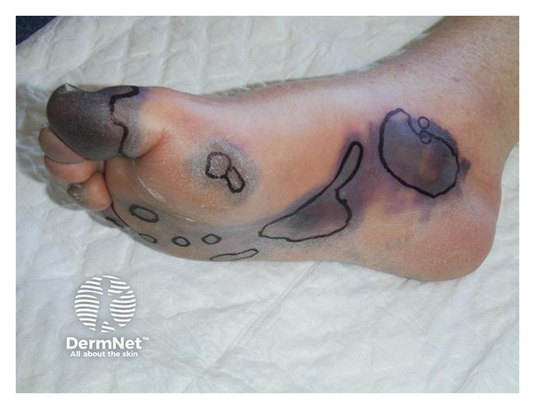

# SEPSE E CHOQUE SÉPTICO

Sepse não é sinônimo de “infecção no sangue”. Pela definição atual, sepse é uma **disfunção orgânica ameaçadora à vida causada por resposta desregulada do hospedeiro a uma infecção**.

A ideia central é simples: **infecção isolada não basta**. Pneumonia com febre, tosse e órgãos preservados é infecção. Pneumonia com confusão mental, hipoxemia, hipotensão, oligúria, plaquetopenia ou lactato elevado já sugere sepse.

## Fisiopatologia

Na sepse, a resposta inflamatória deixa de ser local e passa a causar **lesão endotelial sistêmica**, vasodilatação, extravasamento capilar, microtrombose e disfunção celular.

Principais consequências:

- **Vasodilatação arterial:** queda da resistência vascular sistêmica e hipotensão.

- **Aumento da permeabilidade capilar:** edema intersticial com hipovolemia intravascular relativa.

- **Ativação da coagulação:** microtrombos, consumo de plaquetas e fatores de coagulação, podendo evoluir para CIVD.

- **Disfunção mitocondrial e metabólica:** lactato elevado pode refletir hipoperfusão, hipóxia tecidual, disfunção celular e estímulo adrenérgico.

**Dica de prova:** lactato elevado na sepse é marcador de gravidade e hipoperfusão/disfunção celular. Não interprete lactato apenas como “falta de oxigênio”.

## Conceitos essenciais

- **Infecção:** suspeita ou confirmação de invasão por microrganismo, sem disfunção orgânica.

- **Sepse:** infecção suspeita ou confirmada + disfunção orgânica aguda.

- **Choque séptico:** sepse com alteração circulatória/metabólica profunda, com necessidade de vasopressor e lactato elevado após reposição volêmica adequada.

A expressão **“sepse grave”** é antiga e, pelo Sepsis-3, tornou-se redundante. Na prática atual, se há sepse, já existe disfunção orgânica.

## SIRS: ainda aparece em prova

SIRS é uma resposta inflamatória sistêmica, infecciosa ou não infecciosa. Pode ajudar na triagem, mas **não define sepse sozinha**.

Para SIRS, são necessários pelo menos 2 critérios:

| Critério | Valor |
| --- | --- |
| Temperatura | > 38 °C ou < 36 °C |
| Frequência cardíaca | > 90 bpm |
| Frequência respiratória | > 20 irpm ou PaCO2 < 32 mmHg |
| Leucócitos | > 12.000/mm³, < 4.000/mm³ ou > 10% bastões |

**Pegadinha:** hipotensão e queda de saturação não são critérios de SIRS. São sinais de possível disfunção orgânica.

## SOFA e disfunção orgânica

O SOFA avalia 6 sistemas:

- Respiratório: PaO2/FiO2.

- Hematológico: plaquetas.

- Hepático: bilirrubinas.

- Cardiovascular: pressão arterial média e necessidade de vasopressores.

- Neurológico: escala de coma de Glasgow.

- Renal: creatinina e débito urinário.

Na definição operacional, sepse é suspeitada quando há infecção + aumento de **≥ 2 pontos no SOFA** em relação ao basal.

Na beira-leito, pense em sepse quando uma infecção vem acompanhada de:

- confusão mental ou rebaixamento do nível de consciência;

- hipotensão ou necessidade de vasopressor;

- hipoxemia ou piora respiratória aguda;

- oligúria ou aumento de creatinina;

- plaquetopenia ou coagulopatia;

- bilirrubina elevada;

- lactato elevado.

## qSOFA: alto risco, não diagnóstico

O qSOFA é simples e não usa exames laboratoriais. Pontua 1 ponto para cada item:

- FR ≥ 22 irpm;

- PAS ≤ 100 mmHg;

- Glasgow < 15.

**qSOFA ≥ 2 indica maior risco de mau desfecho**, mas não fecha diagnóstico de sepse. E qSOFA 0 ou 1 **não exclui sepse**, pois a sensibilidade é limitada.

Para triagem hospitalar, ferramentas como **NEWS/NEWS2, MEWS ou SIRS** são preferidas em relação ao qSOFA isolado.

## Choque séptico

Choque séptico é sepse com disfunção circulatória e metabólica persistente.

Critérios práticos:

- necessidade de vasopressor para manter **PAM ≥ 65 mmHg**;

- lactato **> 2 mmol/L** ou **> 18 mg/dL**;

- persistência após reposição volêmica adequada.

Exemplo: paciente com pielonefrite, confusão mental, PA 80/45 mmHg, lactato 4 mmol/L e hipotensão persistente após cristaloide. Se precisa de noradrenalina para manter PAM, está em choque séptico.

## Manejo inicial

Sepse e choque séptico são emergências. O tratamento deve começar assim que houver suspeita clínica relevante.

Medidas iniciais:

- **Avaliar ABC, oxigenação e perfusão.**

- **Obter acessos venosos calibrosos**, monitorização e coleta de exames.

- **Dosar lactato** e repetir se elevado.

- **Coletar culturas**, idealmente antes do antibiótico, sem atrasar tratamento.

- **Iniciar antibiótico empírico** conforme probabilidade de sepse, choque e foco provável.

- **Fazer reposição volêmica com cristaloide** se hipoperfusão ou choque.

- **Iniciar vasopressor se hipotensão persistente**, preferencialmente noradrenalina.

- **Controlar o foco infeccioso** o mais rápido possível quando indicado.

## Antibiótico: quando iniciar?

A regra prática para prova:

- **Choque séptico ou sepse provável/definida:** antibiótico imediatamente, idealmente em até 1 hora.

- **Sepse possível sem choque:** investigação rápida; se a suspeita persistir, iniciar antibiótico em até 3 horas.

- **Baixa probabilidade de infecção e sem choque:** monitorar e investigar antes de antibiótico empírico.

Culturas são importantes, mas **não devem atrasar antibiótico** em paciente grave.

Coletar, quando possível:

- 2 pares de hemoculturas de sítios diferentes;

- urocultura se foco urinário;

- cultura de secreção respiratória se foco pulmonar;

- cultura de secreção, líquor, líquido abdominal ou material de abscesso conforme o foco.

## Reposição volêmica

Em sepse com hipoperfusão ou choque séptico, iniciar cristaloide IV.

Pontos principais:

- usar **cristaloide** como fluido inicial;

- preferir cristaloides balanceados quando disponíveis;

- considerar **30 mL/kg nas primeiras 3 horas** em hipoperfusão induzida por sepse ou choque;

- reavaliar frequentemente para evitar sub ou hiper-resuscitação;

- após o volume inicial, guiar fluidos por parâmetros dinâmicos, não por PVC isolada.

Parâmetros úteis para reavaliação:

- tempo de enchimento capilar;

- pressão arterial e PAM;

- débito urinário;

- lactato seriado;

- melhora do sensório;

- resposta à elevação passiva das pernas;

- ultrassom à beira-leito quando disponível.

**Cuidado:** insuficiência cardíaca, DRC e cirrose não proíbem volume inicial, mas exigem monitorização mais próxima e reavaliações frequentes.

## Vasopressores

Se a hipotensão persiste após volume inicial, ou se o choque é muito grave, iniciar vasopressor.

- **Primeira escolha:** noradrenalina.

- **Meta inicial:** PAM em torno de 65 mmHg.

- **Se necessidade crescente de noradrenalina:** considerar adicionar vasopressina.

- **Se choque refratário apesar de noradrenalina + vasopressina:** considerar adrenalina.

- **Dopamina:** não é primeira escolha; reservar para situações muito selecionadas, como bradicardia importante e baixo risco de arritmia.

Não é obrigatório esperar cateter venoso central para iniciar vasopressor em choque instável. Pode ser iniciado em acesso periférico adequado enquanto se providencia acesso definitivo, com vigilância para extravasamento.

## Antibioticoterapia empírica: como escolher

A escolha depende de:

- foco provável;

- origem comunitária ou hospitalar;

- gravidade e presença de choque;

- uso prévio de antibióticos;

- colonização ou infecção prévia por germes multirresistentes;

- perfil microbiológico local;

- função renal, peso e alergias.

A primeira dose deve ser adequada e precoce. Depois, deve-se **reavaliar diariamente para descalonar** conforme culturas, evolução clínica e controle de foco.

| Foco provável | Sem risco evidente de multirresistência | Risco hospitalar, MDR ou choque grave |
| --- | --- | --- |
| Pneumonia comunitária grave | Ceftriaxona + azitromicina ou claritromicina | Cefepime ou piperacilina-tazobactam; associar cobertura para MRSA se risco |
| Urinário | Ceftriaxona | Cefepime, piperacilina-tazobactam ou meropenem se risco de ESBL |
| Abdominal | Ceftriaxona + metronidazol | Piperacilina-tazobactam ou meropenem |
| Pele e partes moles | Oxacilina ou cefazolina se quadro não purulento | Vancomicina se risco de MRSA; ampliar para Gram-negativos/anaeróbios se infecção necrosante |
| Cateter venoso central | Cobertura para Gram-positivos, geralmente vancomicina se grave | Vancomicina + cefepime ou meropenem, conforme risco local |

Pontos de prova:

- **ESBL:** preferir carbapenêmico, como meropenem ou imipenem em infecção grave. Ertapenem não cobre Pseudomonas.

- **MRSA:** vancomicina ou teicoplanina. Em pneumonia por MRSA, linezolida também pode ser opção.

- **Daptomicina:** não usar em pneumonia, pois é inativada pelo surfactante pulmonar.

- **Pseudomonas:** considerar piperacilina-tazobactam, cefepime, ceftazidima, meropenem ou imipenem. Ertapenem não cobre Pseudomonas.

- **Anaeróbios:** cobrir em foco abdominal, gineco-obstétrico profundo, infecção necrosante, abscesso de cabeça e pescoço, abscesso cerebral ou empiema.

Antifúngico empírico não é rotina. Considerar apenas em pacientes selecionados, como imunossuprimidos, uso prolongado de antibióticos, internação prolongada, cirurgia abdominal recente, nutrição parenteral, Candida prévia ou foco intra-abdominal de alto risco.

## Controle de foco

Antibiótico não substitui controle de foco.

Exemplos:

- drenar abscesso;

- retirar cateter infectado após obter novo acesso;

- desobstruir via urinária;

- abordar abdome agudo infeccioso;

- desbridar fasciíte necrosante;

- controlar empiema ou coleção infectada.

Em sepse com foco que exige intervenção, o controle deve ser feito o mais precocemente possível, idealmente nas primeiras horas.

## Monitorização da resposta

As principais “janelas de perfusão” são:

- **Pele:** tempo de enchimento capilar e moteamento.

- **Rim:** diurese, meta habitual ≥ 0,5 mL/kg/h.

- **Cérebro:** melhora do nível de consciência.

- **Circulação:** PAM e necessidade de vasopressor.

- **Metabolismo:** queda do lactato, interpretada junto ao contexto clínico.

Não persiga lactato normal com volume indefinidamente. Se o paciente já recebeu volume inicial e segue com lactato elevado, reavalie perfusão, débito cardíaco, necessidade de vasopressor/inotrópico, hipoxemia, anemia, foco infeccioso e causas não hipóxicas de hiperlactatemia.

## Situações especiais

### Corticoide

Considerar **hidrocortisona 200 mg/dia IV** em choque séptico com necessidade persistente ou crescente de vasopressor. Não é tratamento de rotina para toda sepse.

### Disfunção miocárdica séptica

Se houver hipoperfusão persistente apesar de volume adequado e PAM aceitável, especialmente com ecocardiograma sugerindo disfunção ventricular, considerar inotrópico. A opção clássica é associar **dobutamina** à noradrenalina.

### Lesão renal aguda

É frequente na sepse por hipoperfusão, inflamação e nefrotoxinas. Medidas principais:

- otimizar perfusão;

- evitar nefrotóxicos quando possível;

- ajustar doses de antimicrobianos;

- não indicar diálise apenas por aumento de creatinina, e sim por indicações clássicas. lembre do AEIOU da diálise de urgência:

A – Acidose metabólica grave (pH <7,1) que não responde ao tratamento clínico.

E – Eletrólitos alterados, principalmente hipercalemia (níveis de potássio elevados, ex.: k>6,5 mEq/L) ou com risco de
arritmias.

I – Intoxicações ou ingestão de substâncias tóxicas dialisáveis (como lítio, metanol ou salicilatos).

O – Overload (sobrecarga de líquidos) refratária a diuréticos, causando edema agudo de pulmão.

U – Uremia grave sintomática, manifestada por complicações severas como encefalopatia ou pericardite urêmica

### Pediatria

Na criança, hipotensão é sinal tardio. Valorize taquicardia persistente, alteração do estado mental, perfusão periférica ruim, extremidades frias ou muito quentes, pulsos alterados e tempo de enchimento capilar anormal.

## Diagnóstico diferencial

Nem toda febre com hipotensão é sepse. Considere:

- anafilaxia: urticária, broncoespasmo, exposição a alérgeno;

- tromboembolismo pulmonar: choque obstrutivo, dor torácica, hipoxemia, sinais de TVP;

- tamponamento cardíaco: turgência jugular, bulhas abafadas, hipotensão;

- insuficiência adrenal aguda: hiponatremia, hipercalemia, hipoglicemia, hiperpigmentação;

- pancreatite, queimadura, trauma e outras causas não infecciosas de resposta inflamatória.

## Declaração de óbito

Na declaração de óbito, registre a cadeia causal, da causa imediata até a causa básica.

Exemplo: óbito por choque séptico secundário a pneumonia.

- Linha A: choque séptico.

- Linha B: sepse.

- Linha C: pneumonia.

Exemplo: óbito por choque séptico após perfuração intestinal por febre tifoide.

- Linha A: choque séptico.

- Linha B: peritonite.

- Linha C: perfuração intestinal.

- Linha D: febre tifoide.

## Pontos-chave para prova

- Sepse = infecção + disfunção orgânica ameaçadora à vida.

- SOFA ≥ 2 ajuda a operacionalizar a disfunção orgânica.

- “Sepse grave” é termo antigo e redundante.

- SIRS pode ajudar na triagem, mas não define sepse.

- qSOFA ≥ 2 indica alto risco, mas não diagnostica sepse sozinho.

- qSOFA baixo não exclui sepse.

- Choque séptico = vasopressor para PAM ≥ 65 mmHg + lactato > 2 mmol/L após volume adequado.

- Lactato elevado é marcador de gravidade e deve ser interpretado no contexto.

- Culturas antes do antibiótico, se isso não atrasar tratamento.

- Antibiótico em até 1 hora para choque séptico ou sepse provável/definida.

- Em sepse possível sem choque, investigação rápida e antibiótico em até 3 horas se a suspeita persistir.

- Cristaloide é o fluido inicial; considerar 30 mL/kg nas primeiras 3 horas em hipoperfusão ou choque.

- Após volume inicial, reavaliar com parâmetros dinâmicos. PVC isolada não prediz resposta a fluido.

- Noradrenalina é o vasopressor de primeira escolha.

- Controle de foco é parte essencial do tratamento.

- Descalonar antibiótico assim que possível.

- Não usar daptomicina para pneumonia.

- Não usar vitamina C, imunoglobulina ou hemoperfusão de rotina.

- Hidrocortisona é opção no choque séptico com necessidade persistente de vasopressor.

 Cópia offline para consulta pessoal.
 Fonte original:
 [https://www.medevo.com.br/material-apoio/ler/03a74e10-b254-4481-a231-9c4a276e723a](https://www.medevo.com.br/material-apoio/ler/03a74e10-b254-4481-a231-9c4a276e723a)
